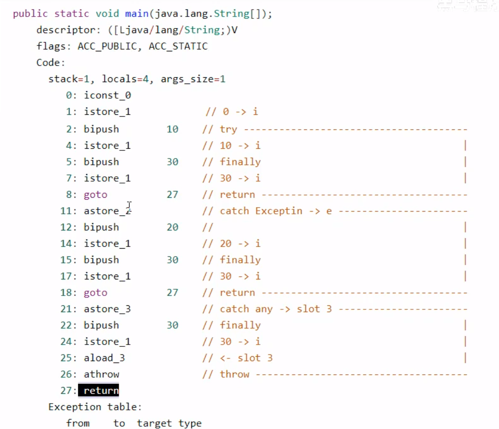
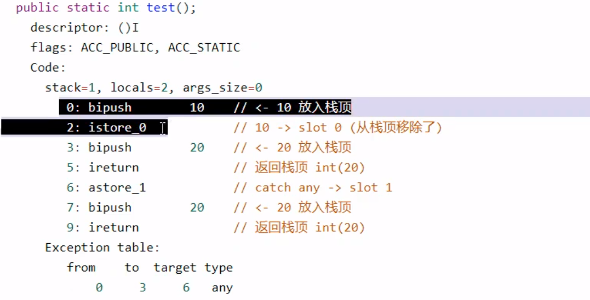

# JVM

康师傅

面试题章节——哔哩哔哩101能回答出来

执行java字节码的虚拟计算机，可以实现跨平台的目标

1. 一次编译，到处运行
2. 自动内存管理
3. 自动垃圾回收功能

## jre，jvm，jdk的关系

jdk：java的核心，包括java运行环境，java工具以及java基础类库

jre：包含jvm的标准实现，和java的类库，指java运行环境，

jvm：java虚拟机，java运行的环境

## jvm结构


方法区和堆是多线程共享的，而栈，本地方法栈，程序计数器是线程各自独一份的。


### java代码执行过程


java编译器是基于栈的指令集架构，另一种指令集架构是基于寄存器的指令集架构。

基于栈的设计具有较好的跨平台性，指令集小，但指令多

解释器：堆字节码文件进行逐行解释，即使是一个for循环也需要重复解释，运行慢（在执行引擎这一章有详谈）

JIT：将一些频繁调用的代码翻译为机器指令，并缓存起来，翻译的过程可能比较长

### JVM的生命周期

启动：通过引导类加载器创建一个初始类来完成

执行：程序开始时才开始运行，程序结束执行结束，执行一个java程序，就是执行一个虚拟机进程

退出：程序正常结束，或者出现异常，错误，

### jvm虚拟机类型

sun classic jvm  ：只提供编译器没有JIT——没有方法区概念

exact VM：提供准确的内存管理——没有方法区概念

hotspot VM：热点代码探测技术

JRockit：针对服务器的应用，不包含解释器

J9：仅针对IBM的应用快速

Azul VM  & Liquid VM：与通用硬件结合

### 类加载器子系统

作用：从文件系统或者网络中加载Class文件，class文件在问价开头有特定的文件标识

ClassLoader负责加载class文件，由execution engine决定是否可以运行，加载的类信息存放于方法区的内存空间，方法区还会存放运行时的常量池信息，包括字符常量和数字常量，

加载过程包括：加载—>验证-> 准备 ->解析-> 初始化


#### 加载阶段：

1. 通过类的全限定名获取此类的二进制字节流
2. 将这个字节流代表的静态存储结构转化为方法区的运行时数据结构
3. 在内存中生成一个代表该类的Class对象，作为方法区这个类的各种数据的访问入口

获取.class的方式

1. 本地文件，网络
2. 动态代理
3. 其他文件的生成

#### 连接阶段

##### 验证

1. 确保class文件的字节流符合jvm的要求，保证安全，就是之前说的特定标识（cafebabe）
2. 有四种验证，文件格式验证，元数据验证，字节码验证，符号引用验证

##### 准备

1. 为类变量(static)分配内存，并设置类变量的默认初始值(0)
2. 如果类变量被用final修饰，就会在该阶段初始化为指定的值
3. 不会为实例变量分配初始化，类变量分配在方法区中，实例变量随对象分配到java堆中

##### 解析

1. 将常量池中的符号引用变为直接引用——链接实际的方法
2. 一般在初始化完成之后，再开始解析——多态
3. 符号引用：符号引用用一组符号来标识目标，直接引用是指向目标的指针，相对偏移量等（在GC阶段）

#### 初始化

1. 执行类构造器方法<clint>(),jvm会自动收集**类变量**的赋值动作完成初始化，构造器方法按照源文件中语句出现的顺序进行执行

   ```java
   public class ClassInit{
   	private static int num = 1;
   	static {
   		num = 2;
   		number = 20;
           System.out.println(num);
           //System.out.println(number);这句话报错，非法前向引用，因为声明number的语句在后面
   	}
   	private static int number = 10;
   	
   	public void main(String[] args){
   		System.out.println(number);//结果为10
   	}
   }
   ```

2. 虚拟机必须保证一个类的<clinit>()方法在多线程下被同步加锁，类的静态代码块在该阶段执行，该机制下如果初始化类时时间长，很可能导致其他线程阻塞

### 类加载器分类

1. 两类：引导类加载器和自定义加载器，自定义类加载器一般是将所有派生于抽象类ClassLoader的类加载器都划分为自定义类加载器，下面这些类的关系是包含关系，而非继承关系，


2. 对于用户自定义类，默认采用的是SystemLoader，对于java核心类库，采用的是引导类加载器（String等），bootstrapClassLoader

#### 具体类型

启动类加载器bootstrapClassLoader：由C++编写，仅加载java核心类库，用于提供JVM自身需要的类，**不继承自java.lang.ClassLoader**，会加载扩展类和应用程序类加载器，并指定为他们的父类

扩展类加载器extension Classloader：父类为启动类加载器，加载jre/lib/exti子目录下的加载类库，派生于ClassLoader

应用程序类加载器：java编写，父类加载器为扩展类加载器，派生于ClassLoader，负责加载环境变量classpath或者系统属性java.class.path指定路径下的类库

用户自定义类加载器：

为什么：

1. 隔离加载类
2. 修改类加载方式
3. 扩展加载源
4. 防止源码泄露

#### 双亲委派机制

1. java对class文件采用按需加载的方式，仅当需要使用到该类时才会将class文件加载到内存生成class对象，而且在记载class文件时，采用的是双亲委派模式，将请求交给父类处理，是一种任务委派模式
2. 如果一个类加载器收到了类加载请求，他会把这个请求交给父类加载器去执行，
3. 如果父类加载器还存在其父类加载器，则进一步向上委托，依次递归，直到达到顶层的启动类加载器
4. 如果父类加载器可以完成类加载任务，就成功返回，如果并不能，子加载器才会自己执行加载

##### 双亲委派的优势

1. 避免类的重复加载
2. 保护程序安全，防止核心API被修改，不允许定义包名为java.lang包（沙箱安全机制）

##### 两个类对象相同

1. 类的完整类名必须相同
2. 加载类的classloader必须相同

#### 类加载器的引用

jvm必须知道一个类型是启动加载器加载的还是用户加载器加载的，如果该类是用户类加载器加载的，那么jvm将把该类加载器的引用作为类型信息保存到方法区中。

#### 类的主动使用与被动使用

主动使用

1. 创建类实例
2. 访问某个类或接口的静态变量
3. 调用类的静态方法
4. 反射forName
5. 初始化一个类的子类
6. java虚拟机标记为启动类的类
7. 动态语言支持

被动使用：处了上面的7种，主动使用与被动使用的区别在于，被动使用不会导致类的初始化

### 运行时数据区running data area


上图中红色部分是线程共享的，第二个图为各自线程独有的。在java中一个JVM实例对应一个runtime，可以通过getruntime来获取。


线程

1. 虚拟机线程：JVM达到安全点时才出现
2. 周期任务线程：
3. GC线程：垃圾回收行为
4. 编译线程：
5. 信号调度：

#### GC以及Error在运行时数据区的分布情况

1. 程序计数器：没有error，没有GC
2. 虚拟机栈：有OOM，有StackOverflow，没有GC
3. 本地方法栈：有OOM，没有GC
4. 方法区：有error，有GC
5. 堆：有error，有GC

#### 程序计数器

JVM中的PC寄存器是对物理PC的寄存器的一种模拟，

PC寄存器**作用**：用来存储指向下一条**指令**（查看汇编指令）的地址，也就是即将要执行的代码，由执行引擎来执行下一条指令。是程序控制流的指示器，完成分支，循环，跳转等基础功能。没有OOM(OutOfMemery)异常

PC寄存器中存储的是字节码指令地址，作用是：CPU需要不断地切换线程，当线程切换回来时，需要知道从哪里开始执行，JVM的字节码解释器通过改变PC寄存器的值来明确下一条要执行的字节码指令。

如果执行的是Java程序指令，记录的是java字节码对应的指令地址，如果执行的是本地方法，对应的是空

#### 虚拟机栈

虚拟机以方法作为最基本的执行单元，栈是运行时的单位，即解决了程序如何执行的问题，而堆是存储的单位，解决了数据的存储问题。

**生命周期**：和线程是一致的

**作用**：主管java程序的运行，保存方法的局部变量，部分结果，并参与方法的调用和返回

对栈来说没有垃圾回收机制，但是有内存溢出，例如递归

##### 栈的存储单位

每个线程都有自己的栈，栈中的数据是以栈帧的格式存在的，每个线程上正在执行的方法对应一个栈帧，在一条活动线程中一个时间点上，只会有一个活动的栈帧，即只有当前正在执行的方法的栈帧是有效的。如果在该方法中有新的方法被调用，就会有新的栈帧被创建出来。栈帧的大小在编译期间就已经确定

##### 栈运行原理

1. 不同的线程所包含的栈不允许存在相互引用，
2. 方法返回时，会将返回值传给下一个栈，并将栈帧弹出

###### 栈帧的内部结构

1. **局部变量表**
2. **操作数栈**
3. 动态连接（指向运行时常量池的方法引用）
4. 方法返回地址（方法正常退出或异常退出的定义）
5. 附加信息

###### 局部变量表

1. 定义为一个数字数组，主要存储方法参数和定义在方法体内的，这些数据包括各类基本数据类型，对象引用以及returnAddress
2. 局部变量建立在线程的栈上，为线程私有
3. 局部变量表所需的容量大小在编译期就能够确定，在运行期间不会更改

一个栈帧的大小很大程度上收局部变量表的影响，且局部变量表中的变量仅在当前方法的调用中有效

**局部变量表的存储单元**

1. 存放在数组中，一个存储单元称之为slot，存放在编译期可知的各种基本数据类型，其中32位以内的类型仅占用一个slot，而64位的占两个slot，数组中的变量按照申明顺序顺序存放
2. 如果当前帧是由构造方法或者实例方法创建，那么该对象引用会存放到局部变量表中的index=0的单元，因此对于静态方法，就是由于this不存在于它的局部变量表所以不能够在静态方法中使用
3. 数组里面的slot是可以重复利用的，体现就是方法里面的局部代码块
4. 对于java里面变量的分类可以分为：
   1. 1）基本数据类型，引用数据类型
   2. 2）按照声明的位置分：
      1. 成员变量：成员在使用前均经过了默认初始化赋值。
         1. 类变量，在linking阶段给其赋予了默认值，在initial阶段实现类变量初始化
         2. 实例变量：随着对象的创建会在堆空间中分配实例变量空间，并进行默认赋值
      2. 局部变量，在使用前必须进行显式赋值

```java
public void test(){
	int num;
	System.out.println(num);//报错
}
```

###### **操作数栈**

后进先出的操作数栈，在方法执行的过程中，向栈中写入或者提取数据

作用：保存计算的中间结果，同时作为计算过程中变量临时的存储空间，如果被调用的方法具有返回值，那么返回值将被写入栈顶

限制：每个操作数栈在编译之后就确定了，32bit的类型占1个栈深度，64bit的占2个栈深度

实现：操作数栈是基于数据实现的，但是只能通过栈的操作来获取或存入数据，不能用索引来获取

###### i++与++i有什么区别——字节码篇章，要会

1. i1 = 10，i1++ ；i2 = 10; ++i2;
2. i3 = 10;i4 = i3++;i5 = 10;i6 = ++i5
3. i7 = 10;i7 = i7++; i8 = 10;i8 = ++i8;
4. i9 = 10; i10 = i9++ + ++i9 + i9--;（结果为11和34）

对以上的问题用字节码进行解释

1. a++和++a的区别在于先执行iload（加载获取变量）还是先执行iinc（自增1，这个操作直接发生在局部变量表的slot上）
2. 下面的图片中对第四问的解答过程，bipush，向操作数栈加入10，istore_1将10弹出保存在变量1的位置，iload1加载变量1的数值到操作数栈，innc执行a++，将变量1自增1（1 1表示自增的变量为1，自增1），变量1变为11，此时操作数栈中的数还是10，执行innc变量1自增1，变量1为12，而操作数栈中仍为10，iload，加载变量1，栈中存有两个数10和12，执行iadd，两数相加，压入栈中，操作数栈中为22，iload加载变量1，操作数栈中有两个数22和12，innc对变量1自减1，变量1为11，iadd操作数栈中两数相加，压入栈中，栈中结果为34，istore2，将操作数栈中结果弹出，保留到变量2的位置，就是b的结果


上面的图片为第四问的字节码（部分，不包含打印）

另一道经典的习题

```java
public class Test {
    public static void main(String[] args) {
        int i = 0;
        int x = 0;
        while (i < 10) {
            x = x++;
            i++;
        }
        System.out.println(x);
    }
}//结果为0
```

这上面的结果用字节码来解释就能解释通

1. 对于x = x++;这一步的字节码先执行iload，将x的值0加载到操作数栈中，接着对局部变量表中的x进行加1操作（x=1），然后又弹出操作数栈中的x并将它写入到局部变量表中的x，所以不管这个循环执行几次，最后的结果都是0

###### 动态连接**

1. 每个栈帧内部都包含一个指向运行时常量池中该栈帧所属方法的引用，包含该应用的目的是为了实现当前方法的代码能够实现动态连接
2. java源文件被编译到字节码文件中时，所有的变量和方法引用都作为符号引用保存在常量池中，动态连接的作用就是将这些符号引用转换为方法的直接引用

###### 方法调用

1. 静态连接：一个字节码文件被装载进JVM内部时，如果被调用的方法在编译期可知，且运行时保持不变，那么将调用方法的符号用户变为直接引用——早期绑定（静态方法和私有方法）
2. 动态链接：被调用的方法在编译期无法确定，只能够在运行期确定，就称为动态链接——晚期绑定，例如java里面的多态
3. java中任何的普通方法都具有多态的特征，除非用final来修饰，或者私有方法

1. 非虚方法:在编译期就能确定具体的调用版本，这个版本在运行时不可变，称为非虚方法，包括静态方法，私有方法，final方法，实例构造器，父类方法都是非虚方法
2. 其他的在编译期不能确定的方法
3. 调用指令：普通调用：**invokestatic，invokespecial，**invokevirtual，invokeinterface，动态调用指令：invokedynamic，加粗的两个对应的是非虚方法

###### 方法重写的本质

1. 找到操作数栈顶的第一个元素所执行的对象的实际类型，记作C
2. 如果通过类型C找到与常量中的描述符和简单名称都相同的方法，就进行访问权限校验，如果通过就返回方法的直接引用，如果不通过，就返回异常
3. 如果没有找到，就从下往上寻找各父类，重复2步骤中的过程，如果始终没找到，就抛出异常AbstractMethod异常
4. java中动态分派使用频繁，因此为了提高性能，在JVM在类的方法区建立一个虚方法表，使用索引进行查找，**虚方法表在链接阶段被创建和初始化完成，具体来说是解析阶段**

###### 重载

虚拟机栈在重载的时候是通过参数的静态类型而不是实际类型作为判断依据的，

###### **方法返回地址**

1. 存放调用该方法的PC寄存器的值
2. 方法的结束由两种方式，正常执行退出，未处理的异常，
3. 方法退出之后都将返回方法被调用的位置，方法正常退出时，方法的调用者的PC计数器作为返回地址，即调用该方法的指令的下一条指令的地址。通过异常退出时，需要使用异常表来确定

##### 栈的面试题

1. 栈溢出的情况：StackOverflow 通过-Xss设置栈的大小
2. 调整栈大小，能保证不溢出吗：不能
3. 分配的栈内存越大越好吗：可能挤占其他线程的内存空间
4. 垃圾回收会设计到栈空间吗：不会
5. 方法中定义的局部变量是否线程安全：如果局部变量是在方法内部进行定义并初始化的，且仅在方法内部被使用，是线程安全的。如果局部变量是通过参数传递进去的，是线程不安全的。或者局部变量被发布出去了就是不安全的

```java
public void build(){
	StringBuilder s1 = new StringBuilder();//线程安全
	s1.append("a");
	s1.append("b");
}
public void getBuild(StringBuilder s2){//线程不安全
    s2.append("a");
}
public StringBuilder releaseBuild(){
    StringBuilder s1 = new StringBuilder();//线程不安全
    s1.append("b");
    return s1;
}
```

### 本地方法库

本地方法被用native修饰，由非java语言实现，

虚拟机栈用于管理java方法的应用，本地方法栈用于管理本地方法的调用本地方法栈也有OOM异常。有本地方法接口调用并由执行引擎执行

### 堆

在一个进程中是唯一的，一个进程对应一个JVM实例。java堆区在JVM启动的时候就被创建了，它的大小也就确定了。通过指令-Xms10m，-Xmx20m设置堆空间最小为10m，最大为20m，可以在堆中划出线程独有的一个内存区域。

作用：**几乎**所有的**对象实例以及数组**都应当在运行时分配在堆上，数组和对象可能永远不会存在栈上，因为栈帧中进保存引用，这个引用指向对象或者数组在堆中的位置

例如局部变量表里面存的实际上是对象的引用，真正的对象在堆里，方法结束之后，堆空间执行GC之后才会被回收

#### 堆的内存细分

jdk1.7：新生区+养老区+永久区

jdk1.8：新生区+养老区+元空间

也就是新生代，老年代，目前修改堆的大小，只会影响新生代，老年代

##### 堆空间大小设置

-Xms:==-XX:InitialHeapSize:设置初始内存大小（新生代+老年代）

-Xmx:==-XX:MaxHeapSize：设置最大内存大小

```java
long initialMemory = Runtime.getRuntime().totalMemory();//返回当前JVM的堆内存大小，返回的结果比实际设置的小一些，与伊甸园区的分配有关
long maxMemory = Runtime.getRuntime().maxMemory();//但会jvm试图使用的最大堆内存
```

默认：初始内存大小，物理内存大小/64，物理内存大小/4，一般开发都会设置成一样的，因为要释放掉内存也要耗费系统资源

命令行查看方式

```
//方式一
jsp//查看进程
jstat -gc 进程id
//方式二
-XX:PrintGCDetails打印GC相关的细节
```

stackoverflowerror,outofmemoryerror是错误，而非异常

##### 年轻代与老年代

###### java对象的分类

1. 生命周期短：创建与消亡非常迅速
2. 生命周期长

**java的堆区进一步细分可以分为新生代和老年代**

新生代可以划分为Eden区，survivor0空间和survivor1空间，这两个survivor区的大小相同，在上面的示例代码中计算出的内存比较小，就是因为这两个区最多同时使用一个区


各区比例：新生代：老年代=1：2，eden区：survivor0：survivor1=8：1：1

**几乎**所有的对象都在新生代中产生，且几乎所有对象的销毁都在老年代

#### 对象分配过程

对象创建发生在eden区，当eden区满的时候，进行GC回收，将未被回收的对象转移到survivor0中，这部分对象附加一个年龄计数器，当eden又一次触发GC回收内存时，eden区与survivor0区都发生垃圾回收，并将未被回收的转移到survivor1区中（如果survivor放不下就直接晋升老年代），年龄计数器加1，重复此过程，当年龄计数器达到一定大小时，就将这部分对象移动到老年区。survivor区的GC回收是被动的，只有eden区触发GC回收时，才会开始GC，该区域可能有内存容量不够的问题。后面有解释。也有可能未达到年龄就分到老年代了。


#### minor GC，major GC，Full GC

重点是后面两个

JVM进行GC的时候并不是三个区域（新生代，老年代，方法区）一起回收的，主要是新生代

1. 新生代收集（minor GC）：针对新生代的垃圾回收
2. 老年代收集(Major GC)：针对老年代的回收，目前仅有**GMS GC**回有单独针对老年代的回收
3. 混合收集（mixed GC）：收集新生代和老年代，G1 GC有该行为
4. 整堆收集（full GC）：收集整个java堆和方法区

##### minor GC

出现情景：eden区空间不足时触发，survivor满不会触发minor GC，会触发STW（复制算法），暂停用户线程。

##### Major GC

出现情景：老年代的GC，老年代空间不足时会先触发一次minorGC，再执行major GC，major GC的速度比较慢

##### Full GC

1. 执行System.gc()
2. 老年代空间不足
3. 方法区空间不足
4. 通过minor GC进入老年代的平均大小超过老年代可用内存
5. 由eden区向survivor赋值对象，对象太大无法复制，转向老年代复制，而老年代的空间也不足时

#### 堆空间分代思想

1. 不同的对象生命周期是不同的，大部分对象的生命周期比较短
2. 不分代也是完全可以的，分代主要是为了优化GC性能

#### 内存分配思想

分配规则：

1. 优先分配到eden区
2. 大对象分配到老年代中
3. 长期存活对象分配到老年代
4. 动态对象年龄判断：survivor区中相同年龄的对象的大小总和大于空间的一半，年龄大于或等于概念的对象直接进入老年代
5. 空间分配担保：-XX:handlePromotionFailure：检查老年代中最大可用剩余空间是否大于历次晋升到老年代的对象的平均大小

#### 对象分配过程

##### 原因

1. 堆是线程共享的区域，任何线程都可以访问堆中的共享数据
2. 对象实例的创建在JVM中比较频繁，因此并发环境下从堆区中划分内存空间并不安全
3. 为避免不同线程使用同一地址，需要使用加锁机制

##### 定义

1. 对eden区进行进一步划分，为每个线程分配一个私有缓存区域，确保线程安全，当分配的区域用完了之后，再使用eden公共的区域，这个区域在使用时会进行加锁
2. 每个TLAB仅占1%，


#### 堆空间参数的设置——面试会问

1. -XX:PrintFlagsInitial:参看参数默认值
2. -XX:PrintFlagsFinal:参看参数当前值 jps参看当前进程，jinfo -flag  参数 进程id
3. -Xms:堆空间初始内存
4. -Xmx:堆空间最大值
5. -Xmn:设置新生代大小（初始值和最大值）
6. -XX:NewRatio:新生代与老年代的堆占比
7. -XX:SurvivorRatio:eden与survivor比值
8. -XX:MaxTenuringThreshold:设置新生代垃圾的年龄
9. -XX:+PrintGCDetails:输出GC日志
10. -XX:+PrintGC
11. -XX:HandlePromotionFailure:设置空间分配担保
12. -XX:+DoEscapeAnalysis:开启逃逸分析，-号标识不开启
13. -XX:+EliminateAllocation:开启标量替换
14. -XX:+MaxPermSize:jdk7以前设置方法区上限，-XX:MetaspaceSize:jdk8之后

最后11这个参数的解释：发生GC之前，会检查老年代的最大可用连续空间是否大于新生代所有对象的总空间

1. 如果大于，这次GC是安全的
2. 如果小于，虚拟机会检查11这个参数，如果该参数被设置为true，那么会继续检查老年代最大可用连续空间是否大于历次晋升到老年代的对象的平均大小，如果大于，尝试进行一次GC，但是存在风险，如果小于，就进行一次Full GC。如果该参数为false，直接进行full GC

#### 堆是分配空间的唯一原则吗

不是

如果一个对象经过逃逸分析之后发现，该对象并没有逃逸出方法的话，就可以被优化为栈上分配，例如taobaoVM，

逃逸分析的原理：

1. 如果一个对象仅在方法的内部被调用，该对象可用被栈来分配
2. 如果对象被发布，就不可以

##### 栈上分配

一个对象没有发生逃逸，就可以进行栈上分配，

##### 同步省略

编译同步代码块时，可以通过逃逸分析分析同步代码块是否只能够被一个线程访问而没有发布到其他的线程，如果没有就可以消除这部分同步，称之为锁消除。

##### 代码优化

如果一个对象可以不作为一个连续的内存结构被访问，那么该对象就可以不存在内存中，而存入CPU寄存器，例如标量替换。一个对象通常有许多标量来构成，如果这个对象仅在局部被使用，那么而已采用标量替换的方式进行替换，将标量存到局部变量表上

### 方法区


栈，堆，方法区的对应关系

存在error和GC情况

方法区：与堆一样，是各个线程共享的内存区域，方法区的大小决定了系统可以存放多少个类，可有可能抛出OOM（加载太多第三方jar包，大量动态生成的放射类），方法区用于存放相关的类信息。方法区是随用随加载的。

jdk7以前-XX:+MaxPermSize:设置方法区上限，默认20.75M，最大32位64M，64位82M

如果内存较小，可能频繁触发full GC

#### 方法区的结构


方法区中存放的内容包括，类型信息，常量，静态变量，JIT编译器编译后的代码缓存

类型信息：这个类型的完整有效名，直接父类的完整有效名，类的修饰符，实现接口的列表

field信息：域名称，域类型，域修饰符

方法信息：方法名称，返回类型，方法参数数量以及类型，方法修饰符，**异常表**

被声明为final static的变量在编译期就会被确定，在编译阶段就会被赋值(注意编译和加载不是一个阶段)

##### 运行时常量池

字节码文件中包含常量池，常量池中包含了各种字面量和对类型，域和方法的**符号引用**，虚拟机根据这张表通过索引找到要执行的类名，方法名和参数类型，字面量等，动态特性

其中的数据类型包括：

1. 数量值
2. 字符串值
3. 类引用
4. 字段引用
5. 方法引用

运行时常量池：字节码中的常量池，经过加载之后就称之为运行时常量池。运行时常量池是方法区的一部分

##### 方法区的变化

1. 1.6之前，具有永久代，静态变量存放在永久代上
2. jdk7之前，逐步除去了永久代，
3. jdk8之后，没有永久代，类型信息，字段，方法，常量保存在本地内存元空间，但是**字符串常量池**，静态变量在堆中——静态引用对应的实体始终是在堆空间的，看下面的代码

原因：

1. 因为为永久代设置空间大小较为蛮烦，难以确定，元空间与永久代之间的区别在于元空间不在虚拟机中，而是使用本地内存，因此默认情况下，元空间的大小仅受本地内存的限制
2. 对永久代进行调优比较困难

```java
public class{
	private static byte[] arr = new byte[1024];
}
```

上面的代码编译之后会发现，new byte这个对象被保存在堆中，但是arr这个变量名在jdk7，8中是在堆中，在jdk6及之前就是在方法区（永久代实现）中

##### 方法区的垃圾回收——hotspot会进行回收，但效果不好，原因就是判断标准很严格

包括两部分：常量池中废弃的常量和不再使用的类型

1. 字面量：文本字符串，被声明为final的常量值
2. 类和接口的全限定名，字段的名称和描述符，方法的名称和描述符

判断废弃的标准

1. 对空间中不包含类的实例，包括所有的子类的实例
2. 类加载器已经被回收
3. 对应的class对象没有在任何地方被引用

### 对象实例化

#### 对象创建的方式

1. new
2. Class的newInstance()：反射，仅能调用空参构造器，权限必须是public
3. Constructor的newInstance(XXX)：反射，对权限没有要求
4. 使用clone：当前类必须实现cloneable接口，实现clone()
5. 使用反序列化：从文件或者网络获得对象的二进制流
6. 第三方库

#### 对象创建步骤

1. 判断对象对应的类是否加载，链接，初始化
   1. 类的初始化步骤，之前的类加载过程
   2. 遇到一条new指令，先在元空间的常量池中虚招定位一个符号引用，并检查所代表的类是否被加载，解析和初始化，如果没有，就使用当前类加载器在双亲委派模式下，进行查找响应的.class文件，找到了就加载，找不到就报错
2. 为对象分配内存——开辟一块空间
   1. 如果内存规整，指针碰撞
   2. 如果内存不规整，虚拟机需要维护一个列表，
3. 处理并发安全问题
   1. 策略一：采用CAS配上失败重试保证原子性
   2. 策略二：每个线程预先分配一块TLAB
4. 初始化分配到的空间——所有属性设置默认值，保证对象实例字段在不赋值时可以直接使用
5. 设置对象的对象头——后面讲
6. 执行init方法进行初始化——调用构造器方法

##### 对象的内存布局——重点

1. 对象头
   1. 运行时元数据：包括哈希值，GC分代年龄，锁标记状态，线程持有的锁，偏向线程，偏向时间戳（8字节）
   2. 类型指针：指向类元数据，确定该对象所属的类型。getClass方法就是这样实现的（8字节），经过压缩会变成4字节，内存超过32G会自动失效
   3. 如果创建的是数组，还需要记录数组的长度
2. 实例数据
   1. 对象真正存储的有效信息，包括程序代码中定义的各种类型的字段
   2. 规则
      1. 相同宽度的字段放在一起
      2. 父类中定义的变量出现在子类之前
3. 对齐填充——JVM里面的寄存器是8字节，他会保证对象长为可被8整除的字节数，效率高


##### 对象访问定位


hotspot通过直接指针

1. 间接指针：通过示例数据指针以及类型数据指针找到对象：优点：在GC回收时比较稳定——句柄访问，堆空间中会有一个专门的句柄池
2. 直接指针：通过直接指针找到对象，对象中有另外的指针能找到类型信息：优点：快

#### **使用句柄**

使用句柄访问的话，Java堆中将会划分出一块内存来作为句柄池，reference中存储的就是对象的句柄地址，而句柄中包含了对象实例数据与类型数据的具体各自的地址信息。如下图所示：


#### **直接指针**

使用直接指针访问的话，Java堆对象的布局中就必须考虑如何放置访问类型数据的相关信息，reference中存储的直接就是对象地址，如下图所示：


这两种对象访问方式各有优势：

- 使用句柄来访问的最大好处就是reference中存储的是稳定句柄地址，在对象被移动（垃圾收集时移动对象是非常普遍的行为）时只会改变句柄中的实例数据指针，而reference本身不需要被修改。
- 使用直接指针来访问最大的好处就是速度更快，它节省了一次指针定位的时间开销，由于对象访问的在Java中非常频繁，因此这类开销积小成多也是一项非常可观的执行成本。

##### 对象的分配

就是在栈上，TLAB，堆上的分布情况

### 执行引擎

java虚拟机核心组成部分之一

JVM的主要任务是装载字节码到内部，但是字节码指令并不能直接在操作系统上执行，需要用执行引擎将字节码转变为本地机器语言

#### java代码编译和执行的过程


解释器：根据预定义的规范对字节码采用逐行解释的方式执行，将字节码内容翻译为对应平台的本地机器指令

JIT：虚拟机将源码？直接翻译为本地机器平台相关的机器语言

##### 解释器

作用：运行时翻译，**逐行**翻译为机器指令

##### JIT（just in time）编译器

将字节码（热点代码）翻译为机器指令并缓存

为什么两个都要保留？

解释器可以立刻执行，不需要等待编译器的翻译过程。但是编译器编译之后执行效率高。

热点代码：执行频率比较高的代码，或者方法中循环次数较多的循环体。热点代码采用热点探测技术来实现——阈值为Client模式下1500次，server模式下10000次，注意这个调用次数并不是调用的绝对次数，而是在一定时间内的次数，在超过一定时间的时候，其计数器就会衰减一半

热点探测的实现：

1. 方法调用计数器：统计方法的调用次数
2. 回边计数器：统计循环体执行的循环次数


修改解析器与编译器使用

-Xint:解释器

-Xcomp:JIT

-Xmixed：混合

## String类

### String的基本特性

jdk1.8内部有char数组来记录字符，1.9采用byte数组来记录字符串，原因是大部分字符串中的字符都是拉丁字符，只需要一个byte就可以存储，因此将其改为byte数组来存字符串，并附加一个编码标记。

#### 不可变性

1. 

字符串常量池不会存储相同的字符串，String的string pool是一个固定大小的hashtable。低层实际就是一个map

String的内存分配

1. 直接用双引号声明出来的String对象会直接放在常量池中
2. 可以使用String的intern方法

#### 字符串的拼接操作

1. 常量与常量的拼接结果在常量池中，原理是编译期优化，查看class文件就发现已经变成连接后的结果了
2. 常量池中不会有相同内容的结果
3. 只要其中有一个是变量，结果就在堆中，这个堆指的是非常量池区域的堆
4. 如果拼接的结果调用intern()方法，则主动将常量池中还没有的字符串对象放入池中，并返回对象地址

```
String s1 = "java";
String s2 = "ee";
String s3 = "javaee";
String s4 = "java"+"ee";
String s5 = s1+"ee";
String s6 = "java"+s2;
String s7 = s1+s2;
System.out.println(s3==s4);//true
System.out.println(s3==s5);//false
System.out.println(s3==s6);//false
System.out.println(s3==s7);//false
System.out.println(s5==s6);//false
System.out.println(s5==s7);//false
System.out.println(s6==s7);//false

String s8 = s6.intern();
System.out.println(s3==s8);//true

```

##### 针对字符串拼接操作

1. 如果是由两个字符串字面量拼接的，会通过编译器优化直接拼接成一个字符串
2. 如果是由变量来拼接的，那么就会新建一个StringBuilder(jdk5之前是StringBuffer)，+号会调用append方法进行拼接
3. =号会调用toString方法。大致相当于new String()

```java
public void test3(){
	String s1 = "a";
	String s2 = "b";
	String s3 = "ab";
	String s4 = s1 + s2;//这里执行的操作就是在低层调用了StringBuilder
	System.out.println(s3==s4);//false
}
```

```java
public void test4(){
	final String s1 = "a";
	final String s2 = "b";
	String s3 = "ab";
	String s4 = s1 + s2;//s1和s2被final修饰，已经是一个常量了，所以被编译器优化了
	System.out.println(s3==s4);//true
}
```

字符串拼接操作不一定是StringBuilder，如果拼接符号两边都是字符串常量或者常量引用，仍然使用编译期优化

使用StringBuilder比直接使用拼接符号的效率要高。因为拼接符号会创建较多的StringBuilder对象，GC耗时高，对StringBuilder的进一步优化可以使用它的构造器，StringBuilder(highevel).

#### intern()——下面这两个例子非常重要

intern确保内存中仅含有字符串的一份拷贝。

```java
String s1 = new String("i love java").intern();
```

jdk1.6中将该字符串对象放入常量池，如果有，就不会放入，返回已有的对象的地址，如果没有，就会把该对象复制一份，放入字符串池中，并返回这个池中的对象地址。

jdk1.7中将这个字符串对象放入池中，如果有就不会放入，返回已有的串池中对象的地址，如果没有就把对象的引用地址复制一份，放入串池中，并返回串池中的引用地址。

##### new String("ab")所创建的对象

1. 由字节码文件可以发现是两个，new关键字会在堆空间中创建一个对象，此外在字符串常量池中还会存放"ab"这个字符串（如果"ab"这个字符串常量之前没有被创建过的话）

##### new String("a")+new String("b")所创建的对象

1. 由字节码文件可以知道
   1. 对象1：new StringBuilder()
   2. 对象2：new
   3. 对象3："a"常量池中的"a"
   4. 对象4：new
   5. 对象5："b"常量池中的"b"
   6. 对于StringBuilder的toString，低层调用new String("ab"),但是在字符串常量池中没有"ab"这个常量

```java
public class StringIntern{
	public static void main(String[] args){
		String s = new String("1");//看上面的点
		s.intern();//调用此方法之前，字符串常量池中已经有"1"了，此时s的指向的还是那个new出来的对象
		String s2 = "1";//指向了之前字符串常量池中的"1"
		System.out.println(s == s2);//jdk6:false jdk7 :false
		
		String s3 = new String("1")+new String("1");//s3变量的地址记录的是new String("11")这个对象的地址
		//执行完上一行代码之后，常量池中不存在"11"这个字符串，
		s3.intern();//在字符串常量池中生成"11",jdk6中创建一个新的"11",该对象有新的地址
        //									jdk7中没有创建"11"，而是创建一个指向堆空间中new String("11")的指针，因此现在"11"会指向new String("11")
		String s4 = "11";
		System.out.println(s3 == s4);//jdk6:false jdk7:true
	}
}
```

```java
public class{
	public static void main(String[] args){
		String s3 = new String("1")+new String("1");
		String s4 = "11";
		s3.intern();//堆中已经有"11"了，导致提交这个new String("11")没有成功
		System.out.println(s3 == s4);//false
        String s5 = s3.intern();
        System.out.println(s5 == s4);//true
	}
}
```

```java
public class Test {//jdk 8以上的测试
    public static void main(String[] args) {
        String s1 = new String("1");
        String s2 = new String("1");
        System.out.println(s1 == s2);//false

        String s3 = new String("1234").intern();//“1234”在常量池中被创建，通过intern返回地址，new String("1234");实际是一个不被引用的对象，之后会被GC
        String s4 = new String("1234");//又创建了一个新的String，
        String s5 = "1234";//常量池中的“1234”
        System.out.println(s3 == s4);//false
        System.out.println(s3 == s5);//true
    }
}
```

##### intern()的空间效率

使用intern()可以节省内存空间

#### StringTable的垃圾回收问题

-XX:PrintStringTableStatistics打印字符串常量池回收信息

##### G1中的String去重

会使用一个hashtable来记录所有string对象的char数组

## GC


垃圾的定义：运行程序中没有任何指针指向的对象，这个对象就是垃圾

为什么需要GC：

1. 不进行垃圾回收，内存总会被消耗完
2. 除了释放没用的对象，GC也可以整理内存中的记录碎片
3. 没有GC不能保证程序正常运行

程序员不需要再手动参与内存管理

### java的垃圾回收机制

GC行为发生再堆以及方法区、

1. 频繁收集新生代
2. 较少收集老年代
3. 基本不动元空间

#### 垃圾回收的算法

##### 标记阶段

当一个对象不在被任何存活的对象引用时，就可以宣判该对象已死亡

##### 引用计数算法——java根本不用

每个对象保存一个整型的引用计数器，记录对象被引用的情况，只要有任何对象引用该对象，其引用计数器就加1，当引用失效时，计数器减1

优点：实现简单，垃圾对象便于识别，判定效率高，回收没有延迟

缺点：

1. 需要单独的字段存储计数器，增加了存储空间的开销
2. 每次赋值都需要更新计数器
3. 引用计数器有一个严重问题是无法解决循环引用的问题。就导致了内存泄露问题（循环链表）

python使用引用计数法作为垃圾标记算法，为解决python中的循环依赖问题，其方式是采用手动解除依赖的方式，其使用weakref库以解决循环依赖问题。python的垃圾回收中还会再维护一个用户不可访问的链表解决循环引用的问题

[Python垃圾回收（GC）三层心法,你了解到第几层？](https://juejin.im/post/5b34b117f265da59a50b2fbe)

##### 可达性算法

可以解决循环引用的问题

定义：可达性算法以根对象集合为起点，由上到下进行搜索，确定被根对象所连接的目标对象是否可达，如果对象没有任何引用链相连，那么对象就被标记为垃圾对象

###### 可达性分析中的对象消失问题

可达性分析中，必须保证该过程在一个能保证一致性的快照中(并发条件下)进行，原因在于在分析过程中如果用户并发地修改对象引用，可能会导致对象消失问题，这就是任何GC收集器都逃不过STW的原因

三色标记法：

完整的对象引用链


对象消失情况一：赋值器插入了一条或者多条从黑色到白色对象的新引用——增量更新


对象消失情况二：赋值器删除了一条或者多条从灰色到白色对象的直接或者间接引用——原始快照

增量更新：当黑色对象插入新的指向白色对象的引用关系时，就将这个新插入的引用记录下来，等并发扫描结束之后，再将这些及路过的引用关系的黑色对象为根，再扫描一遍

原始快照：当灰色对象要删除指向白色对象的引用关系时，就将这个要删除的引用记录下来，并发扫描结束之后再以灰色对象为根，再重新扫描一次

GC root的可用对象：**重点**

1. 虚拟机栈中引用的对象，局部变量表的对象
2. 本地方法栈中引用的对象
3. 方法区中静态属性引用的对象
4. 方法区中常量引用的对象，例如字符串常量池中的引用
5. 所有被同步锁持有的对象
6. java虚拟机内部的引用，类加载器这些
7. 除了固定的GC root对象以外，根据用户选用的垃圾回收器以及回收的内存区域不同，可能还会有其他对象临时加入，例如分代回收和局部回收

使用可达性分析算法必须保证分析工作在一个能保证一致性的快照中进行。STW

#### 对象的finalization机制

java提供了对象终止的机制来允许对象被销毁之前的自定义处理逻辑，当对象被销毁之前，就会自动调用finalize()方法。该方法允许再子类中被重写，但是不要主动调用finalize()方法

1. 对象在GC标记过程中如果不在引用链上，那么对象将会被标记为代回收的对象，如果它的finalize()方法没有被重写或者已经被调用过一次了，那么该对象将会被回收，不执行finalize方法
2. 如果对象被认为需要执行方法，那么对象将进入一个Fqueue列表，有一个优先级较低的线程执行回收，此时将会调用finalize方法，如果待回收对象此时与引用链上的对象建立联系，对象将不被回收，否则就回收了
3. finalize只会被调用一次

#### 使用MAT查看GC roots

查看dump文件

#### 垃圾清除阶段

1. 标记-清除算法
2. 复制算法
3. 标记-压缩算法

##### 标记-清除（mark-swap）

1. 当堆中的有效空间耗尽，就会停止整个程序，进行两项工作
   1. 标记，用可达性分析标记可达的对象
   2. 清除：collector对堆内存进行从头到尾的线性遍历，如果发现某个对象在header中没有标记为可达对象那个，就将其回收

缺点：

1. 效率比较低，在GC的时候需要停止用户线程，且清理出来的空间不是连续的，产生内存碎片，需要维护一个空闲列表
2. 这里的清除并不是将对象置空，而是将需要清除的对象地址保存到一个列表中，当有新对象需要加载时，判断位置是否足够，够就直接覆盖

##### 复制算法

将内存区域分为两块，每次仅使用一块，在进行GC时，将可达的对象复制到另一个内存区域中。

优点：没有标记和清楚过程，实现简单，运行高效，复制过去之后没有碎片问题

缺点：需要两倍的内存空间，需要调整对象的引用关系，时间消耗高，如果垃圾对象很少，效果就不好。不适用于老年代的GC行为

##### 标记-压缩

执行过程：

1. 第一阶段从根节点开始标记所有被引用的对象
2. 将所有的存活对象压缩到内存的一端，按顺序存放
3. 清除边界外的所有空间

优点：

1. 消除了标记清除算法的内存碎片化问题
2. 清除了复制算法的内存减半的代价

缺点:

1. 效率上比较低
2. 需要调整引用地址
3. STW

##### 分代收集算法

不同生命周期的对象可以采用不同的收集方式，提高会后效率

1. 年轻代：区域比较小，对象的生命周期短，存活率低，回收频繁，适合复制算法
2. 老年代：区域较大，生命周期长，存活率高，回收不频繁，采用标记-清除算法或者标记压缩算法

##### 增量收集算法

一次收集所有的垃圾时间较长，可以时应用线程和垃圾收集线程交替进行。

缺点：线程切换和上下文转换消耗

#### 分区算法

堆空间大，GC耗费的时间就长，为了更好的控制GC产生的时间，将一块大的区域切割为多个小块，每次进回收若干个区间，而非整个堆空间，实现减少GC的停顿。

### System.gc()

1. 默认情况下，通过System.gc()或者Runtime.getRuntime().gc()的调用，会显式地触发full gc，但是无法保证jvm一定会立刻执行gc操作。runtime.gc和system.gc是一样的
2. System.runFinalization()就一定会调用finalize()方法

```java
public void localvarGC3(){
	{
		byte[] buffer = new byte[1024*1024];
	}
	System.gc();//这里不会执行buffer空间的回收，因为buffer还占据着局部变量表的位置，因此索引还存在
}
```

```
public void localvarGC3(){
	{
		byte[] buffer = new byte[1024*1024];
	}
	int value = 1;
	System.gc();//这里会执行buffer空间的回收，因为value占用了局部变量表buffer的位置，
}
```

#### 内存溢出

内存不足会爆出OOM，没有空闲的内存，并且垃圾收集器也没有办法提供足够的空间。

#### 内存泄露

对象不再被程序使用到，但是GC又不能够回收，就叫内存泄露

内存泄露的例子：

1. 单例
2. 一些提供close的资源没有被关闭

### 垃圾回收的并行与并发

并行：多条垃圾回收线程并行工作，此时用户线程处于等待状态

串行：单线程执行，

并发：用户线程和垃圾回收线程同时（在同一个时间段）执行

### 安全点与安全区

安全点：程序运行之后并非可以在所有点上都停下来，仅有特定的位置才可以停下来执行GC，这些位置称之为安全区。

实现方式：主动式中断——设置一个中断标志，各个线程运行到Safe Point的时候主动轮询这个标志，如果为真，就将自己挂起

抢占式中断——系统将用户线程全部中断，检查用户线程的状态，如果不是安全点，就启动线程直到最近一个安全点再中断

安全区域：安全点可以保证程序运行时，可以在不太长的时间内进入可GC的安全点，但是线程有的时候会被阻塞，而JVM又不能等待线程唤醒，因此设置安全区域

定义:在一段代码片段中，对象的引用关系不会发生，这个区域中的任何位置发生GC都是安全的

### 写屏障

当采用标记清除算法或者复制算法来整理存活对象时，为了保证对象的引用正确，用写屏障来实现保证

## java中的引用

java中的引用包括强引用，软引用，弱引用和虚引用，这四种引用的强度依次减弱，

1. 强引用：最传统的引用，一般写代码都是用的强引用，只要强引用的关系存在，垃圾回收器就不能回收掉被引用的对象，
2. 软引用：系统**发生内存溢出**之前，将会把这些对象列入回收范围进行第二次回收
3. 弱引用：只被弱引用关联的对象**只能生存到下一次垃圾回收**之前，当GC发生时，无论是否还有空间，都会被回收（2和3一般用于缓存）
4. 虚引用：一个对象是否有虚引用的存在，完全不会对其生存时间构成影响，也无法通过虚引用来获得对象的实例，为对象设置虚引用关联的目的是在垃圾回收时能收到一个系统通知。（对象跟踪）

```java
public void test(){//软引用例子
	User u1 = new User();
	SoftReference<User> userSoftRef = new SoftReference(u1);
	u1 = null;//需要把之前的强引用给取消掉
}
```

```java
public void test(){//弱引用例子
	User u1 = new User();
	WeakReference<User> userSoftRef = new WeakReference(u1);
	u1 = null;//需要把之前的强引用给取消掉
    userSoftRef.get();//从弱引用中获取对象
}
```

```java
public void test(){//虚引用例子
	ReferenceQueue pq = new ReferenceQueue();
	User u1 = new User();
	PhantomReference<User> phantomRef = new PhantomReference<>(u1,pq);
	phantomRef.get();//无法获取虚引用的对象
    u1 = null;
}
```

终结器引用finalReference——实现对象的finalize方法

## GC垃圾回收器

垃圾回收器的性能指标

1. 吞吐量：运行用户代码的时间占运行时间的比例，CPU运行100分钟，垃圾回收用时1分钟，吞吐量就是99%
2. 暂停时间：执行垃圾回收时，程序的工作线程被暂停的时间
3. 内存占用：java堆占用的内存大小

以上三个最多同时满足两个，其中内存是解决问题的关键，暂停时间是重要的性能指标

标准：在最大吞吐量优先的情况下，降低暂停时间

垃圾回收器的演化是从分待算法变到不分代算法

### 常见的java收集器——下面这个要记

串行回收器：Serial，Serial Old

并行回收器：ParNew，Parallel Scavenge，Parallel Old

并发回收器：CMS，G1


新生代收集器：Serial，ParNew，Parallel Scavenge

老年代收集器：Serial Old，Parallel Old，CMS

整堆收集器：G1——jdk9之后作为默认回收器


Serial Old是垃圾回收的备用方案


用jinfo来查看相应的垃圾回收器

#### 串行回收器

serial回收器采用串行回收，复制算法以及STW机制，Client模式下新生代默认的垃圾回收器

serial Old回收器采用串行回收，STW机制以及标记压缩算法进行垃圾回收，CLient模式下默认的老年代回收器，server模式下作为老年代CMS收集器的后备方案，并与新生代的parallel Scavenge配合使用

优势：简单高效，在内存不大的环境下使用效果还行，仅有一个垃圾回收线程

代码使用：-XX:+UseSerialGC使用串行垃圾回收器

#### ParNew并行回收器

有多个GC线程，负责新生代的垃圾回收，**有STW机制，采用复制算法**，作为JVM的server的默认GC回收器，**与CMS配合使用**，除此之外和Parallel Scavenge没区别

代码：-XX:UseParNewGC

#### Parallel Scavenge回收器——**java8中的默认收集器**

与ParNew回收器相同，采用复制算法，并行回收和STW机制——年轻代的回收器

优点：实现可控制吞吐量，以及自适应调节策略

提供了Parallel Old会激起执行老年代垃圾回收，采用标记-压缩算法

#### CMS回收器（Concurrent-Mark-Sweep），jdk14**中被移除了**

真正的并发回收器，关注点在尽可能缩短垃圾收集时用户线程的停顿时间。采用标记清除算法，也会导致STW，针对老年代进行收集


整个过程分为4个主要阶段

1. 初始标记阶段——在这个阶段所有的工作线程都将会因为STW而停止工作，该阶段仅标记处GC roots能直接关联到的对象，一段标记完成就会恢复之前被暂停的所有应用线程
2. 并发标记阶段——从GCroot的直接关联对象开始遍历整个对象图的过程，这个过程耗时较长但是不需要暂停用户线程，可以与垃圾收集线程并发运行，这段时间可能会有部分原来没标记为垃圾的变成垃圾了
3. 重新标记——由于并发标记阶段中工作线程和垃圾收集线程同时运行导致标记产生变动，因此需要进行修正，该阶段会产生STW，且比初始阶段要长一些，
4. 并发清除——此阶段清理删除掉标记阶段判断的已经死亡的对象。且不需要移动存活对象（标记清除）

**注意点：**由于垃圾回收阶段用户线程没有中断，因此在CMS回收过程中，必须保证用户线程还有足够的内存，所以CMS回收器并不是在老年代装满之后才运行，而是达到某一阈值时就开始。如果CMS运行其间无法保证内存足够，那么就出现Concurrent mode failure失败，并启动**Serial Old**收集器来进行老年代的回收。这一点就是CMS最严重的缺陷

优点：并发收集，延迟低

缺点：内存碎片，CMS收集器对CPU资源敏感，无法处理浮动碎片

#### G1垃圾回收器——jdk8之后的默认

区域分代化——能适用于新生代和老年代，它将堆内存分为互不相关的区域，并跟踪区域内垃圾堆的价值大小，并维护一个回收的优先级列表

G1的性能目标：延迟可控的情况下获得尽可能高的吞吐量

G1收集器针对多核CPU以及大容量内存。

特点

1. 并行性：G1在运行的过程中，可以有多个GC线程并行工作，
2. 并发性：G1拥有与应用程序交替执行的能力，
3. 分代收集，G1任然属于分代型垃圾回收器，会区分年轻代和老年代，
4. G1将内存划分为一个个的小块，内存的回收以region作为单位，region之间采用的是复制算法。
5. 可预测的停顿时间模型

##### G1的缺点

较高的内存占用以及CPU占用

##### G1回收器的使用场景

大内存，多处理器的场景

##### region结构

一个region可能属于eden，survivor，old 内存区，humongous大对象区，对象大小超过1.5个region放在该区域

##### G1回收器的细节

1. 年轻代的eden区耗尽开始回收时，G1的年轻代收集阶段是一个并行的独占式收集器。在年轻代收集期间，G1暂停所有的应用线程，启动多线程执行年轻代回收。
2. 当堆内存达到45%时，触发老年代并发标记过程
3. 标记完成执行混合回收阶段，——回收全部young region和部分old region

##### G1中的记忆集问题

问题：一个region里的对象可能被其他region的对象引用，这样会导致回收新生代可能需要扫描老年代，导致年轻代的垃圾回收变慢，解决跨代引用问题《虚拟机》P77 101

解决：采用remember set来避免全局扫描，每个region都有一个记忆集。每次reference类型数据写操作时，都会产生一个write barrier来暂时终端操作。

##### G1回收器的过程


1. 过程一：eden园区耗尽，G1启动youngGC过程，**只回收eden和survivor**，YGC时，G1会停止所有的应用程序的线程（STW），G1创建回收集，会收集中包含eden区和survivor区中的数据
2. 过程二：并发标记过程——针对老年代的回收过程
3. 过程三：混合回收——当越来越多的对象存到老年代的时候，为避免堆内存耗尽，会触发一个Mixed GC，该GC过程除了回收整个young region之外还会回收部分old region，回收的old region根据之前标记的优先级列表进行回收，Mixed GC并不是full GC
4. 过程四：可选的full GC——原因evacuation的时候没有足够的空间来妨对象，并发处理过程完成之前空间耗尽


步骤：

1. 初始标记：仅标记GC roots中能够访问到的对象，并修改TAMS指针，该阶段会触发STW，但是时间很短
2. 并发标记：从GC root开始进行可达性分析，递归扫描堆里的对象图，找出要回收的对象，该过程时间比较长，但是可以与用户线程并发进行
3. 最终标记：对用户线程做另一个暂停，处理并发阶段对象引用改变造成的SATB
4. 筛选回收：根据各region的回收价值大小以及回收成本排序指定回收策略，一次仅回收部分region区域

## 调优分析

原因：

1. 大内存的部署策略
2. 集群间同步导致的内存溢出
3. 堆外内存的溢出——本地方法区这部分有可能导致OOM
4. 外部命令导致异常
5. 服务器虚拟机进程崩溃导致异常
6. 不恰当的数据结构
7. windows虚拟内存导致的异常
8. 安全点导致的长时间停顿

### 调优方式

1. 调整堆的大小
2. 进行编译以及类加载时间，没啥用了
3. 调整内存设置控制垃圾收集频率
4. 选择收集器降低垃圾收集时间

## class文件

### class文件结构

class文件是以8位字节位基础单位的二进制流——class文件按打开后看到的是16进制表示的


包含的内容：

第一列：标号

魔数（cafebabe）：用作校验，标识是否为class类型的文件

class文件版本：魔数后面4个字节，对应的就是版本号（大小版本）

常量池：constant_pool，第8和9字节标识常量池的长度，`00 23`表示一共有35项，但是第0项不计入，所以实际上有34项，`0a 00 06 00 15`其中0a对应二进制10，需要查表发现其代表一个方法信息，后面**固定的4字节**为方法的相关信息（这一部分内容是需要查表的，不同的信息对应的字节长度是不一样的），其根据00 06 和 00 15来获取方法的**所属类和方法名**，

访问标志：public还是friendly，2字节，查表

类型信息：自身的类信息（2字节，全限定名），父类信息（2字节，父类全限定名），接口信息（接口信息），域信息（2字节），方法信息（2字节的访问修饰），

附加信息

### 字节码指令

构造函数的字节码指令：`2a b7 00 01 b1`

a2=>aload_0 加载slot 0 的局部变量

b7 =>invokespecial预备调用构造方法，00 01代表引入常量池中的1项

b1表示返回信息

用javap来反编译阅读文件

### 构造方法

<clinit>()将所有的静态代码块从上到下进行合并，构成一个构造方法，在前面有将——加载阶段的初始化

<init>()将所有的初始化代码块从上到下进行合并，构成一个新的构造方法，用户定义的构造方法会被附加在<init>的最后执行

### 方法调用的字节码指令


#### 多态调用的原理

invokevirtual对于普通的public方法，因为有可能在子类中被重写，因此需要进行多态的调用

多态调用invokevirtual方法的执行过程

1. 先通过栈帧中的对象找到对象头，
2. 分析对象头，找到对象实际的Class
3. Class的结构中有vtable，在类加载的链接阶段就已经根据方法的重写规则生成好了
4. 查表得到方法的具体地址
5. 执行方法的字节码

#### 字节码中异常的处理

方法的字节码中有一个异常表，该表的结构如下所示，会监控from和to之间的代码块，target为跳转目标，如果发生了type中描述的异常就会执行跳转

| from |  to  | target |           type            |
| :--: | :--: | :----: | :-----------------------: |
|  2   |      |        | Class java/lang/Exception |

try catch finally中finall能够被确保执行，由字节码来进行解释就是，finally语句块中的代码被复制到了每一个try，catch语句块的后面，保证执行，此外为了确保即使catch捕获不到异常时，finally也能执行，字节码中还会添加一个catch，该catch来捕获未被捕获的异常，并执行finally的语句



一个标准的try catch finally语句块最后会有一个athrow指令，该指令用于抛出异常，

```java
public static void main(String[] args){
	try{
		return 10;
	}finally{
		return 20;
	}//最后的返回结果是20
}
```



这里与上面的finally的差别在于，finally中有一个return语句块，导致指令中没有athrow，这可能会导致吞掉异常

```java
public static int test(){
	int i = 10;
	try {
		return i;
	}finally{
		i = 20;
	}//最后的返回结果为10，返回的是操作数栈顶的值
}
```

他的字节码文件如下：（finally没有return语句，不会吞throw）


#### synchronized代码块

字节码解释加锁解锁

```java
class Test{
	public static void main(String[] args){
		Object lock = new Object();
		synchronized(lock){
			System.out.println("ok");
		}
	}
}
```

字节码


调用dup，monitorenter，monitorexit，并利用异常代码块对加锁的代码块进行异常捕获，保证不管发生什么锁都可以被正常加锁并解锁。

泛型的擦除就是在编译为字节码时，将泛型的信息擦除为object，但是实际上的泛型信息被保留到了一个局部变量类型表，而从泛型集合中取数据的时候，最开始取出来的也是一个object，之后会调用checkcast，进行强制转型

switch的class编译结构如下，会把switch拆分为两个switch的结构

```java
pubclic static void choose(String str){
	switch(str){
		case "hello":{
			System.out.println("h");
			break;
		}
		case "world":{
			System.out.println("w");
			break;
		}
	}
}
```


## JAVA内存模型

java内存模型的主要目的是定义程序中的各种变量的访问规则，即把变量存储到内存中和从内存中取出变量值这样的低层细节。java内存模型规定所有的变量存储在主内存中，每条线程还有自己的工作线程，称之为高速缓存。

内存间的相互操作:

1. lock：作用于主内存变量，标志变量为线程独占状态
2. unlock:作用于主内存变量，取消变量线程独占状态
3. read:作用于主内存变量，把一个变量由主内存传递到线程工作内存
4. load：作用于工作内存，把read操作得到的结果存入工作内存副本
5. use：作用于工作内存变量，把工作内存中变量的值传递给执行引擎
6. assign：作用于工作内存，把从执行引擎得到的结果写入工作内存中的变量
7. store：作用于工作内存，把工作内存中的一个变量传递到主内存中
8. write：作用于主内存，把从store操作中得到的值写入主内存的变量中

### java与线程

线程的实现：

1. 使用内核线程实现——由直接由操作系统内核支持的线程，由于是基于内核线程实现的，因此需要在用户态和内核态之间切换，内核资源消耗较高
2. 使用用户线程——用户线程的建立，同步，销毁和调度完全在用户态中完成，不需要内核的帮助，效率较高
3. 使用用户线程加轻量级进程实现

#### 线程安全的实现

1. 互斥同步——同步指多个线程并发访问共享数据，保证共享数据在同一时刻只被一条线程使用，互斥是一种手段，可以使用——线程阻塞和唤醒带来的性能开销，悲观锁
2. 非阻塞同步——乐观锁——不管风险，先进行操作，如果发生了冲突，就执行其他的补偿操作

#### 锁优化——5种方式

##### 自旋锁与自适应自旋

互斥同步的中挂起线程和恢复线程都需要转入内核态完成，资源消耗比较高，可以让线程执行一个忙循环来等待，该操作不造成线程阻塞，但需要消耗CPU资源。自适应自旋通过前一次在同个锁上的自旋时间和锁的拥有者状态来调整自旋时间。

##### 锁消除

对不可能存在共享数据竞争的锁进行消除，例如jdk5之前Stringbuffer对局部的字符串的拼接过程。

##### 锁粗化

当一系列的连续操作都对同一对象反复加锁和解锁，那么就会把加锁同步的操作扩散到整个操作

##### 无锁

`无锁状态`，无锁即没有对资源进行锁定，所有的线程都可以对同一个资源进行访问，但是只有一个线程能够成功修改资源。

无锁的特点就是在循环内进行修改操作，线程会不断的尝试修改共享资源，直到能够成功修改资源并退出，在此过程中没有出现冲突的发生，这很像我们在之前文章中介绍的 CAS 实现，CAS 的原理和应用就是无锁的实现。无锁无法全面代替有锁，但无锁在某些场合下的性能是非常高的。

##### 轻量级锁

 `轻量级锁`是指当前锁是偏向锁的时候，被另外的线程所访问，那么偏向锁就会升级为`轻量级锁`，其他线程会通过自旋的形式尝试获取锁，不会阻塞，从而提高性能。 

轻量锁的加锁过程:

1. 在代码进入同步块的时候，如果同步对象锁状态为无锁状态（锁标志位为“01”状态，是否为偏向锁为“0”），虚拟机首先将在当前线程的栈帧中建立一个名为锁记录（Lock Record）的空间，用于存储锁对象目前的Mark Word的拷贝，官方称之为 Displaced Mark Word。
2.  拷贝对象头中的Mark Word复制到锁记录中； 
3.  拷贝成功后，虚拟机将使用CAS操作尝试将对象的Mark Word更新为指向Lock Record的指针，并将Lock record里的owner指针指向object mark word。如果更新成功，则执行步骤4，否则执行步骤5。 
4.  如果这个更新动作成功了，那么这个线程就拥有了该对象的锁，并且对象Mark Word的锁标志位设置为“00”，即表示此对象处于轻量级锁定状态，这时候线程堆栈与对象头的状态如图所示。 
5. 如果这个更新操作失败了，虚拟机首先会检查对象的Mark Word是否指向当前线程的栈帧，如果是就说明当前线程已经拥有了这个对象的锁，那就可以直接进入同步块继续执行。否则说明多个线程竞争锁，轻量级锁就要膨胀为重量级锁，锁标志的状态值变为“10”，Mark Word中存储的就是指向重量级锁（互斥量）的指针，后面等待锁的线程也要进入阻塞状态。 而当前线程便尝试使用自旋来获取锁，自旋就是为了不让线程阻塞，而采用循环去获取锁的过程。

##### 偏向锁

偏向锁会偏向于第一个获得他的线程，如果在解析下来的执行过程中，该锁一直没有被其他线程获取，持有偏向锁的线程不再执行同步操作。如果有其他线程获取锁，偏向锁状态立刻结束

###### 实现原理

一个线程在第一次进入同步块时，会在对象头和栈帧中的锁记录里存储锁的偏向的线程ID。当下次该线程进入这个同步块时，会去检查锁的Mark Word里面是不是放的自己的线程ID。

如果是，表明该线程已经获得了锁，以后该线程在进入和退出同步块时不需要花费CAS操作来加锁和解锁 ；如果不是，就代表有另一个线程来竞争这个偏向锁。这个时候会尝试使用CAS来替换Mark Word里面的线程ID为新线程的ID，这个时候要分两种情况：

- 成功，表示之前的线程不存在了， Mark Word里面的线程ID为新线程的ID，锁不会升级，仍然为偏向锁；
- 失败，表示之前的线程仍然存在，那么暂停之前的线程，设置偏向锁标识为0，并设置锁标志位为00，升级为轻量级锁，会按照轻量级锁的方式进行竞争锁。

##### 各种锁之间的优缺点

| 锁       | 优点                                                         | 缺点                                             | 适用场景                               |
| -------- | ------------------------------------------------------------ | ------------------------------------------------ | -------------------------------------- |
| 偏向锁   | 加锁和解锁不需要额外的消耗，和执行非同步方法相比仅存在纳秒级的差距 | 如果线程间存在锁竞争，会带来额外的所锁撤销的消耗 | 适用于仅有一个线程访问同步代码块的场景 |
| 轻量级锁 | 竞争的线程不会阻塞，提高了程序的响应速度                     | 如果始终得不到锁竞争得线程，使用自旋会消耗CPU    | 追求响应时间，同步代码块执行速度非常快 |
| 重量锁   | 线程竞争不适用自旋，不会消耗CPU                              | 线程阻塞，响应时间缓慢                           | 追求吞吐量，同步块执行速度较长         |

##### markdown中的标记位

| 锁状态   | 29 bit 或 61 bit             | 1 bit 是否是偏向锁？       | 2 bit 锁标志位 |
| :------- | :--------------------------- | :------------------------- | :------------- |
| 无锁     |                              | 0                          | 01             |
| 偏向锁   | 线程ID                       | 1                          | 01             |
| 轻量级锁 | 指向栈中锁记录的指针         | 此时这一位不用于标识偏向锁 | 00             |
| 重量级锁 | 指向互斥量（重量级锁）的指针 | 此时这一位不用于标识偏向锁 | 10             |
| GC标记   |                              | 此时这一位不用于标识偏向锁 | 11             |

在对象头中markword被设计为一个非固定的动态数据，会根据对象的状态复用自己的存储空间。对于32位比特空间里的25个比特将用于存储对用哈希码，4个比特用于存储对象的分代年龄，2个比特用于存储锁标志位，还有一个比特固定为0（表示未进入偏向模式，1进入偏向模式）。

轻量级锁加锁：当代码即将进入同步块时，如果此同步对象没有被锁定（锁标记位为01），虚拟机将在**栈帧**中开辟一个名为锁记录的空间，用于存储锁对象目前MarkWord的拷贝，这时线程堆栈与与对象头


之后，虚拟机使用CAS操作将对象的MarkWord更新为指向Lock record的指针，如果更新成功，那么该线程拥有了对象的锁，并且对象的所标志位变更为00，表示此对象处于轻量级锁定状态。如果更新失败，那么表示至少有一条线程在竞争同一对象的锁，虚拟机会检查对象的MarkWord是否指向当前线程的栈帧，如果是，那么线程已经获得了锁，直接执行代码块即可，否则，就说明已经被其他线程抢占。如果有两条以上的线程争用同一个锁，轻量锁失效，锁标记位变为10，膨胀为重量级锁。markword中存的就是重量级锁的指针。（CAS操作中，新值为lock record地址，旧值为对象原来的markword）

轻量级锁解锁的过程：如果对象的markword和线程中复制的displaced markword相同，就将其替换回来，并释放锁，如果替换失败，那么表示有其他线程尝试获取过锁，释放锁之后要唤醒其他的线程。（发生失败是因为锁膨胀，导致markword发生变化）。

## Synchronized锁

`synchronized`用的锁是存在Java对象头里的。

JVM基于进入和退出 Monitor 对象来实现方法同步和代码块同步。代码块同步是使用 monitorenter 和 monitorexit 指令实现的，monitorenter 指令是在编译后插入到同步代码块的开始位置，而 monitorexit 是插入到方法结束处和异常处。任何对象都有一个 monitor 与之关联，当且一个 monitor 被持有后，它将处于锁定状态。

根据虚拟机规范的要求，在执行 monitorenter 指令时，首先要去尝试获取对象的锁，如果这个对象没被锁定，或者当前线程已经拥有了那个对象的锁，把锁的计数器加1，相应地，在执行 monitorexit 指令时会将锁计数器减1，当计数器被减到0时，锁就释放了。如果获取对象锁失败了，那当前线程就要阻塞等待，直到对象锁被另一个线程释放为止。

## Monitor

Synchronized是通过对象内部的一个叫做监视器锁（monitor）来实现的，监视器锁本质又是依赖于底层的操作系统的 Mutex Lock（互斥锁）来实现的。而操作系统实现线程之间的切换需要从用户态转换到核心态，这个成本非常高，状态之间的转换需要相对比较长的时间，这就是为什么 Synchronized 效率低的原因。因此，这种依赖于操作系统 Mutex Lock 所实现的锁我们称之为`重量级锁`。

Java SE 1.6为了减少获得锁和释放锁带来的性能消耗，引入了`偏向锁`和`轻量级锁`：锁一共有4种状态，级别从低到高依次是：无锁状态、偏向锁状态、轻量级锁状态和重量级锁状态。锁可以升级但不能降级。