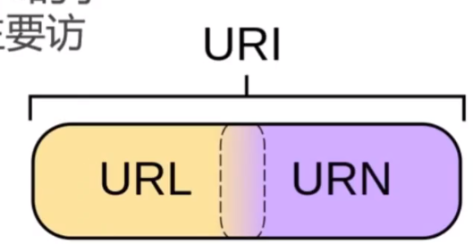
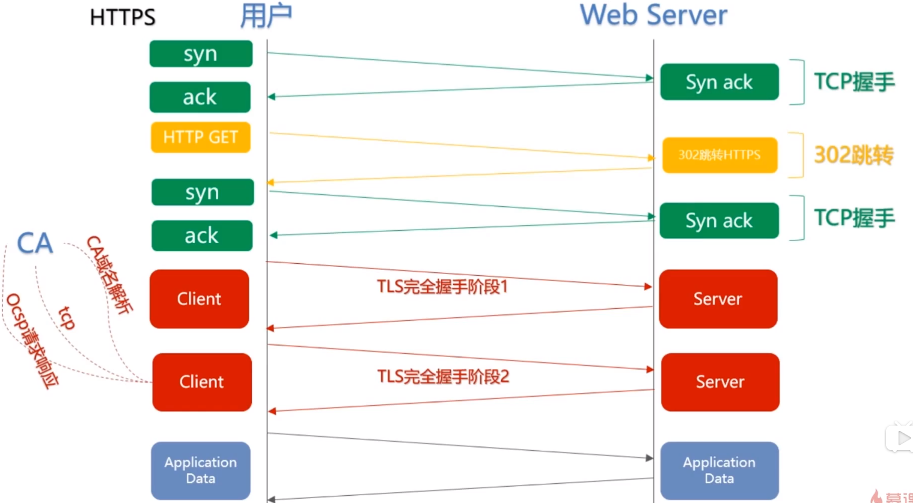

# HTTP

[看完这篇HTTP，跟面试官扯皮就没问题了](https://www.cnblogs.com/cxuanBlog/p/12177976.html)

Http超文本传输协议，允许将超文本标记语言html文档从web服务器传送到客户端浏览器，属于应用层的协议

web基于超文本和http的分布式图形信息系统

## 在浏览器中输入网址

- 查找域名对应的IP地址。这一步会依次查找浏览器缓存，系统缓存，路由器缓存，ISPDNS缓存，根域名服务器
- 浏览器向IP对应的web服务器发送一个HTTP请求
- 服务器响应请求，发回网页内容
- 浏览器解析网页内容

## TCP/IP协议族

应用层：应用程序——通过系统调用与传输层进行通信，http，ftp等

传输层：通过系统调用向应用层中处于网络连接中的两台计算机的数据传输功能，tcp/udp

网络层：处理在网络上流动的数据包，选择数据包传送的路径

## http协议的特点

1. 支持客户/服务器模式，由客户端向服务器发出请求，服务器响应请求提供相应的服务
2. 简单快速，客户端只需要传递请求方法和路径，常用的方法包括GET，HEAD，POST，服务器的规模小，通信速度快
3. 灵活，能兼容很多类型的数据
4. 无连接——表示每次连接只处理一个请求，服务器处理完用户的请求之后，并收到客户的应答之后，就立刻断开连接，节省传输时间pick-alive
5. 无状态——指对事物处理没有记忆能力，缺少状态意味着如果后续处理需要前面的信息，那么信息必须重传，导致数据量增大，不需要先前的信息，意味着它的相应较快（cookie和session）（记忆登录这些）

### URL和URI

URI：一个紧凑的字符串用来表示抽象或者物理资源

URL：提供定位资源的方式

URL和URI的差别在于访问控制。

## http报文结构

## 请求报文

报文头和报文体之间具有一个空行，报文体不一定是必要的

HTTP的报文头内容：

1. 通用报文头
   - 
2. 请求报文头
   - 
3. 响应报文头
   - 
4. 实体报文头
   - 

### 报文关键字

- accept：浏览器端可以接受的媒体类型，例如text/html代表浏览器可以接受服务器回发的类型为text/html的文档信息，如果服务器无法返回这样的数据，就返回406错误（not accept）,accept:\*/\*代表所有的数据都可以

- accept-language：浏览器声明可接受的语言

- accept-encoding：声明自己接受的编码方式

- connection：keep-alive:当一个网页打开完成之后，客户端和服务端之间用于传输HTTP数据的连接不会关闭，close：代表一个request完成之后，服务端和客户端之间的连接就会关闭，再次发起连接时要重新建立连接

- Host:请求报文头域主要用于指定被请求资源的internet主机号和端口号，一般从httpurl中提取出来，因为同一台服务器主机上可能会部署不同的网站，所以需要指明对应的端口

- referer：告诉服务器该请求是从哪个连接来的

- user-agent：告知服务器客户端使用的操作系统以及浏览器的名称和版本

- content-type：表示报文体内的对象的媒体类型

  

## 响应报文

注意响应头和响应体之间有一个空行

## HTTP的请求方法

HTTP/1.1常用方法

1. GET
   - 请求访问已被URI识别的资源，指定的资源经过解析后返回响应内容
   - GET方法也可以用于表单和数据，但是提交的内容在请求的url中可见
2. POST
   - 最主要用于提交表单数据，通过POST方法提交的数据在url中不可见，作为标准数据传输（存在http的数据中），具有保密的功能
3. PUT
   - 从客户端向服务器传送的数据取代指定的文档的内容
   - put与post最大的不同在于put是幂等的，而post不是（幂等——不管操作重复多少次，结果都是相同的）
   - 很少使用了（没有验证机制）
4. HEAD
   - 类似于GET请求，只不过返回的响应中没有具体内容，用于获取报文头，用于测试
5. DELETE
   - 请求服务器删除指定的资源，没有安全验证机制
6. OPTIONS
   - 用来询问针对请求url指定的资源支持的方法
7. TRACE
   - 回显服务器收到的请求，主要用于测试或诊断
8. CONNECT
   - 开启一个客户端与所请求资源之间的双向沟通通道，用来创建隧道，代理

后面的三个options trace connect是在1.1中被支持的

## 状态码

用以表示网页服务器超文本传输协议响应状态的3位数字代码

### 分类

以状态码的第一个数字作为分类，分为5类

200：OK 请求成功，请求所希望的响应头或数据体已经返回了

202：accepted  已接受，但是处理还没有完成

204 no content 请求处理成功，但没有实体可以返回

206：partial content   部分内容，表示服务器成功处理了部分get请求（端点续传技术）

301 moved permanently   表示所请求的内容已经永久移动到了新的url，返回的信息会包括新的url，并且由浏览器自动跳转到新的url，今后的请求应该使用新的url

302：found   临时移动，与301类似  但是资源只是临时被移动了，可以使用原有的url

303： see other 由于请求对应的资源存在着另一个url，**应使用GET方法**定向获取请求的资源

304：no modified 客户端发送附带条件的请求，服务器允许请求访问资源，但是未满足条件的情况

307 temporary redirect 临时重定向，不会使POST变为get

400： bad request  客户端请求的语法错误，服务器无法理解

401 unauthorized 请求要求验证用户身份

403  forbidden  理解客户端的请求但是拒绝执行请求

404 not found 无法找到资源

500 internal server error 服务器内部错误，无法完成请求

502 bad gateway 充当网关或者代理的服务器，从远端服务器得到了一个无效的请求

503 service unavailable 服务器忙，暂时无法处理请求

## HTTP状态管理

会话跟踪机制

### cookie

一小段文本信息，客户端请求服务器，如果服务器需要记录该用户状态，就像客户端颁发一个cookie，客户端浏览器会将cookie保存起来，当再次请求网站的时候就会把请求的网址和cookie一起提交给服务器，服务器检查cookie来确认用户身份

首部字段：set-cookie：

1. NAme:赋予的cookie名称和值
2. expire：cookie过期时间
3. path：作为cookie使用对象的文件目录
4. domain：作为cookie使用对象的域名
5. httponly：禁止javascript获取cookie，防止跨站脚本攻击

### session

另一种记录客户状态的机制，将信息保存在服务端

url重写

有效时间：超市失效 httpsession.invalite

#### cookie与session的不同

1. 保存位置不同
2. 安全性不同，cookie存在客户端，对客户端内的其他软件可见
3. 有效期不同：cookie的有效期可以设置，session的默认有效期位连接的连接期间
4. 对服务端的压力不同

## http协议结构和通信原理

### 字符集和编码

ascii 128个字符 （1个字节） GBK 2个字节（中日）  iso-8859-1（可以解任何编码，不支持中文）1个字节  unicode 包含全世界所有字符  最多4个字节  utf-8编码方式  

编码

解码

## HTTP身份认证

1. 密码
2. 动态令牌——一次性的密码（steam）
3. 数字证书
4. 生物认证
5. IC卡等

常见认证方式

1. basic认证：用户名+密码
   - 过程：用户访问资源之后，返回状态码401要求认证，用户输入用户名密码，加密之后再次发送，如果服务端通过认证，返回200，否则，返回401
2. DIgest认证：
   - 前面和前面的一样，提供了用户密码加密的功能
3. ssl客户端认证
   - 皆有HTTPs的客户端证书完成认证，凭借客户端证书来确认是否位自己登录的客户端
4. 基于表单的认证方式
   - 使用由web应用程序各自实现基于表单的认证方式

## HTTP的长连接和短链接

HTTP的长连接和短链接本质上是TCP的长连接和短链接

HTTP1.0/默认使用短链接

HTTP1.1默认使用长连接：connection：keep-alive也具有一定的保持时间

短链接：建立连接——数据传输——关闭连接。。。

长连接：建立连接——数据传输。。。数据传输——关闭连接

使用长连接的好处：是多数的请求能够以管线化的方式进行发送（管线化，就是tcp连接里面多个包先后发送，不等待响应的返回）

## http网关

协议转换器-连接使用不同协议的端点

<客户端>/<服务器端>

HTTP/：服务端网关：通过HTTP协议与客户端对话，通过其他协议与服务器通信

/HTTP：客户端网关：通过其他协议与客户端对话，通过HTTP协议与服务器通信

服务器端web网关

## http代理

代理服务器的基本行为就是接收客户端发送的请求后转发给其他服务器。代理不改变请求 URI，会直接发送给前方持有资源的目标服务器。

每次通过代理服务器转发请求或响应时，会追加写入 Via 首部信息，可以追踪报文的转发，还可以避免回环的发生

## HTTP缓存

缓存头部：cache-control   请求/响应头  缓存控制字段

no-store:所有内容都不缓存

no-cache:缓存，但是浏览器使用缓存前都会请求服务器判断资源是否为最新

max-age=x（秒）：请求缓存后，X秒内不在发起请求

s-maxage=x（秒）：代理服务器请求原站缓存后的x秒不再发起请求，指对CDN有效

public：客户端和代理服务器都可以缓存

private：只有客户端可以缓存

expires：响应头：代表资源过期时间，由服务器返回提供

last-modified：响应头，资源最新修改时间，由服务器告诉浏览器

if-last-modified：请求头，资源最新修改时间，由浏览器告诉服务器

Etag：响应头，资源标识

if-None-Match:请求头 资源标识

缓存场景

1. 服务器与浏览器约定文件过期时间——Expires，缺点：已经过期了，但实际文件没改
2. 服务器与浏览器在约定过期时间的基础上，再添加一个文件最新修改时间的对比-last-modified与if-modified-since。如果文件没修改过返回的是304状态码（如果网站的变化时间特别短，远远小于expire约定的时间，会造成部分用户网页更新不及时）
3. 最后再添加一个etag与if-none-match，最后再加入一个max-age

缓存改进方案
md5/hash缓存：通过不缓存html，为静态文件添加MD5或者hash标识，解决浏览器无法跳过缓存过期时间感知文件变化的问题

CDN缓存：构建在网络上的内容分发，依靠分布在各地的边缘服务器，通过中心平台的负载均衡，内容分发，调度等功能。

## 内容协商机制

指客户端和服务器就响应的资源内容进行交涉，然后提供给客户端最为合适的资源

内容协商的方式

1. 客户端驱动：客户端发起请求，服务端发送可选项列表，客户端做出选择后再发送第二次请求
2. 服务器驱动：服务器检查客户端的请求头部集并决定提供哪个版本的页面
3. 透明协商：有中间设备代表客户端进行协商（少用）

请求的首部集：accept：告知媒体类型  accept-language：告知使用的语言  accept-charset：发送使用的字符集 accept-encoding

响应头：content-type  content-language content-type content-encoding

## 端点续传

http通过在header里两个参数实现，客户端发送请求时对应的时range，服务端响应时对应的是content-range

返回的状态码 206

## https

http协议使用明文进行传输，不够安全，可能收到中间人的截获并篡改

https与http协议的差别在于添加了一个加密过程，要求进行连接的两方需要约定一个加密方式并约定一个秘钥（这是对称加密方式），为了保证更加安全，可以使用非对称加密方式，一个发送一个公钥，另一方使用对称加密方式对数据进行加密，在使用公钥对对称加密的秘钥进行加密。最后把密文和加密后的秘钥发送给对方。（这种条件下，中间人也可以截获公钥，并发送给另一方一个替换过的公钥，导致另一方加密失效）

证书CA机构：

证书颁发机构——服务端网址——机构私钥加密（服务端公钥）——机构私钥加密（证书签名）

流程：

1. 服务端向证书颁发机构提供自己的公钥，由证书颁发机构申请证书，并发给服务端，证书签名是被证书机构用私钥加密过的
2. 服务端和客户端通信时，服务端将证书发送给客户端
3. 客户端收到证书之后，用响应证书颁发机构的公开的公钥解密获得公钥之后，就按照上面说的进行加密

### https协议的概述

TSL是传输层加密协议，前身为ssl协议

http安全缺陷

1. 使用明文，内容被窃听——通过将通信加密，SSL（HTTPS）或者TLS组合使用，或者直接对内容加密，这种方式不够安全
2. 不验证通信方身份——DOS攻击
3. 无法证明报文的完整性——内容可能受到篡改，中间人攻击（MD5校验）

#### 功能

1. 内容加密
   - 非对称秘钥交换
   - 对称内容加密
2. 身份认证
   - 数字证书
3. 完整性保护

#### 使用成本

1. 证书费用以及更新维护
2. HTTPS降低用户访问速度
3. 消耗CPU资源，增加机器成本

#### 对性能的影响

1. 协议交互增加的网络RTT（往返时延）
   - 
2. 浏览器计算耗时
3. 服务端计算耗时

### https一定安全吗

不是绝对安全的，如果在生成key的时候就已经有了中间人，那么发信内容是会被截获的

[面试官系列 - https 真的安全吗，可以抓包吗，如何防止抓包吗](https://juejin.im/post/6850418120629485582#heading-9)

过程原理：

1. 本地请求被劫持（如DNS劫持等），所有请求均发送到中间人的服务器
2. 中间人服务器返回中间人自己的证书
3. 客户端创建随机数，通过中间人证书的公钥对随机数加密后传送给中间人，然后凭随机数构造对称加密对传输内容进行加密传输
4. 中间人因为拥有客户端的随机数，可以通过对称加密算法进行内容解密
5. 中间人以客户端的请求内容再向官方网站发起请求
6. 因为中间人与服务器的通信过程是合法的，官方网站通过建立的安全通道返回加密后的数据
7. 中间人凭借与官方网站建立的对称加密算法对内容进行解密
8. 中间人通过与客户端建立的对称加密算法对官方内容返回的数据进行加密传输
9. 客户端通过与中间人建立的对称加密算法对返回结果数据进行解密

#### 如何解决中间人攻击问题

在https中需要证书，证书的作用是为了防止"中间人攻击"的。为了解决证书验证问题，需要一个第三方机构，也就是CA来对证书进行认证担保

## 基于http的功能追加协议

影响HTTP网络请求的因素

1. 带宽
2. 延迟
   - 阻塞
   - DNS缓存
   - TCP连接——一条连接只能够发送一个请求（长连接）

瓶颈

- 一条连接只能发送一个请求
- 请求只能够从客户端开始
- 请求/响应头部不经压缩就发送
- 每次互相发送相同的首部造成的浪费多
- 非强制压缩发送

## websocket

websocket是http协议的改进

websocket的协议是一个长连接

websocket使用的是异步的方式，由服务端来通知客户端信息的更新，实现全双工的通信

1. 真正的全双工方式
2. 减少通信量

## SPDY

最小化网络延迟

### http缺陷

1. 单路连接，请求低效
2. http只允许客户端主动发起请求
3. http头部冗余

### spdy改进（不用了）

- 多路复用，请求优化（可以设置优先级，同意链接传输多种资源）
- 支持服务器推送技术
- 压缩了http头
- 强制使用ssl传输协议

## http2.0

核心改进——二进制分帧

http2.0的改进在于客户端与服务端两端均缓存了一个首部表，双发在发送请求的时候，只会发送需要修改的部分，而其他不修改的部分则不发送，意思就是渐进地修改

单链接复用

优点：

1. 减少服务连接压力
2. 由于TCP连接减少改善了网络拥塞状况
3. 慢启动时间减少，拥塞和丢包恢复速度更快
4. 并行双向字节流地请求和响应

## HTTP3.0

http3.0 基于UDP协议

## sql注入原理

每一个web应用都需要使用数据库来保存操作所需地信息。攻击者可以使用sql注入读取甚至修改数据库中保存的所有数据。

用户可以通过提交一段sql代码，获得所需要的数据

危害：

1. 泄露数据
2. 取得权限
3. 探知数据库结构

防御措施

1. 用户进输入占位符的信息
2. 指定占位符的内容

## XSS攻击

跨站脚本攻击

允许恶意用户将代码注入HTML或者js等脚本发动攻击，攻击者可以得到私密网页内容

## CSRF攻击

伪装成受信任的用户来欺骗服务器

## SSL/TLS握手过程详解

[SSL/TLS协议运行机制的概述](SSL/TLS协议运行机制的概述)

[SSL/TLS 握手过程详解](SSL/TLS 握手过程详解)

TLS 握手协议包含如下几步:

- 交换 Hello 消息, 交换随机数和支持的密码套件列表, 以协商出密码套件和对应的算法。检查会话是否可恢复
- 交换必要的密码参数以允许 client 和 server 协商预备主密钥 premaster secret
- 交换证书和密码信息以允许 client 和 server 进行身份认证
- 从预备主密钥 premaster secret 和交换的随机数中生成主密钥 master secret
- 为 TLS 记录层提供安全参数(主要是密码块)
- 允许 client 和 server 验证它们的对端已经计算出了相同的安全参数, 而且握手过程不被攻击者篡改

注意握手阶段是明文通信

1. 握手第一步是客户端向服务端发送 Client Hello 消息，这个消息里包含了一个客户端生成的随机数 **Random1**、客户端支持的加密套件（Support Ciphers）和 SSL Version 等信息。
2. 第二步是服务端向客户端发送 Server Hello 消息，这个消息会从 Client Hello 传过来的 Support Ciphers 里确定一份加密套件，这个套件决定了后续加密和生成摘要时具体使用哪些算法，另外还会生成一份随机数 **Random2**。注意，至此客户端和服务端都拥有了两个随机数（Random1+ Random2），这两个随机数会在后续生成对称秘钥时用到。
3. certificate：这一步是服务端将自己的证书下发给客户端，让客户端验证自己的身份，客户端验证通过后取出证书中的公钥。
4. Server Key Exchange：这里发送服务器使用的DH参数。RSA算法不需要这一步。
5. Certificate Request：服务端要求客户端上报证书，这一步是可选的，对于安全性要求高的场景会用到。
6. Server Hello Done:通知客户端 Server Hello 过程结束。
7. Certificate Verify:客户端收到服务端传来的证书后，先从 CA 验证该证书的合法性，验证通过后取出证书中的服务端公钥，再生成一个随机数 **Random3**，再用服务端公钥非对称加密 **Random3** 生成 **PreMaster Key**。
8. 上面客户端根据服务器传来的公钥生成了 **PreMaster Key**，Client Key Exchange 就是将这个 key 传给服务端，服务端再用自己的私钥解出这个 **PreMaster Key** 得到客户端生成的 **Random3**。至此，客户端和服务端都拥有 **Random1** + **Random2** + **Random3**，两边再根据同样的算法就可以生成一份秘钥，握手结束后的应用层数据都是使用这个秘钥进行对称加密。
9. Change Cipher Spec(Client):客户端通知服务端后面再发送的消息都会使用前面协商出来的秘钥加密了
10. Encrypted Handshake Message(Client):这一步对应的是 Client Finish 消息，客户端将前面的握手消息生成摘要再用协商好的秘钥加密，这是客户端发出的第一条加密消息。服务端接收后会用秘钥解密，能解出来说明前面协商出来的秘钥是一致的。
11. Change Cipher Spec(Server):服务端通知客户端后面再发送的消息都会使用加密，也是一条事件消息。
12. Encrypted Handshake Message(Server): Server Finish 消息，服务端也会将握手过程的消息生成摘要再用秘钥加密，这是服务端发出的第一条加密消息。客户端接收后会用秘钥解密，能解出来说明协商的秘钥是一致的。

