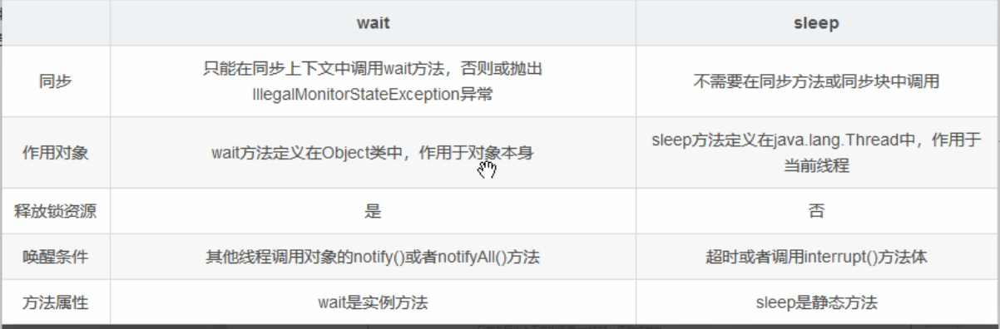

# 计算机基础

## CPU上下文切换

### 定义

先把前一个任务的 CPU 上下文（也就是 CPU 寄存器和程序计数器）保存起来，然后加载新任务的上下文到这些寄存器和程序计数器，最后再跳转到程序计数器所指的新位置，运行新任务。而这些保存下来的上下文，会存储在系统内核中，并在任务重新调度执行时再次加载进来。这样就能保证任务原来的状态不受影响，让任务看起来还是连续运行。

### 类型

 根据任务的不同，可以分为以下三种类型 - 进程上下文切换 - 线程上下文切换 - 中断上下文切换 

### 系统调用

 从用户态到内核态的转变，需要通过**系统调用**来完成。比如，当我们查看文件内容时，就需要多次系统调用来完成：首先调用 open() 打开文件，然后调用 read() 读取文件内容，并调用 write() 将内容写到标准输出，最后再调用 close() 关闭文件。 

在这个过程中就发生了 CPU 上下文切换，整个过程是这样的：

- 保存 CPU 寄存器里原来用户态的指令位
- 为了执行内核态代码，CPU 寄存器需要更新为内核态指令的新位置。
- 跳转到内核态运行内核任务。
- 当系统调用结束后，CPU 寄存器需要恢复原来保存的用户态，然后再切换到用户空间，继续运行进程。 

 一次系统调用的过程，其实发生了两次CPU上下文切换。（用户态-内核态-用户态） 

### 发生进程上下文切换的场景

1. 为了保证所有进程可以得到公平调度，CPU 时间被划分为一段段的时间片，这些时间片再被轮流分配给各个进程。这样，当某个进程的时间片耗尽了，就会被系统挂起，切换到其它正在等待 CPU 的进程运行。
2. 进程在系统资源不足（比如内存不足）时，要等到资源满足后才可以运行，这个时候进程也会被挂起，并由系统调度其他进程运行。
3. 当进程通过睡眠函数 sleep 这样的方法将自己主动挂起时，自然也会重新调度。
4. 当有优先级更高的进程运行时，为了保证高优先级进程的运行，当前进程会被挂起，由高优先级进程来运行
5. 发生硬件中断时，CPU 上的进程会被中断挂起，转而执行内核中的中断服务程序。

### 线程上下文切换

 线程与进程最大的区别在于：**线程是调度的基本单位，而进程则是资源拥有的基本单位**。说白了，所谓内核中的任务调度，实际上的调度对象是线程；而进程只是给线程提供了虚拟内存、全局变量等资源。 

#### 发生线程上下文切换的场景

1. 前后两个线程属于不同进程。此时，因为资源不共享，所以切换过程就跟进程上下文切换是一样。
2. 前后两个线程属于同一个进程。此时，因为虚拟内存是共享的，所以在切换时，虚拟内存这些资源就保持不动，只需要切换线程的私有数据、寄存器等不共享的数据

## 进程

### 进程间的通信方式

1.  管道( pipe )： 管道包括三种: 普通管道PIPE： 通常有两种限制,一是单工,只能单向传输;二是只能在父子或者兄弟进程间使用 流管道s_pipe: 去除了第一种限制,为半双工，只能在父子或兄弟进程间使用，可以双向传输 命名管道:name_pipe：去除了第二种限制,可以在许多并不相关的进程之间进行通讯 
2. 信号量( semophore ) ： 信号量是一个计数器，可以用来控制多个进程对共享资源的访问。它常作为一种锁机制，防止某进程正在访问共享资源时，其他进程也访问该资源。因此，主要作为进程间以及同一进程内不同线程之间的同步手段 
3. **消息队列**( message queue ) ： 消息队列是由消息的链表，存放在内核中并由消息队列标识符标识。消息队列克服了信号传递信息少、管道只能承载无格式字节流以及缓冲区大小受限等缺点 
4. 信号 ( sinal ) ： 信号是一种比较复杂的通信方式，用于通知接收进程某个事件已经发生 
5. 共享内存( shared memory ) ： 共享内存就是映射一段能被其他进程所访问的内存，这段共享内存由一个进程创建，但多个进程都可以访问。共享内存是最快的 IPC 方式，它是针对其他进程间通信方式运行效率低而专门设计的。它往往与其他通信机制，如信号两，配合使用，来实现进程间的同步和通信 
6. 套接字( socket ) ： 套接字也是一种进程间通信机制，与其他通信机制不同的是，它可用于不同机器间的进程通信

## 线程

**线程之间如何唤醒**

[Java多线程基础--05之 线程等待与唤醒](https://blog.csdn.net/xidiancoder/article/details/76586717)

[Java对象中等待（wait）和通知（notify）](https://blog.csdn.net/jiangzhexi/article/details/81152617?utm_medium=distribute.pc_relevant.none-task-blog-BlogCommendFromMachineLearnPai2-8.nonecase&depth_1-utm_source=distribute.pc_relevant.none-task-blog-BlogCommendFromMachineLearnPai2-8.nonecase)

这里如何通过唤醒线程是必须会写的。

[java sleep和wait的区别的疑惑?](https://www.zhihu.com/question/23328075)

sleep方法没有释放锁，不让出资源，wait方法释放了锁，使得其他的线程可以使用同步控制块或者方法

#### sleep与wait方法的区别

## 线程池的配置

[CPU密集型和IO密集型与线程池的配置](https://blog.csdn.net/sxllllwd/article/details/100533788)

CPU密集型应尽量配置小的线程，如:CPU数目+1个线程的线程池，防止在切换任务上耗费太多时间

IO密集型任务，线程池配置为2倍的CPU数目，在执行IO操作时，CPU继续运行

