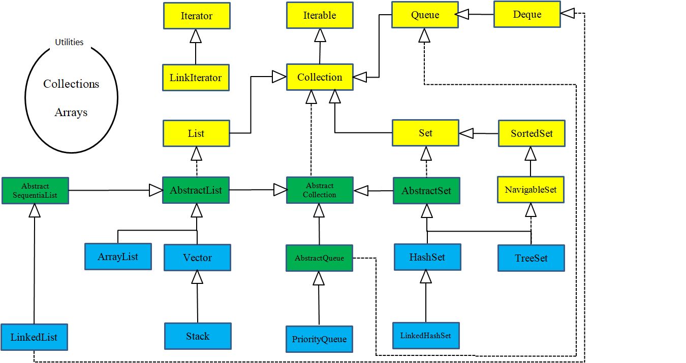

# java面试材料

## java基础

### 基本数据操作

#### boolean占的字节数

boolean值使用时有4个字节，被虚拟机编译为int值来使用，作为数组使用时，被编译为byte数组使用，每个只占一个字节，但最后还要看具体的虚拟机

#### java值传递和引用传递

[这一次，彻底解决Java的值传递和引用传递](https://juejin.im/post/5bce68226fb9a05ce46a0476)

#### 计算哈希的方法

散列表中哈希的计算——[HashMap的hash()](https://www.cnblogs.com/liujinhong/p/6576543.html) 在散列表中计算哈希的时候有一个重要的操作，就是将key的哈希值无符号右移16位之后再与自身做异或计算，得到最终的哈希值，原因是这个[HashMap中hash(Object key)原理，为什么(hashcode >>> 16)。](https://blog.csdn.net/qq_42034205/article/details/90384772?utm_medium=distribute.pc_relevant_right.none-task-blog-BlogCommendFromMachineLearnPai2-1.nonecase&depth_1-utm_source=distribute.pc_relevant_right.none-task-blog-BlogCommendFromMachineLearnPai2-1.nonecase)

[重写equals()时为什么要重写hashCode()方法](https://blog.csdn.net/javazejian/article/details/51348320)

注意在java中有一个原子变量类没有实现equals方法以及hashcode方法。

### 协变与逆变

[Java中的逆变与协变](https://www.cnblogs.com/en-heng/p/5041124.html)

博客中的生产者与消费者案例必须会

super如果一定要取数据，只能用object来保存数据

extend只能够取数据，不能够放数据

### var关键字

[Java中var类型的用法和使用var的注意事项和使用var的优缺点](https://blog.csdn.net/lzh_99999/article/details/102001216)


### 同步，异步，阻塞以及非阻塞

[同步/异步，阻塞/非阻塞概念深度解析](https://blog.csdn.net/lengxiao1993/article/details/78154467?utm_medium=distribute.pc_relevant.none-task-blog-BlogCommendFromMachineLearnPai2-3.nonecase&depth_1-utm_source=distribute.pc_relevant.none-task-blog-BlogCommendFromMachineLearnPai2-3.nonecase)

[IO - 同步，异步，阻塞，非阻塞 （亡羊补牢篇）](https://blog.csdn.net/historyasamirror/article/details/5778378)

### java的引用

[理解java的强引用，软引用，弱引用和虚引用](https://juejin.im/post/5b82c02df265da436152f5ad)

### java异常

[Java提高篇——Java 异常处理](https://www.cnblogs.com/Qian123/p/5715402.html)

### fail-fast机制

[java提高篇（三四）-----fail-fast机制](https://blog.csdn.net/chenssy/article/details/38151189)

### Class对象

[Class.forName()、Class.class、getClass() 区别相关题目解析](https://mp.weixin.qq.com/s/yrXeBWaOlNByjAqQLemFvg)

### Unsafe类

[Java魔法类：Unsafe应用解析](https://tech.meituan.com/2019/02/14/talk-about-java-magic-class-unsafe.html) 有关unsafe的类解读

### java Proxy代理

有关proxy.newProxyInstance方法的一些解释，对于handler对象，该参数表示，生成的代理对象调用方法时，会被转发到该handler上，并通过其invoke方法来执行实际的方法，可以输出代理对象的class对象，如下面的代码：

```java
People proxy = (People)Proxy.newProxyInstance(people.getClass().getClassLoader(), people.getClass().getInterfaces(), handler);
System.out.println(p.getClass());
```

上述的代码最终输出的结果为` class com.sun.proxy.$Proxy0 `，也就是说最终输出的结果是一个实现了接口的代理，该代理对象是由jvm动态生成，有关其中的invoke方法的第一个proxy参数，表示的是实际的代理对象。可以用来返回实际的代理对象。具体可以参考这些博客。

[Java动态代理InvocationHandler和Proxy学习笔记](https://blog.csdn.net/yaomingyang/article/details/80981004)

[Java中InvocationHandler接口中第一个参数proxy详解](https://blog.csdn.net/yaomingyang/article/details/81040390)

[静态代理与动态代理](https://blog.csdn.net/hejingyuan6/article/details/36203505)

## String

[string源码分析以及string为什么不可变](https://blog.csdn.net/zhangjg_blog/article/details/18319521)

String为什么不可变，重点在于string对象持有的value数组保存了字符串的字符组，且该字符数组被设置为private final，因此无法直接对其修改。

[为什么String要设计为不可变的](https://blog.csdn.net/sdxmxy/article/details/81749527?utm_medium=distribute.pc_relevant.none-task-blog-BlogCommendFromMachineLearnPai2-3.nonecase&depth_1-utm_source=distribute.pc_relevant.none-task-blog-BlogCommendFromMachineLearnPai2-3.nonecase )

1. 字符串常量池的需要
2. 允许String对象缓存Hashcode
3. 安全性考虑

## 集合




**参考着看的源码分析**[Java 集合系列16之 HashSet详细介绍(源码解析)和使用示例](https://wangkuiwu.github.io/2012/02/16/collection-16-hashset/)

#### hashmap

hashmap源码分析——[面试官再问你 HashMap 底层原理，就把这篇文章甩给他看](https://juejin.im/post/5e93ca9d6fb9a03c3176248f)

##### HashMap链表成环的原因和解决方案

成环的原因参考博客——[疫苗：JAVA HASHMAP的死循环](https://coolshell.cn/articles/9606.html)

```java
void transfer(Entry[] newTable)
{
    Entry[] src = table;
    int newCapacity = newTable.length;
    //下面这段代码的意思是：
    //  从OldTable里摘一个元素出来，然后放到NewTable中
    for (int j = 0; j < src.length; j++) {
        Entry<K,V> e = src[j];
        if (e != null) {
            src[j] = null;
            do {
                Entry<K,V> next = e.next;//成环的关键代码
                int i = indexFor(e.hash, newCapacity);
                e.next = newTable[i];//成环的关键代码
                newTable[i] = e;//成环的关键代码
                e = next;
            } while (e != null);
        }
    }
} 
```

hashmap不是线程安全的原因——[浅谈HashMap与线程安全 (JDK1.8)](https://www.cnblogs.com/yucfeng/p/9035308.html) 简单点就是put方法不能保证线程安全。

hashmap容量以及扩容时一定是2的幂的原因——[为什么hashMap的容量扩容时一定是2的幂次](https://blog.csdn.net/gududedabai/article/details/85784161?utm_medium=distribute.pc_relevant.none-task-blog-BlogCommendFromMachineLearnPai2-1.nonecase&depth_1-utm_source=distribute.pc_relevant.none-task-blog-BlogCommendFromMachineLearnPai2-1.nonecase)

hashMap讲解——[Java8的HashMap详解（存储结构，功能实现，扩容优化，线程安全，遍历方法）](https://blog.csdn.net/login_sonata/article/details/76598675)

#### ConcurrentHashMap

源码分析——[Java 8 ConcurrentHashMap源码分析](https://juejin.im/entry/59fc786d518825297f3fa968 )

源码分析——[基于 CAS 机制的 ConcurrentHashMap 实现内幕](https://www.zhenchao.org/2019/01/31/java/cas-based-concurrent-hashmap/)

源码分析——[Java CAS 原理剖析](https://juejin.im/post/5a73cbbff265da4e807783f5)

源码分析——spread函数讲解——[不一样的ConcurrentHashMap1.8源码分析](https://zhuanlan.zhihu.com/p/69973390)

[源码分析——java1.8concurrenthasmap](http://www.blogjava.net/zhanglongsr/articles/356782.html)

##### concurrentHashMap的锁

在并发编程实战第11章（performance）第4节提到了concurrentHashMap的锁，

高效可并发读写缓存实现机制


#### ConcurrentLinkedQueue

使用原子域更新器来更新实现add等方法。

### 同步类的实现

#### AQS的实现原理

[从ReentrantLock的实现看AQS的原理及应用](https://tech.meituan.com/2019/12/05/aqs-theory-and-apply.html)

### java线程基本知识

#### 死锁条件

##### 死锁发生的条件——必背

（1） 互斥条件：在某段时间内一个资源只能被一个进程使用。
（2） 占有且等待：一个进程因请求资源而阻塞时，对已获得的资源保持不放。
（3）不可强行占有: 进程已获得的资源，在末使用完之前，不能强行剥夺。
（4） 循环等待条件:若干进程之间形成一种头尾相接的循环等待资源关系。

##### 死锁处理

1. 预防死锁——破坏四个条件的一个或者多个
2.  破坏死锁——在资源分配中，用某种方法防止系统进入不安全状态
3. 检测死锁——允许系统在运行过程中发生死锁，但是设置检测机构及时检测死锁的发生
4. 解除死锁——检测处死锁后，采取适当的措施将进程从死锁状态中脱出

###### 破坏死锁

1. 破坏互斥条件——无法解决
2. 破坏等待条件——一、一次性提出锁需要的全部资源并分配（必须提前直到所需的资源）；二、在每个进程提出新的资源需求时，要求线程必须释放已经获得的资源（这些资源必须互不依赖的，如果必须持有多个资源才可以执行，就不可以使用该方法）
3. 破坏不可抢占——允许资源被抢占；一：如果占有某些资源的进程申请资源被拒绝，那么进程必须释放最初占的资源，二：如果一个进程请求当前被另一个进程占有的资源，操作系统允许抢占另一个进程的资源，此时要求进程的优先级不同
4. 破坏循环等待条件——进程申请资源必须按照资源统一编号进行申请

###### 死锁避免

1. 有序资源分配——对资源进行编号，申请资源时，按照顺序进行申请
2. 银行家算法——操作系统里面有
3. 顺序加锁——不同的线程获取相同的资源时，要按照相同的资源加锁
4. 限时加锁——获取资源超过时间，就放弃获取资源，并释放已经获得的资源（线程数量少时比较有效，但是数量多时会造成循环死锁）

###### 死锁检测

类似银行家算法

###### 死锁恢复

1. 抢占恢复——认为干预将资源释放出来
2. 回滚恢复——将线程恢复到某个没有获得资源的状态
3. 杀死进程——该方法可能有不良影响，因为线程之间可能有依赖

##### 线程通信

CPU执行线程是随机的，如果线程之间需要相互配合运行就需要线程通信

1. object——wait，notify，notifyAll，这些方法依赖于synchronized，必须放到同步代码块或者方法中
2. Condition——await，signal，singalAll，需要与lock一起使用
3. CountDownLatch——某个线程等待若干个其他线程执行完之后，才开始运行
4. CyclicBarrier——一组线程等待至某个状态之后再全部执行
5. semaphore——用于控制对某组资源的访问权限

#### java线程的状态与切换（生命周期）

1. **初始(NEW)**:新创建了一个线程，但还没有调用start()方法
2. **运行(RUNNABLE)**:java将就绪(READY)和运行中(running)两种状态统称为运行， 线程对象创建后，其他线程(比如main线程）调用了该对象的start()方法。该状态的线程位于可运行线程池中，等待被线程调度选中，获取CPU的使用权，此时处于就绪状态（ready）。就绪状态的线程在获得CPU时间片后变为运行中状态（running）
3. **阻塞(BLOCKED)**：表示线程阻塞于锁
4. **等待(WAITING)**:  进入该状态的线程需要等待其他线程做出一些特定动作（通知或中断）
5. **超时状态(TIME_WAITING)**: 该状态不同于WAITING，它可以在指定的时间后自行返回。 
6. **终止(TERMINATED)**: 表示该线程已经执行完毕，一旦线程进入死亡状态，就不能够再次启动 

[Java线程的6种状态及切换(透彻讲解)](https://blog.csdn.net/pange1991/article/details/53860651) 

[Object.wait()与Object.notify()的用法](https://www.cnblogs.com/xwdreamer/archive/2012/05/12/2496843.html) 

[Java 并发编程：线程间的协作(wait/notify/sleep/yield/join)](https://www.cnblogs.com/paddix/p/5381958.html)

[Java线程中wait、await、sleep、yield、join用法总结](https://www.yht7.com/news/97709)

[java锁之wait,notify(wait会释放锁，notify仅仅只是通知，不释放锁)](https://blog.csdn.net/azhegps/article/details/63031562)

join方法不会释放已获得的锁，其作用是让出CPU执行时间，等待另外的线程执行完成。其作用是让优先级高的线程先执行。

这三个配合着看

java线程的中断——[对中断interrupt的理解](https://www.cnblogs.com/zeroingToOne/p/9063116.html) 这里主要看interrupt与join，wait，sleep等的关系:

1. 如果线程的当前状态处于非阻塞状态，那么仅仅是线程的中断标志被修改为true而已；

2. 如果线程的当前状态处于阻塞状态，那么在将中断标志设置为true后，还会有如下三种情况之一的操作：

(1) 如果是wait、sleep以及jion三个方法引起的阻塞，那么会将线程的中断标志重新设置为false，并抛出一个InterruptedException；
(2) 如果是java.nio.channels.InterruptibleChannel进行的io操作引起的阻塞，则会对线程抛出一个ClosedByInterruptedException；（待验证）
(3) 如果是轮询（java.nio.channels.Selectors）引起的线程阻塞，则立即返回，不会抛出异常。（待验证）
如果在中断时，线程正处于非阻塞状态，则将中断标志修改为true,而在此基础上，一旦进入阻塞状态，则按照阻塞状态的情况来进行处理；例如，一个线程在运行状态中，其中断标志被设置为true,则此后，一旦线程调用了wait、jion、sleep方法中的一种，立马抛出一个InterruptedException，且中断标志被清除，重新设置为false。

##### 守护线程

线程分为用户线程和守护线程，mian线程就是用户线程，垃圾回收就是一个守护线程，可以通过setDaemon可以将线程变为守护线程。

#### java的同步机制

1. 同步代码块
2. 同步方法
3. 同步锁
4. 特殊域变量
5. 局部变量
6. 阻塞队列
7. 原子变量


#### java多线程知识以及实现

[多线程](https://www.cnblogs.com/duanxz/tag/多线程/)

他这里有很多可以看

[Java多线程系列目录(共43篇)](https://blog.csdn.net/huanggang028/article/details/27716899?utm_medium=distribute.pc_relevant.none-task-blog-BlogCommendFromMachineLearnPai2-2.nonecase&depth_1-utm_source=distribute.pc_relevant.none-task-blog-BlogCommendFromMachineLearnPai2-2.nonecase)

##### 多线程中start和run的区别

[Thread使用start和run方法启动线程有什么区别？](https://blog.csdn.net/woshizisezise/article/details/79938915?utm_medium=distribute.pc_relevant.none-task-blog-BlogCommendFromMachineLearnPai2-1.nonecase&depth_1-utm_source=distribute.pc_relevant.none-task-blog-BlogCommendFromMachineLearnPai2-1.nonecase)

结论：调用run只是执行一个runnable对象的run方法，不会启动新的线程，会把并发执行编程串行执行，start()方法会启动线程，并行执行程序。注意线程的start仅能调用一次，再次调用会抛出异常。

##### 实现线程的多种方式

1. 实现线程类，并继承thread类
2. 实现runnable接口，并交给thread作为代理对象，thread具有一个带参的构造器——推荐，方便一个对象被多个线程使用
3. 实现Callable接口，并重写call方法，利用这个方法创建需要executors的线程池方法，并进行提交

### java中的线程池配置

[Java线程池-ThreadPoolExecutor原理分析与实战](https://blog.csdn.net/z_s_z2016/article/details/81674893?utm_medium=distribute.pc_relevant.none-task-blog-BlogCommendFromMachineLearnPai2-5.nonecase&depth_1-utm_source=distribute.pc_relevant.none-task-blog-BlogCommendFromMachineLearnPai2-5.nonecase)

1. **java中的四种线程池**

## java并发编程

### happen-before规则

1. 线程解锁之前对变量的写，对接下来加锁的其他线程对该变量的读是可见的
2. 线程对volatile变量的写，对接下来其他的线程对该变量的读是可见的
3. 线程start之前对变量写，该线程开始后对该变量的读可见
4. 线程结束前对变量的写，对其他线程得知它结束后的读可见
5. 线程t1打断t2前对变量的写，对于其他线程得知t2被打断后对变量的读可见

### Lock


lock类的实现类图

#### ReentrantLock——比synchroized方法更加强大

具有两个方法lock和unlock，构造函数可传入一个boolean，true表示公平锁，false表示非公平锁，也就是独占锁。lock和unlock必须成对调用，防止死锁。

ReentrantLock源码解读

[ReenTrantLock可重入锁（和synchronized的区别）总结](https://blog.csdn.net/qq838642798/article/details/65441415)

[ReenTrantLock](http://www.blogjava.net/zhanglongsr/articles/356782.html)

sychronized与lock的区别

1. synchronized是java的内置关键字，在jvm层面，而lock是java的一个类
2. synchronized无法判断获得锁的状态，lock可以判断是否得到锁
3. synchronized会自动释放锁，而lock必须通过try，catch语句块在finally中调用unlock方法，避免死锁的发生
4. 用synchronized两个线程，如果线程获得锁，其他的线程将会等待，而lock锁就不一定会等待
5. **synchronized的锁可重入，不可中断，非公平，而lock锁可重入，可判断，可公平**
6. lock锁适合大量同步的代码的同步问题，而synchronized锁适合少量的同步问题

#### 实现一个阻塞队列


#### AbstractQueuedSynchronizer

AQS源码解读 [Java并发之AQS详解](https://www.cnblogs.com/waterystone/p/4920797.html)

#### CAS锁（乐观锁）

[面试必问的CAS，你懂了吗？](https://blog.csdn.net/v123411739/article/details/79561458)

[什么是CAS机制？](https://blog.csdn.net/qq_32998153/article/details/79529704?utm_medium=distribute.pc_relevant.none-task-blog-BlogCommendFromMachineLearnPai2-5.nonecase&depth_1-utm_source=distribute.pc_relevant.none-task-blog-BlogCommendFromMachineLearnPai2-5.nonecase)这个很重要

##### CAS

CAS指令一共有三个操作数，分别是内存位置V，旧的预期值A，和准备设置的新值B，CAS指令执行时，当且仅当V符合A时，处理器才会用B的更新V值，否则就不执行更新，不管是否更新了V的值，都会返回V的旧值

ABA问题的解决——atomicStampedReference解决ABA问题，通过控制变量的版本来保证CAS的正确性。

ABA问题： 假设初始值为A，线程3和线程1都获取到了初始值A，然后线程1将A改为了B，线程2将B又改回了A，这时候线程3做修改时，是感知不到这个值从A改为了B又改回了A的过程——案例银行存钱问题。

[AtomicStampedReference、AtomicMarkableReference源码分析，解决cas ABA问题](https://blog.csdn.net/zqz_zqz/article/details/68062568)

CAS的使用场景：如果线程之间的竞争不是很激烈，使用CAS可以有效提高效率，但是如果线程竞争激烈就会耗费CPU资源

#### CountDownLatch，CyclicBarrier和Semaphore

非源码，有关个并发模块的使用： [Java并发编程：CountDownLatch、CyclicBarrier和Semaphore](https://www.cnblogs.com/dolphin0520/p/3920397.html)

CauntDownLatch具有CountDown方法，可对其减1，await方法再countDown减到0时不会执行

CyclicBarrier可以让线程同时执行，方法也是调用其await来阻塞线程

Semophere控制对资源的访问。有acquire和release方法，对资源有获取和释放

#### Condition

[Java多线程基础——Lock类](https://www.cnblogs.com/qifengshi/p/6354890.html)


#### volatile关键字

[Java并发编程：volatile关键字解析](https://www.cnblogs.com/dolphin0520/p/3920373.html)

结论：

1. volatile关键字实现内存可见性以及禁止指令重排序的目的
2. 内存模型：程序运行时会从主存中读取数据进入自己的快速缓存中，在快速缓存中修改，最后再写入主存。
3. 原子性：即一个操作要么全部执行且不被打断，要么不执行。可见性：多个线程访问同一个变量，如果其中一个修改了值，其他线程能够立刻看到。顺序性：程序执行的顺序按照代码的先后顺序，JVM指令重排序
4. java可见性： Java提供了volatile关键字来保证可见性。  当一个共享变量被volatile修饰时，它会保证修改的值会立即被更新到主存，当有其他线程需要读取时，它会去内存中读取新值。  通过synchronized和Lock也能够保证可见性，synchronized和Lock能保证同一时刻只有一个线程获取锁然后执行同步代码，并且在释放锁之前会将对变量的修改刷新到主存当中。因此可以保证可见性。 
5. volatile不能保证原子性，可以保证有序以及可见
6. volatile的实现原理：加入volatile会导致多一个内存栅栏就是lock前缀的指令，该内存栅栏提供三个功能
   1.  它确保指令重排序时不会把其后面的指令排到内存屏障之前的位置，也不会把前面的指令排到内存屏障的后面；即在执行到内存屏障这句指令时，在它前面的操作已经全部完成； 
   2.  它会强制将对缓存的修改操作立即写入主存； 
   3.  如果是写操作，它会导致其他CPU中对应的缓存行无效。 
4.  实现时调用的CPU原语实现：lock addl，调用的硬件接口，总线？？？(java并发编程艺术)，通过添加总线锁来保证硬件上的原子性，但是总线锁会导致CPU无法与其他内存进行沟通，开销较高，另外的方式是使用缓存锁，对缓存添加lock指令会导致缓存回写到内存，并引起其他缓存失效，这些锁定特点在volatile里面也有体现
7. **使用条件以及应用场景**：1）对变量的写操作不依赖于当前值，2）该变量不包含在其他变量的不变式中。
9. 对volatile不保证并发条件下的解释可以用字节码指令来解释，例如对于race++操作，其字节码指令有四个（getstatic（获得i的值到栈顶），iconst_1（栈顶加入一个1），iadd（栈顶两元素相加），pustatic（写入元素）），当执行完iadd之后，有其他线程修改了race的值时，该线程将当前++后得到的结果写入内存就会造成并发错误

```java
public class Test {

    static boolean run = true;

    public static void main(String[] args) throws InterruptedException {
        Thread t = new Thread(()->{
            while ((run)){
				//System.out.println("1");这里写一句，输出语句就能正常退出了，因为println是加锁的方法
            }
        });
        t.start();
        Thread.sleep(1000);

        run = false;
    }
}
```


#### threadlocal

定义：线程局部变量——可以看spring里面自定义数据库就有一个相关的实现和使用day03_eesy_01account就是

[Java进阶（七）正确理解Thread Local的原理与适用场景](http://www.jasongj.com/java/threadlocal/)

[Java并发编程：深入剖析ThreadLocal](https://www.cnblogs.com/dolphin0520/p/3920407.html)

[ThreadLocal内存泄漏问题](https://juejin.im/post/5ba9a6665188255c791b0520)

#### synchronized

[Synchronized关键字深析（小白慎入，深入jvm源码，两万字长文）](https://blog.csdn.net/weixin_42762133/article/details/103241439?utm_medium=distribute.pc_relevant.none-task-blog-BlogCommendFromMachineLearnPai2-5.nonecase&depth_1-utm_source=distribute.pc_relevant.none-task-blog-BlogCommendFromMachineLearnPai2-5.nonecase)

### 四种线程池

newCacheThreadPool，newFixedThreadPool，newSingleThreadPool，newScheduleThreadPool

### java内存模型


JVM内存模型——虚拟机栈，堆，方法区，程序计数器，本地方法栈五部分

程序计数器——记录线程正在执行的内存地址，一遍被中断线程恢复执行时再次按照中断时的指令地址继续执行（线程各自独有）

java栈（虚拟机栈）——每个线程会创建一个Java栈（具有多个栈帧），每个方法对应一个栈帧，栈帧在方法运行时，创建并入栈，方法执行完成，弹出栈中元素作为返回值并清除栈，当线程请求的栈深度大于虚拟机所允许的最大深度，会抛出stackOverFlowError异常，栈扩展无法达到足够内存，抛出OutOfMemeryError异常。

方法区——永久区，方法区中存放了要被加载的类信息，类中的静态变量，类中定义为final类型的常量，类中的Field信息，类中的方法信息，方法区是被java线程共享的，超过内存允许的大小时，也会抛出OutOfMemeryError错误信息。

常量池——是方法区的一部分，常量池中存储两个类数据，字面量和常量，

本地方法栈——？？？

## java锁

[Java面试--偏向锁、自旋锁、轻量级锁、重量级锁](https://blog.csdn.net/weixin_41835916/article/details/81488620?utm_medium=distribute.pc_relevant.none-task-blog-BlogCommendFromMachineLearnPai2-2.nonecase&depth_1-utm_source=distribute.pc_relevant.none-task-blog-BlogCommendFromMachineLearnPai2-2.nonecase)

[java 中的锁 -- 偏向锁、轻量级锁、自旋锁、重量级锁](https://blog.csdn.net/zqz_zqz/article/details/70233767)


面试题

[java面试题](https://www.shiyanlou.com/library/JavaGuide/docs/essential-content-for-interview/PreparingForInterview/JavaProgrammerNeedKnow)

