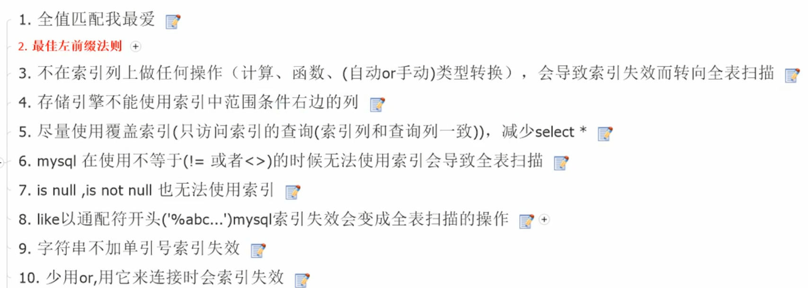
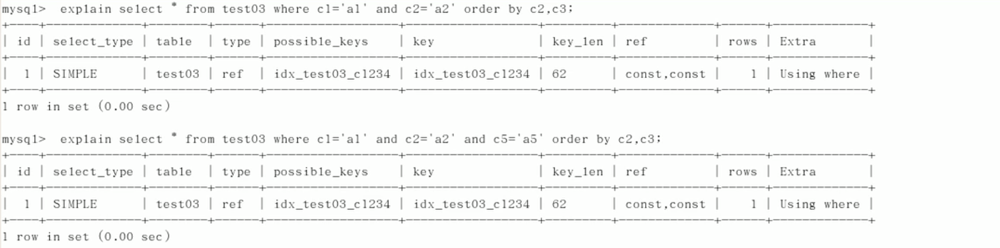
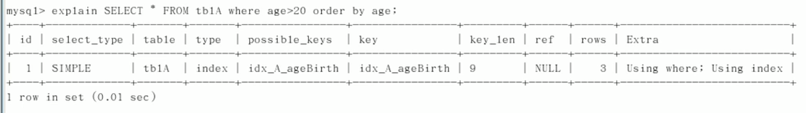

## mysql

[mysql设计三范式](https://blog.csdn.net/WangQYoho/article/details/52900585)

[ORM思想](https://blog.csdn.net/u010028869/article/details/47094973)

[Innodb中的事务隔离级别和锁的关系](https://tech.meituan.com/2014/08/20/innodb-lock.html)

### 事务管理

 一个数据库事务是一个被视为单一的工作单元的操作序列。这些操作应该要么完整地执行，要么完全不执行。 其重要的属性被描述为**ACID**：

- **原子性（automicity）：**事务应该当作一个单独单元的操作，这意味着整个序列操作要么是成功，要么是失败的。
- **一致性（Consistency）：** 事务前后数据的完整性必须保持一致。 
- **隔离性（Isolation）：** 事务的隔离性是多个用户并发访问数据库时，数据库为每一个用户开启的事务，不能被其他事务的操作数据所干扰，多个并发事务之间要相互隔离。 
- **持久性（Durability）：**一个事务一旦完成全部操作后，这个事务的结果必须是永久性的，不能因系统故障而从数据库中删除。

ACID的理解：[事务ACID理解](https://blog.csdn.net/dengjili/article/details/82468576?utm_medium=distribute.pc_relevant.none-task-blog-BlogCommendFromMachineLearnPai2-2.nonecase&depth_1-utm_source=distribute.pc_relevant.none-task-blog-BlogCommendFromMachineLearnPai2-2.nonecase)

[ACID实现原理](https://www.cnblogs.com/kismetv/p/10331633.html)

[数据库事务ACID理解，及事务隔离级别](https://blog.csdn.net/sinat_34715587/article/details/88902634?utm_medium=distribute.pc_relevant.none-task-blog-BlogCommendFromMachineLearnPai2-1.nonecase&depth_1-utm_source=distribute.pc_relevant.none-task-blog-BlogCommendFromMachineLearnPai2-1.nonecase)

这里关于事务隔离级别的实现原理，就是那些undo log必须会，以下几个问题作为思考题：

9. 现在有一个数据库，包含id和value两个字段，隔离级别为默认隔离级别。线程1执行select，然后线程2执行select，线程2删除value=100的数据，线程2插入一条value=100的数据，然后线程2commit，问最后一次线程1select的结果？ 

10. 线程1执行select，线程1删除value=100的数据，线程2删除value=100的数据，线程2插入value=100的数据，然后线程2commit，线程1执行select，问最后一次线程1select的结果？

[MVCC](https://juejin.im/post/5c68a4056fb9a049e063e0ab)

不考虑隔离性导致的问题：

1.*脏读*： 一个事务读取了另外一个事务未提交的数据。 
2.*不可重复读*：不可重复读指在一个事务内读取表中的某一行数据，多次读取结果不同。 
3.*幻读*：虚读(幻读)是指在一个事务内读取到了别的事务插入的数据，导致前后读取不一致。  

事务的隔离级别：

1.Read uncommitted：一个事务可以读取另一个未提交事务的数据，脏读、不可重复度和幻读均不可避免。 
2.Read committed：一个事务要等另一个事务提交后才能读取数据，可避免脏读，不可重复度和幻读不可避免。 **oracle默认**
3.Repeatable read：在开始读取数据（事务开启）时，不再允许修改操作（即不允许其他事务的update操作），可避免脏读和不可重复度，但无法避免幻读。 **mysql默认**
4.Serializable ：最高的事务隔离级别，在该级别下，事务串行化顺序执行，可以避免脏读、不可重复读与幻读。但是这种事务隔离级别效率低下，比较耗数据库性能，一般不使用。 

#### 支持

**innodb支持事务，myisam不支持事务**:用`show ENGINES`参看引擎设置

对于数据库中，如果autocommit为on，就是默认提交，此时insert，update，delete等语句就是一个事务，为了使用事务，必须设置自动提交为OFF,`set autocommit=0`

### 数据库的完整性

完整性约束：

[数据库中的数据完整性约束](https://blog.csdn.net/u013634252/article/details/80696882?utm_medium=distribute.pc_relevant.none-task-blog-BlogCommendFromMachineLearnPai2-4.nonecase&depth_1-utm_source=distribute.pc_relevant.none-task-blog-BlogCommendFromMachineLearnPai2-4.nonecase)

### 调优

[数据库优化 - SQL优化](https://blog.csdn.net/jianzhang11/article/details/102867120?utm_medium=distribute.pc_relevant.none-task-blog-BlogCommendFromMachineLearnPai2-7.nonecase&depth_1-utm_source=distribute.pc_relevant.none-task-blog-BlogCommendFromMachineLearnPai2-7.nonecase)

[数据库SQL优化大总结之 百万级数据库优化方案](https://blog.csdn.net/zhushuai1221/article/details/51740846)

[面向程序员的数据库访问性能优化法则](https://blog.csdn.net/yzsind/article/details/6059209?utm_medium=distribute.pc_relevant.none-task-blog-BlogCommendFromMachineLearnPai2-3.nonecase&depth_1-utm_source=distribute.pc_relevant.none-task-blog-BlogCommendFromMachineLearnPai2-3.nonecase)

### mysql数据结构

日志log

数据库实际数据文件：var/lib/data

frm文件：表的结构

myd：存放表数据

myi：存放表索引

### 引擎

要背的

### sql修改系统配置

#### 字符集

linux中可以修改默认字符集

### sql索引

#### 索引的类型

##### B-Tree索引

myisam的索引中，根节点中只存了指向子节点的指针，通过比较其中的值，来找到下一个子节点的指针，而叶子节点指向了实际的数据存储的物理位置

##### 哈希索引

应用较少，

1. 仅能够支持等值比较查询，
2. 由于哈希索引中仅包含哈希值以及行指针，不存字段，不能狗用来避免读行
3. 无法用于排序
4. 也无法支持部分索引匹配
5. 

分类：单值索引以及复合索引

`CREATE index idx_user_name on user(name)`:给user表里的name做索引

**定义：**索引是帮助mysql高校获取数据的数据结构，通过排序用于提高查找效率，

**影响：**索引影响order by和where

**采取的数据结构**为B+树

**索引重建：**在数据库中进行删除数据时，实际上是将数据由激活状态变为失效状态，原因有两个，一个是保存完整的数据，进行数据分析，另一个是保证索引的有效性，防止频繁地修改索引。在数据库运行人员中，会需要进行索引重建工作，撤掉失效数据的索引。

索引的文件一般以文件的形式存储在磁盘上。

优势：提高数据的检索效率，降低数据库的IO成本，通过索引对数据进行排序，降低数据库排序的成本，降低CPU的消耗

劣势：

1. 实际索引也是一个表，保存了主键与索引字段，并指向实体表记录
2. 索引提高了查询速度，但是降低了更新表的速度，在对表进行INSERT，UPDATE，DELETE时除了更新保存的数据，还需要更新索引
3. 索引也需要优化调整的

分类：

1. 单值索引：一个索引只包含单个列，一个表可以有多个单列索引
2. 唯一索引：索引列的值必须唯一，但是可以有空值
3. 一个索引包含多列

语法：

创建：`CREATE [UNIQUE] INDEX indexname ON mytable(columnname(length)); 

`ALTER mytable ADD [UNIQUE] INDEX [indexname] ON (columnname(length));`

删除：`DROP INDEX [indexname] ON mytable`

查看：`SHOW INDEX FROM tablename\G;`

**索引的类型**——B树

#### 建立索引的情况

1. 主键自动建立唯一索引
2. 频繁作为查询条件的字段
3. 查询中与其他表关联的字段
4. 查询中排序的字段通过索引来访问以提高排序
5. 查询中统计或者分组字段

#### 不能够建立索引的情况

1. 频繁更新的字段不建立索引
2. where里用不到的字段不建立索引
3. 表记录太少
4. 如果这些列中存在太多重复的项目

### 性能分析

#### query

mysql中具有专门的优化器可以对select语句进行优化，

#### 瓶颈

CPU：在数据存入内存中以及磁盘上读取数据

IO：磁盘IO发生在装入数据大于内存容量时

服务硬件的性能——linux命令：free，top，isotat

#### explain

`explain sql语句`其会输出一个表，这个表具有一些字段

- **id**:id相同，表的顺序由上到下执行，id不同，id越大，等级越高，越先执行
- select_type:[SIMPLE,PRIMARY,SUBQUERY，DERIVED，UNION，UNION RESULT]，DERIVE表示衍生表，SIMPLE简单查询，PRIMARY最外层的查询，SUBQUERY子查询，UNION表示联结，UNION RESULT表示从UNION中找的数据
- table:加载表的顺序，表示某张表
- **type**:访问类型，[system,const,eq_ref,ref,range,index,all],从左到右检索效率越差，还有其他的，一般达到range级别，最好是ref，system表示表只有一行，是const类型的特例，const表示通过索引一次找到结果，对于主键或者唯一键查询，就是const级别，eq_ref表示从其他的表中找数据，有且仅有一条数据能够匹配，ref返回某个单独值的所有行，range检索给定范围的行，一般就是range或者between这些，index从索引文件中选取所有的索引，只取索引，不取文件数据，full扫描并取所有数据
- possible_keys:显示在表中的索引，一个或者多个
- **key**:实际使用到的索引，null表示没有索引
- key_len:索引使用的字节数，显示索引可能的最大可能长度
- ref:表示使用到的索引字段
- **rows**：预估表中有多少行被查询，预估值
- **Extra**：Using filesort：对数据使用一个外部的索引排序，而不是按照表内的顺序读取，例如对数据建立索引，但是在选择数据之后，并不按照索引进行排序，就会得到filesort，也就是排序不按照建立的索引进行。Using temporary使用了临时表保存查询结果，之后再对表进行排序，常见于order by或者groupy by，Using index（最好）使用了索引，如果出现useing where表示索引用于键值查找，如果没有表示直接由索引来读取数据，索引覆盖：select读取的数据只从索引终究能够读取，而不必读取数据行，也就是查询列被索引覆盖，group by应该尽量跟着索引用；using where where语句，using join buffer 多个语句join，impossible where就是where语句总是false    

#### 索引的分析

##### 单表

如果建立了组合索引，再sql语句中选择的过程中，涉及了范围查找，那么就会造成索引的失效

`selecr id,author,from article where categoryid=1 AND comments>3 ORDER BY views DESC LIMIT 1`会造成索引（categories，comments，views的组合）失效。

##### 俩表

**左连接索引加在右表上**，**右连接加在左表上**

##### 三表

把他看成多个两表就可以

优化方式：

#### 索引失效

1. 建立组合索引，并从其中select *，筛选条件中使用和所建索引一样的顺序进行筛选
2. 最左前缀法则，查询从索引的最左前列开始，并且不跳过其中的索引，对于一串AND操作连接的筛选条件，只要所有的索引都被用到了，顺序其实没有关系
3. 不要再索引列上进行任何操作，否则会造成索引失效并转向全表扫描`where left(name,4)`
4. 存储引擎不能使用索引范围条件右边的列，就是在筛选中使用到了>,<这些，在extra中提到了，使用了>的之后的索引会失效，而使用了>的那个还是有效的
5. 尽量使用覆盖索引，只访问索引的查询（索引列与查询列一致，减少select *）
6. 使用!=和<>会变成全表扫描
7. is NULL和is NOT NULL都不能使用索引
8. like以通配符%开头会变成全表扫描，如果like不以%开头，type就是range的，如果like一定要用%开头，就可以使用覆盖索引，就是索引里面就包含了要查找的数据
9. 字符串不加单引号导致索引失效，mysql低层做了转换，与3有关
10. 少用OR，使用OR会导致索引失效

### sql优化

慢的原因：查询语句不够高效，索引失效，关联查询过多join，服务器需要调优

sql语句书写规则：

机读顺序：

#### 实例

这些是基于mysql5的，在8里面没有尝试，一些常见的优化语句分析实例

使用了全部索引

索引全用上了，和顺序无关

用了3个，范围之后失效

用了3个，范围之后失效

用了2个，c3用在排序中

用了2个，c3排序

由于跳过了3，因此产生了filesort

用了1个

使用了1个，但是排序没按照顺序，产生了filesort

查找和排序均按照索引来，因此没有问题

上面的那条c2已经是一个常量了，排不排序无所有

c2,c3只用于分组

保存了临时表，group by会有临时表产生

#### 查询截取分析

1. 开启慢查询分析
2. explain+慢SQL分析
3. show profile
4. 服务器的调优

#### 优化方式

1. 小表驱动大表——防止频繁的IO操作造成额外开销

1. ORDER BY优化问题
   1. 尽量使用INDEX方式排序，遵循最左前缀原则，避免产生filesort排序，
   2. 尽可能在索引列上完成排序，
   3. 如果不在索引列上，filesort有两种算法:
      1. 双路排序：读取磁盘两次，先读取行指针和orderby列，对其进行排序，最后按照表中的值再读一次——IO成本很高
      2. 单路排序：从磁盘中读取需要的所有列，按照order by在buffer进行排序，最后将排序后的列表进行输出，但是要求更多的空间——同时由于buffer具有空间限制，可能导致需要多次取数据，排序之后建立临时表，进行多次合并排序，导致更多的IO

没有filesort

上面的没问题，而下面的产生了filesort问题

没按照顺序

看第三个和第四个，order by默认升序，多个字段的顺序必须同升同降

1. group by的优化

实际上是先排序后进行分组的，遵照索引建的最佳左前缀，

### mysql锁

读锁：对同一份数据，多个读操作不会互相影响

写锁：排他锁，阻断其他锁

表锁：偏向myisam引擎，无死锁，枷锁快，并发度低

行锁：偏向innodb，会出现死锁，锁粒度小，发生锁冲突的概率低

页锁：

间隙锁：当采用范围条件而不是相等条件检索数据时，并请求共享或排他锁时，innodb会给符合条件的已有数据加锁，对于锁值在条件范围但并不实际存在的记录称之为间隙，并对其加锁

`show open tables`查看表的上锁情况

`lock tables`上锁，`unlock tables`解锁

读锁：一个session对一个表加读锁之后，就只能读取这个被加了锁的表，不能修改表，不能读取其他表，直到放开锁。

而其他session可以任意查询所有表，但是写入被锁定的表时，会被阻塞，直到被锁定的表被解锁。

写锁：一个session对表加写锁之后，可以写这个被加锁的表，但是不能读取其他的表，而其他线程不能够读取该表（阻塞），直到锁被放开。

**注意：**使用行锁时需要注意索引的配合，否则行锁会变成表锁

如何锁定一行：`select * from table where id = 1 for update;`

行锁的优化：

1. 尽可能让所有的数据都通过索引完成，避免行锁变表锁
2. 合理设计索引，减小锁的范围
3. 尽可能减少检索条件，避免间隙锁
4. 尽量控制事务大小，减少锁定资源量和事件长度
5. 尽可能低级别事务隔离

#### 表锁机制

意向锁：（升级机制）

- 当一个事务带着表锁去访问一个被加了行锁的资源，这个行锁就会升级为意向锁，将表锁住

自增锁：

- 事务插入自增类型的列，其他事务都必须等待

#### 实现

##### 共享锁&排他锁

行锁和表锁是粒度概念，共享锁和排他锁的具体实现

###### 共享锁

允许一个事务去读一行，阻止其他事务去获取改行的排他锁

###### 排他锁

允许持有排他锁的事务读写数据，组阻止其他事务获取该资源的共享锁和排他锁

##### 乐观锁&悲观锁（重点）

- 乐观锁：通过版本号进行更新操作
- 悲观锁

### 主从复制

分为三步走：

1. master将改变记录到二进制日志，这些记录过程就是二进制日志事件
2. slave将master的binary log events拷贝到中继日志中
3. slave重做中继日志中的事件，将改变应用到自己的数据库中

每个slave只能有一个master

### 

### sql查询语句编写

[sql查询最大的见多了，查询第二的呢？？？](https://www.cnblogs.com/0201zcr/p/4820706.html)

`select pid,name,age @curRank:= @curRank+1 AS rank from players p,(select @curRank：=0) q order by age`

其中生成的结果为curRank:=curRank+1会在排序后生成，因此排序的结果是正确的

### ALTER TABLE的操作

对于alter table来说，大部分数据库都是新建一个新的表格，再从旧的表中复制数据，会导致变得很慢，因为索引的缘故

通过修改frm文件可以直接修改表，但是不够安全

