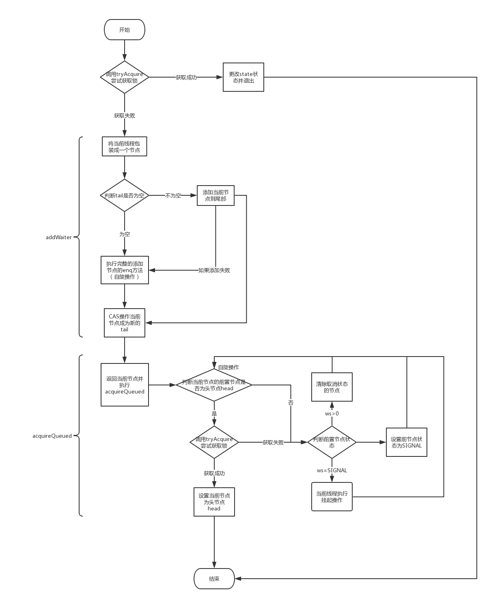
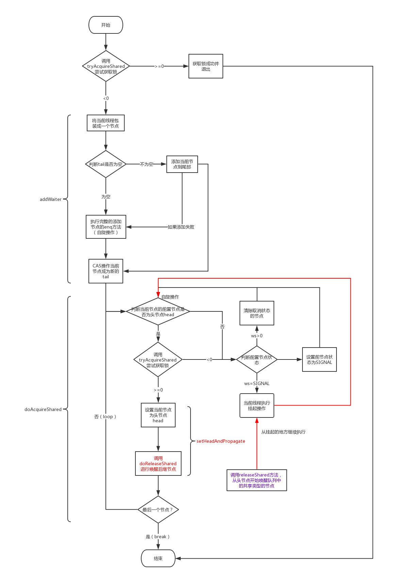
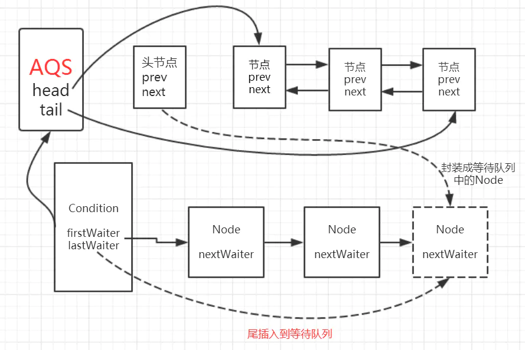
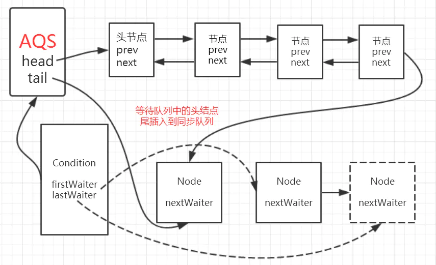
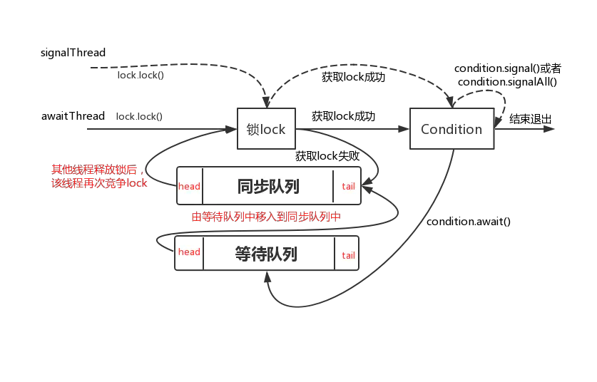
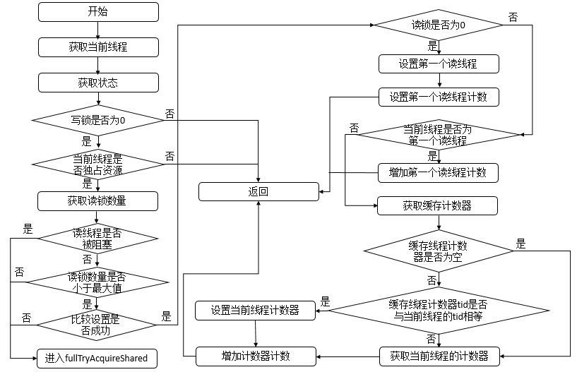
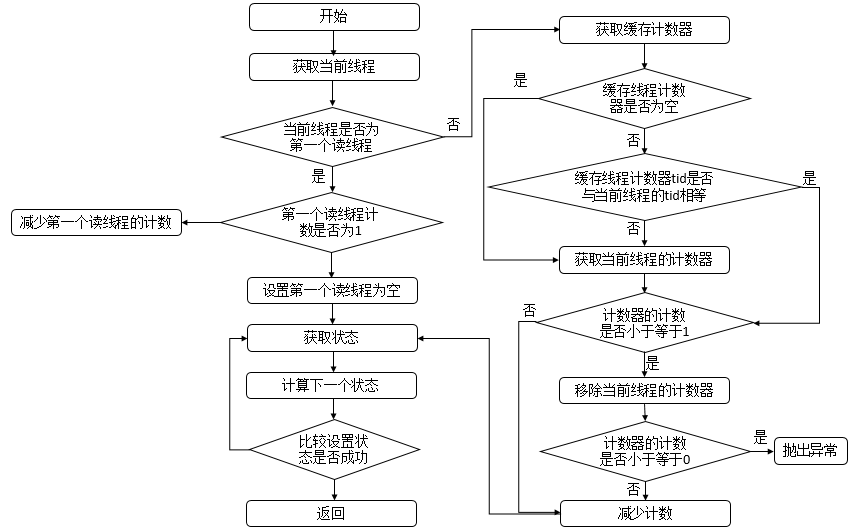

# Java并发之AQS源码分析

内存可见性：指某个线程正在使用对象状态而另一个线程同时修改了该状态，需要确保当一个线程修改了对象状态之后，其他线程能够立即看到发生的状态变化。

参考博客——[Java并发之AQS源码分析（一）](http://objcoding.com/2019/05/05/aqs-exclusive-lock/)

[从ReentrantLock的实现看AQS的原理及应用](https://tech.meituan.com/2019/12/05/aqs-theory-and-apply.html)

[volatile](https://juejin.im/post/6844903520760496141)

 AQS 全称是 AbstractQueuedSynchronizer，顾名思义，是一个用来构建锁和同步器的框架，它底层用了 CAS 技术来保证操作的原子性，同时利用 FIFO 队列实现线程间的锁竞争，将基础的同步相关抽象细节放在 AQS，这也是 ReentrantLock、CountDownLatch 等同步工具实现同步的底层实现机制。 

## AQS的结构

 AQS 就是建立在 CAS 的基础之上，增加了大量的实现细节，例如获取同步状态、FIFO 同步队列，独占式锁和共享式锁的获取和释放等等，这些都是 AQS 类对于同步操作抽离出来的一些通用方法，这么做也是为了对实现的一个同步类屏蔽了大量的细节，大大降低了实现同步工具的工作量

```java
public abstract class AbstractQueuedSynchronizer
  extends AbstractOwnableSynchronizer
    implements java.io.Serializable {

    private transient volatile Node head;

    private transient volatile Node tail;

    private volatile int state;

    protected final boolean compareAndSetState(int expect, int update) {
        // See below for intrinsics setup to support this
        return unsafe.compareAndSwapInt(this, stateOffset, expect, update);
    }

    // ...

 }
```

1. head 字段为等待队列的头节点，表示当前正在执行的节点；
2. tail 字段为等待队列的尾节点；
3. state 字段为同步状态，其中 state > 0 为有锁状态，每次加锁就在原有 state 基础上加 1，即代表当前持有锁的线程加了 state 次锁，反之解锁时每次减一，当 statte = 0 为无锁状态；
4. 通过 compareAndSetState 方法操作 CAS 更改 state 状态，保证 state 的原子性。
5. 这些字段都采用volatile关键字进行修饰，保证多线程下的字段可见性

 AQS 提供了两种锁，分别是独占锁和共享锁，独占锁指的是操作被认作一种独占操作，比如 ReentrantLock，它实现了独占锁的方法，而共享锁则指的是一个非独占操作，比如一些同步工具 CountDownLatch 和 Semaphore 等同步工具，下面是 AQS 对这两种锁提供的抽象方法。 

**独占锁**

```java
// 获取锁方法
protected boolean tryAcquire(int arg) {
  throw new UnsupportedOperationException();
}
// 释放锁方法
protected boolean tryRelease(int arg) {
  throw new UnsupportedOperationException();
}
```

 **共享锁**

```java
// 获取锁方法
protected int tryAcquireShared(int arg) {
  throw new UnsupportedOperationException();
}
// 释放锁方法
protected boolean tryReleaseShared(int arg) {
  throw new UnsupportedOperationException();
}
```

### 队列的模型表示

```
/**
  * <pre>
  *      +------+  prev +-----+       +-----+
  * head |      | <---- |     | <---- |     |  tail
  *      +------+       +-----+       +-----+
  * </pre>
  */
```

 这是一个普通双向链表的节点结构，多了 thread 字段用于存储当前线程对象，同时每个节点都有一个 waitStatus 等待状态，一共有四种状态： 

1. CANCELLED（1）：取消状态，如果当前线程的前置节点状态为 CANCELLED，则表明前置节点已经等待超时或者已经被中断了，这时需要将其从等待队列中删除。
2. SIGNAL（-1）：等待触发状态，如果当前线程的前置节点状态为 SIGNAL，则表明当前线程需要阻塞。
3. CONDITION（-2）：等待条件状态，表示当前节点在等待 condition，即在 condition 队列中。
4. PROPAGATE（-3）：状态需要向后传播，表示 releaseShared 需要被传播给后续节点，仅在共享锁模式下使用。

 head 节点可以表示成当前持有锁的线程的节点，其余线程竞争锁失败后，会加入到队尾，tail 始终指向队列的最后一个节点。 

AQS 的结构大概可总结为以下 3 部分：

1. **用 volatile 修饰的整数类型的 state 状态，用于表示同步状态，提供 getState 和 setState 来操作同步状态；**
2. **提供了一个 FIFO 等待队列，实现线程间的竞争和等待，这是 AQS 的核心；**
3. **AQS 内部提供了各种基于 CAS 原子操作方法，如 compareAndSetState 方法，并且提供了锁操作的acquire和release方法。**

## 独占锁

 **独占锁的原理是如果有线程获取到锁，那么其它线程只能是获取锁失败，然后进入等待队列中等待被唤醒。** 

### 获取锁

```java
public final void acquire(int arg) {
  if (!tryAcquire(arg) &&
      acquireQueued(addWaiter(Node.EXCLUSIVE), arg))
    selfInterrupt();
}
```

1. **通过 tryAcquire(arg) 方法尝试获取锁，这个方法需要实现类自己实现获取锁的逻辑，获取锁成功后则不执行后面加入等待队列的逻辑了；**
2. **如果尝试获取锁失败后，则执行 addWaiter(Node.EXCLUSIVE) 方法将当前线程封装成一个 Node 节点对象，并加入队列尾部；**
3. **把当前线程执行封装成 Node 节点后，继续执行 acquireQueued 的逻辑，该逻辑主要是判断当前节点的前置节点是否是头节点，来尝试获取锁，如果获取锁成功，则当前节点就会成为新的头节点，这也是获取锁的核心逻辑。**

#### addwaiter的实现

```java
private Node addWaiter(Node mode) {
  // 创建一个基于当前线程的节点，该节点是 Node.EXCLUSIVE 独占式类型
  Node node = new Node(Thread.currentThread(), mode);
  // Try the fast path of enq; backup to full enq on failure
  Node pred = tail;
  // 这里先判断队尾是否为空，如果不为空则直接将节点加入队尾
  if (pred != null) {
    node.prev = pred;
    // 采取 CAS 操作，将当前节点设置为队尾节点，由于采用了 CAS 原子操作，无论并发怎么修改，都有且只有一条线程可以修改成功，其余都将执行后面的enq方法(并发修改了)
    if (compareAndSetTail(pred, node)) {
      pred.next = node;
      return node;
    }
  }
  enq(node);
  return node;
}
```

简单来说 addWaiter(Node mode) 方法做了以下事情：

1. 创建基于当前线程的独占式类型的节点；
2. 利用 CAS 原子操作，将节点加入队尾。

```java
private Node enq(final Node node) {
  // 自旋操作
  for (;;) {
    Node t = tail;
    // 如果队尾节点为空，那么进行CAS操作初始化队列
    if (t == null) {
      // 这里很关键，即如果队列为空，那么此时必须初始化队列，初始化一个空的节点表示队列头，用于表示当前正在执行的节点，头节点即表示当前正在运行的节点
      if (compareAndSetHead(new Node()))
        tail = head;
    } else {
      node.prev = t;
      // 这一步也是采取CAS操作，将当前节点加入队尾，如果失败的话，自旋继续修改直到成功为止
      if (compareAndSetTail(t, node)) {
        t.next = node;//与唤醒阻塞的线程的从前向后的操作有关
        return t;
      }
    }
  }
}
```

1. 采用自旋机制，这是 aqs 里面很重要的一个机制；
2. **如果队尾节点为空，则初始化队列，将头节点设置为空节点，头节点即表示当前正在运行的节点；**
3. 如果队尾节点不为空，则继续采取 CAS 操作，将当前节点加入队尾，不成功则继续自旋，直到成功为止；

对比了上面两段代码，不难看出，首先是判断队尾是否为空，先进行一次 CAS 入队操作，如果失败则进入 enq(final Node node) 方法执行完整的入队操作。

完整的入队操作简单来说就是：**如果队列为空，初始化队列，并将头节点设为空节点，表示当前正在运行的节点，然后再将当前线程的节点加入到队列尾部。**

 经过上面 CAS 不断尝试，这时当前节点已经成功加入到队尾了，接下来就到了acquireQueued 的逻辑，我们继续往下看源码： 

```java
final boolean acquireQueued(final Node node, int arg) {
  boolean failed = true;
  try {
    // 线程中断标记字段
    boolean interrupted = false;
    for (;;) {
      // 获取当前节点的 pred 节点
      final Node p = node.predecessor();
      // 如果 pred 节点为 head 节点，那么再次尝试获取锁
      if (p == head && tryAcquire(arg)) {
        // 获取锁之后，那么当前节点也就成为了 head 节点
        setHead(node);
        p.next = null; // help GC
        failed = false;
        // 不需要挂起，返回 false
        return interrupted;
      }
      // 获取锁失败，则进入挂起逻辑,线程被唤醒的时候会进入这部分的逻辑中，再次尝试获取锁，并设置头节点
      // 这里锁获取失败的原因有1. 头节点不是head，（线程唤醒的时候是从后向前唤醒的）2. 没有拿到锁，唤醒的线程被非公平的抢锁方式抢了锁。这两种情况下，第一种情况会删除前面所有的cancel的结点
      if (shouldParkAfterFailedAcquire(p, node) &&
          parkAndCheckInterrupt())
        interrupted = true;
    }
  } finally {
    if (failed)
      cancelAcquire(node);
  }
}
```

这一步 acquireQueued(final Node node, int arg) 方法主要做了以下事情：

1. 判断当前节点的 pred 节点是否为 head 节点，如果是，则尝试获取锁；
2. 获取锁失败后，进入挂起逻辑。

```java
    private void setHead(Node node) {
        head = node;
        node.thread = null;
        node.prev = null;   // 切断与前一个结点的联系，以便GC
    }
```

sethead设置队列头的方法，thread是Node中记录的线程的地址，实际的线程没有消失

**head 节点代表当前持有锁的线程，那么如果当前节点的 pred 节点是 head 节点，很可能此时 head 节点已经释放锁了，所以此时需要再次尝试获取锁。** 

```java
private static boolean shouldParkAfterFailedAcquire(Node pred, Node node) {
  int ws = pred.waitStatus;
  if (ws == Node.SIGNAL)
    // 如果 pred 节点为 SIGNAL 状态，返回true，说明当前节点需要挂起
    return true;
  // 如果ws > 0,说明节点状态为CANCELLED，需要从队列中删除
  if (ws > 0) {
    do {
      node.prev = pred = pred.prev;
    } while (pred.waitStatus > 0);
    pred.next = node;
  } else {
    // 如果是其它状态，则操作CAS统一改成SIGNAL状态
    // 由于这里waitStatus的值只能是0或者PROPAGATE，所以我们将节点设置为SIGNAL，从新循环一次判断，退出该方法，重新进入acquireQueued获取锁，这里的else语句块和非公平锁的实现有关
    compareAndSetWaitStatus(pred, ws, Node.SIGNAL);
  }
  return false;
}
```

 **通俗来说就是：根据 pred 节点状态来判断当前节点是否可以挂起，如果该方法返回 false，那么挂起条件还没准备好，就会重新进入 acquireQueued(final Node node, int arg) 的自旋体，重新进行判断。如果返回 true，那就说明当前线程可以进行挂起操作了，那么就会继续执行挂起。** 同时在这一步操作中，会将以及被取消的线程进行出队操作，从队列中删除

#### 异常处理逻辑

```java
// java.util.concurrent.locks.AbstractQueuedSynchronizer

private void cancelAcquire(Node node) {
  // 将无效节点过滤
	if (node == null)
		return;
  // 设置该节点不关联任何线程，也就是虚节点
	node.thread = null;
	Node pred = node.prev;
  // 通过前驱节点，跳过取消状态的node
	while (pred.waitStatus > 0)
		node.prev = pred = pred.prev;
  // 获取过滤后的前驱节点的后继节点
	Node predNext = pred.next;
  // 把当前node的状态设置为CANCELLED
	node.waitStatus = Node.CANCELLED;
  // 如果当前节点是尾节点，将从后往前的第一个非取消状态的节点设置为尾节点
  // 更新失败的话，则进入else，如果更新成功，将tail的后继节点设置为null
	if (node == tail && compareAndSetTail(node, pred)) {
		compareAndSetNext(pred, predNext, null);
	} else {
		int ws;
    // 如果当前节点不是head的后继节点，1:判断当前节点前驱节点的是否为SIGNAL，2:如果不是，则把前驱节点设置为SINGAL看是否成功
    // 如果1和2中有一个为true，再判断当前节点的线程是否为null
    // 如果上述条件都满足，把当前节点的前驱节点的后继指针指向当前节点的后继节点
		if (pred != head && ((ws = pred.waitStatus) == Node.SIGNAL || (ws <= 0 && compareAndSetWaitStatus(pred, ws, Node.SIGNAL))) && pred.thread != null) {
			Node next = node.next;
			if (next != null && next.waitStatus <= 0)
				compareAndSetNext(pred, predNext, next);
		} else {
      // 如果当前节点是head的后继节点，或者上述条件不满足，那就唤醒当前节点的后继节点
			unparkSuccessor(node);
		}
		node.next = node; // help GC
	}
}
```

这一段代码的作用是当当前线程申请锁的过程中发生异常时，需要撤销当前申请锁的线程，同时将该线程以及线程之前被设置为canceled状态的结点出队。

#### 挂起逻辑

```java
private final boolean parkAndCheckInterrupt() {
  LockSupport.park(this);
  return Thread.interrupted();
}
```

 LockSupport 是用来创建锁和其他同步类的基本**线程阻塞**原语。LockSupport 提供 park() 和 unpark() 方法实现阻塞线程和解除线程阻塞。release 释放锁方法逻辑会调用 LockSupport.unPark 方法来唤醒后继节点。 



### 释放锁

```java
public final boolean release(int arg) {
  if (tryRelease(arg)) {
    Node h = head;
    if (h != null && h.waitStatus != 0)
      unparkSuccessor(h);
    return true;
  }
  return false;
}
```

 释放锁的方法源码就很好理解，通过 tryRelease(arg) 方法尝试释放锁，这个方法需要实现类自己实现释放锁的逻辑，释放锁成功后则执行后面的唤醒后续节点的逻辑了，然后判断 head 节点不为空并且 head 节点状态不为 0，因为 addWaiter 方法默认的节点状态为 0，此时节点还没有进入就绪状态。 

```java
private void unparkSuccessor(Node node) {
  int ws = node.waitStatus;
  if (ws < 0)
    // 将头节点的状态设置为0
    // 这里会尝试清除头节点的状态，改为初始状态
    compareAndSetWaitStatus(node, ws, 0);
  
  // 后继节点
  Node s = node.next;
  // 如果后继节点为null，或者已经被取消了
  if (s == null || s.waitStatus > 0) {
    s = null;
    // for循环从队列尾部一直往前找可以唤醒的节点
    for (Node t = tail; t != null && t != node; t = t.prev)
      if (t.waitStatus <= 0)
        s = t;
  }
  if (s != null)
    // 唤醒后继节点
    LockSupport.unpark(s.thread);
}
```

 **在独占锁模式下，用 state 值表示锁并且 0 表示无锁状态，0 -> 1 表示从无锁到有锁，仅允许一条线程持有锁，其余的线程会被包装成一个 Node 节点放到队列中进行挂起，队列中的头节点表示当前正在执行的线程，当头节点释放后会唤醒后继节点，从而印证了 AQS 的队列是一个 FIFO 同步队列。** 

**注意：**这里在唤醒队列的时候，是从后往前的，那么就有一个疑问，为什么不能够从前向后唤醒呢。原因处在入队的操作上，AQS入队的操作中是在更新完队尾tail之后，执行`prev.next = node`，因为更新队尾以及实现连接不是一个原子操作，因此存在更新了队尾但没有将前一个结点与后面的结点连接起来的情况，这样就会导致从前向后遍历的时候出现错误。

## 共享锁-数据库读锁

### 获取锁

```java
public final void acquireShared(int arg) {
  // 尝试获取共享锁，小于0表示获取失败
  if (tryAcquireShared(arg) < 0)
    // 执行获取锁失败的逻辑
    doAcquireShared(arg);
}
```

 这里的 tryAcquireShared 方法是留给实现方去实现获取锁的具体逻辑的，我们主要看 doAcquireShared 方法的实现逻辑： 

```java
private void doAcquireShared(int arg) {
  // 添加共享锁类型节点到队列中
  final Node node = addWaiter(Node.SHARED);
  boolean failed = true;
  try {
    boolean interrupted = false;
    for (;;) {
      final Node p = node.predecessor();
      if (p == head) {
        // 再次尝试获取共享锁
        int r = tryAcquireShared(arg);
        // 如果在这里成功获取共享锁，会进入共享锁唤醒逻辑
        if (r >= 0) {
          // 共享锁唤醒逻辑
          setHeadAndPropagate(node, r);
          p.next = null; // help GC
          if (interrupted)
            selfInterrupt();
          failed = false;
          return;
        }
      }
      // 与独占锁相同的挂起逻辑
      if (shouldParkAfterFailedAcquire(p, node) &&
          parkAndCheckInterrupt())
        interrupted = true;
    }
  } finally {
    if (failed)
      cancelAcquire(node);
  }
}
```

 **同样是采用了自旋机制，在线程挂起之前，不断地循环尝试获取锁，不同的是，一旦获取共享锁，会调用 setHeadAndPropagate 方法同时唤醒后继节点，实现共享模式**，下面是唤醒后继节点代码逻辑： 

```java
private void setHeadAndPropagate(Node node, int propagate) {
  // 头节点
  Node h = head; 
  // 设置当前节点为新的头节点
  // 这里不需要加锁操作，因为获取共享锁后，会从FIFO队列中依次唤醒队列，并不会产生并发安全问题
  setHead(node);
  if (propagate > 0 || h == null || h.waitStatus < 0 ||
      (h = head) == null || h.waitStatus < 0) {
    // 后继节点
    Node s = node.next;
    // 如果后继节点为空或者后继节点为共享类型，则进行唤醒后继节点
    // 这里后继节点为空意思是只剩下当前头节点了
    if (s == null || s.isShared())
      doReleaseShared();
  }
}
```

该方法主要做了两个重要的步骤：

1. **将当前节点设置为新的头节点，这点很重要，这意味着当前节点的前置节点（旧头节点）已经获取共享锁了，从队列中去除；**
2. **调用 doReleaseShared 方法，它会调用 unparkSuccessor 方法唤醒后继节点。**

### 释放锁

```java
public final boolean releaseShared(int arg) {
  // 由用户自行实现释放锁条件
  if (tryReleaseShared(arg)) {
    // 执行释放锁
    doReleaseShared();
    return true;
  }
  return false;
}
```

```java
private void doReleaseShared() {
  for (;;) {
    // 从头节点开始执行唤醒操作
    // 这里需要注意，如果从setHeadAndPropagate方法调用该方法，那么这里的head是新的头节点
    Node h = head;
    if (h != null && h != tail) {
      int ws = h.waitStatus;
      //表示后继节点需要被唤醒
      if (ws == Node.SIGNAL) {
        // 初始化节点状态
        //这里需要CAS原子操作，因为setHeadAndPropagate和releaseShared这两个方法都会顶用doReleaseShared，避免多次unpark唤醒操作，这种情况下再执行循环ws就不是Node.SIGNAL了，也就不会去唤醒其他线程
        if (!compareAndSetWaitStatus(h, Node.SIGNAL, 0))//被其他被唤醒的线程执行了
          // 如果初始化节点状态失败，继续循环执行
          continue;            // loop to recheck cases
        // 执行唤醒操作
        unparkSuccessor(h);
      }
      //如果后继节点暂时不需要唤醒，那么当前头节点状态更新为PROPAGATE，确保后续可以传递给后继节点
      else if (ws == 0 &&
               !compareAndSetWaitStatus(h, 0, Node.PROPAGATE))
        continue;                // loop on failed CAS
    }
    // 如果在唤醒的过程中头节点没有更改，退出循环
    // 这里防止其它线程又设置了头节点，说明其它线程获取了共享锁，会继续循环操作
    if (h == head)                   // loop if head changed
      break;
  }
}
```




从独占锁以及共享锁的源码可以看出，在释放锁的时候实现后续的线程的唤醒，在获得锁的时候，如果不能拿到锁，独占锁会进入阻塞状态，等待释放时唤醒，而共享锁执行CAS操作，反复尝试获取锁，获得锁之后就会唤醒之后队列中所有要求获得共享锁的队列，并将前方已经不需要锁的线程出队。

最后有关releaseShared()方法，为什么要有 (!compareAndSetWaitStatus(h, Node.SIGNAL, 0))这一段CAS操作。原因的话因为一个要求获取读锁的线程在获得锁成功之后都会去唤醒他的后续的结点的线程，线程在被唤醒的时候执行的是的是acquireShared操作，该操作会把head设置为自己，并且唤醒后续的结点，因此所有的线程都会去唤醒自己后续结点，唤醒速度很快，而那些已经被唤醒的线程获得head之后也会通过CAS进行head的状态修改和后续线程的唤醒，防止由于唤醒过程中某一个线程阻塞导致唤醒被阻塞，但是，由于head会频繁的变化，所以最后需要有一句判断语句`head == h`保证已经没有其他线程可以唤醒了来实现唤醒过程的退出。这样为了保证不会重复唤醒线程就需要前面提到的CAS操作。参考这里—— [读写锁doReleaseShared源码分析及唤醒后继节点的过程分析](https://www.iambigboss.top/post/72439_1_1.html) 

## AQS的阻塞

AQS的阻塞实现包括一些await()方法等，这些阻塞方法会先判断线程的中断状态，如果线程此时带有中断标记，那么就会抛出异常

```java
        public final void await() throws InterruptedException {
            // 如果线程带有中断标记，则抛出异常
            if(Thread.interrupted()) {
                throw new InterruptedException();
            }
```

## AQS的条件队列

AQS的条件队列中，通过实现Condition接口来实现一个条件队列，该条件队列与上面提到的Node实现的队列相同，本质上也是一个FIFO的队列，但是这个队列是一个单向的队列，每new一个Condition就会管理一个队列，**通过await来讲当前线程添加到阻塞队列当中，通过singal方法来唤醒队列中的线程**

```java
           /      * 操作步骤：
         * 1.将该线程的引用封装到{条件node}中，并进入【|条件队列|】排队
         * 2.释放掉该线程持有的全部许可证，即让锁重新处于可用状态
         * 3.唤醒【|同步队列|】中的等待者重新争锁——**这一句重要**
         * 4.将自身陷入阻塞，等待signal()唤醒
         * 5.被signal()唤醒后，将排队的{条件node}移入【|同步队列|】，
         *   并恢复其许可证，让其继续执行...
         */
		public final void await() throws InterruptedException {
            // 如果线程带有中断标记，则抛出异常
            if(Thread.interrupted()) {
                throw new InterruptedException();
            }
            
            // 添加一个新的[条件Node](缓存了当前线程的引用)到【|条件队列|】，并返回刚添加的node
            Node node = addConditionWaiter();
            
            /*
             * 针对独占锁，丢弃node所在线程持有的所有许可证（数量由savedState保存），并唤醒【|同步队列|】后续的阻塞线程
             * 这样一来，同步队列中排在首位的线程又可以开始抢锁了
             */
            int savedState = fullyRelease(node);
            
            int interruptMode = 0;
            
            // 判断node是否正位于【|同步队列|】中等待重新获取锁，刚入队就被唤醒了
            while(!isOnSyncQueue(node)) {
                // 如果结点位于【|条件队列|】，则暂停运行，陷入阻塞
                LockSupport.park(this);
                
                /* 从这里被signal()唤醒后，node已成为【|同步队列|】的首个结点（不是头结点），并准备去抢锁 */
                
                // 唤醒阻塞线程后，首先检查其当前是否有中断标记，如果有的话直接跳出循环
                if((interruptMode = checkInterruptWhileWaiting(node)) != 0) {
                    break;
                }
            }
            
            /*
             * 之前被阻塞的线程现在已经可以去争锁了
             * 而且，争锁时会携带之前保存的许可证数量
             * 争锁成功后，该结点会成为【|同步队列|】的头结点，并恢复运行
             */
            if(acquireQueued(node, savedState)) {
                // 如果不需要抛异常，则修改标记为REINTERRUPT，代表稍后要恢复线程的中断状态
                if(interruptMode != THROW_IE){
                    interruptMode = REINTERRUPT;
                }
            }
            
            // clean up if cancelled
            if(node.nextWaiter != null) {
                unlinkCancelledWaiters();
            }
            
            // 有中断标记的情况下
            if(interruptMode != 0) {
                // 对刚刚唤醒的带有中断标记的线程进行特殊处理
                reportInterruptAfterWait(interruptMode);
            }
        }

```

 **当调用condition.await()方法后会使得当前获取lock的线程进入到等待队列，如果该线程能够从await()方法返回的话一定是该线程获取了与condition相关联的lock** 

**当前线程调用condition.await()方法后，会使得当前线程释放lock然后加入到等待队列中，直至被signal/signalAll后会使得当前线程从等待队列中移至到同步队列中去，直到获得了lock后才会从await方法返回，或者在等待时被中断会做中断处理**。 这样就需要解决三个问题：1. 是怎样将当前线程添加到等待队列中去的？2.释放锁的过程？3.怎样才能从await方法退出？ 

```java
private Node addConditionWaiter() {
    Node t = lastWaiter;
    // If lastWaiter is cancelled, clean out.
    if (t != null && t.waitStatus != Node.CONDITION) {
        unlinkCancelledWaiters();
        t = lastWaiter;
    }
	//将当前线程包装成Node
    Node node = new Node(Thread.currentThread(), Node.CONDITION);
    if (t == null)
        firstWaiter = node;
    else
		//尾插入
        t.nextWaiter = node;
	//更新lastWaiter
    lastWaiter = node;
    return node;
}

```

 将当前节点包装成Node，如果等待队列的firstWaiter为null的话（等待队列为空队列），则将firstWaiter指向当前的Node,否则，更新lastWaiter(尾节点)即可。就是**通过尾插入的方式将当前线程封装的Node插入到等待队列中即可** ，同时可以看出等待队列是一个**不带头结点的链式队列**，  将当前节点插入到等待对列之后，会使当前线程释放lock，由fullyRelease方法实现，fullyRelease源码为： 

```java
final int fullyRelease(Node node) {
    boolean failed = true;
    try {
        int savedState = getState();
        if (release(savedState)) {//release方法在确定锁被释放之后，唤醒head之后被阻塞的线程，这些线程会在抢到锁之后将head修改为自己，就是前面讲到的获得锁的方法
			//成功释放同步状态
            failed = false;
            return savedState;
        } else {
			//不成功释放同步状态抛出异常
            throw new IllegalMonitorStateException();
        }
    } finally {
        if (failed)
            node.waitStatus = Node.CANCELLED;
    }
}
```

 **调用AQS的模板方法release方法（独占锁的方法）释放AQS的同步状态并且唤醒在同步队列中头结点的后继节点引用的线程**，如果释放成功则正常返回，若失败的话就抛出异常。 注意这里并没有将调用await的线程从同步队列中移除，只是移动到了条件队列中，在realse方法调用之后，唤醒了后续的线程之后才真正清理了头节点

```java
while (!isOnSyncQueue(node)) {
	// 3. 当前线程进入到等待状态
    LockSupport.park(this);
    if ((interruptMode = checkInterruptWhileWaiting(node)) != 0)
        break;
}
```

很显然，当线程第一次调用condition.await()方法时，会进入到这个while()循环中，然后通过LockSupport.park(this)方法使得当前线程进入等待状态，那么要想退出这个await方法第一个前提条件自然而然的是要先退出这个while循环，出口就只剩下两个地方：**1. 逻辑走到break退出while循环；2. while循环中的逻辑判断为false**。再看代码出现第1种情况的条件是当前等待的线程被中断后代码会走到break退出，第二种情况是当前节点被移动到了同步队列中（即另外线程调用的condition的signal或者signalAll方法），while中逻辑判断为false后结束while循环。总结下，就是**当前线程被中断或者调用condition.signal/condition.signalAll方法当前节点移动到了同步队列后** ，这是当前线程退出await方法的前提条件。当退出while循环后就会调用



对于signal和signalAll，signal唤醒的是条件队列中的第一个线程，signalAll唤醒的是条件队列所有的线程

**调用condition的signal或者signalAll方法可以将等待队列中等待时间最长的节点移动到同步队列中**，使得该节点能够有机会获得lock。按照等待队列是先进先出（FIFO）的，所以等待队列的头节点必然会是等待时间最长的节点，也就是每次调用condition的signal方法是将头节点移动到同步队列中。

```java
public final void signal() {
    //1. 先检测当前线程是否已经获取lock
    if (!isHeldExclusively())
        throw new IllegalMonitorStateException();
    //2. 获取等待队列中第一个节点，之后的操作都是针对这个节点
	Node first = firstWaiter;
    if (first != null)
        doSignal(first);
}
```

 signal方法首先会检测当前线程是否已经获取lock，如果没有获取lock会直接抛出异常，如果获取的话再得到等待队列的头指针引用的节点，之后的操作的doSignal方法也是基于该节点。 

```java
private void doSignal(Node first) {
    do {
        if ( (firstWaiter = first.nextWaiter) == null)
            lastWaiter = null;
		//1. 将头结点从等待队列中移除
        first.nextWaiter = null;
		//2. while中transferForSignal方法对头结点做真正的处理
    } while (!transferForSignal(first) &&
             (first = firstWaiter) != null);
}

```

 具体逻辑请看注释，真正对头节点做处理的逻辑在**transferForSignal**放，该方法源码为： 

```java
final boolean transferForSignal(Node node) {
    /*
     * If cannot change waitStatus, the node has been cancelled.
     */
	//1. 更新状态为0
    if (!compareAndSetWaitStatus(node, Node.CONDITION, 0))
        return false;

    /*
     * Splice onto queue and try to set waitStatus of predecessor to
     * indicate that thread is (probably) waiting. If cancelled or
     * attempt to set waitStatus fails, wake up to resync (in which
     * case the waitStatus can be transiently and harmlessly wrong).
     */
	//2.将该节点移入到同步队列中去
    Node p = enq(node);//旧的tail
    int ws = p.waitStatus;
    if (ws > 0 || !compareAndSetWaitStatus(p, ws, Node.SIGNAL))//如果线程前方结点被取消了或者可以设置其为signal，那么直接唤醒线程，这里因为signalAll也调用了，所以不一定能保证唤醒
        LockSupport.unpark(node.thread);
    return true;
}

```

 这段代码主要做了两件事情1.将头结点的状态更改为CONDITION；2.调用enq方法，将该节点尾插入到同步队列中， **调用condition的signal的前提条件是当前线程已经获取了lock，该方法会使得等待队列中的头节点即等待时间最长的那个节点移入到同步队列，而移入到同步队列后才有机会使得等待线程被唤醒，即从await方法中的LockSupport.park(this)方法中返回，从而才有机会使得调用await方法的线程成功退出**。



最终await和signal的分析如下：




对于signalAll，它的主要的逻辑如下

```java
        // 将【|条件队列|】中所有结点挨个追加到【|同步队列|】中，并让其处于待唤醒状态
        private void doSignalAll(Node first) {
            lastWaiter = firstWaiter = null;
            do {
                Node next = first.nextWaiter;
                first.nextWaiter = null;
                transferForSignal(first);
                first = next;
            } while(first != null);
        }
```

# 基于AQS的实现类

## 公平锁的实现

```java
        // 申请一次公平锁，返回值代表锁是否申请成功
        final boolean fairTryAcquire(int acquires) {
            // 获取申请锁的线程
            final Thread current = Thread.currentThread();
            
            // 当前许可证数量
            int c = getState();
            
            // 如果锁没有被任何线程占用
            if(c == 0) {
                /* 发现锁空闲时，需要检查有没有其他线程在排队，如果没有其他人在队首，才尝试抢锁，这也是"公平"所在 */
                
                // 判断【|同步队列|】的队头是否还有其他（非当前线程）的线程在排队
                if(!hasQueuedPredecessors()) {
                    // 尝试更新许可证数量为acquires，返回true代表更新成功，即成功抢到了锁
                    if(compareAndSetState(0, acquires)){
                        // 设置当前线程为<占有者线程>
                        setExclusiveOwnerThread(current);
                        return true;
                    }
                }
            } else {
                /* 至此，说明锁已被占用 */
                
                // 如果当前线程不是锁的占用者，直接返回false，代表抢锁失败，该线程需要去排队
                if(current != getExclusiveOwnerThread()) {
                    return false;
                }
                
                /* 至此，说明当前线程就是占用锁的线程，则需要再次持有锁，累计许可证数量，这也是"可重入"的含义 */
                
                // 更新许可证数量
                int nextc = c + acquires;
                if(nextc<0) {
                    // 溢出
                    throw new Error("Maximum lock count exceeded");
                }
                setState(nextc);
                
                return true;
            }
            
            return false;
        }
```

公平锁检测的时候需要检测是否有排队的队列，如果有那么该线程就去排队了

```java
        // 申请一次非公平锁，返回值代表锁是否申请成功
        @ReservedStackAccess
        final boolean nonfairTryAcquire(int acquires) {
            // 获取申请锁的线程
            final Thread current = Thread.currentThread();
            
            // 当前许可证数量
            int c = getState();
            
            // 如果锁没有被任何线程占用
            if(c == 0) {
                /* 发现锁空闲时，不管【同步队列】中有没有人抢锁，该线程直接尝试抢锁，这也是"非公平"所在 */
                
                // 尝试更新许可证数量为acquires，返回true代表更新成功，即成功抢到了锁
                if(compareAndSetState(0, acquires)) {
                    // 设置当前线程为<占有者线程>
                    setExclusiveOwnerThread(current);
                    return true;
                }
            } else {
                /* 至此，说明锁已被占用 */
                
                // 如果当前线程不是锁的占用者，直接返回false，代表抢锁失败，该线程需要去排队
                if(current != getExclusiveOwnerThread()) {
                    return false;
                }
                
                /* 至此，说明当前线程就是占用锁的线程，则需要再次持有锁，累计许可证数量，这也是"可重入"的含义 */
                
                // 更新许可证数量
                int nextc = c + acquires;
                if(nextc<0) {
                    // 溢出
                    throw new Error("Maximum lock count exceeded");
                }
                setState(nextc);
                
                return true;
            }
            
            return false;
        }
```

非公平锁会直接抢锁，如果抢到锁，那么抢到锁的线程就继续执行，而没抢到锁的就进入阻塞，此时需要注意抢到锁的线程根本就没有进入队列中。举例如下，假设现在，线程1正在执行，head为线程1，线程2正在等待唤醒，而当线程1释放锁的时候，线程3过来插队并抢先拿到锁，而线程1此时唤醒了线程2，线程2抢不到锁，进入阻塞逻辑(见获取锁的代码)，因为线程2抢不到锁，也就无法进入setHead语句块，也就是说在线程3持有锁的期间，同步队列的head一直都是已经不需要锁的线程1。

```java
public final boolean hasQueuedPredecessors() {
	// The correctness of this depends on head being initialized
	// before tail and on head.next being accurate if the current
	// thread is first in queue.
	Node t = tail; // Read fields in reverse initialization order
	Node h = head;
	Node s;
	return h != t && ((s = h.next) == null || s.thread != Thread.currentThread());
}
```

这个方法是判断有没有前置结点的方法，注意其中判断的是h.next==null。原因有两个：1）如果等待队列中，第一个结点时一个空结点，那么真实有效的结点是下一个结点，2），头节点是当前释放出锁的线程，那么此时该线程不在需要锁，等待队列应该从下一节点算起。

## ReentrantLock

内部类包括Sync和FairSync和NonFairSync，SyNc实现了fairAcquire和NonfairAcquire方法以及相应的release方法，NonFairSync和FairSync实现了tryAcquire方法，这个方法最终是根据锁是否公平调用了相应的方法

### 属性和构造方法

```java
    // Sync是一个同步队列，这是锁的真正实现
    private final Sync sync;

    // 默认创建一个非公平锁
    public ReentrantLock() {
        sync = new NonfairSync();
    }
    // 创建一个锁，fair决定锁是公平锁还是非公平锁
    public ReentrantLock(boolean fair) {
        sync = fair ? new FairSync() : new NonfairSync();
    }
```

### 基本API

```java
    public void lock() {
        // 生产一张许可证
        sync.acquire(1);
    }
        // 释放独占锁，如果锁已被完全释放，则唤醒后续的阻塞线程
    public void unlock() {
        // 消费一张许可证
        sync.release(1);
    }
```

ReentrantLock底层实际使用的就是一个AQS，基本所有的操作都被转化到AQS上来实现了。其中lock调用sync.acquire方法，尝试获取锁，该方法通过多态的方式调用tryAcquire()，这个方法是由具体的子类来实现的，如果能获取到锁，就执行获取锁的操作，如果不行，就直接进入排队。unlock也是在最后调用了release，这些方法都在上面被称述过了。

#### ReetrantLock实现的请求资源以及释放资源的代码

上面的lock以及unlock    API会根据sync是公平锁还是非公平锁来调用不同的获取锁的方法，以下是具体的代码实现逻辑。在非公平锁的条件下，线程会直接插队抢锁，而公平锁情况下，先判断等待队列是否为空，空队列的情况下抢锁，否则进入阻塞。注意ReentrantLock是一个可重入的锁，他的资源管理用的是state（就是AQS里面的那个），因此同一线程多次取得锁执行的是在state上加1，直到溢出抛出错误。

```java
abstract static class Sync extends AbstractQueuedSynchronizer {
        
        private static final long serialVersionUID = -5179523762034025860L;
        
        /**
         * Performs non-fair tryLock.  tryAcquire is implemented in
         * subclasses, but both need nonfair try for trylock method.
         */
        // 申请一次非公平锁，返回值代表锁是否申请成功
        @ReservedStackAccess
        final boolean nonfairTryAcquire(int acquires) {
            // 获取申请锁的线程
            final Thread current = Thread.currentThread();
            
            // 当前许可证数量
            int c = getState();
            
            // 如果锁没有被任何线程占用
            if(c == 0) {
                /* 发现锁空闲时，不管【同步队列】中有没有人抢锁，该线程直接尝试抢锁，这也是"非公平"所在 */
                
                // 尝试更新许可证数量为acquires，返回true代表更新成功，即成功抢到了锁
                if(compareAndSetState(0, acquires)) {
                    // 设置当前线程为<占有者线程>
                    setExclusiveOwnerThread(current);
                    return true;
                }
            } else {
                /* 至此，说明锁已被占用 */
                
                // 如果当前线程不是锁的占用者，直接返回false，代表抢锁失败，该线程需要去排队，可能是被唤醒的线程抢了，所以要判断当前持有线程的对象
                if(current != getExclusiveOwnerThread()) {
                    return false;
                }
                
                /* 至此，说明当前线程就是占用锁的线程，则需要再次持有锁，累计许可证数量，这也是"可重入"的含义 */
                
                // 更新许可证数量
                int nextc = c + acquires;
                if(nextc<0) {
                    // 溢出
                    throw new Error("Maximum lock count exceeded");
                }
                setState(nextc);
                
                return true;
            }
            
            return false;
        }
        
        // 申请一次公平锁，返回值代表锁是否申请成功
        final boolean fairTryAcquire(int acquires) {
            // 获取申请锁的线程
            final Thread current = Thread.currentThread();
            
            // 当前许可证数量
            int c = getState();
            
            // 如果锁没有被任何线程占用
            if(c == 0) {
                /* 发现锁空闲时，需要检查有没有其他线程在排队，如果没有其他人在队首，才尝试抢锁，这也是"公平"所在 */
                
                // 判断【|同步队列|】的队头是否还有其他（非当前线程）的线程在排队
                if(!hasQueuedPredecessors()) {
                    // 尝试更新许可证数量为acquires，返回true代表更新成功，即成功抢到了锁
                    if(compareAndSetState(0, acquires)){
                        // 设置当前线程为<占有者线程>
                        setExclusiveOwnerThread(current);
                        return true;
                    }
                }
            } else {
                /* 至此，说明锁已被占用 */
                
                // 如果当前线程不是锁的占用者，直接返回false，代表抢锁失败，该线程需要去排队
                if(current != getExclusiveOwnerThread()) {
                    return false;
                }
                
                /* 至此，说明当前线程就是占用锁的线程，则需要再次持有锁，累计许可证数量，这也是"可重入"的含义 */
                
                // 更新许可证数量
                int nextc = c + acquires;
                if(nextc<0) {
                    // 溢出
                    throw new Error("Maximum lock count exceeded");
                }
                setState(nextc);
                
                return true;
            }
            
            return false;
        }
        
        // 释放一次锁，返回值表示同步锁是否处于自由状态（无线程持有）
        @ReservedStackAccess
        protected final boolean tryRelease(int releases) {
            // 计算应该剩余的许可证数量
            int c = getState() - releases;
            
            // 如果当前线程不是锁的占用者，抛出异常
            if(!isHeldExclusively()) {
                throw new IllegalMonitorStateException();
            }
            
            // 记录许可证是否被全部消费，如果全部消费，则锁处于自由状态
            boolean free = false;
            
            if(c == 0) {
                free = true;
                // 清空当前锁的持有者
                setExclusiveOwnerThread(null);
            }
            
            // 更新许可证数量
            setState(c);
            
            return free;
        }//可重入的释放锁，只有资源全部释放了才会执行唤醒其他线程的操作
```


## ReentrantReadWriteLock

### 属性以及构造方法

```java
    final Sync sync;
    private final ReentrantReadWriteLock.ReadLock readerLock;
    private final ReentrantReadWriteLock.WriteLock writerLock;
// 默认无参构造方法-默认非公平锁
    // 当前所有持有"读"锁的线程中，首个申请"读"锁的线程
    private transient Thread firstReader;
    // 首个申请"读"锁的线程对"读"锁的重入次数（许可证数量）
    private transient int firstReaderHoldCount;
public ReentrantReadWriteLock() {
    this(false);
}
// 提供了是否公平锁的参数构造
public ReentrantReadWriteLock(boolean fair) {
    sync = fair ? new FairSync() : new NonfairSync();
    readerLock = new ReadLock(this);
    writerLock = new WriteLock(this);
}
```

先创建一个公用的同步器，之后执行初始化读锁和写锁，注意读锁和写锁中都传递了this，根据读锁和写锁的构造函数，可以直到，读锁和写锁中的同步队列用的就是外部的同步队列

#### ReentrantReadWriteLock的样例代码

```java
class CachedData {
    Object data;
    volatile boolean cacheValid;
    // 读写锁实例
    final ReentrantReadWriteLock rwl = new ReentrantReadWriteLock();

    void processCachedData() {
        // 获取读锁
        rwl.readLock().lock();
        if (!cacheValid) { // 如果缓存过期了，或者为 null
            // 释放掉读锁，然后获取写锁 (后面会看到，没释放掉读锁就获取写锁，会发生死锁情况)
            rwl.readLock().unlock();
            rwl.writeLock().lock();

            try {
                if (!cacheValid) { // 重新判断，因为在等待写锁的过程中，可能前面有其他写线程执行过了
                    data = ...
                    cacheValid = true;
                }
                // 获取读锁 (持有写锁的情况下，是允许获取读锁的，称为 “锁降级”，反之不行。)
                rwl.readLock().lock();
            } finally {
                // 释放写锁，此时还剩一个读锁
                rwl.writeLock().unlock(); // Unlock write, still hold read
            }
        }

        try {
            use(data);
        } finally {
            // 释放读锁
            rwl.readLock().unlock();
        }
    }
}
```

### 读写锁的申请流程

```java
    /*
     * 同步队列的实现者，实现了读/写锁的语义
     *
     * 读/写锁的许可证数量存储在state中
     * state的高16位存储"读"锁（共享锁）的许可证（所有线程），SHARED_UNIT是高16位的最低位
     * state的低16位存储"写"锁（独占锁）的许可证（所有线程），独占锁EXCLUSIVE
     *
     * 总结：
     *
     * >>>> 申请"写"锁
     * 1.存在"读"锁的情形下，不允许申请"写"锁
     * 2.某一个时刻，最多有一个线程持有"写"锁
     * 3.在不违背规则1、2的情形下：
     * 3.1.如果申请"写"锁的线程不被阻塞，则其总能申请到"写"锁
     * 3.2.如果申请"写"锁的线程需要被阻塞，则当前线程无法申请到"写"锁
     * ▋注：关于申请"写"锁的线程被阻塞的情形：
     * ▋▋争夺公平锁时，如果【|同步队列|】中存在其他线程在队首排队，则当前线程被阻塞
     *
     * >>>> 申请"读"锁
     * 1.在其他线程持有"写"锁时，不允许当前线程申请"读"锁
     * 2.在当前线程持有"写"锁时，依然可以申请到"读"锁（锁降级）
     * 3.在不违背1/2的情形下：
     * 3.1.如果申请"读"锁的线程不被阻塞，则其总能申请到"读"锁
     * 3.2.如果申请"读"锁的线程需要被阻塞，则只有发生"重入"现象的线程可以申请到"读"锁
     * ▋注：关于申请"读"锁的线程被阻塞的情形：
     * ▋▋争夺公平锁时，如果【|同步队列|】中存在其他线程在队首排队，则当前线程被阻塞
     * ▋▋争夺非公平锁时，如果【|同步队列|】的首位是持有"写"锁的线程，则当前线程被阻塞
     */
```

### RWLock的内部类

这个读写锁的核心是三个内部类： ReadLock、WriteLock、Sync 

#### 读锁

```java
public static class ReadLock implements Lock, java.io.Serializable {
    private static final long serialVersionUID = -5992448646407690164L;
    private final Sync sync;
    protected ReadLock(ReentrantReadWriteLock lock) {
        sync = lock.sync;
    }
    public void lock();
    public void lockInterruptibly() throws InterruptedException;
    public boolean tryLock();
    public void unlock();
    public Condition newCondition();
}
```

#### 写锁

```java
public static class WriteLock implements Lock, java.io.Serializable {
    private static final long serialVersionUID = -4992448646407690164L;
    private final Sync sync;
    protected WriteLock(ReentrantReadWriteLock lock) {
        sync = lock.sync;
    }
    public void lock();
    public void lockInterruptibly() throws InterruptedException;
    public boolean tryLock( );
    public void unlock();
    public Condition newCondition();
    public boolean isHeldByCurrentThread();
    public int getHoldCount();
}

```

#### 同步队列

```java
abstract static class Sync extends AbstractQueuedSynchronizer {
    private static final long serialVersionUID = 6317671515068378041L;
    /*
    锁定状态在逻辑上分为两个无符号短路：
        1.较低的一个表示独占（写）锁定保持计数，
        2.共享（读）锁保持计数的上限。
    */
    static final int SHARED_SHIFT   = 16;
    static final int SHARED_UNIT    = (1 << SHARED_SHIFT);
    static final int MAX_COUNT      = (1 << SHARED_SHIFT) - 1;
    static final int EXCLUSIVE_MASK = (1 << SHARED_SHIFT) - 1;

    /** Returns the number of shared holds represented in count  */
    static int sharedCount(int c)    { return c >>> SHARED_SHIFT; }
    /** Returns the number of exclusive holds represented in count  */
    static int exclusiveCount(int c) { return c & EXCLUSIVE_MASK; }

    static final class HoldCounter {
        int count = 0;
        // Use id, not reference, to avoid garbage retention
        final long tid = getThreadId(Thread.currentThread());
    }

    static final class ThreadLocalHoldCounter
        extends ThreadLocal<HoldCounter> {
        public HoldCounter initialValue() {
            return new HoldCounter();
        }
    }
    private transient ThreadLocalHoldCounter readHolds;
    private transient HoldCounter cachedHoldCounter;
    private transient Thread firstReader = null;
    private transient int firstReaderHoldCount;

    Sync() {
        readHolds = new ThreadLocalHoldCounter();
        setState(getState()); // ensures visibility of readHolds
    }
}

```

###### holdCount作用：

```java
        /*
         * 缓存申请"读"锁的线程的信息
         *
         * 该线程时当前所有持有"读"锁的线程中，非首个申请"读"锁的线程
         *
         * 每次出现非首个申请"读"锁的线程申请"读"锁时，都要先判断该缓存是否仍然有效，
         * 有效的依据是缓存不为空，且缓存中的线程与当前申请"读"锁的线程是一个线程
         *
         * 如果缓存已经失效，需要重新创建一个新的HoldCounter作为缓存，
         * 如果缓存未失效，还要判断该缓存是否关联到了当前线程中（有可能之前关联进去了，但后来被剔除了），
         * 如果该缓存与当前申请"读"锁的线程已无关联，则需要重建进行关联
         *
         * 当缓存与当前线程关联好之后，累计许可证数量
         *
         * 简单地说，除首个申请"读"锁的线程之外，
         * 其他每个线程内部都缓存了一个HoldCounter，用来记录各自对"读"锁的申请（重入）次数
         * 当重入次数为0时，需要将缓存的HoldCounter从线程中移除
         */
```

### 读锁-lock()

完整的实现过程如下：

```java
// ReentrantReadWriteLock.ReadLock.lock()
public void lock() {
    sync.acquireShared(1);
}
// AbstractQueuedSynchronizer.acquireShared()
public final void acquireShared(int arg) {
 // 尝试获取共享锁（返回1表示成功，返回-1表示失败）
 if (tryAcquireShared(arg) < 0)
 // 失败了就可能要排队
        doAcquireShared(arg);
}
//尝试获取锁的逻辑
// ReentrantReadWriteLock.Sync.tryAcquireShared()
protected final int tryAcquireShared(int unused) {
 Thread current = Thread.currentThread();
 // 状态变量的值
 // 在读写锁模式下，高16位存储的是共享锁（读锁）被获取的次数，低16位存储的是互斥锁（写锁）被获取的次数
 int c = getState();
 // 互斥锁的次数
 // 如果其它线程获得了写锁，直接返回-1
 if (exclusiveCount(c) != 0 &&
        getExclusiveOwnerThread() != current)
 return -1;
 // 读锁被获取的次数
 int r = sharedCount(c);

 // 下面说明此时还没有写锁，尝试去更新state的值获取读锁
 // 读者是否需要排队（是否是公平模式）
        /*
         * 是否需要阻塞当前申请"读"锁的线程
         * 在非公平锁语境下，如果【|同步队列|】的首位是持有"写"锁的线程，则阻塞当前申请"读"锁的线程
         * 在  公平锁语境下，如果【|同步队列|】的首位是其他排队线程，则阻塞当前申请"读"锁的线程
         */
 if (!readerShouldBlock() &&
        r < MAX_COUNT &&
        compareAndSetState(c, c + SHARED_UNIT)) {
 // 获取读锁成功
 if (r == 0) {
 // 如果之前还没有线程获取读锁
 // 记录第一个读者为当前线程
            firstReader = current;
 // 第一个读者重入的次数为1
            firstReaderHoldCount = 1;
 } else if (firstReader == current) {
 // 如果有线程获取了读锁且是当前线程是第一个读者
 // 则把其重入次数加1
            firstReaderHoldCount++;
 } else {
 // 如果有线程获取了读锁且当前线程不是第一个读者
 // 则从缓存中获取重入次数保存器
 HoldCounter rh = cachedHoldCounter;
 // 如果缓存不属性当前线程
 // 再从ThreadLocal中获取
 // readHolds本身是一个ThreadLocal，里面存储的是HoldCounter
 if (rh == null || rh.tid != getThreadId(current))
 // get()的时候会初始化rh
                cachedHoldCounter = rh = readHolds.get();
 else if (rh.count == 0)
 // 如果rh的次数为0，把它放到ThreadLocal中去
                readHolds.set(rh);
 // 重入的次数加1（初始次数为0）
            rh.count++;
 }
 // 获取读锁成功，返回1
 return 1;
 }
 // 通过这个方法再去尝试获取读锁（如果之前其它线程获取了写锁，一样返回-1表示失败）
 return fullTryAcquireShared(current);//专门实现线程的阻塞逻辑
}
// AbstractQueuedSynchronizer.doAcquireShared()
private void doAcquireShared(int arg) {
 // 进入AQS的队列中
 final Node node = addWaiter(Node.SHARED);
 boolean failed = true;
 try {
 boolean interrupted = false;
 for (;;) {
 // 当前节点的前一个节点
 final Node p = node.predecessor();
 // 如果前一个节点是头节点（说明是第一个排队的节点）
 if (p == head) {
 // 再次尝试获取读锁
 int r = tryAcquireShared(arg);
 // 如果成功了
 if (r >= 0) {
 // 头节点后移并传播
 // 传播即唤醒后面连续的读节点
                    setHeadAndPropagate(node, r);
                    p.next = null; // help GC
 if (interrupted)
                        selfInterrupt();
                    failed = false;
 return;
 }
 }
 // 没获取到读锁，阻塞并等待被唤醒
 if (shouldParkAfterFailedAcquire(p, node) &&
                parkAndCheckInterrupt())
                interrupted = true;
 }
 } finally {
 if (failed)
            cancelAcquire(node);
 }
}
// AbstractQueuedSynchronizer.setHeadAndPropagate()
private void setHeadAndPropagate(Node node, int propagate) {
 // h为旧的头节点
 Node h = head;
 // 设置当前节点为新头节点
    setHead(node);

 // 如果旧的头节点或新的头节点为空或者其等待状态小于0（表示状态为SIGNAL/PROPAGATE）
 if (propagate > 0 || h == null || h.waitStatus < 0 ||
 (h = head) == null || h.waitStatus < 0) {
 // 需要传播
 // 取下一个节点
 Node s = node.next;
 // 如果下一个节点为空，或者是需要获取读锁的节点
 if (s == null || s.isShared())
 // 唤醒下一个节点
            doReleaseShared();
 }
}
// AbstractQueuedSynchronizer.doReleaseShared()
// 这个方法只会唤醒一个节点
private void doReleaseShared() {
 for (;;) {
 Node h = head;
 if (h != null && h != tail) {
 int ws = h.waitStatus;
 // 如果头节点状态为SIGNAL，说明要唤醒下一个节点
 if (ws == Node.SIGNAL) {
 if (!compareAndSetWaitStatus(h, Node.SIGNAL, 0))
 continue; // loop to recheck cases
 // 唤醒下一个节点
                unparkSuccessor(h);
 }
 else if (ws == 0 &&
 // 把头节点的状态改为PROPAGATE成功才会跳到下面的if
 !compareAndSetWaitStatus(h, 0, Node.PROPAGATE))
 continue; // loop on failed CAS
 }
 // 如果唤醒后head没变，则跳出循环
 if (h == head) // loop if head changed
 break;
 }
}
```

```java
        final int fullTryAcquireShared(Thread current) {
            /*
             * This code is in part redundant with that in
             * tryAcquireShared but is simpler overall by not
             * complicating tryAcquireShared with interactions between
             * retries and lazily reading hold counts.
             */
            HoldCounter rh = null;
            
            for(; ; ) {
                // 获取许可证数量
                int c = getState();
                
                // 获取独占锁（"写"锁）的许可证数量
                if(exclusiveCount(c) != 0) {
                    if(getExclusiveOwnerThread() != current) {
                        // 如果已经有其他线程获取到了"写"锁，则本次申请"读"锁失败
                        return -1;
                    }
                } else {
                    /* 至此，说明当前没有持有"写"锁的线程 */
                    
                    // 判断是否需要阻塞当前申请"读"锁的线程
                    if(readerShouldBlock()){
                        /* Make sure we're not acquiring read lock reentrantly */
                        if(firstReader == current) {
                            /* assert firstReaderHoldCount > 0; */
                            
                            /* 至此，说明是首个申请"读"锁的线程再次申请"读"锁（重入） */
                        } else {
                            if(rh == null) {
                                rh = cachedHoldCounter;
                                
                                if(rh==null || rh.tid != LockSupport.getThreadId(current)){
                                    // 这里可能会获取到一个全新的HoldCounter，也可能是一个已经存在的HoldCounter
                                    rh = readHolds.get();
                                    
                                    // 全新的HoldCounter中count必然为0，此时需要将其从当前的线程中移除（切断与当前线程的关联）
                                    if(rh.count == 0) {
                                        readHolds.remove();//这里把它移除是因为这是一个要被阻塞的线程，需要在排队逻辑中再实现它的获取
                                    }
                                }
                            }
                            
                            // 如果rh.count==0，则说明不是重入行为，需要被阻塞
                            if(rh.count == 0) {
                                return -1;
                            }
                            
                            /* 至此，说明是非首个申请"读"锁的线程再次申请"读"锁 */
                        }
                        
                        /* 至此，说明当前线程发生了重入行为，否则在上面就返回了 */
                    } // if(readerShouldBlock())
                }
                
                // "读"锁的许可证数量已经超标
                if(sharedCount(c) == MAX_COUNT) {
                    throw new Error("Maximum lock count exceeded");
                }
                
                // 原子地将"读"锁数量增一
                if(compareAndSetState(c, c + SHARED_UNIT)) {
                    // 获取共享锁（"读"锁）的许可证数量
                    if(sharedCount(c) == 0) {
                        // 至此说明当前不存在持有"读"锁的线程
                        firstReader = current;
                        firstReaderHoldCount = 1;
                    } else {
                        if(firstReader == current) {
                            // 如果是首个申请"读"锁的线程再次申请"读"锁，将其重入次数增一
                            firstReaderHoldCount++;
                        } else {
                            if(rh == null) {
                                rh = cachedHoldCounter;
                            }
                            
                            if(rh == null){
                                rh = readHolds.get();
                            } else {
                                if(rh.tid != LockSupport.getThreadId(current)){
                                    rh = readHolds.get();
                                } else {
                                    if(rh.count == 0){
                                        readHolds.set(rh);
                                    }
                                }
                            }
                            
                            rh.count++;
                            cachedHoldCounter = rh; // cache for release
                        }
                    }
                    return 1;
                } // if(compareAndSetState(c, c + SHARED_UNIT))
            } // for(; ; )
        }
```



#### 读锁释放

```java
// java.util.concurrent.locks.ReentrantReadWriteLock.ReadLock.unlock
public void unlock() {
    sync.releaseShared(1);
}
// java.util.concurrent.locks.AbstractQueuedSynchronizer.releaseShared
public final boolean releaseShared(int arg) {
 // 如果尝试释放成功了，就唤醒下一个节点
 if (tryReleaseShared(arg)) {
 // 这个方法实际是唤醒下一个节点
        doReleaseShared();
 return true;
 }
 return false;
}
// java.util.concurrent.locks.ReentrantReadWriteLock.Sync.tryReleaseShared
protected final boolean tryReleaseShared(int unused) {
 Thread current = Thread.currentThread();
 if (firstReader == current) {
 // 如果第一个读者（读线程）是当前线程
 // 就把它重入的次数减1
 // 如果减到0了就把第一个读者置为空
 if (firstReaderHoldCount == 1)
            firstReader = null;
 else
            firstReaderHoldCount--;
 } else {
 // 如果第一个读者不是当前线程
 // 一样地，把它重入的次数减1
 HoldCounter rh = cachedHoldCounter;
 if (rh == null || rh.tid != getThreadId(current))
            rh = readHolds.get();
 int count = rh.count;
 if (count <= 1) {
            readHolds.remove();
 if (count <= 0)
 throw unmatchedUnlockException();
 }
 --rh.count;
 }
 for (;;) {
 // 共享锁获取的次数减1
 // 如果减为0了说明完全释放了，才返回true
 int c = getState();
 int nextc = c - SHARED_UNIT;
 if (compareAndSetState(c, nextc))
 return nextc == 0;
 }
}
// java.util.concurrent.locks.AbstractQueuedSynchronizer.doReleaseShared
// 行为跟方法名有点不符，实际是唤醒下一个节点
private void doReleaseShared() {
 for (;;) {
 Node h = head;
 if (h != null && h != tail) {
 int ws = h.waitStatus;
 // 如果头节点状态为SIGNAL，说明要唤醒下一个节点
 if (ws == Node.SIGNAL) {
 if (!compareAndSetWaitStatus(h, Node.SIGNAL, 0))
 continue; // loop to recheck cases
 // 唤醒下一个节点
                unparkSuccessor(h);
 }
 else if (ws == 0 &&
 // 把头节点的状态改为PROPAGATE成功才会跳到下面的if
 !compareAndSetWaitStatus(h, 0, Node.PROPAGATE))
 continue; // loop on failed CAS
 }
 // 如果唤醒后head没变，则跳出循环，对于共享的锁，最后的head是那条链上的最后一个可以持有共享锁唤醒的结点
 if (h == head) // loop if head changed
 break;
 }
}
```



### 写锁-lock

```java
// java.util.concurrent.locks.ReentrantReadWriteLock.WriteLock.lock()
public void lock() {
    sync.acquire(1);
}
// java.util.concurrent.locks.AbstractQueuedSynchronizer.acquire()
public final void acquire(int arg) {
 // 先尝试获取锁
 // 如果失败，则会进入队列中排队，后面的逻辑跟ReentrantLock一模一样了
 if (!tryAcquire(arg) &&
        acquireQueued(addWaiter(Node.EXCLUSIVE), arg))
        selfInterrupt();
}
// java.util.concurrent.locks.ReentrantReadWriteLock.Sync.tryAcquire()
protected final boolean tryAcquire(int acquires) {
 Thread current = Thread.currentThread();
 // 状态变量state的值
 int c = getState();
 // 互斥锁被获取的次数
 int w = exclusiveCount(c);
 if (c != 0) {
 // 如果c!=0且w==0，说明共享锁被获取的次数不为0
 // 这句话整个的意思就是
 // 如果共享锁被获取的次数不为0，或者被其它线程获取了互斥锁（写锁）
 // 那么就返回false，获取写锁失败
 if (w == 0 || current != getExclusiveOwnerThread())
 return false;
 // 溢出检测
 if (w + exclusiveCount(acquires) > MAX_COUNT)
 throw new Error("Maximum lock count exceeded");
 // 到这里说明当前线程已经获取过写锁，这里是重入了，直接把state加1即可
        setState(c + acquires);
 // 获取写锁成功
 return true;
 }
 // 如果c等于0，就尝试更新state的值（非公平模式writerShouldBlock()返回false）
 // 如果失败了，说明获取写锁失败，返回false
 // 如果成功了，说明获取写锁成功，把自己设置为占有者，并返回true
 if (writerShouldBlock() ||
 !compareAndSetState(c, c + acquires))
 return false;
    setExclusiveOwnerThread(current);
 return true;
}
```

写锁的获取和AQS的独占锁过程一样

#### 写锁释放

```java
// java.util.concurrent.locks.ReentrantReadWriteLock.WriteLock.unlock()
public void unlock() {
    sync.release(1);
}
//java.util.concurrent.locks.AbstractQueuedSynchronizer.release()
public final boolean release(int arg) {
 // 如果尝试释放锁成功（完全释放锁）
 // 就尝试唤醒下一个节点
 if (tryRelease(arg)) {
 Node h = head;
 if (h != null && h.waitStatus != 0)
            unparkSuccessor(h);
 return true;
 }
 return false;
}
// java.util.concurrent.locks.ReentrantReadWriteLock.Sync.tryRelease()
protected final boolean tryRelease(int releases) {
 // 如果写锁不是当前线程占有着，抛出异常
 if (!isHeldExclusively())
 throw new IllegalMonitorStateException();
 // 状态变量的值减1
 int nextc = getState() - releases;
 // 是否完全释放锁
 boolean free = exclusiveCount(nextc) == 0;
 if (free)
        setExclusiveOwnerThread(null);
 // 设置状态变量的值
    setState(nextc);
 // 如果完全释放了写锁，返回true
 return free;
}
```

写锁的释放需要将所有的资源都释放掉

## Semaphore

```java
/*
 * 信号量，适合多个线程一起工作，即在某个时间段，可以有多个线程同时持有锁（线程数量受许可证总量限制）
 *
 * 内部实现了两种锁：【共享-非公平锁】和【共享-公平锁】
 *
 * 初始化锁（同步队列）时，会生产一定数量的许可证
 * 申请锁的过程，可以看做是借出许可证，线程拿到锁的控制权时，许可证总量会减少
 * 释放锁的过程，可以看做是归还许可证，线程丧失锁的控制权时，许可证总量会增加
 */

/*
* 使用semaphore时，如果调用了acquire并造成线程阻塞就必须有对应的release，否则会造成线程一直阻塞，无法退出
*/
```

### 属性以及构造器

```java
public class Semaphore implements Serializable {
    
    private static final long serialVersionUID = -3222578661600680210L;
    
    /** All mechanics via AbstractQueuedSynchronizer subclass */
    private final Sync sync;
        public Semaphore(int permits) {
        sync = new NonfairSync(permits);
    }
        public Semaphore(int permits, boolean fair) {
        sync = fair ? new FairSync(permits) : new NonfairSync(permits);
    }

```

sync为AQS的实现类

#### 申请锁以及释放锁

```java
    // 申请共享锁，不允许阻塞带有中断标记的线程
    public void acquire() throws InterruptedException {
        // 借出一张许可证
        sync.acquireSharedInterruptibly(1);//本质上就是再acquireShared前面加了一个判断线程是否中断的判断语句
    }
    public void release() {
        // 归还一张许可证
        sync.releaseShared(1);
    }
```

### AQS实现类代码

```java
    abstract static class Sync extends AbstractQueuedSynchronizer {
        private static final long serialVersionUID = 1192457210091910933L;
        
        // 初始化锁时，生成一定数量的许可证
        Sync(int permits) {
            setState(permits);
        }
        
        // 允许单个或多个线程多次申请锁（借出许可证）
        final int nonfairTryAcquireShared(int acquires) {
            for(; ; ) {
                // 获取当前可用的许可证数量
                int available = getState();
                
                // 计算借出一定数量许可证之后，还剩余的许可证数量
                int remaining = available - acquires;
                
                // 如果许可证数量不足，说明本次抢锁失败
                if(remaining<0) {
                    // 返回【预期剩余】的许可证数量，<0
                    return remaining;
                }
                
                /* 至此，说明许可证数量充足，即成功借到了许可证 */
                
                // 更新许可证数量
                if(compareAndSetState(available, remaining)) {
                    // 返回【实际剩余】的许可证数量，>=0
                    return remaining;
                }
            }
        }
        
        // 允许单个或多个线程多次申请锁（借出许可证）
        final int fairTryAcquireShared(int acquires) {
            for(; ; ) {
                /* 每次借出许可证时，需要检查有没有其他线程在排队，如果没人在排队，才尝试借用许可证，这也是"公平"所在 */
                
                // 判断【|同步队列|】的队头是否还有其他（非当前线程）的线程在排队
                if(hasQueuedPredecessors()) {
                    return -1;
                }
                
                // 获取当前可用的许可证数量
                int available = getState();
                
                // 计算借出一定数量许可证之后，还剩余的许可证数量
                int remaining = available - acquires;
                
                // 如果许可证数量不足，说明本次抢锁失败
                if(remaining<0) {
                    // 返回【预期剩余】的许可证数量，<0
                    return remaining;
                }
                
                /* 至此，说明许可证数量充足，即成功借到了许可证 */
                
                // 更新许可证数量
                if(compareAndSetState(available, remaining)) {
                    // 返回【实际剩余】的许可证数量，>=0
                    return remaining;
                }
            }
        }
        
        // 释放锁，即归还许可证
        protected final boolean tryReleaseShared(int releases) {
            for(; ; ) {
                // 计算应该剩余的许可证数量
                int current = getState();
                
                // 计算归还许可证之后的许可证数量
                int next = current + releases;
                if(next<current) {
                    // 归还许可证之后许可证数量应该增加而不是减少
                    throw new Error("Maximum permit count exceeded");
                }
                
                // 原子地更新许可证数量
                if(compareAndSetState(current, next)) {
                    return true;
                }
            }
        }
        
        // 将可用的许可证数量减少reduction张
        final void reducePermits(int reductions) {
            for(; ; ) {
                int current = getState();
                int next = current - reductions;
                // underflow
                if(next>current) {
                    throw new Error("Permit count underflow");
                }
                if(compareAndSetState(current, next)) {
                    return;
                }
            }
        }
        
        // 获取剩余可用的许可证数量
        final int getPermits() {
            return getState();
        }
        
        // 清空当前可用的许可证数量
        final int drainPermits() {
            for(; ; ) {
                int current = getState();
                if(current == 0 || compareAndSetState(current, 0)) {
                    return current;
                }
            }
        }
    }
```

共享锁的使用

## CountDownLautch

```java
/*
 * 闭锁
 *
 * 初始化时，可以设置一定数量的闸门
 * 只要存在闸门，线程申请闭锁的操作必然失败
 * 换句话说，在闸门存在的情形下，所有申请闭锁的线程都会陷入阻塞
 * 后续可以通过撤销闸门来唤醒阻塞线程
 * 但是，必须等所有闸门都撤销后，所有等待的线程才能顺次被唤醒
 * 这个过程就像开闸放水一样...
 */
```

注意CountDownLatch与CyclicBarrier不一样，是不可以复用的。

### 属性以及构造器

```java
public class CountDownLatch {
    private final Sync sync;
    public CountDownLatch(int count) {
        if(count<0) {
            throw new IllegalArgumentException("count < 0");
        }
        this.sync = new Sync(count);
    }
    
    }
```

### Sync实现

```java
    private static final class Sync extends AbstractQueuedSynchronizer {
        private static final long serialVersionUID = 4982264981922014374L;
        
        Sync(int count) {
            setState(count);
        }
        
        // 查询是否可以运行，只要存在闸门，就继续阻塞
        protected int tryAcquireShared(int acquires) {
            return (getState() == 0) ? 1 : -1;
        }
        
        // 撤销闸门
        protected boolean tryReleaseShared(int releases) {
            // Decrement count; signal when transition to zero
            for(; ; ) {
                int c = getState();
                if(c == 0) {
                    return false;
                }
                int nextc = c - 1;
                if(compareAndSetState(c, nextc)) {
                    return nextc == 0;
                }
            }
        }
        
        // 返回当前的闸门总数
        int getCount() {
            return getState();
        }
    }
}
    public void await() throws InterruptedException {
        sync.acquireSharedInterruptibly(1);
    }
    // 撤去一道闸门
    public void countDown() {
        sync.releaseShared(1);
    }
```

#### CountDownLatch的使用例子

```java
public class Test {
     public static void main(String[] args) {   
         final CountDownLatch latch = new CountDownLatch(2);
          
         new Thread(){
             public void run() {
                 try {
                     System.out.println("子线程"+Thread.currentThread().getName()+"正在执行");
                    Thread.sleep(3000);
                    System.out.println("子线程"+Thread.currentThread().getName()+"执行完毕");
                    latch.countDown();
                } catch (InterruptedException e) {
                    e.printStackTrace();
                }
             };
         }.start();
          
         new Thread(){
             public void run() {
                 try {
                     System.out.println("子线程"+Thread.currentThread().getName()+"正在执行");
                     Thread.sleep(3000);
                     System.out.println("子线程"+Thread.currentThread().getName()+"执行完毕");
                     latch.countDown();
                } catch (InterruptedException e) {
                    e.printStackTrace();
                }
             };
         }.start();
          
         try {
             System.out.println("等待2个子线程执行完毕...");
            latch.await();
            System.out.println("2个子线程已经执行完毕");
            System.out.println("继续执行主线程");
        } catch (InterruptedException e) {
            e.printStackTrace();
        }
     }
}
```

## ArrayBlockingQueue

```java
public class ArrayBlockingQueue<E> extends AbstractQueue<E> implements BlockingQueue<E>, Serializable {}
```

继承了队列并实现了BlockingQueue的接口

### 属性以及构造器

```java
    // 存储队列中的元素
    final Object[] items;
    // 队头
    int takeIndex;
    // 队尾（为null，等待接收元素）
    int putIndex;
    // 队列中的元素个数
    int count;
    // 队列锁
    final ReentrantLock lock;
    // 出队条件
    private final Condition notEmpty;
    // 入队条件
    private final Condition notFull;
    // 记录作用于该队列的迭代器（一个链表）
    transient Itrs itrs;
    public ArrayBlockingQueue(int capacity) {
        this(capacity, false);
    }
    // 用指定容器中的数据初始化阻塞队列
    public ArrayBlockingQueue(int capacity, boolean fair, Collection<? extends E> c) {
        this(capacity, fair);
        
        final ReentrantLock lock = this.lock;
        lock.lock(); // Lock only for visibility, not mutual exclusion
        try {
            final Object[] items = this.items;
            int i = 0;
            try {
                for(E e : c) {
                    items[i++] = Objects.requireNonNull(e);
                }
            } catch(ArrayIndexOutOfBoundsException ex) {
                throw new IllegalArgumentException();
            }
            count = i;
            putIndex = (i == capacity) ? 0 : i;
        } finally {
            lock.unlock();
        }
    }
    public ArrayBlockingQueue(int capacity, boolean fair) {
        if(capacity<=0) {
            throw new IllegalArgumentException();
        }
        
        this.items = new Object[capacity];
        lock = new ReentrantLock(fair);
        notEmpty = lock.newCondition();
        notFull = lock.newCondition();
    }
```

有构造器以及相应的方法可以直到，阻塞队列是利用了reentrantlock来实现的

#### 一个简易的阻塞队列实现

```java
public class BlockingQueueDemo<T> {
    private ReentrantLock lock = new ReentrantLock();
    private Condition FULL = lock.newCondition();
    private Condition EMPTY = lock.newCondition();

    private LinkedList<T> list;
    private int capacity;
    private int size;

    public BlockingQueueDemo(int capacity){
        this.capacity = capacity;
    }

    public void put(T x) throws InterruptedException{
        lock.lock();//一次只能有一个线程操作list
        try {
            while (size == capacity) {//必须要用while，因为如果线程被唤醒后，又没有拿到锁（被其他的抢了），可能会导致不同步。
                EMPTY.await();
            }
            list.add(x);
            size++;
            FULL.signalAll();
        }finally {
            lock.unlock();
        }
    }

    public T get()throws InterruptedException{
        lock.lock();
        try {
            while (size == 0){
                FULL.await();
            }
            T v = list.pollFirst();
            size --;
            EMPTY.signalAll();
            return v;
        }finally {
            lock.unlock();
        }
    }

}
```

## CyclicBarrier

### 属性以及构造器

```java
public class CyclicBarrier {
        // 使线程陷入阻塞或唤醒线程
    private final Condition trip = lock.newCondition();
        // 线程争用的独占锁，只有上一个线程陷入阻塞，下一个线程才能争锁
    private final ReentrantLock lock = new ReentrantLock();
    private final Runnable barrierCommand;//可选的
        // 栅栏，同一组的线程依赖同一个栅栏，不同组的线程使用不同的栅栏
    private Generation generation = new Generation();
        // 表示该栅栏内可以容纳的最大线程数量
        private final int parties;
        // 倒数计数，初始值等于parties，直到减为0时，表示可以唤醒全部线程了
    private int count;
        // 初始化一个栅栏，parties表示可以容纳的最大线程数量，barrierAction是栅栏附带的动作
    public CyclicBarrier(int parties, Runnable barrierAction) {
        if(parties<=0) {
            throw new IllegalArgumentException();
        }
        this.parties = parties;
        this.count = parties;
        this.barrierCommand = barrierAction;
    }
        // 初始化一个栅栏，parties表示可以容纳的最大线程数量，栅栏自身无附带的动作
    public CyclicBarrier(int parties) {
        this(parties, null);
    }
}
```

#### 使用案例

```java
public class Test {
    public static void main(String[] args) {
        int N = 4;
        CyclicBarrier barrier  = new CyclicBarrier(N);
        for(int i=0;i<N;i++)
            new Writer(barrier).start();
    }
    static class Writer extends Thread{
        private CyclicBarrier cyclicBarrier;
        public Writer(CyclicBarrier cyclicBarrier) {
            this.cyclicBarrier = cyclicBarrier;
        }
 
        @Override
        public void run() {
            System.out.println("线程"+Thread.currentThread().getName()+"正在写入数据...");
            try {
                Thread.sleep(5000);      //以睡眠来模拟写入数据操作
                System.out.println("线程"+Thread.currentThread().getName()+"写入数据完毕，等待其他线程写入完毕");
                cyclicBarrier.await();
            } catch (InterruptedException e) {
                e.printStackTrace();
            }catch(BrokenBarrierException e){
                e.printStackTrace();
            }
            System.out.println("所有线程写入完毕，继续处理其他任务...");
        }
    }
}
```

### 源码分析

```java
    /*
     * timed标记是否使用超时设置，nanos是设置的超时时间
     * 当timed==fasle，那么陷入阻塞的线程会一直等待被唤醒
     * 如果别的线程主动破坏了栅栏，那么整组线程将失效
     * 当timed==true，那么线程会阻塞一段时间
     * 如果线程在阻塞期间没被唤醒，而是自然醒的，
     * 那么就认为该线程超时了，那么整组线程都将失效
     */
```


```java
    // 使线程陷入阻塞，直到凑够parties个线程后再被唤醒
    public int await() throws InterruptedException, BrokenBarrierException {
        try {
            return dowait(false, 0L);
        } catch(TimeoutException toe) {
            throw new Error(toe); // cannot happen
        }
    }
    private int dowait(boolean timed, long nanos) throws InterruptedException, BrokenBarrierException, TimeoutException {
        final ReentrantLock lock = this.lock;
        lock.lock();
        try {
            final Generation g = generation;
            
            if(g.broken) {
                throw new BrokenBarrierException();
            }
            
            if(Thread.interrupted()) {
                breakBarrier();
                throw new InterruptedException();
            }
            
            int index = --count;
            
            //
            if(index == 0) {
                boolean ranAction = false;
                try {
                    // 执行栅栏附带的动作
                    final Runnable command = barrierCommand;
                    if(command != null) {
                        command.run();
                    }
                    
                    ranAction = true;
                    
                    // 唤醒其他parties-1个线程，生成新的栅栏，并重置计数器count
                    nextGeneration();//这个方法中有signalAll()可以唤醒所有被阻塞的线程
                    
                    return 0;
                } finally {
                    // 如果发生异常行为，需要破坏栅栏，放弃对该组线程的处理
                    if(!ranAction) {
                        breakBarrier();
                    }
                }
            }
            
            // loop until tripped, broken, interrupted, or timed out
            for(; ; ) {
                try {
                    if(!timed) {
                        // 如果没有设置超时标记，则一直阻塞下去，直到被别的线程唤醒
                        trip.await();//trip是一个condition，它会将线程阻塞在条件队列中
                    } else {
                        if(nanos>0L) {
                            // 如果设置了超时标记，尝试休眠nanos纳秒，返回残留时间（可能是中途被唤醒的）
                            nanos = trip.awaitNanos(nanos);
                        }
                    }
                } catch(InterruptedException ie) {
                    if(g == generation && !g.broken) {
                        breakBarrier();
                        throw ie;
                    } else {
                        // We're about to finish waiting even if we had not
                        // been interrupted, so this interrupt is deemed to
                        // "belong" to subsequent execution.
                        Thread.currentThread().interrupt();
                    }
                }
                
                if(g.broken) {
                    throw new BrokenBarrierException();
                }
                
                // 当线程被唤醒后，这个栅栏已经被更新过了，所以此处表达式为true
                if(g != generation) {
                    // 返回当前线程序号，表示该线程是第parties-index个被阻塞的
                    return index;
                }
                
                // 如果在被唤醒前就自己醒了，说明这组任务失效了
                if(timed && nanos<=0L) {
                    // 破坏栅栏
                    breakBarrier();
                    throw new TimeoutException();
                }
            }
        } finally {
            // 释放锁(不受上面retrn的影响)
            lock.unlock();
        }
    }
	//唤醒线程的方法
    private void nextGeneration() {
        // signal completion of last generation
        trip.signalAll();
        // set up next generation
        count = parties;
        generation = new Generation();
    }
```

当最后一个到达的线程调用await方法是就会进入线程的唤醒流程

## CopyOnWriteArrayList

```java
// 需要写时复制的List：线性表的顺序存储结构，内部使用数组实现，线程安全。其特殊之处在于进行写入操作时，会在原线性表的副本上操作，再更新线性表
public class CopyOnWriteArrayList<E> implements List<E>, RandomAccess, Cloneable, Serializable {
        final transient Object lock = new Object();
    
    /** The array, accessed only via getArray/setArray. */
    private transient volatile Object[] array;  // 存储当前顺序表的元素
}
```

该方法的写入操作

```java
    // 将元素e追加到当前顺序表中(写入时先复制)
    public boolean add(E e) {
        synchronized(lock) {
            Object[] es = getArray();
            int len = es.length;
            es = Arrays.copyOf(es, len + 1);//在这里对数组进行了复制操作
            es[len] = e;
            setArray(es);//修改了底层array的指向
            return true;
        }
    }
```

该线程安全数组，被其他线程并发读取时由于不会对lock进行加锁，因此总是能并发读取，但是修改添加数据时，会用synchronized对lock进行加锁，因此仅有一个线程能够修改，但是需要注意的是，修改完成之后，底层的数组就变了

## ConcurrentHashMap

```java
/*
 * ConcurrentHashMap结构：哈希数组+链表/红黑树，key和value均不能为null
 * ConcurrentHashMap的操作方式跟HashMap是基本统一的，
 * 不同之处在于，ConcurrentHashMap是线程安全的，其中用到了无锁编程
 */
public class ConcurrentHashMap<K, V> extends AbstractMap<K, V> implements ConcurrentMap<K, V>, Serializable {

}
```

