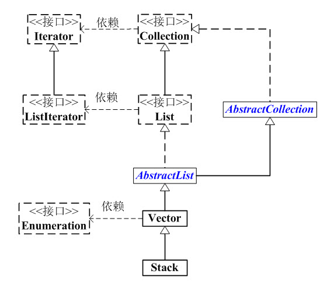
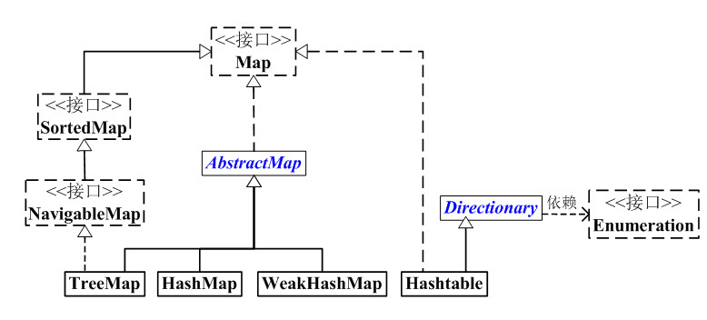
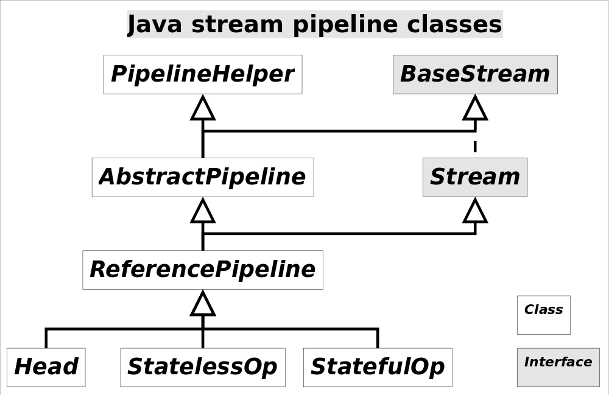

# JDK源码笔记


java集合的框架分布为4部分：

1. List列表
2. Set集合
3. Map映射
4. 工具类

各部分的框架图如图所示

- Collection

 Collection是一个接口，是高度抽象出来的集合，它包含了集合的基本操作和属性。AbstractCollection抽象类，它实现了Collection中的绝大部分函数; Collection包含了List和Set两大分支。 AbstractList和AbstractSet都继承于AbstractCollection; 具体的List实现类继承于AbstractList，而Set的实现类则继承于AbstractSet。

 (1) List是一个有序的队列，每一个元素都有它的索引。第一个元素的索引值是0. List的实现类有: LinkedList, ArrayList, Vector, Stack 

(2) Set是一个不允许有重复元素的集合. Set的实现类有: HashSet和TreeSet. HashSet依赖于HashMap，它实际上是通过HashMap实现的；TreeSet依赖于TreeMap，它实际上是通过TreeMap实现的。

- Map

 Map是一个映射接口，即key-value键值对。 AbstractMap是个抽象类，它实现了Map接口中的大部分API。HashMap，TreeMap，WeakHashMap都是继承于AbstractMap。 Hashtable虽然继承于Dictionary，但它实现了Map接口。

- iterator

 Iterator是遍历集合的工具，即我们通常通过Iterator迭代器来遍历集合。我们说Collection依赖于Iterator，是因为Collection的实现类都要实现iterator()函数，返回一个Iterator对象. ListIterator是专门为遍历List而存在的。

- Enumeration

 再看Enumeration，它是JDK 1.0引入的抽象类。作用和Iterator一样，也是遍历集合；但是Enumeration的功能要比Iterator少。在上面的框图中，Enumeration只能在Hashtable, Vector, Stack中使用。

-  Arrays和Collections

 它们是操作数组、集合的两个工具类。

## 重写equals方法的注意事项

1. 自反性：对于任何非空引用x，x.equals(x)应该返回true。
2. 对称性：对于任何引用x和y，如果x.equals(y)返回true，那么y.equals(x)也应该返回true。
3. 传递性：对于任何引用x、y和z，如果x.equals(y)返回true，y.equals(z)返回true，那么x.equals(z)也应该返回true。
4. 一致性：如果x和y引用的对象没有发生变化，那么反复调用x.equals(y)应该返回同样的结果。
5. 非空性：对于任意非空引用x，x.equals(null)应该返回false。 

## iterable

iterable接口的描述，其中常用的方法就是iterator()，返回一个迭代器

```java
public interface Iterable<T> { 
    Iterator iterator(); 
    default void forEach(Consumer action) { 
        Objects.requireNonNull(action); 
        for (T t : this) { 
            action.accept(t); 
        } 
    } 
    default Spliterator spliterator() { 
        return Spliterators.spliteratorUnknownSize(iterator(), 0); 
    } 
}
```

### iterator

iterator是一个接口，提供一些方法的默认实现，其中的API接口包括

1.  是否存在下一个元素: boolean hasNext() 
2. 获取下一个元素: E next() 
3. 删除当前元素: void remove()

```java
public interface Iterator {
    boolean hasNext(); 
    E next(); 
    default void remove() { throw new UnsupportedOperationException("remove"); } 
    default void forEachRemaining(Consumer action) { 
        Objects.requireNonNull(action); 
        while (hasNext()) 
            action.accept(next()); 
    } 
}
```

iterator遍历集合的时候采用的是fastfail机制，具体机制在各种集合里都有被实现，就是当一个线程通过iterator进行集合的遍历的时候，如果有其他的线程改变了集合，就会立刻抛出 ConcurrentModificationException异常，具体实现是在集合种保留了一个版本号，这个版本号在调用iterator的时候会被复制到iterator中，每次iterator在输出下一元素时，都会比较集合当前版本和之前拷贝的版本号，如果不一致就抛出异常

### listiterator

 ListIterator 是一个继承于Iterator的接口，它是队列迭代器, 专门用于遍历List，能提供向前向后遍历。 

相比于Iterator它新增了:

-  添加 
- 是否存在上一个元素 
- 获取上一个元素等;

```java
public interface ListIterator extends Iterator {/* Iterator接口中的方法 */ 
    boolean hasNext(); 
    E next(); 
    void remove(); /* ListIterator中定义的方法 */ 
    boolean hasPrevious(); 
    E previous(); 
    int nextIndex(); 
    int previousIndex(); 
    void set(E e); //更新上一次遍历过的元素为e
    void add(E e); //添加元素到下一个要被遍历的位置
}
```

collection和Map的继承关系图


## Collection

 Collection 是一个接口，是高度抽象出来的集合，它包含了集合的基本操作：添加、删除、清空、遍历(读取)、是否为空、获取大小、是否保护某元素等等；

Collection 接口的所有子类(直接子类和间接子类)都必须实现2种构造函数：不带参数的构造函数 和 参数为Collection的构造函数。带参数的构造函数，可以用来转换Collection的类型;

```java
public interface Collection extends Iterable {
    int size(); 
    boolean isEmpty(); 
    boolean contains(Object o); 
    Iterator iterator(); 
    Object[] toArray(); 
    // String[] y = x.toArray(new String[0]); 
    <T> T[] toArray(T[] a); 
    boolean add(E e); 
    boolean remove(Object o); 
    boolean containsAll(Collection c); 
    boolean addAll(Collection c); 
    boolean removeAll(Collection c); 
    boolean retainAll(Collection c); 
    void clear(); 
    boolean equals(Object o); 
    int hashCode(); // JDK 11新添加
    default T[] toArray(IntFunction generator) { 
        return toArray(generator.apply(0)); 
    } 
    // JDK 8添加 
    default boolean removeIf(Predicate<? super E> filter) { 
        Objects.requireNonNull(filter); 
        boolean removed = false; 
        final Iterator each = iterator(); 
        while (each.hasNext()) { 
            if (filter.test(each.next())) {
                each.remove(); 
                removed = true; 
            } 
        } 
        return removed; 
    } 
    // JDK 8新添加 
    @Override default Spliterator spliterator() { 
        return Spliterators.spliterator(this, 0); 
    } 
    // JDK 8新添加 
    default Stream stream() { 
        return StreamSupport.stream(spliterator(), false); 
    } 
    // JDK 8新添加 
    default Stream parallelStream() {
    	return StreamSupport.stream(spliterator(), true); 
    } 
}
```

### List

 List是一个继承于Collection的接口，即List是集合中的一种。List是有序的队列，List中的每一个元素都有一个索引；第一个元素的索引值是0，往后的元素的索引值依次+1。和Set不同，List中允许有重复的元素。 

关于API方面。既然List是继承于Collection接口，它自然就包含了Collection中的全部函数接口；由于List是有序队列，它也额外的有自己的API接口。主要有“添加、删除、获取、修改指定位置的元素”、“获取List中的子队列”等

```java
public interface List extends Collection { 
    /* Collection的API */ 
    boolean add(E object); 
    boolean addAll(Collection<? extends E> collection) 
    void clear(); 
    boolean contains(Object object); 
    boolean containsAll(Collection<?> collection);
    boolean equals(Object object) ;
    int hashCode();
    boolean isEmpty();
    Iterator<E> iterator();
    boolean remove(Object object);
    boolean removeAll(Collection<?> collection);
    boolean retainAll(Collection<?> collection);
    int size();
    T[] toArray(T[] array);
    Object[] toArray();
    // JDK 8新加入 
    @Override
    default Spliterator<E> spliterator() {
        if (this instanceof RandomAccess) {
            return new AbstractList.RandomAccessSpliterator<>(this); 
        } else {
            return Spliterators.spliterator(this, Spliterator.ORDERED); 
        } 
    } 
    /* 相比与Collection，List新增的API */ 
    void add(int location, E object);
    boolean addAll(int location, Collection<? extends E> collection);
    E get(int location);
    int indexOf(Object object);
    int lastIndexOf(Object object);
    ListIterator<E> listIterator(int location);
    ListIterator<E> listIterator();
    E remove(int location);
    E set(int location, E object);
    List<E> subList(int start, int end);
    // JDK 8新加入 
    default void replaceAll(UnaryOperator<E> operator) {
        Objects.requireNonNull(operator); 
        final ListIterator<E> li = this.listIterator();
        while (li.hasNext()) { 
            li.set(operator.apply(li.next())); 
        } 
    } 
    // JDK 8新加入 
    @SuppressWarnings({"unchecked", "rawtypes"}) 
    default void sort(Comparator<? super E> c) {
        Object[] a = this.toArray();
        Arrays.sort(a, (Comparator) c);
        ListIterator i = this.listIterator();
        for (Object e : a) { 
            i.next();
            i.set((E) e); 
        } 
    } 
    // JDK 9新加入 
    static <E> List<E> of() {
        return ImmutableCollections.emptyList(); 
    } 
    // JDK 9新加入 
    static<E> List<E> of(E e1) {
        return new ImmutableCollections.List12<>(e1); 
    } 
    // JDK 9新加入
    static<E> List<E> of(E e1, E e2) { 
        return new ImmutableCollections.List12<>(e1, e2); 
    } 
    ...
     // JDK 9新加入 
     static <E> List<E> of(E e1, E e2, E e3, E e4, E e5, E e6, E e7, E e8, E e9, E e10) {
        return new ImmutableCollections.ListN<>(e1, e2, e3, e4, e5, e6, e7, e8, e9, e10); } 
    // JDK 9新加入 
    @SafeVarargs @SuppressWarnings("varargs") 
    static<E> List<E> of(E... elements) { 
        switch (elements.length) {// implicit null check of elements 
            case 0: return ImmutableCollections.emptyList(); 
            case 1: return new ImmutableCollections.List12<>(elements[0]); 
            case 2: return new ImmutableCollections.List12<>(elements[0], elements[1]); 
            default: return new ImmutableCollections.ListN<>(elements); 
        } 
    } 
    // JDK 10加入 
    static <E> List<E> copyOf(Collection coll) { 
        return ImmutableCollections.listCopy(coll); 
    } 
}
```

上面的代码中有一系列的list of方法，这些方法的作用是返回一个不可变列表，该列表中所有修改列表的操作都会抛出一个unsupportedOperationException异常，但是如果包含的对象，本身是可变的，那么就会导致列表对象发生变化

该方法内部调用了一个类immutableCollections，该类内部实现了多种静态内部抽象类作为不可读集合的抽象实现，并提供一些具体实现，这些抽象类的修改集合的操作通过抛出immutableCollections内定义的异常来实现集合的不可变。

具体的抽象集合包括：AbstractImmutableList，AbstractImmutableSet，AbstractImmutableCollections等，这些抽象集合会实现一些基本的hashcode，iterator等操作，其他的在继承他的具体类中会有实现，这些抽象类本身也是继承自抽象集合的

AbstractImmutableSet：低层是一个数组，采用类似哈希表的方式来获取元素在数组中的位置

### AbstractCollection

AbstractCollection是一个抽象类，它实现了Collection中除iterator()和size()之外的方法, 从而方便其它类实现Collection. 比如ArrayList、LinkedList等，它们这些类想要实现Collection接口，而通过继承AbstractCollection就已经实现了大部分的接口了。

AbstractCollection中已经重写了toString()方法;

AbstractCollection中存在两个private方法: 

- finishToArray: 在toArray()方法中使用, 当迭代器返回的元素比预期的多时，重新分配toArray中使用的数组，并从迭代器中完成数组填充。扩容方式——`int newCap = cap + (cap >> 1) + 1;`该过程通过调用iterator逐个把元素加入传递到方法的数组中，如果需要扩容，就会调用Array.copy
- hugeCapacity: 在finishToArray方法中使用, 当finished方法需要开辟更大数组空间时, 判断空间大小并返回新的大小

###  AbstractList

 AbstractList 是一个**继承于AbstractCollection，并且实现List接口的抽象类。**

 它实现了List中除size()、get(int location)之外的函数, 从而方便其它类继承List。 另外，和AbstractCollection相比，AbstractList抽象类中，实现了iterator()接口。

1. boolean add(E e):将方法追加到线性表的最后，返回true表示添加成功
2. boolean add(index e):在index处添加元素，需要在实际类中重写——TODO
3. boolean addAll(index,collection):把集合中的元素全部加到表中，从index开始添加
4. E remove(index):删除index处的元素，返回元素
5. void removeRange(from,to):删除区间内的元素
6. clear():清空集合
7. e set(index，e):更新index处的元素为e，返回旧元素
8. indexof，lastindexof：返回元素索引位置（正反）
9. equals方法：判定quals的几条准则
10. hashcode：hashCode = 31 * hashCode + (e == null ? 0 : e.hashCode());
11. 该抽象实现中就具有modCount，这个modCount就是作为集合的一个版本控制，并由此来实现fast-fail

这个类的实现关系比较复杂，包含的实现关系包括——

-  AbstractList本身: 

1. AbstractList自身继承自AbstractCollection(显而易见, 为了方便才创立的AbstractCollection, 要注意AbstractCollection未实现iterator()和size()方法); 
2. 同时AbstractList实现了List的部分接口(除了get()方法, 因为数组实现和链表实现的get显然是不同的!) 
3. AbstractList重写了equals()和hashcode()方法!
4.  AbstractList定义了四个方法: 
   1. void subListRangeCheck(int fromIndex, int toIndex, int size): 包内可见的方法, 用于subList()方法, 截取自列表前判断index, size的合法性; 
   2. removeRange: 删除指定区间的元素; 
   3. rangeCheckForAdd: 用于addAll方法, 判断index的合法性; 
   4. outOfBoundsMsg: 代码: return “Index: “+index+”, Size: “+size(); 用于rangeCheckForAdd抛出的IndexOutOfBoundsException时的错误信息;

-  AbstractList中定义的内部类:
  -  Itr: AbstractList中的一个Iterator实现类, 为ListItr服务的父类; 
  - ListItr: AbstractList中Iterator真正的元素, 继承了Itr, 并实现了ListIterator接口(ListIterator是一个继承了Iterator的接口, 为List遍历而创建); 
  - RandomAccessSpliterator: 实现了Spliterator接口. JDK 8之后, 为了并行遍历元素而设计的一个可分割迭代器(splitable iterator); 
  - SubList: AbstractList的内部类SubList, 继承了AbstractList本身, 作为List的一个视图, 为RandomAccessSubList服务;这个内部类的牛逼之处在于, 他继承了包含他的类! 
  - RandomAccessSubList: 继承自SubList, 并实现了RandomAccess接口;

-  AbstractList中的内部类关系整理: 
  - RandomAccessSpliterator与其他内部类没有关系, 它仅仅是实现了Spliterator接口, 在JDK 8之后, 为了并行遍历元素而设计的; 
  - Itr与ListItr是一组: 两者为父子完成了对ListIterator接口的实现; 是普遍使用的List内部的迭代器实现; 
  - SubList与RandomAccessSubList是一组: 最牛逼的父子组合, 连续继承了包含他们的AbstractList, 并配合实现了RandomAccess和AbstractList; 主要应用于创建List的子视图;

### AbstractSet

 AbstractSet 是一个继承于AbstractCollection，并且实现Set接口的抽象类。由于Set接口和Collection接口中的API完全一样，Set也就没有自己单独的API。

 和AbstractCollection一样，它实现了List中除iterator()和size()之外的方法, 从而方便其它类实现Set接口。

```java
public abstract class AbstractSet<E> extends AbstractCollection<E> implements Set<E> {
        protected AbstractSet() {
    }
        public boolean removeAll(Collection<?> c) {
        Objects.requireNonNull(c);
        
        boolean modified = false;
        
        if(size()>c.size()) {
            for(Object e : c) {
                modified |= remove(e);
            }
        } else {
            for(Iterator<?> i = iterator(); i.hasNext(); ) {
                if(c.contains(i.next())) {
                    i.remove();
                    modified = true;
                }
            }
        }
        
        return modified;
    }
        public boolean equals(Object o) {
        if(o == this) {//判断为本身
            return true;
        }
        
        if(!(o instanceof Set)) {//确保变量是一个set类型
            return false;
        }
        
        Collection<?> c = (Collection<?>) o;//强转
        if(c.size() != size()) {//长度判断
            return false;
        }
        
        try {
            return containsAll(c);
        } catch(ClassCastException | NullPointerException unused) {
            return false;
        }
    }
        public int hashCode() {
        int h = 0;
        
        for(E obj : this) {
            if(obj != null) {
                h += obj.hashCode();
            }
        }
        
        return h;
    }
    
}
```

## ArrayList

 ArrayList 是一个数组队列，相当于 动态数组。与Java中的数组相比，它的容量能动态增长。**它继承于AbstractList，实现了List, RandomAccess, Cloneable, java.io.Serializable这些接口, 并提供了相关的添加、删除、修改、遍历等功能**，该数组队列不是线程安全的队列

```java
public class ArrayList<E> extends AbstractList<E> implements List<E>, RandomAccess, Cloneable, Serializable {
    private static final int DEFAULT_CAPACITY = 10;//默认初始容量为10
}
```

1.  **ArrayList实现了RandomAccess接口**: 提供了随机访问功能; RandmoAccess是java中用来被List实现，为List提供快速访问功能的。在ArrayList中，我们即可以通过元素的序号快速获取元素对象, 这就是快速随机访问。 稍后，我们会比较List的“快速随机访问”和“通过Iterator迭代器访问”的效率。
2.  **ArrayList 实现了Cloneable接口:** 即覆盖了函数clone()，能被克隆;
3.  **ArrayList 实现java.io.Serializable接口**: 这意味着ArrayList支持序列化，能通过序列化去传输; 
4. **和Vector不同，ArrayList中的操作不是线程安全的**！所以，建议在单线程中才使用ArrayList(效率更高), 而在多线程中可以选择Vector或者CopyOnWriteArrayList。

### ArrayList构造函数

```java
    public ArrayList() {
        this.elementData = DEFAULTCAPACITY_EMPTY_ELEMENTDATA;
    }
    public ArrayList(int initialCapacity) {}
    public ArrayList(Collection<? extends E> c) {}//通过调用collection的toarray方法来构造列表
```

### ArrayList的API

```java
    public boolean add(E e) {}//将元素e追加到当前顺序表中
    public void add(int index, E element) {}//将元素e追加到index处
    public boolean addAll(Collection<? extends E> c) {}// 将指定容器中的元素追加到当前顺序表中
    public boolean addAll(int index, Collection<? extends E> c) {}// 将指定容器中的元素添加到当前顺序表的index处
    public E get(int index) {}// 获取指定索引处的元素
    public E remove(int index) {}// 移除索引index处的元素，返回被移除的元素
    public boolean remove(Object o) {}// 移除指定的元素，返回值指示是否移除成功
    public boolean removeIf(Predicate<? super E> filter) {}// 移除满足条件的元素，移除条件由filter决定，返回值指示是否移除成功
    public boolean removeAll(Collection<?> c) {}    // (匹配则移除)移除当前顺序表中所有与给定容器中的元素匹配的元素
    public boolean retainAll(Collection<?> c) {}// (不匹配则移除)移除当前顺序表中所有与给定容器中的元素不匹配的元素
    protected void removeRange(int fromIndex, int toIndex) {}
    public void clear() {}
    public E set(int index, E element) {}
    public void replaceAll(UnaryOperator<E> operator) {}
    public boolean contains(Object o) {}
    public int indexOf(Object o) {}
    public int lastIndexOf(Object o) {}
    public List<E> subList(int fromIndex, int toIndex) {}
    public Object[] toArray() {}
    public <T> T[] toArray(T[] a) {}
    public void forEach(Consumer<? super E> action) {}
    public Iterator<E> iterator() {}
    public ListIterator<E> listIterator() {}
    public ListIterator<E> listIterator(int index) {}
    public Spliterator<E> spliterator() {}
    public int size() {}
    public boolean isEmpty() {}
    public void sort(Comparator<? super E> c) {}
    public void trimToSize() {}
    public void ensureCapacity(int minCapacity) {}
/*序列化以及反序列化实现*/
    private void writeObject(ObjectOutputStream s) throws IOException {}
    private void readObject(ObjectInputStream s) throws IOException, ClassNotFoundException {}
```

上面的api涉及修改数组的，都会修改modcount，执行modcount++

#### 扩容数组

ArrayList每次扩容大概0.5倍，扩容的策略是，当数组容量用尽时进行扩容

```java
    private Object[] grow(int minCapacity) {}//申请扩大数组，minCapacity的大小为原size+要被扩充的数组的大小
    private int newCapacity(int minCapacity) {}//预期的新增容量为元容量的1.5倍
	private int newCapacity(int minCapacity) {
        // overflow-conscious code
        int oldCapacity = elementData.length;   // 旧容量
        int newCapacity = oldCapacity + (oldCapacity >> 1); // 预期新容量（增加0.5倍）
        
        // 如果预期新容量小于申请的容量
        if(newCapacity - minCapacity<=0) {
            // 如果数组还未初始化
            if(elementData == DEFAULTCAPACITY_EMPTY_ELEMENTDATA) {
                // 返回一个初始容量
                return Math.max(DEFAULT_CAPACITY, minCapacity);
            }
            
            // 溢出
            if(minCapacity<0) {
                // overflow
                throw new OutOfMemoryError();
            }
            
            return minCapacity;
        }
        
        // 在预期新容量大于申请的容量时，按新容量走
        return (newCapacity - MAX_ARRAY_SIZE<=0) ? newCapacity : hugeCapacity(minCapacity);
    }
```

扩容方式和数组的动态开销有关，按固定大小进行扩容，摊销为O(n)，按倍数进行扩张，摊销为O(1)

### ArrayList的数据结构

```java
java.lang.Object 
    ↳ java.util.AbstractCollection 
    	↳ java.util.AbstractList 
    		↳ java.util.ArrayList 
    public class ArrayList extends AbstractList implements List, RandomAccess, Cloneable, java.io.Serializable {}

```

继承结构关系图


 ArrayList包含了两个重要的对象：elementData 和 size, 如下:

```java
transient Object[] elementData; // non-private to simplify nested class access 
private int size; // The size of the ArrayList (the number of elements it contains).

```

elementdata是一个Object[]类型的动态数组，保存添加到ArrayList中的元素，size是动态数组的实际大小

### arrayList的遍历方式

1. 通过迭代器遍历。即使用iterator遍历数组
2. 通过随机访问，即采用索引来遍历——Randomaccess
3. 通过foreach来遍历
4. spliterator并发遍历——将集合遍历为多段进行遍历，通过fast-fail保证遍历中不能修改数组

#### 遍历SubList

 ArrayList中存在一个subList()方法, 用于返回ArrayList的一个子视图, 

1. subList的返回类型也是一个List类型，所以拥有list接口中的方法
2. 对subList的操作最终也会影响到原数组

#### Fast-fail机制

 当某一个线程A通过iterator去遍历某集合的过程中，若该集合的内容被其他线程所改变了；那么线程A访问集合时，就会抛出ConcurrentModificationException异常，产生fail-fast事件，ArrayList在调用iterator()方法时，会复制modCount到iterator对象中，并在迭代器迭代的过程中检验modCount与复制到的对象是否相同，不同就抛出 **ConcurrentModificationException**，这个机制是一种错误检测机制，如果在对线程下使用，建议使用concurrent下的包。

## LinkedList

双向链表——线性表的链式存储结构，内部使用指针来连接各个节点

LinkedList与Collection关系

 

```java
java.lang.Object 
    ↳ java.util.AbstractCollection 
    	↳ java.util.AbstractList 
    		↳ java.util.AbstractSequentialList 
    			↳ java.util.LinkedList<E>

public class LinkedList<E> extends AbstractSequentialList<E> implements List<E>, Deque<E>, Cloneable, Serializable {}
```

LinkedList 是一个继承于AbstractSequentialList的双向链表。因此它也可以被当作堆栈、队列或双端队列进行操作 

LinkedList 实现 List 接口，能对它进行队列操作 

LinkedList 实现 Deque 接口，能将LinkedList当作双端队列使用 

LinkedList 实现了Cloneable接口，即覆盖了函数clone()，能克隆 

LinkedList 实现java.io.Serializable接口，这意味着LinkedList支持序列化，能通过序列化去传输 

LinkedList 是线程不安全的(非同步的)

 LinkedList的本质是双向链表: 

① LinkedList继承于AbstractSequentialList，并且实现了Deque接口 

② LinkedList包含两个重要的成员：header 和 size header是双向链表的表头，它是双向链表节点所对应的类Node的实例。Node中包含成员变量： previous, next, element。其中，previous是该节点的上一个节点，next是该节点的下一个节点，element是该节点所包含的值 size是双向链表中节点的个数

### API

```java
LinkedList的API 
// 来自于Deque接口 
    E getFirst() 
    E getLast() 
    E removeFirst() 
    E removeLast() 
    void addFirst(E object) 
    void addLast(E object) 
    E peek() 
    E element() 
    E poll() 
    E remove() 
    boolean offer(E o) 
    boolean offerFirst(E e) 
    boolean offerLast(E e) 
    E peekFirst() 
    E peekLast() 
    E pollFirst() 
    E pollLast() 
    E pop() 
    void push(E e) 
    boolean removeFirstOccurrence(Object o) 
    boolean removeLastOccurrence(Object o) 
    Iterator descendingIterator() 
    // 来自于List接口 
    boolean contains(Object object) 
    int size() 
    boolean add(E object) 
    boolean remove(Object o) 
    void add(int location, E object) 
    boolean addAll(Collection collection) 
    boolean addAll(int location, Collection collection) 
    void clear() 
    E get(int location) 
    E set(int index, E element) 
    void add(int index, E element) 
    E remove(int index) 
    int indexOf(Object object) 
    int lastIndexOf(Object object) 
    ListIterator listIterator(int location) 
    T[] toArray(T[] contents) 
    Object[] toArray() 
    // 重写Object的clone()方法[Cloneable接口] 
    Object clone() 
    // 来自于Collection接口(JDK 8新加入) 
    Spliterator spliterator()
```

### AbStractSequentialList

 AbstractSequentialList 实现了get(int index)、set(int index, E element)、add(int index, E element) 和 remove(int index)这些方法(这些接口都是随机访问List的) 

LinkedList是双向链表；既然它继承于AbstractSequentialList，就相当于已经实现了get(int index)这些接口

### LinkedList与List

 LinkedList实际上是通过双向链表去实现的。既然是双向链表，那么它的顺序访问会非常高效，而随机访问效率比较低 既然LinkedList是通过双向链表的，但是它也实现了List接口(也就是说，它实现了get(int location)、remove(int location)等根据索引值来获取、删除节点的方法)，为了实现这些接口，采用的是计数索引的办法，在调用get(loction)的时候，会判断location对于size的关系，如果小于size/2，那么会从头开始遍历，如果大于就从末端进行遍历。

jdk8中，节点被定义为Node，其中有当前节点值，上一个节点和下一个节点的引用

当链表为空时，first和last都为null，通过linkLast，linkFirst来实现具体的插入逻辑，unlinkFirst，unlinkLast实现移除元素的逻辑，是一些最终接口方法的底层实现。linkedList的值允许为null。LinkedList中API的异常抛出情况

理论上没有容量限制，但是计算LinkedList的size用的是int类型，所以不能超过Integer的最大值

|      | 抛出异常(first) | null值(first) | 抛出异常(last) | null值(last) |
| ---- | --------------- | ------------- | -------------- | ------------ |
| 插入 | addfirst        | offerfirst    | addlast        | offerlast    |
| 移除 | removefirst     | pollfirst     | removefirst    | polllast     |
| 检查 | getfirst        | peeklast      | getlast        | peeklast     |

 LinkedList可以作为FIFO(先进先出)的队列，作为FIFO的队列时，下表的方法等价：

```
队列方法 等效方法 
add(e) addLast(e) 
offer(e) offerLast(e) 
remove() removeFirst() 
poll() pollFirst() 
element() getFirst() 
peek() peekFirst()
```

 LinkedList可以作为LIFO(后进先出)的栈，作为LIFO的栈时，下表的方法等价：

```
栈方法 等效方法 
push(e) addFirst(e) 
pop() removeFirst() 
peek() peekFirst()
```

后面还有一些用于遍历操作的方法和内部类，包括逆序遍历，正序遍历，并发遍历等方法

## Vector

```java
public class Vector<E> extends AbstractList<E> implements List<E>, RandomAccess, Cloneable, Serializable {}
```

Vector 是矢量队列，它是JDK1.0版本就添加的类(而实际上在JDK 1.2之后就被淘汰了) 

Vector 继承于AbstractList，实现了List接口. 所以，它是一个队列，支持相关的添加、删除、修改、遍历等功能 

Vector 实现了RandmoAccess接口，可以通过元素的序号快速获取元素对象, 即提供了随机访问功能(RandmoAccess是java中用来被List实现，为List提供快速访问功能的) 

Vector 实现了Cloneable接口，即实现clone()函数。它能被克隆 

**和ArrayList不同，Vector中的操作是线程安全的**，线性表的顺序存储结构，内部使用数组实现，可以看做是ArrayList的线程安全版本，其所有修改数组的方法都被加了锁

与Collection的继承关系


 Vector的数据结构和ArrayList差不多，它包含了3个成员变量：elementData , elementCount， capacityIncrement

 ① elementData 是”Object[]类型的数组”，它保存了添加到Vector中的元素。elementData是个动态数组，如果初始化Vector时，没指定动态数组的大小，则使用默认大小10 

② elementCount 是动态数组的实际大小(实际存储元素个数) 

③ capacityIncrement 是动态数组的增长系数。如果在创建Vector时，指定了capacityIncrement的大小；则每次当Vector中动态数组容量增加时，增加的大小都是capacityIncrement(默认为增大一倍)

1.   Vector实际上是通过一个数组去保存数据的。当我们构造Vecotr时；若使用默认构造函数，则Vector的默认容量大小是10 
2.  当Vector容量不足以容纳全部元素时，Vector的容量会增加。**若容量增加系数 >0，则将容量的值增加“容量增加系数”；否则，将容量大小增加一倍** 
3.  Vector的克隆函数，即是将全部元素克隆到一个数组中 其实Vector基本上就是将全部方法都synchronized的ArrayList, 所以效率相当的低

### Vector与ArrayList的区别

**1、Vector是线程安全的，ArrayList不是线程安全的。
2、ArrayList在底层数组不够用时在原来的基础上扩展0.5倍，Vector是扩展1倍。** 

## Stack

```java
public class Stack<E> extends Vector<E> {}
```

 Stack是栈, 它的特性是：先进后出(FILO, First In Last Out) 

1. Stack是继承于Vector(矢量队列)的, 由于Vector是通过数组实现的，这就意味着，Stack也是通过数组实现的, 而非链表 
2. 并且Stack也是使用synchronized实现同步的 显然, 我们也可以将LinkedList当作栈来使用

继承关系

```java
java.lang.Object 
    ↳ java.util.AbstractCollection 
    	↳ java.util.AbstractList 
    		↳ java.util.Vector 
    			↳ java.util.Stack 
    public class Stack<E> extends Vector<E> {}
```



### 常用的API

```java
			boolean empty() 
synchronized E peek() 
synchronized E pop() 
             E push(E object) 
synchronized int search(Object o)
```

```
① Stack实际上是通过数组去实现的 
	执行push时(即，将元素推入栈中)，是通过将元素追加的数组的末尾中 
	执行peek时(即，取出栈顶元素，不执行删除)，是返回数组末尾的元素 
	执行pop时(即，取出栈顶元素，并将该元素从栈中删除)，是取出数组末尾的元素，然后将该元素从数组中删除 
② Stack继承于Vector，意味着Vector拥有的属性和功能，Stack都拥有 
③ Stack继承于Vector，也意味着Stack也是通过synchronized这种低效的方式实现多线程同步的 
```

## Map



① Map 是映射接口，Map中存储的内容是键值对(key-value) 

② AbstractMap 是实现了Map接口的抽象类，它实现了Map中的大部分API。其它Map的实现类可以通过继承AbstractMap来减少重复编码 

③ SortedMap 是继承于Map的接口。SortedMap中的内容是排序的键值对，排序的方法是通过比较器(Comparator) 

④ NavigableMap 是继承于SortedMap的接口。相比于SortedMap，NavigableMap有一系列的导航方法, 如: 获取大于/等于某对象的键值对、获取小于/等于某对象的键值对等 

⑤ TreeMap 继承于AbstractMap，且实现了NavigableMap接口；因此，TreeMap中的内容是“有序的键值对” 

⑥ HashMap 继承于AbstractMap，但没实现NavigableMap接口；因此，HashMap的内容是“键值对，但不保证次序” 

⑦ Hashtable 虽然不是继承于AbstractMap，但它继承于Dictionary(Dictionary也是键值对的接口)，而且也实现Map接口；因此，Hashtable的内容也是“键值对，也不保证次序”。但和HashMap相比，Hashtable是线程安全的，而且它支持通过Enumeration去遍历 

⑧ WeakHashMap 继承于AbstractMap。它和HashMap的键类型不同，WeakHashMap的键是“弱键”

### Map接口

 Map 是一个键值对(key-value)映射接口: Map映射中不能包含重复的键；每个键最多只能映射到一个值

Map 接口提供三种collection 视图，允许以键集、值集或键-值映射关系集的形式查看某个映射的内容 

Map 映射顺序: 有些实现类，可以明确保证其顺序，如 TreeMap；另一些映射实现则不保证顺序，如 HashMap 类 

Map 的实现类应该提供2个“标准的”构造方法：第一个，void（无参数）构造方法，用于创建空映射；第二个，带有单个 Map 类型参数的构造方法，用于创建一个与其参数具有相同键-值映射关系的新映射

说明：

1.  Map接口提供了分别用于返回 键集、值集或键-值映射关系集:
   1. entrySet()用于返回键-值集的Set集合 
   2. keySet()用于返回键集的Set集合 
   3. values()用户返回值集的Collection集合 
   4. 因为Map中不能包含重复的键；每个键最多只能映射到一个值。所以，键-值集、键集都是Set，值集是Collection
2.  Map接口提供了键-值对、根据键获取值、删除键、获取容量大小等方法
3.  在Map中实际是通过Map.Entry内部接口来定义数据类型
4.  JDK 8在Map接口中添加了getOrDefault(), forEach(), putIfAbsent(), compute(), merge()等与Stream和Lambda表达式搭配使用的方法
5.  JDK 9与JDK 10分别加入了创建不可变(ImmutableCollections)Map的方法以及生成当前Map快照的方法copyOf()
6. 

### Map.entry

```java
    interface Entry<K, V> {}
```

Map.entry是map中的一个接口，Map.Entry是键值对，通过entryset来获得键值对集合

一些API

```java
abstract boolean equals(Object object) 
abstract int hashCode() 
abstract K getKey() 
abstract V getValue() 
abstract V setValue(V object)
```

jdk8之后还再entry中添加了一些静态方法，用于返回一些比较器，这些方法可与java的流操作一起使用

## AbstractMap

该抽象类继承自Map，并实现了一些通用的接口

```java
public abstract class AbstractMap<K,V> implements Map<K,V> {}
```

-  要实现不可修改的映射，只需扩展此类并提供 entrySet 方法的实现即可，该方法将返回映射的映射关系 set 视图: 通常，返回的 set 将依次在 AbstractSet 上实现。此 set 不支持 add() 或 remove() 方法，其迭代器也不支持 remove() 方法 
- 要实现可修改的映射，编程人员必须另外重写此类的 put 方法（否则将抛出 UnsupportedOperationException），entrySet().iterator() 返回的迭代器也必须另外实现其 remove 方法

1.  在AbstractMap中定义了两个属性keySet和values:
   -  keySet()用于返回键集的Set集合 values()用户返回值集的Collection集合
2.  AbstractMap实现了Map接口中除entrySet()方法之外的所有方法, 但是实现的方法有些并不可直接使用:如，put方法会抛出异常
3.  AbstractMap抽象类中定义了两个内部类SimpleEntry, SimpleImmutableEntry分别都实现了Entry和 Serializable接口(JDK 1.6), 两者的用途如下:
   -  SimpleEntry: 维护键和值的条目。可以使用{@code setValue}方法更改该值。这个类简化了构建自定义映射实现的过程
   -  SimpleImmutableEntry: 一个维护不可变键和值的Entry。此类{@code setValue}不支持方法(调用setValue()方法将直接抛出UnsupportedOperationException异常). 在返回键为值映射的线程安全快照的方法中，此类可以很方便

## SortedMap

 SortedMap是一个继承于Map接口的接口, 它是一个有序的SortedMap键值映射 

```java
public interface SortedMap<K, V> extends Map<K, V> {}
```

SortedMap的排序方式有两种：自然排序 或者 用户指定比较器。 插入有序 SortedMap 的所有元素都必须实现 Comparable 接口（或者被指定的比较器所接受）

另外，所有SortedMap 实现类都应该提供 4 个“标准”构造方法：

1.  void（无参数）构造方法，它创建一个空的有序映射，按照键的自然顺序进行排序
2.  带有一个 Comparator 类型参数的构造方法，它创建一个空的有序映射，根据指定的比较器进行排序
3.  带有一个 Map 类型参数的构造方法，它创建一个新的有序映射，其键-值映射关系与参数相同，按照键的自然顺序进行排序
4.  带有一个 SortedMap 类型参数的构造方法，它创建一个新的有序映射，其键-值映射关系和排序方法与输入的有序映射相同。**无法保证强制实施此建议，因为接口不能包含构造方法。**

## NavigableMap

```java
public interface NavigableMap<K, V> extends SortedMap<K, V> {}
```

 NavigableMap是继承于SortedMap的接口。它是一个可导航的键-值对集合，具有了为给定搜索目标报告最接近匹配项的导航方法 NavigableMap分别提供了获取键、键-值对、键集、键-值对集的相关方法

NavigableMap除了继承SortedMap的特性外，它的提供的功能可以分为4类:

1.  提供操作键-值对的方法:
   - lowerEntry、floorEntry、ceilingEntry 和 higherEntry 方法，它们分别返回与小于、小于等于、大于等于、大于给定键的键关联的 Map.Entry 对象 firstEntry、pollFirstEntry、lastEntry 和 pollLastEntry 方法，它们返回和/或移除最小和最大的映射关系（如果存在），否则返回 null
2.  提供操作键的方法:
   -  这个和第1类比较类似lowerKey、floorKey、ceilingKey 和 higherKey 方法，它们分别返回与小于、小于等于、大于等于、大于给定键的键
3.  获取键集:
   -  navigableKeySet、descendingKeySet分别获取正序/反序的键集 ④ 获取键-值对的子集
4.  获取键-值对的子集

## Dictionary

 Dictionary是JDK 1.0定义的键值对的抽象类，它也包括了操作键值对的基本方法

```java
public abstract class Dictionary {}
```

常用API

```java
abstract Enumeration elements() 
abstract V get(Object key) 
abstract boolean isEmpty() 
abstract Enumeration keys() 
abstract V put(K key, V value) 
abstract V remove(Object key) 
abstract int size()
```

## HashMap

 HashMap 是一个散列表，它存储的内容是键值对(key-value)映射 

HashMap 继承于AbstractMap，实现了Map、Cloneable、Serializable接口 

HashMap 的实现不是同步的，这意味着它**不是线程安全的。它的key、value都可以为null**。此外，HashMap中的映射不是有序的 

```java
public class HashMap<K,V> extends AbstractMap<K,V> implements Map<K,V>, Cloneable, Serializable {}
```


继承关系

```
java.lang.Object 
	↳ java.util.AbstractMap 
		↳ java.util.HashMap
```

HashMap 的实例有两个参数影响其性能：初始容量 和 加载因子: 

- 容量: 是哈希表中桶的数量，初始容量是哈希表在创建时的容量 

- 加载因子: 是哈希表在其容量自动增加之前可以达到多满的一种尺度. 当哈希表中的条目数超出了加载因子与当前容量的乘积时，则要对该哈希表进行 rehash 操作（即重建内部数据结构），从而哈希表将具有大约两倍的桶数加载因子过高，例如为1，虽然减少了空间开销，提高了空间利用率，但同时也增加了查询时间成本；

  **加载因子过低，例如0.5，虽然可以减少查询时间成本，但是空间利用率很低，同时提高了rehash操作的次数**。**在设置初始容量时应该考虑到映射中所需的条目数及其加载因子，以便最大限度地减少rehash操作次数，所以，一般在使用HashMap时建议根据预估值设置初始容量，减少扩容操作。**

### HashMap的构造函数

```java
    public HashMap() {    // 初始化一个哈希数组容量为16，装载因子为0.75的HashMap
        this.loadFactor = DEFAULT_LOAD_FACTOR; // all other fields defaulted
    }
        // 初始化一个哈希数组容量为initialCapacity，装载因子为0.75的HashMap
    public HashMap(int initialCapacity) {
        this(initialCapacity, DEFAULT_LOAD_FACTOR);
    }
        // 初始化一个哈希数组容量为initialCapacity，装载因子为loadFactor的HashMap
    public HashMap(int initialCapacity, float loadFactor) {}
        // 使用指定的HashMap中的元素来初始化一个新的HashMap
    public HashMap(Map<? extends K, ? extends V> m) {}
```

1.  HashMap继承于AbstractMap类，实现了Map接口: Map是”key-value键值对”接口，AbstractMap实现了”键值对”的通用方法接口
2.  HashMap是通过”拉链法”实现的哈希表: 它包括几个重要的成员变量：table, size, threshold, loadFactor, modCount
   -  table是一个Node[]数组类型，而Entry实际上就是一个单向链表。哈希表的“k-v对”都是存储在Entry数组中的 
   - size是HashMap的大小，它是HashMap保存的键值对的数量 
   - threshold是HashMap的阈值，用于判断是否需要调整HashMap的容量: **threshold=容量 x 加载因子**
   - 加载因子，当HashMap中存储数据的数量达到threshold时，就需要将HashMap的容量加倍 
   - loadFactor就是加载因子 
   - modCount用来实现fail-fast机制
   - 不会自动缩容

hashMap中链表转变为红黑树时，该链表的长度为8，当由红黑树变为链表时，对应的桶中应为6个值。

hashMap中初始容量为16，8太小，且必须为2的倍数，最大的容量为2的30次方，默认的加载因子为0.75，在转变为红黑树之前 还会有一次判断，只有键值对数量大于 64(MIN_TREEIFY_CAPACITY) 才会发生转换，这是为了避免在哈希表建立初期，多个键值对恰好被放入了同一个链表中而导致不必要的转化

hashMap中的hash再散列方法的代码如下

```java
    static final int hash(Object key) {
        int h;
        return (key == null)
            ? 0
            : (h = key.hashCode()) ^ (h >>> 16);
    }
```

这里的具体做法是将key的hashcode的高位向低位移动16为并于低位进行异或操作，作用是 **混合原始哈希码的高位和低位，以此来加大低位的随机性**。 这个再散列方法的使用与indexFor方法有关，indexFor方法用于给key分配桶的索引。

hashMap设置容量的方法

```java
    static final int tableSizeFor(int cap) {
        int n = -1 >>> Integer.numberOfLeadingZeros(cap - 1);
        return (n<0) ? 1 : (n >= MAXIMUM_CAPACITY) ? MAXIMUM_CAPACITY : n + 1;
    }
```

返回一个最接近所设容量的2的整数幂，保证该数比所设容量大

### 一些重要的方法

resize()

1. 执行哈希表的初始化以及扩容等等操作。
2. 初始化，hashMap有一个构造函数仅初始化了加载因子，所以可能在调用resize方法时，哈希表还没有真正初始化完成，该情况下会将其初始化为具有默认数组长度以及默认threshold的哈希表
3. 扩容：扩容时按照两倍大小进行扩容，threshold也变为原来的两倍大，当扩容之后，数组达到上界的时候，threshold的大小会在下一次扩容的时候，被设置为允许的最大容量大小，
4. 扩容复制阶段会进行再哈希，寻找各键值的相应位置，相应的方法为调用TreeNode的split方法，该方法内部将TreeNode先拆分为两个单向链表，之后在根据链表长度转换为红黑树或者链表，或者将链表拆分为两个链，这个拆分为两个链表时，不需要调用再哈希方法，原因通过分析newCap和OldCap的再哈希方法，可以发现，newCap仅在高位上可能有一位的不同，可能会多一个1，多出来的这个1就是cap，因此可以用`newTab[j + oldCap] = hiHead;`来转移链表
5. treeifyBin方法将链表转变为红黑树，在这之前需要在判断一次满足转换为红黑树的最小条件，数组容量必须超过64，调用replacement方法将普通的node转变为TreeNode，并将这些链为一个链表（TreeNode实际继承自LinkedHashMap的Entry），其中带有prev指针指向前方节点，而entry实际继承自HashMap.node，其中带有next指针，指向后方节点，Tree Node自带left，right可以构成红黑树
6. untreeify：将TreeNode变为Node

### 总结

1.  HashMap就是一个散列表，它是通过“拉链法”解决哈希冲突的
2. 影响哈希表性能的有两个参数：初始容量和加载因子
3. 容量时哈希表中桶的数量，初始容量只是哈希表在创建时的容量
4. 加载因子是哈希表在其容量自动增加之前可以达到多满的一种尺度，当哈希表中的条目数超过了加载因子与当前容量的乘积时，就要对哈希表进行resize以及rehash操作，桶扩容为两倍
5. HashMap中的两个内部类：Node：单向链表数据结构，TreeNode：红黑树的数据类型
6. HashMap会在必要的情况下在普通的链表和红黑树之间转换
   1. 条件：链表长度达到8以及数组的长度达到64
7. hashMap中有大量的转换 数组扩容: 
   1. table属性(Node[] table)的扩容： 发生在当插入下一个元素(如put()等方法[或treeifyBin()方法])使得元素个数大于threshold时调用resize()方法扩容; 注意: 数组扩容都为两倍扩容, 并且要求了初始化时的容量必须为2的次方(即使你构造方法传参不是2的幂, 也会使用tableSizeFor()方法帮你转化) 所以数组容量永远为二次幂。另一种情况是，当在实例化hashMap的时候，指定了数组的初始容量，这时是使用threshold进行暂时的存储的，存储的值为tablesizeFor(initialCap),在这里就已经转化为一个2的幂了，之后，第一次调用resize的时候再执行初始化。生成table，计算threshold
   2. rehash：扩容操作会进行rehash
   3. 普通链表转为红黑树：链表长度到8且数组长度为64
   4. 红黑树转为普通链表：桶中元素小于等于6
8. HashMap种有三个不同的内部类，实现不同需求
   - KeySet: 继承自AbstractSet, 所以key值不可重复 
   - Values: 继承自AbstractCollection, 所以value值可以重复 
   - EntrySet: 继承自AbstractSet, 所以Entry也不可重复
9. hashMap中有一些方法没有提供实现，但还是调用了，这些方法是在LinkedHashMap中提供实现并使用的，这些方法在LinkedHashMap中是将插入的节点连接起来，实现有序的
10.  允许key和value为null，当key为null时，hash值为0

## TreeMap

```java
public class TreeMap<K, V> extends AbstractMap<K, V> implements NavigableMap<K, V>, Cloneable, Serializable {}
```

#### 属性

底层是一个红黑树，能够实现插入元素大小的比较

## LinkedHashMap

LinkedHashMap是有序Map，也是HashMap的子类，其基础结构与HashMap一致，这里有序的含义是说其遍历顺序与元素加入的顺序有关，该Map中的元素按其加入的顺序，为其额外建立了前后链接，普通情况下，LinkedHashMap的遍历操作中，元素顺序就是其加入到Map时的顺序。如果开启了accessOrder标记，那么元素顺序与每个元素被访问的频率也有关

### 属性

```java
    // 将加入的结点串成一个链表，head指向表头
    transient LinkedHashMap.Entry<K, V> head;
    // 将加入的结点串成一个链表，tail指向表尾
    transient LinkedHashMap.Entry<K, V> tail;
    // 是否开启afterNodeAccess()功能
    final boolean accessOrder;
```

### 构造器

```java
    public LinkedHashMap(int initialCapacity) {
        super(initialCapacity);
        accessOrder = false;
    }
    public LinkedHashMap(int initialCapacity, float loadFactor) {
        super(initialCapacity, loadFactor);
        accessOrder = false;
    }
    public LinkedHashMap(int initialCapacity, float loadFactor, boolean accessOrder) {
        super(initialCapacity, loadFactor);
        this.accessOrder = accessOrder;
    }
    public LinkedHashMap(Map<? extends K, ? extends V> map) {
        super();
        accessOrder = false;
        // 将指定LinkedHashMap中的元素存入到当前LinkedHashMap（允许覆盖）
        putMapEntries(map, false);
    }
```

### 节点的实现

```java
    static class Entry<K, V> extends HashMap.Node<K, V> {
        // 将加入的结点串成一个链表，before指向前一个元素，after指向后一个元素
        Entry<K, V> before, after;//双向链表
        
        Entry(int hash, K key, V value, Node<K, V> next) {
            super(hash, key, value, next);
        }
    }
```

其他的和HashMap相同

## hashTable

```java
public class Hashtable<K, V> extends Dictionary<K, V> implements Map<K, V>, Cloneable, Serializable {}
```

hashTable是dictionary的子类，实现了map接口以及cloneable以及Serializable接口，

### 构造器

```java
    public Hashtable() {
        this(11, 0.75f);
    }
    public Hashtable(int initialCapacity) {
        this(initialCapacity, 0.75f);
    }
    public Hashtable(int initialCapacity, float loadFactor) {}
    public Hashtable(Map<? extends K, ? extends V> t) {
        this(Math.max(2 * t.size(), 11), 0.75f);
        putAll(t);
    }
```

1. 实现方式上与hashmap差不多，低层同样采用数组来存储entry节点，扩容是也是翻倍扩容，但是会保证扩为奇数，`newCapacity = (oldCapacity << 1) + 1;`
2. 不同点包括以下几点：
   1. 插入时求插入的桶的索引的方法不同，其方法为`int index = (hash & 0x7FFFFFFF) % tab.length;`,使用的是求余数的方法，而非位操作
   2. 默认的大小为11，
   3. 其中需要修改低层数组的方法被加上了同步锁，因此该哈希表是线程安全的。
   4. 处理哈希冲突的时候采用的是链表法，并采用头插法进行
   5. 禁止key和value值为null，抛出NUllPointerException，key具有hashcode方法

### 键值对实体

```java
    // Map中的键值对实体
    private static class Entry<K, V> implements Map.Entry<K, V> {}
```

## WeakHashMap

```java
public class WeakHashMap<K, V> extends AbstractMap<K, V> implements Map<K, V> {}
```

注意点：

1. WeakHashMap结构：**数组+链表**，key和value均可以为null
2. WeakHashMap的key被弱引用追踪，如果一个元素的key被回收，则其value也会在后续被回收
3. 非线程安全
4. 其中的entry实现一个weakreference接口，对可以进行追踪，

### 属性

```java
    private final ReferenceQueue<Object> queue = new ReferenceQueue<>();
    Entry<K, V>[] table;    // 哈希数组（注：哈希数组的容量跟WeakHashMap可以存储的元素数量不是一回事）
```

具体的实现和hashMap差不多，采用数组来存储键值对，默认初始容量，默认加载因子，数组的大小等都与hashMap相同，计算索引的方式也是一样的，扩容也保证两倍扩容，

不同点：

1. 在操作底层数组的时候，会先清理数组中失效的索引，

## Spliterator

Spliterator这个词来自Splitable Iterator，直译为"可分割的迭代器"。Spliterator与Iterator的主要区别是增加了一个拆分数据的方法trySplit()，以便支持并行运算。在遍历数据方面，Spliterator与Iterator的行为一致的。Spliterator和Iterator可以互相做适配。由于Spliterator通常用在流式操作中，因此，我们将其简称为"流迭代器"。

### 属性

```java
public static final int ORDERED = 0x00000010;//表示元素是有序的（每一次遍历结果相同） 
public static final int DISTINCT = 0x00000001;//表示元素不重复 
public static final int SORTED = 0x00000004;//表示元素是按一定规律进行排列（有指定比较器） public static final int SIZED = 0x00000040;//是否确定大小 
public static final int NONNULL = 0x00000100;//表示迭代器中没有null元素 
public static final int IMMUTABLE = 0x00000400;//表示元素不可变 
public static final int CONCURRENT = 0x00001000;//表示迭代器可以多线程操作 
public static final int SUBSIZED = 0x00004000;//表示子Spliterators都具有SIZED特性
```

### 方法

```java
    boolean tryAdvance(Consumer<? super T> action);
```

如果有剩余元素，那么执行参数给定的操作，并返回true，否则返回false，如果Spliterator具有ORDERED属性，那么tryAdvance也会按照相应的顺序执行

```java
    default void forEachRemaining(Consumer<? super T> action) {
        do{}while(tryAdvance(action));
    }
```

对spliterator的每一个对象执行tryAdvance操作

```java
    Spliterator<T> trySplit();
```

如果这个spliterator可以被分割，那么方法会返回一个spliterator，与原来的spliterator均分其中的元素，如果spliterator无法再分割，那么会返回null

```java
long estimateSize();
```

返回一个估计的值，等于执行forEachRemaining方法时调用的tryAdvance次数

```java
    default long getExactSizeIfKnown() {}
```

 返回Spliterator对象确切的大小，如果存在SIZED属性，则返回estimateSize()方法的返回值，否则返回-1

```java
int characteristics();
```

 返回Spliterator对象的特征值，这个上面有介绍。一般实现类中的属性就是几个属性进行或操作之后的结果

```java
    default Comparator<? super T> getComparator() {
        throw new IllegalStateException();
    }
```

 如果Spliterator的具体实现具有SORTED属性，那么此方法会返回一个相应的比较器，否则会返回null

```java
    default boolean hasCharacteristics(int characteristics) {
        return (characteristics() & characteristics) == characteristics;
    }
```

 根据characteristics()与参数相与的结果看Spliterator对象是否包含参数指定的属性

#### 衍生接口

OfPrimitive

```java
    interface OfPrimitive<T, T_CONS, T_SPLITR extends Spliterator.OfPrimitive<T, T_CONS, T_SPLITR>> extends Spliterator<T> {}
```

 衍生接口的内容与Spliterator几乎无差别，只是将trySplit，tryAdvance，forEachRemaining三个方法中的参数类型做了一点小小的变化，更加适合基本参数类型。在这部分内容之后还有一系列基于OfPrimitive的具体类型的相应实现。

### ArrayList中Spliterator的实现

 ArrayList中的实现类是ArrayListSpliterator, 其内部包括了三个变量: 

1. int index: 当前位置（包含），advance/spilt操作时会被修改(current index, modified on advance/split) int 
2. fence: 结束位置（不包含），-1表示到最后一个元素(-1 until used; then one past last index) int 
3. expectedModCount: 用于存放list的modCount(initialized when fence set)

ArrayList中的spliterator总是均分当前的迭代器

### LinkedList中Spliterator的实现

 在LLSpliterator中定义了BATCH_UNIT和batch变量: 并且这个batch固定等于: batch + BATCH_UNIT, 而batch只能被初始化为0(没找到setter方法), 所以batch只能固定为1024!

在LLSpliterator中

1. batch限定了每次差分的大小, 而batch并未通过构造函数或者Setter暴露, 所以只能为: BATCH_UNIT(1024), 即每一批次固定为1024个元素 
2. MAX_BATCH规定了可处理的总批数, 所以LLSpliterator可处理的最多元素是: MAX_BATCH x BATCH_UNIT
3. 因为本身LinkedList在随机访问上就不高效，所以实现这个LLSpliterator就是需要通过遍历节点来实现的

###  HashMap(Set)中Spliterator的实现

 map中有KeySpliterator, ValueSpliterator和EntrySpliterator都继承自内部抽象类HashMapSpliterator并实现了Spliterator接口, 因此可以通过这三个内部类获取相应的Spliterator来完成并发遍历HashMap 同时对于Set(例如HashSet), 其内部源码如下:

```java
public Spliterator spliterator() { 
	return new HashMap.KeySpliterator<>(map, 0, -1, 0, 0); 
}
```

### spliterators

一个工厂类，通过该类提供了多种工厂方法来作为并行可分割迭代器的实现，内部实现了多种版本的迭代器，并提供了将iterators与spliterator进行适配的接口方法

## Set

```java
public interface Set<E> extends Collection<E> {}
```

集合接口，元素无序但唯一

### 基本API

```java
    // 向Set中添加元素
    boolean add(E e);
    // 将指定集合中的元素添加到当前Set中
    boolean addAll(Collection<? extends E> c);
    // 移除指定的元素，返回值指示是否移除成功
    boolean remove(Object o);
    // (匹配则移除)移除当前集合中所有与给定容器中的元素匹配的元素
    boolean removeAll(Collection<?> c);
    // (不匹配则移除)移除当前集合中所有与给定容器中的元素不匹配的元素
    boolean retainAll(Collection<?> c);
    // 清空当前集合中所有元素
    void clear();
    // 判断当前集合中是否包含元素o
    boolean contains(Object o);
    // 判读指定容器中的元素是否都包含在当前集合中
    boolean containsAll(Collection<?> c);
    // 将当前Set中的元素存入数组a后返回，需要将Set中的元素转换为T类型
    <T> T[] toArray(T[] a);
    // 返回当前集合的迭代器
    Iterator<E> iterator();
    // 返回描述此集合中元素的Spliterator
    @Override
    default Spliterator<E> spliterator() {
        return Spliterators.spliterator(this, Spliterator.DISTINCT);
    }
    // 返回当前集合的元素数量
    int size();
    // 判断当前集合是否为空
    boolean isEmpty();
//一些列的of方法，通过immutableCollecion提供set的试图，这些方法都是静态方法
    static <E> Set<E> of(...);
    boolean equals(Object o);
    int hashCode();
```

结构


## SortedSet

有序的Set接口

```java
public interface SortedSet<E> extends Set<E> {}
```

基本API

```java
    // 返回遍历当前集合时的首个元素
    E first();
    // 返回遍历当前集合时的最后一个元素
    E last();
    // 获取【理论区间】为[fromElement, toElement)的Set
    SortedSet<E> subSet(E fromElement, E toElement);
    // 获取【理论区间】上限为toElement(不包含)的Set
    SortedSet<E> headSet(E toElement);
    // 获取【理论区间】下限为fromElement(包含)的Set
    SortedSet<E> tailSet(E fromElement);
    // 返回当前Set的Spliterator
    @Override
    default Spliterator<E> spliterator() {}
    // 返回当前集合使用的外部比较器Comparator
    Comparator<? super E> comparator();
```

## NavigableSet

```java
public interface NavigableSet<E> extends SortedSet<E> {}
```

一个接口，定义可导航的Set，要求Set必须有序，支持定位元素的起点/终点和前驱/后继，以及截取子视图

### 基本API

```java
    // 〖前驱〗获取遍历当前Set时形参e的前驱
    E lower(E e);
    // 〖后继〗获取遍历当前Set时形参e的后继
    E higher(E e);
    // 【前驱】获取遍历当前Set时形参e的前驱（包括e本身）
    E floor(E e);
    // 移除遍历当前Set时的首个元素（及其关联的内容）
    E pollFirst();
    // 【后继】获取遍历当前Set时形参e的后继（包括e本身）
    E ceiling(E e);
    // 移除遍历当前Set时的最后一个元素（及其关联的内容）
    E pollLast();
    // 获取【理论区间】为[fromElement, toElement)的Set
    SortedSet<E> subSet(E fromElement, E toElement);
    // 返回当前Set的Iterator
    Iterator<E> iterator();
    // 返回【逆序】Set的Iterator
    Iterator<E> descendingIterator();
```

## AbstractSet

Set的抽象实现

```java
public abstract class AbstractSet<E> extends AbstractCollection<E> implements Set<E> {}
```

提供了set接口中一些方法的具体实现

## HashSet

```java
public class HashSet<E> extends AbstractSet<E> implements Set<E>, Cloneable, Serializable {}
```

HashSet是无序Set，内部通过HashMap或LinkedHashMap来完成其固有操作

### 属性

```java
    private transient HashMap<E, Object> map;
```

### 构造器

```java
    public HashSet() {
        map = new HashMap<>();
    }
    public HashSet(int initialCapacity) {
        map = new HashMap<>(initialCapacity);
    }
    public HashSet(int initialCapacity, float loadFactor) {
        map = new HashMap<>(initialCapacity, loadFactor);
    }
    // 内部使用了LinkedHashMap——为LinkedHashSet提供的构造器
    HashSet(int initialCapacity, float loadFactor, boolean dummy) {
        map = new LinkedHashMap<>(initialCapacity, loadFactor);
    }
    public HashSet(Collection<? extends E> c) {
        map = new HashMap<>(Math.max((int) (c.size() / .75f) + 1, 16));
        addAll(c);
    }
```

从上面的构造器以及属性就可以看出，hashset的底层实际上就是一个hashmap，其中的put操作的value都是类中的一个object

## LinkedHashSet

```java
public class LinkedHashSet<E> extends HashSet<E> implements Set<E>, Cloneable, Serializable {}
```

LinkedHashSet是有序Set，即元素顺序遵从其加入集合的顺序，其内部通过LinkedHashMap来实现其固有操作

### 属性及构造器

```java
    public LinkedHashSet() {
        super(16, .75f, true);
    }
    public LinkedHashSet(int initialCapacity) {
        super(initialCapacity, .75f, true);
    }
    public LinkedHashSet(int initialCapacity, float loadFactor) {
        super(initialCapacity, loadFactor, true);
    }
    public LinkedHashSet(Collection<? extends E> c) {
        super(Math.max(2 * c.size(), 11), .75f, true);
        addAll(c);
    }
```

## TreeSet

```java
public class TreeSet<E> extends AbstractSet<E> implements NavigableSet<E>, Cloneable, Serializable {}
```

TreeSet是有序Set，有序的含义由外部/内部比较器给出，TreeSet的内部实现一般是借助TreeMap完成的（只使用Map中的keySet部分）

### 构造器

```java
    public TreeSet() {
        this(new TreeMap<>());
    }
    public TreeSet(Comparator<? super E> comparator) {
        this(new TreeMap<>(comparator));
    }
    public TreeSet(Collection<? extends E> c) {
        this();
        addAll(c);
    }
    public TreeSet(SortedSet<E> s) {
        this(s.comparator());
        addAll(s);
    }
    TreeSet(NavigableMap<E, Object> m) {
        this.m = m;
    }
```

存入的value都是类中的值Object

## Queue

```java
public interface Queue<E> extends Collection<E> {}
```

队列的抽象接口，提供了入队/出队/查看队头元素的方法

API

```java
    // 入队，无法入队时扩容或返回false，不阻塞
    boolean offer(E e);
    // 入队，无法入队时扩容或抛异常，不阻塞
    boolean add(E e);
    // 出队，无法出队时返回null，不阻塞
    E poll();
    // 出队，无法出队时抛异常，不阻塞
    E remove();
    // 查看队头元素，如果队列为空，抛出异常
    E element();
    // 查看队头元素，如果队列为空，返回null
    E peek();
```

## Deque

```java
public interface Deque<E> extends Queue<E> {}
```

双向容器，容器的两端均支持插入/删除操作

```java
    // 从双向容器头部加入，容器满时返回false
    boolean offerFirst(E e);
    // 从双向容器尾部加入，容器满时返回false
    boolean offerLast(E e);
    // 从双向容器尾部加入，容器满时返回false
    boolean offer(E e);
    // 从双向容器头部加入，容器满时抛异常
    void addFirst(E e);
    // 从双向容器尾部加入，容器满时抛异常
    void addLast(E e);
    // 从双向容器尾部加入，容器满时抛异常
    boolean add(E e);
    // 将指定容器中所有元素复制到当前双向容器当中
    boolean addAll(Collection<? extends E> c);
    // 从双向容器头部移除，容器空时返回null
    E pollFirst();
    // 从双向容器尾部移除，容器空时返回null
    E pollLast();
    // 从双向容器头部移除，容器空时返回null
    E poll();
    // 从双向容器头部移除，容器空时抛异常
    E removeFirst();
    // 从双向容器尾部移除，容器空时抛异常
    E removeLast();
    // 从双向容器头部移除，容器空时抛异常
    E remove();
    // 从前往后遍历双向容器，移除首个包含指定元素的结点
    boolean removeFirstOccurrence(Object o);
    // 从后往前遍历双向容器，移除首个包含指定元素的结点
    boolean removeLastOccurrence(Object o);
    // 从前往后遍历双向容器，移除首个包含指定元素的结点
    boolean remove(Object o);
    // 从双向容器头部加入，容器满时抛异常（栈式操作）
    void push(E e);
    // 从双向容器头部移除，容器空时抛异常（栈式操作）
    E pop();
    // 获取双向容器头部元素，容器空时抛出异常
    E element();
    // 获取双向容器头部元素，容器空时抛出异常
    E getFirst();
    // 获取双向容器头部元素，容器空时返回null
    E peek();
    // 获取双向容器头部元素，容器空时返回null
    E peekFirst();
    // 获取双向容器尾部元素，容器空时抛出异常
    E getLast();
    // 获取双向容器尾部元素，容器空时返回null
    E peekLast();
    // 判断双向容器中是否包含元素o
    boolean contains(Object o);
    // 返回当前双向容器的顺序迭代器
    Iterator<E> iterator();
    // 返回当前双向容器的逆序迭代器
    Iterator<E> descendingIterator();
    // 返回双向容器中元素数量
    int size();
```

## AbstractQueue

```java
public abstract class AbstractQueue<E> extends AbstractCollection<E> implements Queue<E> {}
```

队列容器的一个抽象实现，实现了一些基本的接口方法

## ArrayDeque

```java
public class ArrayDeque<E> extends AbstractCollection<E> implements Deque<E>, Cloneable, Serializable {}
```

顺序无界（队列容量支持扩容到Integer.MAX_VALUE）双向队列，非线程安全，底层的实现是一个数组，并使用该head以及tail作为队列的游标

```java
    // 存储队列元素
    transient Object[] elements;
    transient int head; // 队头游标
    transient int tail; // 队尾游标
```

### 构造器

```java
    public ArrayDeque() {
        elements = new Object[16];
    }
    public ArrayDeque(int numElements) {
        elements = new Object[(numElements<1) ? 1 : (numElements == Integer.MAX_VALUE) ? Integer.MAX_VALUE : numElements + 1];
    }
    public ArrayDeque(Collection<? extends E> c) {
        this(c.size());
        // 取出容器中的元素，从队尾入队，非线程安全。队满时扩容
        copyElements(c);
    }
```

扩容策略，当数组容量小的时候双倍扩容，当数组容量比较大时，扩容50%，底层在扩容以及删除一些元素时都会执行数组的复制过程。

## PriorityQueue

```java
public class PriorityQueue<E> extends AbstractQueue<E> implements Serializable {}
```

顺序无界（队列容量支持扩容到Integer.MAX_VALUE）优先队列，非线程安全，该容器的内部实现为【小顶堆】，一般要求优先队列容器支持外部比较器，如果该容器不支持外部比较器，则强制要求优先队列内的元素实现内部比较器接口。这是因为容器中的元素是根据"优先级"来放置的，而确定"优先级"的方式就是使用比较器。

### 属性

```java
    private static final int DEFAULT_INITIAL_CAPACITY = 11;//默认初始容量
    private final Comparator<? super E> comparator;//外部比较器
    transient Object[] queue; // non-private to simplify nested class access
    // 记录队列结构的变动次数
    transient int modCount; 
```

底部实现是一个数组

### 构造器

```java
    public PriorityQueue() {
        this(DEFAULT_INITIAL_CAPACITY, null);
    }
    public PriorityQueue(int initialCapacity) {
        this(initialCapacity, null);
    }
    public PriorityQueue(Comparator<? super E> comparator) {
        this(DEFAULT_INITIAL_CAPACITY, comparator);
    }
    public PriorityQueue(int initialCapacity, Comparator<? super E> comparator) {
        if(initialCapacity<1) {
            throw new IllegalArgumentException();
        }
        this.queue = new Object[initialCapacity];
        this.comparator = comparator;
    }
    public PriorityQueue(PriorityQueue<? extends E> c) {
        this.comparator = (Comparator<? super E>) c.comparator();
        // 用指定的优先队列中的元素初始化当前优先队列
        initFromPriorityQueue(c);
    }
```

内部的实现是一个小顶堆，需要使用comparator比较器

## 一些工具类

### Collections

容器工具类

提供一些方法，用于操作集合——包括List，

执行的操作包括排序，二分查找，逆序（通过执行swap完成），旋转，乱序，填充，替换，拷贝，最大最小值，查找，视图等

该工具类还提供一些线程安全的内部容器类，并提供方法用于包装集合，这些同步容器的基本原理就是加锁，提供一些比较器和容器的视图

### Comparators

工具类。定义了自然顺序比较器与null优先比较器，以补充Comparator的操作。

### Arrays

用来操作各类型数组的工具类，包含的方法类别如下：

* 【Array转List】asList
* 【流】　　　stream
* 【流迭代器】spliterator
* 【排序】　　sort
* 【并行排序】parallelSort
* 【二分查找】binarySearch（要求数组元素有序）
* 【填充】fill
* 【复制】　　copyOf
* 【范围复制】copyOfRange
* 【判等】　　equals
* 【深度判等】deepEquals使用了递归的方式
* 【比较】　　　compare（返回值为-1、0、1，分别代表a<b、a==b、a>b）
* 【无符号比较】compareUnsigned
* 【失配比较】mismatch（返回首个失配元素的下标，返回-1表示相等）** *
* 【批量设置】　　setAll（设置的值与下标相关）
* 【并行批量设置】parallelSetAll（设置的值与下标相关）
* 【哈希】　　hashCode
* 【深度哈希】deepHashCode
* 【字符串化】　　toString
* 【深度字符串化】deepToString
* 【并行前缀计算】parallelPrefix

## Stream包

继承结构图




### BaseStream

```java
public interface BaseStream<T, S extends BaseStream<T, S>> extends AutoCloseable {}
```

流的基本接口；流是支持顺序操作和并行操作的元素序列

API

```java
    Spliterator<T> spliterator();
    Iterator<T> iterator();
    // 判断当前流是否需要并行执行(是否为并行流)
    boolean isParallel();
    // 中间操作：将当前流设置为无序流后返回
    S unordered();
    // 中间操作：将当前流设置为顺序流后返回
    S sequential();
    // 中间操作：将当前流设置为并行流后返回
    S parallel();
    // 中间操作：为当前流设置一个关闭回调，并返回当前流自身
    S onClose(Runnable closeHandler);
    // 关闭此当前阶段的流，并执行关闭回调
    @Override
    void close();
```

### AbstractPiline

```java
abstract class AbstractPipeline<E_IN, E_OUT, S extends BaseStream<E_OUT, S>> extends PipelineHelper<E_OUT> implements BaseStream<E_OUT, S> {}
```

流的抽象基类，主要实现了BaseStream接口和PipelineHelper抽象类中的方法，基本的构造方法是使用一个迭代器来提供数组进行操作，该迭代器为splititerator

### Stream的源码分析

[深入理解Java Stream流水线](https://www.cnblogs.com/CarpenterLee/p/6637118.html)

[Java8 Stream源码分析](https://club.perfma.com/article/116123)

### stream操作的分类

<table>
    <tr>
        <td colspan = "3">Stream操作分类</td>
    </tr>
    <tr>
     <td rowspan = "2">中间操作(Intermediate operations)</td>
     <td>无状态(Stateless)</td>
     <td>unordered() filter() map() mapToInt() mapToLong() mapToDouble() flatMap() flatMapToInt() flatMapToLong() flatMapToDouble() peek()</td>
	</tr>
    <tr>
     <td>有状态(Stateful)</td>
     <td>distinct() sorted() sorted() limit() skip()</td>
	</tr>
    <tr>
     <td rowspan = "2">结束操作(Terminal operations)</td>
     <td>非短路操作</td>
     <td>forEach() forEachOrdered() toArray() reduce() collect() max() min() count()</td>
	</tr>
    <tr>
     <td>短路操作(short-circuiting)</td>
     <td>anyMatch() allMatch() noneMatch() findFirst() findAny()</td>
</tr>
</table>

 Stream上的所有操作分为两类：中间操作和结束操作，中间操作只是一种标记，只有结束操作才会触发实际计算。

- 中间操作又可以分为无状态的(*Stateless*)和有状态的(*Stateful*)，无状态中间操作是指元素的处理不受前面元素的影响，而有状态的中间操作必须等到所有元素处理之后才知道最终结果，比如排序是有状态操作，在读取所有元素之前并不能确定排序结果；
- 结束操作又可以分为短路操作和非短路操作，短路操作是指不用处理全部元素就可以返回结果，比如*找到第一个满足条件的元素*。之所以要进行如此精细的划分，是因为底层对每一种情况的处理方式不同。 

stream实际上是对数据流中的值执行一些列的操作，因此可以通过保存迭代中间结果的方式来实现流的数据传递，但是这样的方式产生的中间结果很多，存储开销大，不适用，在知道用户调用的函数的情况下，可以在一次迭代中实现

求最长字符串的程序，一种直白的流水线实现方式是为每一次函数调用都执一次迭代，并将处理中间结果放到某种数据结构中（比如数组，容器等）。具体说来，就是调用`filter()`方法后立即执行，选出所有以*A*开头的字符串并放到一个列表list1中，之后让list1传递给`mapToInt()`方法并立即执行，生成的结果放到list2中，最后遍历list2找出最大的数字作为最终结果。程序的执行流程如如所示：

这样做实现起来非常简单直观，但有两个明显的弊端：

1. 迭代次数多。迭代次数跟函数调用的次数相等。
2. 频繁产生中间结果。每次函数调用都产生一次中间结果，存储开销无法接受。

```java
int longest = 0;
for(String str : strings){
    if(str.startsWith("A")){// 1. filter(), 保留以A开头的字符串
        int len = str.length();// 2. mapToInt(), 转换成长度
        longest = Math.max(len, longest);// 3. max(), 保留最长的长度
    }
}
```

#### Stream的解决方案

解决问题的关键：

1. 用户的操作如何记录？
2. 操作如何叠加？
3. 叠加之后的操作如何执行？
4. 执行后的结果（如果有）在哪里？

##### 操作的记录


 *操作(operation)*”一词，指的是“Stream中间操作”的操作，很多Stream操作会需要一个回调函数（Lambda表达式），因此一个完整的操作是**<*数据来源，操作，回调函数*>**构成的三元组。Stream中使用Stage的概念来描述一个完整的操作，并用某种实例化后的*PipelineHelper*来代表Stage，将具有先后顺序的各个Stage连到一起，就构成了整个流水线。 

图中*Head*用于表示第一个Stage，即调用调用诸如*Collection.stream()*方法产生的Stage，很显然这个Stage里不包含任何操作；*StatelessOp*和*StatefulOp*分别表示无状态和有状态的Stage，对应于无状态和有状态的中间操作。

Stream流水线组织结构示意图如上： 图中通过`Collection.stream()`方法得到*Head*也就是stage0，紧接着调用一系列的中间操作，不断产生新的Stream。**这些Stream对象以双向链表的形式组织在一起，构成整个流水线，由于每个Stage都记录了前一个Stage和本次的操作以及回调函数，依靠这种结构就能建立起对数据源的所有操作**。这就是Stream记录操作的方式。 

##### 操作的叠加

 前面的Stage并不知道后面Stage到底执行了哪种操作，以及回调函数是哪种形式。换句话说，只有当前Stage本身才知道该如何执行自己包含的动作。这就需要有某种协议来协调相邻Stage之间的调用关系。  这种协议由*Sink*接口完成，*Sink*接口包含的方法如下表所示： 

| 方法名                          | 作用                                                         |
| ------------------------------- | ------------------------------------------------------------ |
| void begin(long size)           | 开始遍历元素之前调用该方法，通知Sink做好准备。               |
| void end()                      | 所有元素遍历完成之后调用，通知Sink没有更多的元素了。         |
| boolean cancellationRequested() | 是否可以结束操作，可以让短路操作尽早结束。                   |
| void accept(T t)                | 遍历元素时调用，接受一个待处理元素，并对元素进行处理。Stage把自己包含的操作和回调方法封装到该方法里，前一个Stage只需要调用当前Stage.accept(T t)方法就行了。 |

有了上面的协议，相邻Stage之间调用就很方便了，每个Stage都会将自己的操作封装到一个Sink里，前一个Stage只需调用后一个Stage的`accept()`方法即可，并不需要知道其内部是如何处理的。当然对于有状态的操作，Sink的`begin()`和`end()`方法也是必须实现的。比如Stream.sorted()是一个有状态的中间操作，其对应的Sink.begin()方法可能创建一个乘放结果的容器，而accept()方法负责将元素添加到该容器，最后end()负责对容器进行排序。对于短路操作，`Sink.cancellationRequested()`也是必须实现的，比如Stream.findFirst()是短路操作，只要找到一个元素，cancellationRequested()就应该返回*true*，以便调用者尽快结束查找。Sink的四个接口方法常常相互协作，共同完成计算任务。**实际上Stream API内部实现的的本质，就是如何重载Sink的这四个接口方法**。

有了Sink对操作的包装，Stage之间的调用问题就解决了，执行时只需要从流水线的head开始对数据源依次调用每个Stage对应的Sink.{begin(), accept(), cancellationRequested(), end()}方法就可以了。一种可能的Sink.accept()方法流程是这样的：

```java
void accept(U u){
    1. 使用当前Sink包装的回调函数处理u
    2. 将处理结果传递给流水线下游的Sink
}
```

 Sink接口的其他几个方法也是按照这种[处理->转发]的模型实现。下面我们结合具体例子看看Stream的中间操作是如何将自身的操作包装成Sink以及Sink是如何将处理结果转发给下一个Sink的。先看Stream.map()方法： 

```java
// Stream.map()，调用该方法将产生一个新的Stream
public final <R> Stream<R> map(Function<? super P_OUT, ? extends R> mapper) {
    ...
    return new StatelessOp<P_OUT, R>(this, StreamShape.REFERENCE,
                                 StreamOpFlag.NOT_SORTED | StreamOpFlag.NOT_DISTINCT) {
        @Override /*opWripSink()方法返回由回调函数包装而成Sink*/
        Sink<P_OUT> opWrapSink(int flags, Sink<R> downstream) {
            return new Sink.ChainedReference<P_OUT, R>(downstream) {
                @Override
                public void accept(P_OUT u) {
                    R r = mapper.apply(u);// 1. 使用当前Sink包装的回调函数mapper处理u
                    downstream.accept(r);// 2. 将处理结果传递给流水线下游的Sink
                }
            };
        }
    };
}
```

 将回调函数*mapper*包装到一个Sink当中。由于Stream.map()是一个无状态的中间操作，所以map()方法返回了一个StatelessOp内部类对象（一个新的Stream），调用这个新Stream的opWripSink()方法将得到一个包装了当前回调函数的Sink。 

 再来看一个复杂一点的例子。Stream.sorted()方法将对Stream中的元素进行排序，显然这是一个有状态的中间操作，因为读取所有元素之前是没法得到最终顺序的。抛开模板代码直接进入问题本质，sorted()方法是如何将操作封装成Sink的呢？sorted()一种可能封装的Sink代码如下： 

```java
// Stream.sort()方法用到的Sink实现
class RefSortingSink<T> extends AbstractRefSortingSink<T> {
    private ArrayList<T> list;// 存放用于排序的元素
    RefSortingSink(Sink<? super T> downstream, Comparator<? super T> comparator) {
        super(downstream, comparator);
    }
    @Override
    public void begin(long size) {
        ...
        // 创建一个存放排序元素的列表
        list = (size >= 0) ? new ArrayList<T>((int) size) : new ArrayList<T>();
    }
    @Override
    public void end() {
        list.sort(comparator);// 只有元素全部接收之后才能开始排序
        downstream.begin(list.size());
        if (!cancellationWasRequested) {// 下游Sink不包含短路操作
            list.forEach(downstream::accept);// 2. 将处理结果传递给流水线下游的Sink
        }
        else {// 下游Sink包含短路操作
            for (T t : list) {// 每次都调用cancellationRequested()询问是否可以结束处理。
                if (downstream.cancellationRequested()) break;
                downstream.accept(t);// 2. 将处理结果传递给流水线下游的Sink
            }
        }
        downstream.end();
        list = null;
    }
    @Override
    public void accept(T t) {
        list.add(t);// 1. 使用当前Sink包装动作处理t，只是简单的将元素添加到中间列表当中
    }
}
```

上述代码完美的展现了Sink的四个接口方法是如何协同工作的：

1. 首先beging()方法告诉Sink参与排序的元素个数，方便确定中间结果容器的的大小；
2. 之后通过accept()方法将元素添加到中间结果当中，最终执行时调用者会不断调用该方法，直到遍历所有元素；
3. 最后end()方法告诉Sink所有元素遍历完毕，启动排序步骤，排序完成后将结果传递给下游的Sink；
4. 如果下游的Sink是短路操作，将结果传递给下游时不断询问下游cancellationRequested()是否可以结束处理。

##### 迭代之后的操作如何执行

 Sink完美封装了Stream每一步操作，并给出了[处理->转发]的模式来叠加操作。这一连串的齿轮已经咬合，就差最后一步拨动齿轮启动执行。  启动的原始动力就是结束操作(Terminal Operation)，一旦调用某个结束操作，就会触发整个流水线的执行。 

 结束操作之后不能再有别的操作，所以结束操作不会创建新的流水线阶段(Stage)，直观的说就是流水线的链表不会在往后延伸了。结束操作会创建一个包装了自己操作的Sink，这也是流水线中最后一个Sink，这个Sink只需要处理数据而不需要将结果传递给下游的Sink（因为没有下游）。对于Sink的[处理->转发]模型，结束操作的Sink就是调用链的出口。 

 上游的Sink是如何找到下游Sink的。一种可选的方案是在*PipelineHelper*中设置一个Sink字段，在流水线中找到下游Stage并访问Sink字段即可。但Stream类库的设计者没有这么做，而是设置了一个`Sink AbstractPipeline.opWrapSink(int flags, Sink downstream)`方法来得到Sink，该方法的作用是返回一个新的包含了当前Stage代表的操作以及能够将结果传递给downstream的Sink对象。为什么要产生一个新对象而不是返回一个Sink字段？这是因为使用opWrapSink()可以将当前操作与下游Sink（上文中的downstream参数）结合成新Sink。试想只要从流水线的最后一个Stage开始，不断调用上一个Stage的opWrapSink()方法直到最开始（不包括stage0，因为stage0代表数据源，不包含操作），就可以得到一个代表了流水线上所有操作的Sink，用代码表示就是这样： 

```java
// AbstractPipeline.wrapSink()
// 从下游向上游不断包装Sink。如果最初传入的sink代表结束操作，
// 函数返回时就可以得到一个代表了流水线上所有操作的Sink。
final <P_IN> Sink<P_IN> wrapSink(Sink<E_OUT> sink) {
    ...
    for (AbstractPipeline p=AbstractPipeline.this; p.depth > 0; p=p.previousStage) {
        sink = p.opWrapSink(p.previousStage.combinedFlags, sink);
    }
    return (Sink<P_IN>) sink;
}
```

```java
// AbstractPipeline.copyInto(), 对spliterator代表的数据执行wrappedSink代表的操作。
final <P_IN> void copyInto(Sink<P_IN> wrappedSink, Spliterator<P_IN> spliterator) {
    ...
    if (!StreamOpFlag.SHORT_CIRCUIT.isKnown(getStreamAndOpFlags())) {
        wrappedSink.begin(spliterator.getExactSizeIfKnown());// 通知开始遍历
        spliterator.forEachRemaining(wrappedSink);// 迭代
        wrappedSink.end();// 通知遍历结束
    }
    ...
}
```

 上述代码首先调用wrappedSink.begin()方法告诉Sink数据即将到来，然后调用spliterator.forEachRemaining()方法对数据进行迭代（Spliterator是容器的一种迭代器），最后调用wrappedSink.end()方法通知Sink数据处理结束。逻辑如此清晰。 

##### 执行后的结果

 最后一个问题是流水线上所有操作都执行后，用户所需要的结果（如果有）在哪里？首先要说明的是不是所有的Stream结束操作都需要返回结果，有些操作只是为了使用其副作用(*Side-effects*)，比如使用`Stream.forEach()`方法将结果打印出来就是常见的使用副作用的场景（事实上，除了打印之外其他场景都应避免使用副作用）， 

 回到流水线执行结果的问题上来，需要返回结果的流水线结果存在哪里呢？这要分不同的情况讨论，下表给出了各种有返回结果的Stream结束操作。 

| 返回类型 | 对应的结束操作                    |
| -------- | --------------------------------- |
| boolean  | anyMatch() allMatch() noneMatch() |
| Optional | findFirst() findAny()             |
| 归约结果 | reduce() collect()                |
| 数组     | toArray()                         |

1. 对于表中返回boolean或者Optional的操作（Optional是存放 一个 值的容器）的操作，由于值返回一个值，只需要在对应的Sink中记录这个值，等到执行结束时返回就可以了。
2. 对于归约操作，最终结果放在用户调用时指定的容器中（容器类型通过[收集器](https://www.cnblogs.com/CarpenterLee/p/5-Streams API(II).md#收集器)指定）。collect(), reduce(), max(), min()都是归约操作，虽然max()和min()也是返回一个Optional，但事实上底层是通过调用[reduce()](https://www.cnblogs.com/CarpenterLee/p/5-Streams API(II).md#多面手reduce)方法实现的。
3. 对于返回是数组的情况，毫无疑问的结果会放在数组当中。这么说当然是对的，但在最终返回数组之前，结果其实是存储在一种叫做*Node*的数据结构中的。Node是一种多叉树结构，元素存储在树的叶子当中，并且一个叶子节点可以存放多个元素。这样做是为了并行执行方便。关于Node的具体结构，我们会在下一节探究Stream如何并行执行时给出详细说明。

## String

从JDK9开始，String对象不再以char[]形式存储，而是以名为value的byte[]形式存储。value有一个名为coder的编码标记，该标记有两种取值：LATIN1和UTF-16（UTF-16使用大端法还是小端法取决于系统）。Java中存储String的byte数组的默认编码是LATIN1（即ISO-8859-1）和UTF16。

```java
public final class String implements Serializable, Comparable<String>, CharSequence {}
```

-  java.io.Serializable: 这个序列化接口仅用于标识序列化的语意; 
- Comparable: 这个compareTo(T 0)接口用于对两个实例化对象比较大小; 
- CharSequence: 这个接口是一个只读的字符序列. 包括length(), charAt(int index), subSequence(int start, int end)这几个API接口; 值得一提的是，StringBuffer和StringBuild也是实现了改接口;

### 属性

```java
    public static final Comparator<String> CASE_INSENSITIVE_ORDER = new CaseInsensitiveComparator();
    private final byte[] value;
    // 当前字符串的编码：LATIN1(0)或UTF16(1)
    private final byte coder;
    // 当前字符串哈希码，初始值默认为0
    private int hash; // Default to 0
```

1.  value[] ：char数组用于储存String的内容; 
2. offset ：存储的第一个索引; 
3. count ：字符串中的字符数; int类型，所以在运行期相应的字符数最大为Integer.MAX_VALUE,但是在编译期对字面量的限制是要求小于65535的，在常量池的代码（C代码）之中被限制为16位的无符号数
4. hash ：String实例化的hashcode的一个缓存，String的哈希码被频繁使用，将其缓存起来，每次使用就没必要再次去计算，这也是一种性能优化的手段。这也是String被设计为不可变的原因之一!

- String类是用final修饰的，这意味着String不能被继承，而且所有的成员方法都默认为final方法! 
- String底层还是通过char数组构成的, 我们创建一个宇符串对象的时候, 其实是将字符串保存在char数组中; 
- 由于数组是引用对象,为了防止数组可变, jdk加了final 修饰. 但是加了final修饰的数组只是代表了引用不可变,不代表数组的内容不可变! 
- 因此, jdk为了真正防止不可变, 又加了一个private修饰符;
- String中的方法如果返回值是一个String对象，其做法是返回一个新的String对象

### 构造器

```java
    public String() {
        this.value = "".value;
        this.coder = "".coder;
    }
    String(byte[] value, byte coder) {
        this.value = value;
        this.coder = coder;
    }
    public String(String original) {
        this.value = original.value;
        this.coder = original.coder;
        this.hash = original.hash;
    }//....
```

### String的hashcode方法

```java
    // 计算String的哈希值，计算公式为：s[0]*31^(n-1) + s[1]*31^(n-2) + ... + s[n-1]。空串的哈希值为0。
    public int hashCode() {
        int h = hash;
        if(h == 0 && value.length>0) {
            hash = h = isLatin1() ? StringLatin1.hashCode(value) : StringUTF16.hashCode(value);
        }
        return h;
    }
```

因为String经常被用做哈希表键值等，因此String中缓存了hash值，这个hash值在String对象第一次调用hashcode方法时被计算出来，此后都会直接返回，空串的hash值为0

### 有关不可变的定义

 除了基本类型(即int, long, double等)，其余的都是对象。对于何为不可变对象， 《java concurrency in practice》一书给出了一个粗略的定义：对象一旦创建后，其状态不可修改，则该对象为不可变对象。

1. 其状态不能在创建后再修改； 
2. 所有域都是final类型； 
3. 其构造函数构造对象期间，this引用没有泄露;

对于第2点要注意： 一个对象其所有域都是final类型，该对象也可能是可变对象! 因为final关键字只是限制对象的域的引用不可变，但无法限制通过该引用去修改其对应域的内部状态。因此，严格意义上的不可变对象，其final关键字修饰的域应该也是不可变对象和primitive type值。

#### 为什么要不可变/为什么String要被实现为不可变和不能被继承的原因

1.  安全性
   1. 多线程安全性，String对象不可变，多线程环境下使用是安全的
2. 使用常量池节省空间： 只有当字符串是不可变的，字符串池才有可能实现。
3. 缓存hashcode：可以不用频繁调用hashcode方法

### JVM内存模型解释String

 字符串常量池主要存储在方法区中当一个字符串被创建的时候,首先会去常量池中查找,如果找到了就返回对改字符串的引用,如果没找到就创建这个字符串并塞到常量池中.

## StringBuffer

线程安全的字符序列，适合多线程下操作大量字符，内部实现为字节数组，线程安全的原理是涉及到修改StringBuffer的操作被synchronized修饰

```java
public final class StringBuffer extends AbstractStringBuilder implements Serializable, Comparable<StringBuffer>, CharSequence {}
```

StringBuffer继承自AbstractStringBuilder，底层实际也是操作一个字节数组来存储字符，该类是一个线程安全的类，其中的方法都被加了sychronized关键字，实现线程安全

## StringBuilder

```java
public final class StringBuilder extends AbstractStringBuilder implements Serializable, Comparable<StringBuilder>, CharSequence {}
```

非线程安全的字符序列，适合单线程下操作大量字符，内部实现为字节数组

这两个类的实现都差不多，只是在加锁上存在不同

## Void和void

 void关键字表示函数没有返回结果，是java中的一个关键字 

java.lang.Void是一种类型，例如给Void引用赋值null的代码为Void nil=null;Void类型不可以继承以及实例化

Void一般在泛型中使用

-  Future 用来保存结果, Future 的 get 方法会返回结果(类型为 T ). 但如果操作并没有返回值呢？这种情况下就可以用 Future<Void> 表示: 当调用 get 后结果计算完毕则返回后将会返回 null 
- Void 也用于无值的 Map 中: 例如: Map这样 map 将具有和 Set一样的功能

## 原子变量类

包括AtomicBoolean，AtomicInteger，AtomicLong，AtomicReference，其内部实现是使用了一个unsafe类，该类的实现是一个单例模式，仅能通过反射来获取。底层通过C++实现了计算机原语的操作。AtomicReference用于更新引用。内部使用的CAS操作。以AtomicInteger为例，其内部的实现如下：

### 属性

```java
    private static final jdk.internal.misc.Unsafe U = jdk.internal.misc.Unsafe.getUnsafe();  //底层与计算机进行交互的类
    private volatile int value;//AtomicInteger的值
    // 存储字段value在JVM中的偏移地址
    private static final long VALUE = U.objectFieldOffset(AtomicInteger.class, "value");

```

该类实现了一些基本的API，如返回value的方法，设置value的方法等，另外有一些比较重要的方法，这些放啊都是通过unsafe类来进行操作的。如：

```java
    // 如果当前值为expectedValue，则将其原子地更新为newValue，返回值表示是否更新成功
    public final boolean compareAndSet(int expectedValue, int newValue) {
        return U.compareAndSetInt(this, VALUE, expectedValue, newValue);
    }
```

这里的compareAndSetInt方法使用本地方法实现的，代码为：

```java
    @HotSpotIntrinsicCandidate
    public final native boolean compareAndSetInt(Object o, long offset,
                                                 int expected,
                                                 int x);
```

这些方法的C++代码实现了计算机的CAS操作，

## java线程池

[Java线程池详解](https://www.cnblogs.com/CarpenterLee/p/9558026.html)

[线程池介绍](https://juejin.im/entry/58fada5d570c350058d3aaad)

### 基础知识

#### Executors创建线程池

Executors创建线程池的便捷方法列表，返回的类型为ExecutorService

| 方法名                           | 功能                                                       |
| -------------------------------- | ---------------------------------------------------------- |
| newFixedThreadPool(int nThreads) | 创建固定大小的线程池                                       |
| newSingleThreadExecutor()        | 创建只有一个线程的线程池                                   |
| newCachedThreadPool()            | 创建一个不限线程数上限的线程池，任何提交的任务都将立即执行 |
| newScheduledThreadPool()         | 用于执行一次性或周期性的定时任务                           |

ThreadPoolExecutor:上述的创建线程的方法底层都是用这个类去创建线程的，上面这些提供一些基础的线程池。 该类构造方法参数列表如下： 

```java
// Java线程池的完整构造函数
public ThreadPoolExecutor(
  int corePoolSize, // 线程池长期维持的线程数，即使线程处于Idle状态，也不会回收。
  int maximumPoolSize, // 线程数的上限
  long keepAliveTime, TimeUnit unit, // 超过corePoolSize的线程的idle时长，
                                     // 超过这个时间，多余的线程会被回收。
  BlockingQueue<Runnable> workQueue, // 任务的排队队列，阻塞队列实现
  ThreadFactory threadFactory, // 新线程的产生方式
  RejectedExecutionHandler handler) // 拒绝策略
```

idle状态：空闲模式

这些参数中，比较容易引起问题的有`corePoolSize`, `maximumPoolSize`, `workQueue`以及`handler`：

- `corePoolSize`和`maximumPoolSize`设置不当会影响效率，甚至耗尽线程；
- `workQueue`设置不当容易导致OOM；
- `handler`设置不当会导致提交任务时抛出异常。

为了合理的设置线程池的参数，各参数的重要性如下： corePoolSize -> 任务队列 -> maximumPoolSize -> 拒绝策略 

#### 提交任务

可以向线程池提交的任务有两种：`Runnable`和`Callable`，二者的区别如下：

1. 方法签名不同，`void Runnable.run()`, `V Callable.call() throws Exception`
2. 是否允许有返回值，`Callable`允许有返回值
3. 是否允许抛出异常，`Callable`允许抛出异常。

#### 正确使用线程池的方式

##### 避免使用无界队列

使用无界队列容易导致OOM，在上面的四种简易方法中，newFixXXXXThreadPool()所创建的线程池采用的就是无界的队列，该队列为一个LinkedBlockingQueue。可以手动指定队列可容纳的任务数，例如`new ArrayBlockingQueue<>(512)`

##### 明确拒绝任务的行为

 任务队列总有占满的时候，这是再`submit()`提交新的任务会怎么样呢？`RejectedExecutionHandler`接口为我们提供了控制方式，接口定义如下： 

```java
public interface RejectedExecutionHandler {
    void rejectedExecution(Runnable r, ThreadPoolExecutor executor);
}
```


| 拒绝策略            | 拒绝行为                                               |
| ------------------- | ------------------------------------------------------ |
| AbortPolicy         | 抛出RejectedExecutionException                         |
| DiscardPolicy       | 什么也不做，直接忽略                                   |
| DiscardOldestPolicy | 丢弃执行队列中最老的任务，尝试为当前提交的任务腾出位置 |
| CallerRunsPolicy    | 直接由提交任务者执行这个任务                           |

 线程池默认的拒绝行为是`AbortPolicy`，也就是抛出`RejectedExecutionHandler`异常，该异常是非受检异常（该异常继承自runtimeException，该异常为非受检查异常），很容易忘记捕获。如果不关心任务被拒绝的事件，可以将拒绝策略设置成`DiscardPolicy`，这样多余的任务会悄悄的被忽略。 

```java
ExecutorService executorService = new ThreadPoolExecutor(2, 2, 
				0, TimeUnit.SECONDS, 
				new ArrayBlockingQueue<>(512), 
				new ThreadPoolExecutor.DiscardPolicy());// 指定拒绝策略
```

##### 获取处理结果和异常

 线程池的处理结果、以及处理过程中的异常都被包装到`Future`中，并在调用`Future.get()`方法时获取，执行过程中的异常会被包装成`ExecutionException`，`submit()`方法本身不会传递结果和任务执行过程中的异常。获取执行结果的代码可以这样写： 

```java
ExecutorService executorService = Executors.newFixedThreadPool(4);
Future<Object> future = executorService.submit(new Callable<Object>() {
        @Override
        public Object call() throws Exception {
            throw new RuntimeException("exception in call~");// 该异常会在调用Future.get()时传递给调用者
        }
    });
	
try {
  Object result = future.get();
} catch (InterruptedException e) {
  // interrupt
} catch (ExecutionException e) {
  // exception in Callable.call()
  e.printStackTrace();
}
```

#### 线程池的使用场景

正确构造线程池

```java
int poolSize = Runtime.getRuntime().availableProcessors() * 2;
BlockingQueue<Runnable> queue = new ArrayBlockingQueue<>(512);
RejectedExecutionHandler policy = new ThreadPoolExecutor.DiscardPolicy();
executorService = new ThreadPoolExecutor(poolSize, poolSize,
    0, TimeUnit.SECONDS,
            queue,
            policy);
```

##### 获取单个结果

 **`submit()`向线程池提交任务后会返回一个`Future`**，调用`V Future.get()`方法能够阻塞等待执行结果，`V get(long timeout, TimeUnit unit)`方法可以指定等待的超时时间。 如果提交的是不需要返回结果的任务，可以使用execute，该方法的返回值为void

##### 获取多个结果

 如果向线程池提交了多个任务，要获取这些任务的执行结果，可以依次调用`Future.get()`获得。但对于这种场景，我们更应该使用[ExecutorCompletionService](https://docs.oracle.com/javase/7/docs/api/java/util/concurrent/ExecutorCompletionService.html)，该类的`take()`方法总是阻塞等待某一个任务完成，然后返回该任务的`Future`对象。向`CompletionService`批量提交任务后，只需调用相同次数的`CompletionService.take()`方法，就能获取所有任务的执行结果，获取顺序是任意的，取决于任务的完成顺序： 

```java
void solve(Executor executor, Collection<Callable<Result>> solvers)
   throws InterruptedException, ExecutionException {
   
   CompletionService<Result> ecs = new ExecutorCompletionService<Result>(executor);// 构造器
   
   for (Callable<Result> s : solvers)// 提交所有任务
       ecs.submit(s);
	   
   int n = solvers.size();
   for (int i = 0; i < n; ++i) {// 获取每一个完成的任务
       Result r = ecs.take().get();//阻塞式获取执行结果
       if (r != null)
           use(r);
   }
}
```

##### 单个任务的超时时间

 `V Future.get(long timeout, TimeUnit unit)`方法可以指定等待的超时时间，超时未完成会抛出`TimeoutException`。 

##### 多个任务的超时时间

 等待多个任务完成，并设置最大等待时间，可以通过[CountDownLatch](https://docs.oracle.com/javase/7/docs/api/java/util/concurrent/CountDownLatch.html)完成： 

```java
public void testLatch(ExecutorService executorService, List<Runnable> tasks) 
	throws InterruptedException{
      
    CountDownLatch latch = new CountDownLatch(tasks.size());//CountDownLatch的构造方法，接受一个常量表示需要等待的任务数
      for(Runnable r : tasks){
          executorService.submit(new Runnable() {
              @Override
              public void run() {
                  try{
                      r.run();
                  }finally {
                      latch.countDown();// countDown
                  }
              }
          });
      }
	  latch.await(10, TimeUnit.SECONDS); // 指定超时时间
  }
```

#### 不建议使用Executors创建线程池的原因

参见Executors中的源码

```java
// FixedThreadPool
public static ExecutorService newFixedThreadPool(int nThreads) {
    return new ThreadPoolExecutor(nThreads, nThreads,
                                  0L, TimeUnit.MILLISECONDS,
                                  new LinkedBlockingQueue<Runnable>());
}

// SingleThreadPool
public static ExecutorService newSingleThreadExecutor() {
    return new FinalizableDelegatedExecutorService
        (new ThreadPoolExecutor(1, 1,
                                0L, TimeUnit.MILLISECONDS,
                                new LinkedBlockingQueue<Runnable>()));
}

// CachedThreadPool
public static ExecutorService newCachedThreadPool() {
    // 允许创建线程数为Integer.MAX_VALUE
    return new ThreadPoolExecutor(0, Integer.MAX_VALUE,
                                  60L, TimeUnit.SECONDS,
                                  new SynchronousQueue<Runnable>());
}

// ScheduledThreadPool
public ScheduledThreadPoolExecutor(int corePoolSize) {
    // 允许创建线程数为Integer.MAX_VALUE
        super(corePoolSize, Integer.MAX_VALUE, 0, NANOSECONDS,
              new DelayedWorkQueue());
    }
```

Executors仅对线程池进行简单的封装，没办法提供定制的功能，而且Cache和Schedule的最大线程池为最大整数，会造成OOM，而且部分线程池使用的队列为无界队列，导致OOM异常

##### 初始化线程时预创建线程

执行完线程池的初始化之后，调用prestartAllCoreThreads方法可对线程进行初始化，预先创建核心线程

```java
public int prestartAllCoreThreads() {
    int n = 0;
    while (addWorker(null, true))
        ++n;
    return n;
}
private boolean addWorker(Runnable firstTask, boolean core) {
  // ..
}
```

 addWorker方法目的是在线程池中添加任务并执行，**如果task为空，线程获取任务执行时调用getTask()方法，该方法从blockingQueue阻塞队列中阻塞获取任务执行，因此线程不会释放，留存在线程池中**，如果core=true，说明任务只能利用核心线程来执行。  所以该方法会在线程池总预先创建没有任务执行的线程，数量为corePoolSize。 

或者调用PrestartCoreThread，该方法会创建一个核心线程

##### 线程池的核心线程能否被回收

核心线程应该设置为不被回收，一种可能的设置是，将corePoolsize设置为0，但这种情况下就只有当阻塞队列填满时才会创建线程，为了避免这种情况，可以通过设置allowCoreThreadTimeOut来将核心线程设置为可回收的。在 java.util.concurrent.ThreadPoolExecutor#getTask可以看到源码

```java
boolean timedOut = false; // Did the last poll() time out?
for (;;) {
    // Are workers subject to culling?
    boolean timed = allowCoreThreadTimeOut || wc > corePoolSize;

    try {
        Runnable r = timed ?
            workQueue.poll(keepAliveTime, TimeUnit.NANOSECONDS) :
        workQueue.take();
        if (r != null)
            return r;
        timedOut = true;
    } catch (InterruptedException retry) {
        timedOut = false;
    }
}
```

这里的关键值timed，如果allowCoreThreadTimeOut=true或者此时工作线程大于corePoolSize，timed=true，如果timed=true，会调用poll()方法从阻塞队列中获取任务，否则调用take()方法获取任务。该参数通过allowCoreThreadTimeOut方法设置

下面我来解释这两个方法：

1. poll(long timeout, TimeUnit unit)：从BlockingQueue取出一个任务，如果不能立即取出，则可以等待timeout参数的时间，如果超过这个时间还不能取出任务，则返回null；
2. take()：从blocking阻塞队列取出一个任务，如果BlockingQueue为空，阻断进入等待状态直到BlockingQueue有新的任务被加入为止。

到这里，我们就很好地解释了，**当allowCoreThreadTimeOut=true或者此时工作线程大于corePoolSize时，线程调用BlockingQueue的poll方法获取任务，若超过keepAliveTime时间，则返回null，timedOut=true，则getTask会返回null，线程中的runWorker方法会退出while循环，线程接下来会被回收。**

#### 线程池的运行原理

[从源码的角度解析线程池运行原理](http://objcoding.com/2019/04/25/threadpool-running/)

[深入理解 Java 线程池：ThreadPoolExecutor](https://juejin.im/entry/58fada5d570c350058d3aaad)

[Java线程池实现原理及其在美团业务中的实践](https://tech.meituan.com/2020/04/02/java-pooling-pratice-in-meituan.html)

继承结构


 它们的最顶层是一个Executor接口，它只有一个方法： 

```java
public interface Executor {
    void execute(Runnable command);
}
```

它提供了一个运行新任务的简单方法，Java线程池也称之为Executor框架。

ExecutorService扩展了Executor，添加了操控线程池生命周期的方法，如shutDown()，shutDownNow()等，以及扩展了可异步跟踪执行任务生成返回值Future的方法，如submit()等方法。

ThreadPoolExecutor继承自AbstractExecutorService，同时实现了ExecutorService接口，也是Executor框架默认的线程池实现类， ThreadPoolExecutor，初始化一个线程池，如果需要特殊的线程池，则直接继承ThreadPoolExecutor，并实现特定的功能，如ScheduledThreadPoolExecutor，它是一个具有定时执行任务的线程池。 

线程池中存储线程的方式是使用了一个HashSet，因为非线程安全，所以需要使用一个ReentrantLock来保证线程安全。存储任务的是一个阻塞队列

##### ctl变量

 ctl是一个Integer值（AtomicInteger实现），它是对线程池运行状态和线程池中有效线程数量进行控制的字段，**Integer值一共有32位，其中高3位表示”线程池状态”，低29位表示”线程池中的任务数量”（最大的线程池中的线程数）**。 

```java
private final AtomicInteger ctl = new AtomicInteger(ctlOf(RUNNING, 0));
private static final int COUNT_BITS = Integer.SIZE - 3;
private static final int CAPACITY = (1 << COUNT_BITS) - 1;

// runState is stored in the high-order bits
private static final int RUNNING    = -1 << COUNT_BITS; //0b-0x 1110-000 0000，【运行】
private static final int SHUTDOWN   =  0 << COUNT_BITS; //0b-0x 0000-000 0000，【关闭】
private static final int STOP       =  1 << COUNT_BITS; //0b-0x 0010-000 0000，【停止】
private static final int TIDYING    =  2 << COUNT_BITS; //0b-0x 0100-000 0000，【完结】
private static final int TERMINATED =  3 << COUNT_BITS; //0b-0x 0110-000 0000，【终止】

// Packing and unpacking ctl
// 通过位运算获取线程池运行状态
private static int runStateOf(int c)     { return c & ~CAPACITY; }
// 通过位运算获取线程池中有效的工作线程数
private static int workerCountOf(int c)  { return c & CAPACITY; }
// 初始化ctl变量值
private static int ctlOf(int rs, int wc) { return rs | wc; }
```

线程池一共有状态5种状态，分别是：

1. Running：线程池初始化时默认的状态，表示线程正处于运行状态，能够接受新提交的任务，同时也能够处理阻塞队列中的任务；
2. SHUTDOWN：调用shutdown()方法会使线程池进入到该状态，该状态下不再继续接受新提交的任务，但是还会处理阻塞队列中的任务；
3. STOP：调用shutdownNow()方法会使线程池进入到该状态，该状态下不再继续接受新提交的任务，同时不再处理阻塞队列中的任务；
4. TIDYING：如果线程池中workerCount=0，即有效线程数量为0时，会进入该状态；
5. TERMINATED：在terminated()方法执行完后进入该状态，只不过terminated()方法需要我们自行实现。

线程池状态的位运算得到以下值：

1. RUNNING：高三位值111
2. SHUTDOWN：高三位值000
3. STOP：高三位值001
4. TIDYING：高三位值010
5. TERMINATED：高三位值011

 在多线程的环境下，运行状态和有效线程数量往往需要保证统一，不能出现一个改而另一个没有改的情况，如果将他们放在同一个AtomicInteger中，利用AtomicInteger的原子操作，就可以保证这两个值始终是统一的。 源码中也是通过一个AtomicInteger来管理线程池的状态的。

```java
 *
 * 状态转换：
 *            shutdown()              线程池空闲，阻塞队列为空
 *           ┌─────────────▶ SHUTDOWN ────────────┐
 *           │                  │                 │            terminated()之后
 * RUNNING ──┤                  │ shutdownNow()   ├──▶ TIDYING ────────────▶ TERMINATED
 *           │                  ▼                 │
 *           └─────────────▶   STOP   ────────────┘
 *            shutdownNow()           线程池空闲
 *
```


##### Worker

 Worker类继承了AQS，并实现了Runnable接口，它有两个重要的成员变量：firstTask和thread。firstTask用于保存第一次新建的任务；thread是在调用构造方法时通过ThreadFactory来创建的线程，是用来处理任务的线程。 一个worker对应一个线程。


Executor的execute()

```java
public void execute(Runnable command) {
  // 如果添加订单任务为空，则空指针异常
  if (command == null)
    throw new NullPointerException();
  // 获取ctl值
  int c = ctl.get();
  // 1.如果当前有效线程数小于核心线程数，调用addWorker执行任务（即创建一条线程执行该任务）
  if (workerCountOf(c) < corePoolSize) {
    if (addWorker(command, true))//携带任务，任务执行完成之后从线程池中获取任务
      return;
    c = ctl.get();
  }
  // 2.如果当前有效线程大于等于核心线程数，并且当前线程池状态为运行状态，则将任务添加到阻塞队列中，等待空闲线程取出队列执行
  if (isRunning(c) && workQueue.offer(command)) {
    int recheck = ctl.get();
    if (! isRunning(recheck) && remove(command))
      reject(command);
    else if (workerCountOf(recheck) == 0)
      addWorker(null, false);//不带任务，阻塞式地从线程池中获取任务
  }
  // 3.如果阻塞队列已满，则调用addWorker执行任务（即创建一条线程执行该任务）
  else if (!addWorker(command, false))
    // 如果创建线程失败，则调用线程拒绝策略
    reject(command);
}
```

1. 任务提交的流程：检查线程数是否小于核心线程数，是，调用addworker(task,true)创建核心线程。
2. 超过核心线程数大小，如果线程池为运行状态，则将任务添加到阻塞队列中，等待空闲线程取出队列执行。
3. 如果队列已满，则调用addworker(task,false)创建线程，该方法可能失败，此时就会调用拒绝策略

###### addworker

```java
retry:
for (;;) {
  int c = ctl.get();
  // 获取线程池当前运行状态
  int rs = runStateOf(c);

  // 如果rs大于SHUTDOWN，则说明此时线程池不在接受新任务了，running状态为负数
  // 如果rs等于SHUTDOWN，同时满足firstTask为空，且阻塞队列如果有任务，则继续执行任务
  // 也就说明了如果线程池处于SHUTDOWN状态时，可以继续执行阻塞队列中的任务，但不能继续往线程池中添加任务了
  if (rs >= SHUTDOWN &&
      ! (rs == SHUTDOWN &&
         firstTask == null &&
         ! workQueue.isEmpty()))
    return false;

  for (;;) {
    // 获取有效线程数量
    int wc = workerCountOf(c);
    // 如果有效线程数大于等于线程池所容纳的最大线程数（基本不可能发生），不能添加任务
    // 或者有效线程数大于等于当前限制的线程数，也不能添加任务
    // 限制线程数量有任务是否要核心线程执行决定，core=true使用核心线程执行任务
    if (wc >= CAPACITY ||
        wc >= (core ? corePoolSize : maximumPoolSize))
      return false;
    // 使用AQS增加有效线程数量
    if (compareAndIncrementWorkerCount(c))
      break retry;
    // 如果再次获取ctl变量值
    c = ctl.get();  // Re-read ctl
    // 再次对比运行状态，如果不一致，再次循环执行
    if (runStateOf(c) != rs)
      continue retry;
    // else CAS failed due to workerCount change; retry inner loop
  }
}
```

1. 先检查线程池运行状态，如果大于shutdown，那么线程池不接受新任务，当rs == ShUTDOWN且任务队列不为空，会继续执行队列中的任务
2. 如果线程数超了限制，就会返回false，表示任务提交失败，之后调用拒绝策略
3. 如果没超出限制，就使用AQS增加线程计数，并退出线程状态判断的循环，否则再次获取ctl，相同执行新建线程的循环，不同，执行带有新建线程前置工作的循环。

```java
// 任务是否已执行
boolean workerStarted = false;
// 任务是否已添加
boolean workerAdded = false;
// 任务包装类，我们的任务都需要添加到Worker中
Worker w = null;
try {
  // 创建一个Worker
  w = new Worker(firstTask);
  // 获取Worker中的Thread值
  final Thread t = w.thread;
  if (t != null) {
    // 操作workers HashSet 数据结构需要同步加锁
    final ReentrantLock mainLock = this.mainLock;
    mainLock.lock();
    try {
      // Recheck while holding lock.
      // Back out on ThreadFactory failure or if
      // shut down before lock acquired.
      // 获取当前线程池的运行状态
      int rs = runStateOf(ctl.get());
      // rs < SHUTDOWN表示是RUNNING状态；
      // 如果rs是RUNNING状态或者rs是SHUTDOWN状态并且firstTask为null，向线程池中添加线程。
      // 因为在SHUTDOWN时不会在添加新的任务，但还是会执行workQueue中的任务
      // rs是RUNNING状态时，直接创建线程执行任务
      // 当rs等于SHUTDOWN时，并且firstTask为空，也可以创建线程执行任务，也说说明了SHUTDOWN状态时不再接受新任务
      if (rs < SHUTDOWN ||
          (rs == SHUTDOWN && firstTask == null)) {
        if (t.isAlive()) // precheck that t is startable
          throw new IllegalThreadStateException();
        workers.add(w);
        int s = workers.size();
        if (s > largestPoolSize)
          largestPoolSize = s;
        workerAdded = true;
      }
    } finally {
      mainLock.unlock();
    }
    // 启动线程执行任务
    if (workerAdded) {
      t.start();
      workerStarted = true;
    }
  }
} finally {
  if (! workerStarted)
    addWorkerFailed(w);
}
return workerStarted;
}
```

1. 最后是创建线程并启动线程执行任务，并将创建的线程存入工作者的集合中，并启动线程执行任务，启动的过程使用的是t.start()，其中t是worker中存放的线程

worker实现了Runnable接口，他的构造函数如下：firsttask为addworker(task,true)中的task

```java
Worker(Runnable firstTask) {
  setState(-1); // inhibit interrupts until runWorker
  this.firstTask = firstTask;
  this.thread = getThreadFactory().newThread(this);
}
```

worker中的线程传入的对象为this，因此最终会执行worker的run方法，

```java
public void run() {
  runWorker(this);
}
```

```java
final void runWorker(Worker w) {
  Thread wt = Thread.currentThread();
  Runnable task = w.firstTask;
  w.firstTask = null;
  w.unlock(); // allow interrupts
  boolean completedAbruptly = true;
  try {
    // 循环从workQueue阻塞队列中获取任务并执行
    while (task != null || (task = getTask()) != null) {
      // 加同步锁的目的是为了防止线程在执行期间被其他的线程中断
      w.lock();//这里体现了worker是一个AQS的实现
      // 如果线程池正在关闭，须确保中断当前线程
      if ((runStateAtLeast(ctl.get(), STOP) ||
           (Thread.interrupted() &&
            runStateAtLeast(ctl.get(), STOP))) &&
          !wt.isInterrupted())
        wt.interrupt();
      try {
        // 执行任务前可以做一些操作
        beforeExecute(wt, task);
        Throwable thrown = null;
        try {
          // 执行任务
          task.run();
        } catch (RuntimeException x) {
          thrown = x; throw x;
        } catch (Error x) {
          thrown = x; throw x;
        } catch (Throwable x) {
          thrown = x; throw new Error(x);
        } finally {
          // 执行任务后可以做一些操作
          afterExecute(task, thrown);
        }
      } finally {
        // 将task置为空，让线程自行调用getTask()方法从workQueue阻塞队列中获取任务
        task = null;
        // 记录Worker执行了多少次任务
        w.completedTasks++;
        w.unlock();
      }
    }
    completedAbruptly = false;
  } finally {
    // 线程回收过程
    processWorkerExit(w, completedAbruptly);
  }
}
```

 这一步是执行任务的核心方法，首次执行不为空的firstTask任务，之后便一直从workQueue阻塞队列中获取任务并执行 ，上面代码为while一直在运行。当该线程从队列中拿不到任务的时候，该线程就推出了。同时在getTask中会进行ctl的线程数减一的操作。

对于上面的代码以及worker必须设计为AQS的实现类的原因与线程的中断有关，在executor的中断方法中，有一些中断相关的方法，这些方法会中断空闲的线程，但是在并发环境下可能会发生错误，因此需要在执行任务时对worker加锁。

```java
void interruptIfStarted() {
            Thread t;
            if (getState() >= 0 && (t = thread) != null && !t.isInterrupted()) {
                try {
                    t.interrupt();
                } catch (SecurityException ignore) {
                }
            }
        }

  private void interruptWorkers() {
        final ReentrantLock mainLock = this.mainLock;
        mainLock.lock();
        try {
            for (Worker w : workers)
                w.interruptIfStarted();
        } finally {
            mainLock.unlock();
        }
    }

    private void interruptIdleWorkers(boolean onlyOne) {
        final ReentrantLock mainLock = this.mainLock;
        mainLock.lock();
        try {
            for (Worker w : workers) {
                Thread t = w.thread;

 
                if (!t.isInterrupted() && w.tryLock()) {
                    try {
                        t.interrupt();
                    } catch (SecurityException ignore) {
                    } finally {
                        w.unlock();
                    }
                }
                if (onlyOne)
                    break;
            }
        } finally {
            mainLock.unlock();
        }
    }
```


##### 确保核心线程不被销毁

这个过程发生在getTask方法中，

```java
private Runnable getTask() {
  // 超时标记，默认为false，如果调用workQueue.poll()方法超时了，会标记为true
  // 这个标记非常之重要，下面会说到
  boolean timedOut = false;

  for (;;) {
    // 获取ctl变量值
    int c = ctl.get();
    int rs = runStateOf(c);

    // 如果当前状态大于等于SHUTDOWN，并且workQueue中的任务为空或者状态大于等于STOP
    // 则操作AQS减少工作线程数量，并且返回null，线程被回收
    // 也说明假设状态为SHUTDOWN的情况下，如果workQueue不为空，那么线程池还是可以继续执行剩下的任务
    if (rs >= SHUTDOWN && (rs >= STOP || workQueue.isEmpty())) {
      // 操作AQS将线程池中的线程数量减一
      decrementWorkerCount();
      return null;
    }

    // 获取线程池中的有效线程数量
    int wc = workerCountOf(c);

    // 如果开发者主动开启allowCoreThreadTimeOut并且获取当前工作线程大于corePoolSize，那么该线程是可以被超时回收的
    // allowCoreThreadTimeOut默认为false，即默认不允许核心线程超时回收
    // 这里也说明了在核心线程以外的线程都为“临时”线程，随时会被线程池回收
    boolean timed = allowCoreThreadTimeOut || wc > corePoolSize;
    
    // 这里说明了两点销毁线程的条件：
    // 1.原则上线程池数量不可能大于maximumPoolSize，但可能会出现并发时操作了setMaximumPoolSize方法，如果此时将最大线程数量调少了，很可能会出现当前工作线程大于最大线程的情况，这时就需要线程超时回收，以维持线程池最大线程小于maximumPoolSize，
    // 2.timed && timedOut 如果为true，表示当前操作需要进行超时控制，这里的timedOut为true，说明该线程已经从workQueue.poll()方法超时了
    // 以上两点满足其一，都可以触发线程超时回收
    if ((wc > maximumPoolSize || (timed && timedOut))
        && (wc > 1 || workQueue.isEmpty())) {
      // 尝试用AQS将线程池线程数量减一
      if (compareAndDecrementWorkerCount(c))
        // 减一成功后返回null，线程被回收
        return null;
      // 否则循环重试
      continue;
    }

    try {
      // 如果timed为true，阻塞超时获取任务，否则阻塞获取任务
      Runnable r = timed ?
        workQueue.poll(keepAliveTime, TimeUnit.NANOSECONDS) :
      workQueue.take();
      if (r != null)
        return r;
      // 如果poll超时获取任务超时了, 将timeOut设置为true
      // 继续循环执行，如果碰巧开发者开启了allowCoreThreadTimeOut，那么该线程就满足超时回收了
      timedOut = true;
    } catch (InterruptedException retry) {
      timedOut = false;
    }
  }
}
```

1. **将timedOut超时标记默认设置为false；**
2. **计算timed的值，该值决定了线程的生死大权，(timed && timedOut) 即是线程超时回收的条件之一，需要注意的是第一次(timed && timedOut) 为false，因为timedOut默认值为false，此时还没到poll超时获取的操作；**
3. **根据timed值来决定是用阻塞超时获取任务还是阻塞获取任务，如果用阻塞超时获取任务，超时后timedOut会被设置为true，接着继续循环，若(timed && timedOut) 为true，满足线程超时回收。**