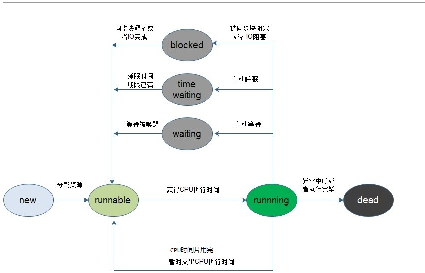
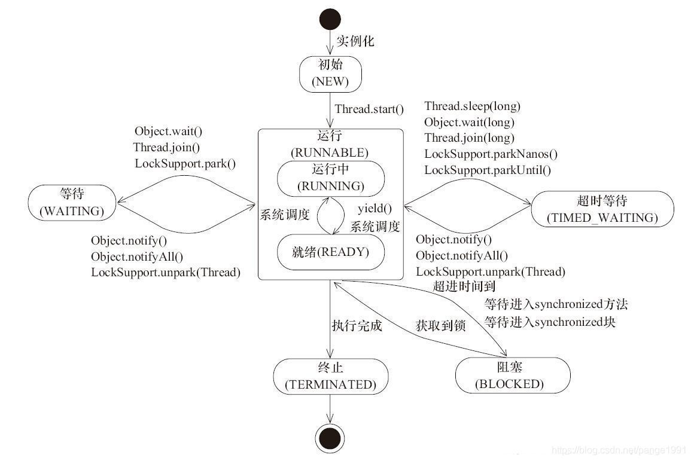

# Thread

## 构造方法

```java
class Thread implements Runnable
```

## 属性

- name：线程名称，可以重复，若没有指定会自动生成。
- id：线程ID，一个正long值，创建线程时指定，终生不变，线程终结时ID可以复用。
- priority：线程优先级，取值为1到10，线程优先级越高，执行的可能越大，若运行环境不支持优先级分10级，如只支持5级，那么设置5和设置6有可能是一样的。
- state：线程状态，Thread.State枚举类型，有**NEW、RUNNABLE、BLOCKED、WAITING、TIMED_WAITING、TERMINATED** 5种。
- ThreadGroup：所属线程组，**一个线程必然有所属线程组**。 RUNNABLE
- UncaughtEThreadGroupxceptionHandler：未捕获异常时的处理器，默认没有，线程出现错误后会立即终止当前线程运行，并打印错误。
- threadlocal：本地变量的一些存储值





### sleep：

sleep相当于让线程睡眠，交出CPU，让CPU去执行其他的任务。

　　但是有一点要非常注意，sleep方法不会释放锁，也就是说如果当前线程持有对某个对象的锁，则即使调用sleep方法，其他线程也无法访问这个对象。

### yield：

将Cpu让给其它线程优先执行，自己进入等待执行（Runnable）状态。yield函数没有设置等待执行的时间，一切听从cpu的调度，当没有其它线程抢占cpu时，当前线程又会被cpu调度进入Running状态。它跟sleep方法类似，同样不会释放锁

### wait()/notify()

```java
public class WaitNotifyCase {
    public static void main(String[] args) {
        final Object lock = new Object();

        new Thread(new Runnable() {
            @Override
            public void run() {
                System.out.println("thread A is waiting to get lock");
                synchronized (lock) {
                    try {
                        System.out.println("thread A get lock");
                        TimeUnit.SECONDS.sleep(1);
                        System.out.println("thread A do wait method");
                        lock.wait();
                        System.out.println("wait end");
                    } catch (InterruptedException e) {
                        e.printStackTrace();
                    }
                }
            }
        }).start();

        try {
            Thread.sleep(1000);
        } catch (InterruptedException e) {
            e.printStackTrace();
        }

        new Thread(new Runnable() {
            @Override
            public void run() {
                System.out.println("thread B is waiting to get lock");
                synchronized (lock) {
                    System.out.println("thread B get lock");
                    try {
                        TimeUnit.SECONDS.sleep(5);
                    } catch (InterruptedException e) {
                        e.printStackTrace();
                    }
                    lock.notify();
                    try {
                        Thread.sleep(1000);
                    } catch (InterruptedException e) {
                        e.printStackTrace();
                    }
                    System.out.println("thread B do notify method");
                }
            }
        }).start();
    }
}
/*
thread A get lock
thread A do wait method
thread B is waiting to get lock
thread B get lock
thread B do notify method
wait end
*/
```

多线程共享资源时，通过共享资源的 wait()和notify()进行通信，上例子中

1、 A线程首先持有了资源lock，并进入了Synchronized同步块

2、A 调用 共享资源的wait()方法，当前线程状态进入TIMED_WAITING状态，同时释放资源锁。wait()后面的代码只有当该线程被唤醒的时候才回去执行（notify（））

3、B线程获取到资源锁，进入同步块，并调用了资源额notify（）方法，唤醒了A线程（注意：此时线程B并没有停止执行，而去执行A线程，而是等B线程执行完之后A线程才能被真正唤醒）

**调用wait() 和 notify()方法之前必须 将资源放在Synchronized块中**

参看 Object源码注释或者其它资料就会发现，这两个方法执行之前必须获取到资源（实例中的lock对象）的monitor。将资源方到同步块中可以保证当前线程获取到资源的monitor

### join

A线程需要等待B线程执行完之后才能去执行，对于这种场景我们就可以用到 join()函数了。

# ThreadLocal

该类提供了线程局部 (thread-local) 变量。这些变量不同于它们的普通对应物，因为访问某个变量(通过其 get 或 set方法)的每个线程都有自己的局部变量，它独立于变量的初始化副本。

它是实现线程安全的一种新的方式，不同于以前加锁synchronized的方式, 每个线程都有自己的独立的变量，这样他们之间是互不影响的，这样就间接的解决线程安全的问题。

```java
/*
 * 线程局部缓存：为线程缓存数据，将数据本地化（脱离共享）
 *
 * 原理：
 * 1. 每个线程由一个ThreadLocalMap属性，本质就是一个map
 * 2. map里面存储的<key, value>称为键值对，存储键值对时需要先求取哈希值
 *    由于哈希值会出现冲突，所以会造成“错位”元素的出现（元素“理想位置”和实际存储位置不一样）
 *    “理想位置”是指该ThreadLocal对象初次计算出的哈希值
 *    如果从“理想位置”到实际存储位置是连续的，这里称该序列是“紧凑”的
 * 3. map里存储的key是一个弱引用，其包装了当前线程中构造的ThreadLocal对象
 *    这意味着，只要ThreadLocal对象丢掉了强引用，那么在下次GC后，map中的ThreadLocal对象也会被清除
 *    对于那些ThreadLocal对象为空的map元素，这里称其为【垃圾值】，稍后会被主动清理
 * 4. map里存储的value就是缓存到当前线程的值，这个value没有弱引用去包装，需要专门的释放策略
 * 5. 一个线程对应多个ThreadLocal，一个ThreadLocal只对应一个值
 *
 * 注，关于哈希值碰撞的问题：
 * 如果是单线程，因为魔数HASH_INCREMENT的存在，且不断扩容，这里不容易出现碰撞
 * 但如果是多线程，哈希值就很容易出现碰撞，因为属性nextHashCode是各线程共享的，会导致生成的指纹出现重复
 *
 * ThreadLocal不能解决线程同步问题。
 *
 * 每个线程有一个ThreadLocalMap（作为map）。但可以有多个ThreadLocal（作为map中的key）。
 *
 * ThreadLocal<T> sThreadLocal = new ThreadLocal<>();
 * <sThreadLocal, T>形成map的键值对，sThreadLocal作为ThreadLocalMap中的键，用它来查找匹配的值。
 */
```

重点需要观察相应的get方法是如何实现的。

## 重要的属性

```java
//注意这两个都是static的，
//一个哈希魔数，与哈希码的生成方式有关，用于产生均匀分布的哈希码
private static final int HASH_INCREMENT=0x61c88647;
//内置种子，有所有的localThread共享，但每次构造一个threadlocal实例，这个值都会更新
private static AtomicInteger nextHashCode = new AtomicInteger();

```

## 构造方法

```java
public ThreadLocal() {}

public static<S> ThreadLocal<S> withInitial(Supplier<? extends S> supplier) { return new SuppliedThreadLocal<>(supplier); }
```

withInitial可以作为localthread的线程初始化方法。

ThreadLocal的API ThreadLocal向外暴露出基本的增删改查方法，几个方法都是很简单: 通过get和set方法是访问和修改的入口，再通过remove方法移除值 

| 方法              | 说明                                             |
| ----------------- | ------------------------------------------------ |
| T get()           | 返回此线程局部变量的当前线程副本中的值           |
| void set(T value) | 将此线程局部变量的当前线程副本中的值设置为指定值 |
| void remove()     | 移除此线程局部变量当前线程的值                   |

## 哈希码计算方式

```java
private final int threadLocalHashCode nextHashCode();

private static int nextHashCode(){
    return nextHashCode.getAndAdd(HASH_INCREMENT);
}
```

这个哈希计算方式与之前说到的魔数有关，观察下面的代码

```java
int s = 0;
double n = 4;
int MAX  = (int) Math.pow(2,n);
for (int i=s;i<MAX+s;i++){
    System.out.println(i*HASH_INCREMENT & (MAX - 1);
}
```

通过这段代码能够生成均匀随机分布在[0,MAX-1]内的代码，因为对于threadlocal而言，其实各线程会维护一个ThreadLocalMap，并以threadlocal作为key来存储，所以比较均匀地生成这些代码

set方法地调用

```java
    public void set(T value) {
        // 返回当前ThreadLocal所在的线程
        Thread thread = Thread.currentThread();
        
        // 返回当前线程持有的map
        ThreadLocalMap map = getMap(thread);
        
        // 如果map不为空，则直接存储<ThreadLocal, T>键值对
        if(map != null) {
            map.set(this, value);
        } else {
            // 否则，需要为当前线程初始化map，并存储键值对<this, firstValue>
            createMap(thread, value);
        }
    }
        // 返回当前线程thread持有的map
    ThreadLocalMap getMap(Thread thread) {
        return thread.threadLocals;
    }
    void createMap(Thread t, T firstValue) {
        t.threadLocals = new ThreadLocalMap(this, firstValue);
    }

private void set(ThreadLocal<?> key, Object value) {

    // We don't use a fast path as with get() because it is at
    // least as common to use set() to create new entries as
    // it is to replace existing ones, in which case, a fast
    // path would fail more often than not.

    Entry[] tab = table;
    int len = tab.length;
    int i = key.threadLocalHashCode & (len-1);

    for (Entry e = tab[i];
         e != null;
         e = tab[i = nextIndex(i, len)]) {//一个线性探索地方法，每次都加1
        ThreadLocal<?> k = e.get();

        if (k == key) {
            e.value = value;
            return;
        }

        if (k == null) {
            replaceStaleEntry(key, value, i);
            return;
        }
    }

    tab[i] = new Entry(key, value);
    int sz = ++size;
    if (!cleanSomeSlots(i, sz) && sz >= threshold)
        rehash();
}
```

- 调用ThreadLocalMap的set()方法[实际set()的实现方法], 进行设置: 
- 通过 hash & (len -1)定位到table的位置i，假设table中i位置的元素为f 
- 如果f != null，假设f中的引用为k: 
  - 如果k和当前ThreadLocal实例一致，则修改value值，返回; 
  - 如果k为null，说明这个f已经是stale(陈旧的)的元素。调用replaceStaleEntry方法删除table中所有陈旧的元素（即entry的引用为null）并插入新元素，返回 
  - 否则通过nextIndex方法找到下一个元素f，继续进行线性探索。 如果f == null，则把Entry加入到table的i位置中。 通过cleanSomeSlots删除陈旧的元素，如果table中没有元素删除，需判断当前情况下是否要进行扩容; 
- 如果f == null，则把Entry加入到table的i位置中 
- 通过cleanSomeSlots删除陈旧的元素，如果table中没有元素删除，需判断当前情况下是否要进行扩容

threadLocalMap地默认大小为16，扩容时按照两倍地大小进行扩容。

注意: 

1. ThreadLocal类封装了set()、get()、remove()3个核心方法 
2. 通过getMap()获取每个子线程Thread持有自己的ThreadLocalMap实例, 因此它们是不存在并发竞争的可以理解为每个线程有自己的变量副本 
3. ThreadLocalMap中Entry[]数组存储数据，初始化长度16，后续每次都是2倍扩容(主线程中定义了几个变量，Entry[]才有几个key) 
4. Entry的key是对ThreadLocal的弱引用，当抛弃掉ThreadLocal对象时，垃圾收集器会忽略这个key的引用而清理掉ThreadLocal对象， 防止了内存泄漏
5. threadlocalMap的扩容阈值是2/3，

set方法的一些要点：

set方法可能会有的情况: 

1. 探测过程中slot都不无效，并且顺利找到key所在的slot，直接替换即可; 
2. 探测过程中发现有无效slot，调用replaceStaleEntry ，效果是最终一定会把key和value放在这个slot，并且会尽可能清理无效slot;   
   1. 在replaceStaleEntry过程中，如果找到了key，则做一个swap把它放到那个无效slot中，value置为新值 
   2. 在replaceStaleEntry过程中，没有找到key，直接在无效slot原地放entry 
3. 探测没有发现key，则在连续段末尾的后一个空位置放上entry，这也是线性探测法的一部分
4. 放完后，做一次启发式清理，如果没清理出去key，并且当前table大小已经超过阈值了，则做一次rehash， rehash函数会调用一次全量清理slot方法也即expungeStaleEntries
5. 如果完了之后table大小超过了threshold - threshold / 4，则进行扩容2倍

## threadloaclmap的清理过程

threadlocal中有两个帮助进行内存回收的方法

### cleanSomeslot

```java
private boolean cleanSomeSlots(int i, int n) { 
    boolean removed = false; 
    Entry[] tab = table; 
    int len = tab.length; 
    do { 
        i = nextIndex(i, len); 
        Entry e = tab[i]; 
        if (e != null && e.get() == null) { 
            n = len; 
            removed = true; 
            i = expungeStaleEntry(i); 
        } 
    } while ( (n >>>= 1) != 0); 
    return removed; 
}
```

入参：

① i的意义 插入entry的位置i，很显然在上述情况(table[i]==null)中，entry刚插入后该位置i很显然不是脏entry; 

② 参数n的用途 主要用于扫描控制（scan control），从while中是通过n来进行条件判断的说明n就是用来控制扫描趟数（循环次数）的 在扫描过程中，如果没有遇到脏entry就整个扫描过程持续log2(n)次，log2(n)的得来是因为n >>>= 1，每次n右移一位相当于n除以2。如果在扫描过程中遇到脏entry的话就会令n为当前hash表的长度（n=len），再扫描log2(n)趟，注意此时n增加无非就是多增加了循环次数从而通过nextIndex往后搜索的范围扩大

③ n的取值 如果是在set方法插入新的entry后调用，n位当前已经插入的entry个数size；如果是在replaceSateleEntry方法中调用n为哈希表的长度len

### expungeStaleEntry

```java
private int expungeStaleEntry(int staleSlot) { 
    Entry[] tab = table; 
    int len = tab.length; 
    //清除当前脏entry 
    // expunge entry at staleSlot 
    tab[staleSlot].value = null; 
    tab[staleSlot] = null; 
    size--; // Rehash until we encounter null 
    Entry e; 
    int i; 
    //2.往后环形继续查找,直到遇到table[i]==null时结束 
    for (i = nextIndex(staleSlot, len); (e = tab[i]) != null; i = nextIndex(i, len)) { 
        ThreadLocal k = e.get(); 
        //3. 如果在向后搜索过程中再次遇到脏entry，同样将其清理掉 
        if (k == null) { e.value = null; tab[i] = null; size--; } 
        else { //处理rehash的情况 
            int h = k.threadLocalHashCode & (len - 1); 
            if (h != i) { 
                tab[i] = null; 
                // Unlike Knuth 6.4 Algorithm R, we must scan until 
                // null because multiple entries could have been stale. 
                while (tab[h] != null) 
                    h = nextIndex(h, len); 
                tab[h] = e; 
            } 
        } 
    } 
    return i; 
}
```

该方法主要做了这么几件事情： 

① 清理当前脏entry，即将其value引用置为null，并且将table[staleSlot]也置为null。value置为null后该value域变为不可达，在下一次gc的时候就会被回收掉，同时table[staleSlot]为null后以便于存放新的entry; 

② 从当前staleSlot位置向后环形（nextIndex）继续搜索，直到遇到哈希桶（tab[i]）为null的时候退出； 

③ 若在搜索过程再次遇到脏entry，继续将其清除。

也就是说该方法，清理掉当前脏entry后，并没有闲下来继续向后搜索，若再次遇到脏entry继续将其清理，直到哈希桶（table[i]）为null时退出。因此方法执行完的结果为 从当前脏entry（staleSlot）位到返回的i位，这中间所有的entry不是脏entry。为什么是遇到null退出呢？原因是存在脏entry的前提条件是 当前哈希桶（table[i]）不为null,只是该entry的key域为null。如果遇到哈希桶为null,很显然它连成为脏entry的前提条件都不具备。

### replaceStaleEntry

```java
private void replaceStaleEntry(ThreadLocal key, Object value, int staleSlot) { 
    Entry[] tab = table; 
    int len = tab.length; 
    Entry e; 
    //向前找到第一个脏entry 
    int slotToExpunge = staleSlot; 
    for (int i = prevIndex(staleSlot, len); (e = tab[i]) != null; i = prevIndex(i, len)) 
        if (e.get() == null)  
            slotToExpunge = i; 
    for (int i = nextIndex(staleSlot, len); (e = tab[i]) != null; i = nextIndex(i, len)) { 
        ThreadLocal k = e.get(); 
        if (k == key) { 
            //如果在向后环形查找过程中发现key相同的entry就覆盖并且和脏entry进行交换 
            e.value = value; 
            tab[i] = tab[staleSlot]; 
            tab[staleSlot] = e; 
            // Start expunge at preceding stale entry if it exists 
            //如果在查找过程中还未发现脏entry，那么就以当前位置作为cleanSomeSlots 
            //的起点 
            if (slotToExpunge == staleSlot)  
            	slotToExpunge = i; 
            //搜索脏entry并进行清理 
            cleanSomeSlots(expungeStaleEntry(slotToExpunge), len); 
            return; 
        } 
        // If we didn't find stale entry on backward scan, the 
        // first stale entry seen while scanning for key is the 
        // first still present in the run. 
        //如果向前未搜索到脏entry，则在查找过程遇到脏entry的话，后面就以此时这个位置 
        //作为起点执行cleanSomeSlots 
        if (k == null && slotToExpunge == staleSlot) 
            slotToExpunge = i; 
    } 
    // If key not found, put new entry in stale slot 
    //如果在查找过程中没有找到可以覆盖的entry，则将新的entry插入在脏entry 
    tab[staleSlot].value = null;  
    tab[staleSlot] = new Entry(key, value); 
    // If there are any other stale entries in run, expunge them  
    if (slotToExpunge != staleSlot) 
        //执行cleanSomeSlots  
        cleanSomeSlots(expungeStaleEntry(slotToExpunge), len);
}
```

初始时slotToExpunge和staleSlot相同，若在搜索过程中发现了脏entry，则更新slotToExpunge为当前索引i。另外，说明replaceStaleEntry并不仅仅局限于处理当前已知的脏entry，它认为在出现脏entry的相邻位置也有很大概率出现脏entry，所以为了一次处理到位，就需要向前环形搜索，找到前面的脏entry。那么根据在向前搜索中是否还有脏entry以及在for循环后向环形查找中是否找到可覆盖的entry，我们分这四种情况来充分理解这个方法:

1. 前向有脏entry
   1. 
   2. 
2. 前向没有脏entry
   1. 
   2. 

## threadLocalmap的生命周期

线程在退出的时候会执行exit()方法，该方法会将threadlocals设置为null，因此该map的生命周期与thread是一致的。

# ConcurrentHashMap

该类的key，value值均不允许为null，其他的和hashmap是一样的，使用了链表和红黑树，使用的是无锁编程方式

### 重要的属性

```java
private static final int MAXIMUM_CAPACITY = 1 << 30;
private static final int DEFAULT_CAPACITY = 16;
static final int TREEIFY_THRESHOLD = 8;
static final int UNTREEIFY_THRESHOLD = 6;
static final int MIN_TREEIFY_CAPACITY = 64;
static final float LOAD_FACTOR = 0.75f;
static final int MOVED     = -1; // 表示正在转移
static final int TREEBIN   = -2; // 表示已经转换成树
static final int RESERVED  = -3; // hash for transient reservations
static final int HASH_BITS = 0x7fffffff; // usable bits of normal node hash
transient volatile Node<K,V>[] table;//默认没初始化的数组，用来保存元素
private transient volatile Node<K,V>[] nextTable;//转移的时候用的数组
/**
     * 用来控制表初始化和扩容的，默认值为0，当在初始化的时候指定了大小，这会将这个大小保存在sizeCtl中，大小为数组的0.75
     * 当为负的时候，说明表正在初始化或扩张，
     *     -1表示初始化
     *     -(1+n) n:表示活动的扩张线程
     */
    private transient volatile int sizeCtl;
```

### 重要的类

```java
static class Node<K,V> implements Map.Entry<K,V> {
        final int hash;    //key的hash值
        final K key;       //key
        volatile V val;    //value
        volatile Node<K,V> next; //表示链表中的下一个节点

        Node(int hash, K key, V val, Node<K,V> next) {
            this.hash = hash;
            this.key = key;
            this.val = val;
            this.next = next;
        }
        public final K getKey()       { return key; }
        public final V getValue()     { return val; }
        public final int hashCode()   { return key.hashCode() ^ val.hashCode(); }
    }
```

```java
static final class TreeNode<K,V> extends Node<K,V> {
        TreeNode<K,V> parent;  // red-black tree links
        TreeNode<K,V> left;
        TreeNode<K,V> right;
        TreeNode<K,V> prev;    // needed to unlink next upon deletion
        boolean red;

        TreeNode(int hash, K key, V val, Node<K,V> next,
                 TreeNode<K,V> parent) {
            super(hash, key, val, next);
            this.parent = parent;
        }
}
```

```java
static final class TreeBin<K,V> extends Node<K,V> {
        TreeNode<K,V> root;
        volatile TreeNode<K,V> first;
        volatile Thread waiter;
        volatile int lockState;
        // values for lockState
        static final int WRITER = 1; // set while holding write lock
        static final int WAITER = 2; // set when waiting for write lock
        static final int READER = 4; // increment value for setting read lock
}
```

```java
static final class ForwardingNode<K,V> extends Node<K,V> {
        final Node<K,V>[] nextTable;
        ForwardingNode(Node<K,V>[] tab) {
            super(MOVED, null, null, null);
            this.nextTable = tab;
        }}
```

### 一些重要的方法

在ConcurrentHashMap中使用了unSafe方法，通过直接操作内存的方式来保证并发处理的安全性，使用的是硬件的安全机制。

```java
/*
     * 用来返回节点数组的指定位置的节点的原子操作
     */
    @SuppressWarnings("unchecked")
    static final <K,V> Node<K,V> tabAt(Node<K,V>[] tab, int i) {
        return (Node<K,V>)U.getObjectVolatile(tab, ((long)i << ASHIFT) + ABASE);
    }

    /*
     * cas原子操作，在指定位置设定值
     */
    static final <K,V> boolean casTabAt(Node<K,V>[] tab, int i,
                                        Node<K,V> c, Node<K,V> v) {
        return U.compareAndSwapObject(tab, ((long)i << ASHIFT) + ABASE, c, v);
    }
    /*
     * 原子操作，在指定位置设定值
     */
    static final <K,V> void setTabAt(Node<K,V>[] tab, int i, Node<K,V> v) {
        U.putObjectVolatile(tab, ((long)i << ASHIFT) + ABASE, v);
    }
```

