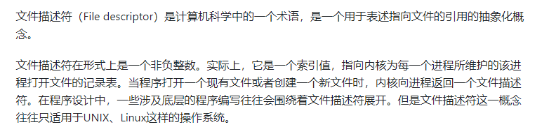

# LINUX

[select、poll、epoll之间的区别(搜狗面试)](https://www.cnblogs.com/aspirant/p/9166944.html)

[select、poll、epoll之间的区别总结\[整理]](https://www.cnblogs.com/Anker/p/3265058.html)

[Linux IO模式及 select、poll、epoll详解](https://segmentfault.com/a/1190000003063859)

[大话 Select、Poll、Epoll](https://cloud.tencent.com/developer/article/1005481)

[聊聊IO多路复用之select、poll、epoll详解](https://www.jianshu.com/p/dfd940e7fca2)

[如果这篇文章说不清epoll的本质，那就过来掐死我吧！ （1）](https://zhuanlan.zhihu.com/p/63179839)

上面这个是非常重要的文章

## 文献描述符



## 用户空间和内核空间


## linux io复用_和nio结合着看

select/poll/epoll 都是 I/O 多路复用的具体实现，select 出现的最早，之后是 poll，再是 epoll。

### select

```c++
int select(int n, fd_set *readfds, fd_set *writefds, fd_set *exceptfds, struct timeval *timeout);
```

select 允许应用程序监视一组文件描述符，等待一个或者多个描述符成为就绪状态，从而完成 I/O 操作。

- fd_set 使用数组实现，数组大小使用 FD_SETSIZE 定义，所以只能监听少于 FD_SETSIZE 数量的描述符。有三种类型的描述符类型：readset、writeset、exceptset，分别对应读、写、异常条件的描述符集合。
- timeout 为超时参数，调用 select 会一直阻塞直到有描述符的事件到达或者等待的时间超过 timeout。
- 成功调用返回结果大于 0，出错返回结果为 -1，超时返回结果为 0。
- select可支持所有平台，但是单个进程能够监视的文件描述符数量存在最大限制

```C++
fd_set fd_in, fd_out;
struct timeval tv;

// Reset the sets
FD_ZERO( &fd_in );
FD_ZERO( &fd_out );

// Monitor sock1 for input events
FD_SET( sock1, &fd_in );

// Monitor sock2 for output events
FD_SET( sock2, &fd_out );

// Find out which socket has the largest numeric value as select requires it
int largest_sock = sock1 > sock2 ? sock1 : sock2;

// Wait up to 10 seconds
tv.tv_sec = 10;
tv.tv_usec = 0;

// Call the select
int ret = select( largest_sock + 1, &fd_in, &fd_out, NULL, &tv );

// Check if select actually succeed
if ( ret == -1 )
    // report error and abort
else if ( ret == 0 )
    // timeout; no event detected
else
{
    if ( FD_ISSET( sock1, &fd_in ) )
        // input event on sock1

    if ( FD_ISSET( sock2, &fd_out ) )
        // output event on sock2
}
```

### poll

```C++
int poll(struct pollfd *fds, unsigned int nfds, int timeout);
```

poll 的功能与 select 类似，也是等待一组描述符中的一个成为就绪状态。

poll 中的描述符是 pollfd 类型的数组，pollfd 的定义如下：

```C++
struct pollfd {
               int   fd;         /* file descriptor */
               short events;     /* requested events */
               short revents;    /* returned events */
           };
```

```C++
// The structure for two events
struct pollfd fds[2];

// Monitor sock1 for input
fds[0].fd = sock1;
fds[0].events = POLLIN;

// Monitor sock2 for output
fds[1].fd = sock2;
fds[1].events = POLLOUT;

// Wait 10 seconds
int ret = poll( &fds, 2, 10000 );
// Check if poll actually succeed
if ( ret == -1 )
    // report error and abort
else if ( ret == 0 )
    // timeout; no event detected
else
{
    // If we detect the event, zero it out so we can reuse the structure
    if ( fds[0].revents & POLLIN )
        fds[0].revents = 0;
        // input event on sock1

    if ( fds[1].revents & POLLOUT )
        fds[1].revents = 0;
        // output event on sock2
}
```

### epoll

```C++
int epoll_create(int size);
int epoll_ctl(int epfd, int op, int fd, struct epoll_event *event)；
int epoll_wait(int epfd, struct epoll_event * events, int maxevents, int timeout);
```

**epoll_ctl() 用于向内核注册新的描述符或者是改变某个文件描述符的状态。已注册的描述符在内核中会被维护在一棵红黑树上，通过回调函数内核会将 I/O 准备好的描述符加入到一个链表中管理，进程调用 epoll_wait() 便可以得到事件完成的描述符。**

从上面的描述可以看出，epoll 只需要将描述符从进程缓冲区向内核缓冲区拷贝一次，并且进程不需要通过轮询来获得事件完成的描述符。

epoll 仅适用于 Linux OS。

epoll 比 select 和 poll 更加灵活而且没有描述符数量限制。

epoll 对多线程编程更有友好，一个线程调用了 epoll_wait() 另一个线程关闭了同一个描述符也不会产生像 select 和 poll 的不确定情况。

```C++
// Create the epoll descriptor. Only one is needed per app, and is used to monitor all sockets.
// The function argument is ignored (it was not before, but now it is), so put your favorite number here
int pollingfd = epoll_create( 0xCAFE );

if ( pollingfd < 0 )
 // report error

// Initialize the epoll structure in case more members are added in future
struct epoll_event ev = { 0 };

// Associate the connection class instance with the event. You can associate anything
// you want, epoll does not use this information. We store a connection class pointer, pConnection1
ev.data.ptr = pConnection1;

// Monitor for input, and do not automatically rearm the descriptor after the event
ev.events = EPOLLIN | EPOLLONESHOT;
// Add the descriptor into the monitoring list. We can do it even if another thread is
// waiting in epoll_wait - the descriptor will be properly added
if ( epoll_ctl( epollfd, EPOLL_CTL_ADD, pConnection1->getSocket(), &ev ) != 0 )
    // report error

// Wait for up to 20 events (assuming we have added maybe 200 sockets before that it may happen)
struct epoll_event pevents[ 20 ];

// Wait for 10 seconds, and retrieve less than 20 epoll_event and store them into epoll_event array
int ready = epoll_wait( pollingfd, pevents, 20, 10000 );
// Check if epoll actually succeed
if ( ret == -1 )
    // report error and abort
else if ( ret == 0 )
    // timeout; no event detected
else
{
    // Check if any events detected
    for ( int i = 0; i < ret; i++ )
    {
        if ( pevents[i].events & EPOLLIN )
        {
            // Get back our connection pointer
            Connection * c = (Connection*) pevents[i].data.ptr;
            c->handleReadEvent();
         }
    }
}
```


#### 工作模式

epoll 的描述符事件有两种触发模式：LT（level trigger）和 ET（edge trigger）。

##### 1. LT 模式

当 epoll_wait() 检测到描述符事件到达时，将此事件通知进程，进程可以不立即处理该事件，下次调用 epoll_wait() 会再次通知进程。是默认的一种模式，并且同时支持 Blocking 和 No-Blocking。

##### 2. ET 模式

和 LT 模式不同的是，通知之后进程必须立即处理事件，下次再调用 epoll_wait() 时不会再得到事件到达的通知。

很大程度上减少了 epoll 事件被重复触发的次数，因此效率要比 LT 模式高。只支持 No-Blocking，以避免由于一个文件句柄的阻塞读/阻塞写操作把处理多个文件描述符的任务饿死。

## 比较

### 1. 功能

select 和 poll 的功能基本相同，不过在一些实现细节上有所不同。

- select 会修改描述符，而 poll 不会；
- select 的描述符类型使用数组实现，FD_SETSIZE 大小默认为 1024，因此默认只能监听少于 1024 个描述符。如果要监听更多描述符的话，需要修改 FD_SETSIZE 之后重新编译；而 poll采用链表来试下， 没有描述符数量的限制；
- poll 提供了更多的事件类型，并且对描述符的重复利用上比 select 高。poll具有水平触发的特点，如果报告了fd事件但是不处理，那么下次还会返回该fd
- 如果一个线程对某个描述符调用了 select 或者 poll，另一个线程关闭了该描述符，会导致调用结果不确定。

### 2. 速度

select 和 poll 速度都比较慢，每次调用都需要将全部描述符从应用进程缓冲区复制到内核缓冲区。select和poll都需要在返回后，`通过遍历文件描述符来获取已经就绪的socket`。事实上，`同时连接的大量客户端在一时刻可能只有很少的处于就绪状态`，因此随着监视的描述符数量的增长，其效率也会线性下降。

### 3. 可移植性

几乎所有的系统都支持 select，但是只有比较新的系统支持 poll。

## 应用场景

很容易产生一种错觉认为只要用 epoll 就可以了，select 和 poll 都已经过时了，其实它们都有各自的使用场景。

### 1. select 应用场景

select 的 timeout 参数精度为微秒，而 poll 和 epoll 为毫秒，因此 select 更加适用于实时性要求比较高的场景，比如核反应堆的控制。

select 可移植性更好，几乎被所有主流平台所支持。

### 2. poll 应用场景

poll 没有最大描述符数量的限制，如果平台支持并且对实时性要求不高，应该使用 poll 而不是 select。

### 3. epoll 应用场景

只需要运行在 Linux 平台上，有大量的描述符需要同时轮询，并且这些连接最好是长连接。

需要同时监控小于 1000 个描述符，就没有必要使用 epoll，因为这个应用场景下并不能体现 epoll 的优势。

需要监控的描述符状态变化多，而且都是非常短暂的，也没有必要使用 epoll。因为 epoll 中的所有描述符都存储在内核中，造成每次需要对描述符的状态改变都需要通过 epoll_ctl() 进行系统调用，频繁系统调用降低效率。并且 epoll 的描述符存储在内核，不容易调试。

## 消息传递机制

select和poll都需要内核将消息传递到用户空间，都需要内核的拷贝动作

epoll通过内核与用户控件共享一块内存来实现

## **总结：**

（1）select，poll实现需要自己不断轮询所有fd集合，直到设备就绪，期间可能要睡眠和唤醒多次交替。而epoll其实也需要调用epoll_wait不断轮询就绪链表，期间也可能多次睡眠和唤醒交替，但是它是设备就绪时，调用回调函数，把就绪fd放入就绪链表中，并唤醒在epoll_wait中进入睡眠的进程。虽然都要睡眠和交替，但是select和poll在“醒着”的时候要遍历整个fd集合，而epoll在“醒着”的时候只要判断一下就绪链表是否为空就行了，这节省了大量的CPU时间。这就是回调机制带来的性能提升。

（2）select，poll每次调用都要把fd集合从用户态往内核态拷贝一次，并且要把current往设备等待队列中挂一次，而epoll只要一次拷贝，而且把current往等待队列上挂也只挂一次（在epoll_wait的开始，注意这里的等待队列并不是设备等待队列，只是一个epoll内部定义的等待队列）。这也能节省不少的开销。

# linux fork

[linux中fork（）函数详解（原创！！实例讲解）](https://blog.csdn.net/jason314/article/details/5640969)

fork（）函数通过系统调用创建一个与原来进程几乎完全相同的进程，也就是两个进程可以做完全相同的事，但如果初始参数或者传入的变量不同，两个进程也可以做不同的事。
  一个进程调用fork（）函数后，系统先给新的进程分配资源，例如存储数据和代码的空间。然后把原来的进程的所有值都复制到新的新进程中，只有少数值与原来的进程的值不同。相当于克隆了一个自己。

fork调用的一个奇妙之处就是它仅仅被调用一次，却能够返回两次，它可能有三种不同的返回值：
  1）在父进程中，fork返回新创建子进程的进程ID；
  2）在子进程中，fork返回0；
  3）如果出现错误，fork返回一个负值；

fpid的值为什么在父子进程中不同。“其实就相当于链表，进程形成了链表，父进程的fpid(p 意味point)指向子进程的进程id, 因为子进程没有子进程，所以其fpid为0.

```C++
#include <stdio.h>
int main(int argc, char* argv[])
{
   fork();
   fork() && fork() || fork();
   fork();
   printf("+/n");
}
#fork(); /* 1+1=2 */
#fork() /* 2+2=4 */ && fork() /* 4+2=6 */ || fork() /* 6+4=10 */;
#fork(); /* 10*2=20 */
```

孤儿进程和僵尸进程有什么区别？

- 孤儿进程就是说一个父进程退出，而它的一个或多个子进程还在运行，那么这些子进程将成为孤儿进程。孤儿进程将被 init 进程(进程ID为1的进程)所收养，并由 init 进程对它们完成状态收集工作。因为孤儿进程会被 init 进程收养，所以孤儿进程不会对系统造成危害。
- 僵尸进程就是一个子进程的进程描述符在子进程退出时不会释放，只有当父进程通过 wait() 或 waitpid() 获取了子进程信息后才会释放。如果子进程退出，而父进程并没有调用 wait() 或 waitpid()，那么子进程的进程描述符仍然保存在系统中，这种进程称之为僵尸进程。僵尸进程通过 ps 命令显示出来的状态为 Z。

系统所能使用的进程号是有限的，如果产生大量僵尸进程，可能会因为没有可用的进程号而导致系统不能产生新的进程。如果要消灭系统中大量的僵尸进程，只需要将其父进程杀死，此时僵尸进程就会变成孤儿进程，从而被 init 进程所收养，这样 init 进程就会释放所有的僵尸进程所占有的资源，从而结束僵尸进程。

[fork之后子进程到底复制了父进程什么](https://blog.csdn.net/xy010902100449/article/details/44851453)

fork（）会产生一个和父进程完全相同的子进程，但子进程在此后多会exec系统调用，出于效率考虑，linux中引入了“写时复制“技术，也就是只有进程空间的各段的内容要发生变化时，才会将父进程的内容复制一份给子进程。在fork之后exec之前两个进程用的是相同的物理空间（内存区），子进程的代码段、数据段、堆栈都是指向父进程的物理空间，也就是说，两者的虚拟空间不同，但其对应的物理空间是同一个。当父子进程中有更改相应段的行为发生时，再为子进程相应的段分配物理空间，如果不是因为exec，内核会给子进程的数据段、堆栈段分配相应的物理空间（至此两者有各自的进程空间，互不影响），而代码段继续共享父进程的物理空间（两者的代码完全相同）。而如果是因为exec，由于两者执行的代码不同，子进程的代码段也会分配单独的物理空间。

fork时子进程获得父进程数据空间、堆和栈的复制，所以变量的地址（当然是虚拟地址）也是一样的。

每个进程都有自己的虚拟地址空间，不同进程的相同的虚拟地址显然可以对应不同的物理地址。因此地址相同（虚拟地址）而值不同没什么奇怪。
具体过程是这样的：fork子进程完全复制父进程的栈空间，也复制了页表，但没有复制物理页面，所以这时虚拟地址相同，物理地址也相同，但是会把父子共享的页面标记为“只读”（类似mmap的private的方式），如果父子进程一直对这个页面是同一个页面，知道其中任何一个进程要对共享的页面“写操作”，这时内核会复制一个物理页面给这个进程使用，同时修改页表。而把原来的只读页面标记为“可写”，留给另外一个进程使用。

这就是所谓的“写时复制”。正因为fork采用了这种写时复制的机制，所以fork出来子进程之后，父子进程哪个先调度呢？内核一般会先调度子进程，因为很多情况下子进程是要马上执行exec，会清空栈、堆。。这些和父进程共享的空间，加载新的代码段。这就避免了“写时复制”拷贝共享页面的机会。如果父进程先调度很可能写共享页面，会产生“写时复制”的无用功。所以，一般是子进程先调度。**fork之后内核会通过将子进程放在队列的前面，以让子进程先执行，以免父进程执行导致写时复制，而后子进程执行exec系统调用，因无意义的复制而造成效率的下降。**

（注1：在理解时，你可以认为fork后，这两个相同的虚拟地址指向的是不同的物理地址，这样方便理解父子进程之间的独立性）
（注2：但实际上，linux为了提高 fork 的效率，采用了 copy-on-write 技术，fork后，这两个虚拟地址实际上指向相同的物理地址（内存页），只有任何一个进程试图修改这个虚拟地址里的内容前，两个虚拟地址才会指向不同的物理地址（新的物理地址的内容从原物理地址中复制得到））

## 什么是守护进程？

守护进程是运行在后台的一种特殊进程，它是独立于控制终端的，并周期性地执行某些任务。

## 线程有哪两种？

- 用户级线程(user level thread)：对于这类线程，有关线程管理的所有工作都由应用程序完成，内核意识不到线程的存在。在应用程序启动后，操作系统分配给该程序一个进程号，以及其对应的内存空间等资源。应用程序通常先在一个线程中运行，该线程被成为主线程。在其运行的某个时刻，可以通过调用线程库中的函数创建一个在相同进程中运行的新线程。用户级线程的好处是非常高效，不需要进入内核空间，但并发效率不高。
- 内核级线程(kernel level thread)：对于这类线程，有关线程管理的所有工作由内核完成，应用程序没有进行线程管理的代码，只能调用内核线程的接口。内核维护进程及其内部的每个线程，调度也由内核基于线程架构完成。内核级线程的好处是，内核可以将不同线程更好地分配到不同的CPU，以实现真正的并行计算。

# exit程序结束的方式

- main方法调用return
- 调用exit函数，
- 调用_exit或者Exit函数

[如果这篇文章说不清epoll的本质，那就过来掐死我吧！ （1）](https://zhuanlan.zhihu.com/p/63179839)

要点：

1. socket监视的阻塞实现原理
2. 内存接收网络数据的过程
3. select的实现过程
4. epoll的改进方式——分离
5. epoll实现过程

select缺点：

每次调用select都需要将进程加入到所有监视socket的等待队列，每次唤醒都需要从每个队列中移除。这里涉及了两次遍历，而且每次都要将整个fds列表传递给内核，有一定的开销。进程被唤醒后，程序并不知道哪些socket收到数据，还需要遍历一次。

[如果这篇文章说不清epoll的本质，那就过来掐死我吧！ （2）](https://zhuanlan.zhihu.com/p/64138532)

[如果这篇文章说不清epoll的本质，那就过来掐死我吧！ （3）](https://zhuanlan.zhihu.com/p/64746509)


1. epoll原理
   - 如下图所示，当某个进程调用epoll_create方法时，内核会创建一个eventpoll对象（也就是程序中epfd所代表的对象）。eventpoll对象也是文件系统中的一员，和socket一样，它也会有等待队列。创建一个代表该epoll的eventpoll对象是必须的，因为内核要维护“就绪列表”等数据，“就绪列表”可以作为eventpoll的成员。
   - 创建epoll对象后，可以用epoll_ctl添加或删除所要监听的socket。内核会将eventpoll添加到socket的等待队列中。当socket收到数据后，中断程序会操作eventpoll对象，而不是直接操作进程。
   - 当socket收到数据后，中断程序会给eventpoll的“就绪列表”添加socket引用。当程序执行到epoll_wait时，如果rdlist已经引用了socket，那么epoll_wait直接返回，如果rdlist为空，阻塞进程。
   - 假设计算机中正在运行进程A和进程B，在某时刻进程A运行到了epoll_wait语句。内核会将进程A放入eventpoll的等待队列中，阻塞进程。当socket接收到数据，中断程序一方面修改rdlist，另一方面唤醒eventpoll等待队列中的进程，进程A再次进入运行状态，也因为rdlist的存在，进程A可以知道哪些socket发生了变化。

就绪队列采用双向链表来实现，保存要监视的socket对象采用的是红黑树。

　**孤儿进程：一个父进程退出，而它的一个或多个子进程还在运行，那么那些子进程将成为孤儿进程。孤儿进程将被init进程(进程号为1)所收养，并由init进程对它们完成状态收集工作。**

　　**僵尸进程：一个进程使用fork创建子进程，如果子进程退出，而父进程并没有调用wait或waitpid获取子进程的状态信息，那么子进程的进程描述符仍然保存在系统中。这种进程称之为僵死进程。**

**如果进程不调用wait / waitpid的话，** **那么保留的那段信息就不会释放，其进程号就会一直被占用，但是系统所能使用的进程号是有限的，如果大量的产生僵死进程，将因为没有可用的进程号而导致系统不能产生新的进程. 此即为僵尸进程的危害，应当避免。**

# exec函数

系统调用exec是以新的进程去代替原来的进程，但进程的PID保持不变。因此，可以这样认为，exec系统调用并没有创建新的进程，只是替换了原来进程上下文的内容。原进程的代码段，数据段，堆栈段被新的进程所代替。

执行exec系统调用，一般都是这样，用fork()函数新建立一个进程，然后让进程去执行exec调用。我们知道，在fork()建立新进程之后，父进各与子进程共享代码段，但数据空间是分开的，但父进程会把自己数据空间的内容copy到子进程中去，还有上下文也会copy到子进程中去。而为了提高效率，采用一种写时copy的策略，即创建子进程的时候，并不copy父进程的地址空间，父子进程拥有共同的地址空间，只有当子进程需要写入数据时(如向缓冲区写入数据),这时候会复制地址空间，复制缓冲区到子进程中去。从而父子进程拥有独立的地址空间。

exec函数族提供了一种在进程中启动另一个程序执行的方法。它可以根据指定的文件名或目录名找到可执行文件，并用它来取代原调用进程的数据段、代码段和堆栈段。在执行完之后，原调用进程的内容除了进程号外，其他全部都被替换了。