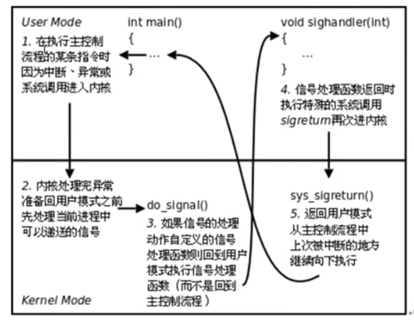

# linux

书籍：linux内核设计与实现，深入理解linux内核

## linux内核空间和用户控件

[(整理)用户空间_内核空间以及内存映射](https://blog4jimmy.com/2018/01/348.html)

 现代操作系统采用虚拟存储器，对于32位操作系统而言，它的寻址空间（虚拟存储空间）为4G（2的32次方）。操作系统的核心是内核，独立于普通的应用程序，可以访问受保护的内存空间，也有访问底层硬件设备的权限。为了保证用户进程不能直接操作内核，保证内核安全，操作系统将虚拟空间划分为两部分，一部分是内核空间，一部分是用户空间。针对Linux操作系统，将最高的1G字节（从虚拟地址0xC0000000到0xFFFFFFFF）供内核使用，称为内核空间，而较低的3G字节（从虚拟地址0x00000000到0xBFFFFFFF），供各个进程使用，称为用户空间。每个进程都可以通过系统调用进入到内核。**其中在Linux系统中，进程的用户空间是独立的，而内核空间是共有的，进程切换时，用户空间切换，内核空间不变。**也就是多个进程的内核空间用的是一套映射，有了用户空间和内核空间的划分后，整个linux内部结构可以分为三部分，从最底层到最上层依次是：硬件->内核空间->用户空间，如下图所示:

mmap：一种直接内存映射的方法，即将一个文件或者其它对象映射到进程的地址空间，实现文件磁盘地址和进程虚拟地址空间中一段虚拟地址的一一对映关系。实现这样的映射关系后，进程就可以采用指针的方式读写操作这一段内存，而系统会自动回写脏页面到对应的文件磁盘上，即完成了对文件的操作而不必再调用read,write等系统调用函数。相反，内核空间对这段区域的修改也直接反映用户空间，从而可以实现不同进程间的文件共享。

由上图可以看出，进程的虚拟地址空间，由多个虚拟内存区域构成。虚拟内存区域是进程的虚拟地址空间中的一个同质区间，即具有同样特性的连续地址范围。上图中所示的text数据段（代码段）、初始数据段、BSS数据段、堆、栈和内存映射，都是一个独立的虚拟内存区域。而为内存映射服务的地址空间处在堆栈之间的空余部分。

### mmap内存映射原理

mmap内存映射的实现过程，总的来说可以分为三个阶段：

**进程启动映射过程，并在虚拟地址空间中为映射创建虚拟映射区域**

- **进程在用户空间调用库函数mmap**，原型：void *mmap(void* start, size_t length, int prot, int flags, int fd, off_t offset);
- 在当前进程的虚拟地址空间中，寻找一段空闲的满足要求的连续的虚拟地址
- 为此虚拟区分配一个vm_area_struct结构，接着对这个结构的各个域进行了初始化
- 将新建的虚拟区结构（vm_area_struct）插入进程的虚拟地址区域链表或树中

**调用内核空间的系统调用函数mmap（不同于用户空间函数），实现文件物理地址和进程虚拟地址的一一映射关系**

- 为映射分配了新的虚拟地址区域后，通过待映射的文件指针，在文件描述符表中找到对应的文件描述符，通过文件描述符，链接到内核“已打开文件集”中该文件的文件结构体（struct file），每个文件结构体维护着和这个已打开文件相关各项信息。
- 通过该文件的文件结构体，链接到file_operations模块，调用内核函数mmap，其原型为：int mmap(struct file *filp, struct vm_area_struct* vma)，不同于用户空间库函数。
- 内核mmap函数通过虚拟文件系统inode模块定位到文件磁盘物理地址。
- 通过remap_pfn_range函数建立页表，即实现了文件地址和虚拟地址区域的映射关系。此时，这片虚拟地址并没有任何数据关联到主存中。

**进程发起对这片映射空间的访问，引发缺页异常，实现文件内容到物理内存（主存）的拷贝**

注：前两个阶段仅在于创建虚拟区间并完成地址映射，但是并没有将任何文件数据的拷贝至主存。真正的文件读取是当进程发起读或写操作时。

- 程的读或写操作访问虚拟地址空间这一段映射地址，通过查询页表，发现这一段地址并不在物理页面上。因为目前只建立了地址映射，真正的硬盘数据还没有拷贝到内存中，因此引发缺页异常。
- 缺页异常进行一系列判断，确定无非法操作后，内核发起请求调页过程。
- 调页过程先在交换缓存空间（swap cache）中寻找需要访问的内存页，如果没有则调用nopage函数把所缺的页从磁盘装入到主存中。
- 之后进程即可对这片主存进行读或者写的操作，如果写操作改变了其内容，一定时间后系统会自动回写脏页面到对应磁盘地址，也即完成了写入到文件的过程。

注：修改过的脏页面并不会立即更新回文件中，而是有一段时间的延迟，可以调用msync()来强制同步, 这样所写的内容就能立即保存到文件里了。

## linux基本情况

unix下shell用于解析命令，linux中是bash，从屏幕中接收命令并解析

使用tab来补齐命令及路径

### 系统目录下的重要目录

bin：存放可执行文件

boot：开机启动程序

dev：设备文件目录，“所见皆文件”

etc：用户配置文件信息

home：用户目录

lib：库路径，操作系统所使用的库，如标准C库

media/mnt:与磁盘挂载相关

opt/proc：与系统编程进程相关

root：根用户目录

usr：用户资源目录

### linux文件类型

块设备文件：b——包括磁盘等，块的大小为512字节

目录文件：d——文件目录

普通文件：-

字符设备文件：d-鼠标键盘这些

软连接：l

管道文件：p

套接字：s

### linux软硬连接

> ln -s /home/file file.s2

该命令创建了一个文件的软连接，但是需要注意如果创建软连接时使用的是相对路径，在移动软连接文件之后就会导致无法访问，因此建议使用绝对路径,软连接文件本身的权限是全开放的，软连接文件本身就是一个文件，具有自己的innode，占用磁盘空间，软连接指向其它文件

> ln /home/file file.s3

创建硬连接，会导致文件的引用计数增加，当引用计数减小到0时，一个文件才在linux系统中正真被删除，如果一个文件创建了多个硬连接文件，对其中任意一个文件进行的修改都会导致其它文件被修改，在磁盘上这些硬连接文件其实都是一个文件，具有相同的innode

### linux重要命令

file:查看文件信息

who:查看当前用户

ps：查看进程

jobs：查看作业

fg：前台切换

bg：后台切换

env：查看环境变量

top：任务管理器

kill：杀死进程

strace:最终命令使用到的系统调用

find：查找命令，以文件作为查找对象，格式为命令+查找目录+匹配方式

> find ./  -maxdepth 1 -name '*.jpg'

常用的匹配方式 -type：文件类型 -name：文件名 -maxdepth 递归深度 -size 文件大小

find可以配合exec指令来实现查找文件之后删除

> find ./  -maxdepth 1 -name '*.jpg' -exec rm -r {} \;

exec：将之前操作的结果执行某一个操作

ok：以交互式的方式对之前操作的结果执行某一操作

grep：以文件内容作为搜索对象，可以与管道符一起使用，实现查找功能

> ps aux | grep abcdefg

注意上述的命令必定会查到一条grep占用的进程

xargs：对一些集合执行一些结果，当结果集过大时，可以分片操作

#### xargs和exec的差别

xargs是使用空格作为结果集不同文件分割的，因此如果文件名本身包含有空格，就可能导致xargs运行出错，可以使用参数-print0来指定分隔符为null

> find ./  -maxdepth 1 -name '*.jpg' -print0 | xargs -print0 ls -l

重要参考书籍——sed和awk

ifconfig：网络管理命令

ping：网络连接阶段

netstat：查看网络

man：手册——需要掌握的章节包括——1，2，3，5以及9

alias：给程序起别名

> alias pg ='ps aux | grep'
>
> pg abc

umask:指定用户创建时的掩码

### linux软件安装与卸载

> apt-get update

> apt-get Install tree 

该命令会从服务器上更新软件资源列表到本地并安装tree软件

### Vim 

命令模式：i a o 进入文本模式 : 进入末行模式，（aio,AIO）的具体执行逻辑有不同，需要时查找

文本模式：esc进入文本模式

末行模式：w保存 q退出

跳转指令：跳转指定行——88G(命令模式)，:88   跳转行首——gg(命令模式) 跳转行尾——G(命令模式) 自动格式化程序：gg=G(命令模式)，光标移动到行首0，行尾——$

删除指令：删除单词——dw，删除光标之后全部——D/d+$,删除光标之前——d+0，删除单个字符——x，删除指定段落——v+d,需要选中指定段落，删除光标指定行——dd，删除光标所在后n行——Ndd，N为数字

替换指令：替换单个字符——r，单行替换——光标在替换行上，末行模式：:s/原数据/替换数据，全篇替换——末行模式：%s/原数据/替换数据/g，加上g可以使一行全部都替换，否则就只替换首个，指定行的替换——末行模式：:起始，末行s/原数据/替换数据

复制指令：复制指定行——p(p向后，P向前)粘贴，yy复制一行

搜索：查找指定内容——/+指定内容，查找光标选中内容——#(向前)，*(向后)

撤销，反撤销——u和ctrl+r

屏幕操作——sp：横屏分屏，vsp：竖屏分屏 

帮助跳转——查看帮助文档——K，光标置于单词按K或者nK指定卷

末行模式可以结合linux命令指令来使用——末行+！

## GCC编译工具

预处理：hello.i——展开宏，替换条件编译，删除注释，空行等

编译：hello.s——检查语法/消耗时间，系统资源最多

汇编：hello.o——将汇编指令翻译成机器指令

连接：a.out——数据段合并以及地址回填

### GCC编译步骤

-i：指定头文件

-c：汇编

-E：预处理

-S：编译

-g：调试，使用gdb进行调试，适用于linux系统

-On：编译优化——用在嵌入式编程当中

-Wall：设置输出的警告级别

-D：向程序中动态注册宏定义(C++宏)

## 静态库

在编译完成之后，编译完的程序中存在独立的静态文件，其另一个对标的是动态库，该库代码独立编译，之后会加载到内存当中，之后在程序执行的过程中在调用函数来加载，使用静态库对空间的要求低，对时间的要求高

## 动态库

延迟绑定，生成动态库文件，需要使用-fPIC

连接阶段进行连接

## gdb调试工具

在编译的时候必须加上-g选项

list：列出源码

b：设置断点，还可以设置条件断点(不要求) 

> b 20 if i = 2

r：运行程序——后面可以接参数表示传入参数

n：下一条指令

s：单步

p:查看变量值

conttinue：继续断点后的运行

quit：退出调试

display：

info：查看当前断点信息

ptype：查看变量类型

bt：查看当前栈帧列表

frame：切换栈帧

display：跟踪某个变量的值变化，使用undisplay来取消跟踪

## makefile项目管理

命令的集合，将一系列指令一起运行

必须touch一个makefile文件，并写入脚本

1个规则：目标：依赖条件(一个tab缩进) 命令

> hello:hello.c
>
> ​	gcc hello.c -o hello

等同于`gcc hello.c -o hello`,在makefile文件中可以执行多个这样的指令，

makefile脚本通过依赖文件与目标文件的更新时间目标文件是否需要跟新，如果依赖条件的时间晚于目标文件，就会更新，

ALL：指定makefile文件的最终目标

2个函数：

wildcard：通配符

> src=$(wildcast *.c) 作用是匹配当前列表下所有.c文件，将其组成列表付给src

patsubst：

> obj = $(patsubst %.c,%.o,$(src)) 将参数三中包含参数1的部分替换为参数2

clean：设置清除文件的指令，后面添加-n参数，可以设置为模拟执行模式，防止代码错误导致的误删

3个自动变量：

$@:规则中的目标

$<:规则中的第一个依赖条件

$^:规则中所有的依赖条件，组成一个列表,将这些应用到模式规则中，就可以按照列表进行遍历，得到最终的目标

模式规则：

> %.o:%.c
>
> ​	gcc -c $< -o &@

.PHONY:伪目标

# 系统编程

操作系统实现并提供给外部应用程序的编程接口，是应用程序同系统之间数据交互的桥梁。

## 文件操作

### open函数

打开或者创建一个文件，需要给出一个文件路径以及文件的读写规则，打开成功后返回一个文件描述符，或者-1打开失败

常见错误：以写模式打开只读文件，文件不存在，以写模式打开目录

可能需要头文件：`#include <fcntl.h>`

### close函数

关闭一个文件

### 错误处理函数

与errno相关，errno是文件操作函数出现错误时返回的，可以使用strerror(int errnum)或者perror(const char *)来将其翻译为对应的错误类型

### read函数

读取一个文件，需提供文件描述符以及缓冲区和缓冲区大小，返回文件的字节数，失败返回-1以及设置errno，0表示读到文件末尾了

### write函数

写入一个文件，需提供文件描述符以及缓冲区和写入数据大小(该缓冲区被const修饰，防止被修改)，返回写入的字节数，失败返回-1以及设置errno

### fputc函数——库函数

功能等同于write函数，但是与write函数不同的是，该函数在用户区维护了一个不可见的缓冲区，可以在向内核区写入数据之前，先将数据用户的缓冲区数据存入到该缓冲区中，待缓冲区满后再写入到内核中，这样的操作可以在用户的缓冲区设置较小的时候起到作用，因为从用户态向内核态的切换消耗的时间很大，因此该缓冲区可以减少系统调用的时间

### fgetc函数——库函数

功能上等同于read，也有一个不可见的缓冲区，起到的作用与fputc一致

### fcntl函数

改变一个已经打开的文件的属性，不需要重新打开文件

### lseek函数

`off_t lseek(int fd,off_t offset,int whence)`

对文件进行偏移，whence设置起始偏移为止，返回值为对文件初始位置的偏移量，文件的读写使用同一个偏移量，该函数可以获取文件大小，也可以拓展文件大小，但是这样的操作不能真正引起文件大小变化，如果需要引起文件大小变化，必须引起IO操作

### stat函数

获取文件属性，`int stat(const char *path,struct stat *buf)`，struct中存储了文件的结构体，作为函数的返回值使用

### lstat函数

穿透符号连接，什么叫符号连接

### link函数和unlink函数

用于创建/删除硬连接，注意unlink函数将文件的目录项计数减到0，系统不会立刻被释放，需要等到所有打开文件的进程关闭文件，系统才会删除文件

### readlink函数

读符号链接本身

## 系统相关结构

### PCB——进程控制块

描述进程

### 文件描述符

文件描述符实际就是文件的指针，在操作系统中会有一个键值对映射，维护文件的指针与文件结构体的对应关系，文件描述符就是键值对中的索引

能够打开的最大文件数是1024

### 阻塞和非阻塞

产生阻塞的场景：读设备文件和读网络文件，设备文件包括/dev/tty终端文件，阻塞与非阻塞是文件的属性

通过open打开终端文件时，可以通过设置文件为非阻塞模式实现非阻塞式的读取，但是此时如果非阻塞式读取文件无法读到数据，也会返回-1，但与之前读取问价错误不同的是，errno设置不同。

### 传入参数和传出参数

#### 传入参数

1. 指针作为函数参数
2. 通常有const关键字修饰
3. 指针指向有效区域，在函数内部做读操作

#### 传出参数

1. 指针作为函数参数
2. 在函数调用之前，指针指向的空间可以无意义，但必须有效
3. 在函数内部，做写操作
4. 函数调用结束后，充当函数返回值

#### 传入传出参数

1. 指针作为函数参数
2. 在函数调用之前，指针指向的空间有实际意义
3. 在函数内部，先做读操作，后做写操作
4. 函数调用结束后，充当函数返回值

## 文件存储结构

inode：本质是结构体，存储文件的属性信息，如：权限，大小，时间，以及文件的磁盘盘块属性等，也叫做文件属性管理结构，大多数的inode存储在磁盘上，少量常用的inode会缓存到内存中

dentry：目录项，创建硬连接就是创建多个dentry，这些dentry具有相同的inode号

### 文件，目录权限

|          | r                  | w                    | x                    |
| -------- | ------------------ | -------------------- | -------------------- |
| 文件     | 文件内容可以被查看 | 内容可以修改         | 可以运行产生一个进程 |
| 指令     | cat,more,less      | vi                   | ./文件名             |
| 目录     | 目录可以被浏览     | 创建，删除，修改文件 | 可以被打开           |
| 对应指令 | ls，tree           | mv，touch，mkdir     | cd                   |

opendir函数和closedir函数是对应的用来打开或者关闭目录文件的函数，readdir函数用来读取目录项

## 重要函数

### dup和dup2函数

dup(int fd)：返回一个新的文件描述符，输入参数为原来的文件描述符

dup2(int oldfd,int newfd)：为oldfd的文件设置一个新的fd

## 进程相关

程序是占用磁盘空间的文本，而进程是运行起来的程序，占用内存和CPU等资源

孤儿进程：父进程优先于子进程结束，则子进程成为孤儿，子进程的父进程成为init进程，称为init进程领养孤儿进程

僵尸进程：进程终止，父进程尚未回收，子进程残留资源(PCB)存放于内核中，称为僵尸进程，僵尸进程无法被kill命令来终止,处理僵尸进程通过杀死僵尸进程的父进程来完成

**一、僵尸进程的产生原因**

我们知道，每个进程在进程表里都有一个进入点（entry），核心程序执行该进程时使用到的一切信息都存储在进入点。当用ps命令察看系统中的进程信息时，看到的就是进程表中的相关数据。

所以，当一个父进程以fork()系统调用建立一个新的子进程后，核心进程就会在进程表中给这个子进程分配一个进入点，然后将相关信息存储在该进入点所对应的进程表内。这些信息中有一项是其父进程的识别码。

而当这个子进程结束的时候（比如调用exit命令结束），其实他并没有真正的被销毁，而是留下一个称为僵尸进程（Zombie）的数据结构（系统调用exit的作用是使进程退出，但是也仅仅限于一个正常的进程变成了一个僵尸进程，并不能完全将其销毁）。此时原来进程表中的数据会被该进程的退出码（exit code）、执行时所用的CPU时间等数据所取代，这些数据会一直保留到系统将它传递给它的父进程为止。由此可见，defunct进程的出现时间是在子进程终止后，但是父进程尚未读取这些数据之前。

此时，该僵尸子进程已经放弃了几乎所有的内存空间，没有任何可执行代码，也不能被调度，仅仅在进程列表中保留一个位置，记载该进程的退出状态信息供其他进程收集，除此之外，僵尸进程不再占有任何存储空间。他需要他的父进程来为他收尸，如果他的父进程没有安装SIGCHLD信号处理函数调用wait 或 waitpid() 等待子进程结束，也没有显式忽略该信号，那么它就一直保持僵尸状态，如果这时候父进程结束了，那么init进程会自动接手这个子进程，为他收尸，他还是能被清除掉的。但是如果父进程是一个循环，不会结束，那么子进程就会一直保持僵尸状态，这就是系统中为什么有时候会有很多的僵尸进程。

另外在信号处理这一章，由于在信号处理函数处理的过程中，收到多个信号只会最后处理一次，因此也可能导致多个子进程死掉后发出信号，但父进程没有及时去处理，导致只回收了一次

**二、如何杀死僵尸进程**

如上可知，僵尸进程一旦出现之后，很难自己消亡，会一直存在下去，直至系统重启。虽然僵尸进程几乎不占系统资源，但是，这样下去，数量太多了之后，终究会给系统带来其他的影响。因此，如果一旦见到僵尸进程，我们就要将其杀掉。如何杀掉僵尸进程呢？

有同学可能会说，很简单嘛，直接使用kill命令就好啊。或者，实在不行，加一个-9的后缀（kill -9），肯定杀掉！

请注意：defunct状态下的僵尸进程是不能直接使用kill -9命令杀掉的，否则就不叫僵尸进程了。那么，该如何杀呢？

**方法有二：**

1. 重启服务器电脑，这个是最简单，最易用的方法，但是如果你服务器电脑上运行有其他的程序，那么这个方法，代价很大。所以，尽量使用下面一种方法。
2. 找到该defunct僵尸进程的父进程，将该进程的父进程杀掉，则此defunct进程将自动消失。

### pcb进程控制块

成员包括

1. 进程id
2. 进程的状态，就绪，运行，挂起，停止
3. 进程切换时需要保存和回复的一些CPU寄存器
4. 描述虚拟空间的信息
5. 描述控制终端的信息
6. 当前工作目录
7. umask掩码
8. 文件描述表，表示进程打开的文件
9. 信号相关的信息
10. 用户id和组id
11. 会话和进程组

### fork函数

fork函数全局变量的设置，两者不会出现干扰，因为有写时复制机制，当fork完成之后，父子进程任意一个出现写内存时，都会导致子进程完成内存复制过程，注意fork之后，父子进程执行顺序不能确定

父子进程相同：

1. 刚fork之后：data段，text段，堆，栈，环境变量，全局变量，宿主目录位置，进程工作目录位置，信号处理方式

父子进程不同：

1. 进程id，返回值，各自的父子进程，进程创建时间，闹钟，未决信号集

父子进程共享：

1. 读时共享，写时复制

共享的有文件描述符和mmap

可以使用gdb来跟踪进程

### exec函数族

子进程可以通过调用exec函数来执行另外的一个函数，当进程调用一个exec函数时，其用户空间代码和数据完全被新程序替换，从新程序的启动历程开始执行，exec函数不会创建新的进程，也不会返回，只有失败才会返回

#### execlp函数

该函数用来根据环境变量加载函数

#### execl函数

传入可执行文件路径，执行可执行文件的程序

### wait函数

一个进程在结束时会关闭所有的文件描述符，释放在用户空间分配的内存，但是其PCB仍保留在内核中，父进程可以通过wait或者waitpid获取这些信息，然后彻底清除掉这个进程,注意如果一个父进程有多个子进程，调用一次wait只能够回收一个子进程，可以使用循环来处理

1. 阻塞等待子进程退出
2. 回收子进程残留资源
3. 获取子进程结束状态

WIFEXITED——获取子进程正常退出值

WIFSIGNALED——获取导致子进程异常终止信号

#### waitpid函数

可以指定回收的进程号，以及回收的进程状态，可以传入-1表示回收所有子进程

返回值：大于0：表示成功回收的子进程pid，0：函数调用时，参数3指定了WNOHANG，表明没有子进程就直接返回不阻塞

wait和waitpid函数在运行时如果已经有一个已经死了的子进程，这个进程也会被处理，如果没有并且都以阻塞的方式等待回收，就会阻塞父进程直到有子进程死亡需要回收

### 进程间通信

不同进程之间的地址空间是独立的，需要进程通信来完成沟通（IPC）

1. 管道
   - 管道的实现机制：内核使用环形队列并借助缓冲区来实现，数据不能够进程自己读，自己写，管道中的数据不能够反复读取，采用半双工通信方式，数据只能够单方向流动，智能够用在具有血缘关系的进程之间,注意如果是兄弟进程间通信就必须把父进程关闭读写端，否则会导致父进程阻塞管道
   - 与管道相关的函数——pipe
     - fd[0]:读段
     - fd[1]:写端
   - pipe函数的重要性质
     - 读管道：管道中有数据，read返回实际读到的字节数，管道中无数据，如果管道写端被关闭，那么read返回0，如果写端没被关闭那么read阻塞等待
     - 写管道：管道读端全部关闭，那么进程异常终止(singal)，管道读端没被关闭，管道已满，write阻塞，管道未满，write将数据写入，并返回实际写入的字节数
   - 管道有匿名管道和命名管道之分，匿名管道用于有血缘关系的进程通信，命名管道可用于无血缘的进程通信，命名管道用mkfifo函数
2. 信号
   - 开销小，但是能够携带的信息有限
3. 共享内存
4. 本地套接字

### mmap函数

[mmap概述](https://cloud.tencent.com/developer/article/1677457)

创建共享内存映射

> void *mmap(void *addr,size_t length,int prot,int flags,int fd,off_t offset)

参数：

1. addr:指定映射区的首地址，通常用null，表示由系统分配
2. length：表示共享映射区的大小
3. prot：映射区的读写属性
4. flags：标注共享内存的共享属性
   - MAP_SHARED：创建一个共享映射的区域。多个进程可以通过共享映射方式来映射一个文件，这样其他进程也可以看到映射内容的改变，修改后的内容会同步到磁盘文件中。
   - MAP_PRIVATE：创建一个私有的写时复制的映射。多个进程可以通过私有映射的方式来映射一个文件，这样其他进程不会看到映射内容的改变，修改后的内容也不会同步到磁盘文件中。
   - MAP_ANONYMOUS：创建一个匿名映射，即没有关联到文件的映射。不可以用在没有血缘关系的进程间通信
   - MAP_FIXED：使用参数addr创建映射，如果内核无法映射指定地址addr，那么mmap会返回失败，参数addr要求按页对齐。如果addr和length指定的进程地址空间和已有的VMA区域重叠，那么内核会调用do_munmap()函数把这段重叠区域销毁，然后重新映射新的内容。
   - MAP_POPULATE：对于文件映射来说，会提前预读文件内容到映射区域，该特性只支持私用映射。
5. fd：用于创建共享内存映射区的文件的文件描述符
6. offset：偏移量。

返回值：共享映射区的首地址

注意事项：

1. 如果用于创建映射区的大小为0，实际指定非0大小创建映射区，出现总线错误
2. 用于创建映射区的大小为0，实际制定0大小创建映射区出无效参数错误
3. 用于创建映射区的文件读写属性为只读，映射区属性为读写，出无效参数错误
4. 不能够以只写方式创建文件，当访问权限为共享时，mmap的读写权限应该小于文件的open权限
5. 描述符fd，在创建mmap创建映射区完成之后就可以关闭了，之后使用地址访问映射区
6. offset必须是4096的整数倍，mmu映射的最小单位是4096
7. 对申请的内存不能够越界，否则会导致不安全
8. munmap用于释放的地址，必须是mmap申请的地址
9. 映射区的访问权限为私有，对内存的所有修改，只在内存有效，不会刷新到磁盘
10. 映射区访问权限为私有时，只需要open文件时，有读权限，用于创建映射区即可

mmap是缓冲区的机制，而fifo管道都是单行的通信，缓冲区可以反复读取，但是管道不可以

## 信号

特点：简单，携带信息小，满足特定条件才能够发送

信号又被称之为软中断，当一个进程收到信号时，无论程序执行到哪里，都必须主动去处理信号，再继续执行。每个进程收到的所有信号，都是由内核负责发送，再由内核进行处理的

信号相关的事件

产生信号

1. 按键产生：ctrl+z
2. 系统调用产生：kill
3. 软件条件产生：如定时器
4. 硬件异常：非法访问内存，除0，内存对齐出错
5. 命令产生:kill

递达：递送并且到达进程

未决：产生和递达之间的状态，主要由于阻塞导致该状态

信号处理方式：

1. 执行默认动作
2. 忽略
3. 捕捉

PCB中包含的与信号相关的内容指的就是阻塞信号集和未决信号集

信号屏蔽字：用于屏蔽某些信号，是一个位图

阻塞信号集：将某些信号加入集合，对他们设置屏蔽，当屏蔽x信号后，在收到该信号，对该信号的处理将被延迟到解除屏蔽后

未决信号集：

1. 信号产生，未决信号集中描述该信号的位翻转位1，表明信号处于未决状态，处理完后就转回0
2. 信号产生后由于阻塞等原因不能递达，这些信号就是未决信号

### 信号四要素

1. 编号
2. 名称
3. 事件
4. 默认动作

SIGKILL：9  无条件终止进程

SIGSTOP：19 无条件停止进程的执行

这两个信号不可以被阻塞，屏蔽

### kill函数

> kill(pid_t pid,int sig)

sig：特指信号

pid：指定的进程号，如果给-1表示所有有发送权限的进程，小于-1，给进程组发信号

### alarm函数

该函数用于设定定时器，每一个进程有且只有一个定时器，当时间到了后，会给进程发信号，默认动作为结束进程，alarm返回旧闹钟余下的时间，如果反复调用alarm会刷新alarm时钟

### setitimer函数

设置定时器，但是时钟比较精细。设定成功返回0，函数体需要学一下。

### 信号集操作函数

可以操作阻塞信号集，但是不能操作未决信号集，操作阻塞信号集实际上是操作位图

### 信号捕捉

#### signal函数

注册一个信号捕捉函数，信号

> sighandler_t signal(int signum,sighandler_t handler);

要求handler返回值为空，输入参数为一个int

#### sigaction函数

该函数带有一个sigmask，这个是一个int类型，用来屏蔽原来的阻塞信号集，使得在信号捕获函数处理期间，保证信号处理有效，执行完成之后，再恢复。

#### 信号处理机制

1. 捕捉函数执行期间，信号屏蔽字由mask-->sa_mask,捕捉函数执行结束，恢复回mask
2. 捕捉函数执行期间，本信号自动被屏蔽(需要设置sa_flags = 0)
3. 捕捉函数执行期间，被屏蔽信号多次发送，解除屏蔽后只处理一次

#### 内核捕获信号的过程

信号处理的时机：在程序进入内核状态中

### SIGCHILD信号

产生条件

1. 子进程终止时
2. 子进程接收到SIGSTOP信号停止时
3. 子进程处在停止态，接收到SIGCONT后唤醒时

#### 父进程回收子进程的方式

1. wait阻塞式等待
2. waitpid：非阻塞式等待
3. signal机制注册回调函数——注意会有信号屏蔽问题导致有一些信号没有被记录导致僵尸进程产生

## 中断系统调用

系统调用可以分为两类——慢速系统调用和其他两类

1. 慢速系统调用：可能会使进程阻塞的那一类，如果在系统阻塞期间收到一个信号，该系统调用就会被中断，不在继续执行，也可以设定系统调用是否重启，如：read，write，pause等
2. 其他系统调用：getpid，getppid，fork

慢速系统调用被中断的相关行为实际上就是pause行为

1. 想中断pause，信号不能被屏蔽
2. 信号的处理方式必须是捕捉
3. 中断后返回-1，设置errno为EINTR

可以设置修改sa_flags参数来设置被信号中断之后是否重启

## 会话

多个进程组的集合

1. 调用进程不能时进程组组长，该进程变成新会话首进程
2. 该进程成为一个新进程组的组长进程
3. 须有root权限
4. 新会话丢弃原有的控制终端，该会话没有控制终端
5. 该调用进程时组长进程
6. 建立新会话时，先调用fork，父进程终止，子进程调用setid

### setid函数

创建一个会话，并以自己的id设置进程组id，同时也是新会话的id

## 守护进程

linux后台服务进程，通常独立于控制终端，并周期性地执行某种任务或者等待处理某些事件。创建守护进程，最关键的是调用setid函数创建一个新的session，并成为session leader

1. 父进程创建一个子进程，之后父进程退出
2. 在子进程中调用setid函数，创建新会话
3. 切换工作目录，防止占用可卸载的文件系统
4. 重设文件权限掩码，防止继承的文件创建屏蔽字拒绝某些权限
5. 关闭文件描述符——继承的打开文件不会用到。浪费系统资源
6. 开始执行守护进程核心工作守护进程退出处理程序模型

## 线程

进程具有独立地址空间，线程具有PCB，但是共享地址空间，进程是最小的资源分配单位，而线程是最小的执行单位

线程共享的资源

1. 文件描述符表
2. 每种信号的处理方式
3. 当前工作目录
4. 用户ID和组ID
5. 内存地址空间

线程不共享的资源

1. 线程id
2. 处理器现场和栈指针
3. 独立的栈空间
4. errno变量
5. 信号屏蔽字
6. 调度优先级

### 线程控制原语

#### pthread_self函数

获取线程id

> pthread_t pthread_self();

#### pthread_create函数

创建一个线程,失败会返回一个错误号

> int pthread_create(pthread_t *thread,const pthread_attr_t *attr,void *(*start_routine)(void *),void *args)

#### pthread_exit()函数

退出当前线程，也可以直接使用return返回到函数调用者，不可以使用exit，因为exit函数会导致所有的线程都退出

#### pthread_join()函数

阻塞等待线程退出

> int pthread_join(pthread_t thread,void **retval)

#### pthread_cancel函数

杀死线程，对应于kill，注意这个函数可以杀死线程，但是要求被杀死的线程能够通过系统调用进入内核，否则可能会杀不死，例如线程运行只是调用了一个死循环，不执行任何的操作可能导致无法杀死

#### pthread_detach函数

线程分离，线程终止会自动清理pcb，不需要父进程回收

### 线程进程控制原语对比

| 线程控制       | 进程控制     |
| -------------- | ------------ |
| pthread_create | fork         |
| pthread_self   | getpid       |
| pthread_exit   | exit         |
| pthread_join   | wait/waitpid |
| pthread_cancel | kill         |
| pthread_detach |              |

### 线程属性

1. 线程分离状态
   - 用来决定线程以什么样的方式来终止自己
2. 线程调度策略
3. 线程调度参数
4. 线程继承性
5. 线程的作用域
6. 线程栈末尾的警戒缓冲区大小
7. 线程的栈设置
8. 线程栈的大小

### 使用线程的注意事项

1. 主线程退出其他线程不退出应该使用pthread_exit
2. 避免僵尸线程使用pthread_join或者pthread_detach或者pthread_create指定分离属性
3. malloc或者mmap申请的资源可以被其他线程释放
4. 应避免在多线程模型中调用fork，除非马上exec，子进程中只有调用fork的线程存在，其他线程在子进程中均pthread_exit
5. 信号的复杂语义很难和多线程共存，应避免在多线程中引入信号机制

### 线程同步

线程同步至一个线程发出一个功能调用之后，在没有得到结果之前，该调用不返回，同时其它线程为保证数据一致性，不能调用该功能。

使用互斥量来进行线程的同步操作，所有线程使用共享数据之前都必须要先拿锁，但是对于这个锁本身操作系统内核是不做限制的，必须通过用户程序来保证

使用互斥锁的步骤：

1. pthread_mutex_t lock：创建锁
2. pthread_mutex_init；初始化
3. pthread_mutex_lock:加锁
4. 访问共享数据
5. pthread_mutex_unlock；解锁
6. pthread_mutex_destory;销毁锁

注意：

- 尽量保证锁的粒度，越小越好
- 互斥锁中，初值为1，枷锁执行--操作，阻塞线程，解锁执行++操作，唤醒线程

### 读写锁

1. 读写锁是“写模式枷锁”时，解锁前，所有对该锁加锁的线程都会被阻塞
2. 读写锁是”读模式枷锁“时，如果线程以读模式对其枷锁会成功，如果线程以写模式加锁会阻塞
3. 读写锁是”读模式加锁“时，既有试图以写模式加锁的线程，也有以读模式加锁的线程，那么读写锁会阻塞随后的读模式锁请求，有限满足写模式，读锁，写锁并行阻塞，写锁优先级高

使用于读模式多于写模式的情景

### 死锁

使用锁不恰当导致的现象，死锁四条件

### 条件变量

本身不是锁，但是需要和锁结合着用，函数原型包括如下

pthread_cond_init

pthread_cond_destory

pthread_cond_wait：重点——阻塞等待一个条件满足

pthread_cond_timedwait

pthread_cond_signal：

pthread_cond_broadcast：相当于signalAll

### 信号量

信号相当于初始化值为n的互斥量

