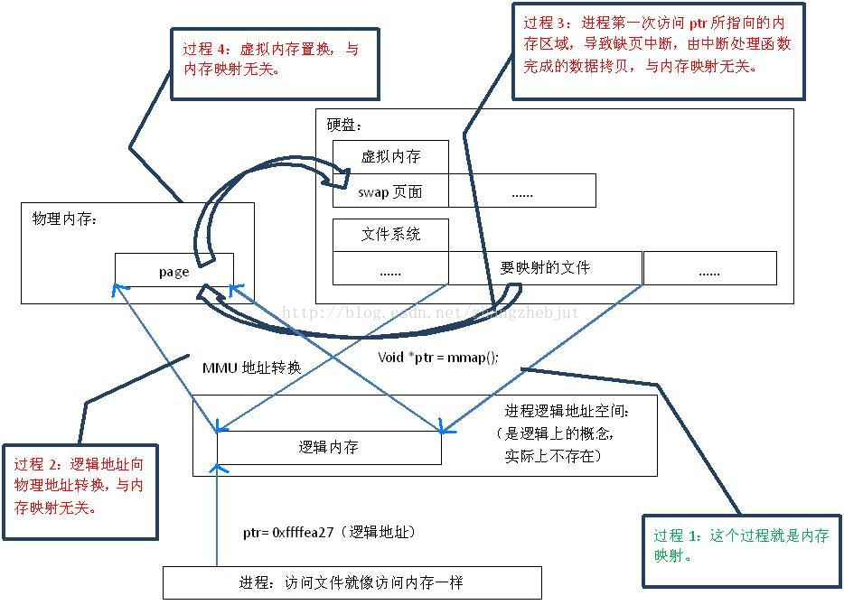
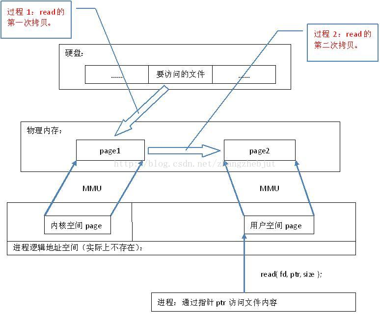

# linux进程通信

## **管道(pipe)**

管道可用于具有亲缘关系进程间的通信，有名管道克服了管道没有名字的限制，因此，除具有管道所具有的功能外，它还允许无亲缘关系进程间的通信。

**实现机制：**

管道是由内核管理的一个缓冲区，相当于我们放入内存中的一个纸条。管道的一端连接一个进程的输出。这个进程会向管道中放入信息。管道的另一端连接一个进程的输入，这个进程取出被放入管道的信息。一个缓冲区不需要很大，它被设计成为**环形的数据结构**，以便管道可以被循环利用。当管道中没有信息的话，从管道中读取的进程会等待，直到另一端的进程放入信息。当管道被放满信息的时候，尝试放入信息的进程会等待，直到另一端的进程取出信息。当两个进程都终结的时候，管道也自动消失。

**实现细节：**

在 Linux 中，管道的实现并没有使用专门的数据结构，而是借助了文件系统的file结构和VFS的索引节点inode。通过将两个 file 结构指向同一个临时的 VFS 索引节点，而这个 VFS 索引节点又指向一个物理页面而实现的。

**关于管道的读写**

管道实现的源代码在fs/pipe.c中，在pipe.c中有很多函数，其中有两个函数比较重要，即管道读函数pipe_read()和管道写函数pipe_wrtie()。管道写函数通过将字节复制到 VFS 索引节点指向的物理内存而写入数据，而管道读函数则通过复制物理内存中的字节而读出数据。当然，内核必须利用一定的机制同步对管道的访问，为此，内核使用了锁、等待队列和信号。当写进程向管道中写入时，它利用标准的库函数write()，系统根据库函数传递的文件描述符，可找到该文件的 file 结构。file 结构中指定了用来进行写操作的函数（即写入函数）地址，于是，内核调用该函数完成写操作。写入函数在向内存中写入数据之前，必须首先检查 VFS 索引节点中的信息，同时满足如下条件时，才能进行实际的内存复制工作：

- 内存中有足够的空间可容纳所有要写入的数据；
- 内存没有被读程序锁定。

如果同时满足上述条件，写入函数首先锁定内存，然后从写进程的地址空间中复制数据到内存。否则，写入进程就休眠在 VFS 索引节点的等待队列中，接下来，内核将调用调度程序，而调度程序会选择其他进程运行。写入进程实际处于可中断的等待状态，当内存中有足够的空间可以容纳写入数据，或内存被解锁时，读取进程会唤醒写入进程，这时，写入进程将接收到信号。当数据写入内存之后，内存被解锁，而所有休眠在索引节点的读取进程会被唤醒。管道的读取过程和写入过程类似。但是，进程可以在没有数据或内存被锁定时立即返回错误信息，而不是阻塞该进程，这依赖于文件或管道的打开模式。反之，进程可以休眠在索引节点的等待队列中等待写入进程写入数据。当所有的进程完成了管道操作之后，管道的索引节点被丢弃，而共享数据页也被释放。

## 命名管道

​        由于基于fork机制，所以管道只能用于父进程和子进程之间，或者拥有相同祖先的两个子进程之间 (有亲缘关系的进程之间)。为了解决这一问题，Linux提供了FIFO方式连接进程。FIFO又叫做命名管道(named PIPE)。FIFO (First in, First out)为一种特殊的文件类型，它在文件系统中有对应的路径。当一个进程以读(r)的方式打开该文件，而另一个进程以写(w)的方式打开该文件，那么内核就会在这两个进程之间建立管道，所以FIFO实际上也由内核管理，不与硬盘打交道。之所以叫FIFO，是因为管道本质上是一个先进先出的队列数据结构，最早放入的数据被最先读出来，从而保证信息交流的顺序。FIFO只是借用了文件系统(file system,命名管道是一种特殊类型的文件，因为Linux中所有事物都是文件，它在文件系统中以文件名的形式存在。)来为管道命名。写模式的进程向FIFO文件中写入，而读模式的进程从FIFO文件中读出。当删除FIFO文件时，管道连接也随之消失。FIFO的好处在于我们可以通过文件的路径来识别管道，从而让没有亲缘关系的进程之间建立连接

### **FIFO读写规则**

1. 从FIFO中读取数据：约定：如果一个进程为了从FIFO中读取数据而阻塞打开了FIFO，那么称该进程内的读操作为设置了阻塞标志的读操作
2. 从FIFO中写入数据：约定：如果一个进程为了向FIFO中写入数据而阻塞打开FIFO，那么称该进程内的写操作为设置了阻塞标志的写操作。

（1）匿名管道:管道是半双工的，数据只能单向通信；需要双方通信时，需要建立起两个管道；只能用于父子进程或者兄弟进程之间（具有亲缘关系的进程）。
 （2）命名管道：可在同一台计算机的不同进程之间或在跨越一个网络的不同计算机的不同进程之间，支持可靠的、单向或双向的数据通信

## 信号

信号是比较复杂的通信方式，用于通知接受进程有某种事件发生，除了用于进程间通信外，进程还可以发送信号给进程本身；大多数信号的默认操作是结束接收信号的进程；然而，一个进程通常可以请求系统采取某些代替的操作，各种代替操作是：

- 忽略信号。随着这一选项的设置，进程将忽略信号的出现。

  有两个信号 不可以被忽略：SIGKILL，它将结束进程；

  SIGSTOP，它是作业控制机制的一部分，将挂起作业的执行。

- 恢复信号的默认操作。

- 执行一个预先安排的信号处理函数。

  进程可以登记特殊的信号处理函数。当进程收到信号时，信号处理函数将像中断服务例程一样被调用，当从该信号处理函数返回时，控制被返回给主程序，并且继续正常执行。

但是，信号和中断有所不同。**中断的响应和处理都发生在内核空间，而信号的响应发生在内核空间，信号处理程序的执行却发生在用户空间。**

那么，什么时候检测和响应信号呢？通常发生在两种情况下：

- 当前进程由于系统调用、中断或异常而进入内核空间以后，从内核空间返回到用户空间前夕；
- 当前进程在内核中进入睡眠以后刚被唤醒的时候，由于检测到信号的存在而提前返回到用户空间。

**信号本质**

信号是在软件层次上对中断机制的一种模拟，在原理上，一个进程收到一个信号与处理器收到一个中断请求可以说是一样的。信号是异步的，一个进程不必通过任何操作来等待信号的到达，事实上，进程也不知道信号到底什么时候到达。信号是进程间通信机制中唯一的异步通信机制，可以看作是异步通知，通知接收信号的进程有哪些事情发生了。

### **关于信号处理机制的原理(内核角度)**

​		内核给一个进程发送软中断信号的方法，是在进程所在的进程表项的信号域设置对应于该信号的位。这里要补充的是，如果信号发送给一个正在睡眠的进程，那么要 看该进程进入睡眠的优先级，如果进程睡眠在可被中断的优先级上，则唤醒进程；否则仅设置进程表中信号域相应的位，而不唤醒进程。这一点比较重要，因为进程检查是否收到信号的时机是：一个进程在即将从内核态返回到用户态时；或者，在一个进程要进入或离开一个适当的低调度优先级睡眠状态时。  内核处理一个进程收到的信号的时机是在一个进程从内核态返回用户态时。所以，当一个进程在内核态下运行时，软中断信号并不立即起作用，要等到将返回用户态时才处理。进程只有处理完信号才会返回用户态，进程在用户态下不会有未处理完的信号。 内核处理一个进程收到的软中断信号是在该进程的上下文中，因此，进程必须处于运行状态。如果进程收到一个要捕捉的信号，那么进程从内核态返回用户态时执行用户定义的函数。而且执行用户定义的函数的方法很巧妙，内核是在用户栈上创建一个新的层，该层中将返回地址的值设置成用户定义的处理函数的地址，这样进程从内核返回弹出栈顶时就返回到用户定义的函数处，从函数返回再弹出栈顶时，才返回原先进入内核的地方，接着原来的地方继续运行。这样做的原因是用户定义的处理函数不能且不允许在内核态下执行（如果用户定义的函数在内核态下运行的话，用户就可以获得任何权限）。

在信号的处理方法中有几点特别要引起注意。

- 在一些系统中，当一个进程处理完中断信号返回用户态之前，内核清除用户区中设定的对该信号的处理例程的地址，即下一次进程对该信号的处理方法又改为默认值，除非在下一次信号到来之前再次使用signal系统调用。这可能会使得进程在调用signal之前又得 到该信号而导致退出。在BSD中，内核不再清除该地址。但不清除该地址可能使得进程因为过多过快的得到某个信号而导致堆栈溢出。为了避免出现上述情况。在 BSD系统中，内核模拟了对硬件中断的处理方法，即在处理某个中断时，阻止接收新的该类中断。 
- 如果要捕捉的信号发生于进程正在一个系统调用中时，并且该进程睡眠在可中断的优先级上（若系统调用未睡眠而是在运行，根据上面的分析，等该系统调用运行完毕后再处理信号），这时该信号引起进程作一次longjmp，跳出睡眠状态，返回用户态并执行信号处理例程。当从信号处理例程返回 时，进程就象从系统调用返回一样，但返回了一个错误如－1，并将errno设置为EINTR，指出该次系统调用曾经被中断。这要注意的是，BSD系统中内 核可以自动地重新开始系统调用，或者手如上面所述手动设置重启。 
- 若进程睡眠在可中断的优先级上，则当它收到一个要忽略的信号时，该进程被唤醒，但不做longjmp，一般是继续睡眠。但用户感觉不 到进程曾经被唤醒，而是象没有发生过该信号一样。所以能够使pause、sleep等函数从挂起态返回的信号必须要有信号处理函数，如果没有什么动作，可以将处理函数设为空。  
- 内核对子进程终止（SIGCLD）信号的处理方法与其他信号有所区别。当进程正常或异常终止时，内核都向其父进程发一个SIGCLD 信号，缺省情况下，父进程忽略该信号，就象没有收到该信号似的，如果父进程希望获得子进程终止的状态，则应该事先用signal函数为SIGCLD信号设 置信号处理程序，在信号处理程序中调用wait。SIGCLD信号的作用是唤醒一个睡眠在可被中断优先级上的进程。如果该进程捕捉了这个信号，就象普通信号处理一样转到处理例程。如果进程忽略该信号，则 什么也不做。其实wait不一定放在信号处理函数中，但这样的话因为不知道子进程何时终止，在子进程终止前，wait将使父进程挂起休眠。

## 进程-IPC 共享内存 (三)

共享内存指多个进程共享同一块物理内存,它只能用于同一台机器上的两个进程之间的通信。在进程的逻辑地址空间中有一段地址范围是用来进行内存映射使用的，该段逻辑地址空间可以映射到共享的物理内存地址上。

大多数共享内存的具体实现，都是把由不同进程之间共享的内存映射为同一段物理内存。 多个进程都把该物理内存区域映射到自己的虚拟地址空间，这些进程就都可以直接访问该共享内存区域，从而可以通过该区域进行通信。共享内存允许两个不相关的进程访问同一段物理内存， 由于数据不需要在不同的进程间复制，所以它是在两个正在运行的进程之间传递数据的一种非常有效的方式，一个进程向共享内存区域写入数据，共享该区域的所有进程就可以立刻看到其中的数据内容。

共享内存允许一个或多个进程通过同时出现在它们虚拟地址空间中的内存来通讯,此虚拟内存的页面出现在每个共享进程页表中。但此页面并不一定位于所有共享进程虚拟内存的相同位置。每个新创建的共享内存区域由一个`shmid_ds`数据结构来表示。它们被保存在`shm_segs`数组中。 `shmid_ds`数据结构描叙共享内存的大小，进程如何使用以及共享内存映射到其各自地址空间的方式。由共享内存创建者控制对此内存的存取权限以及其键是公有还是私有。如果它由足够权限，它还可以将此共享内存加载到物理内存中。

每个使用此共享内存的进程必须通过系统调用将其连接到虚拟内存上。这时进程创建新的`vm_area_struct`来描叙此共享内存。进程可以决定此共享内存在其虚拟地址空间的位置，或者让Linux选择一块足够大的区域。 新的`vm_area_struct`结构将被放到由`shmid_ds`指向的`vm_area_struct`链表中。通过`vm_next_share`d和`vm_prev_shared` 指针将它们连接起来。虚拟内存在连接时并没有创建,进程访问它时才创建。

当进程首次访问共享虚拟内存中的页面时将产生缺页错误。当取回此页面后，Linux找到了描叙此页面的`vm_area_struct`数据结构。它包含指向使用此种类型虚拟内存的处理函数地址指针。共享内存页面错误处理代码将在此`shmid_ds`对应的页表入口链表中寻找是否存在此共享虚拟内存页面。如果不存在，则它将分配物理页面并为其创建页表入口。同时还将它放入当前进程的页表中，此入口被保存在`shmid_ds`结构中。这意味着下个试图访问此内存的进程还会产生页面错误，共享内存错误处理函数将为此进程使用其新创建的物理页面。这样，第一个访问虚拟内存页面的进程创建这块内存，随后的进程把此页面加入到各自的虚拟地址空间中。

当进程不再共享此虚拟内存时，进程和共享内存的连接将被断开。如果其它进程还在使用这个内存，则此操作只影响当前进程。其对应的`vm_area_struct`结构将从`shmid_ds`结构中删除并回收。当前进程对应此共享内存地址的页表入口也将被更新并置为无效。当最后一个进程断开与共享内存的连接时，当前位于物理内存中的共享内存页面将被释放，同时释放的还有此共享内存的`shmid_ds`结构。

## 消息队列

消息队列用于运行于同一台机器上的进程间通信，它和管道很相似。消息队列提供了一种在两个不相关的进程之间传递数据的相当简单而且有效的方法，与命名管道相比，消息队列的优势在于，它独立于发送和接收进程而存在，这消除了在同步命名管道的打开和关闭时产生的一些困难。通过使用消息队列，发送消息时几乎可以完全避免命名管道的同步和阻塞问题，不再需要进程来提供同步方法，而且还可以用一些方法提前查看紧急消息。与管道一样，使用消息队列的限制是，每个数据块都有一个最大长度限制，系统中所有队列所包含的全部数据块的总长度也有一个上限。

消息队列就是一个消息的链表。可以把消息看作一个个记录或者报文，这些记录具有特定的格式以及特定的优先级。对消息队列有写权限的进程可以向其中按照一定的规则添加新消息；对消息队列有读权限的进程则可以从消息队列中读走消息。每个消息的最大长度有一个上限值，由MSGMAX定义，每个消息队列的总的字节数有上限制，由MSGMNB定义，系统中消息队列总数有一个上限值，由MSGMNI定义。

Linux采用消息队列的方式来实现消息传递。这种消息的发送方式是：发送方不必等待接收方检查它所收到的消息就可以继续工作下去，而接收方如果没有收到消息也不需等待。新的消息总是放在队列的末尾，接收的时候并不总是从头来接收，可以从中间来接收。虽然这种通信机制相对简单，但是应用程序使用起来就需要使用相对复杂的方式来应付了。

消息队列是随内核持续的并和进程相关，只有在内核重起或者显示删除一个消息队列时，该消息队列才会真正被删除。因此系统中记录消息队列的数据结构 (`struct ipc_ids msg_ids`) 位于内核中，系统中的所有消息队列都可以在结构msg_ids中找到访问入口。

每次进程试图向写入队列写入消息时，系统将把其有效用户和组标志符与此队列的`ipc_perm`结构中的模式进行比较。如果允许写入操作，则把此消息从此进程的地址空间拷贝到msg数据结构中，并放置到此消息队列尾部。由于 Linux严格限制可写入消息的个数和长度，队列中可能容纳不下这个消息。此时，此写入进程将被添加到这个消息队列的等待队列中，同时调用调度管理器选择新进程运行。当由消息从此队列中释放时，该进程将被唤醒。

从队列中读的过程与之类似。进程对这个写入队列的访问权限将被再次检验。读取进程将选择队列中第一个消息（不管是什么类型）或者第一个某特定类型的消息。如果没有消息可以满足此要求，读取进程将被添加 到消息队列的读取等待队列中，然后系统运行调度管理器。当有新消息写入队列时，进程将被唤醒继续执行。

### 优点

可以通过发送消息来几乎完全避免命名管道的同步和阻塞问题。可以用一些方法来提前查看紧急消息。

## 套接字

套接字是一种通信机制，凭借这种机制客户/服务器系统的开发工作既可以在本地单机上进行，也可以跨网络进行。

对于服务端来说

1. 服务器进程使用系统调用socket来创建一个套接字，它是系统分配给该服务器进程的类似文件描述符的资源，不能与其它进程共享。
2. 服务器进程使用系统调用bind来给套接字起个名字。本地套接字的名字是Linux文件系统中的文件名，一般放在/tmp或/usr/tmp目录中。对于网络套接字，它的名字是与客户端连接的特定网络有关的服务标识符(端口号或访问点)。这个标识符允许Linux将进入的针对特定端口号的连接转到正确的服务器进程。例如，Web服务器一般在80端口上创建一个套接字，它是一个专门用于此目的的标识符。而Web客户端(比如：浏览器)知道对于用户想要访问的Web的站点应该使用端口号80来建立http连接。
3. 服务器进程使用系统调用listen创建一个队列并将其用于存放来自客户的进入连接。此时，服务端开始等待客户端的连接。
4. 服务器进程使用系统调用accept接受客户端的连接。在调用accept时，它会创建一个与原来的命名套接字不同的新的套接字。这个新套接字只用于与这个特定的客户端进行通信，而命名套接字则被保留下来继续处理来自其它客户的连接。

对于客户端来说

1. 基于套接字系统的客户端更加简单，客户首先调用socket创建一个未命名的套接字。
2. 然后将服务器的命名套接字作为一个地址来调用connect与服务端建立连接。
3. 一旦建立连接，就可以像是使用底层的文件描述符那样用套接字来实现双向的数据通信。
4. 在使用完后双方调用close来关闭连接

## 进程-IPC 信号和信号量

信号是进程之间互相传递消息的一种方法，信号全称为软中断信号，也可称为软中断，它是实现IPC的方法之一。

信号是UNIX和Linux系统响应某些条件而产生的一个事件。进程之间可以互相通过系统调用kill发送软中断信号。内核也可以因为内部事件而给进程发送信号，通知进程发生了某个事件。

注:信号只是简单用来通知某进程发生了什么事件，并不给该进程传递任何数据。

信号量(semphore)用于管理对资源的访问，程序中存在着一部分临界代码，需要确保只有一个进程(或一个执行线程)可以进入这个临界代码并拥有对资源独占式的访问权。为了防止出现因多个程序同时访问一个共享资源而引发的问题，需要一种方法，它可以通过生成并使用令牌来授权，在任一时刻只能有一个执行进程的线程来访问代码临界区域（临界区域是指执行数据更新的代码需要独占式地执行）。

## Linux - 内存映射

Linux系统利用已有的存储管理机制可以很自然的实现进程间的共享存储。对于一段物理存储空间,只需通过进程的 虚存管理机构 就可以映射到各自的3G用户地址空间中。通过这种映射,在不同进程看来“私有”的数据事实上是同一段内存单元,它们被这些不同的进程所共享。   

​		在Linux系统实际运行时,内存中的页面要经常被换入或换出,共享存储区中的页面也不例外。一般而言,内存页面的换入/换出过程采用两种方式进行:

​		普通页面因长时间未得到访问而被内核线程kswaps在系统空闲而得到调度时换出内存到磁盘上的页面交换区,或因为进程访问的页面不在内存引起缺页从而将曾被换出到页面交换区的页面重新换入。

​		针对某个被打开的磁盘文件在内存中的页缓冲,在内资源不足而需要增加空闲页面时,由内核线程bdflush在系统空闲而得到调度时按照LRU算法将“脏”页面写回磁盘文件以回收空闲页面(或由用户强制“刷出”页面),或者因进程所读文件某段数据不在内存而启动磁盘IO读文件数据到内存中的文件缓冲区。

### 内存映射原理

​		“映射” 主要是指 硬盘上文件 的位置与进程 逻辑地址空间 中一块大小相同的区域之间的一一对应，如下图所示。这种对应关系纯属是逻辑上的概念，物理上是不存在的，原因是进程的逻辑地址空间本身就是不存在。在内存映射的过程中，并没有实际的数据拷贝，文件没有被载入内存，只是逻辑上被放入了内存，具体到代码，就是建立并初始化了相关的数据结构（struct address_space），这个过程有系统调用mmap()实现，所以建立内存映射的效率很高。

​		 mmap()会返回一个指针ptr，它指向进程逻辑地址空间中的一个地址，这样以后，进程无需再调用read或write对文件进行读写，而只需要通过ptr就能够操作文件。但是ptr所指向的是一个逻辑地址，要操作其中的数据，必须通过MMU将逻辑地址转换成物理地址，如上图过程2所示

​		建立内存映射并没有实际拷贝数据，这时，MMU在地址映射表中是无法找到与ptr相对应的物理地址的，也就是MMU失败，将产生一个缺页中断，缺页中断的中断响应函数会在swap中寻找相对应的页面，如果找不到（也就是该文件从来没有被读入内存的情况），则会通过mmap()建立的映射关系，从硬盘上将文件读取到物理内存中，如上图过程3所示。

如果在拷贝数据时，发现物理内存不够用，则会通过虚拟内存机制（swap）将暂时不用的物理页面交换到硬盘上，如上图过程4所示。

在Linux系统中,设计mmap()系统调用的本意是提高文件操作的效率。通过mmap(), 进程可以把一个文件的内容映射到它的虚存空间并以访问内存的方式实现文件的读写操作,这为文件读写提供了极大的方便；使用mmap对于设备文件，最大的优点就是用户空间可以直接访问设备内存；普通文件被映射到进程地址空间后，进程进程访问文件的速度也变快，不必再调read()，write（）等系统调用,可以用memcpy,strcpy等操作写文件,写完后用msync()同步一下。mmap()的这种能力用于显示适配器一类的设备，屏幕帧的像素不再需要从一个用户空间到内核空间的复制过程。

### 为什么mmap效率比read高

​		从代码层面上看，从硬盘上将文件读入内存，都要经过文件系统进行数据拷贝，并且数据拷贝操作是由文件系统和硬件驱动实现的，理论上来说，拷贝数据的效率是一样的。但是通过内存映射的方法访问硬盘上的文件，效率要比read和write系统调用高，这是为什么呢？原因是read()是系统调用，其中进行了数据拷贝，它首先将文件内容从硬盘拷贝到内核空间的一个缓冲区，如下图过程1，然后再将这些数据拷贝到用户空间，如 下 图中过程2，在这个过程中，实际上完成了 两次数据拷贝 ；而mmap()也是系统调用，如前所述，mmap()中没有进行数据拷贝，真正的数据拷贝是在缺页中断处理时进行的，由于mmap()将文件直接映射到用户空间，所以中断处理函数根据这个映射关系，直接将文件从硬盘拷贝到用户空间，只进行了 一次数据拷贝 。因此，内存映射的效率要比read/write效率高。 

## IPC小结

- 管道( pipe )：管道是一种半双工的通信方式，数据只能单向流动，而且只能在具有亲缘关系的进程间使用，进程的亲缘关系通常是指父子进程关系。 有名管道 (FIFO or named pipe) ： 有名管道也是半双工的通信方式，但是它允许无亲缘关系进程间的通信。
- 信号量( semophore ) ： 信号量是一个计数器，可以用来控制多个进程对共享资源的访问。它常作为一种锁机制，防止某进程正在访问共享资源时，其它进程也访问该资源。因此，主要作为进程间以及同一进程内不同线程之间的同步手段。
- 信号 ( sinal ) ： 信号是一种比较复杂的通信方式，用于通知接收进程某个事件已经发生。
- 共享内存( shared memory ) ：共享内存就是映射一段能被其它进程所访问的内存，这段共享内存由一个进程创建，但多个进程都可以访问。共享内存是最快的IPC方式，它是针对其它进程间通信方式运行效率低而专门设计的。它往往与其他通信机制，如信号量，配合使用，来实现进程间的同步和通信。
- 消息队列( message queue ) ： 消息队列是由消息的链表，存放在内核中并由消息队列标识符标识。消息队列克服了信号传递信息少、管道只能承载无格式字节流以及缓冲区大小受限等缺点。但是消息队列和管道的使用都会受到系统的限制(包括创建个数、传递消息的长度等)。
- 套接字( socket ) ： 套接字也是一种进程间通信机制，与其它通信机制最大的不同的是，它可用于不同机器间的进程通信。

