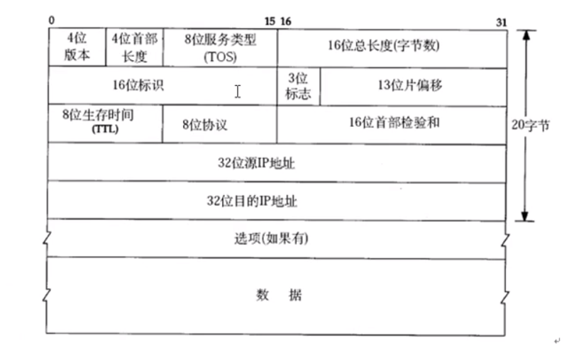
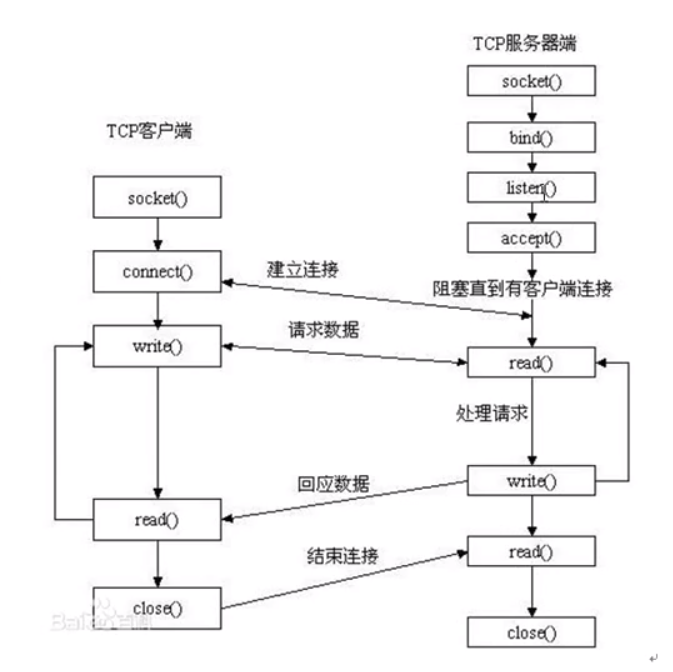

# 网络编程

IP协议格式

## 网络模型

|                             | 优点                                               | 缺点                                   |
| --------------------------- | -------------------------------------------------- | -------------------------------------- |
| c/s模型结构：client-server  | 缓存大量数据，可以自定义协议，协议选择灵活，速度快 | 安全性低，需要开发客户端以及服务端     |
| b/s模型结构：browser-server | 安全性高，可以跨平台，开发工作量小                 | 不能缓存大量数据，必须严格遵守http协议 |

IP地址在网络中表示唯一一台助记

端口号在主机中，唯一标识一个进程

ip地址+端口号在网络中唯一标识一个进程

### 网络套接字

在通信模型中，套接字必定是成对出现的，一段的发送缓冲区对应对端的接收缓冲区，一个文件描述符指向一个套接字，该套接字内部由内核借助两个缓冲区实现

### 网络字节序

小端法：高位存高地址，低位存低地址——计算机inter架构

大端法：高位存低地址，低位存高地址——网络数据传输

相应的转换函数

1. htonl：转换32位整型到网络字节序
2. htons：转换端口
3. ntohl：从网络转为本地字节(ip)
4. ntohs：从网络转为本地字节(port)

### IP地址转换函数

int_pton函数：传入IP地址(点分字节序)，输出网络字节序下的ip地址

inet_ntop函数：将网络字节序下的ip地址转换为本地字节序下的ip，为一个string

### socket编程的模型结构

#### sockaddr地址结构

>  struct sockaddr_in addr;
>
> addr.sin_family = AF_INET/AF_INET6
>
> addr.sin_port = htons(9527);
>
> addr.sin_addr.s_addr = dst
>
> bind(fd,(struct sockaddr *)&addr,size)

#### 主要函数

##### bind函数

> int bind(int sockfd,const struct sockaddr * addr,socklen_t addrlen)

给socket绑定一个地址结构

##### listen函数

设置同时与服务器建立连接的上线数，同时进行3次握手的连接数量

##### accept函数

> int accept(int sockfd,struct sockaddr *addr,socklen_t  *addrlen)

阻塞等待客户端建立连接，成功的话，返回一个与客户端成功建立连接的socket文件描述符

sockfd:socket函数返回值

addr：传出参数，成功与服务器建立连接的客户端的地址结构

addrlen:传入传出参数，入：addr大小，出：客户端addr实际大小

##### connect函数

> int socket(int sockfd,const sockaddr *addr,socklen_t addrlen)

sockfd:socket函数返回值

addr：传入参数，服务器地址结构

addrlen：服务器的地址结构大小