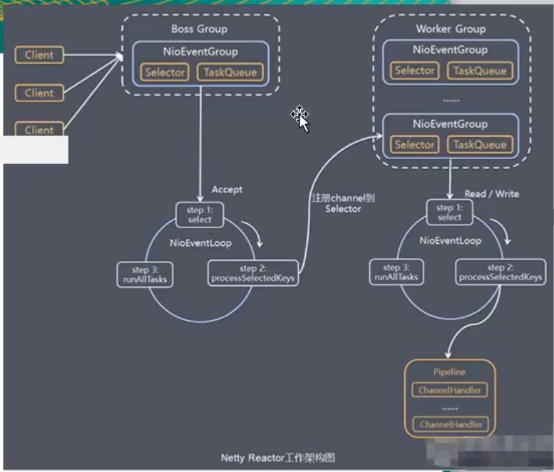

# NETTY

## [NIO空轮询bug](https://www.cnblogs.com/jayit/p/8241634.html)

epoll bug，它会导致Selector空轮询，最终导致CPU 100%。

因为selector的select方法，返回numKeys是0，所以下面本应该对key值进行遍历的事件处理根本执行不了，又回到最上面的while(true)循环，循环往复，不断的轮询，直到linux系统出现100%的CPU情况，其它执行任务干不了活，正常情况下如果没有事件处理应该是阻塞的，具体发生的原因与操作系统有关——在部分Linux的2.6的kernel中，poll和epoll对于突然中断的连接socket会对返回的eventSet事件集合置为POLLHUP，也可能是POLLERR，eventSet事件集合发生了变化，这就可能导致Selector会被唤醒。

netty的解决办法——

异步，基于事件驱动的网络应用框架，用来开发网络IO程序，主要针对TCP协议下Client端的高并发应用

1. RPC框架应用
2. dubbo里面——默认使用netty作为基础通信组件
3. hadoop

## Reactor和Preactor

#### 在Reactor中实现读——IO多路复用模式

- 注册读就绪事件和相应的事件处理器。
- 事件分发器等待事件。
- 事件到来，激活分发器，分发器调用事件对应的处理器。
- 事件处理器完成实际的读操作，处理读到的数据，注册新的事件，然后返还控制权。

#### 在Proactor中实现读：

- 处理器发起异步读操作（注意：操作系统必须支持异步IO）。在这种情况下，处理器无视IO就绪事件，它关注的是完成事件。
- 事件分发器等待操作完成事件。
- 在分发器等待过程中，操作系统利用并行的内核线程执行实际的读操作，并将结果数据存入用户自定义缓冲区，最后通知事件分发器读操作完成。
- 事件分发器呼唤处理器。
- 事件处理器处理用户自定义缓冲区中的数据，然后启动一个新的异步操作，并将控制权返回事件分发器。

Reactor模式是基于同步I/O的，而Proactor模式是和异步I/O相关的。在Reactor模式中，事件分发器等待某个事件或者可应用或个操作的状态发生（比如文件描述符可读写，或者是socket可读写），事件分发器就把这个事件传给事先注册的事件处理函数或者回调函数，由后者来做实际的读写操作。

而在Proactor模式中，事件处理者（或者代由事件分发器发起）直接发起一个异步读写操作（相当于请求），而实际的工作是由操作系统来完成的。发起时，需要提供的参数包括用于存放读到数据的缓存区、读的数据大小或用于存放外发数据的缓存区，以及这个请求完后的回调函数等信息。事件分发器得知了这个请求，它默默等待这个请求的完成，然后转发完成事件给相应的事件处理者或者回调。

## 通道Channel

与流类似，但是channel可以双向操作，而stream只能单向操作，java里面stream内置了一个channel属性

### FileChannel

对本地文件进行IO操作，read从通道读取数据到缓冲区，write从缓存区向通道写入数据

### Buffer缓冲

buffer具有BufferUnderFlowException，从buffer中读取数据超过界限就会报错，buffer可以设置为一个只读的buffer，这样就只可以从中读取数据，不能够添加数据。

#### MapperByteBuffer

可以让文件在堆外内存进行修改，不需要操作系统再拷贝一次

## 零拷贝

[深入剖析Linux IO原理和几种零拷贝机制的实现](https://juejin.im/post/6844903949359644680)

零拷贝与网络编程的优化有关，常用的零拷贝有mmap(内存映射)和sendFile

传统IO的拷贝过程


拷贝的过程为硬件驱动——内核缓冲区——用户缓冲区——socket缓冲区——协议栈

共涉及到 2 次 CPU 拷贝、2 次 DMA 拷贝总共 4 次拷贝，以及 4 次上下文切换，

其中DMA表示直接内存拷贝

直接内存拷贝：

DMA 的全称叫直接内存存取（Direct Memory Access），是一种允许外围设备（硬件子系统）直接访问系统主内存的机制。也就是说，基于 DMA 访问方式，系统主内存于硬盘或网卡之间的数据传输可以绕开 CPU 的全程调度。目前大多数的硬件设备，包括磁盘控制器、网卡、显卡以及声卡等都支持 DMA 技术。整个数据传输操作在一个 DMA 控制器的控制下进行的。CPU 除了在数据传输开始和结束时做一点处理外（开始和结束时候要做中断处理），在传输过程中 CPU 可以继续进行其他的工作。这样在大部分时间里，CPU 计算和 I/O 操作都处于并行操作，使整个计算机系统的效率大大提高。

有了 DMA 磁盘控制器接管数据读写请求以后，CPU 从繁重的 I/O 操作中解脱，数据读取操作的流程如下：

1. 用户进程向 CPU 发起 read 系统调用读取数据，由用户态切换为内核态，然后一直阻塞等待数据的返回。
2. CPU 在接收到指令以后对 DMA 磁盘控制器发起调度指令。
3. DMA 磁盘控制器对磁盘发起 I/O 请求，将磁盘数据先放入磁盘控制器缓冲区，CPU 全程不参与此过程。
4. 数据读取完成后，DMA 磁盘控制器会接受到磁盘的通知，将数据从磁盘控制器缓冲区拷贝到内核缓冲区。
5. DMA 磁盘控制器向 CPU 发出数据读完的信号，由 CPU 负责将数据从内核缓冲区拷贝到用户缓冲区。
6. 用户进程由内核态切换回用户态，解除阻塞状态，然后等待 CPU 的下一个执行时间钟。

### 用户态直接IO

用户态直接 I/O 使得应用进程或运行在用户态（user space）下的库函数直接访问硬件设备，数据直接跨过内核进行传输，内核在数据传输过程除了进行必要的虚拟存储配置工作之外，不参与任何其他工作，这种方式能够直接绕过内核，极大提高了性能。


用户态直接 I/O 只能适用于不需要内核缓冲区处理的应用程序，这些应用程序通常在进程地址空间有自己的数据缓存机制，称为自缓存应用程序，如数据库管理系统就是一个代表。其次，这种零拷贝机制会直接操作磁盘 I/O，由于 CPU 和磁盘 I/O 之间的执行时间差距，会造成大量资源的浪费，解决方案是配合异步 I/O 使用。

### mmap

一种零拷贝方式是使用 mmap + write 代替原来的 read + write 方式，减少了 1 次 CPU 拷贝操作。mmap 是 Linux 提供的一种内存映射文件方法，即将一个进程的地址空间中的一段虚拟地址映射到磁盘文件地址，mmap + write 的伪代码如下：

使用 mmap 的目的是将内核中读缓冲区（read buffer）的地址与用户空间的缓冲区（user buffer）进行映射，从而实现内核缓冲区与应用程序内存的共享，省去了将数据从内核读缓冲区（read buffer）拷贝到用户缓冲区（user buffer）的过程，然而内核读缓冲区（read buffer）仍需将数据到内核写缓冲区（socket buffer），大致的流程如下图所示：


基于 mmap + write 系统调用的零拷贝方式，整个拷贝过程会发生 4 次上下文切换，1 次 CPU 拷贝和 2 次 DMA 拷贝，用户程序读写数据的流程如下：

1. 用户进程通过 mmap() 函数向内核（kernel）发起系统调用，上下文从用户态（user space）切换为内核态（kernel space）。
2. 将用户进程的内核空间的读缓冲区（read buffer）与用户空间的缓存区（user buffer）进行内存地址映射。
3. CPU利用DMA控制器将数据从主存或硬盘拷贝到内核空间（kernel space）的读缓冲区（read buffer）。
4. 上下文从内核态（kernel space）切换回用户态（user space），mmap 系统调用执行返回。
5. 用户进程通过 write() 函数向内核（kernel）发起系统调用，上下文从用户态（user space）切换为内核态（kernel space）。
6. CPU将读缓冲区（read buffer）中的数据拷贝到的网络缓冲区（socket buffer）。
7. CPU利用DMA控制器将数据从网络缓冲区（socket buffer）拷贝到网卡进行数据传输。
8. 上下文从内核态（kernel space）切换回用户态（user space），write 系统调用执行返回。

#### mmap优缺点

mmap 主要的用处是提高 I/O 性能，特别是针对大文件。对于小文件，内存映射文件反而会导致碎片空间的浪费，因为内存映射总是要对齐页边界，最小单位是 4 KB，一个 5 KB 的文件将会映射占用 8 KB 内存，也就会浪费 3 KB 内存。

### sendfile

sendfile 系统调用在 Linux 内核版本 2.1 中被引入，目的是简化通过网络在两个通道之间进行的数据传输过程。sendfile 系统调用的引入，不仅减少了 CPU 拷贝的次数，还减少了上下文切换的次数。通过 sendfile 系统调用，数据可以直接在内核空间内部进行 I/O 传输，从而省去了数据在用户空间和内核空间之间的来回拷贝。与 mmap 内存映射方式不同的是， sendfile 调用中 I/O 数据对用户空间是完全不可见的。也就是说，这是一次完全意义上的数据传输过程。


基于 sendfile 系统调用的零拷贝方式，**整个拷贝过程会发生 2 次上下文切换（要会）**，1 次 CPU 拷贝和 2 次 DMA 拷贝，用户程序读写数据的流程如下：

1. 用户进程通过 sendfile() 函数向内核（kernel）发起系统调用，上下文从用户态（user space）切换为内核态（kernel space）。
2. CPU 利用 DMA 控制器将数据从主存或硬盘拷贝到内核空间（kernel space）的读缓冲区（read buffer）。
3. CPU 将读缓冲区（read buffer）中的数据拷贝到的网络缓冲区（socket buffer）。
4. CPU 利用 DMA 控制器将数据从网络缓冲区（socket buffer）拷贝到网卡进行数据传输。
5. 上下文从内核态（kernel space）切换回用户态（user space），sendfile 系统调用执行返回。

相比较于 mmap 内存映射的方式，sendfile 少了 2 次上下文切换，但是仍然有 1 次 CPU 拷贝操作。**sendfile 存在的问题是用户程序不能对数据进行修改，而只是单纯地完成了一次数据传输过程。**

### sendfile + DMA gather copy

Linux 2.4 版本的内核对 sendfile 系统调用进行修改，为  DMA 拷贝引入了 gather 操作。它将内核空间（kernel space）的读缓冲区（read buffer）中对应的数据描述信息（内存地址、地址偏移量）记录到相应的网络缓冲区（ socket  buffer）中，由 DMA 根据内存地址、地址偏移量将数据批量地从读缓冲区（read buffer）拷贝到网卡设备中，这样就省去了内核空间中仅剩的 1 次 CPU 拷贝操作，

在硬件的支持下，sendfile 拷贝方式不再从内核缓冲区的数据拷贝到 socket 缓冲区，取而代之的仅仅是缓冲区文件描述符和数据长度的拷贝，这样 DMA 引擎直接利用 gather 操作将页缓存中数据打包发送到网络中即可，本质就是和虚拟内存映射的思路类似。


基于 sendfile + DMA gather copy 系统调用的零拷贝方式，整个拷贝过程会发生 2 次上下文切换、0 次 CPU 拷贝以及 2 次 DMA 拷贝，用户程序读写数据的流程如下：

1. 用户进程通过 sendfile() 函数向内核（kernel）发起系统调用，上下文从用户态（user space）切换为内核态（kernel space）。
2. CPU 利用 DMA 控制器将数据从主存或硬盘拷贝到内核空间（kernel space）的读缓冲区（read buffer）。
3. CPU 把读缓冲区（read buffer）的文件描述符（file descriptor）和数据长度拷贝到网络缓冲区（socket buffer）。
4. 基于已拷贝的文件描述符（file descriptor）和数据长度，CPU 利用 DMA 控制器的 gather/scatter 操作直接批量地将数据从内核的读缓冲区（read buffer）拷贝到网卡进行数据传输。
5. 上下文从内核态（kernel space）切换回用户态（user space），sendfile 系统调用执行返回。

sendfile + DMA gather copy 拷贝方式同样存在用户程序不能对数据进行修改的问题，而且本身需要硬件的支持，它只适用于将数据从文件拷贝到 socket 套接字上的传输过程。

### splice

splice 系统调用可以在内核空间的读缓冲区（read buffer）和网络缓冲区（socket buffer）之间建立管道（pipeline），从而避免了两者之间的 CPU 拷贝操作。


基于 splice 系统调用的零拷贝方式，整个拷贝过程会发生 2 次上下文切换，0 次 CPU 拷贝以及 2 次 DMA 拷贝，用户程序读写数据的流程如下：

1. 用户进程通过 splice() 函数向内核（kernel）发起系统调用，上下文从用户态（user space）切换为内核态（kernel space）。
2. CPU 利用 DMA 控制器将数据从主存或硬盘拷贝到内核空间（kernel space）的读缓冲区（read buffer）。
3. CPU 在内核空间的读缓冲区（read buffer）和网络缓冲区（socket buffer）之间建立管道（pipeline）。
4. CPU 利用 DMA 控制器将数据从网络缓冲区（socket buffer）拷贝到网卡进行数据传输。
5. 上下文从内核态（kernel space）切换回用户态（user space），splice 系统调用执行返回。

splice 拷贝方式也同样存在用户程序不能对数据进行修改的问题。除此之外，它使用了 Linux 的管道缓冲机制，可以用于任意两个文件描述符中传输数据，但是它的两个文件描述符参数中有一个必须是管道设备。

### 写时复制

在某些情况下，内核缓冲区可能被多个进程所共享，如果某个进程想要这个共享区进行 write 操作，由于 write 不提供任何的锁操作，那么就会对共享区中的数据造成破坏，写时复制的引入就是 Linux 用来保护数据的。

写时复制指的是当多个进程共享同一块数据时，如果其中一个进程需要对这份数据进行修改，那么就需要将其拷贝到自己的进程地址空间中。这样做并不影响其他进程对这块数据的操作，每个进程要修改的时候才会进行拷贝，所以叫写时拷贝。这种方法在某种程度上能够降低系统开销，如果某个进程永远不会对所访问的数据进行更改，那么也就永远不需要拷贝。

### 缓冲区共享

缓冲区共享方式完全改写了传统的 I/O 操作，因为传统 I/O 接口都是基于数据拷贝进行的，要避免拷贝就得去掉原先的那套接口并重新改写，所以这种方法是比较全面的零拷贝技术，目前比较成熟的一个方案是在 Solaris 上实现的 fbuf（Fast Buffer，快速缓冲区）。


##  Java NIO零拷贝实现

在 Java NIO 中的通道（Channel）就相当于操作系统的内核空间（kernel space）的缓冲区，而缓冲区（Buffer）对应的相当于操作系统的用户空间（user space）中的用户缓冲区（user buffer）。

- 通道（Channel）是全双工的（双向传输），它既可能是读缓冲区（read buffer），也可能是网络缓冲区（socket buffer）。
- 缓冲区（Buffer）分为堆内存（HeapBuffer）和堆外内存（DirectBuffer），这是通过 malloc() 分配出来的用户态内存。

堆外内存（DirectBuffer）在使用后需要应用程序手动回收，而堆内存（HeapBuffer）的数据在 GC 时可能会被自动回收。因此，在使用 HeapBuffer 读写数据时，为了避免缓冲区数据因为 GC 而丢失，NIO 会先把 HeapBuffer 内部的数据拷贝到一个临时的 DirectBuffer 中的本地内存（native memory），这个拷贝涉及到 sun.misc.Unsafe.copyMemory() 的调用，背后的实现原理与 memcpy() 类似。 最后，将临时生成的 DirectBuffer 内部的数据的内存地址传给 I/O 调用函数，这样就避免了再去访问 Java 对象处理 I/O 读写。

### 使用直接内存的问题

1. 堆外内存难以控制，如果内存泄漏，那么很难排查（VisualVM可以通过安装插件来监控堆外内存）。
2. 堆外内存只能通过序列化和反序列化来存储，保存对象速度比堆内存慢，不适合存储很复杂的对象。一般简单的对象或者扁平化的比较适合。
3. 直接内存的访问速度（读写方面）会快于堆内存。在申请内存空间时，堆内存速度高于直接内存。

直接内存适合申请次数少，访问频繁的场合。如果内存空间需要频繁申请，则不适合直接内存。

## netty架构设计

1. 传统阻塞IO服务模型、reactor模式
2. 根据reactor的数量和处理资源池线程的数量不同，有3中处理模式
   1. 单reator——编程简单，但是使用场景有限，无法发挥多CPU的优势
   2. 单reactor多线程——利用多核CPU的处理能力，但是需要处理线程的同步问题
   3. 主从reactor多线程——每一个reactor只负责一个注册事件，同时可以有很多个子reactor起到负载均衡的作用
3. netty线程模式——基于主从reactor模型做了改进

### netty模型——主从reactors[简单版]

BossGroup和workerGroup，其中BossGroup只负责建立连接，并且将时间注册到workerGroup中，而workerGroup则负责进行数据的读取等

### netty模型——主从reactors[进阶版]

BossGroup和workerGroup中都是多线程的

### netty模型——完整的模型



1. netty抽象出两组线程池BossGroup专门负责接收客户端的连接，workerGroup专门负责网络的读写
2. BossGroup和WorkerGroup类型都是NioEventLoopGroup
3. NioEventLoopGroup相当于一个事件循环组，这个组中含有多个事件循环，每一个事件循环是NioEventLoop
4. NioEVentLoop表示一个不断循环的执行处理认为u的线程，每个NioEventLoop都有一个selector，用于监听绑定在其上的socket的网络通信
5. NioEventLoopGroup可以有多个线程，即可以含有多个NioEventLoop
6. 每个BossNioEventLoop执行的步骤有3步
   1. 轮询accept事件
   2. 处理accept事件，与client建立连接，生成socketChannel，并注册到某个worker的selector上
   3. 处理任务队列的任务
7. 每个workerNIoEventLoop循环执行的步骤
   1. 轮询read，write事件
   2. 处理i/o事件，即read，write事件，在对应NiosocketChannel
   3. 处理任务队列的任务——异步执行，提交到channel的eventgroup中 
8. 每个worker处理任务时，会使用管道，每个管道中包含了channel

## netty编程过程

1. 创建bossGroup和workerGroup
2. 创建服务器端的启动对象，并设置其线程组(就是上面的两个group)，设置channel作为通道的实现，一般传入一个class对象，设置线程队列得到的连接个数，设置保持活动连接状态，设置处理器(channelInitializer对象)
3. 绑定端口，并得到一个channelFuture对象，（客户端调用connect）
4. 对关闭通道进行监听，指的是当关闭通道的事件发生时，就会执行
5. 编写一个handler，继承自netty提供的handler，处理网络读写事件，实现三个方法
6. 注意group需要关闭

## 异步模型

异步指一个异步过程调用发出后，调用者不能立刻得到结果，实际处理这个调用的组件在完成后，通过状态，通知和回调来通知调用者，调用者并不能立刻得到结果，而是通过future_listener机制，用户可以方便的主动获取或者通过通知机制获得IO操作结果，

使用异步模型的方式是为future注册一个监听器，由监听器来监听关心的事件

## Bytebuf

属于unpooled的数据容器 ，作为一个数据缓冲区，与NIO的buffer相比，不需要进行flip操作，就可以执行读写操作，内部有readIndex和writeIndex两个属性保证读写正确性。

## netty心跳检测机制

心跳检测机制用于维护客户端，服务端之间的连接，当客户端异常下线时或者长时间没有数据收发，可以感知，netty提供了IdleStateHandler作为空闲状态的处理器。当一个channel连续一段时间都没有任何read或者write

## 长连接开发

使用websocket进行长连接开发，将http协议变为websocket协议

## protobuf

用于对数据进行数据存储结构化，支持跨语言

## 解码编码

出入栈的接口方法，出入栈是相对于pipeline的，从pipeline写入socket是出栈，从socket写入pipeline是入栈，编码解码之后会交给相应的handler进行处理

## 设计模式

责任链模式

## TCP沾包与拆包

TCP是面向连接，面向流的，提供高可靠性服务，收发两端需要成对的socket，发送端为了将多个发给接收端的包，跟有效的发给对方，使用了优化方法(Nagel),将多次间隔较小且数据量小的数据，合并分成一个大的数据块，然后进行风暴，这样做提高了效率，但是接收端就难于分辨出完整的数据包了，因为面向流的通信是无消息保护边界的。TCP拆包则与网络允许的最短传输数据长度相关，MTU

用replayingdecoder这个api

### 解决方案

自定义协议，编写编码解码器的实现，通常是定义一个协议包对数据以及写入的长度等进行封装，在向socket写入数据的时候传入协议中的内容，接收方根据协议来解析数据包

## Netty源码

### netty启动过程

需要追踪到doBind方法，最后是在run方法中无限循环，监听事件，netty启动时eventgroup会船舰相应的eventExecutors，这些executors其实就是线程，最后在group中做事件轮询的时候，是有线程来完成的

## netty心跳包

idle检测机制


## netty异步编程模型

netty启动的时候

`windowFuture = serverBootstrap.bind(nettyConfig.getPort())`方法后加sync，后边的代码是会被执行的，但是`windowFuture.channel().closeFuture().sync();`这个代码之后的代码不会被执行，比较迷惑

其中sync的源码如下

```java
public Promise<V> sync() throws InterruptedException {
        this.await();
        this.rethrowIfFailed();
        return this;
    }
```

### netty异步编程中的future和promise

由于Netty中的Future都是异步IO操作，结果是未知的，因此命名为ChannelFuture，表示跟Channel的操作有关，Netty强烈建议直接通过添加监听器的方式获取IO结果，而不是通过同步等待的方式，最终触发future对象的notify动作都是通过eventLoop线程轮询任务完成的，例如对关闭的sync，因为不论是用户直接关闭或者eventLoop的轮询状态关闭，都会在eventLoop的线程内完成notify动作，所以不要在IO线程内调用future对象的sync或者await方法，因为应用程序代码都是编写的channelHandler，而channelHandler是在eventLoop的线程内执行的，所以是不能在channelHandler中调用sync或者await方法的


对于Future而言，提供的API有get与get(timeout) 前者是一直阻塞的get方法，后者带了超时时间，具体实现方式是在Future上执行wait方法，将当前运行线程进行阻塞，达到阻塞效果，而后通过eventLoop线程对Future对象进行notifyAll，保证唤醒阻塞的线程


而Future只有获取查询的API，类似于JDK中的Future，为了扩展对异步结果的写操作，Netty提供了Promise，继承于Future，可以用于设置IO操作的结果，在AbstratChannel的代码中可以看到对相关的IO操作都会新建Promise作为具体IO函数的参数，这样就能异步立即返回Promise，当IO操作后续发生异常或者完成时，将会设置promise的结果，在设置结果的过程中，包括以下三步
1  设置result的值
2  notifyAll，唤醒在本Promise上等待的线程
3  回调listener


下面以最常见的关闭等待操作为例，在大部分的网上例子中都会有如下的代码：

```
      Channel channel = b.bind(8080).sync().channel();
      channel.closeFuture().sync();
```


那么下面的channel.closeFuture().sync()实际是如何工作

channel.closeFuture()不做任何操作，只是简单的返回channel对象中的closeFuture对象，对于每个Channel对象，都会有唯一的一个CloseFuture，用来表示关闭的Future，
所有执行channel.closeFuture().sync()就是执行的CloseFuturn的sync方法，从上面的解释可以知道，这步是会将当前线程阻塞在CloseFuture上一般来说，编写以上代码的都是在Main线程中用来启动ServerBootStrap的，所以Main线程会被阻塞，保证服务端Channel的正常运行


在channel中有close方法，当调用close方法后，会按照pipeline.close  -  tail.close  - head.close - unsafe.close -  abstractChannel.doClose0 

```java
private void doClose0(ChannelPromise promise) {
      try {
        doClose();
        closeFuture.setClosed();
        safeSetSuccess(promise);
      } catch (Throwable t) {
        closeFuture.setClosed();
        safeSetFailure(promise, t);
      }
    }
```

其中doClose方法是抽象方法，用来真正关闭IO连接，例如javaChannel.close
第二步则是用来处理CloseFuture的关闭，setClosed会执行trySuccess，这样就会在CloseFuture对象上执行notifyAll以及回调listener等，唤醒Main线程

第三步则是用来处理用户Future，前面说过在AbstratChannel的代码中可以看到对相关的IO操作都会新建Promise作为具体IO函数的参数，例如对于channel.close方法，分别有参数的方法和没有参数的方法，没有参数的方法实际在底层会自动new一个promise用来异步的返回结果，也可以在应用程序中主动编写一个Promise用来处理应用逻辑，在Promise对象上执行

```java
@override
public boolean trySuccess(V result) {
    if (setSuccess0(result)) {
        notifyListeners();
        return true;
    }
    return false;
}
```


其中setSuccess0中会有  checkNotifyWaiters();的步骤，唤醒在该Promise对象上等待的线程，再notifyListeners进行回调Listener，完成设置动作
