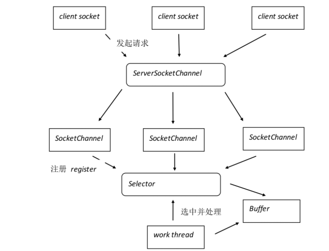

# Socket

`Socket`通信的基本流程具体步骤如下所示:

（1）服务端通过`Listen`开启监听，等待客户端接入。

（2）客户端的套接字通过`Connect`连接服务器端的套接字，服务端通过`Accept`接收客户端连接。在`connect-accept`过程中，操作系统将会进行三次握手。

（3）客户端和服务端通过`write`和`read`发送和接收数据，操作系统将会完成`TCP`数据的确认、重发等步骤。

（4）通过`close`关闭连接，操作系统会进行四次挥手。

`SeverSocket`是服务端应用类型。`Socket`是建立连接的类型。当连接建立成功后，服务器和客户端都会有一个`Socket`对象示例，可以通过这个`Socket`对象示例，完成会话的所有操作。对于一个完整的网络连接来说，`Socket`是平等的，没有服务器客户端分级情况。

## IO模式

对于一次IO操作，数据会先拷贝到内核空间中，然后再从内核空间拷贝到用户空间中，所以一次`read`操作，会经历两个阶段：

（1）等待数据准备

（2）数据从内核空间拷贝到用户空间

基于以上两个阶段就产生了五种不同的IO模式。

1. 阻塞IO：从进程发起IO操作，一直等待上述两个阶段完成，此时两阶段一起阻塞。
   - 
2. 非阻塞IO：进程一直询问IO准备好了没有，准备好了再发起读取操作，这时才把数据从内核空间拷贝到用户空间。第一阶段不阻塞但要轮询，第二阶段阻塞。
   - 
3. 多路复用IO：多个连接使用同一个select去询问IO准备好了没有，如果有准备好了的，就返回有数据准备好了，然后对应的连接再发起读取操作，把数据从内核空间拷贝到用户空间。两阶段分开阻塞。
   - 
4. 信号驱动IO：进程发起读取操作会立即返回，当数据准备好了会以通知的形式告诉进程，进程再发起读取操作，把数据从内核空间拷贝到用户空间。第一阶段不阻塞，第二阶段阻塞。
5. 异步IO：进程发起读取操作会立即返回，等到数据准备好且已经拷贝到用户空间了再通知进程拿数据。两个阶段都不阻塞。
   - 

## 同步和异步——关注消息通信机制

- **同步：** 同步就是发起一个调用后，被调用者未处理完请求之前，调用不返回。
- **异步：** 异步就是发起一个调用后，立刻得到被调用者的回应表示已接收到请求，但是被调用者并没有返回结果，此时我们可以处理其他的请求，被调用者通常依靠事件，回调等机制来通知调用者其返回结果。

同步和异步的区别最大在于异步的话调用者不需要等待处理结果，被调用者会通过回调等机制来通知调用者其返回结果。

## 阻塞和非阻塞——关注程序等待调用结果时的状态

- **阻塞：** 阻塞就是发起一个请求，调用者一直等待请求结果返回，也就是当前线程会被挂起，无法从事其他任务，只有当条件就绪才能继续。
- **非阻塞：** 非阻塞就是发起一个请求，调用者不用一直等着结果返回，可以先去干其他事情。

- **BIO** (同步阻塞I/O模式): 数据的读取写入必须阻塞在一个线程内等待其完成。这里使用那个经典的烧开水例子，这里假设一个烧开水的场景，有一排水壶在烧开水，BIO的工作模式就是， 叫一个线程停留在一个水壶那，直到这个水壶烧开，才去处理下一个水壶。但是实际上线程在等待水壶烧开的时间段什么都没有做。
- **NIO**(同步非阻塞): 同时支持阻塞与非阻塞模式，但这里我们以其同步非阻塞I/O模式来说明，那么什么叫做同步非阻塞？如果还拿烧开水来说，NIO的做法是叫一个线程不断的轮询每个水壶的状态，看看是否有水壶的状态发生了改变，从而进行下一步的操作。
- **AIO**(异步非阻塞I/O模型): 异步非阻塞与同步非阻塞的区别在哪里？异步非阻塞无需一个线程去轮询所有IO操作的状态改变，在相应的状态改变后，系统会通知对应的线程来处理。对应到烧开水中就是，为每个水壶上面装了一个开关，水烧开之后，水壶会自动通知我水烧开了。

## BIO

编程实现过程为：首先在服务端启动一个`ServerSocket`来监听网络请求，客户端启动`Socket`发起网络请求，默认情况下`SeverSocket`会建立一个线程来处理此请求，如果服务端没有线程可用，客户端则会阻塞等待或遭到拒绝。服务器实现模式为一个连接一个线程，即客户端有连接请求时服务器端就需要启动一个线程进行处理。

如果要让 `BIO` 通信模型能够同时处理多个客户端请求，就必须使用多线程（主要原因是 `socket.accept()`、`socket.read()`、 `socket.write()` 涉及的三个主要函数都是同步阻塞

## Java NIO

`NIO`本身想解决 `BIO`的并发问题，通过`Reactor模式`的事件驱动机制来达到`Non Blocking`的。当 `socket` 有流可读或可写入 `socket` 时，操作系统会相应的通知应用程序进行处理，应用再将流读取到缓冲区或写入操作系统。

也就是说，这个时候，已经不是一个连接就 要对应一个处理线程了，而是有效的请求，对应一个线程，当连接没有数据时，是没有工作线程来处理的。

当一个连接创建后，不需要对应一个线程，这个连接会被注册到 `多路复用器`上面，所以所有的连接只需要一个线程就可以搞定，当这个线程中的`多路复用器` 进行轮询的时候，发现连接上有请求的话，才开启一个线程进行处理，也就是一个请求一个线程模式。

`NIO`提供了与传统BIO模型中的`Socket`和`ServerSocket`相对应的`SocketChannel`和`ServerSocketChannel`两种不同的套接字通道实现



### 1. Channel

在`NIO`中，基本所有的IO操作都是从`Channel`开始的，`Channel`通过`Buffer(缓冲区)`进行读写操作。

`read()`表示读取通道中数据到缓冲区，`write()`表示把缓冲区数据写入到通道。

NIO中有FileChannel，SocketChannel，DatagramChannel等通道，其中FileChannel是无法使用非阻塞模式的

### 2. Buffer

#### 概念

`Buffer`也被成为内存缓冲区，本质上就是内存中的一块，我们可以将数据写入这块内存，之后从这块内存中读取数据。也可以将这块内存封装成`NIO Buffer`对象，并提供一组常用的方法，方便我们对该块内存进行读写操作。

#### 属性

`Buffer`中有4个非常重要的属性：**capacity、limit、position、mark**


- `capacity`属性：容量，Buffer能够容纳的数据元素的最大值，在Buffer初始化创建的时候被赋值，而且不能被修改。

- `limit`属性：代表Buffer可读可写的上限。

- - 写模式下：`limit` 代表能写入数据的上限位置，这个时候`limit = capacity`读模式下：在`Buffer`完成所有数据写入后，通过调用`flip()`方法，切换到读模式，此时`limit`等于`Buffer`中实际已经写入的数据大小。因为`Buffer`可能没有被写满，所以**limit<=capacity**

- `position`属性：代表读取或者写入`Buffer`的位置。默认为0。

- - 写模式下：每往`Buffer`中写入一个值，`position`就会自动加1，代表下一次写入的位置。
  - 读模式下：每往`Buffer`中读取一个值，`position`就自动加1，代表下一次读取的位置。

##### 创建Buffer

- `allocate(int capacity)`

```java
ByteBuffer buffer = ByteBuffer.allocate(1024);
int count = channel.read(buffer);
```

##### Buffer写操作

`Buffer`写入可以通过`put()`和`channel.read(buffer)`两种方式写入。

##### Buffer读操作

`Buffer`读取可以通过`get()`和`channel.write(buffer)`两种方式读入。

##### 其他常见方法

- `rewind()`：重置position位置为0，可以重新读取和写入buffer，一般该方法适用于读操作，可以理解为对buffer的重复读。

```
public final Buffer rewind() {
    position = 0;
    mark = -1;
    return this;
}
```

`flip()`：很常用的一个方法，一般在写模式切换到读模式的时候会经常用到。也会将position设置为0，然后设置limit等于原来写入的position。

### 3. Selector

#### 概念

`Selector`是NIO中最为重要的组件之一，我们常常说的`多路复用器`就是指的`Selector`组件。`Selector`组件用于轮询一个或多个`NIO Channel`的状态是否处于可读、可写。通过轮询的机制就可以管理多个Channel，也就是说可以管理多个网络连接。

#### 轮询机制

1. 首先，需要将Channel注册到Selector上，这样Selector才知道需要管理哪些Channel

   - ```java
     channel.configureBlocking(false);
     SelectionKey key = channel.register(selector, SelectionKey.OP_READ);
     ```

2. 接着Selector会不断轮询其上注册的Channel，如果某个Channel发生了读或写的时间，这个Channel就会被Selector轮询出来，然后通过SelectionKey可以获取就绪的Channel集合，进行后续的IO操作。

#### 操作

1. 创建Selector

通过`open()`方法，我们可以创建一个`Selector`对象。

```
Selector selector = Selector.open();
```

1. 注册Channel到Selector中

我们需要将`Channel`注册到`Selector`中，才能够被`Selector`管理。

```
channel.configureBlocking(false);
SelectionKey key = channel.register(selector, SelectionKey.OP_READ);
```

某个`Channel`要注册到`Selector`中，那么该Channel必须是**非阻塞**，所有上面代码中有个`configureBlocking()`的配置操作。

在`register(Selector selector, int interestSet)`方法的第二个参数，标识一个`interest`集合，意思是Selector对哪些事件感兴趣，可以监听四种不同类型的事件：

```
public static final int OP_READ = 1 << 0;
public static final int OP_WRITE = 1 << ;
public static final int OP_CONNECT = 1 << 3;
public static final int OP_ACCEPT = 1 << 4;
```

- `Connect事件` ：连接完成事件( TCP 连接 )，仅适用于客户端，对应 SelectionKey.OP_CONNECT。
- `Accept事件` ：接受新连接事件，仅适用于服务端，对应 SelectionKey.OP_ACCEPT 。
- `Read事件` ：读事件，适用于两端，对应 SelectionKey.OP_READ ，表示 Buffer 可读。
- `Write事件` ：写时间，适用于两端，对应 SelectionKey.OP_WRITE ，表示 Buffer 可写。

`Channel`触发了一个事件，表明该时间已经准备就绪：

- 一个Client Channel成功连接到另一个服务器，成为“连接就绪”OF_CONNECT
- 一个Server Socket准备好接收新进入的接，称为“接收就绪”OF_ACCEPT
- 一个有数据可读的Channel，称为“读就绪”OF_READ
- 一个等待写数据的Channel，称为”写就绪“OF_WRITE

当然，`Selector`是可以同时对多个事件感兴趣的，我们使用或运算即可组合多个事件：

```
int interestSet = SelectionKey.OP_READ | SelectionKey.OP_WRITE;
```

#### Selector其他一些操作

##### 选择Channel

```
public abstract int select() throws IOException;
public abstract int select(long timeout) throws IOException;
public abstract int selectNow() throws IOException;
```

当Selector执行`select()`方法就会产生阻塞，等到注册在其上的Channel准备就绪就会立即返回，返回准备就绪的数量。

`select(long timeout)`则是在`select()`的基础上增加了超时机制。`selectNow()`立即返回，不产生阻塞。

**有一点非常需要注意：** `select` 方法返回的 `int` 值，表示有多少 `Channel` 已经就绪。

自上次调用`select` 方法后有多少 `Channel` 变成就绪状态。如果调用 `select` 方法，因为有一个 `Channel` 变成就绪状态则返回了 1 ；

若再次调用 `select` 方法，如果另一个 `Channel` 就绪了，它会再次返回1。

##### 获取可操作的Channel

```
Set selectedKeys = selector.selectedKeys();
```

当有新增就绪的`Channel`，调用`select()`方法，就会将key添加到Set集合中。

## 总结

回顾一下使用 `NIO` 开发服务端程序的步骤：

1. 创建 `ServerSocketChannel` 和业务处理线程池。
2. 绑定监听端口，并配置为非阻塞模式。
3. 创建 `Selector`，将之前创建的 `ServerSocketChannel` 注册到 `Selector` 上，监听 `SelectionKey.OP_ACCEPT`。
4. 循环执行 `Selector.select()`` 方法，轮询就绪的`Channel`。
5. 轮询就绪的 `Channel` 时，如果是处于 `OP_ACCEPT` 状态，说明是新的客户端接入，调用 `ServerSocketChannel.accept` 接收新的客户端。
6. 设置新接入的 `SocketChannel` 为非阻塞模式，并注册到 `Selector` 上，监听 `OP_READ`。
7. 如果轮询的 `Channel` 状态是 `OP_READ`，说明有新的就绪数据包需要读取，则构造 `ByteBuffer` 对象，读取数据。

那从这些步骤中基本知道开发者需要熟悉的知识点有：

1. `jdk-nio`提供的几个关键类：`Selector` , `SocketChannel` , `ServerSocketChannel` , `FileChannel` ,`ByteBuffer` ,`SelectionKey`
2. 需要知道网络知识：tcp粘包拆包 、网络闪断、包体溢出及重复发送等
3. 需要知道`linux`底层实现，如何正确的关闭`channel`，如何退出注销`selector` ，如何避免`selector`太过于频繁
4. 需要知道如何让`client`端获得`server`端的返回值,然后才返回给前端，需要如何等待或在怎样作熔断机制
5. 需要知道对象序列化，及序列化算法

## BIO，NIO，AIO的适用场景

BIO方式适用于连接数目比较小且固定的架构，这种方式对服务器资源要求比较高，并发局限于应用中，JDK1.4以前的唯一选择，但程序直观简单易理解。

NIO方式适用于连接数目多且连接比较短（轻操作）的架构，比如聊天服务器，并发局限于应用中，编程比较复杂，JDK1.4开始支持。

AIO方式适用于连接数目多且连接比较长（重操作）的架构，比如相册服务器，充分调用OS参与并发操作，编程比较复杂，JDK7开始支持。