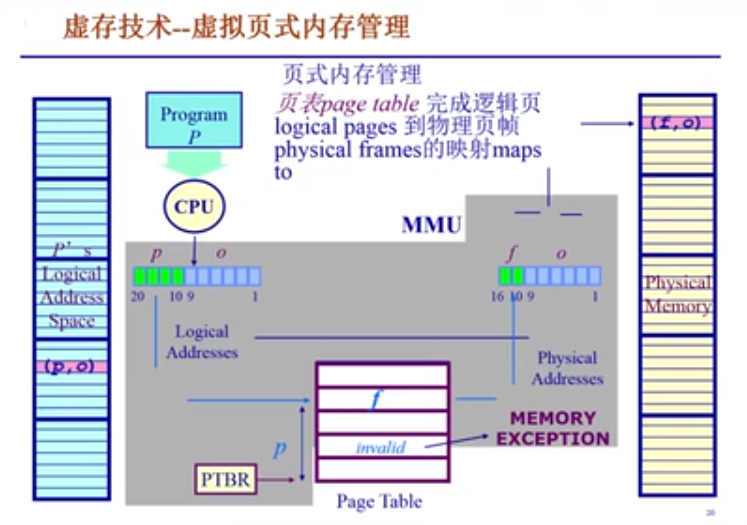

# 操作系统

1. 什么是操作系统

用户角度：控制程序，管理应用程序   为应用程序提供服务  杀死应用程序

操作系统的内部角度：资源管理   管理外设，分配资源    


操作系统的层次结构:硬件之上，应用程序之下

linux，android，windows的界面属于shell（外壳），操作系统kernel处于shell之下，shell相当于内核暴露出来的接口，经过图形化的优化。

#### 操作系统的内部组件

1. CPU调度器
2. 物理内存管理
3. 虚拟内存管理
4. 文件系统管理
5. 中断处理和设备驱动

#### OS Kernel的特征

1. 并发特征
2. 计算机系统中同时存在多个运行的程序
3. 共享：同时访问，互斥共享
4. 虚拟：利用多道程序设计技术，让每个用户到觉得有一个计算机专门为他服务——时分复用，空分复用
5. 异步：程序的执行并不是连续的，而是走走停停的，但是只要运行环境相同，OS就需要保证程序运行的结果需要相同

**并发：一段时间内多个程序运行**

**并行：同一时刻有多个程序运行（要求多核的计算机）**

SOSP和USENIX

同步：不同的程序先后执行，且后执行的程序必须等待先执行的程序的完成

异步：不同的程序先后执行，但是其完成先后由程序决定，而不与执行的先后相关

#### 分时系统

把计算机与许多终端用户连接起来，分时操作系统将系统处理机时间与内存空间按一定的时间间隔，轮流地切换给各终端用户的程序使用。由于时间间隔很短，每个用户的感觉就像他独占计算机一样。

## 第一章

### 启动

DISK：存放操作系统

BIOS：基本I/O处理系统

bootloader：加载OS，将操作系统从硬盘存到内存中

顺序：

1. POST（加电自检），寻找显卡和执行BIOS。从硬盘的第一个扇区（512字节）加载bootloader到0x7C00（不同的系统可能会有所不同《x86汇编相关》）、
2. bootloader将操作系统的代码和数据从硬盘加载到内存，并跳转到OS操作系统的起始地址

### 中断，异常和系统调用

这三种方式就是系统从用户态向内核态转变的方式

系统调用（来源于应用程序）：应用程序向操作系统发出服务请求

异常（来源于不良的应用程序）：非法指令或者其他坏的处理状态

中断（来自外设）：来自不同的硬件设备的计时器和网络中断

#### 处理时间

中断：异步

异常：同步

系统调用：异步或同步

#### 响应状态

中断：持续，对用户应用程序是透明的，用户不可感知

异常：杀死或者重新执行意象不到的应用程序指令

系统调用（system call）：等待和持续

#### 中断或者异常处理机制

有一个异常表，不同的异常有不同的编号，并且其具有一个特定的地址，该地址是针对异常的特定服务

中断：硬件设置中断标记，将内部，外部事件设置中断标记，并提供中断事件的ID，对于软件：保存当前处理状态。根据中断服务程序处理，清楚中断标记，回复之前保存的状态

异常：保存现场，异常处理（杀死产生异常的程序或者重新执行异常指令），恢复现场

#### 用户态和内核态

内核态：cpu可以访问内存的所有数据，包括外围设备，例如硬盘，网卡，cpu也可以将自己从一个程序切换到另一个程序。

用户态：只能受限的访问内存，且不允许访问外围设备，占用cpu的能力被剥夺，cpu资源可以被其他程序获取。

函数调用：运行在用户空间。 它主要通过压栈操作来进行函数调用。

系统调用：应用程序和操作系统都有各自的栈，并且需要完成用户态到内核态的转换

**系统调用**
1.使用INT和IRET指令，内核和应用程序使用的是不同的堆栈，因此存在堆栈的切换，从用户态切换到内核态，从而可以使用特权指令操控设备
2.依赖于内核，不保证移植性
3.在用户空间和内核上下文环境间切换，开销较大是操作系统的一个入口点

**函数调用**
1.使用CALL和RET指令，调用时没有堆栈切换
2.平台移植性好
3.属于过程调用，调用开销较小
4.一个普通功能函数的调用

## 第二章——计算机结构和内存分层模型

### 内存层次结构


主存掉电会丢失数据

### 操作系统中管理内存的不同方法

1. 程序重定位
2. 分段
3. 分页
4. 虚拟内存
5. 按需分页虚拟内存

- 实现高度依赖于硬件
  - 必须知道内存架构
  - MMU：硬件组件负责

### 地址空间


#### 地址生成

逻辑地址在编译中生成并连接

逻辑地址与物理地址的连接映射


MMU中有一个位置存放了逻辑地址到物理地址的映射，**操作系统建立逻辑地址和物理地址之间的映射**

#### 地址安全检查

保证程序访问的地址空间是合法的，该限制检查是由操作系统完成的。


### 连续内存分配

#### 内存碎片

空闲内存不能被利用

外部碎片：在分配单元间未使用内存

内部碎片：在分配单元中未使用内存

- 优缺点：分配给程序的内存是连续的，但内存利用率低，有外碎片，内碎片问题

#### 分区的动态分配

简单的内存管理办法：1、当一个程序准许运行在内存中时，分配一个连续的区间。2、分配一个连续的内存区间给运行的程序以访问数据

1. 第一适配：为了分配n字节，使用**第一个**可用空闲块以致快的尺寸比n大
   - 实现：按**地址排序**的空闲块列表，分配需要寻找一个合适的分区，重分配需要检查，看是否自由分区能合并于相邻的空闲分区
   - 优缺点：简单，容易产生更大的空闲块，劣势：产生外碎片
2. 最佳适配：为了分配n字节，使用**最小**的可用空闲块，以致快的大小比n大
   - 实现：按**尺寸排列**的空闲块列表，分配需要的合适分区，需要合并相邻的空闲分区
   - 优缺点：避免把大的空间快拆分  外部碎片拆分得较细，难以使用
3. 最差适配：为了分配n字节，使用**最大**的可用空闲块，以致快的大小比n大
   - 实现：按**尺寸排列**的空闲块列表，分配需要的合适分区，需要合并相邻的空闲分区
   - 优缺点：对于中等尺寸效果较好 缺点：重分配慢，容易破碎大的空闲块导致无法再分配较大的块

#### 压缩式碎片整理

重置程序以合并孔洞，要求所有程序是动态可重置的

运行时机：程序停止的时候（不占用CPU时间），开销是否太大

问题：利用软件实现位置挪动

#### 交换式碎片整理

运行的程序需要更多的内存，抢占等待的程序，回收这部分内存

问题：哪些程序进行交换——虚存管理

### 非连续内存管理

- 优点：一个程序的物理空间是非连续的，更好的内存管理，允许共享代码和数据，支持动态加载和动态链接
- 缺点：管理开销本身——如何建立虚拟地址和物理地址之间的转换（分段与分页）

#### 分段

更好的分离以及管理

##### 分段地址空间


软件机制开销大，需要采用硬件来减少开销，就有了下面的寻址方案

##### 分段寻址方案


实现需求：seg num（段表），其中存有逻辑地址段号与物理地址段号的映射（包括段的起始地址和段的大小），操作系统会负责建立该段表，段的大小可变

#### 分页——大部分的CPU的非连续内存管理

##### 分页地址空间

页的大小固定——划分物理内存至固定大小的帧（2的幂次），划分逻辑地址空间至大小相同的页（2的幂次）

建立逻辑地址到物理地址的转换

页内偏移的大小是一致的。

帧（frame）:


##### 寻址方案


需要页表的实现——操作系统

#### 页表

逻辑地址转换到物理地址


上图逻辑地址具有16bit地址空间，上图的resident bit表示该逻辑地址对应的帧是否存在，如果不存在的情况下访问该帧，就会出现异常，因此（4，0）的这个是错误的，出现异常，而（3，1023）对应的是存在的，他对应的页帧号是4，所以最终的映射过程结果为（4,1023）。

性能问题：1、访问一次内存单元需要2次内存访问。2、页表可能很大。

处理办法：缓存和间接访问——TLB

##### TLB

一个特俗的区域，存储在内存当中，用于缓存近期访问到的页帧转换表项


这个将内存表项中的内容存到TLB中是由硬件实现的，但是存在由软件实现的情况

为解决页表太大的问题，采用多级页表的结构——如果对应的驻留位不存在，对应的空间就可以不保留（实现节省空间）


##### 反向页表（页寄存器）

不是让页表与逻辑地址空间的大小相对应，而是让页表与物理地址空间的大小相对应


## 虚拟内存

### 起因

内存不足

### 覆盖技术

只把需要的指令和数据保存在内存当中

- 原理：按照自身的逻辑划分功能模块，这些模块相对独立，但是共享相同的内存空间。（必须有固定的内存空间用于管理何时加载数据进入内存，或者移出内存）
- 缺点：程序员需要将大的程序切分为多个独立模块，时间换取空间

### 交换技术

采用自动交换技术，把暂时不能执行的程序送到外存中，等到需要运行时再将程序读入——让正在运行的程序或需要运行的程序获得更多的内存资源。

问题：1.仅当内存不足时才进行交换  2.交换区的大小必须能够存放用户进程所需的拷贝  3.采用动态映射的方式来保存换入时的内存的位置

### 虚存技术

以更小的页粒度装入更多更大的程序

#### 目标

不把所有的内容都放到内存中，能够实现进程在内存和外存之间的交换（仅对内存的部分内容进行导入）

#### 程序局部性原理

前提：程序的局部性原理——程序在执行过程中的一个较短时期，所执行的指令地址和指令的操作数地址都局限在一个区域中


注意题目，一个页的大小为4k，int[1024]的大小为4k，一行放在一个页面中，访问`a[0][j]`时就会加载这一行到页面中，因此当j在0-1023时都不会产生缺页中断，但是`a[j][0]`（第一种）访问的时侯，就会频繁产生缺页中断

可以配合页式或者段式的内存管理的基础来实现

1. 在装入程序时，不必将其全部装入到内存中，而只需将当前需要执行的页面或者段装入到内存
2. 在程序执行过程中，如果需要执行的指令还不在内存中，就长生缺页异常通知操作系统将其调入到内存
3. 将不需要的页面或者段调出保存在外存上

在CPU中按行遍历的效率也要更高一些

原因如下：

数组在内存中是按行储存的，按行遍历时可以由指向数组第一个数的指针一直往下走，就可以遍历完整个数组，而按列遍历则要获得指向每一列的第一行的元素的指针，然后每次将指针指下一行，

1. CPU高速缓存（英语：CPU Cache，在本文中简称缓存）是用于减少处理器访问内存所需平均时间的部件。在金字塔式存储体系中它位于自顶向下的第二层，仅次于CPU寄存 器。其容量远小于内存，但速度却可以接近处理器的频率。当处理器发出内存访问请求时，会先查看缓存内是否有请求数据。如果存在（命中），则不经访问内存直接返回该数据；如果不存在（失效），则要先把内存中的相应数据载入缓存，再将其返回处理器。
2.    缓存从内存中抓取一般都是整个数据块，所以它的物理内存是连续的，几乎都是同行不同列的，而如果内循环以列的方式进行遍历的话，将会使整个缓存块无法被利用，而不得不从内存中读取数据，而从内存读取速度是远远小于从缓存中读取数据的。
3. 分页调度：物理内存是以页的方式进行划分的，当一个二维数组很大是如 int\[128][1024],假设一页的内存为4096个字节，而每一行正好占据内存的一页，如果以列的形式进行遍历，就会发生128*1024次的页面调度，而如果以行遍历则只有128次页面调度，而页面调度是有时间消耗的，因而调度次数越多，遍历的时间就越长。

#### 基本特征

1. 大的用户空间，将物理内存和外存相结合
2. 部分交换——与交换技术相比，虚拟存储的调入和调出是对部分虚拟地址空间进行的
3. 不连续性

#### 虚拟页式内存管理



- 大部分的虚拟存储系统采用虚拟页式管理技术，即在页式管理的基础上增加请求调页和页面置换功能
- 当一个用户程序要调入内存运行时，不是将所有的程序都装入内存中，而是只装入部分的页面。在运行的时候发现要运行的程序或者数据不存在，就发出缺页中断请求，有系统将外存中的相应页调入内存


驻留位：表示该页是在内存还是外存，0:外存，1内存

保护位：表示对该页能执行的操作，只读，可写

修改位：表示该页是否被修改过——如果被修改过，就需要写回外存，如果没有就直接释放内存就可以

访问位：如果页面被访问过，用于缓存，如果该位为1，表示近期被访问过，


### 局部页面替换算法

前提：局部性定理

#### 最优页面置换算法

功能：当页面中断发生，需要调入新的页面而内存已满时，选择内存中的哪个页面被置换

目标：尽可能减少页面的换进换出次数

页面锁定：对于必须常驻内存的页面添加锁定标记位

基本思路：当一个缺页中断发生时，对于保存在内存中的每一个逻辑页面，计算在他的下一次访问之前还需要等待的时间，等待时间最长的那个被替换

缺点：过分理想不可实现（无法预知下一次访问的时机）——作为一种评价标准

#### 先进先出算法

基本思路：选择在内存中驻留时间最长的页面淘汰。系统维护了一个链表（队列），队头驻留时间最长，队尾最短，发生中断时，就将队头替换出去

belady现象：分配的物理页面数增加，但是缺页率而提高的异常现象

#### 最近最久未使用方法LRU

基本思路——当一个缺页中断发生时，选择最久违背使用的页面替换

实现——链表+哈希

#### 时钟页面置换算法clock

基本实现思路

1. 需要使用页表项中的访问位，当一个页面被装入内存时，把该位初始化为0，如果这个页面被访问九江该位置变为1
2. 把各个页面组织为环形链表，指针指向最老的页面
3. 当发生缺页中断时，考察指针指向的最老的页面，若他的访问位为，就直接淘汰，若访问位位1，就置0，并移动到下一个位置，直到找到淘汰的页面

#### 第二次机会法

有两个标记为来指导替换，一个位标记写操作，一个位标记读操作

#### 最不常用法

当产生缺页的时候，选择访问次数最少的页面进行淘汰，这种方法需要考虑时间信息

### 全局页面替换算法

常驻集指当前时刻，进程实际驻留在内存当中的页面集合，而工作集是进程的固有性质。

利用滑动窗口进行页面的替换

#### 缺页率的页面置换算法

每个进程在刚开始运行的时候，现根据程序的大小给她分配一定数目的物理页面，之后根据进程的运行动态地调整常驻集的大小，缺页率：缺页次数/内存访问次数

缺页率高：增加工作集 缺页率低：减少工作集

### trashing抖动问题

1. 如果分配给一个进程的物理页面太少，不能包含整个工作集，就会造成很多的缺页中断，需要频繁地在内存与外存之间切换页面
2. 产生抖动地原因：随着进程数量地增多，能够分配给每个进程地物理页面减少，缺页率就会上升

## 进程

定义：一个具有独立功能的程序在一个数据集合上的一次动态执行过程

进程的组成：程序代码，程序处理的数据，程序计数器中的值，指示下一条将要执行的指令，一组系统资源，一组通用的寄存器的当前值，堆，栈

### 进程的内存结构——和JVM差不多

一个正在运行的进程在内存空间中申请的代码区、初始化数据区、未初始化数据区、上下文信息以及挂载的信号等等.
（1）代码区.加载的是可执行文件的代码段，其加载到内存中的位置由加载器完成.
（2）全局初始化数据区/静态数据区.加载的是可执行文件数据段，已初始化的全局变量，静态内存分配；
（3）未初始化数据区.加载的是可执行文件BBS段，位置可以分开也可以紧靠数据段.程序在运行之初为该部分申请了空间，在程序退出时才释放，存储于该部分的数据的生存周期为整个程序运行过程.
（4）栈.由编译器自动分配释放.自动变量以及每次函数调用所需要保存的信息都存放在此段中.每次调用函数时，其返回地址以及调用者的环境信息都存放在栈中.然后，最近被调用的函数在栈上为其自动和临时变量分配存储空间.通过这种方式使用栈，可以递归的调用C函数.递归函数每次调用自身时，就使用一个新的栈帧，因此一个函数调用实例中的变量集不会影响另一个函数调用实例中的变量.用户存放程序临时创建的局部变量，函数调用参数和返回值被压入发起调用的进程栈中。
（5）堆，通常在堆中进行动态存储分配.一般由程序员分配和释放，若程序员不释放，程序结束是由系统收回.堆位于非初始化数据段和栈之间。

### 特点

动态性：可动态地创建，结束进程

并发性：进程可以被独立调度并占用处理机运行

独立性：把不同进程的工作互不影响

制约性：因访问共享数据或者进程间同步而产生制约

### 进程控制结构——PCB（process Control Block）

操作系统管理控制进程运行所用的信息集合。操作系统用PCB来描述进程的基本信息和运行变化的过程，PCB是进程存在的唯一标志。

进程的创建：为进程生成一个PCB

进程终止：回收相应的PCB

进程的组织管理：通过对PCB的组织管理来实现

#### PCB包含的信息

1. 进程标识信息：一个进程的id，父进程id，用户标识
2. 处理机状态信息保存区：保存进程的运行现场信息
   1. 用户可见寄存器
   2. 控制和状态寄存器
   3. 栈指针
3. 进程控制信息
   1. 调度和状态信息:操作系统调度进程并占用处理机使用
   2. 进程间的通信信息：为支持进程间的与通信相关的各种标识，信号，信件
   3. 存储管理信息
   4. 进程所用资源
   5. 有关数据结构连接信息：

#### PCB的组织方式

链表：同意状态的进程其PCB连成一个链表（常用）

索引表：同一个状态的进程归入一个index表

### 进程管理

#### 进程生命周期管理

##### 进程创建

3个主要事件：

1. 系统初始化时
2. 用户请求创建一个新进程
3. 正在运行的进程执行了创建进程的系统调用

##### 进程运行

为何选择

如何选择

##### 进程等待

进程等待

1. 请求并等待系统服务，无法马上完成
2. 启动某种操作，无法马上完成
3. 需要的数据没有到达

**进程只能自身阻塞自己**

##### 进程唤醒

唤醒的原因

1. 被阻塞进程需要的资源满足
2. 被阻塞进程等待的事件到达
3. 该进程的PCB插入到就绪队列

**进程只能被别的进程或者操作系统唤醒**

##### 进程结束

退出情景

1. 正常退出
2. 错误退出
3. 致命错误
4. 被其他进程杀死

#### 进程状态变化模型

三种基本状态

运行状态——就绪状态——等待状态


其他的基本状态——创建状态，结束状态


#### 进程挂起

进程处在挂起状态，意味着进程没有占用内存空间，处在挂起状态的进程影像在磁盘上

**阻塞挂起**进程在外存并等待某事件的发生

**就绪挂起**进程在外存，只要进入内存就可以执行

##### 挂起

把一个进程从内存转到外存有以下的情况

1. 阻塞到阻塞挂起：没有进程处在就绪状态或者就绪进程要求更多的内存资源时，就会进行这种切换
2. 就绪到就绪挂起：当有高优先级阻塞金册灰姑娘和低优先级就绪进程，系统会挂起低优先级进程
3. 运行到就绪挂起：抢先式分时系统，当有高优先级阻塞挂起进程因事件出现而进入就绪挂起时，系统可能会把运行进程转到就绪挂起状态

##### 处在外存时的状态切换

阻塞挂起到就绪挂起：当有阻塞挂起进程因事件出现时，系统会把阻塞挂起进程切换为就绪挂起进程

### 状态队列

- 操作系统维护一组队列，用来标识系统当中所有进程的当前状态
- 不同的状态分别用不同的队列来表示
- 每个进程的PCB都根据它的状态加入相应的队列，当一个进程状态发生变化时，就会从原来的队列出来加入另一个队列

## 线程

线程当中的一条执行流程

线程优点：

1. 一个进程中可以同时存在多个线程
2. 各个线程之间可以并发执行
3. 各个线程之间可以共享地址空间和文件

缺点：一个线程崩溃，会导致其所属的所有线程崩溃

### 进程与线程的比较

- 进程是资源分配单位，线程是CPU调度单位
- 进程拥有一个完整的资源平台，而线程只独享必不可少的资源（寄存器和栈）
- 线程同样具有就绪，阻塞和执行三种基本状态，同样具有状态之间的切换关系
- 线程能减少并发执行的事件和空间开销
  - 线程的创建时间短
  - 线程的终止时间短
  - 同一进程内的线程切换时间短（线程具有同一地址空间，也就是同一进程的线程具有相同的页表，切换时不需要切换页表，切换进程的时候需要切换页表）
  - 由于同一进程的各线程共享内存和文件资源，可直接进行不通过内核的通信

### 线程的实现方式

内核线程：由操作系统完成管理，由内核来维护进程和线程的上下文信息（PCB和TCB），操作系统可见——由于线程的创建，终止和切换都通过系统调用/内核函数来执行，因此系统的开销比较大，线程被阻塞时不会影响其他的线程运行

用户线程：操作系统不可见，由线程库来完成管理。每个进程都需要相应的线程控制列表，该表由线程库函数来维护，用户线程的切换也是由线程库函数来完成的，无需用户态内核态的切换。

用户线程与内核线程的对应关系：（用户线程与内核线程的绑定）用户线程的运行必须依赖内核线程，通过内核线程调度器来分配到相应的处理器上。

一对多

多对一

多对多

用户线程缺点：

1. 阻塞性的系统调用造成了阻塞，整个进程都在等待
2. 当一个线程开始运行之后，除非它主动交出CPU使用权，否则它所在的进程中的其他线程都无法运行
3. 由于时间片分配给进程，多线程环境下，线程得到的时间片较少，运行慢

## 上下文切换

停止当前运行进程并且调度其他进程

1. 必须在切换时储存许多部分的进程上下文
2. 必须能够在之后恢复
3. 必须快速

### 实现

操作系统将进程控制块放在了队列当中，分为就绪队列，等待队列和僵尸队列

wait()系统是被父进程用来等待子进程的结束，一个子进程向父进程返回一个值，父进程必须接受这个值并处理

wait()系统调用担任要求

1. 它使父进程睡眠来等待子进程的结果
2. 当一个子进程调用exit()时，操作系统解锁父进程。并通过exit()传递得到的返回值作为wait的一个结果。

exit()该系统调用执行后会执行关闭打开的文件，释放内存等操作，并检查父进程是否存活，如果是就保留结果的值直到父进程需要它。

## CPU调度

1. 从就绪队列中挑选一个进程或者线程作为CPU将要运行的下一个进程
2. 调度程序：挑选合适的进程或者线程的内核函数
3. 什么时候调度——在线程进程发生状态转换的时候

内核运行调度程序的条件

1. 一个进程从运行状态切换到了等待状态
2. 一个进程终结了

策略：不可抢占：必须等待事件结束

​			可以抢占：调度程序在中断被响应后执行，当且的进程从运行切换为就绪，当且进程可以被换出

### 调度原则

#### 调度策略

CPU使用率（CPU忙状态所占时间百分比），吞吐量（单位时间内完成的进程数量），周转时间（初始化到结束包括等待的总时间），等待时间（进程在就绪队列中的总时间），响应时间（从一个请求被提交到第一次响应的时间）

#### 调度算法

FCFS先来先处理：简单，但是平均等待时间波动大

SPN短进程优先：按照预测的完成时间来将任务入队（有抢占和非抢占两种方式）缺点：连续的短进程会导致长任务饥饿，难以预测未来

HRRN最高响应比优先：不可抢占，需要了解线程等待的时间，但是可以防止线程无限等待

RR轮询：各线程轮流占用CPU——需要额外的上下文切换，时间片长的时候等待时间较长并且极限下退化为FCFS，时间片段可能会频繁执行上下文切换

MLFQ多级反馈：优先级

FSS公平共享调度：控制用户对资源的访问

#### 实时调度

正确性依赖于时间和功能两方面的一种操作系统，时间约束的可预测性是实时系统的主要特征。要求在保证的时间内能够完成重要的任务

任务：属性取得进程所需的资源，定时参数

RM和EDF

#### 多处理器调度

多个相同的单处理器组成了一个多处理器，优点：负载共享

对称多处理器：每个处理器运行自己的调度程序，需要在调度程序中同步

#### 优先级翻转

可以发生在任何基于优先级的可抢占的调度机制中——高优先级任务等待低优先级任务发生


## 同步

独立的线程：不与其他的线程共享资源或状态，可确定性，可重现

合作线程：在多个线程中共享状态——不确定性，不可重现

互斥：同一时间临界区中最多存在一个线程

progress：一个线程想进入临界区，总会成功

有限等待：一个线程在有限的时间内进入临界区

无忙等：一个进程进入临界区等待时间较长可以挂起（可选）

软件实现和硬件实现（计算机原语）

### 高级抽象

硬件原子操作——通过特殊的内存访问电路（封装为机器指令，在硬件层面进行了保证）

优点：适用于单处理器和共享内存的多处理器中任意数量的进程，简单

缺点：忙等待消耗处理器时间，饥饿情况

## 信号量和管程

并发问题——竞态条件

同步——多线程共享公共数据的协调执行，包括互斥与条件同步

semaphore原子操作

生产者消费者队列模型


注意初始值的设置，mutext队列锁

信号量用于互斥以及条件同步

## 管程

代表共享资源的数据结构，以及由对该共享数据结构实施操作的一组过程所组成的资源管理程序，共同构成了一个操作系统的资源管理模块，我们称之为管程。在实现中采用条件队列。

实现：需要维护每个条件队列，线程等待的条件等待signal


## 同步问题

读写问题

读者——只读数据集

写者——可读可写

## 死锁

条件：

1. 互斥：在一个时间只有一个进程使用资源
2. 持有并等待：进程保持一个资源并等待获取其他线程持有的资源
3. 无抢占：一个资源只能被进程资源释放
4. 循环等待：

### 死锁处理办法

1. 死锁预防
2. 死锁避免
3. 死锁检测
4. 死锁恢复

- 确保系统永远不会进入死锁
- 运行系统进入死锁，之后恢复
- 忽略死锁问题——大部分操作系统

### 死锁的解决

互斥——共享资源不是必须的（不太行）

占用并等待——当一个线程请求一个资源时，必须没有持有资源（容易造成饥饿）

无抢占——如果线程占有某些资源，并申请不能被分配的资源，就释放当前持有的资源

循环等待——对资源类型排序，并要求进程按照资源顺序进行申请

#### 死锁的检查——银行家算法（预防）

安全性算法：

n = 进程数量   m = 资源类型数量

Max（总需求）：n*m矩阵。如果max[i,j] = k,标识进程Pi最多需要请求资源Rj的k个实例(进程的总需求)

available（剩余资源量）：长度为m的矩阵，available[j]=k，有k个类型的Rj的资源实例可用（操作系统还剩余的）

allocation（已分配量）：n*m矩阵，allocation[i,j]=k，则pi当前分配了k个Rj实例

need（未来需求）：n*m矩阵，如果need[i,j]=k，则Pi需要至少k个Rj实例完成任务

need[i,j] = max[i,j]-allocation[i,j]

1. work=available标识空闲资源，finish[i]=false表明线程i未结束
2. finish[i]=false，寻找needi<=work，如果没有这样的i，跳到第四步（遍历1到n）
3. work=work+allocation[i]，finish[i]=true，进程结束。资源i的请求可以得到满足，之后释放已有的资源，转到2，直到所有的进程都被设置为true
4. 如果线程不是所有的都为true，就证明是一个不安全的状态

银行家算法

```
设 Request i 是进程 P i 的请求向量，如果 Request i [j]=K，表示进程 P  i 需要 K 个 R j 类型
的资源。当 P  i 发出资源请求后，系统按下述步骤进行检查：
(1) 如果 Request i [j]≤Need[i,j]，便转向步骤(2)；否则认为出错，因为它所需要的资源
数已超过它所宣布的最大值。
(2) 如果 Request i [j]≤Available[j]，便转向步骤(3)；否则，表示尚无足够资源，P i 须
等待。
(3) 系统试探着把资源分配给进程 P  i ，并修改下面数据结构中的数值：
Available[j]:= Available[j]-Request i [j]；
Allocation[i,j]:= Allocation[i,j]+Request i [j]；
Need[i,j]:= Need[i,j]-Request i [j]；
(4) 系统执行安全性算法，检查此次资源分配后系统是否处于安全状态。若安全，才正
式将资源分配给进程 P i ，以完成本次分配；否则，将本次的试探分配作废，恢复原来的资
源分配状态，让进程 P i 等待。
```

死锁检查

```
死锁检测中的数据结构类似于银行家算法中的数据结构：
(1) 可利用资源向量 Available，它表示了 m 类资源中每一类资源的可用数目。
(2) 把不占用资源的进程(向量 Allocation i :=0)记入 L 表中，即 L i ∪L。
(3) 从进程集合中找到一个 Request i ≤Work 的进程，做如下处理：
① 将其资源分配图简化，释放出资源，增加工作向量 Work:=Work + Allocation  i 。
② 将它记入 L 表中。
(4) 若不能把所有进程都记入 L 表中，便表明系统状态 S 的资源分配图是不可完全简化
的。因此，该系统状态将发生死锁。
Work:=Available；
L:={L i  |Allocation  i =0∩Request i =0}
for all L i Ï L do
begin
for all Request i ≤Work do
begin
Work :=Work + Allocation i ；
L i ∪L；
end
end
deadlock :=┓(L={p 1 ，p 2 ，…，p n })；
```

### 死锁的解除

1. 剥夺资源
2. 撤销进程
3. 资源抢占

## 进程间的通信*IPC*——IPC

### 概述

进程间的信息交换

#### 通信模型

#### 直接或者间接通信

直接通信：

send(Q,msg):发送信息到进程P

receive(Q,msg):从进程Q接受信息

通信链路属性：自动建立链路，一条链路对应一对通信进程，每对进程只有一个连接存在，连接可以是单向或者双向

间接通信：信息先发到内核，由内核进行转发——定向从消息队列接受消息，要求进程需要共享消息队列

send(A,msg):送到消息队列

receive(A,msg):从消息队列获取

属性：需要共享消息队列，连接可以与多个进程关联，每对进程可以共享多个通信链路，连接可以单向或者双向

#### 阻塞与非阻塞

发送阻塞——接收阻塞——容量限制为0，发送方必须等待接收方

发送不阻塞——接受阻塞——消息队列没有容量限制

发送与接受均不阻塞——消息队列有容量n

#### 通信链路

点对点通信链路

多点通信链路

单向通信链路

双向通信链路

### 信号

软件中断通知事件处理

处理模式：catch：指定信号处理函数被调用，ignore：依靠操作系统的默认操作，mask：闭塞信号因此不会传递

不足：无法传递任何数据

### 管道

是指用于连接一个读进程和一个写进程以实现它们之间通信的一个共享文件，又名 pipe 文件。向管道(共享文件)提供输入的发送进程(即写进程)，以字符流形式将
大量的数据送入管道；而接受管道输出的接收进程(即读进程)，则从管道中接收(读)数据。由于发送进程和接收进程是利用管道进行通信的，故又称为管道通信。

管道是由父进程来建立的

### 消息队列

消息队列可以实现多个不相干的进程之间的通信

### 共享内存

每个进程都有私有空间，在地址空间中设置了共享内存段，优点是快，缺点是必须同步数据访问

### socket机制

## 文件系统

一种用于持久性存储的系统抽象

文件：文件系统中一个单元的相关数据在操作系统中的抽象

#### 分配文件磁盘空间

- 管理文件块
- 管理空闲空间
- 分配算法

#### 管理文件集合

- 定位文件以及集合
- 命名：通过文件名找到文件的接口
- 分层文件系统

#### 提供的便利和特征

保护：分层来保护数据安全

可靠性：保护文件的持久

#### 信息

文件属性

文件头

#### 文件描述符

操作系统为每个进程维护一个打开文件，一个打开文件描述符是这个表中的索引

管理文件的元数据

1. 文件指针：指向最近一次读写位置
2. 文件打开计数：记录文件打开次数
3. 文件磁盘位置——缓存
4. 访问权限

#### 文件结构

无结构——单词，比特队列

简单记录结构——列，固定长度，可变长度

复杂结构——格式化的文档

#### 文件共享

访问控制——读写，执行，删除

文件访问控制列表（ACL）

文件名的线性列表——包含了指向数据块的指针

哈希表

一个文件系统必须被挂载才能被访问

#### 文件别名

软硬连接

### 虚拟文件系统

分层：上层虚拟文件系统，下层：特定的文件系统模块

目的：对不同文件系统的抽象

功能：提供相同的文件和文件系统的接口，管理所有文件和文件系统关联的数据结构，搞笑查询例程，遍历文件系统

### 数据块缓存

文件块的页缓存——虚拟内存中的文件数据块被映射成页

### 打开文件的数据结构

打开文件描述——存在一个表里，每个被打开的文件一个。

打开文件表——存储打开文件描述，一个进程一个

### 文件分配

对于小文件——快空间不能太大

大文件——大文件访问必须高效

连续分配:文件头指定起始块和长度

优势：文件读取表现好，高效的顺序和随机访问

劣势：碎片化，文件需要增长时不易扩展

非连续分配：

文件以数据块连接的形式存储，文件头包含第一块到最后一块的指针

优点：创建容易，缺点：不能可靠随机访问，

索引方式

为每个文件建立数据块的索引，放在文件头中

优点：增删容易，访问高效  缺点：文件小时，创建索引的开销，大文件的索引管理

### 空闲空间列表


### 多磁盘管理

### 磁盘调度