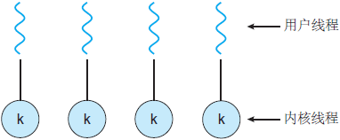

# 操作系统

## 最基本的硬件结构

### CPU

CPU态——指CPU的工作状态，是对资源和指令使用权限的描述

存在一些特权指令，包括：LGDT：装载特殊寄存器，IN/OUT：执行I/O操作，从核态转回用户态

#### 态的分类

**核态：**能够访问所有的资源和执行所有指令，管理程序以及OS内核

**用户态：**仅能够使用部分资源

**管态：**处于核态和用户态之间的状态

#### 态的转换

**用户态转变为核态：**

- 用户请求OS提供服务
- 发生中断
- 用户进程产生错误
- 用户态企图执行特权指令

**核态向用户态转换：**

中断返回：IRET

#### 硬件和OS对CPU的观察

- 硬件按照“态”来区分CPU的状态
- OS按照进程来区分CPU的状态

Intel CPU的态

ring0~ring3(ring0最核心，ring3最外层)

一个程序段反问另一个程序段时需要进行权限检查，也就是态的检查，对于每一个程序段他都有一个请求特权级(RPL)以及描述符特权级(DPL)这两个概念_之后讲

### 内存

按读写方式分类为RAM和ROM

按与CPU的联系分为主存和辅存，主存可以与CPU交换信息，辅存不能和CPU交换信息

存储体系：

- 寄存器——高速计算
- 高速缓存——java里面的工作内存
- 主存——主存空间
- 辅存——外存，容量最大

### 中断

中断指CPU对突发的外部事件的反应过程或者机制

CPU收到外部信号(中断信号)后，停止当前工作，转去处理外部事件，处理完毕后回到原来工作的中断处继续原来的工作，中断指的是类似键盘输入等的外部事件。

引入中断来实现CPU和外部事件的并发运行

- 中断源：引起系统中断的事件称之为中断源
- 中断类型
  - 强迫性中断(硬中断)——外部中断：I/O事件
  - 自愿中断(软中断)——内部中断：

断点：程序中断的地方，将要执行的下一指令的地址

现场：程序正确运行所依赖的信息集合，就是相关寄存器的内容

现场的处理过程：现场保护：进入中断服务之前，将现场存入到栈中，现场恢复：退出中断服务程序，将现场由栈中取出，还原到寄存器中

#### 中断响应过程

1. 识别中断源
2. 保护断点和现场
3. 装入中断服务程序的入口地址(CS:IP)
4. 进入中断服务程序
5. 恢复现场和断点
6. 中断返回IRET

#### 中断响应的实质

- 交换指令执行地址
- 交换CPU的态
- 工作——现场保护和恢复，参数传递

### 时钟

## 操作系统加载过程

把OS核心转入内存并使之开始接管计算机系统

1. 加电，跳转到POST
2. BIOS中的启动程序运行
3. 启动程序
   1. 读取0面第一扇区内容MBR
   2. 加载MBR中的引导程序
4. 引导程序
   1. 根据相关参数，读取硬盘指定位置的文件到内存
   2. 加载硬盘上OS内核，并初始化基本参数
5. OS内核——逐步加载OS剩余部分，最后完全控制计算机

### 核心初始化

OS内核初始化系统的核心数据——包括寄存器初始化，存储系统和页表初始化，核心进程构建等

### 系统初始化

为用户使用系统做准备，包括准备用户界面，文件系统等

### linux的启动过程

linux登录过程

## 系统调用——[操作系统（哈工大李治军老师）32讲（全）超清](https://www.bilibili.com/video/BV1d4411v7u7?p=5)

操作系统内核为应用程序提供的服务（实际上就是一些服务程序）(需要汇编的知识)，系统调用设计核心资源以及硬件操作，运行于核态，使用系统调用会导致中断

区分用户态和内核态的方式：CS:IP是当前的指令，用CS的最低两位来表示，0表示内核态，3表示用户态

DPL：描述特权级别

CPL：当前特权级别

RPL：要求特权级别

用户态的程序要调用内核态的程序时，就会检查CPL和DPL，如果CPL>DPL，那么程序就不可以跳转执行

但是硬件也提供了主动进入内核的方法，就是中断，例如指令int，int指令会把CS中的CPL改写为0，使其能够进入内核，这是用户程序发起的调用内核代码的唯一方式，

中断的执行过程——P5

### 系统调用的核心

1. 用户程序中包含一段包含int指令的代码
2. 操作系统写中断处理，获取想调程序的编号
3. 操作系统根据编号执行相应代码

### 系统调用的中断过程

### 切换的过程

用户态切换到内核态的步骤主要包括：

1、从当前进程的描述符中提取其内核栈的ss0及esp0信息。

2、使用ss0和esp0指向的内核栈将当前进程的cs,eip，eflags，ss,esp信息保存起来，这个过程也完成了由用户栈找到内核栈的切换过程，同时保存了被暂停执行的程序的下一条指令。

3、将先前由中断向量检索得到的中断处理程序的cs，eip信息装入相应的寄存器，开始执行中断处理程序，这时就转到了内核态的程序执行了。

## 进程

### 进程控制块

- 描述进程状态，资源和相关进程关系的数据结构
- PCB是进程的标志
- 创建进程时创建PCB，进程撤销后PCB同时撤销

进程=程序（代码+数据）+PCB

PCB成员：

### 创建进程的过程

- 创建一个空白PCB
- 获得并赋予进程标识符ID
- 为进程分配空间
- 初始化PCB
- 插入相应的进程队列

### 进程撤销的实现

- 在PCB队列中检索出该PCB
- 获取该进程的状态
- 若该进程处于运行态，立刻终止该进程——递归检查是否有子进程
- 释放进程占有的资源
- 将进程从PCB队列中移除

### 进程阻塞的实现

- 停止执行
- 将PCB从运行态改为阻塞态
- 插入相应的阻塞队列中
- 转调度程序

进程控制都是原语级别的实现

### 创建进程

fork——创建当前进程的一个子进程,子进程是父进程的复制

pid_t pid = fork()

fork函数返回的结果可能有3个，在父进程中返回的是子进程的id，而子进程中fork返回值为0，如果出错就返回-1

### exec函数簇

功能——转入一个指定的可执行程序运行

使子进程具有和父进程完全不同的新功能

## 线程

线程切换为什么比进程切换块？

因为进程的切换还要设计页表的切换，而线程的切换只需要保存线程上下文，不需要切换页表

### 用户级线程

用户级线程是指不需要内核支持而在用户程序中实现的线程，它的内核的切换是由用户态程序自己控制内核的切换，不需要内核的干涉。

线程具有TCB结构，为了保证线程之间切换不会出现错误，需要使用栈来保存线程的切换，而对于线程内部程序之间的跳转，也有另外的一个栈来保存程序栈的跳转，也就是用户级线程的切换需要两个栈，一个保存TCB，一个保存线程内部的程序栈

优点：

1. 线程调度不需要内核参与
2. 可以在不支持线程的操作系统中实现
3. 同一进程中只能同时有一个线程在运行，如果一个线程使用了系统调度而阻塞，那么整个进程都会被挂起，可以节约更多的资源，

缺点

1. 一个用户级线程被阻塞导致整个进程阻塞
2. 用户级线程不能利用系统的多重处理，仅有一个用户级线程可以被执行

### 内核级线程——李志军P11

内核级线程:切换由内核控制，当线程进行切换的时候，由用户态转化为内核态。切换完毕要从内核态返回用户态。可以很好的运用多核CPU，就像Windows电脑的四核八线程，双核四线程一样。内核级的线程创建，销毁，调度，维护等都由操作系统完成，不需要程序员设计调度算法等

ThreadCreate是系统调用，内核管理TCB，内核负责切换线程，此时核心级线程具有两套栈，一套用户级的栈，一套内核级的栈，当内核级的栈切换时，用户态的栈也要切

内核线程切换的五段论

1. 中断入口——进入切换，call中断处理
2. 中断处理——引发切换，调用schedule()
3. schedule——调用switch_to
4. switch_ro——内核栈的切换
5. 中断出口——第二季切换，iret，完成用户栈的切换

优点：

1. 当有多个处理机时，一个进程的多个线程可以同时执行。
2. 由于内核级线程只有很小的数据结构和堆栈，切换速度快，当然它本身也可以用多线程技术实现，提高系统的运行速率。

缺点：

1. 线程在用户态的运行，而线程的调度和管理在内核实现，在控制权从一个线程传送到另一个线程需要用户态到内核态再到用户态的模式切换，比较占用系统资源。（就是必须要受到内核的监控）

#### 内核级线程的实现

用户栈——>内核栈——>TCB——>TCB——>内核栈——>用户栈

中间的三段切换(内核栈——>TCB——>TCB——>内核栈)是由于当前的线程进入阻塞，由系统调度将其他可运行的线程切换到当前CPU上引起的，而最后的内核栈——>用户栈则是当内核态运行的栈完成了工作，调用中断返回iret回到用户态

ljmp长跳转指令，将当前寄存器中的的线程的运行情况拍快照记录到TR记录的GDT表中的TSS段，在跳转到新的TSS段

### 用户线程与内核线程的对应关系

#### 多对一模型

多对一模型映射多个用户级线程到一个内核线程。

线程管理是由用户空间的线程库来完成的，因此效率更高。不过，如果一个线程执行阻塞系统调用，那么整个进程将会阻塞。再者，因为任一时间只有一个线程可以访问内核，所以多个线程不能并行运行在多处理核系统上。

#### 一对一模型

一对一模型（图 2）映射每个用户线程到一个内核线程。

该模型在一个线程执行阻塞系统调用时，能够允许另一个线程继续执行，所以它提供了比多对一模型更好的并发功能；它也允许多个线程并行运行在多处理器系统上。

这种模型的唯一缺点是，创建一个用户线程就要创建一个相应的内核线程。由于创建内核线程的开销会影响应用程序的性能，所以这种模型的大多数实现限制了系统支持的线程数量。Linux，还有 Windows 操作系统的家族，都实现了一对一模型。

#### 多对多模型

多对多模型（图 3）多路复用多个用户级线程到同样数量或更少数量的内核线程。内核线程的数量可能与特定应用程序或特定机器有关（应用程序在多处理器上比在单处理器上可能分配到更多数量的线程）。

现在我们考虑一下这些设计对并发性的影响。虽然多对一模型允许开发人员创建任意多的用户线程，但是由于内核只能一次调度一个线程，所以并未增加并发性。虽然一对一模型提供了更大的并发性，但是开发人员应小心，不要在应用程序内创建太多线程（有时系统可能会限制创建线程的数量）。

多对多模型没有这两个缺点：开发人员可以创建任意多的用户线程，并且相应内核线程能在多处理器系统上并发执行。而且，当一个线程执行阻塞系统调用时，内核可以调度另一个线程来执行。

## 锁机制

### 基本原理

设置一个标志“S”，表明临界资源是否可用

进入临界区之前检查标志是否可用，如果不可用就在临界区之外等待，如果可用就访问临界资源，并修改标志为不可用，如果离开临界资源就再次修改为可用

#### 信号等操作

P操作P(S,q)，V操作

P：

S值减一，如果结果大于等于0，进程继续，如果小于0，那么进程阻塞，并添加到队列q中(S的初始值设置很重要)

V：

S值加一，如果和大于0，当前进程继续，如果和小于等于0，该进程继续同时从q中删除并唤醒一个进程

# 进程，线程，协程

## 进程

进程是具有一定独立功能的程序关于某个数据集合上的一次运行活动,进程是系统进行资源分配和调度的一个独立单位。每个进程都有自己的独立内存空间，不同进程通过进程间通信来通信。由于进程比较重量，占据独立的内存，所以上下文进程间的切换开销（栈、寄存器、虚拟内存、文件句柄等）比较大，但相对比较稳定安全。

## 线程

线程是进程的一个实体,是CPU调度和分派的基本单位,它是比进程更小的能独立运行的基本单位.线程自己基本上不拥有系统资源,只拥有一点在运行中必不可少的资源(如程序计数器,一组寄存器和栈),但是它可与同属一个进程的其他的线程共享进程所拥有的全部资源。线程间通信主要通过共享内存，上下文切换很快，资源开销较少，但相比进程不够稳定容易丢失数据。

**对于耗时长的任务，要分是CPU任务，还是IO等类型的任务**。如果是CPU类型的任务，线程数不宜太多；但是如果是IO类型的任务，线程多一些更好，可以更充分利用CPU。

## 协程

协程是一种用户态的轻量级线程，**协程的调度完全由用户控制**。协程拥有自己的寄存器上下文和栈。协程调度切换时，将寄存器上下文和栈保存到其他地方，在切回来的时候，恢复先前保存的寄存器上下文和栈，直接操作栈则基本没有内核切换的开销，可以不加锁的访问全局变量，所以上下文的切换非常快。

**协程特点在于单线程执行。**

优势一：具有极高的执行效率，因为在任务切换的时候是程序之间的切换（由程序自身控制）而不是线程间的切换，所以没有线程切换导致的额外开销（时间浪费），线程越多，携程性能优势越明显。

优势二：由于是单线程工作，没有多线程需要考虑的同时写变量冲突，所以不需要多线程的锁机制，故执行效率比多线程更高。

协程不适合于处理重cpu密集计算（耗时），只要某个协程即一直占用着线程的资源就是不合理的，因为这样做不到一个合理的并发，多线程同步模型由OS来调度并发，不存在说一个并发点需要让出资源给另一个，而协程在编写的时候cpu资源的让出是由程序员来完成的，所以协程代码的编写需要程序员对协程有比较深刻的理解。

## 三种类型之间调度的不同

进程调度，切换进程上下文，包括分配的内存，包括数据段，附加段，堆栈段，代码段，以及一些表格。

线程调度，切换线程上下文，主要切换堆栈，以及各寄存器，因为同一个进程里的线程除了堆栈不同还有用户态以及内核态的切换。

协程又称为轻量级线程，每个协程都自带了一个栈，可以认为一个协程就是一个函数和这个存放这个函数运行时数据的栈，这个栈非常小，一般只有几十kb。和传统的线程不同的是：线程是抢占式执行，当发生系统调用或者中断的时候，交由OS调度执行；而协程是通过yield主动让出cpu所有权，切换到其他协程执行。

### 进程与线程

线程是指进程内的一个执行单元,也是进程内的可调度实体。线程与进程的区别:

1) 地址空间:线程是进程内的一个执行单元，进程内至少有一个线程，它们共享进程的地址空间，而进程有自己独立的地址空间

2) 资源拥有:进程是资源分配和拥有的单位,同一个进程内的线程共享进程的资源

3) 线程是处理器调度的基本单位,但进程不是

4) 二者均可并发执行

5) 每个独立的线程有一个程序运行的入口、顺序执行序列和程序的出口，但是线程不能够独立执行，必须依存在应用程序中，由应用程序提供多个线程执行控制

### 协程与线程

1) 一个线程可以多个协程，一个进程也可以单独拥有多个协程，这样python中则能使用多核CPU。

2) 线程进程都是同步机制，而协程则是异步

3) 协程能保留上一次调用时的状态，每次过程重入时，就相当于进入上一次调用的状态

4) **协程是用户级的任务调度，线程是内核级的任务调度。**

5) 线程是被动调度的，协程是主动调度的。 

### 协程的实现：迭代器和生成器

- 迭代器： 实现了迭代接口的类,接口函数例如:current,key,next,rewind,valid。迭代器最基本的规定了对象可以通过next返回下一个值，而不是像数组，列表一样一次性返回。语言实现：在Java的foreach遍历迭代器对(数组)，Python的for遍历迭代器对象(tuple，list，dist)。
- 生成器： 使用 *yield* 关键字的函数,可以多次返回值，生成器实际上也算是实现了迭代器接口(协议)。即生成器也可通过next返回下一个值。

### 协程的上下文切换实现

整体上看来，协程的切换其实就是cpu 寄存器内容特别是%rip 和 %rsp 的写入和恢复，因为cpu 的寄存器决定了程序从哪里执行（%rip) 和使用哪个地址作为堆栈 （%rsp）。寄存器的写入和恢复如下图所示：

执行完上图的流程，就将之前 cpu 寄存器的值保存到了协程A 的 regs[14] 中，而将协程B regs[14] 的内容写入到了寄存器中，从而使执行逻辑跳转到了 B 协程 regs[14] 中保存的返回地址处开始执行，即实现了协程的切换（从A 协程切换到了B协程执行）。