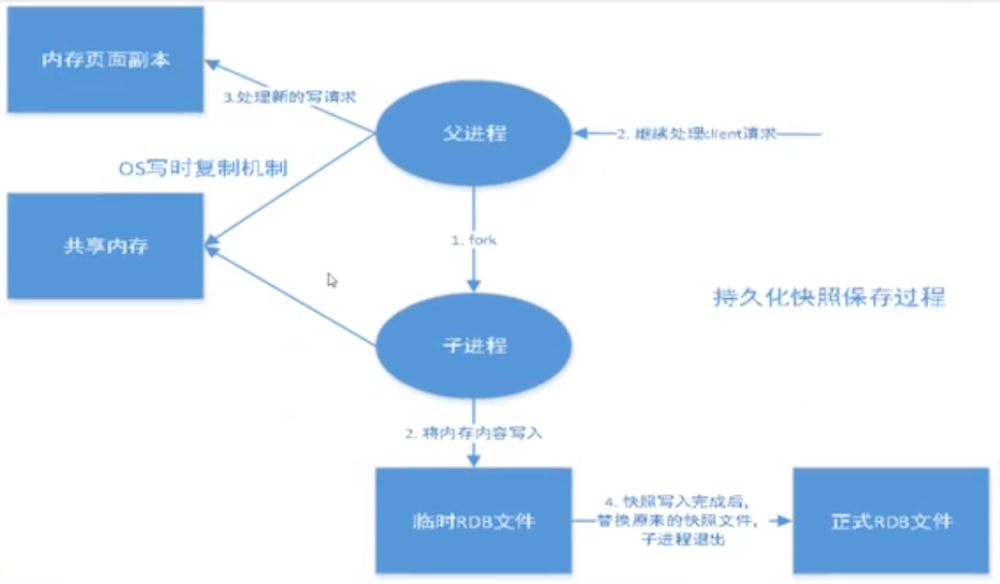
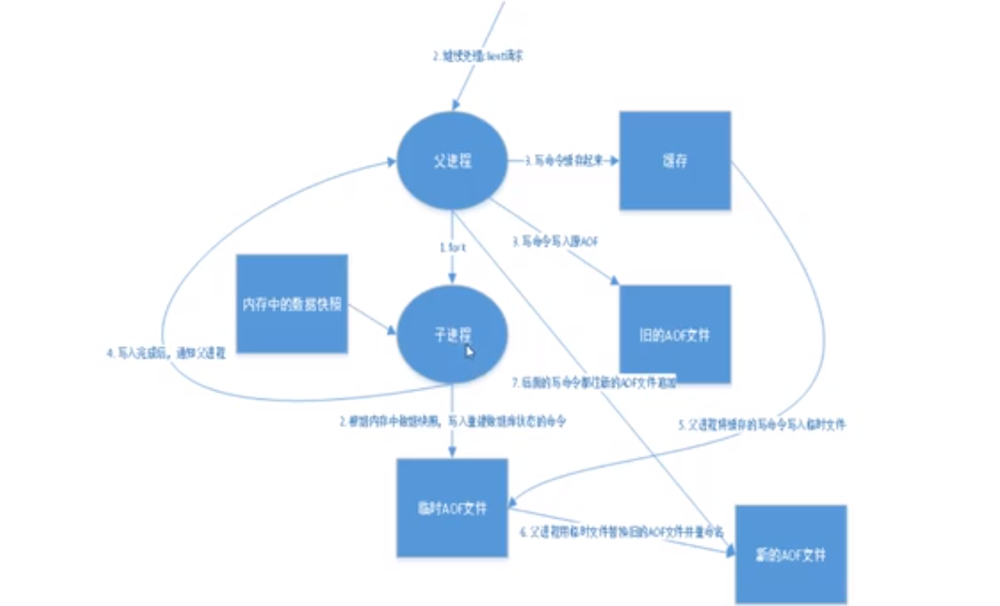
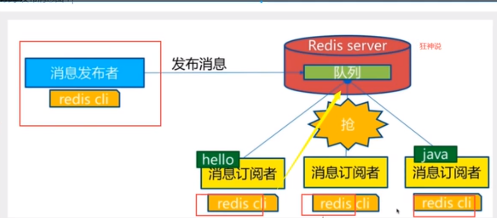
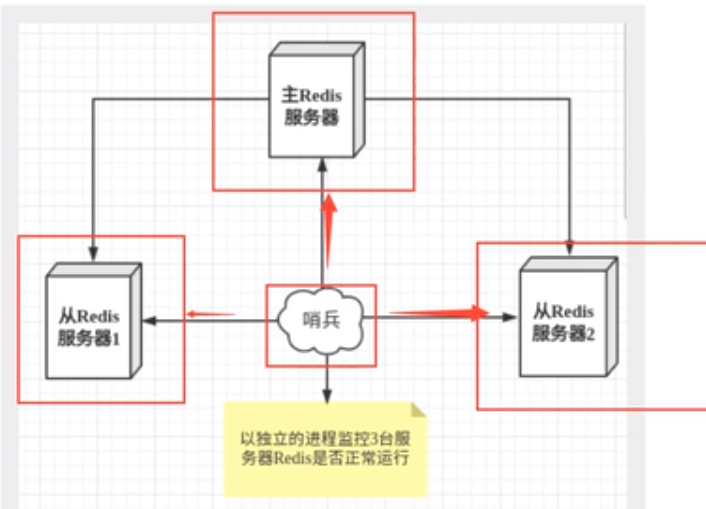

# Redis

[妈妈再也不担心我面试被Redis问得脸都绿了](https://www.cnblogs.com/wmyskxz/p/12568926.html)

[彻底搞懂Redis的线程模型](https://www.jianshu.com/p/6264fa82ac33)

## nosql

大数据：一般的数据库无法进行分析处理。

单机mysql：数量大，索引过大，读写混合的访问

memcached：缓存+mysql+垂直拆分（利用缓存解决数据库的读问题——读写分离）

分库分表+水平拆分+mysql集群：muisam（表锁），innodb（行锁），分库分表（根据业务来拆分数据表）

nosql：信息量爆炸增长，关系型数据库无法解决问题（not only sql）

nosql：泛指非关系型数据库。以键值对来控制数据

### 特点

1. 方便扩展，数据之间没有关系，可以扩展
2. 大数据量高性能（nosql的缓存记录级，是一种细粒度的缓存，性能高）
3. 数据类型多样，不需要设计数据库
4. 传统数据库和nosql
   - 传统数据库
     - 结构化组织
     - sql查询
     - 数据和关系都存在单独的表中
     - 操作操作，数据定义语言
     - 严格的一致性
     - 基础的事务
   - nosql
     - 没有固定的查询语言
     - 最终一致性定理
     - CAP定理和BASE（异地多活）
     - 键值对存储，列存储，文档存储

# 非关系型数据库的优势

1. 性能NOSQL是基于键值对的，可以想象成表中的主键和值的对应关系，而且不需要经过SQL层的解析，所以性能非常高。

2. 可扩展性同样也是因为基于键值对，数据之间没有耦合性，所以非常容易水平扩展。

# 关系型数据库的优势

1. 复杂查询可以用SQL语句方便的在一个表以及多个表之间做**join**非常复杂的数据查询（比如MongoDB的多表连接效率就不高）。

2. 事务支持使得对于安全性能很高的数据访问要求得以实现。对于这两类数据库，对方的优势就是自己的弱势，反之亦然。

### 3V和3高

3V：

- 海量volume
- 多样variety
- 实时velocity

3高

- 高并发
- 高可扩
- 高性能

### 四大分类

#### 键值对（KV）

- 新浪：Redis
- 美团：Redis+Tair
- 阿里，百度：Redis+memecache

#### 文档型数据库

- MongoDB
  - 基于分布式文件存储的数据库
  - 基于关系型和非关系型数据中中间的产品

#### 列存储数据库

- HBase

#### 图关系数据库

## Redis——redis官网查询

远程字典服务：会周期性地把更新的数据写入磁盘或者把修改操作写入追加的记录文件，并且在此基础上实现主从（master-slave）同步，

- 内存存储，持久化，rdb，aof
- 效率高，高速缓存
- 发布订阅系统
- 地图信息分析
- 计时器

### 特点

- 多样的数据类型
- 持久化
- 集群
- 事务

### 基本命令

ping：测试链接

set：设置基本值

get：获取值

keys *：查看当前数据库所有的键

redis-benchmark：测试命令`redis-benchmark -h localhost -p 6379 -c 100 -n 100000`

EXISTS：查看某个键是否存在 `EXISTS name`

move：移除某个键到另一个数据库 `move name 1`移动键name到数据库1 

EXPIRE：为某个键设置生存时间 `EXPIRE name 10`生存10秒

ttl：查看某个键的剩余生存时间`ttl name`

type：查看键的数据类型

APPEND：向某个键追加字符串`APPEND name "hello"`

STRLEN:输出某个键对应值的长度

incr/decr：执行加一减一操作

INCRBY/DECRBY：按照步长进行增减

GETRANGE：截取区间的值`GETRANGE name 0 3`获取[0,3]的子串

SETRANGE：修改指定位置开始的字符串，`SETRANGE name 1 xx`把name的值从1开始两位设置为xx

setex：设置过期时间`setex key 20 "hello"`20秒的生存时间

setnx：如果不存在键就设置

mset：设置多个值 `mset k1 v1 k2 v2`

mget：获取多个键的值`mget k1 k2 k3`

msetnx:如果不存在再设置，如果有一个设置不成功，就全部设置失败 `msetnx k1 v1 k4 v4`

getset：获取，如果没有就返回null并设置新的值，如果有返回原来的值，并设置新的值 `getset k1 v1`

官网查看命令

### redis基础知识

1. 默认具有16个数据库，默认使用第0个数据库，可以用select来选择数据库 `select 3`，`DBSIZE`查看数据库的大小，`flushdb`清除当前的数据库的内容，`FLUSHALL`清空全部的数据库
2. 默认的端口：6379
3. redis是单线程的，redis由c语言编写，基于内存操作的，采用多路I/O复用模型，CPU不是redis的性能瓶颈，其瓶颈来自于机器的内存以及网络带宽，可以使用单线程实现，就采用单线程实现：
   - redis将是所有的数据存放在内存中，使用单线程进行操作效率最高，多线程会有CPU上下文切换，该操作比较费时。
   - 由于不能有效地利用CPU，因此可以通过在主机上开启多个redis实例来完成
   - redis是基于reactor模式开发的网络事件处理器，其中的文件事件分派队列是单线程的，所以才称之为单线程模型
   - [彻底搞懂Redis的线程模型](https://www.jianshu.com/p/6264fa82ac33)
   - [Redis 到底是单线程还是多线程？我要吊打面试官！](https://www.cnblogs.com/javastack/p/12848446.html)


## 消息处理流程

- 文件事件处理器使用I/O多路复用(multiplexing)程序来同时监听多个套接字，并根据套接字目前执行的任务来为套接字关联不同的事件处理器。
- 当被监听的套接字准备好执行连接应答(accept)、读取(read)、写入(write)、关闭(close)等操作时，与操作相对应的文件事件就会产生，这时文件事件处理器就会调用套接字之前关联好的事件处理器来处理这些事件。


### 五大数据类型

#### String

value可以使用字符串和数字类型

#### List

可以用于实现栈和队列。

相关命令——以l开头，（双端队列）

LPUSH：向list中插入数值，栈操作 `LPUSH list one`向list中插入“one”

LRANGE：从list中获取指定范围的值，查询出来的是与插入倒序的，`LRANGE list 0 -1`获取全部的值，

LPOP：从左边（第一个）弹出一个值`LPOP list`

RPOP：从右边(最后)移除一个值`RPOP list`

lindex:通过下标获取值 `lindex list 1`

Llen：返回列表长度

Lrem：移除指定的元素 `Lrem list 1 three` 从列表中移除一个 three，要求精确匹配,如果count的值大于0，从头开始移除，如果count小于0，从尾部开始移除

ltrim：截取指定长度的值（使用下标）`ltrim list 1 2`

rpoplpush:移除列表最后一个元素并存入一个列表中`rpoplpush list sonlist`

lset：向指定的位置设置一个值 `lset list 0 item`把0位置的值设置为item，如果索引不存在会报错

linsert：向某个位置插入一个值`linsert list before/after "world" "other"`再world之前插入other

##### 实现

使用一个链表来进行实现

- 如果key不存在，创建一个新的链表
- 如果key存在，新增内容
- 如果移除了所有值，空链表也代表不存在

#### SET

set中的值不允许重复，以“s”开头

sadd：向集合插入元素`sadd myset ok`

SMEMBERS:返回set中所有的值

SISMEMBER：判断某个值是否在集合中，`SISMEMBER myset ok`

scard：获取set中的元素个数

srem：移除set中的指定元素`srem myset ok`

SRANDMEMBER:随机选择一个元素

spop：随机移除一个元素

smove：移动指定元素到另一个集合中`smove myset myset2 "ok"`

SDIFF：差集`SDIFF myset1 myset2`

sinter：交集`sinter myset1 myset2`

sunion：并集`SUNION myset1 myset2`

#### hash

map集合，key-map集合，以h开头的命令

hset：设置一个哈希表`hset myhash fields "ok"`

hget:获取指定字段的值`hget myhash fields`

hmset：同时设置多个k-v对`hmset myhash fields "ok" fields2 “ok2`

hmget：同时获取多个键值对`hget myhash fields fields2`

hgetall：获取全部的字段`hgetall myhash`

hdel：删除指定字段，`hdel myhash fields`

hlen：返回哈希中的键值对

HEXIST：判断指定的字段值是否存在

hINCRBY：指定的字段进行自增

hkeys：只获得所有key

hvals：只获得所有的value

#### Zset（有序集合）—— 跳跃表（可以实现链表的二分查找近似实现）

在set的基础上增加了一个值，这个值用于排序

zadd：`zadd myset 1 one`添加一个值

zrange：返回指定范围的值

ZRANGEBYSCORE：`zrangebyscore set min max withscore`输出指定范围内的值，会按照从小到大排列输出

zrem：移除指定的字段

zrevrange：从大到小的遍历输出

zcount：获取指定区间的成员数量`zcount myset 1 3`

zcard:获取集合中的成员数量

#### geospatial

提供地理空间位置的计算key<经度，维度，位置>

GEOADD：	`geoadd china:city 116 29 beijing`添加地址经纬度（先经度后维度），南北极不可以添加，有一定的地址范围

GEODIST:返回两个人之间的距离`geodist china:city beijing chongqing km` 

GEOHASH: 返回一个经过编码的哈希值，实际上就是把经纬度变成一个字符串

GEOPOS：获取指定城市的经纬度 `geopos china:city beijing`

GEORADIUS:以指定地点为中心查找半径内的其他位置 `GEORADIUS china:city 110 30  500 km withcord`withcord输出地址，withdist：输出距离 count：限制输出的数量

GEORADIUSBYMEMBER：找出位于指定元素位置附近的其他位置`GEORADIUSBYMEMBER china:city beijing 100 km`

底层的实现原理：Zset，所以这个表实际上可以用zset的相关命令来进行操作

#### hyperloglog

一种数据结构（有点类似于set，但是占用的空间很小）——基数统计算法，PF开头的命令（统计集合中的不重复元素个数）

优点：占用的内存很小，存在一个很小的错误率

PFadd：`PFadd mykey a b c d`

PFCOUNT：统计数量

PFMERGE：合并两个集合 `PFMERGE mykey1 mykey2`

#### bitmaps

位存储

setbit ：设置位 `setbit sign 0 1`

getbit：获取一个位，`getbit sign 1`

bitcount: 统计

### 事务

redis事务本质：一组命令的集合，一个事务中的所有命令都会被序列化，在事务执行的过程中，都会按照顺序执行

特性：一次性，顺序性，排他性

redis事务没有隔离级别的概念，入队后在执行执行命令（exec）

redis单挑命令是保证原子性的，但是事务不能保证原子性

redis事务：

- 开启事务（Multi）
- 命令入队
- 执行事务（exec）
- 放弃事务（DISCARD）

#### 编译型异常

代码有问题，事务中所有的代码都不会执行

#### 运行时异常

代码没有问题，但是代码在运行时出错，仅有错误的命令不能执行，其他的命令能够正常执行

### redis锁——乐观锁

watch命令，设置监视某一个变量，使用的原理为version，对监视的对象设置一个版本号

```bash
watch money
multi
DECRBY money 20
INCRBY out 20
exec
```

当有其他的线程修改了money，就会提交失败，返回结果为null

### Jedis

引入相关的java依赖包

```java
Jedis jedis = new Jedis("127.0.0.1",6379);
//事务
Transaction multi = jedis.multi();
jedis.watch();
multi.exec();
multi.discard();
```

### springboot-redis

jedis：使用直连，多个线程操作的话，并不安全，BIO

netty：采用netty，实例可以在多个线程中共享，保证线程安全

导入配置

自定义redisTemplate

### redis-config

需要通过配置文件进行启动——redis.conf

配置文件 

unit：单位,对大小写不敏感

include:可以包含一些子文件

bind：绑定ip

port：端口

protected-mode:保护模式

daemonize：以守护进程的方式进行，默认是no

pidfile:以守护线程的方式进行时需要该文件

loglevel：日志级别

logfile：日志的文件位置

databases：数据库数量

快照：持久化，在规定的时间内，执行了多少次操作，会持久化到文件.rdb.aof，redis是内存数据库，如果没有持久化，那么数据会端点丢失

配置文件的字段为：save 900 10 指900s内有10key进行了操作，就会持久化

maxclient：最大的客户端数量

maxmemory：最大内存

maxmemory-policy：达到最大内存之后的处理方式

- volatile-lru：使用 LRU 算法进行数据淘汰（淘汰上次使用时间最早的，且使用次数最少的 key），只淘汰设定了有效期的 key

- allkeys-lru：使用 LRU 算法进行数据淘汰，所有的 key 都可以被淘汰

- volatile-random：随机淘汰数据，只淘汰设定了有效期的 key

- allkeys-random：随机淘汰数据，所有的 key 都可以被淘汰

- volatile-ttl：淘汰剩余有效期最短的 key


appendonly no:默认不开启不开启aof持久化

appendfilename：持久化的文件的名字

appendfsync ：设置同步策略

## RDB



在指定的时间间隔内将内存中的数据集快照写入磁盘，也就是将snapshot快照写入磁盘，在恢复数据时将快照文件读到内存中，

redis会单独创建一个(fork)一个子进程来进行持久化，会先将数据写入一个临时文件，待持久化过程都结束，在用这个临时文件替换上次持久化好的文件，真个过程中，主进程是不进行任何IO操作的，确保性能。如果需要进行大规模的恢复，且对于数据恢复的完整性不是很敏感，RDF的方式比AOF高效，但缺点是最后一次持久化的数据可能丢失。默认使用的就是rdb

保存的文件：dump.rdb

产生rdb的情况：

1. save规则能够被满足
2. flushall
3. exit

恢复数据

只要把dump.rdb文件放在启动目录下，就会自动进行恢复

## AOF

append only file

以日志的方式来记录每个写操作，将redis执行过的所有指令记录下来，只许追加文件但不允许改写文件，redis启动时会读取该文件来重新构建数据，redis重启的话就根据日志文件的内容将写指令从前到后执行一次以完成数据的恢复。

记录的文件：appendnly.aof

该文件被破坏会导致数据出错。可以用redis-check-aof用于修复aof文件，命令为：`redis-check-aof --fix`



## redis发布订阅

消息通信模式：发送者发送信息，订阅者接收信息

redis客户端可以订阅任何数量的频道

发送者-频道-订阅



SUBSCRIBE:订阅频道`subscribe channel`

PUBLISH：向频道发布信息`PUBLISH channel "hello"`向channel发送hello

原理：C编写的语言

通过SUBSCRIBE命令订阅频道之后，redis-server里维护了一个字典，字典的键就是一个频道，而字典的值是一个链表，链表中保存了所有订阅该频道的客户端，

通过PUBLISH命令发送消息，redis-server会使用给定的频道作为键，将他维护的channel字典中查找记录了订阅该频道的客户端链表，遍历链表并发送消息给所有订阅者

使用场景：

1. 实时聊天系统
2. 实时消息系统
3. 订阅，关注系统

## Redis主从复制

主从复制:指将一台redis服务器的数据，复制到其他的redis服务器，前者称为主节点(master/leader)，后者称为从节点(slave/follower)，数据的复制是单向的，只能从主节点复制到从节点，主节点以写为主，slave以读为主。

默认情况下：每台redis服务器都是主节点，且一个主节点可以有多个从节点，但一个从节点只能有一个主节点。

主从复制的作用包括：

1. 数据冗余：主从复制实现了数据的热备份，是持久化之外的数据冗余方式
2. 故障恢复：当主节点出现问题时，可以由从节点提供服务，实现快速的故障恢复
3. 负载均衡：在主从复制的基础上实现读写分离，可以由主节点提供写服务，由从节点提供读服务，分担服务器负担，尤其在写少，读多的情况下，
4. 高可用基石：主从复制是哨兵和集群的基础

#### 配置

只需要配置从机就可以了

操作配置文件——复制conf文件并修改配置文件信息

info replication：查看主机信息

SLAVEOF:设置从机的配置`SLAVEOF 127.0.0.1 6379`ip和端口

主机中的数据会自动被从机进行保存，主机只能写不能读，从机只能读不能写，通过命令行设置的从机

#### 原理

slave启动之后会向master发送一个sync命令，master收到命令之后启动后台的存盘进程，同时收集所有接收到的用于修改数据集的命令，在后台进程执行完毕之后，master将传送整个数据文件到slave，并完成一次完全同步

增量复制：master继续将新的收集到的修改命令一次传递给slave，完成同步

全量复制：slave服务在接收到数据库文件数据后，将其存盘并加载到内存中——只要重新连接master，就会执行这个过程

slaveof no one:设置自己为主机，

#### 缺点

​		1】、Redis不具备自动容错和恢复功能，主机从机的宕机都会导致前端部分读写请求失败，需要等待机器重启或者手动切换前端的IP才能恢复。

​         2】、主机宕机，宕机前有部分数据未能及时同步到从机，切换IP后还会引入数据不一致的问题，降低了系统的可用性。

​         3】、Redis的主从复制采用全量复制，复制过程中主机会fork出一个子进程对内存做一份快照，并将子进程的内存快照保存为文件发送给从机，这一过程需要确保主机有足够多的空余内存。若快照文件较大，对集群的服务能力会产生较大的影响，而且复制过程是在从机新加入集群或者从机和主机网络断开重连时都会进行，也就是网络波动都会造成主机和从机间的一次全量的数据复制，这对实际的系统运营造成了不小的麻烦。

​        4】、Redis较难支持在线扩容，在集群容量达到上限时在线扩容会变得很复杂。为避免这一问题，运维人员在系统上线时必须确保有足够的空间，这对资源造成了很大的浪费。

### 哨兵

当主机宕机时，剩余的从机会自动选择一台变为主机

原理：投票——redis提供一个哨兵的命令，哨兵是一个独立的进程，作为进程，它会独立地运行，哨兵通过发送命令，等待redis服务器地相应，从而运行监控多个redis实例



正常情况下，如果需要配置哨兵，那么哨兵也不会只有一个


如果主机重新连接，那么原主机也只能作为新主机的从机

哨兵配置文件——sentinel.conf

```bash
sentinel monitor myredis 127.0.0.1 6379 1
```

monitor 名称 主机 端口 有多少个哨兵认为主机挂了才认为它挂了

启动命令`redis-sentinal sentinel.conf`

## 缓存和雪崩

### 缓存穿透（查不到）

用户查询一个数据，发现redis缓存中没有，也就是缓存没有命中，于是向持久层数据库查询，发现也没有，本次查询就失败了，如果有大量的用户进行此种查询就会给持久层数据造成很大的压力

使用布隆过滤器来过滤，对所有可能查询的参数以hash形式进行存储，在控制层先进行校验，不符合就丢弃，避免查询造成的压力，或者为查不到的数据设置一个空对象

### 缓存击穿（查的太多）

指某一个key非常热点，在不停地大并发，大并发对同一个点进行访问，当这个key在失效的瞬间，持续的大并发就被穿破缓存，查询数据库，给数据库造成压力

#### 解决方案

设置热点数据不过期

设置分布式锁

### 缓存雪崩（指缓存层整体失效）

指在某一个时间段，缓存集中失效，造成redis宕机

解决方案

1. 高可用
2. 限流降级
3. 数据预热
4. 给不同的键值设置不同的缓存过期时间

### 数据库双写一致性问题

数据库和缓存的数据不一样

#### 更新操作执行策略

- 先操作数据库，再操作缓存
- 先操作缓存，再操作数据库

无论我们选择哪个，我们都希望这**两个操作要么同时成功，要么同时失败**。所以，这会演变成一个**分布式事务**的问题。

##### 操作缓存

- 更新缓存
- 删除缓存

一般我们都是采取**删除缓存**缓存策略的，原因如下：

1. 高并发环境下，无论是先操作数据库还是后操作数据库而言，如果加上更新缓存，那就**更加容易**导致数据库与缓存数据不一致问题。(删除缓存**直接和简单**很多)
2. 如果每次更新了数据库，都要更新缓存【这里指的是频繁更新的场景，这会耗费一定的性能】，倒不如直接删除掉。等再次读取时，缓存里没有，那我到数据库找，在数据库找到再写到缓存里边(体现**懒加载**)

##### 先更新数据库，再删除缓存

正常的情况是这样的：

- 先操作数据库，成功；
- 再删除缓存，也成功；

如果原子性被破坏了：

- 第一步成功(操作数据库)，第二步失败(删除缓存)，会导致**数据库里是新数据，而缓存里是旧数据**。
- 如果第一步(操作数据库)就失败了，我们可以直接返回错误(Exception)，不会出现数据不一致。

**删除缓存失败的解决思路**：

- 将需要删除的key发送到消息队列中
- 自己消费消息，获得需要删除的key
- **不断重试删除操作，直到成功**

##### 先删除缓存，再更新数据库

正常情况是这样的：

- 先删除缓存，成功；
- 再更新数据库，也成功；

如果原子性被破坏了：

- 第一步成功(删除缓存)，第二步失败(更新数据库)，数据库和缓存的数据还是一致的。
- 如果第一步(删除缓存)就失败了，我们可以直接返回错误(Exception)，数据库和缓存的数据还是一致的。

**并发下解决数据库与缓存不一致的思路**：

- 将删除缓存、修改数据库、读取缓存等的操作积压到**队列**里边，实现**串行化**。

##### 对比两种策略

我们可以发现，两种策略各自有优缺点：

- 先删除缓存，再更新数据库

- - 在高并发下表现不如意，在原子性被破坏时表现优异

- 先更新数据库，再删除缓存(`Cache Aside Pattern`设计模式)

- - 在高并发下表现优异，在原子性被破坏时表现不如意

## 集群

Redis中存储的数据量大，一台主机的物理内存已经无法容纳 Redis的写请求并发量大，一个Redis实例以无法承载

Redis Cluster 的能力

能够自动将数据分散在多个节点上
当访问的 key 不在当前分片上时，能够自动将请求转发至正确的分片
当集群中部分节点失效时仍能提供服务

其中第三点是基于主从复制来实现的，Redis Cluster 的每个数据分片都采用了主从复制的结构，原理和前文所述的主从复制完全一致，唯一的区别是省去了 Redis Sentinel 这一额外的组件，由 Redis Cluster 负责进行一个分片内部的节点监控和自动 failover。

### 原理

- Redis Cluster 中共有 16384 个 hash slot，Redis 会计算每个 key 的 CRC16，将结果与 16384 取模，来决定该 key 存储在哪一个 hash slot 中，同时需要指定 Redis Cluster 中每个数据分片负责的 Slot 数。Slot 的分配在任何时间点都可以进行重新分配。
- 客户端在对 key 进行读写操作时，可以连接 Cluster 中的任意一个分片，如果操作的 key 不在此分片负责的 Slot 范围内，Redis Cluster 会自动将请求重定向到正确的分片上。

缺点：

- 维护难度增加。
- 客户端资源消耗增加
- 性能优化难度加大
- 事务和LUA的使用成本增加

## 调优

1. 使用连接池减少建立连接和销毁连接的时间开销

2. 使用pipeline和lua脚本减少请求次数

   