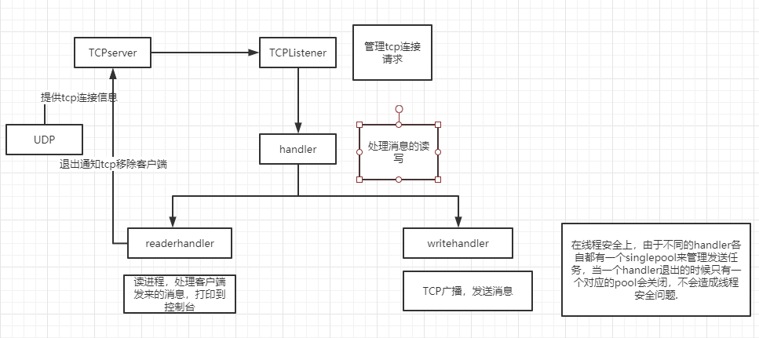
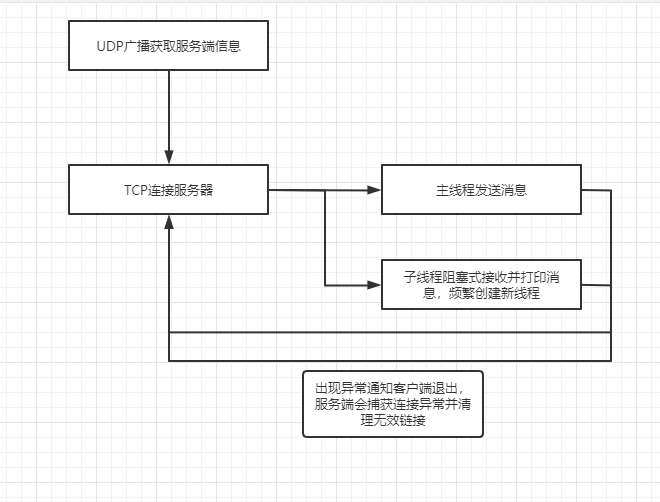
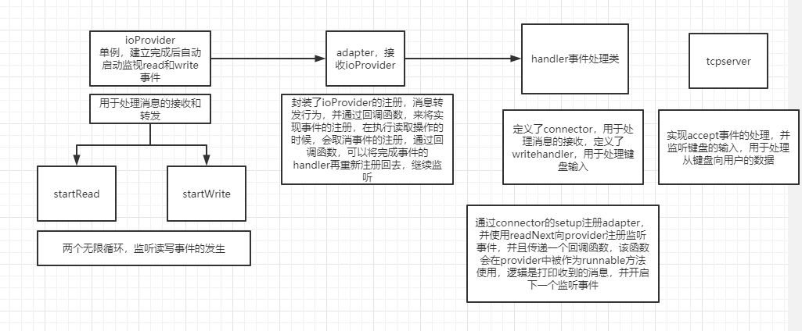
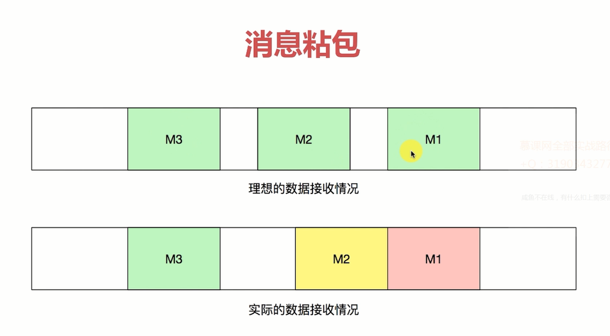
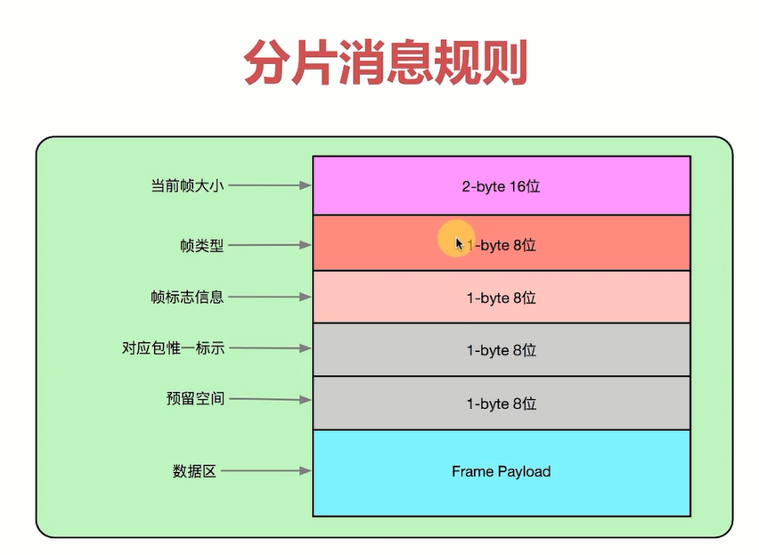

[网络学习笔记（二）：TCP可靠传输原理](https://juejin.im/post/6844903799253909512#heading-14)

### UDP编程

DatagramSocket：用于接受与发送UDP的类，与TCP不同，UDP没有被合并到socket中

DatagramSocket()创建一个实例，DatagramSocket(port)监听本及一个端口，DatagramSocket(host,port)监听指定主机的端口

receive():接收，send():发送，setSoTimeout:超时时间

DatagramPacket：用于处理报文，将byte数组，目标地址，目标端口包装为报文

DatagramPacket(byte[] buf,int offset,int lenth,inetAddres address,int port):前三个指定buf的使用区间，后两个指定目标机器地址与端口

setData()：向DatagramPacket传递数据，里面的参数都有对应的set函数

UDP完成单博，广播和多播

单播：点到点

广播：点对多（指定一个组，内部所有的人），一般只能在路由器的局域网内进行广播，主机号全为1的IP

多播：点对多（指定一个组，需要指定对象）

### 广播局域网的功能

一个主机向局域网中的设备发送信息，要求能够收到这些设备能够收到回送信息

设置监听255.255.255.255的30000端口作为监听，20000端口做发送，发送信息之后将消息会送到我方

### TCP

socket():创建一个Socket

bind:绑定一个Socket()到一个本地地址和端口上

connect：

accept：接受一个新的连接

write：把数据写入输出流

read：由数据输入流读取数据

### TCP传输可靠的保证

1. 排序，顺序发送，顺序发送——有序性
2. 丢弃和超时

数据传输，传输数据的时候使用的是bytes数组，因此对于long，int，string等需要使用byteBuffer.wrap来对buffer进行包装，之后可以通过相应的put方法以及get方法来获取指定的值。

### UDP辅助TCP的点到点传输

TCP：需要IP和端口

UDP不需要：

两者的结合可以使用UDP来进行广播，获取服务端的IP和端口，再使用TCP来进行连接

### 数据发送与接收并行

#### 多线程收发并行——tcp多线程收发协作

#### 聊天室传输协议

数据传输协议，服务端监听消息来源，客户端连接服务器并发送消息到服务器

数据协议：以换行符作为数据分割

#### 群聊的性能优化

1. 每个客户端与服务器双通等待
2. 双通：客户端发送消息到服务器的接收通道，服务器会送消息到发送通道，导致通道的阻塞

### 优化方案

1. 减少线程数量——采用线程池
2. 增加线程执行繁忙状态
3. 客户端buffer复用

### 阻塞IO和非阻塞IO

read方法等待阻塞，导致线程切换扫描等开销

#### 非阻塞IO

NIO编程

selector注册监听状态，主线程轮询询问状态变化，同步非阻塞

#### NIO实现聊天器——第一次优化，实现线程的非阻塞

通过selector注册事件，通过hanler处理建立好的连接，每个handler会开启两个线程进行读写操作，每个线程会有一个相应的注册器，分别监视读写的可执行性，写线程实际上没有使用到selector，不同的seletor之间是多线程的并行关系，分别管理不同的时间

#### NIO实现聊天器——第二次优化，实现监听与数据处理线程分离

使用一个线程来完成连接，使用另外的线程来完成读写过程

Connector：一个类，描述了一个连接的基本信息，用来保存一个类的基本信息，并具有关闭连接和转发消息的方法

IoArgs：buffer的封装类，封装buffer的发送行为

IOContext：上下文，实现的一个单例的IoProvider

IoProvider：注册接口

Receiver：接收接口

Sender：发送接口

IoSelectorProvider：接口实现类，完成事件注册，取消注册，关闭等逻辑，并具有最底层的事件实现逻辑，消息发送的最底层实现，要求传入一个runnable对象，并用map保存了，最后交给底层构建的线程池来完成。

Adapter：IoSelectorProvider的上层包装，提供一些经过封装的方法，用于完成消息接收与发送，底层就是IoSelectorProvider

TCPServer：具体的tcp服务器，底层为一个线程用于监听accept事件，监听到后，就交给adapter来完成read和write事件的监听的事件的具体实现过程，TCPserver在主线程上来处理服务器在键盘上的输入，将这些输入发送给客户端

暂时还没有完成消息转发的逻辑

### 数据传输稳定化

之前的实现里数据的分布采用的是‘\n’来分割数据，

消息粘包：

- TCP本质上并不会发生数据层面的粘包
- TCP的发送方与接收方一定会确保数据以一种有序的方式到达客户端
- UDP不保证消息完整性，会发生丢包现象
- 粘包：数据处理逻辑层面上的粘包

### 消息不完整

1. 物理传输层面上数据一定可以安全到达
2. 但是由于缓冲区不足或者数据处理层面上处理不够完整导致数据只能读取一部分

### 错误

- 多消息粘包，多个消息被拼成了一条消息，在上层连续发消息，但是这些消息合并为了一条
- 单消息不完整，buffer太小了
- 消息到达重复触发（之前通过取消对key的监听已经解决了）

### 有序地混传消息

1. 数据加上开始和结束标记——会导致对字节的遍历校验（消耗高）
2. 数据传输使用固定的头部——用前面的几个字节描述完整数据的字节数
3. 混合方案

定义数据封装的类，对数据进行转换——从bytes转变为IOargs以及逆向的转换，通过各种packet进行数据的封装

sendPacket：提供发送内容以及发送状态

receivePacket:将byte转换为指定的内容，如字符串，文件等

box：将各种类型的数据封装为byte或者将byte转变为相应的类型的组件

dispatcher：执行packet与ioargs的转换

1. 数据包的分析与特征提取
2. 数据头部构建
3. 数据头，数据体接收

#### Connector

##### socketChannel

###### sender

执行具体的发送逻辑，就是adapter，最终被发送的ioargs

###### receiver

执行具体的接收逻辑，就是adapter，接收到ioargs，后数据被写入packet

##### String

将string变成StringSendPacket，用于发送逻辑

##### StringReceive

将接收到的Packet变成String

##### sendDispatcher

存放一个队列，队列中的是packet，从队列中获取packet并将这部分数据转变为ioargs用于发送，交给sender，如果发送完了，就调用回调函数进行发送下一个报，或者继续发送给packet中未发送完的部分

### 文件传输

1. 文件的数据量比较大
2. 文件传输需要分片，组装分片
3. 文件传输需要中途取消而且不影响后续的packet发送
4. 文件传输校验，保证数据的安全性

注意点：

文件太大，不可以直接加载到内存的buffer中，之前传递字符串是直接将字符串变成一个bytes数组的。

解决

对文件进行分片，采用数据流的方式

#### 改进方式

将packet改成流传输，IoArgs改成流输入输出，diapatcher进行逻辑调整

整个项目被分成了三层，packet组件层，asyn控制层，server业务层。packet层通过回调回到业务层继续进行服务

此时的文件还没有进行分片

### 文件分片

问题

1. 发送中无法取消文件发送（用分片来实现）
2. 大文件传输容错率低
3. 同一个连接无法实现文件，普通消息优先级

#### 分片逻辑实现

- 根据文件大小计算分片，并读取数据到分片
- 分片数据固定格式打包发送
- 分片数据解析与分片组装
- dispatcher调度逻辑调整

帧大小：总长度

帧信息：命令，传输还是取消文件

帧标记：加密信息

对应包表示：包的序号——并发传输

数据区：

重点：分片数据的概念，数据包发送和接受实现

难点：数据分片并在穿插帧的情况下进行packet组合——将枕头的唯一标识保存到保存到hashmap做实现

## 调度优化

1. 系统部分端口无法进行分配
2. 系统单进程“文件句柄”最大限制
3. 

## 心跳包的构建

## 粘包、拆包解决办法

TCP本身是面向流的，作为网络服务器，如何从这源源不断涌来的数据流中拆分出或者合并出有意义的信息呢？通常会有以下一些常用的方法：

1、发送端给每个数据包添加包首部，首部中应该至少包含数据包的长度，这样接收端在接收到数据后，通过读取包首部的长度字段，便知道每一个数据包的实际长度了。

2、发送端将每个数据包封装为固定长度（不够的可以通过补0填充），这样接收端每次从接收缓冲区中读取固定长度的数据就自然而然的把每个数据包拆分开来。

3、可以在数据包之间设置边界，如添加特殊符号，这样，接收端通过这个边界就可以将不同的数据包拆分开。