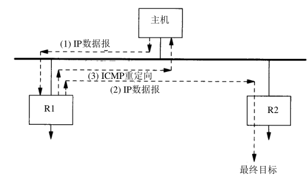

IP协议是不可靠的传输协议，无连接的协议

ARP具有一个高速缓存可以缓存地址解析信息

ICMP数据包


请求端填写发起时间戳，然后发送报文。应答系统收到请求报文时填写接收时间戳，在发送应答时填写传送时间戳。

## ping

该程序发送一份 I C M P回显请求报文给主机，并等待返回 I C M P回显应答

## ICMP重定向

当I P数据报应该被发送到另一个路由器时，收到数据报的路由器就要发送 I C M P重定向差错报文给I P数据报的发送端。



通过重定向的数据报告知主机以后要发给R2，而不是R1，减少路由中转

## 动态选路

当相邻路由器之间进行通信，以告知对方每个路由器当前所连接的网络，这时就出现了动态选路。路由器之间必须采用选路协议进行通信，这样的选路协议有很多种。路由器上有一个进程称为路由守护程序（ routing daemon），它运行选路协议，并与其相邻的一些路由器进行通信。路由守护程序根据它从相邻路由器接收到的信息，更新内核中的路由表。

### RIP

包含在UDP数据报中，


以路由跳数作为路由线路的选择标准，报文最长为504（25个路由信息）

### OSPF

 O S P F是一个链路状态协议。距离向量的意思是，R I P发送的报文包含一个距离向量（跳数）。每个路由器都根据它所接收到邻站的这些距离向量来更新自己的路由表。

在一个链路状态协议中，路由器并不与其邻站交换距离信息。它采用的是每个路由器主动地测试与其邻站相连链路的状态，将这些信息发送给它的其他邻站，而邻站将这些信息在自治系统中传播出去。每个路由器接收这些链路状态信息，并建立起完整的路由表。

OSPF直接使用IP而不用TCP或者UDP

### TFTP

以收到一个不足512字节的数据包作为结尾

T F T P是一个简单的协议，适合于只读存储器，仅用于无盘系统进行系统引导。它只使用几种报文格式，是一种停止等待协议

## TCP可靠性保证

- 应用数据被分割成TCP认为最适合发送的数据块。
- 当T C P发出一个段后，它启动一个定时器，等待目的端确认收到这个报文段。如果不能及时收到一个确认，将重发这个报文段。
-  当T C P收到发自T C P连接另一端的数据，它将发送一个确认。
- T C P将保持它首部和数据的检验和。这是一个端到端的检验和，目的是检测数据在传输过程中的任何变化。
- T C P报文段作为I P数据报来传输，而I P数据报的到达可能会失序，因此 T C P报文段的到达也可能会失序。
- I P数据报会发生重复，T C P的接收端必须丢弃重复的数据
- T C P还能提供流量控制。 T C P连接的每一方都有固定大小的缓冲空间。 T C P的接收端只允许另一端发送接收端缓冲区所能接纳的数据。
- T C P为应用层提供全双工服务。这意味数据能在两个方向上独立地进行传输。
- 检验和覆盖了整个的T C P报文段：T C P首部和TCP数据。

TCP状态图


### 检测半打开连接

如果一方已经关闭或异常终止连接而另一方却还不知道，我们将这样的 T C P连接称为半打开（H a l f - O p e n）的。任何一端的主机异常都可能导致发生这种情况。只要不打算在半打开连接上传输数据，仍处于连接状态的一方就不会检测另一方已经出现异常。

TCP的窗口（流量）控制会发送两个ACK文件，一个用于发送窗口大小，表示已经没有剩余的缓存空间了，另一个发送ack数据包

### 超时重传

T C P管理4个不同的定时器

1. 重传定时器使用于当希望收到另一端的确认。
2. 坚持( p e r s i s t )定时器使窗口大小信息保持不断流动，即使另一端关闭了其接收窗口。
3. 保活( k e e p a l i v e )定时器可检测到一个空闲连接的另一端何时崩溃或重启。
4. 2MSL定时器测量一个连接处于 T I M E _ WA I T状态的时间。

### time_wait过多

只有首先调用close()发起主动关闭的一方才会进入TIME_WAIT状态，而且是必须进入，进入TIME_WAIT状态的TCP连接需要经过2MSL才能回到初始状态，其中，MSL是指Max Segment Lifetime，即数据包在网络中的最大生存时间。当连接处于2MSL等待阶段时，任何迟到的报文段都将被丢弃。在 TIME_WAIT 状态时，两端的端口不能使用，要等到2MSL时间结束，才可继续使用。（IP 层）

 **TIME_WAIT状态存在的原因主要有两点：**

 1）为实现TCP这种全双工（full-duplex）连接的可靠释放

- 四次挥手的机制

 2）为使旧的数据包在网络因过期而消失

- 如果不存在time_wait机制，那么当一条新的连接建立的时候，可能会收到上一条相同的tcp连接发来的数据，由于tcp无法区分两个完全一样的连接，就可能会把这些过期的数据发到上层，导致问题

过多的原因：

主要出现在高并发环境下，使用大量短链接的情况，例如http里connection设置为close。这样的情况下会导致大量的连接处于time_wait状态

解决

1. 使用长连接
2. 缩短time_wait的时间
3. 回收time_wait的链接

1. 请画出三次握手和四次挥手的示意图
2. 为什么连接的时候是三次握手？
3. 什么是半连接队列？
4. ISN(Initial Sequence Number)是固定的吗？
5. 三次握手过程中可以携带数据吗？
6. 如果第三次握手丢失了，客户端服务端会如何处理？
7. SYN攻击是什么？
8. 挥手为什么需要四次？
9. 四次挥手释放连接时，等待2MSL的意义?


## 1. 三次握手

三次握手（Three-way Handshake）其实就是指建立一个TCP连接时，需要客户端和服务器总共发送3个包。进行三次握手的主要作用就是为了确认双方的接收能力和发送能力是否正常、指定自己的初始化序列号为后面的可靠性传送做准备。实质上其实就是连接服务器指定端口，建立TCP连接，并同步连接双方的序列号和确认号，交换`TCP窗口大小`信息。

刚开始客户端处于 Closed 的状态，服务端处于 Listen 状态。
进行三次握手：

- 第一次握手：客户端给服务端发一个 SYN 报文，并指明客户端的初始化序列号 ISN。此时客户端处于 `SYN_SENT` 状态。

  首部的同步位SYN=1，初始序号seq=x，SYN=1的报文段不能携带数据，但要消耗掉一个序号。

- 第二次握手：服务器收到客户端的 SYN 报文之后，会以自己的 SYN 报文作为应答，并且也是指定了自己的初始化序列号 ISN(s)。同时会把客户端的 ISN + 1 作为ACK 的值，表示自己已经收到了客户端的 SYN，此时服务器处于 `SYN_RCVD` 的状态。

  在确认报文段中SYN=1，ACK=1，确认号ack=x+1，初始序号seq=y。

- 第三次握手：客户端收到 SYN 报文之后，会发送一个 ACK 报文，当然，也是一样把服务器的 ISN + 1 作为 ACK 的值，表示已经收到了服务端的 SYN 报文，此时客户端处于 `ESTABLISHED` 状态。服务器收到 ACK 报文之后，也处于 `ESTABLISHED` 状态，此时，双方已建立起了连接。

  确认报文段ACK=1，确认号ack=y+1，序号seq=x+1（初始为seq=x，第二个报文段所以要+1），ACK报文段可以携带数据，不携带数据则不消耗序号。

发送第一个SYN的一端将执行主动打开（active open），接收这个SYN并发回下一个SYN的另一端执行被动打开（passive open）。

在socket编程中，客户端执行connect()时，将触发三次握手。


用更通俗的语言来解释三次握手过程：

- 服务端调用listen系统命令，进入监听状态，等待客户端的连接。
- 客户端向服务端发送`连接请求报文`，其中TCP标志位里SYN=1，ACK=0，选择一个初始的序号x。
- 服务端收到请求报文，向 客户端 发送`连接确认报文`，SYN=1，ACK=1，确认号为 x+1，同时也选择一个初始的序号 y。
- 客户端 收到 服务端的连接确认报文后，还要向 服务端 `发出确认`，确认号为 y+1，序号为 x+1。
- 服务端 收到 客户端 的确认后，`连接建立`。

### 1.1 为什么需要三次握手，两次不行吗？

第三次握手是为了防止`失效的连接请求到达服务器，让服务器错误打开连接`。

弄清这个问题，我们需要先弄明白三次握手的目的是什么，能不能只用两次握手来达到同样的目的。

- 第一次握手：客户端发送网络包，服务端收到了。
  这样服务端就能得出结论：客户端的发送能力、服务端的接收能力是正常的。
- 第二次握手：服务端发包，客户端收到了。
  这样客户端就能得出结论：服务端的接收、发送能力，客户端的接收、发送能力是正常的。不过此时服务器并不能确认客户端的接收能力是否正常。
- 第三次握手：客户端发包，服务端收到了。
  这样服务端就能得出结论：客户端的接收、发送能力正常，服务器自己的发送、接收能力也正常。

因此，需要三次握手才能确认双方的接收与发送能力是否正常。

试想如果是用两次握手，则会出现下面这种情况：

> 如客户端发出连接请求，但因连接请求报文丢失而未收到确认，于是客户端再重传一次连接请求。后来收到了确认，建立了连接。数据传输完毕后，就释放了连接，客户端共发出了两个连接请求报文段，其中第一个丢失，第二个到达了服务端，但是第一个丢失的报文段只是在**某些网络结点长时间滞留了，延误到连接释放以后的某个时间才到达服务端**，此时服务端误认为客户端又发出一次新的连接请求，于是就向客户端发出确认报文段，同意建立连接，不采用三次握手，只要服务端发出确认，就建立新的连接了，此时客户端忽略服务端发来的确认，也不发送数据，则服务端一致等待客户端发送数据，浪费资源。

### 1.2 什么是半连接队列？

服务器第一次收到客户端的 SYN 之后，就会处于 SYN_RCVD 状态，此时双方还没有完全建立其连接，服务器会把此种状态下请求连接放在一个**队列**里，我们把这种队列称之为**半连接队列**。

当然还有一个**全连接队列**，就是已经完成三次握手，建立起连接的就会放在全连接队列中。如果队列满了就有可能会出现丢包现象。

这里再补充一点关于**SYN-ACK 重传次数**的问题：
服务器发送完SYN-ACK包，如果未收到客户确认包，服务器进行首次重传，等待一段时间仍未收到客户确认包，进行第二次重传。如果重传次数超过系统规定的最大重传次数，系统将该连接信息从半连接队列中删除。
注意，每次重传等待的时间不一定相同，一般会是指数增长，例如间隔时间为 1s，2s，4s，8s……

> 关于建连接时`SYN超时`。试想一下，如果server端接到了clien发的SYN后回了SYN-ACK后client掉线了，server端没有收到client回来的ACK，那么，这个连接处于一个中间状态，即没成功，也没失败。于是，server端如果在一定时间内没有收到的TCP会重发SYN-ACK。在Linux下，默认重试次数为`5次`，重试的间隔时间从1s开始每次都翻售，5次的重试时间间隔为1s, 2s, 4s, 8s, 16s，总共31s，第5次发出后还要等32s都知道第5次也超时了，所以，总共需要 1s + 2s + 4s+ 8s+ 16s + 32s = 2^6 -1 = `63s`，TCP才会把断开这个连接。

### 1.3 ISN(Initial Sequence Number)是固定的吗？

当一端为建立连接而发送它的SYN时，它为连接选择一个初始序号。ISN随时间而变化，因此每个连接都将具有不同的ISN。ISN可以看作是一个32比特的计数器，每4ms加1 。这样选择序号的目的在于防止在网络中被延迟的分组在以后又被传送，而导致某个连接的一方对它做错误的解释。

**三次握手的其中一个重要功能是客户端和服务端交换 ISN(Initial Sequence Number)，以便让对方知道接下来接收数据的时候如何按序列号组装数据。如果 ISN 是固定的，攻击者很容易猜出后续的确认号，因此 ISN 是动态生成的**。

> 对于连接的3次握手，主要是要初始化Sequence Number 的初始值。通信的双方要互相通知对方自己的初始化的Sequence Number（缩写为ISN：Inital Sequence Number）。`这个号要作为以后的数据通信的序号，以保证应用层接收到的数据不会因为网络上的传输的问题而乱序`（TCP会用这个序号来拼接数据）。

### 1.4 三次握手过程中可以携带数据吗？

其实第三次握手的时候，是可以携带数据的。但是，**第一次、第二次握手不可以携带数据**。

为什么这样呢?大家可以想一个问题，假如第一次握手可以携带数据的话，如果有人要恶意攻击服务器，那他每次都在第一次握手中的 SYN 报文中放入大量的数据。因为攻击者根本就不理服务器的接收、发送能力是否正常，然后疯狂着重复发 SYN 报文的话，这会让服务器花费很多时间、内存空间来接收这些报文。

也就是说，**第一次握手不可以放数据，其中一个简单的原因就是会让服务器更加容易受到攻击了。而对于第三次的话，此时客户端已经处于 ESTABLISHED 状态。对于客户端来说，他已经建立起连接了，并且也已经知道服务器的接收、发送能力是正常的了，所以能携带数据也没啥毛病。**

### 1.5 SYN攻击是什么？

**服务器端的资源分配是在二次握手时分配的，而客户端的资源是在完成三次握手时分配的**，所以服务器容易受到SYN洪泛攻击。SYN攻击就是Client在短时间内伪造大量不存在的IP地址，并向Server不断地发送SYN包，Server则回复确认包，并等待Client确认，由于源地址不存在，因此Server需要不断重发直至超时，这些伪造的SYN包将长时间占用未连接队列，导致正常的SYN请求因为队列满而被丢弃，从而引起网络拥塞甚至系统瘫痪。SYN 攻击是一种典型的 DoS/DDoS 攻击。

检测 SYN 攻击非常的方便，当你在服务器上看到大量的`半连接状态`时，特别是源IP地址是随机的，基本上可以断定这是一次SYN攻击。在 Linux/Unix 上可以使用系统自带的 netstat 命令来检测 SYN 攻击。

```
netstat -n -p TCP | grep SYN_RECV
```

复制

常见的防御 SYN 攻击的方法有如下几种：

- 缩短超时（SYN Timeout）时间
- 增加最大半连接数
- 过滤网关防护
- SYN cookies技术

> 关于SYN Flood攻击。一些恶意的人就为此制造了SYN Flood攻击——给服务器发了一个SYN后，就下线了，于是服务器需要默认等`63s`才会断开连接，这样，攻击者就可以把服务器的syn连接的队列耗尽，让正常的连接请求不能处理。于是，Linux下给了一个叫`tcp_syncookies`的参数来应对这个事——当SYN队列满了后，TCP会通过源地址端口、目标地址端口和时间戳打造出一个特别的Sequence Number发回去（又叫cookie），如果是攻击者则不会有响应，如果是正常连接，则会把这个 SYN Cookie发回来，然后服务端可以通过cookie建连接（即使你不在SYN队列中）。请注意，请先千万别用tcp_syncookies来处理正常的大负载的连接的情况。因为，synccookies是妥协版的TCP协议，并不严谨。对于正常的请求，你应该调整三个TCP参数可供你选择，第一个是：`tcp_synack_retries` 可以用他来减少重试次数；第二个是：`tcp_max_syn_backlog`，可以增大SYN连接数；第三个是：`tcp_abort_on_overflow` 处理不过来干脆就直接拒绝连接了。

### 1.6 第三次握手失败怎么办？

当第三次握手失败时，服务器并不会重传ack报文，而是直接发送`RST报文段，进入CLOSED状态`。这样做的目的是为了`防止SYN洪泛攻击`。

**Server 端**

  第三次的ACK在网络中丢失，那么Server 端该TCP连接的状态为SYN_RECV,并且会根据 TCP的超时重传机制，会等待3秒、6秒、12秒后重新发送SYN+ACK包，以便Client重新发送ACK包。

  而Server重发SYN+ACK包的次数，可以通过设置/proc/sys/net/ipv4/tcp_synack_retries修改，默认值为5.

  如果重发指定次数之后，仍然未收到 client 的ACK应答，那么一段时间后，Server自动关闭这个连接。

**Client 端**

  在linux c 中，client 一般是通过 connect() 函数来连接服务器的，而connect()是在 TCP的三次握手的第二次握手完成后就成功返回值。也就是说 client 在接收到 SYN+ACK包，它的TCP连接状态就为 established （已连接），表示该连接已经建立。那么如果 第三次握手中的ACK包丢失的情况下，Client 向 server端发送数据，Server端将以 RST包响应，方能感知到Server的错误。

### 1.7 三次握手小结

三次握手建立连接的首要目的是`同步序列号`。只有同步了序列号才有可靠的传输，TCP 协议的许多特性都是依赖序列号实现的，比如流量控制、消息丢失后的重发等等，这也是三次握手中的报文被称为 SYN 的原因，因为 SYN 的全称就叫做 Synchronize Sequence Numbers。

#### 1.7.1 客户端

客户端发送 SYN 开启了三次握手，之后客户端连接的状态是 SYN_SENT，然后等待服务器回复 ACK 报文。正常情况下，服务器会在几毫秒内返回 ACK，但如果客户端迟迟没有收到 ACK 会怎么样呢？客户端会重发 SYN，重试的次数由 `tcp_syn_retries` 参数控制，默认是 6 次：

```
net.ipv4.tcp_syn_retries = 6
```

复制

第 1 次重试发生在 1 秒钟后，接着会以翻倍的方式在第 2、4、8、16、32 秒共做 6 次重试，最后一次重试会等待 64 秒，如果仍然没有返回 ACK，才会终止三次握手。所以，总耗时是 1+2+4+8+16+32+64=`127 秒`，超过 2 分钟。

如果这是一台有明确任务的服务器，你可以根据网络的稳定性和目标服务器的繁忙程度修改重试次数，调整客户端的三次握手时间上限。比如内网中通讯时，就可以适当调低重试次数，尽快把错误暴露给应用程序。

#### 1.7.2 服务端

当服务器收到 SYN 报文后，服务器会立刻回复 `SYN+ACK`报文，`既确认了客户端的序列号，也把自己的序列号发给了对方`。此时，服务器端出现了新连接，状态是 SYN_RCVD。这个状态下，服务器必须建立一个 `SYN 半连接队列`来维护未完成的握手信息，当这个队列溢出后，服务器将无法再建立新连接。


如果 SYN 半连接队列已满，只能丢弃连接吗？并不是这样，开启 `syncookies` 功能就可以在不使用 SYN 队列的情况下成功建立连接。syncookies 是这么做的：**服务器根据当前状态计算出一个值，放在己方发出的 SYN+ACK 报文中发出，当客户端返回 ACK 报文时，取出该值验证，如果合法，就认为连接建立成功**，如下图所示。


Linux 下怎样开启 syncookies 功能呢？修改 `tcp_syncookies` 参数即可，其中值为 0 时表示关闭该功能，2 表示无条件开启功能，而 1 则表示仅当 SYN 半连接队列放不下时，再启用它。由于 syncookie 仅用于应对 `SYN 泛洪攻击`（攻击者恶意构造大量的 SYN 报文发送给服务器，造成 SYN 半连接队列溢出，导致正常客户端的连接无法建立），这种方式建立的连接，许多 TCP 特性都无法使用。所以，`应当把 tcp_syncookies 设置为 1，仅在队列满时再启用`。

当客户端接收到服务器发来的 SYN+ACK 报文后，就会回复 ACK 去通知服务器，同时己方连接状态从 SYN_SENT 转换为 ESTABLISHED，表示连接建立成功。服务器端连接成功建立的时间还要再往后，到它收到 ACK 后状态才变为 ESTABLISHED。如果服务器没有收到 ACK，就会一直重发 SYN+ACK 报文。当网络繁忙、不稳定时，报文丢失就会变严重，此时应该调大重发次数。反之则可以调小重发次数。

`tcp_synack_retries` 的默认重试次数是`5 次`，与客户端重发 SYN 类似，它的重试会经历 1、2、4、8、16 秒，最后一次重试后等待 32 秒，若仍然没有收到 ACK，才会关闭连接，故共需要等待 `63 秒`。

服务器收到 ACK 后连接建立成功，此时，`内核会把连接从 SYN 半连接队列中移出，再移入 accept 队列，等待进程调用 accept 函数时把连接取出来`。如果进程不能及时地调用 accept 函数，就会造成 accept 队列溢出，最终导致建立好的 TCP 连接被丢弃。

实际上，丢弃连接只是 Linux 的默认行为，我们还可以选择向客户端发送 `RST 复位报文`，告诉客户端`连接已经建立失败`。打开这一功能需要将 `tcp_abort_on_overflow` 参数设置为 1。

## 2. 四次挥手

建立一个连接需要三次握手，而终止一个连接要经过四次挥手（也有将四次挥手叫做四次握手的）。这由TCP的**半关闭**（half-close）造成的。所谓的`半关闭`，其实就是TCP提供了连接的一端在结束它的发送后还能接收来自另一端数据的能力。

TCP 连接的拆除需要发送四个包，因此称为四次挥手(Four-way handshake)，客户端或服务端均可主动发起挥手动作。

刚开始双方都处于`ESTABLISHED` 状态，假如是客户端先发起关闭请求。四次挥手的过程如下：

- 第一次挥手：客户端发送一个 FIN 报文，报文中会指定一个序列号。此时客户端处于 `FIN_WAIT1` 状态。
  即发出**连接释放报文段**（FIN=1，序号seq=u），并停止再发送数据，主动关闭TCP连接，进入FIN_WAIT1（终止等待1）状态，等待服务端的确认。
- 第二次挥手：服务端收到 FIN 之后，会发送 ACK 报文，且把客户端的序列号值 +1 作为 ACK 报文的序列号值，表明已经收到客户端的报文了，此时服务端处于 `CLOSE_WAIT` 状态。
  即服务端收到连接释放报文段后即发出**确认报文段**（ACK=1，确认号ack=u+1，序号seq=v），服务端进入CLOSE_WAIT（关闭等待）状态，此时的TCP处于半关闭状态，客户端到服务端的连接释放。客户端收到服务端的确认后，进入FIN_WAIT2（终止等待2）状态，等待服务端发出的连接释放报文段。
- 第三次挥手：如果服务端也想断开连接了，和客户端的第一次挥手一样，发给 FIN 报文，且指定一个序列号。此时服务端处于 `LAST_ACK` 的状态。
  即服务端没有要向客户端发出的数据，服务端发出**连接释放报文段**（FIN=1，ACK=1，序号seq=w，确认号ack=u+1），服务端进入LAST_ACK（最后确认）状态，等待客户端的确认。
- 第四次挥手：客户端收到 FIN 之后，一样发送一个 ACK 报文作为应答，且把服务端的序列号值 +1 作为自己 ACK 报文的序列号值，此时客户端处于 `TIME_WAIT` 状态。需要过一阵子以确保服务端收到自己的 ACK 报文之后才会进入 CLOSED 状态，服务端收到 ACK 报文之后，就处于关闭连接了，处于 `CLOSED` 状态。
  即客户端收到服务端的连接释放报文段后，对此发出**确认报文段**（ACK=1，seq=u+1，ack=w+1），客户端进入TIME_WAIT（时间等待）状态。此时TCP未释放掉，需要经过时间等待计时器设置的时间2MSL后，客户端才进入CLOSED状态。

收到一个FIN只意味着在这一方向上没有数据流动。**客户端执行主动关闭并进入TIME_WAIT是正常的，服务端通常执行被动关闭，不会进入TIME_WAIT状态。**

在socket编程中，任何一方执行close()操作即可产生挥手操作。


通过上面的分析，可以看出四次挥手涉及两种报文：FIN 和 ACK。`FIN 就是 Finish 结束连接的意思，谁发出 FIN 报文，就表示它将不再发送任何数据，关闭这一方向的传输通道。ACK 是 Acknowledge 确认的意思，它用来通知对方：你方的发送通道已经关闭`。

四次挥手过程总结：

- 当主动方关闭连接时，会发送 FIN 报文，此时主动方的连接状态由 ESTABLISHED 变为 `FIN_WAIT1`。当被动方收到 FIN 报文后，内核自动回复 ACK 报文，连接状态由 ESTABLISHED 变为 `CLOSE_WAIT`，顾名思义，它在等待进程调用 close 函数关闭连接。当主动方接收到这个 ACK 报文后，连接状态由 FIN_WAIT1 变为 `FIN_WAIT2`，主动方的发送通道就关闭了。
- 再来看被动方的发送通道是如何关闭的。当被动方进入 CLOSE_WAIT 状态时，进程的 read 函数会返回 0，这样开发人员就会有针对性地调用 `close 函数`，进而触发内核发送 FIN 报文，此时被动方连接的状态变为 `LAST_ACK`。当主动方收到这个 FIN 报文时，内核会自动回复 ACK，同时连接的状态由 FIN_WAIT2 变为 TIME_WAIT，Linux 系统下大约 `1 分钟`后 TIME_WAIT 状态的连接才会彻底关闭。而被动方收到 ACK 报文后，连接就会关闭。

### 2.1 挥手为什么需要四次？

这是因为 TCP 不允许连接处于`半打开状态`时就单向传输数据，所以在三次握手建立连接时，服务器会把 ACK 和 SYN 放在一起发给客户端，其中，ACK 用来打开客户端的发送通道，SYN 用来打开服务器的发送通道。这样，原本的四次握手就降为三次握手了。

但是当连接处于`半关闭状态`时，TCP 是允许单向传输数据的。为便于理解，我们把先关闭连接的一方叫做主动方，后关闭连接的一方叫做被动方。当主动方关闭连接时，被动方仍然可以在不调用 close 函数的状态下，长时间发送数据，此时连接处于**半关闭状态**。这一特性是 TCP 的`双向通道互相独立所致`，却也使得关闭连接必须通过四次挥手才能做到。

### 2.2 2MSL等待状态

TIME_WAIT状态也称为`2MSL等待状态`。每个具体TCP实现必须选择一个报文段最大生存时间MSL（Maximum Segment Lifetime），它是任何报文段被丢弃前在网络内的最长时间。这个时间是有限的，因为TCP报文段以IP数据报在网络内传输，而IP数据报则有限制其生存时间的TTL字段。

对一个具体实现所给定的MSL值，处理的原则是：当TCP执行一个主动关闭，并发回最后一个ACK，该连接必须在TIME_WAIT状态停留的时间为2倍的MSL。这样可让TCP再次发送最后的ACK以防这个ACK丢失（另一端超时并重发最后的FIN）。

这种2MSL等待的另一个结果是这个TCP连接在2MSL等待期间，定义这个连接的插口（客户的IP地址和端口号，服务器的IP地址和端口号）不能再被使用。这个连接只能在2MSL结束后才能再被使用。

### 2.3 四次挥手释放连接时，等待2MSL的意义?

> **MSL**是Maximum Segment Lifetime的英文缩写，可译为“最长报文段寿命”，它是任何报文在网络上存在的最长时间，超过这个时间报文将被丢弃。

为了保证客户端发送的最后一个ACK报文段能够到达服务器。因为这个ACK有可能丢失，从而导致处在LAST-ACK状态的服务器收不到对FIN-ACK的确认报文。服务器会超时重传这个FIN-ACK，接着客户端再重传一次确认，重新启动时间`等待计时器`。最后客户端和服务器都能正常的关闭。假设客户端不等待2MSL，而是在发送完ACK之后直接释放关闭，一但这个ACK丢失的话，服务器就无法正常的进入关闭连接状态。

#### 两个理由：

1. **保证客户端发送的最后一个ACK报文段能够到达服务端**。

   这个ACK报文段有可能丢失，使得处于LAST-ACK状态的服务端收不到对已发送的FIN+ACK报文段的确认，服务端超时重传FIN+ACK报文段，而客户端能在2MSL时间内收到这个重传的FIN+ACK报文段，接着客户端重传一次确认，重新启动2MSL计时器，最后客户端和服务端都进入到CLOSED状态，若客户端在TIME-WAIT状态不等待一段时间，而是发送完ACK报文段后立即释放连接，则无法收到服务端重传的FIN+ACK报文段，所以不会再发送一次确认报文段，则服务端无法正常进入到CLOSED状态。

2. **防止“已失效的连接请求报文段”出现在本连接中**。

   客户端在发送完最后一个ACK报文段后，再经过2MSL，就可以使本连接持续的时间内所产生的所有报文段都从网络中消失，使下一个新的连接中不会出现这种旧的连接请求报文段。

> 关于 MSL 和 TIME_WAIT。通过上面的ISN的描述，相信你也知道MSL是怎么来的了。我们注意到，在TCP的状态图中，从TIME_WAIT状态到CLOSED状态，有一个超时设置，这个超时设置是 2*MSL（[RFC793](https://tools.ietf.org/html/rfc793)定义了MSL为2分钟，Linux设置成了30s）为什么要这有TIME_WAIT？为什么不直接给转成CLOSED状态呢？主要有两个原因：1）TIME_WAIT确保有足够的时间让对端收到了ACK，如果被动关闭的那方没有收到Ack，就会触发`被动端重发Fin，一来一去正好2个MSL`，2）有足够的时间让这个连接不会跟后面的连接混在一起（你要知道，有些自做主张的路由器会缓存IP数据包，如果连接被重用了，那么这些延迟收到的包就有可能会跟新连接混在一起）。

### 2.4 为什么TIME_WAIT状态需要经过2MSL才能返回到CLOSE状态？

TIME_WAIT 状态的连接，在主动方看来确实已经关闭了。然而，被动方没有收到 ACK 报文前，连接还处于 LAST_ACK 状态。如果这个 ACK 报文没有到达被动方，被动方就会`重发` FIN 报文。

`如果主动方不保留 TIME_WAIT 状态，会发生什么呢？`此时连接的端口恢复了自由身，可以`复用于新连接了`。然而，被动方的 FIN 报文可能再次到达，这既可能是网络中的路由器重复发送，也有可能是被动方没收到 ACK 时基于 tcp_orphan_retries 参数重发。这样，`正常通讯的新连接就可能被重复发送的 FIN 报文误关闭`。保留 TIME_WAIT 状态，就可以应付重发的 FIN 报文，当然，其他数据报文也有可能重发，所以 TIME_WAIT 状态还能避免数据错乱。

理论上，四个报文都发送完毕，就可以直接进入CLOSE状态了，但是可能网络是不可靠的，有可能最后一个ACK丢失。所以**TIME_WAIT状态就是用来重发可能丢失的ACK报文**。

### 2.5 TIME-WAIT状态过多怎么办

TIME-WAIT状态如果过多，会占用系统资源。Linux下有几个参数可以调整TIME-WAIT状态时间：

- net.ipv4.tcp_tw_reuse = 1 表示开启重用。允许将TIME-WAIT sockets重新用于新的TCP连接，默认为0，表示关闭。
- net.ipv4.tcp_tw_recycle = 1 表示开启TCP连接中TIME-WAIT sockets的快速回收，默认为0，表示关闭。
- net.ipv4.tcp_max_tw_buckets = 5000表示系统同时保持TIME_WAIT套接字的最大数量，如果超过这个数字，TIME_WAIT套接字将立刻被清除并打印警告信息。默认为180000，改为5000。

`在socket的TIME_WAIT状态结束之前，该socket所占用的本地端口号将一直无法释放。高TCP并发并且采用短连接方式进行通讯的通讯系统在高并发高负载下运行一段时间后，就常常会出现做为客户端的程序无法向服务端建立新的socket连接的情况。`此时用“netstat -tanlp”命令查看系统将会发现机器上存在大量处于TIME_WAIT状态的socket连接，并且占用大量的`本地端口号`。最后，当该机器上的可用本地端口号被占完（或者达到用户可使用的文件句柄上限），而旧的大量处于TIME_WAIT状态的socket尚未被系统回收时，就会出现无法向服务端创建新的socket连接的情况。此时系统几乎停转，空有再好的性能也发挥不出来。

解决TIME-WAIT状态过多的情况，一般做法是`打开系统的TIMEWAIT重用和快速回收`。然而，`主动进行关闭的链接才会进入TIME-WAIT状态`，所以最好的办法：尽量不要让服务器主动关闭链接，除非一些异常情况，如客户端协议错误、客户端超时等等。

解决方法？

- 修改TIME_WAIT连接状态的上限值
- 启动快速回收机制
- 开启复用机制
- 修改短连接为长连接方式
- 由客户端来主动断开连接

## 3. 总结

《TCP/IP详解 卷1:协议》有一张TCP状态变迁图，很具有代表性，有助于大家理解三次握手和四次挥手的状态变化。如下图所示，粗的实线箭头表示正常的客户端状态变迁，粗的虚线箭头表示正常的服务器状态变迁。


[**以后面试官再问你三次握手和四次挥手，直接把这一篇文章丢给他就可以了，他想问的都在这里。**](https://www.cnblogs.com/lfs2640666960/p/12111879.html)

## TIME_WAIT和CLOSE_WAIT

### socket连接的定义

socket 其实就是一个五元组，包括：源IP, 源端口, 目的IP, 目的端口, 类型(TCP or UDP) . 这个五元组，即标识了一条可用的连接。

总所周知，由于socket是全双工的工作模式，一个socket的关闭，是需要四次握手来完成的:
1) 主动关闭连接的一方，调用close()；协议层发送FIN包 ;
2) 被动关闭的一方收到FIN包后，协议层回复ACK；然后被动关闭的一方，进入CLOSE_WAIT状态，主动关闭的一方等待对方关闭，则进入FIN_WAIT_2状态；此时，主动关闭的一方等待被动关闭一方的应用程序，调用close操作 ;
3) 被动关闭的一方在完成所有数据发送后，调用close()操作；此时，协议层发送FIN包给主动关闭的一方，等待对方的ACK，被动关闭的一方进入LAST_ACK状态；
4) 主动关闭的一方收到FIN包，协议层回复ACK；此时，主动关闭连接的一方，进入TIME_WAIT状态；而被动关闭的一方，进入CLOSED状态 ;
5) 等待2MSL时间，主动关闭的一方，结束TIME_WAIT，进入CLOSED状态 ;

通过上面的一次socket关闭操作，可以得出以下几点：
1) 主动关闭连接的一方 – 也就是主动调用socket的close操作的一方，最终会进入TIME_WAIT状态 ;
2) 被动关闭连接的一方，有一个中间状态，即CLOSE_WAIT，因为协议层在等待上层的应用程序，主动调用close操作后才主动关闭这条连接 ;
3) TIME_WAIT会默认等待2MSL时间后，才最终进入CLOSED状态；
4) 在一个连接没有进入CLOSED状态之前，这个连接是不能被重用的！

所以说这里凭直觉看，TIME_WAIT并不可怕，CLOSE_WAIT才可怕，因为CLOSE_WAIT很多，表示说要么是你的应用程序写的有问题，没有合适的关闭socket；要么是说，你的服务器CPU处理不过来（CPU太忙）或者你的应用程序一直睡眠到其它地方(锁，或者文件I/O等等)，你的应用程序获得不到合适的调度时间，造成你的程序没法真正的执行close操作。

#### CLOSE_WAIT

出现大量的这种状态证明程序有问题，需要检查程序，

### TIME_WAIT

使用短链接，缩短time_wait时间，复用time_wait的连接

### 状态转移过程

客户端TCP状态迁移:
CLOSED -> SYN_SENT -> ESTABLISHED -> FIN_WAIT_1 -> FIN_WAIT_2 -> TIME_WAIT -> CLOSED
服务器TCP状态迁移:
CLOSED -> LISTEN -> SYN收到 -> ESTABLISHED -> CLOSE_WAIT -> LAST_ACK -> CLOSED
当客户端开始连接时,服务器还处于LISTENING,客户端发一个SYN包后,他就处于SYN_SENT状态,服务器就处于SYS收到状态,然后互相确认进入连接状态ESTABLISHED.