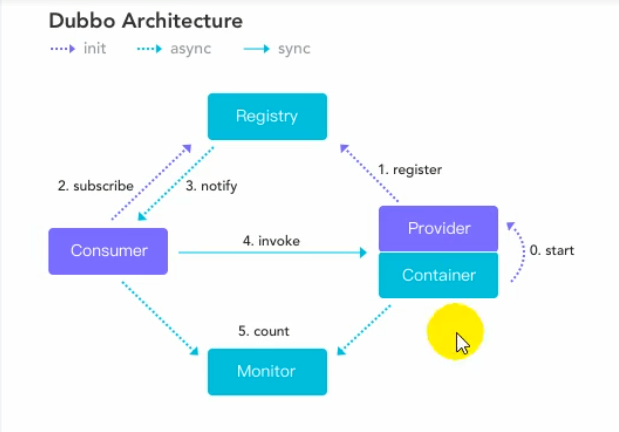
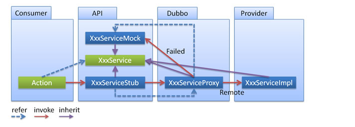
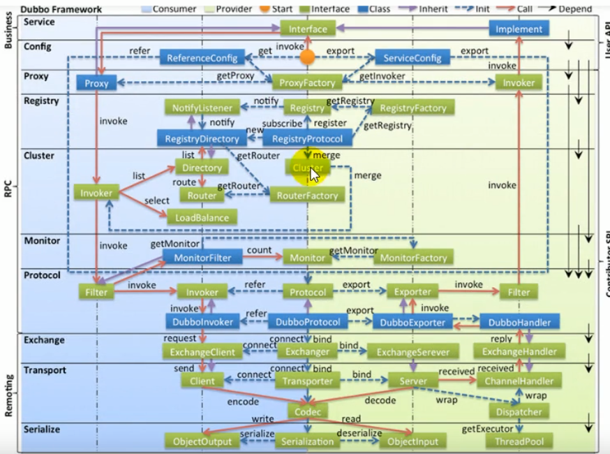

# Dubbo

## 应用架构

### 单一应用架构

网络浏览较少，访问量少

优点：简单

缺点：扩展不易，更新不易，对服务器压力较大

### 垂直应用架构

springMVC——对一个完整程序拆分为多个独立模块

优点：分工容易，扩展容易

缺点：页面和业务逻辑的实现分离，垂直应用随着事件会逐步增加，大量的应用之间需要交互

### RPC架构——分布式架构

不同的服务处在不同的服务器下，与上面的两个不同，上面的两个只要完成进程内通信就可以，但这个需要由RPC来实现进程间的通信

关键要解决的问题，不同的业务需要的资源不同，需要一个调度中心来实现对业务资源的调度

### 流动计算架构——SOA

基于访问压力实时管理集群容量，提高集群利用率，负载均衡

## Dubbo——RPC

1. 面向接口的RPC调用
2. 智能负载均衡
3. 服务的自动注册与发现
4. 高度可扩展能力
5. 运行流量调度
6. 可视化的服务治理与运维

dubbo-admin管理控制台，使用jar包的方式运行

### dubbo配置-spring方式

1. 将服务提供者注册到注册中心(暴露服务)
   1. 导入dubbo依赖，以及zookeeper的客户端操作的引入(curator)
   2. 配置服务提供者
      1. 需要编写dubbo的配置文件
      2. 指定当前服务应用的名字
      3. 指定注册中心的位置
      4. 指定通信规则，（通信协议以及端口）
      5. 声明需要暴露的接口以及其正真的实现，该实现需要作为bean添加到spring中
   3. 配置消费者
      1. 声明需要调用的远程服务的接口，生成远程服务代理
      2. 引用相应的暴露的接口

## 与springboot的整合

编写好相应的provider，consumer以及相应的interface工程之后就可以使用，编写好相应的controller，service

1. 导入dubbo-starter依赖
2. 导入dubbo的其他依赖
3. 编写对应的properties文件，注册中心，服务等，和上面的一样

可使用的配置包括，dubbo.properties,application.properties,-D虚拟机参数，优先级逐渐变高

## dubbo的一些功能

### 启动时检查

消费者启动时会检查它所需要的服务已经在注册中心了

### 超时设置

在网络出现问题时提供帮助，提供服务的快速响应

设置的优先级：

- 精确优先：方法级优先，接口级次之，全局配置再次之
- 消费者设置优先：**级别相同**，消费方优先，提供方次之

### 重试次数

在调用失败之后提供重试机制，重试次数是不包含第一次调用的，这些重试方法只能够在幂等的方法【查询，删除，修改】上进行设置，非幂等【新增】

### 多版本

设置version属性，更改调用的版本

### 本地存根

在调用实际的代理对象之前可以做一些额外的操作，例如容错等

## springboot与dubbo整合的方式

1. 导入dubbo-starter，在application.properties配置属性，使用@service暴露服务，使用@Reference引用服务、并使用EnableDubbo开启基于注解的dubbo功能
2. 保留dubbo配置文件（xml文件），并使用@ImportResource()来导入xml文件
3. 使用注解API的方式——将每一个组件手动创建用于容器中

## 高可用场景

注册中心挂掉了，仍然可以使用服务，

1. 监控中心宕掉不影响使用，只是丢失部分采样数据
2. 数据库宕掉之后，注册中心仍能够通过缓存提供服务列表查询，但不能注册新服务
3. 注册中心对等集群，任意一台宕掉之后，自动切换到另一台
4. 注册中心全部宕掉之后，服务提供者和消费者仍能够通过本地缓存通讯
5. 服务提供者无状态，任意一台宕掉不影响使用
6. 服务提供者全部宕掉，消费者无法使用服务

### 负载均衡机制

1. 基于权重的轮询负载均衡机制
2. 最少活跃数-负载均衡机制
3. 一致性hash-负载均衡机制（调用方法名与参数的hash来决定）

可以在配置文件中配置采用的负载均衡机制

### 服务降级

在服务压力剧增的情况下，对一些服务和页面有策略地不处理或者换种简单地方式处理，保证服务器资源以及核心交易正常运作或高效运作

这一块是对消费者的设置，相当于停止消费者的获取服务的能力，例如服务A调用服务B，但是服务B下线了，导致服务A重试多次不成功，这个时候应该给用户返回统一的返回结果，并能够表示有错误，

### 集群容错

当集群调用服务时，出现错误时，采用的策略

1. failback cluster:后台记录失败的请求，之后重发
2. forking cluster：并行调用多个服务器，只要一个成功就返回
3. broadcast cluster：广播，只要一个失败就认为失败，用于更新缓存或者日志等本地资源
4. failfast cluster：发起一次调用，失败就返回，用于非幂等操作
5. failsafe cluster：出现异常就直接忽略

## dubbo框架设计图

### 工作流程

- 第一步：provider 向注册中心去注册
- 第二步：consumer 从注册中心订阅服务，注册中心会通知 consumer 注册好的服务
- 第三步：consumer 调用 provider
- 第四步：consumer 和 provider 都异步通知监控中心

### 注册中心挂了可以继续通信吗？

可以，因为刚开始初始化的时候，消费者会将提供者的地址等信息**拉取到本地缓存**，所以注册中心挂了可以继续通信。

### dubbo支持的协议

- dubbo 协议

**默认**就是走 dubbo 协议，单一长连接，进行的是 NIO 异步通信，基于 hessian 作为序列化协议。使用的场景是：传输数据量小（每次请求在 100kb 以内），但是并发量很高。

为了要支持高并发场景，一般是服务提供者就几台机器，但是服务消费者有上百台，可能每天调用量达到上亿次！此时用长连接是最合适的，就是跟每个服务消费者维持一个长连接就可以，可能总共就 100 个连接。然后后面直接基于长连接 NIO 异步通信，可以支撑高并发请求。

- rmi 协议

走 Java 二进制序列化，多个短连接，适合消费者和提供者数量差不多的情况，适用于文件的传输，一般较少用。

- http 协议

走表单序列化。

### Dubbo负载均衡策略

#### RandomLoadBalance

默认情况下，dubbo 是 RandomLoadBalance ，即**随机**调用实现负载均衡，可以对 provider 不同实例**设置不同的权重**，会按照权重来负载均衡，权重越大分配流量越高，一般就用这个默认的就可以了。

#### RoundRobinLoadBalance

这个的话默认就是均匀地将流量打到各个机器上去，但是如果各个机器的性能不一样，容易导致性能差的机器负载过高。所以此时需要调整权重，让性能差的机器承载权重小一些，流量少一些。

#### LeastActiveLoadBalance

官网对 `LeastActiveLoadBalance` 的解释是“**最小活跃数负载均衡**”，活跃调用数越小，表明该服务提供者效率越高，单位时间内可处理更多的请求，那么此时请求会优先分配给该服务提供者。

#### ConsistentHashLoadBalance

一致性 Hash 算法，相同参数的请求一定分发到一个 provider 上去，provider 挂掉的时候，会基于虚拟节点均匀分配剩余的流量，抖动不会太大。**如果你需要的不是随机负载均衡**，是要一类请求都到一个节点，那就走这个一致性 Hash 策略。

### Dubbo Spi思想

### spi 是啥？

spi，简单来说，就是 `service provider interface` ，说白了是什么意思呢，比如你有个接口，现在这个接口有 3 个实现类，那么在系统运行的时候对这个接口到底选择哪个实现类呢？这就需要 spi 了，需要**根据指定的配置**或者是**默认的配置**，去**找到对应的实现类**加载进来，然后用这个实现类的实例对象。

配置相关的文件或者使用接口

### 服务治理

#### . 调用链路自动生成

一个大型的分布式系统，或者说是用现在流行的微服务架构来说吧，**分布式系统由大量的服务组成**。那么这些服务之间互相是如何调用的？调用链路是啥？说实话，几乎到后面没人搞的清楚了，因为服务实在太多了，可能几百个甚至几千个服务。需要基于 dubbo 做的分布式系统中，对各个服务之间的调用自动记录下来，然后自动将**各个服务之间的依赖关系和调用链路生成出来**，

#### 2. 服务访问压力以及时长统计

需要自动统计**各个接口和服务之间的调用次数以及访问延时**，而且要分成两个级别。

- 一个级别是接口粒度，就是每个服务的每个接口每天被调用多少次，TP50/TP90/TP99，三个档次的请求延时分别是多少；
- 第二个级别是从源头入口开始，一个完整的请求链路经过几十个服务之后，完成一次请求，每天全链路走多少次，全链路请求延时的 TP50/TP90/TP99，分别是多少。

### 服务降级

比如说服务 A 调用服务 B，结果服务 B 挂掉了，服务 A 重试几次调用服务 B，还是不行，那么直接降级，走一个备用的逻辑，给用户返回响应。

### 失败重试和超时重试

所谓失败重试，就是 consumer 调用 provider 要是失败了，比如抛异常了，此时应该是可以重试的，或者调用超时了也可以重试。