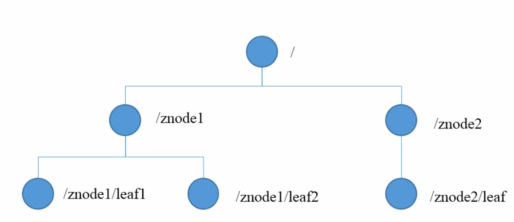

# zookeeper

基于观察者模式设计的分布式服务管理框架，负责存储和管理数据，然后接收观察者的注册，一旦这些数据的状态发生变化，就负责通知已经在zookeeper上注册的观察者做出的反应

基本的情况就是服务器启动时，将信息注册到zookeeper集群中，然后告知客户端有服务器可以访问，当服务器下线时，就会通知客户端对应的服务器不可用

## 特点

1. 一个leader，多个follower
2. 集群中只要有半数以上的节点存活，集群就能正常工作
3. 全局数据一致，每个Server保存一份相同的数据副本，保持数据一致性
4. 更新请求会按照顺序进行，来自同一个client的更新请求按其发送顺序依次执行
5. 数据更新原子性
6. 实时性，在一定事件范围内，client 能读到的数据是最新的

## 数据结构

树形结构，每个节点称之为znode，每一个znode默认存储1mb数据，

## 应用场景

统一命名服务：需要对应用服务进行统一命名

统一配置管理：分布式环境下，配置文件同步比较常见，例如要求一个集群中，所有节点的配置信息是一致的，对配置文件进行修改之后，希望能快速同步到各个节点，可将这些信息写入到zookeeper上的znode中，各个客户端监听这个znode，一旦znode中的数据被修改，就会由zookeeper来通知各个客户端服务器

统一集群管理：分布式环境中实时掌握个节点的状态

服务器动态上下线：客户端可以实时洞察到服务器上下线的变化

负载均衡：

[【分布式】Zookeeper的Leader选举](https://www.cnblogs.com/leesf456/p/6107600.html)

[Zookeeper的选举算法和脑裂问题深度讲解](https://my.oschina.net/timestorm/blog/3110115)

## 选举机制

1. 半数机制;只要有半数以上的节点存活，集群就能正常工作
2. zookeeper配置文件中没有指定master和slaver，但是zookeeper工作时是有一个节点作为leader，其他的作为follwer的，

**1. 选举阶段 Leader election**

最大ZXID也就是节点本地的最新事务编号，包含epoch和计数两部分。epoch是纪元的意思，相当于Raft算法选主时候的term，标识当前leader周期，每次选举一个新的Leader服务器后，会生成一个新的epoch

- 所有节点处于**Looking状态**，各自依次发起投票，投票包含自己的服务器ID和最新事务ID（ZXID）。
- 如果发现别人的ZXID比自己大，也就是数据比自己新，那么就重新发起投票，投票给目前已知最大的ZXID所属节点。
- 每次投票后，服务器都会统计投票数量，判断是否有某个节点得到**半数以上**的投票。如果存在这样的节点，该节点将会成为准Leader，状态变为Leading。其他节点的状态变为Following。

**2. 发现阶段 Discovery**

- 为了防止某些意外情况，比如因网络原因在上一阶段产生多个Leader的情况。
- Leader集思广益，接收所有Follower发来各自的最新epoch值。Leader从中选出最大的epoch，基于此值加1，生成新的epoch分发给各个Follower。
- 各个Follower收到全新的epoch后，返回ACK给Leader，带上各自最大的ZXID和历史事务日志。Leader选出最大的ZXID，并更新自身历史日志。

**3. 同步阶段 Synchronization**

Leader刚才收集得到的最新历史事务日志，同步给集群中所有的Follower。只有当**半数Follower同步成功**，这个准Leader**才能成为正式的Leader**。

### 选举状态

- LOOKING，竞选状态。
- FOLLOWING，随从状态，同步leader状态，参与投票。
- OBSERVING，观察状态,同步leader状态，不参与投票。
- LEADING，领导者状态。

在投票完成后，需要将投票信息发送给集群中的所有服务器，它包含如下内容。

- 服务器ID：编号越大在选择算法中的权重越大
- 数据ID：值越大说明数据越新，在选举算法中数据越新权重越大。
- 逻辑时钟：或者叫投票的次数，同一轮投票过程中的逻辑时钟值是相同的。每投完一次票这个数据就会增加，然后与接收到的其它服务器返回的投票信息中的数值相比，根据不同的值做出不同的判断。
- 选举状态

## 选举流程简述

目前有5台服务器，每台服务器均没有数据，它们的编号分别是1,2,3,4,5,按编号依次启动，它们的选择举过程如下：

- 服务器1启动，给自己投票，然后发投票信息，由于其它机器还没有启动所以它收不到反馈信息，服务器1的状态一直属于Looking。
- 服务器2启动，给自己投票，同时与之前启动的服务器1交换结果，由于服务器2的编号大所以服务器2胜出，但此时投票数没有大于半数，所以两个服务器的状态依然是LOOKING。
- 服务器3启动，给自己投票，同时与之前启动的服务器1,2交换信息，由于服务器3的编号最大所以服务器3胜出，此时投票数正好大于半数，所以服务器3成为领导者，服务器1,2成为小弟。
- 服务器4启动，给自己投票，同时与之前启动的服务器1,2,3交换信息，尽管服务器4的编号大，但之前服务器3已经胜出，所以服务器4只能成为小弟。
- 服务器5启动，后面的逻辑同服务器4成为小弟。

## QuorumCnxManager：网络I/O——使用tcp连接

　　每台服务器在启动的过程中，会启动一个QuorumPeerManager，负责各台服务器之间的底层Leader选举过程中的网络通信。

　　(1) **消息队列**。QuorumCnxManager内部维护了一系列的队列，用来保存接收到的、待发送的消息以及消息的发送器，除接收队列以外，其他队列都按照SID分组形成队列集合，如一个集群中除了自身还有3台机器，那么就会为这3台机器分别创建一个发送队列，互不干扰。

　　　　**· recvQueue**：消息接收队列，用于存放那些从其他服务器接收到的消息。

　　　　**· queueSendMap**：消息发送队列，用于保存那些待发送的消息，按照SID进行分组。

　　　　**· senderWorkerMap**：发送器集合，每个SenderWorker消息发送器，都对应一台远程Zookeeper服务器，负责消息的发送，也按照SID进行分组。

　　　　**· lastMessageSent**：最近发送过的消息，为每个SID保留最近发送过的一个消息。

　　(2) **建立连接**。为了能够相互投票，Zookeeper集群中的所有机器都需要两两建立起网络连接。QuorumCnxManager在启动时会创建一个ServerSocket来监听Leader选举的通信端口(默认为3888)。开启监听后，Zookeeper能够不断地接收到来自其他服务器的创建连接请求，在接收到其他服务器的TCP连接请求时，会进行处理。**为了避免两台机器之间重复地创建TCP连接**，Zookeeper只允许SID大的服务器主动和其他机器建立连接，否则断开连接。在接收到创建连接请求后，服务器通过对比自己和远程服务器的SID值来判断是否接收连接请求，如果当前服务器发现自己的SID更大，那么会断开当前连接，然后自己主动和远程服务器建立连接。一旦连接建立，就会根据远程服务器的SID来创建相应的消息发送器SendWorker和消息接收器RecvWorker，并启动。

　　(3) **消息接收与发送**。**消息接收**：由消息接收器RecvWorker负责，由于Zookeeper为每个远程服务器都分配一个单独的RecvWorker，因此，每个RecvWorker只需要不断地从这个TCP连接中读取消息，并将其保存到recvQueue队列中。**消息发送**：由于Zookeeper为每个远程服务器都分配一个单独的SendWorker，因此，每个SendWorker只需要不断地从对应的消息发送队列中获取出一个消息发送即可，同时将这个消息放入lastMessageSent中。在SendWorker中，一旦Zookeeper发现针对当前服务器的消息发送队列为空，那么此时需要从lastMessageSent中取出一个最近发送过的消息来进行再次发送，这是为了解决接收方在消息接收前或者接收到消息后服务器挂了，导致消息尚未被正确处理。同时，Zookeeper能够保证接收方在处理消息时，会对重复消息进行正确的处理。

## 脑裂问题

[脑裂是什么？Zookeeper是如何解决的？](https://cloud.tencent.com/developer/article/1475225)

**脑裂问题**出现在集群中leader死掉，follower选出了新leader而原leader又复活了的情况下，因为ZK的过半机制是允许损失一定数量的机器而扔能正常提供给服务，当leader死亡判断不一致时就会出现多个leader。过半选举机制可以保证不存在脑裂问题，要求大于而非大于等于

## 节点类型

持久：客户端和服务器端断开连接之后，创建的节点不删除

短暂：客户端和服务器端断开连接之后，创建的节点自己删除

## 监听器的原理

1. 首先有一个main()线程
2. 在main()线程中创建一个zookeeper客户端，这是会创建两个线程，一个监听另一个负荷网络通信
3. 通过·connect将注册的监听事件发给zookeeper
4. 在zookeeper的监听器列表中将监听的事件添加到列表
5. zookeeper监听到有数据或者路径变化就会将这个消息发送给监听线程，
6. 监听器线程内部调用了process()方法

## 写数据流程

1. client向zookeeper的server1上写数据，发送一个写请求
2. 如果server1不是leader，那么server1就会找到对应的leader，由leader将该写请求广播到所有的server上，执行写数据成功后，server会将相关的消息发送给leader
3. 当leader收到大多数server数据写成功之后就会认为写执行成功，leader会将写成功消息告知之前找他的server1，由server1再去通知client

## Zookeeper分布式锁

有了 zookeeper 的一致性文件系统，锁的问题变得容易。锁服务可以分为两类，一个是保持独占，另一个是控制时序。

对于第一类，我们将 zookeeper 上的一个 znode 看作是一把锁，通过 createznode的方式来实现。
所有客户端都去创建 /distribute_lock 节点，最终成功创建的那个客户端也即拥有了这把锁。
用完删除掉自己创建的 distribute_lock 节点就释放出锁。

对于第二类， /distribute_lock 已经预先存在，所有客户端在它下面创建临时顺序编号目录节点，和选 master 一样，编号最小的获得锁，用完删除，依次方便。