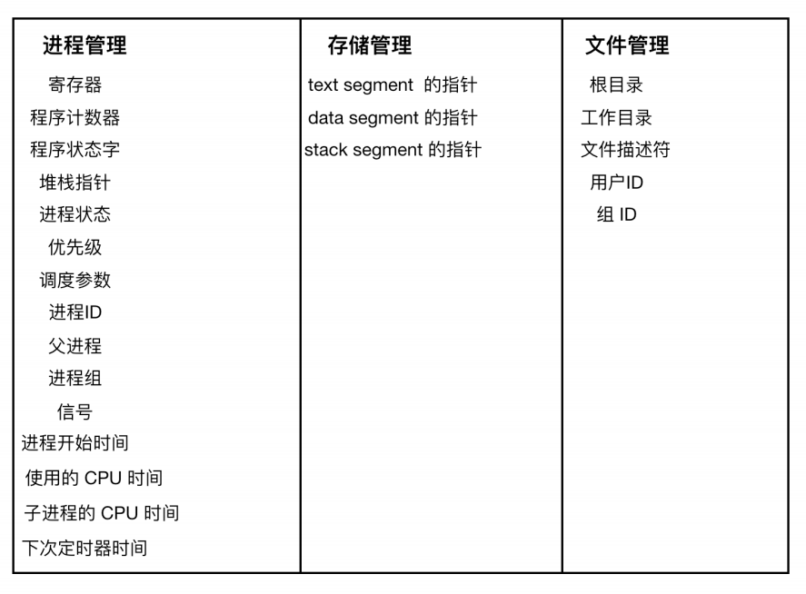

# Linux服务器最大tcp连接数

**如何标识一个TCP连接** 在确定最大连接数之前，先来看看系统如何标识一个tcp连接。系统用一个4四元组来唯一标识一个TCP连接：{local ip, local port,remote ip,remote port}。

**client最大tcp连接数** client每次发起tcp连接请求时，除非绑定端口，通常会让系统选取一个空闲的本地端口（local port），该端口是独占的，不能和其他tcp连接共享。tcp端口的数据类型是unsigned short，因此本地端口个数最大只有65536，端口0有特殊含义，不能使用，这样可用端口最多只有65535，所以在全部作为client端的情况下，最大tcp连接数为65535，这些连接可以连到不同的server ip。

**server最大tcp连接数** server通常固定在某个本地端口上监听，等待client的连接请求。不考虑地址重用（unix的SO_REUSEADDR选项）的情况下，即使server端有多个ip，本地监听端口也是独占的，因此server端tcp连接4元组中只有remote ip（也就是client ip）和remote port（客户端port）是可变的，因此最大tcp连接为客户端ip数×客户端port数，对IPV4，不考虑ip地址分类等因素，最大tcp连接数约为2的32次方（ip数）×2的16次方（port数），也就是server端单机最大tcp连接数约为2的48次方。

# [java int与integer的区别](https://www.cnblogs.com/shenliang123/archive/2011/10/27/2226903.html)

int 是基本类型，直接存数值，而integer是对象，用一个引用指向这个对象

1.Java 中的数据类型分为基本数据类型和复杂数据类型

int 是前者而integer 是后者（也就是一个类）；因此在类进行初始化时int类的变量初始为0.而Integer的变量则初始化为null.

# [抽象类和接口的区别](https://www.jianshu.com/p/038f0b356e9a)

抽象类可以有默认的方法实现完全是抽象的。接口根本不存在方法的实现。 

抽象类中可以有已经实现了的方法，也可以有被abstract修饰的方法（抽象方法），因为存在抽象方法，所以该类必须是抽象类。但是接口要求只能包含抽象方法，抽象方法是指没有实现的方法。

抽象类使用extends关键字来继承抽象类。如果子类不是抽象类的话，它需要提供抽象类中所有声明的方法的实现。子类使用关键字implements来实现接口。它需要提供接口中所有声明的方法的实现。接口的实现，通过implements关键字。实现该接口的类，必须把接口中的所有方法给实现。

抽象类可以有构造器，而接口不能有构造器，抽象方法可以有public、protected和default这些修饰符，接口方法默认修饰符是public。你不可以使用其它修饰符。

抽象类在java语言中所表示的是一种继承关系，一个子类只能存在一个父类，但是可以存在多个接口。

# ++和--是否是原子操纵

**i++分为三个阶段：**

内存到寄存器——寄存器自增——写回内存——这三个阶段中间都可以被中断分离开

# 垃圾回收的时候如何快速寻找到根节点？(安全点和OopMap)

​        在可达性分析法中，要先找到GC Root，GC Root多存在于全局性引用(常量和静态变量)和执行上下文(栈帧中本地变量表)，可是遍历这些地方会消耗大量时间，所以jvm提出了一个名为OopMap的数据结构，这个数据结构中存储有可能是GC Root的引用，当需要进行可达性分析时，通过遍历一组OopMap，可以快速完成GC Root的枚举。

在源代码编译的时候，会在特定位置下记录安全点，一般为：

- 循环的末尾；
- 方法返回前或者调用方法的call指令后；
- 可能抛出异常的位置。

通过安全点把代码分成几段，每段代码一个OopMap。

OopMap记录栈上本地变量到堆上对象的引用关系，每当触发GC的时候，程序都都先跑到最近的安全点然后自动挂起，然后再触发更新`OopMap`，然后进行枚举GC ROOT，进行垃圾回收：

# TCP问题

## 为什么要分成IP层和TCP层，不能由IP层来控制可靠传输

要这样进行分层的原因主要是因为效率问题，由于数据在网络上的传播需要多个设备一起工作，这些设备依靠IP来寻址，如果这些设备都负责确保数据传输可靠，验证数据传输正确，那么就会导致效率降低。

## 超时重传机制

TCP的可靠性是靠确认号的，且以字节数为单位的，并且只能回复确认最大连续收到包。

超时传递的时间定义如下：

> 1、先采样 RTT 2、SRTT = ( ALPHA * SRTT ) + ((1-ALPHA) * RTT) 3、RTO = min[UBOUND,max[LBOUND,(BETA*SRTT)]]

## 快速重传机制

超时重传机制适用于网络状况不好的情况，此外还存在一种情况是数据在网络上丢包，在这种情况下使用快速重传机制，快速重传指的是发送端如果连续三次收到对方相同的确认号，就立刻重传数据而不等待RTO时间。这种情况下采用SACK来标记丢失的包，SACK 就是接收方会回传它已经接受到的数据，这样发送方就知道哪一些数据对方已经收到了，所以就可以选择性的发送丢失的数据。

# 内存页表计算

一个有64MB物理内存的机器使用32位虚拟地址空间。假设内存页面大小为4KB，单个页表项的大小对齐到Byte，则整个页表的大小约为**2M**

计算过程如下：

内存以Byte为一个单位，32位指的是2的32次方Byte，虚拟地址32位，即4GB  

虚拟空间4G，一个页大小为4KB，即2的12次方Byte，也就是有：虚拟页号（20位）+页内地址（12位）的地址结构。  可以有2的20次方个虚页。  

物理空间64MB，即2的10+10+6次方Byte，页块空间对应，所以实际物理空间地址为：  实页号（14位）+页内地址（12位）。  

实页号（14）位就是一个页表项，需要14bit空间存储一个页表项，又因为页表项大小对其到Byte，所以用2B存储一个页表项  

共有虚页数个页表项，即有2的20次方个页表项，则整个页表大小位2的20+1次方个B，即2MB

# 操作系统进程

## 进程创建

- 系统初始化（init）：启动操作系统时，通常会创建若干个进程。
- 正在运行的程序执行了创建进程的系统调用（比如 fork）
- 用户请求创建一个新进程：在许多交互式系统中，输入一个命令或者双击图标就可以启动程序，以上任意一种操作都可以选择开启一个新的进程，在基本的 UNIX 系统中运行 X，新进程将接管启动它的窗口。
- 初始化一个批处理工作

## 进程终止

- `正常退出(自愿的)` ：多数进程是由于完成了工作而终止。当编译器完成了所给定程序的编译之后，编译器会执行一个系统调用告诉操作系统它完成了工作。这个调用在 UNIX 中是 `exit` ，在 Windows 中是 `ExitProcess`。
- `错误退出(自愿的)`：比如执行一条不存在的命令，于是编译器就会提醒并退出。
- `严重错误(非自愿的)`
- `被其他进程杀死(非自愿的)` ：某个进程执行系统调用告诉操作系统杀死某个进程。在 UNIX 中，这个系统调用是 kill。在 Win32 中对应的函数是 `TerminateProcess`（注意不是系统调用）。

## 进程实现

操作系统为了执行进程间的切换，会维护着一张表，这张表就是 `进程表(process table)`。每个进程占用一个进程表项。该表项包含了进程状态的重要信息，包括程序计数器、堆栈指针、内存分配状况、所打开文件的状态、账号和调度信息，以及其他在进程由运行态转换到就绪态或阻塞态时所必须保存的信息。

第一列内容与`进程管理`有关，第二列内容与 `存储管理`有关，第三列内容与`文件管理`有关。

## 进程中断处理与调度

1. 硬件压入堆栈程序计数器等
2. 硬件从中断向量装入新的程序计数器
3. 汇编语言过程保存寄存器的值
4. 汇编语言过程设置新的堆栈
5. C 中断服务器运行（典型的读和缓存写入）
6. 调度器决定下面哪个程序先运行
7. C 过程返回至汇编代码
8. 汇编语言过程开始运行新的当前进程

# 操作系统线程

## 线程实现

- 在用户空间中实现线程；
- 在内核空间中实现线程；
- 在用户和内核空间中混合实现线程。

### 用户态线程

把整个线程包放在用户空间中，内核对线程一无所知，它不知道线程的存在。用户线程指不需要内核支持而在用户程序中实现的线程，其不依赖于操作系统核心，应用进程利用线程库提供创建、同步、调度和管理线程的函数来控制用户线程。

不需要用户态/核心态切换，速度快，操作系统内核不知道多线程的存在，因此一个线程阻塞将使得整个进程（包括它的所有线程）阻塞。使用用户线程实现的程序一般都比较复杂，java曾经用过，不过最后还是放弃了。

### 内核态线程

当某个线程希望创建一个新线程或撤销一个已有线程时，它会进行一个系统调用，这个系统调用通过对线程表的更新来完成线程创建或销毁工作。

内核直接支持，由操作系统内核创建和撤销。内核维护进程及线程的上下文信息以及线程切换。一个内核线程由于I/O操作而阻塞，不会影响其它线程的运行。

1、线程的操作、创建、同步等都需要系统调用，而系统调用代价比较高，需要在用户态和内核态中来回切换。

2、每个轻量级的进程都需要一个内核线程来支持，需要消耗一定的内核资源。

### 用户线程加轻量级进程混合实现

这种混合模式下，既存在用户线程，也存在轻量级进程。用户线程还是完全建立在用户空间中，因此用户线程的创建、切换、析构等依然廉价，可以支持大规模的用户线程并发。

操作系统提供支持的轻量进程作为用户线程和内核线程之间的桥梁，用户线程的系统调用要通过轻量级线程来完成，大大降低了进程阻塞的风险。用户线程和轻量级进程比是N:M多对对的关系。

# 进程间通信

## 信号signal

Linux 支持信号机制，通过向一个或多个进程发送`异步事件信号`来实现，信号可以从键盘或者访问不存在的位置等地方产生；信号通过 shell 将任务发送给子进程。

进程可以选择忽略发送过来的信号，但是有两个是不能忽略的：`SIGSTOP` 和 `SIGKILL` 信号。SIGSTOP 信号会通知当前正在运行的进程执行关闭操作，SIGKILL 信号会通知当前进程应该被杀死。

## 管道pipe

Linux 系统中的进程可以通过建立管道 pipe 进行通信。在两个进程之间，可以建立一个通道，一个进程向这个通道里写入字节流，另一个进程从这个管道中读取字节流。管道是同步的，当进程尝试从空管道读取数据时，该进程会被阻塞，直到有可用数据为止。

> sort <f | head

它会创建两个进程，一个是 sort，一个是 head，sort，会在这两个应用程序之间建立一个管道使得 sort 进程的标准输出作为 head 程序的标准输入。sort 进程产生的输出就不用写到文件中了，如果管道满了系统会停止 sort 以等待 head 读出数据

## 共享内存

两个进程之间还可以通过共享内存进行进程间通信，其中两个或者多个进程可以访问公共内存空间。两个进程的共享工作是通过共享内存完成的，一个进程所作的修改可以对另一个进程可见(很像线程间的通信)。

在使用共享内存前，需要经过一系列的调用流程，流程如下

- 创建共享内存段或者使用已创建的共享内存段`(shmget())`
- 将进程附加到已经创建的内存段中`(shmat())`
- 从已连接的共享内存段分离进程`(shmdt())`
- 对共享内存段执行控制操作`(shmctl())`

## 消息队列

消息队列是用来描述内核寻址空间内的内部链接列表。可以按几种不同的方式将消息按顺序发送到队列并从队列中检索消息。每个消息队列由 IPC 标识符唯一标识。消息队列有两种模式，一种是`严格模式`， 严格模式就像是 FIFO 先入先出队列似的，消息顺序发送，顺序读取。还有一种模式是 `非严格模式`，消息的顺序性不是非常重要。

## 套接字

还有一种管理两个进程间通信的是使用 `socket`，socket 提供端到端的双相通信。一个套接字可以与一个或多个进程关联。就像管道有命令管道和未命名管道一样，套接字也有两种模式，套接字一般用于两个进程之间的网络通信，网络套接字需要来自诸如`TCP（传输控制协议）`或较低级别`UDP（用户数据报协议）`等基础协议的支持。

# TCP协议如何来保证传输的可靠性

- 数据包校验：目的是检测数据在传输过程中的任何变化，若校验出包有错，则丢弃报文段并且不给出响应，这时TCP发送数据端超时后会重发数据；
- 对失序数据包重排序：既然TCP报文段作为IP数据报来传输，而IP数据报的到达可能会失序，因此TCP报文段的到达也可能会失序。TCP将对失序数据进行重新排序，然后才交给应用层；
- 丢弃重复数据：对于重复数据，能够丢弃重复数据；
- 应答机制：当TCP收到发自TCP连接另一端的数据，它将发送一个确认。这个确认不是立即发送，通常将推迟几分之一秒；
- 超时重发：当TCP发出一个段后，它启动一个定时器，等待目的端确认收到这个报文段。如果不能及时收到一个确认，将重发这个报文段；
- 流量控制：TCP连接的每一方都有固定大小的缓冲空间。TCP的接收端只允许另一端发送接收端缓冲区所能接纳的数据，这可以防止较快主机致使较慢主机的缓冲区溢出，这就是流量控制。TCP使用的流量控制协议是可变大小的滑动窗口协议。

# 硬件中断和软中断

中断指当出现需要时，CPU暂时停止当前程序的执行转而执行处理新情况的程序和执行过程。即在程序运行过程中，系统出现了一个必须由CPU立即处理的情况，此时，CPU暂时中止程序的执行转而处理这个新的情况的过程就叫做中断。

## 硬件中断

- 硬件中断是一个异步信号, 表明需要注意, 或需要改变在执行一个同步事件.
- 硬件中断是由与系统相连的外设(比如网卡 硬盘 键盘等)自动产生的. 每个设备或设备集都有他自己的IRQ(中断请求), 基于IRQ, CPU可以将相应的请求分发到相应的硬件驱动上(注: 硬件驱动通常是内核中的一个子程序, 而不是一个独立的进程). 比如当网卡受到一个数据包的时候, 就会发出一个中断.
- 处理中断的驱动是需要运行在CPU上的, 因此, 当中断产生时, CPU会暂时停止当前程序的程序转而执行中断请求. 一个中断只能中断一颗CPU(也有一种特殊情况, 就是在大型主机上是有硬件通道的, 它可以在没有主CPU的支持下, 同时处理多个中断).
- 硬件中断可以直接中断CPU. 它会引起内核中相关代码被触发. 对于那些需要花费时间去处理的进程, 中断代码本身也可以被其他的硬件中断中断.
- 对于时钟中断, 内核调度代码会将当前正在运行的代码挂起, 从而让其他代码来运行. 它的存在时为了让调度代码(或称为调度器)可以调度多任务.

## 软中断

- 软中断的处理类似于硬中断. 但是软中断仅仅由当前运行的进程产生.
- 通常软中断是对一些I/O的请求.
- 软中断仅与内核相联系, 而内核主要负责对需要运行的任何其他进程进行调度.
- 软中断不会直接中断CPU, 也只有当前正在运行的代码(或进程)才会产生软中断. 软中断是一种需要内核为正在运行的进程去做一些事情(通常为I/O)的请求.
- 有一个特殊的软中断是Yield调用, 它的作用是请求内核调度器去查看是否有一些其他的进程可以运行.

## 硬件中断和软中断的区别

- 硬件中断是由外设引发的, 软中断是执行中断指令产生的.
- 硬件中断的中断号是由中断控制器提供的, 软中断的中断号由指令直接指出, 无需使用中断控制器.
- 硬件中断是可屏蔽的, 软中断不可屏蔽.
- 硬件中断处理程序要确保它能快速地完成任务, 这样程序执行时才不会等待较长时间, 称为上半部.
- 软中断处理硬中断未完成的工作, 是一种推后执行的机制, 属于下半部.