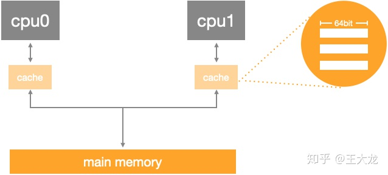
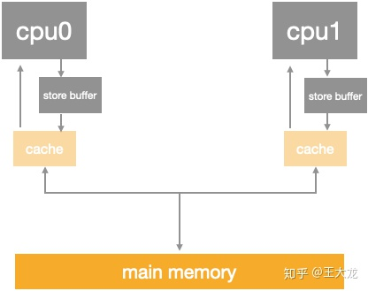
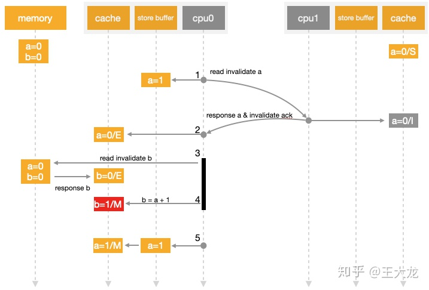
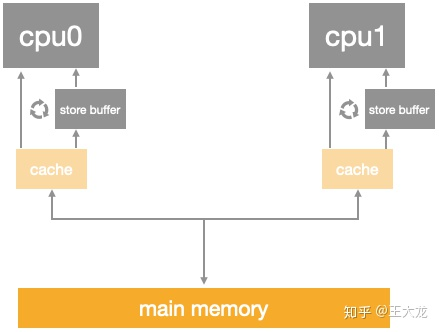
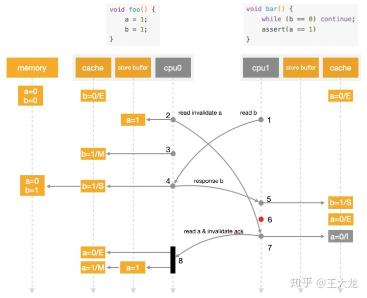
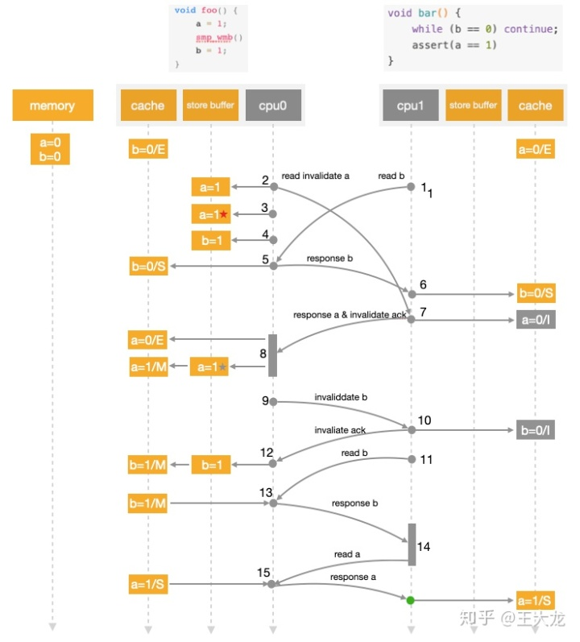
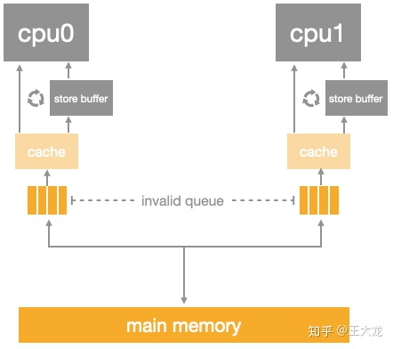
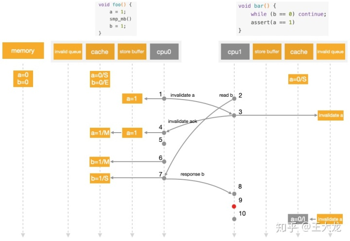

[面试官最爱的volatile关键字](https://juejin.im/post/6844903520760496141)

就我理解的而言，被volatile修饰的共享变量，就具有了以下两点特性：

1 . 保证了不同线程对该变量操作的内存可见性;

2 . 禁止指令重排序

## 面试官: 能不能详细说下什么是内存可见性，什么又是重排序呢？

------

这个聊起来可就多了，我还是从Java内存模型说起吧。

Java虚拟机规范试图定义一种Java内存模型（JMM）,来屏蔽掉各种硬件和操作系统的内存访问差异，让Java程序在各种平台上都能达到一致的内存访问效果。简单来说，由于CPU执行指令的速度是很快的，但是内存访问的速度就慢了很多，相差的不是一个数量级，所以搞处理器的那群大佬们又在CPU里加了好几层高速缓存。

在Java内存模型里，对上述的优化又进行了一波抽象。JMM规定所有变量都是存在主存中的，类似于上面提到的普通内存，每个线程又包含自己的工作内存，方便理解就可以看成CPU上的寄存器或者高速缓存。所以线程的操作都是以工作内存为主，它们只能访问自己的工作内存，且工作前后都要把值在同步回主内存。

这么说得我自己都有些不清楚了，拿张纸画一下：


在线程执行时，首先会从主存中read变量值，再load到工作内存中的副本中，然后再传给处理器执行，执行完毕后再给工作内存中的副本赋值，随后工作内存再把值传回给主存，主存中的值才更新。


使用工作内存和主存，虽然加快的速度，但是也带来了一些问题。比如看下面一个例子：

```
i = i + 1;
复制代码
```

假设i初值为0，当只有一个线程执行它时，结果肯定得到1，当两个线程执行时，会得到结果2吗？这倒不一定了。可能存在这种情况：

```
线程1： load i from 主存    // i = 0
        i + 1  // i = 1
线程2： load i from主存  // 因为线程1还没将i的值写回主存，所以i还是0
        i +  1 //i = 1
线程1:  save i to 主存
线程2： save i to 主存
复制代码
```

如果两个线程按照上面的执行流程，那么i最后的值居然是1了。如果最后的写回生效的慢，你再读取i的值，都可能是0，这就是缓存不一致问题。

下面就要提到你刚才问到的问题了，JMM主要就是围绕着如何在并发过程中如何处理原子性、可见性和有序性这3个特征来建立的，通过解决这三个问题，可以解除缓存不一致的问题。而volatile跟可见性和有序性都有关。

## 面试官：那你具体说说这三个特性呢？

------

**1 . 原子性(Atomicity)：** Java中，对基本数据类型的读取和赋值操作是原子性操作，所谓原子性操作就是指这些操作是不可中断的，要做一定做完，要么就没有执行。 比如：

```
i = 2;
j = i;
i++;
i = i + 1；
复制代码
```

上面4个操作中，`i=2`是读取操作，必定是原子性操作，`j=i`你以为是原子性操作，其实吧，分为两步，一是读取i的值，然后再赋值给j,这就是2步操作了，称不上原子操作，`i++`和`i = i + 1`其实是等效的，读取i的值，加1，再写回主存，那就是3步操作了。所以上面的举例中，最后的值可能出现多种情况，就是因为满足不了原子性。

这么说来，只有简单的读取，赋值是原子操作，还只能是用数字赋值，用变量的话还多了一步读取变量值的操作。有个例外是，虚拟机规范中允许对64位数据类型(long和double)，分为2次32为的操作来处理，但是最新JDK实现还是实现了原子操作的。

JMM只实现了基本的原子性，像上面`i++`那样的操作，必须借助于`synchronized`和`Lock`来保证整块代码的原子性了。线程在释放锁之前，必然会把`i`的值刷回到主存的。

**2 . 可见性(Visibility)：**

说到可见性，Java就是利用volatile来提供可见性的。 当一个变量被volatile修饰时，那么对它的修改会立刻刷新到主存，当其它线程需要读取该变量时，会去内存中读取新值。而普通变量则不能保证这一点。

其实通过synchronized和Lock也能够保证可见性，线程在释放锁之前，会把共享变量值都刷回主存，但是synchronized和Lock的开销都更大。

**3 . 有序性（Ordering）**

JMM是允许编译器和处理器对指令重排序的，但是规定了as-if-serial语义，即不管怎么重排序，程序的执行结果不能改变。比如下面的程序段：

```
double pi = 3.14;    //A
double r = 1;        //B
double s= pi * r * r;//C
复制代码
```

上面的语句，可以按照`A->B->C`执行，结果为3.14,但是也可以按照`B->A->C`的顺序执行，因为A、B是两句独立的语句，而C则依赖于A、B，所以A、B可以重排序，但是C却不能排到A、B的前面。JMM保证了重排序不会影响到单线程的执行，但是在多线程中却容易出问题。

比如这样的代码:

```
int a = 0;
bool flag = false;

public void write() {
    a = 2;              //1
    flag = true;        //2
}

public void multiply() {
    if (flag) {         //3
        int ret = a * a;//4
    }
    
}
复制代码
```

假如有两个线程执行上述代码段，线程1先执行write，随后线程2再执行multiply，最后ret的值一定是4吗？结果不一定：


如图所示，write方法里的1和2做了重排序，线程1先对flag赋值为true，随后执行到线程2，ret直接计算出结果，再到线程1，这时候a才赋值为2,很明显迟了一步。


这时候可以为flag加上volatile关键字，禁止重排序，可以确保程序的“有序性”，也可以上重量级的synchronized和Lock来保证有序性,它们能保证那一块区域里的代码都是一次性执行完毕的。

另外，JMM具备一些先天的**有序性**,即不需要通过任何手段就可以保证的有序性，通常称为**happens-before**原则。`<<JSR-133：Java Memory Model and Thread Specification>>`定义了如下happens-before规则：

> 1. **程序顺序规则**： 一个线程中的每个操作，happens-before于该线程中的任意后续操作
> 2. **监视器锁规则**：对一个线程的解锁，happens-before于随后对这个线程的加锁
> 3. **volatile变量规则**： 对一个volatile域的写，happens-before于后续对这个volatile域的读
> 4. **传递性**：如果A happens-before B ,且 B happens-before C, 那么 A happens-before C
> 5. **start()规则**： 如果线程A执行操作`ThreadB_start()`(启动线程B) ,  那么A线程的`ThreadB_start()`happens-before 于B中的任意操作
> 6. **join()原则**： 如果A执行`ThreadB.join()`并且成功返回，那么线程B中的任意操作happens-before于线程A从`ThreadB.join()`操作成功返回。
> 7. **interrupt()原则**： 对线程`interrupt()`方法的调用先行发生于被中断线程代码检测到中断事件的发生，可以通过`Thread.interrupted()`方法检测是否有中断发生
> 8. **finalize()原则**：一个对象的初始化完成先行发生于它的`finalize()`方法的开始

第1条规则程序顺序规则是说在一个线程里，所有的操作都是按顺序的，但是在JMM里其实只要执行结果一样，是允许重排序的，这边的happens-before强调的重点也是单线程执行结果的正确性，但是无法保证多线程也是如此。

第2条规则监视器规则其实也好理解，就是在加锁之前，确定这个锁之前已经被释放了，才能继续加锁。

第3条规则，就适用到所讨论的volatile，如果一个线程先去写一个变量，另外一个线程再去读，那么写入操作一定在读操作之前。

第4条规则，就是happens-before的传递性。

后面几条就不再一一赘述了。

## 面试官：volatile关键字如何满足并发编程的三大特性的？

那就要重提volatile变量规则： 对一个volatile域的写，happens-before于后续对这个volatile域的读。 这条再拎出来说，其实就是如果一个变量声明成是volatile的，那么当我读变量时，总是能读到它的最新值，这里最新值是指不管其它哪个线程对该变量做了写操作，都会立刻被更新到主存里，我也能从主存里读到这个刚写入的值。也就是说volatile关键字可以保证可见性以及有序性。

继续拿上面的一段代码举例：

```
int a = 0;
bool flag = false;

public void write() {
   a = 2;              //1
   flag = true;        //2
}

public void multiply() {
   if (flag) {         //3
       int ret = a * a;//4
   }
   
}
复制代码
```

这段代码不仅仅受到重排序的困扰，即使1、2没有重排序。3也不会那么顺利的执行的。假设还是线程1先执行`write`操作，线程2再执行`multiply`操作，由于线程1是在工作内存里把flag赋值为1，不一定立刻写回主存，所以线程2执行时，`multiply`再从主存读flag值，仍然可能为false，那么括号里的语句将不会执行。

如果改成下面这样：

```
int a = 0;
volatile bool flag = false;

public void write() {
   a = 2;              //1
   flag = true;        //2
}

public void multiply() {
   if (flag) {         //3
       int ret = a * a;//4
   }
}
复制代码
```

那么线程1先执行`write`,线程2再执行`multiply`。根据happens-before原则，这个过程会满足以下3类规则：

1. 程序顺序规则：1 happens-before 2; 3 happens-before 4; (volatile限制了指令重排序，所以1 在2 之前执行)
2. volatile规则：2 happens-before 3
3. 传递性规则：1 happens-before 4

从内存语义上来看

**当写一个volatile变量时，JMM会把该线程对应的本地内存中的共享变量刷新到主内存**

**当读一个volatile变量时，JMM会把该线程对应的本地内存置为无效，线程接下来将从主内存中读取共享变量。**

## 面试官：volatile的两点内存语义能保证可见性和有序性，但是能保证原子性吗？

首先我回答是不能保证原子性，要是说能保证，也只是对单个volatile变量的读/写具有原子性，但是对于类似volatile++这样的复合操作就无能为力了，比如下面的例子：

```
public class Test {
    public volatile int inc = 0;
 
    public void increase() {
        inc++;
    }
 
    public static void main(String[] args) {
        final Test test = new Test();
        for(int i=0;i<10;i++){
            new Thread(){
                public void run() {
                    for(int j=0;j<1000;j++)
                        test.increase();
                };
            }.start();
        }
 
        while(Thread.activeCount()>1)  //保证前面的线程都执行完
            Thread.yield();
        System.out.println(test.inc);
    }
复制代码
```

按道理来说结果是10000，但是运行下很可能是个小于10000的值。有人可能会说volatile不是保证了可见性啊，一个线程对inc的修改，另外一个线程应该立刻看到啊！可是这里的操作inc++是个复合操作啊，包括读取inc的值，对其自增，然后再写回主存。

假设线程A，读取了inc的值为10，这时候被阻塞了，因为没有对变量进行修改，触发不了volatile规则。

线程B此时也读读inc的值，主存里inc的值依旧为10，做自增，然后立刻就被写回主存了，为11。

此时又轮到线程A执行，由于工作内存里保存的是10，所以继续做自增，再写回主存，11又被写了一遍。所以虽然两个线程执行了两次increase()，结果却只加了一次。

有人说，**volatile不是会使缓存行无效的吗**？但是这里线程A读取到线程B也进行操作之前，并没有修改inc值，所以线程B读取的时候，还是读的10。

又有人说，线程B将11写回主存，**不会把线程A的缓存行设为无效吗**？但是线程A的读取操作已经做过了啊，只有在做读取操作时，发现自己缓存行无效，才会去读主存的值，所以这里线程A只能继续做自增了。

综上所述，在这种复合操作的情景下，原子性的功能是维持不了了。但是volatile在上面那种设置flag值的例子里，由于对flag的读/写操作都是单步的，所以还是能保证原子性的。

要想保证原子性，只能借助于synchronized,Lock以及并发包下的atomic的原子操作类了，即对基本数据类型的 自增（加1操作），自减（减1操作）、以及加法操作（加一个数），减法操作（减一个数）进行了封装，保证这些操作是原子性操作。

## 面试官：说的还可以，那你知道volatile底层的实现机制？

如果把加入volatile关键字的代码和未加入volatile关键字的代码都生成汇编代码，会发现加入volatile关键字的代码会多出一个lock前缀指令。

lock前缀指令实际相当于一个内存屏障，内存屏障提供了以下功能：

> 1 . 重排序时不能把后面的指令重排序到内存屏障之前的位置 2 . 使得本CPU的Cache写入内存 3 . 写入动作也会引起别的CPU或者别的内核无效化其Cache，相当于让新写入的值对别的线程可见。

## 面试官： 你在哪里会使用到volatile，举两个例子呢？

1. 状态量标记，就如上面对flag的标记，我重新提一下：

```
int a = 0;
volatile bool flag = false;

public void write() {
    a = 2;              //1
    flag = true;        //2
}

public void multiply() {
    if (flag) {         //3
        int ret = a * a;//4
    }
}
复制代码
```

这种对变量的读写操作，标记为volatile可以保证修改对线程立刻可见。比synchronized,Lock有一定的效率提升。

2.单例模式的实现，典型的双重检查锁定（DCL）

```
class Singleton{
    private volatile static Singleton instance = null;
 
    private Singleton() {
 
    }
 
    public static Singleton getInstance() {
        if(instance==null) {
            synchronized (Singleton.class) {
                if(instance==null)
                    instance = new Singleton();
            }
        }
        return instance;
    }
}
复制代码
```

这是一种懒汉的单例模式，使用时才创建对象，而且为了避免初始化操作的指令重排序，给instance加上了volatile。

在Java并发中，我们最初接触的应该就是`synchronized`关键字了，但是`synchronized`属于重量级锁，很多时候会引起性能问题，`volatile`也是个不错的选择，但是`volatile`不能保证原子性，只能在某些场合下使用。


像`synchronized`这种独占锁属于**悲观锁**，它是在假设一定会发生冲突的，那么加锁恰好有用，除此之外，还有**乐观锁**，乐观锁的含义就是假设没有发生冲突，那么我正好可以进行某项操作，如果要是发生冲突呢，那我就重试直到成功，乐观锁最常见的就是`CAS`。

我们在读Concurrent包下的类的源码时，发现无论是**ReenterLock内部的AQS，还是各种Atomic开头的原子类**，内部都应用到了`CAS`，最常见的就是我们在并发编程时遇到的`i++`这种情况。传统的方法肯定是在方法上加上`synchronized`关键字:

```
public class Test {

    public volatile int i;

    public synchronized void add() {
        i++;
    }
}
复制代码
```

但是这种方法在性能上可能会差一点，我们还可以使用`AtomicInteger`，就可以保证`i`原子的`++`了。

```
public class Test {

    public AtomicInteger i;

    public void add() {
        i.getAndIncrement();
    }
}
复制代码
```

我们来看`getAndIncrement`的内部：

```
public final int getAndIncrement() {
    return unsafe.getAndAddInt(this, valueOffset, 1);
}
复制代码
```

再深入到`getAndAddInt`():

```
public final int getAndAddInt(Object var1, long var2, int var4) {
    int var5;
    do {
        var5 = this.getIntVolatile(var1, var2);
    } while(!this.compareAndSwapInt(var1, var2, var5, var5 + var4));

    return var5;
}
复制代码
```

这里我们见到`compareAndSwapInt`这个函数，它也是`CAS`缩写的由来。那么仔细分析下这个函数做了什么呢？

首先我们发现`compareAndSwapInt`前面的`this`，那么它属于哪个类呢，我们看上一步`getAndAddInt`，前面是`unsafe`。这里我们进入的`Unsafe`类。这里要对`Unsafe`类做个说明。结合`AtomicInteger`的定义来说：

```
public class AtomicInteger extends Number implements java.io.Serializable {
    private static final long serialVersionUID = 6214790243416807050L;
    
    // setup to use Unsafe.compareAndSwapInt for updates
    private static final Unsafe unsafe = Unsafe.getUnsafe();
    private static final long valueOffset;
    
    static {
        try {
            valueOffset = unsafe.objectFieldOffset
                (AtomicInteger.class.getDeclaredField("value"));
        } catch (Exception ex) { throw new Error(ex); }
    }
    
    private volatile int value;
    ...
复制代码
```

在`AtomicInteger`数据定义的部分，我们可以看到，其实实际存储的值是放在`value`中的，除此之外我们还获取了`unsafe`实例，并且定义了`valueOffset`。再看到`static`块，懂类加载过程的都知道，`static`块的加载发生于类加载的时候，是最先初始化的，这时候我们调用`unsafe`的`objectFieldOffset`从`Atomic`类文件中获取`value`的偏移量，那么`valueOffset`其实就是记录`value`的偏移量的。

再回到上面一个函数`getAndAddInt`，我们看`var5`获取的是什么，通过调用`unsafe`的`getIntVolatile(var1, var2)`，这是个native方法，具体实现到JDK源码里去看了，其实就是获取`var1`中，`var2`偏移量处的值。`var1`就是`AtomicInteger`，`var2`就是我们前面提到的`valueOffset`,这样我们就从内存里获取到现在`valueOffset`处的值了。

现在重点来了，`compareAndSwapInt（var1, var2, var5, var5 + var4）`其实换成`compareAndSwapInt（obj, offset, expect, update）`比较清楚，意思就是如果`obj`内的`value`和`expect`相等，就证明没有其他线程改变过这个变量，那么就更新它为`update`，如果这一步的`CAS`没有成功，那就采用自旋的方式继续进行`CAS`操作，取出乍一看这也是两个步骤了啊，其实在`JNI`里是借助于一个`CPU`指令完成的。所以还是原子操作。

## 关于volatile的另外一些博客

[Java 并发编程：volatile的使用及其原理](https://www.cnblogs.com/paddix/p/5428507.html)

[内存屏障今生之Store Buffer, Invalid Queue](https://blog.csdn.net/wll1228/article/details/107775976?utm_medium=distribute.pc_relevant.none-task-blog-title-3&spm=1001.2101.3001.4242)

[store buffer and invalidate queues](https://blog.csdn.net/demianmeng/article/details/22898079)

[就是要你懂Java中volatile关键字实现原理](https://www.cnblogs.com/xrq730/p/7048693.html)

[Java CAS 原理剖析](https://juejin.im/post/6844903558937051144)

## CAS底层原理

CAS底层使用`JNI`调用C代码实现的，如果你有`Hotspot`源码，那么在`Unsafe.cpp`里可以找到它的实现：

```
static JNINativeMethod methods_15[] = {
    //省略一堆代码...
    {CC"compareAndSwapInt",  CC"("OBJ"J""I""I"")Z",      FN_PTR(Unsafe_CompareAndSwapInt)},
    {CC"compareAndSwapLong", CC"("OBJ"J""J""J"")Z",      FN_PTR(Unsafe_CompareAndSwapLong)},
    //省略一堆代码...
};
复制代码
```

我们可以看到compareAndSwapInt实现是在`Unsafe_CompareAndSwapInt`里面，再深入到`Unsafe_CompareAndSwapInt`:

```
UNSAFE_ENTRY(jboolean, Unsafe_CompareAndSwapInt(JNIEnv *env, jobject unsafe, jobject obj, jlong offset, jint e, jint x))
  UnsafeWrapper("Unsafe_CompareAndSwapInt");
  oop p = JNIHandles::resolve(obj);
  jint* addr = (jint *) index_oop_from_field_offset_long(p, offset);
  return (jint)(Atomic::cmpxchg(x, addr, e)) == e;
UNSAFE_END
复制代码
```

p是取出的对象，addr是p中offset处的地址，最后调用了`Atomic::cmpxchg(x, addr, e)`, 其中参数x是即将更新的值，参数e是原内存的值。代码中能看到cmpxchg有基于各个平台的实现，这里我选择Linux X86平台下的源码分析：

```
inline jint     Atomic::cmpxchg    (jint     exchange_value, volatile jint*     dest, jint     compare_value) {
  int mp = os::is_MP();
  __asm__ volatile (LOCK_IF_MP(%4) "cmpxchgl %1,(%3)"
                    : "=a" (exchange_value)
                    : "r" (exchange_value), "a" (compare_value), "r" (dest), "r" (mp)
                    : "cc", "memory");
  return exchange_value;
}
复制代码
```

这是一段小汇编，`__asm__`说明是ASM汇编，`__volatile__`禁止编译器优化

```
// Adding a lock prefix to an instruction on MP machine
#define LOCK_IF_MP(mp) "cmp $0, " #mp "; je 1f; lock; 1: "
复制代码
```

`os::is_MP`判断当前系统是否为多核系统，如果是就给总线加锁，所以同一芯片上的其他处理器就暂时不能通过总线访问内存，保证了该指令在多处理器环境下的原子性。

在正式解读这段汇编前，我们来了解下嵌入汇编的基本格式：

```
asm ( assembler template
    : output operands                  /* optional */
    : input operands                   /* optional */
    : list of clobbered registers      /* optional */
    );
复制代码
```

- **template**就是`cmpxchgl %1,(%3)`表示汇编模板
- **output operands**表示输出操作数,`=a`对应eax寄存器
- **input operand** 表示输入参数，`%1` 就是`exchange_value`, `%3`是`dest`, `%4`就是`mp`， `r`表示任意寄存器，`a`还是`eax`寄存器
- **list of clobbered registers**就是些额外参数，`cc`表示编译器`cmpxchgl`的执行将影响到标志寄存器, `memory`告诉编译器要重新从内存中读取变量的最新值，这点实现了`volatile`的感觉。

那么表达式其实就是`cmpxchgl exchange_value ,dest`，我们会发现`%2`也就是`compare_value`没有用上，这里就要分析`cmpxchgl`的语义了。`cmpxchgl`末尾`l`表示操作数长度为`4`，上面已经知道了。`cmpxchgl`会默认比较`eax`寄存器的值即`compare_value`和`exchange_value`的值，**如果相等，就把`dest`的值赋值给`exchange_value`,否则，将`exchange_value`赋值给`eax`**。具体汇编指令可以查看Intel手册[CMPXCHG](http://faydoc.tripod.com/cpu/cmpxchg.htm)

最终，JDK通过CPU的`cmpxchgl`指令的支持，实现`AtomicInteger`的`CAS`操作的原子性。

## CAS 的问题

1. **ABA问题**

CAS需要在操作值的时候检查下值有没有发生变化，如果没有发生变化则更新，但是如果一个值原来是A，变成了B，又变成了A，那么使用CAS进行检查时会发现它的值没有发生变化，但是实际上却变化了。这就是CAS的ABA问题。 常见的解决思路是使用版本号。在变量前面追加上版本号，每次变量更新的时候把版本号加一，那么`A-B-A` 就会变成`1A-2B-3A`。 目前在JDK的atomic包里提供了一个类`AtomicStampedReference`来解决ABA问题。这个类的compareAndSet方法作用是首先检查当前引用是否等于预期引用，并且当前标志是否等于预期标志，如果全部相等，则以原子方式将该引用和该标志的值设置为给定的更新值。

1. **循环时间长开销大**

上面我们说过如果CAS不成功，则会原地自旋，如果长时间自旋会给CPU带来非常大的执行开销。

## 内存屏障

- CPU 的速度与访问内存的速度差距巨大，为此 CPU 设计者使用了 cache，为每个 CPU/core 提供一个相对快速访问的存储空间，有了 cache 意味着存在 replication，这本质上跟分布式系统面临的问题类似，只是单机上我们可以使用一些硬件上的东西来提供某种 consistency model
- cache 类似一个 hash table，但是其 hash 比较简单，通常是地址计算出来的 bit set
- 为了使得 CPU 访问一致的数据，人们通过 cache coherence protocol 来同步 cache 里面的数据，常见的协议是 MESI 及其变种
- MESI 对应四个状态：modified（被修改过，要求对应内存不存在其他 cache 中）、exclusive（尚未被修改，但是仅有这个 CPU 拥有 copy，对应的也是 up-to-date 的数据）、shared（可能被多个 CPU 拥有，此时可以读但不可以写） 和 invalid（表示数据非法，也就是可以看成不可用）；通常 CPU 需要用个 2bit 表示这四个状态；状态之间的转移通过某种 meesage 来实现
- 一般对 MESI 的简单实现都是没有实际价值，这是因为发生写操作往往会带来很长时间的等候：首先需要写的 CPU 需要让别的 CPU 将状态转换到 invalid，收到 response 以后才能进行实际的写，为此硬件专家使用了 store buffer（Sutter 同志也说过，modern CPU 如果没有 store buffer 就不值得买，可见这个 feature 对整体性能的影响是不可忽略的）
- store buffer 的作用是让 CPU 需要写的时候仅仅将其操作交给 store buffer，然后继续执行下去，store buffer 在某个时刻就会完成一系列的同步行为；很明显这个简单的东西会违背 self consistency，因为如果某个 CPU 试图写其他 CPU 占有的内存，消息交给 store buffer 后，CPU 继续执行后面的指令，而如果后面的指令依赖于这个被写入的内存（尚未被更新，这个时候读取的值是错误的）就会产生问题，所以实际实现 store buffer 可能会增加 snoop 特性，即 CPU 读取数据时会从 store buffer 和 cache 两处读
- 即便增加了 snoop，store buffer 仍然会违背 global memory ordering，导致的解决方案是 memory barrier：我们知道程序员书写两个写操作的时候，隐含的假定是如果能观察到后一个写的结果，那么前一个写的结果势必也会发生，这是一个非常符合人直觉的行为，但是由于 store buffer 的存在，这个结论可能并不正确：这是因为如果观察线程位于另一个 core，首先读取后一个写（该地址并不在 cache 内）需要向写入线程所在 core 要对应地址的值，由于该 core 从 store buffer 返回了新值的时候这个 buffer 里面的写操作可能尚未发生，所以观察线程在获取了后一个写的最新结果时，前一个写的结果依然无法观察到，这违背了 sequential consistency 的假定，往往程序员更倾向于这个 consistency model 下的 reasoning
- 硬件 level 上很难揣度软件上这种前后依赖关系，因此往往无法通过某种手段自动的避免这种问题，因而只有通过软件的手段表示（对应也需要硬件提供某种指令来支持这种语义），这个就是 memory barrier，从硬件上来看这个 barrier 就是 CPU flush 其 store buffer 的指令，那么一种做法就是提供给程序员对应的指令（封装到函数里面）要求在合适的时候插入表达这种关系，另一种做法就是通过某种标识让编译器翻译的时候自动的插入这个指令
- 往往 store buffer 都很小，针对连续写操作力不从心；类似的情况也发生在碰到 memory barrier 之后；开始写之前首先需要 invalidate 其他 cache 里面的数据，为了加速这个过程硬件设计者又加入了 invalidate queue，这个 queue 将 incoming 的 invalidate 消息存放，立即返回对应的 response 这样以便发起者能尽快做后面的事情，而这个 CPU 可以通过 invalidate queue 后续处理这些内存
- invalidate queue 的存在会使得我们有更多的地方需要 memory barrier（理由与 store buffer 类似）
- 实际 memory barrier 又有一些细分，如 read/write 的，软件上会通过 smb_mb/rmb/wmb 等表示，对应的硬件指令不同平台下各不相同
- 实际实现的时候由于某些指令集之间的关系使得 memory barrier 的实现不可能做到最优，很多常见的平台都使用了简单粗暴的 bus 锁（x86、amd64、armv7），这也就是 Sutter talk 里面认为硬件平台往往提供了一些“过度”的指令的原因，最终软件需要的 sequential consistency 尽管得以实现，但是产生了一些不必要的代价
- memory barrier 不是一个必需的东西，但是似乎如果有 real-time 的 requirement 似乎就不能避开，这一点有待证实

### 具体的内存屏障读写如下——[内存屏障今生之Store Buffer, Invalid Queue](https://blog.csdn.net/wll1228/article/details/107775976)

[store buffer and invalidate queues](http://blog.csdn.net/demianmeng/article/details/22898079)



#### 性能优化之旅——Store Buffer

当cpu需要的数据在其他cpu的cache内时，需要请求，并且等待响应，这显然是一个同步行为，优化的方案也很明显，采用异步。思路大概是在cpu和cache之间加一个store buffer，cpu可以先将数据写到store buffer，同时给其他cpu发送消息，然后继续做其它事情，等到收到其它cpu发过来的响应消息，再将数据从store buffer移到cache line。



该方案听起来不错！但逻辑上有漏洞，需要细化，我们来看几个漏洞。比如有如下代码:

```
a = 1;
b = a + 1;
assert(b == 2);
```



代码执行时序图，表明cache line的变化

1. cpu0 要写入a，将a=1写入store buffer，并发出Read Invalidate消息，继续其他指令。
2. cpu1 收到Read Invalidate，返回Read Response(包含a=0的cache line)和Invalidate ACK，cpu0 收到Read Response，更新cache line(a=0)。**这里没有引入forwarding机制导致更新时只能从缓存中更新a，而不能从buffer中更新a**
3. cpu0 开始执行b=a+1，此时cache line中还没有加载b，于是发出Read Invalidate消息，从内存加载b=0，同时cache line中已有a=0，于是得到b=1，状态为Modified状态。
4. cpu0 得到 b=1，断言失败。
5. cpu0 将store buffer中的a=1推送到cache line，然而为时已晚。

造成这个问题的根源在于对同一个cpu存在对a的两份拷贝，一份在cache，一份在store buffer，而cpu计算b=a+1时，a和b的值都来自cache。仿佛代码的执行顺序变成了这个样子：

```
b = a + 1;
a = 1;
assert(b == 2);
```

#### 性能优化之旅——Store **Forwarding**

store buffer可能导致破坏程序顺序的问题，硬件工程师在store buffer的基础上，又实现了”store forwarding”技术: cpu可以直接从store buffer中加载数据，即支持将cpu存入store buffer的数据传递(forwarding)给后续的加载操作，而不经由cache。



虽然现在解决了同一个cpu读写数据的问题，但还是有漏洞，来看看并发程序:

```
void foo() {
    a = 1;
    b = 1;
}
void bar() {
    while (b == 0) continue;
    assert(a == 1)
}
```

初始状态下，假设a，b值都为0，a存在于cpu1的cache中，b存在于cpu0的cache中，均为Exclusive状态，cpu0执行foo函数，cpu1执行bar函数，上面代码的预期断言为真。那么来看下执行序列:



代码执行时序图

1. cpu1执行while(b == 0)，由于cpu1的Cache中没有b，发出Read b消息
2. cpu0执行a=1，由于cpu0的cache中没有a，因此它将a(当前值1)写入到store buffer并发出Read Invalidate a消息
3. cpu0执行b=1，由于b已经存在在cache中，且为Exclusive状态，因此可直接执行写入
4. cpu0收到Read b消息，将cache中的b(当前值1)返回给cpu1，将b写回到内存，并将cache Line状态改为Shared
5. cpu1收到包含b的cache line，结束while (b == 0)循环
6. cpu1执行assert(a == 1)，由于此时cpu1 cache line中的a仍然为0并且有效(Exclusive)，断言失败
7. cpu1收到Read Invalidate a消息，返回包含a的cache line，并将本地包含a的cache line置为Invalid，然而已经为时已晚。
8. cpu0收到cpu1传过来的cache line，然后将store buffer中的a(当前值1)刷新到cache line。**CPU多核之间通信不同步**

出现这个问题的原因在于cpu不知道a, b之间的数据依赖，cpu0对a的写入需要和其他cpu通信，因此有延迟，而对b的写入直接修改本地cache就行，因此b比a先在cache中生效，导致cpu1读到b=1时，a还存在于store buffer中。从代码的角度来看，foo函数似乎变成了这个样子：

```
void foo() {
    b = 1;
    a = 1;
}
```

foo函数的代码，即使是store forwarding也阻止不了它被cpu“重排”，虽然这并没有影响foo函数的正确性，但会影响到所有依赖foo函数赋值顺序的线程。看来还要继续优化！

#### 性能优化之旅——写屏障指令

到目前为止，我们发现了”指令重排“的其中一个本质[[1\]](https://blog.csdn.net/wll1228/article/details/107775976#ref_1)，cpu为了优化指令的执行效率，引入了store buffer（forwarding），而又因此导致了指令执行顺序的变化。要保证这种顺序一致性，靠硬件是优化不了了，需要在软件层面支持，没错，cpu提供了写屏障（write memory barrier）指令，Linux操作系统将写屏障指令封装成了smp_wmb()函数，cpu执行smp_mb()的思路是，会先把当前store buffer中的数据刷到cache之后，再执行屏障后的“写入操作”，该思路有两种实现方式: 一是简单地刷store buffer，但如果此时远程cache line没有返回，则需要等待，二是将当前store buffer中的条目打标，然后将屏障后的“写入操作”也写到store buffer中，cpu继续干其他的事，当被打标的条目全部刷到cache line，之后再刷后面的条目（具体实现非本文目标），以第二种实现逻辑为例，我们看看以下代码执行过程：

```
void foo() {
    a = 1;
    smp_wmb()
    b = 1;
}
void bar() {
    while (b == 0) continue;
    assert(a == 1)
}
```



1. cpu1执行while(b == 0)，由于cpu1的cache中没有b，发出Read b消息。
2. cpu0执行a=1，由于cpu0的cache中没有a，因此它将a(当前值1)写入到store buffer并发出Read Invalidate a消息。
3. cpu0看到smp_wmb()内存屏障，它会标记当前store buffer中的所有条目(即a=1被标记)。
4. cpu0执行b=1，尽管b已经存在在cache中(Exclusive)，但是由于store buffer中还存在被标记的条目，因此b不能直接写入，只能先写入store buffer中。
5. cpu0收到Read b消息，将cache中的b(当前值0)返回给cpu1，将b写回到内存，并将cache line状态改为Shared。
6. cpu1收到包含b的cache line，继续while (b == 0)循环。
7. cpu1收到Read Invalidate a消息，返回包含a的cache line，并将本地的cache line置为Invalid。
8. cpu0收到cpu1传过来的包含a的cache line，然后将store buffer中的a(当前值1)刷新到cache line，并且将cache line状态置为Modified。
9. 由于cpu0的store buffer中被标记的条目已经全部刷新到cache，此时cpu0可以尝试将store buffer中的b=1刷新到cache，但是由于包含B的cache line已经不是Exclusive而是Shared，因此需要先发Invalidate b消息。
10. cpu1收到Invalidate b消息，将包含b的cache line置为Invalid，返回Invalidate ACK。
11. cpu1继续执行while(b == 0)，此时b已经不在cache中，因此发出Read消息。
12. cpu0收到Invalidate ACK，将store buffer中的b=1写入Cache。
13. cpu0收到Read消息，返回包含b新值的cache line。
14. cpu1收到包含b的cache line，可以继续执行while(b == 0)，终止循环，然后执行assert(a == 1)，此时a不在其cache中，因此发出Read消息。
15. cpu0收到Read消息，返回包含a新值的cache line。
16. cpu1收到包含a的cache line，断言为真。

#### 性能优化之旅——**Invalid Queue**

引入了store buffer，再辅以store forwarding，写屏障，看起来好像可以自洽了，然而还有一个问题没有考虑: store buffer的大小是有限的，所有的写入操作发生cache missing（数据不再本地）都会使用store buffer，特别是出现内存屏障时，后续的所有写入操作(不管是否cache missing)都会挤压在store buffer中(直到store buffer中屏障前的条目处理完)，因此store buffer很容易会满，当store buffer满了之后，cpu还是会卡在等对应的Invalidate ACK以处理store buffer中的条目。因此还是要回到Invalidate ACK中来，Invalidate ACK耗时的主要原因是cpu要先将对应的cache line置为Invalid后再返回Invalidate ACK，一个很忙的cpu可能会导致其它cpu都在等它回Invalidate ACK。解决思路还是化同步为异步: cpu不必要处理了cache line之后才回Invalidate ACK，而是可以先将Invalid消息放到某个请求队列Invalid Queue，然后就返回Invalidate ACK。CPU可以后续再处理Invalid Queue中的消息，大幅度降低Invalidate ACK响应时间。此时的CPU Cache结构图如下：



加入了invalid queue之后，cpu在处理任何cache line的MSEI状态前，都必须先看invalid queue中是否有该cache line的Invalid消息没有处理。另外，它也再一次破坏了内存的一致性。请看代码：

```
void foo() {
    a = 1;
    smp_wmb()
    b = 1;
}
void bar() {
    while (b == 0) continue;
    assert(a == 1)
}
```

仍然假设a, b的初始值为0，a在cpu0，cpu1中均为Shared状态，b在cpu0独占(Exclusive状态)，cpu0执行foo，cpu1执行bar:



1. cpu0执行a=1，由于其有包含a的cache line，将a写入store buffer，并发出Invalidate a消息。
2. cpu1执行while(b == 0)，它没有b的cache，发出Read b消息。
3. cpu1收到cpu0的Invalidate a消息，将其放入Invalidate Queue，返回Invalidate ACK。
4. cpu0收到Invalidate ACK，将store buffer中的a=1刷新到cache line，标记为Modified。
5. cpu0看到smp_wmb()内存屏障，但是由于其store buffer为空，因此它可以直接跳过该语句。
6. cpu0执行b=1，由于其cache独占b，因此直接执行写入，cache line标记为Modified。
7. cpu0收到cpu1发的Read b消息，将包含b的cache line写回内存并返回该cache line，本地的cache line标记为Shared。
8. cpu1收到包含b(当前值1)的cache line，结束while循环。
9. cpu1执行assert(a == 1)，由于其本地有包含a旧值的cache line，读到a初始值0，断言失败。
10. cpu1这时才处理Invalid Queue中的消息，将包含a旧值的cache line置为Invalid。

问题在于第9步中cpu1在读取a的cache line时，没有先处理Invalid Queue中该cache line的Invalid操作，怎么办？其实cpu还提供了**读屏障指令**，Linux将其封装成smp_rmb()函数，将该函数插入到bar函数中，就像这样：

```
void foo() {
    a = 1;
    smp_wmb()
    b = 1;
}
void bar() {
    while (b == 0) continue;
    smp_rmb()
    assert(a == 1)
}
```

和smp_wmb()类似，cpu执行smp_rmb()的时，会先把当前invalidate queue中的数据处理掉之后，再执行屏障后的“读取操作”，具体操作序列不再赘述。