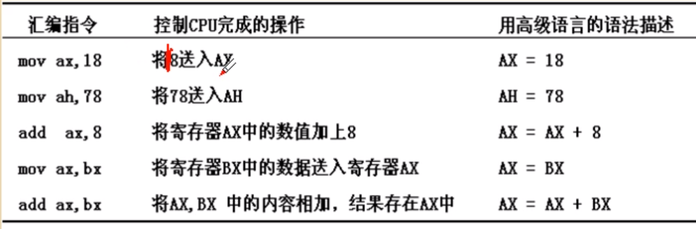
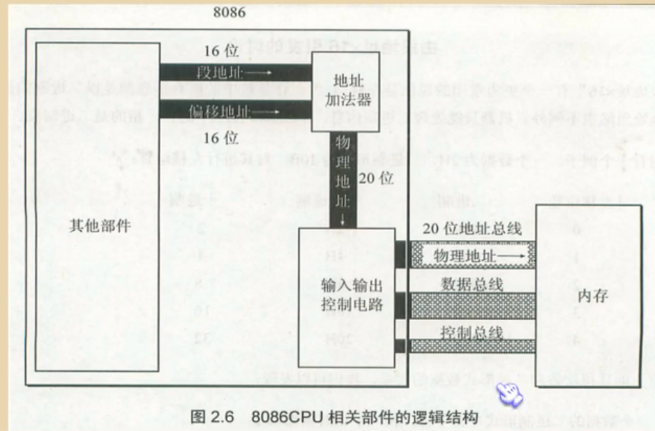
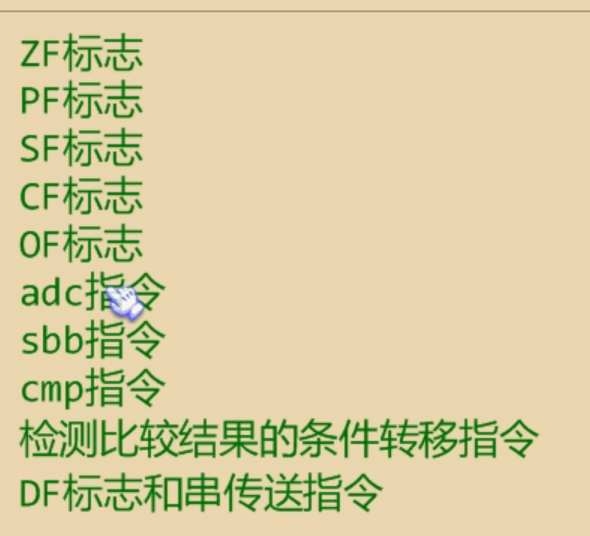
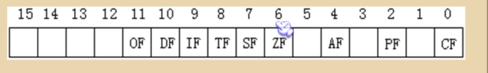

# 汇编语言

汇编语言直接工作在硬件上，机器语言是机器能够执行的命令，而汇编语言将机器语言翻译成了人们可以理解的标记语言。与机器语言是一一对应的。

## 汇编语言组成

1. 汇编指令——机器码助记码
2. 伪指令——编译器执行
3. 其它指令——编译器识别

## 寄存器

8086寄存器总共有14个，AX，BX，CX，DX，SI，DI，SP，BP，IP，CS，SS，DS，ED，PSW

AX，BX，CX，DX：存放一般的数据，称之为通用寄存器，这些寄存器都可以当成两个**独立的**【独立的意思就是如果低位的运算之后发生溢出，溢出的进位不会存到高位上】8位的寄存器[AL,AH...]使用，主要为了兼容



## 物理地址

CPU访问内存单元时要给出内存单元的地址，所有的内存单元构成的存储空间是一个一维的线性空间

8086的内部逻辑中仅有16根地址总线，但是8086却能够实现20位的寻址范围，主要与其实现相关。它能够将两个16位的地址[段地址和偏移地址]变成一个20位的物理地址

物理地址=段地址*16+偏移地址



### 段寄存器

用于提供段地址的寄存器——CS，DS，SS，ES，访问内存时，由这四个寄存器提供内存单元的段地址

MOV指令不允许直接将数值送入段寄存器，必须使用通用寄存器，如MOV DS，AX

CS：代码段寄存器

IP：指令指针寄存器，就是偏移地址的存储位置

工作过程

1. CS:IP指向内存单元读取指令，读取的指令进入指令缓冲器
2. IP=IP+所读指令的长度，从而指向下一条指令
3. 执行指令并转到步骤1

MOV：传送指令，将某个值送到寄存器中，但是MOV不能用于改变CS，IP的值，

JMP：转移指令，可以修改CS，IP的值，跳转到CS和IP到指定的位置，格式位JMP  1000：3

代码段：将长度为N的一组代码，存在一组地址连续，起始地址为16的倍数的内存单元中，这段内存是用来存放代码的，从而定义了一个代码段

执行代码段中的指令：用CS：IP来指定，必须指向代码段中的第一个指令的首地址

## 寄存器——内存访问原理

任何两个地址连续的内存单元，N号和N+1号单元，可以将他们看成两个内存单元，也可以看成一个地址为N的字单元中的高位字节单元和低位字节单元

执行指令的时候，8086自动取DS中的数据为内存单元的段地址，指令MOV al,[0]表示传送一个数据到al中，其中[0]表示操作的是一个内存单元，0是偏移量，段地址默认在DS中

1. mov：
   - mov 寄存器 数据
   - mov 寄存器 寄存器
   - mov 寄存器 内存单元
   - mov 内存单元 寄存器
   - mov 段寄存器 寄存器
   - mov 寄存器 段寄存器
2. add：和mov指令相似
3. sub：和mov指令相似

数据段：可将一组长度为N，地址连续，起始地址为16的倍数的内存单元当作专门存储数据的内存空间，从而定义一个数据段

### 栈

push ax：将寄存器ax中的数据送入栈中

pop ax：从栈顶取出数据送入ax——注意只是移动了栈顶指针，实际数据还是在栈中的

8086中入栈出栈的基本单元是字

栈在CPU中的哪里，CPU如何自导栈顶

1. 段寄存器SS——存放栈顶的段地址
2. 寄存器SP——存放栈顶的偏移地址

任意时刻，SS:SP指向栈顶元素，当栈为空的时候，栈中没有元素，也就不存在栈顶元素，此时SS:SP只能指向栈的最底部单元下面的单元，该单元的偏移地址为栈最底部的字单元的偏移地址+2

#### 栈顶越界

指超过了栈的空间范围，栈顶越界可能导致对其他数据造成破坏，8086芯片不能确定栈的大小范围，可能会导致栈顶溢出

#### 栈段

将长度为N的一组地址连续，起始地址为16的倍数的内存作为栈段来使用

## 汇编程序编译

可执行文件——代码段+数据

可执行程序的实现过程：程序编写-编译链接-执行

伪指令是由编译器来执行的，不能够编译成机器码，

一个汇编程序至少有一个段，用segment和ends进行标识，机器编译只会编译其中的指令段

### DOS中程序的运行

一个程序要运行需要有其他程序将其加载到内存中，之后将CPU的控制权交给加载到内存的程序，之后新加载的程序开始执行，原程序暂停执行

程序加载之后，ds中存放程序所在内存的段地址，这个内存区的偏移地址为0，则程序所在的内存区的地址为：ds:0；

这个内存区的前256个字节中存放的是PSP，dos用来和程序进行通信，从256字节处向后的空间存放的是程序。

## 指令

Loop：Loop + 标号

loop指令需要有两部指令，(cx)=(cx)-1,之后判断cx的值，如果cx的值不为0，就跳到标号处执行，如果是0就向下执行

```c#
mov cx,循环次数
s：循环程序段
loop s
```

注意低位的数据不能与高位的数据直接相加，且要注意数据的溢出问题

## 安全的空间

在不同的操作系统中会开辟一段空间，这段空间一般不会被使用

## 包含多个段的程序

dw：定义字型数据，定义多个字型数据(16位)，这些数据会被存到偏移地址的0，2，4，。。。处，其中段地址需要在代码段中指明

and：按位进行与运算，

or：按位进行或运算，

db：用于将数据转换为ascii码地字符形式

si寄存器和DI寄存器：是8086的寄存器，但是这两个寄存器不可以拆成两个8位寄存器，功能与bx寄存器相似

loop可以利用栈以及cx来实现多重循环

## 数据处理的问题

bx：偏移，可以使用到[]中间，仅有bx，bp，si，di可以用在[]中

si：源数据

di：目的数据

bp：出现在[]中，bo的默认段寄存器在ss中


[]中只能有这些组合出现，

reg：寄存器

sreg：段寄存器

es：扩展段

## 寻址方式

直接寻址

寄存器间接寻址

寄存器相对寻址

基址变址寻址

相对基址变址寻址

## div指令

除法指令，要求除数是8位或者16位的，存放在寄存器或内存单元中，被除数放在AX或DX和AX中

| 除数 | 被除数      | 结果         |
| ---- | ----------- | ------------ |
| 8位  | 16位(AX)    | 商AL，余数AH |
| 16位 | 32位(DX+AX) | 商AX，余数DX |

div word ptr ds:[4]意思是用dx:ax中的32位数据初一ds:[4]中的字单元中的数据，如果是16位除法默认dx是高16位，AX是低16位

dd定义双字的字节

## dup指令

由编译器识别的符号，用来进行数据的重复

db 3 dup(0)相当于 db 0,0,0

## 转移指令

包括JMP，LOOP，过程，中断，条件转移指令

offset：由编译器处理的指令，代表偏移地址

JMP：无条件跳转指令，可以修改CS：IP

1. JMP short 标号(跳转到标号处执行)：段内段转移，可以在-128到127的范围内进行跳转
   - 提供了偏移地址进行指令的修改偏移，修改方式时原IP值加上JMP的偏移地址，即IP = IP+位移
2. JMP near ptr 标号jmp偏移地址为16位
3. JMP far ptr 标号 远转移。段间的转移，即转移距离超过了16位/dword

转移总是相对当前指令对应的地址的

## jcxz指令

有条件转移指令，所有的有条件转移指令都是短转移，在对应的机器码中包含转移的位移，而不是目的地址，对IP的修改范围都是-128~127，要求CX=0时，IP=IP+8位位移，当CX！=0时，继续向下进行

转移指令都是根据偏移地址进行的，主要是为了保证程序浮动装配时程序能够正常运行

## CALL和RET指令

call 标号：将当前的IP压栈后，转到标号处执行指令，其中IP=Ip+16位位移，其中16位位移为标号处的地址-call指令后第一个字节的地址

call 16为寄存器：压栈，IP=IP+寄存器中的偏移地址

ret 用栈中的数据修改IP的内容实现近转移

call可以用于实现调用一一个子程序的命令，之后用ret来实现返回

mul：乘法命令，并且要求相乘的两个数要么都是8位[保存在AX中]要么都是16位[保存在AX和DX中]

## 批量数据的传递

寄存器的数量是有限的，因此如果有较多的数据需要存储，那么可以使用内存来保存数据，或者可以使用栈

## 标志寄存器



标志寄存器称之为flag，其中存储的信息称之为程序状态字



ZF：判断上次计算后的结果，如果为0，那么ZF标志被设为1——大多数的计算指令会影响标志寄存器ZF，pop，push这些不会

PF：就标志为，偶数个1，pf为1，奇数为0——计算指令影响

SF：符号标志为，结果为负数，SF为1，否则为0——计算指令影响

CF：进位标志位，记录进位，无符号的标志

OF：溢出标志位，超过机器能够承受的标志，属于有符号的标志位

DF：方向标识位：在串处理指令的时候，控制每次操作后，di，si的增减

如果DF=0：si=si+1，di=di+1，DF=0：si=si-1，di=di-1

popf,pushf用来将标志寄存器入栈

### adc指令

带进位的加法指令，利用了CF上记录的进位信息

### sbb指令

带借位的减法指令

### cmp指令

进行数字的比较，一般使用操作数1减去操作数2，之后结果不保存，主要关注对psw中的各个位数的影响

如果比较一个有符号数，那么需要考虑ZF，OF和SF来比较两个数的大小

如果无符号数，则考虑ZF和CF的值

，然后根据标志寄存器DF位的值，将si和di递增和递减

### rep指令

根据cx的值，重复执行后面的串传送指令

### cld指令

将标志寄存器的DF位置置0

### std指令

将标志寄存器的DF位置置1

## 中断

### 外部中断

由计算机外设发出的中断请求，例如键盘中断，打印机中断，等，外部中断可以被屏蔽

### 内部中断

硬件出错或者计算出错造成的中断，内部中断是不可屏蔽的中断

TF位是产生中断的标志

### 中断优先权

1. 除法中断，溢出中断，软件中断
2. 不可屏蔽中断
3. 可屏蔽中断
4. 单步中断

### 中断向量表

CPU同8位的中断类型码通过中断向量表找到相应的中断处理程序的入口地址，中断向量表存放在内存中，且中断处理程序总是保存在内存中，一共256个中断，每个中断由段地址加偏移地址标识，2+2一共4字节，

### 中断过程

用中断类型码找到中断处理程序的入口，并用这个入口地址设置CS和IP，使CPU执行中断处理程序，这个过程由计算机硬件来完成

1. 取得中断类型码
2. 标志寄存器的值入栈（保护标识位）
3. 设置标志寄存器的第8位TF和第9位IF的值为0
4. CS的内容以及IP的内容入栈
5. 从内存地址为中断类型码*4和中断类型码\*4+2的两个字单元中读取中断处理程序的入口地址设置IP和CS

### iret指令

中断返回指令。将CS以及IP出栈以及标志寄存器的出栈，CPU完成中断之后回到原来的执行位置继续执行

### 单步中断

单步中断的中断标志为1，就是debug的执行原理，当触发单步中断的时候，就会暂停程序，将CPU中的内容保存起来，并等待执行下一个命令

注意中断位为1的时候不一定会立刻就中断，例如ss:sp入栈的时候需要两个都入栈才会触发中断的发生

### int指令

int n：n为中断类型码，用来引发中断过程，与iret指令配合使用

## 端口

计算机与外界进行通信的窗口，

cpu可以操作的数据的位置

1. CPU内部的寄存器
2. 内存单元
3. 端口

指令为int和out，分别为读入数据和写入数据，其能够使用的寄存器只能是ax和al

## shl和shr指令

逻辑移位指令，将一个寄存器或内存单元中的数据左移或者右移移位，空出来的位用0补，cl保存移位的次数，格式位shl al,cl

最后移出的一位会被保存到CF中

## COMS RAM保存时间

以BCD码的形式保存，70h为地址端口，保存保存时间位置的地址

## 外部中断

### PC键盘的处理过程

1. 键盘上每一个键相当于一个开关，键盘中有一个芯片对键盘上每一个键的开关状态进行扫描。
2. 按下一个键时，开关接通，该芯片就产生一个扫描码，扫描码说明了按下的键在键盘上的位置，扫描码被送入主板上的相关接口芯片的寄存器中，该寄存器的端口地址为60h
3. 松开按下的键，也产生一个扫描码，扫描码说明键已经松开，也被送入60h
4. 键盘输入到达60h时，芯片就会发出中断类型码为9的可屏蔽中断信号，如果cpu的if=1就会处理中断

处理键盘输入输出的是int9中断。该终端会读出60h端口的扫描码。有一个键盘输入专用的缓冲区

## 直接地址表

建立数值与字符的映射关系，例如数字与其ascii码之间就存在函数映射，更简便的方法是建立一张表，直接建立数值与字符ascii之间的映射

指令为table，通过计算偏移地址来找到所需的数据

## 字符串输入功能

输入，显示，删除等功能


