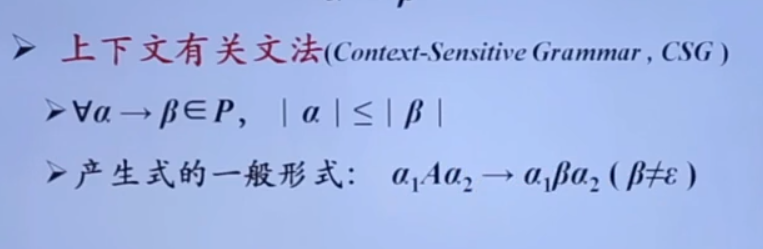

# 编译原理

机器语言——>汇编语言——>高级语言

高级语言—（编译）—>汇编语言—（汇编）—>机器语言

## 编译系统的结构

源语言句子—[分析源语言]—句子的语义——[生成目标语言]——目标语言句子

分析源语言：语义分析——语法分析——词法分析（从左向右，越来越靠近底层）

中间表示独立于具体的语言，起到桥梁的作用

### 词法分析

从左到右逐行扫描源程序的字符，识别出各个单词，确定单词的类型，将识别出的单词转换成统一的机内表示——词法单元(token)形式，token:<种别码，属性值>

### 语法分析

语法分析从词法分析器输出的token序列中识别出各类短语，并构造语法分析树，描述句子的语法结构

<D>：表示一句声明语句，由<D>连接上一个<IDS>再连接上一个分号构成

<T>：表示一个类型声明

<IDS>：表示一个标识符序列，可以由id或者<IDS>连接逗号，再连接一个id构成一个更大的<IDS>

### 语义分析

- 收集标识符的属性信息
  - 种属：简单变量，复合变量，过程
  - 类型：整型，实型等
  - 存储位置，长度
  - 值，作用域
  - 参数和返回值信息

还设计了一个符号表，用来存储上面分析过程中的信息

- 语义检查
  - 变量或者过程未经声明就使用
  - 变量或过程名重复声明
  - 运算分量类型不匹配
  - 操作符于操作数之间的类型不匹配

### 中间代码生成

中间表示的形式

- 三地址码
  - 三地址码由类似汇编语言的指令序列组成，每个指令最多有三个操作数

语法结构树/语法树

### 目标代码生成

目标代码以源程序的中间表示形式作为输入，把它映射到目标语言，目标代码的重要任务时为程序中使用的变量合理分配寄存器

### 代码优化

改进代码，使其运行更快，或者空间更小

## 语言和文法

字母表：一个有穷符号集合，包括定义了字母表的乘积运算，以及串的运算等基本内容

文法的形式定义
$$
G=(V_T,V_N,P,S)
$$
V_T:终结符集合，指文法定义的语句的基本符号

V_N:非终结符集合，指语法成分的符号，称之为语法变量

P:产生式集合，描述了终结符和非终结符组合成串的方式

### 语言的定义

#### 推导与归约

给定文法G=(V_T,V_N,P,S)，如果存在α->β属于P，那么可以将符号串γαδ替换为γβδ，记作推导

#### 文法分类体系

- 0型文法
  - 无限制文法，α可以任意地替换为β
- 1型文法
  - 上下文有关文法，
  - 
- 2型文法
  - 上下文无关文法
  - 
- 3型文法
  - 

#### 文法的关系

### CFG的分析树

根节点：文法开始符号

内部节点：表示对一个产生式的应用

叶节点：非终结符或者终结符，从左到右排列叶节点得到的符号串称之为树的产出或者边缘

举行短语：给定一个举行，分析树中的每一棵子树的边缘称之为短语

#### 二义性文法

如果一个文法可以为某个句子生成多个分析树，那么这个文法就是二义性的

对于任意一个上下文无关文法，不存在一个算法，判定它是无二义性的，但能给出一组充分条件，满足这组充分条件的文法是无二义性的

## 正则表达式

### 有穷自动机DFA

系统具有一系列离散的输入输出信息和有穷数目的内部状态，系统只需要根据当前所处的状态和当前面临的输入信息就可以决定系统的后继行为。

状态图的表示

最长匹配原则：当输入串的多个前缀与一个或者多个模式进行匹配的时候，总是选择最长的前缀进行匹配。也就是到达一个终态之后字符还没有结束，那就继续走，找到下一个终态

### 正则表达式到DFA

b站16-17

## 自顶向下

词法分析的方向分为向下和相上

### 自顶向下

从分析树的顶部向底部方向构造分析树，从文法开始符号S推导出词串w的过程

分析的关键是如何替换分析树中的非终结符

#### 最左推导——自顶向下中使用

总是选择每个举行的最左非终结符进行替换，能保证唯一性

#### 最右推导——最左规约

总是选择每个举行的最右非终结符进行替换，能保证唯一性

在自底向上的分析中，总是采用最左规约的方式进行，因此把最左规约称为规范规约，而最右推导称之为规范推导

#### 问题

1. 左递归A->Aa，会导致左递归问题
2. 间接左递归，通过两步以上的转换可以变成左递归问题

### LL(1)文法——解决回溯效率问题

串首终结符——串首第一个符号，并且是终结符，记为FIRST

给定一个文法符号α，α的串首终结符FIRST(α)被定义为可以从α推导出的所有串首终结符构成的集合。

FIRST集合的计算

非终结符A的后继符号集——FOLLOW集合

计算方法

产生式的可选集合——SELECT

#### 算法计算过程

#### 预测分析中的错误恢复

恐慌模式

忽略输入中的一些符号，知道输入中出现由设计者选定的同步此法单元集合中的某个词法单元，其效果依赖于同步集合的选取，集合的选取应该使得词法分析器能从实际遇到的错误中快速恢复。

- 例如可以把FOLLOW集合中的所有终结符放入非终结符A的同步记号集合
- 如果终结符在栈顶而又不匹配，那么可以直接弹出这个终结符

## 自底向上

从分析树的底部(叶节点)向顶部(根节点)方向构造分析树，可以看成是将输入串w规约为文法开始符号S的过程——移入规约分析

移入规约分析需要使用最长匹配方法来进行匹配，要求句柄是句型的直接短语(高度为2的树的边缘)

### LR分析法

LR分析法是最大的可以构造出相应的以如-规约语法分析器的文法类

L：对输入进行从左到右的扫描

R：方向构造出一个最右推导序列

#### 基本原理

识别句柄是关键

#### 工作过程

#### 方法的分类

1. LR(0)分析法
   - LR(0)项目——右部某位置标有圆点的产生式策划归纳为相应文法的LR(0)项目
   - 增广文法——如果G是一个以S为开始符号的文法，1则G的增广文法G‘就是在G中加上新开始符号S’和产生式S'->S而得到的文法：引入增广文法的目的是使得文法开始符号仅出现在一个产生式的左边，从而使得分析器只有一个接收状态
   - 
   - 后继项目——同属于一个产生式的项目，但圆点的位置只相差一个符号，则称后者是前者的后继项目
   - 
   - LR(0)构造表分析——存在冲突
   - 
2. SLR分析
   - 
   - 
   - 问题：SLR只是简单考察洗一个输入符号b是否属于与归纳项目A->a相关联的FOLLOW(A)，但b属于FOLLOW(A)只是归纳a的一个必要条件而非充分条件
3. LR(1)分析法
   - 对于某一个产生式，在不同的使用位置，会产生要求不同的后继符号，在特定的位置，A的后继符集合是FOLLOW(A)的子集
   - 
   - 
4. LALR分析法
   - 解决LR(1)状态太多的问题
   - 寻找具有相同核心的LR(1)项集，并将这些项集合并为一个项集，所谓项集的核心就是第一分量的结合，然后根据合并后得到的项集族构造语法分析表，如果分析表中没有语法分析动作冲突，给定的文法就称为LALR(1)文法，就可以根据该分析表进行语法分析
   - LALR分析法可能会做多余的规约，但是不会做错误的移入操作

### 二义性文法

每个二义性文法都不是LR的，但是有些二义性文法具有比较简单的表达形式，使用优先级以及结合性来解决问题

### 错误恢复

#### 恐慌模式错误恢复

从栈顶向下扫描，直到发现某个状态si，他有一个对应于某个非终结符A的GOTO目标，可以认为从这个A推导出的串中包含错误，然后丢弃0个或多个输入符号，直到发现一个可能合法地跟在A之后的符号a位置，最后将si+1=GOTO(si,A)压入栈中，继续进行正常的语法分析

## 语法制导翻译

使用上下文无关文法来引导对语言的翻译，是一种面向文法的翻译技术。

实现——为上下文无关文法中的文法符号设置语义属性，用来表示语法成分对应的语义信息。

计算语义属性

- 文法符号的语义属性值是用与文法符号所在产生式相关联的语义规则来计算的
- 对于给定的输入串x，构建x的语法分析树，并利用与产生式相关联的语义规则来计算分析树中各结点对应的语义属性值

### 语法制导定义——SDD

将每个文法符号和一个语义属性相关联，将每个产生式和一组语义规则相关联，这些规则用于计算该产生式中各文法符号的属性值。

语义规则建立了属性之间的依赖关系，在对语法分析树节点的一个属性求值之前，必须首先求出这个属性值所依赖的所有属性值

属性值的计算顺序：满足下列条件的节点序列N1，N2，。。。，如果依赖图中有一条从节点Ni到Nj的边，那么i<j。将有向图变成一个线性排序，称之为拓扑排序

### 语法制导翻译方案——SDT

在产生式右部嵌入了程序片段的CFG，这些程序片段被称为语义动作。是SDD的具体实施方案

### 文法符号

#### 综合属性

在分析树节点N上的非终结符A的综合属性只能通过N的子节点或N本身的属性值来决定

#### 继承属性

在分析树节点N上的非终结符A的继承属性只能通过N的父节点，N的兄弟节点或N本身的属性值来定义

#### S属性定义

仅使用综合属性的SSD称为S属性的SDD，如果一个SDD是s属性的，可以按照语法分析树节点的任何自底向上顺序来计算它的各个属性值

#### L属性定义

当前仅当它的每个属性要么是一个综合属性，要么是满足如下条件的继承属性：假设存在一个产生式A->X1X2..Xn,其右部符号的继承属性仅依赖于下列属性：

- A的继承属性
- 产生式中Xi左边的符号X1，X2，。。。Xn的属性
- Xi本身的属性，但Xi的全部属性不能在依赖图中形成环

### S-SDD转换为SDT

将一个s-SDD转换为SDT的方法，将每个语义动作都放在产生式的最右边，如果一个S-SDD的基本文法可以使用LR分析技术，那么它的SDT可以在LR语法分析过程中实现。

### L-SDD转换为SDT-B站P40

将计算某个非终结符号A的继承属性的动作插入到产生式右部中紧靠在A的本次出现之前的位置上，将计算一个产生式左部符号的综合属性的动作放置在这个产生式右部的最右端

### L属性定义的自底向上翻译

## 中间代码生成

### 类型表达式

基本类型是类型表达式，可以为类型表达式命名，类型名也是类型表达式，将类型构造夫作用于类型表达式可以构成新的类型表达式。

### 控制流语句的基本文法

### 布尔表达式

### SDT实现

建立一棵语法分析树，然后按照从左到右的深度优先顺序来执行这些动作

### 控制流语句回填

### sitch语句的翻译

## 运行存储分配

编译器在工作过程中，必须为源程序中出现的一些数据对象分配运行时的存储空间，对于那些在编译时刻就可以确定大小的数据对象，可以在编译时刻就为它们分配存储空间，这样的分配策略称为静态存储分配，反之，如果不能在编译时就完全确定数据对象的大小，就要采用动态存储分配的策略，即在编译时仅禅僧各种必要的信息，而在运行时刻，再动态地分配数据对象地存储空间。

### 活动记录

使用过程(函数或者方法)作为用户自定义动作的单元的语言，其编译器通常以过程为单位分配存储空间

### 静态存储分配

在静态存储分配中，编译器为每个过程确定其活动记录在目标程序中的位置，要求满足以下条件：

1. 数组上下界必须是常数
2. 不允许过程的递归调用
3. 不允许动态建立数据实体

#### 分配方法

1. 顺序分配
   - 按照过程出现的顺序逐段分配存储空间——空间利用效率低
2. 层次分配
   - 通过对过程的调用关系进行分析，凡属无相互调用关系的并列过程，尽量使其局部数据共享存储空间
3. 栈式分配
   - 将运行时刻存储以栈的形式进行管理，当一个过程被调用时，该过程的活动记录被压入栈，当过程结束时，该活动记录被弹出栈

### 调用序列和返回序列

过程调用和过程返回都需要执行一些代码来管理活动记录栈，保存或恢复机器状态

调用序列——实现过程调用的代码段，为一个活动记录在栈中分配空间，并在此记录的字段中填写信息

返回序列——恢复机器状态，是的调用过程能够在调用结束之后继续执行

### 访问链

静态作用域规则：只要过程b的声明嵌套在过程a中的声明中，过程b就可以访问过程a中声明的对象，可以在互相嵌套的过程的活动记录之间建立一种称为访问链的指针，使得内嵌的过程可以访问外层过程中声明的对象。

### 符号表

为每个作用域(程序块)建立一个独立的符号表

#### 符号表建立

在允许嵌套声明的语言中，局部于每个过程的名字可以使用多种地址分配方法，当看到嵌套的过程p时，应暂时挂起对外围过程q声明语句的处理

