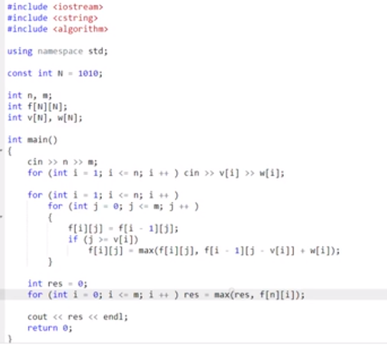

1. 01背包问题——每个物品只取一次
2. 完全背包问题——每个物品可以任意取
3. 多重背包问题——
4. 混合背包问题
5. 二位费用的背包问题
6. 分组背包问题
7. 背包问题求方案数
8. 求背包问题的方案
9. 有依赖的背包问题


# 01背包

二维方法

```java
/*
f[i][j]:表示只看前i个物品，总体积是j的情况下，总价值最大是多少
v是总体积大小,w是价值
f[i][j] = max(f[n][0-v])
f[i][j]:
1. 不选择第i个物品，那么f[i][j] = f[i-1][j]
2. 选择第i个物品，那么f[i][j] = f[i-1][j-v[i]]+w[i]
f[i][j] = max(1. 2.)
f[0][0] = 0
*/
```



空间优化


# 完全背包

所有的物品可以选择任意次数，在不超过背包容量的情况下，要求价值最高

```java
/*
f[i]表示总体积是i的情况下，最大的价值是多少
result = max(f[0...m])

for(int i =0;i<n;i++){
	for(int j = v[i];j<=m;j++){
		f[j] = max(f[j],f[j-v[i]]+w[i]);
	}
}
*/


```

注意01背包和完全背包的状态转移方程是一样的，但是它的遍历顺序是不一样的


# 多重背包问题

与完全背包问题类似，但是要求每件物品最多仅能够有si个，这个需要借用01背包的方法来解，因为这个需要限制个数，01背包是限制到1，这里加一重循环可以限制到si

```java
/*
f[i]表示总体积为i，最大价值是多少
for(int i=0;i<n;i++){
	for(int j =m;j>=v[i];j--){
		f[j] = max(f[j],f[j-v[i]]+w[i],f[j-2*v[i]]+2*w[i],...，f[j-k*v[i]]+k*w[i])//k是si的范围内的数字
	}
}
*/
```


## 优化

多重背包二进制优化——将多重背包问题变为01背包问题

方式，如果一个物品有si个，将这个物品复制si分，存入原来的物品中，并将这些复制出来的认为都是不一样的物品，之后对每个物品认为只能够用一次，这样问题就变成了一个01背包问题，但是这样的拆分方法对时间复杂度没有增益

#### 前提

对于某一个数n，在n中选择最少的小于等于n的数，要求这些数能够组合成小于等于n的所有数。

结果因此最少的数字个数为ceil(log(n))，上取整。

数字的取值为：1 2 4...2^[ceil(log(n))-1]，最后还需要一个n - sum(1 2 4...2^[ceil(log(n))-1])

例如对于10，他可以取的数字为1，2，4，3.因为1 2 4可以组成0-7，0-7与3就可以组合成0-10

#### 思路

优化的最终思路就是将si拆分为前提条件中的组合数，并将这些组合数作为全新的物品，变成一个01背包问题


#### 单调队列优化思路——之后想一下

对体积以及v进行求余，将相同的余数的归为一类

例如对`f[j] = max(f[j],f[j-v[i]]+w[i],f[j-2*v[i]]+2*w[i],...，f[j-k*v[i]]+k*w[i])//k是si的范围内的数字`这样的一个f[j]，求解的方式是遍历这些k，但是考虑j与v的mod当j%v[i]=MOD时，f[j-v[i]],f[j-2v[i]]的MOD的值都是相同的，也就是说f[i]的状态转移过程都是从余数相同的状态中过来的。之后如果考虑

f[j+v[i]],可以发现其实两者的之间的转移状态是相同的


# 混合背包

上面的三种问题混合在一起，不同的物品有不同的容量限制

解法：判断当前的类型，按照类型进行转移就可以了


# 二维费用问题

除了容量限制之外，还对物品的重量进行了限制

f\[i][j]表示体积为i，重量为j的情况下能拿到的最大价值，之后按照01背包或者完全背包对体积，重量进行遍历


# 分组背包问题


对每个物品组，假设组内有k个物品，那么就有k+1个决策状态，遍历这些决策状态就可以了


# 有依赖的背包问题

依赖关系构成了一棵树，按照树形dp来进行分析，对每个点计算其子节点对应不同体积的最大价值，之后对于根节点按照分组背包进行选择


# 背包问题方案数

利用一个数据来记录体积为j情况下的方案数量


t==f[j]和t == f[j-v[i]+w]表示统计从方案中转移过来的数目

# 背包问题的具体方案

根据最优路线判断

