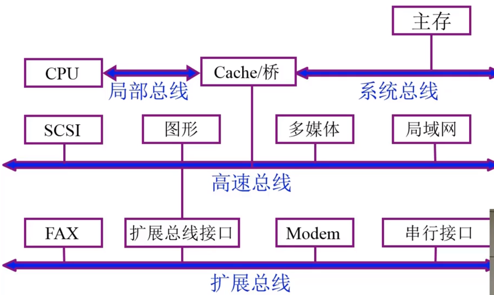
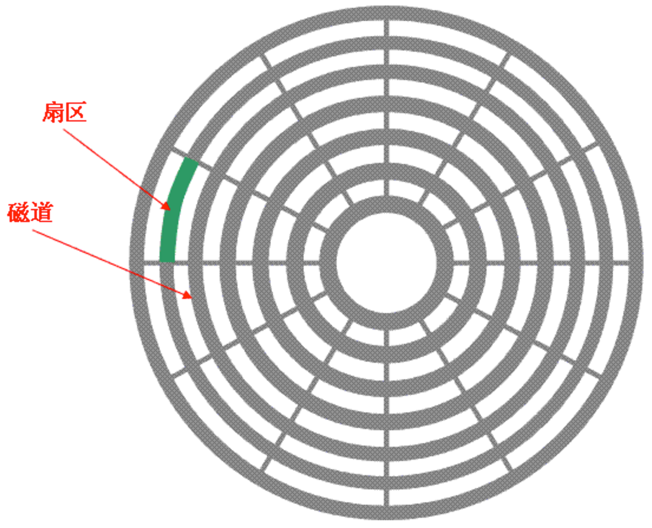

# 计算机组成原理

内容——自顶向下进行分析

- 基本部件的结构以及组织方式

- 基本运算的操作原理
- 基本部件和单元设计思想

教材——唐溯飞《计算机组成原理》，《数字设计和计算机体系结构》，

## 系统概论

### 组成结构

- 硬件——计算机实体
- 软件——具有各类特殊功能的信息组成

软硬件层次结构

硬件封装了一定的指令，软件利用硬件提供的接口进行操作

### 计算机的基本组成

#### 冯诺依曼计算机特点

1. 计算机由五大部分组成——运算器，控制器，存储器，输入输出设备
2. 指令和数据以同等地位存于存储器，可按地址寻访
3. 指令和数据用二进制表示
4. 指令由操作码和地址码组成
5. 存储程序——指令存储在存储器中
6. 以运算器为中心

结构化硬件设备

以运算器作为中心

以存储器作为中心

现代计算机硬件框图

#### 存储器

存储器——存储体+MAR+MDR

存储体-存储单元-存储元件(0/1)，存储单元存放一串二进制代码，存储字，存储单元中二进制代码的组合，存储字长，存储单元中二进制代码的位数，每个存储单元有一个地址

MAR——存储器地址寄存器，每个数据的位置，反映了存储单元的个数

MDR——保存了存储器数据寄存器，也就是实际存下来的数据，反映了存储字长

#### 运算器

##### 结构

##### 功能

|      | ACC         | MQ            | X      |
| ---- | ----------- | ------------- | ------ |
| 加法 | 被加数      |               | 加数   |
| 减法 | 被减数      |               | 减数   |
| 乘法 | 乘积高位    | 乘数/乘积低位 | 被乘数 |
| 除法 | 被除数/余数 | 商            | 除数   |

- 加法操作过程
  - 指令[加，M]——初态[ACC,被加数]也就是把被加数保存到ACC中，之后把M取到X中完成数据准备，最后执行相加操作得到结果，结果保存在ACC中
- 减法操作
  - 指令[减，M]——初态[ACC,被减数]也就是把被减数保存到ACC中，之后把M取到X中完成数据准备，最后执行相减操作得到结果，结果保存在ACC中
- 乘法操纵
  - 指令[乘，M]——初态[ACC,被乘数]也就是把被乘数保存到ACC中，之后把M保存到MQ寄存器中完成数据准备，然后把ACC中保存的数先送到X中，由于乘法是通过累加和移位完成的，因此还需要把0送到ACC中，再执行乘法操作，其中高位放在ACC中，低位放在MQ中
- 除法操作
  - 指令[除，M]——初态[ACC,被除数]也就是把被除数保存到ACC中，之后把M保存到X中完成数据准备，然后执行除法操作，其中余数保存在ACC中，

#### 控制器

控制器的基本功能是解释指令，保证指令的顺序执行

完成一条指令的过程

- 取指令——指令保存的位置：PC(程序计数器)，保存当前欲执行的指令的地址，且具有计数功能，PC+1->PC
- 分析指令——IR：存放当前要执行的指令
- 执行指令——CU：执行指令的单元

#### 主机完成一条指令的过程

取数指令

PC中存放了当前要执行的取数指令的地址，将该指令送到MAR中，存储体在控制器控制下根据MAR从存储体中获取实际的指令并送到MDR中，之后再送到IR中，IR获得指令后交由CU进行指令的分析，取数指令中包含了要获取的数的地址，因此在CU的控制下将取数地址送到MAR中，存储器获得数据之后送到MDR，在由MDR送到ACC中

存数指令

PC中存放了当前要执行的存数指令的地址，将该指令送到MAR中，存储体在控制器控制下根据MAR从存储体中获取实际的指令并送到MDR中，之后再送到IR中，IR获得指令后交由CU进行指令的分析，存数指令中包含了要存入的地址，因此在CU的控制下将存数地址送到MAR中，之后ACC将要存的数送到MDR中，存储器根据地址将数存入

### 技术指标

机器字长：CPU一次能处理数据的位数，与CPU中的寄存器位数有关

运算速度：

- 主频：决定工作频率
- 核数，每个核支持的线程数
- 吉普森法：每个指令执行耗时不同，而且指令出现的频率也不同
- CPI：执行一条指令需要的时钟周期
- MIPS：每秒执行百万指令
- FLOPS：每秒完成浮点运算次数

## 总线

连接各部件的信息传输线，是各个部件共享的传输介质

信息的传输方式

- 串行
- 并行——容易出错，传输距离短

结构分类

- 单总线结构——所有的设备都连在总线上，当有数据在总线上传输时，其他的设备就不能使用总线（总线争用）
- 面向CPU的双总线结构——在CPU与主存之间设置一条专门的总线，但是如果主存与IO设备之间有数据交换，CPU的功能还是要暂停

- 面向存储器的双总线结构——在CPU与主存设置专门的总线

### 总线分类

片内总线

系统总线

- 数据总线——双向，与机器字长，存储字长有关
- 地址总线——单向，与存储地址，IO地址有关
- 控制总线——有出，有入

通信总线——计算机之间或者计算机系统的通信

### 总线特性及性能指标

1. 机械特性
   - 尺寸，形状，管脚数等
2. 电气特性
   - 传输方向，有效电平
3. 功能特性
   - 传输线的功能，地址，数据，控制等
4. 时间特性
   - 信号的时序关系

性能指标

1. 总线宽度——数据线根数
2. 标准传输率——每根传输的最大字节数
3. 总线复用——地址线和数据线复用
4. 信号线数——地址线，数据线与控制线
5. 总线控制方式
6. 时钟同步/异步

### 双总线结构

### 三总线结构

### 扩展总线

### 四总线结构

### 总线控制

#### 总线判优控制

主设备——对总线有控制权

从设备——相应从主设备发来的总线命令

控制方式

1. 集中式
   - 链式查询
     - 
     - BG总线同意需要在IO链上一直向下走，直到找到各个提出占用总线的接口位置，存在较多的缺点，例如对电路比较敏感
   - 计数器定时查询
     - 
     - 比上一种好在可以设置优先级，以及实现循环优先
   - 独立请求方式
     - 
     - 优先级灵活，

### 总线通信控制

解决通信双方协调配合问题

总线传输周期

1. 申请分配阶段——主模块申请，总线仲裁决定
2. 寻址阶段——主模块向从模块给出地址和命令
3. 传数阶段——主模块和从模块交换数据
4. 结束阶段——主模块撤销有关信息

#### 通信方式

- 同步通信——由统一时标控制数据传送
- 异步通信——采用应答方式
- 半同步通信——同步，异步结合
- 分离式通信——充分挖掘系统总线每个瞬间的能力
  - 一个总线的传输周期分为子周期1和子周期2，主模块申请总线占用之后，发出地址和命令，之后立刻放弃总线占用，之后从模块完成数据准备之后再申请占用总线，将信息送到总线上

## 存储器

### 概述

存储器分类

1. 存储介质分类——半导体存储器，磁表面存储器，磁芯存储器，光盘存储器
2. 存取方式分类——存取时间与物理地址无关包括随机存储器和只读存储器，存取时间与物理地址有关，串行访问
3. 按作用分类——RAM和ROM，flash memory，辅助存储器

存储器的层次结构

特性关系

缓存-主存层次以及主存-辅存

### 主存储器

#### 基本组成

#### 主存中存储单元分配

假设一次可以读出32位数，可以保存到一个存储单元，分为大端和小端两种方式

大端：大端模式，是指数据的高字节保存在内存的低地址中，而数据的低字节保存在内存的高地址中，这样的存储模式有点儿类似于把数据当作字符串顺序处理：地址由小向大增加，而数据从高位往低位放

小端：数据的高字节保存在内存的高地址中，而数据的低字节保存在内存的低地址中，这种存储模式将地址的高低和数据位权有效地结合起来，高地址部分权值高，低地址部分权值低。

#### 主存技术指标

存储容量——主存存放二进制代码的总位数

存储速度——存取时间：存储器的访问时间，读出时间，写入时间；存取周期：连续两次独立的存储器操作

#### 半导体存储芯片结构

片选线用于选择当前作用的芯片

#### 存储芯片的译码驱动方式

线选法和重合法

两者的区别在于线选法将地址编为一维的地址，而重合法将其变为二维的地址进行选择

### 随机存取存储器-P27-P28

#### RAM

使用触发器来保存0和1

#### 动态RAM

使用电容来保存数据

#### 动态刷新RAM

降低了读写周期

#### 动态RAM与静态RAM

|          | DRAM | SRAM   |
| -------- | ---- | ------ |
| 存储原理 | 电容 | 触发器 |
| 集成度   | 高   | 低     |
| 芯片引脚 | 少   | 多     |
| 功耗     | 小   | 大     |
| 价格     | 低   | 高     |
| 速度     | 慢   | 快     |
| 刷新     | 有   | 无     |

### 只读存储器ROM

现在一般使用闪存作为只读存储器

### CPU与存储器的连接

#### 存储器容量扩展

1. 位扩展
   - 将两片存储芯片1K\*4位组成1K\*8位的存储器，需要连接其片选线，读写控制线，共计还有10根地址线和8根数据线
   - 
2. 字扩展（增加存储字的数量）
   - 将两块1k\*8位芯片变为2k*8位芯片，利用片选线做芯片选择芯片选择
   - 
3. 位字扩展
   - 上面两种的组合

#### 连接方式

1. 连接地址线
2. 数据线连接
3. 读写命令线连接
4. 片选线

#### 主存储器的校验

##### 合法代码集合

当代码数据出错时，检测出其中错误的1或者0

例如对于合法代码集{000,001,010,011,100,101,110,111}，这个是没有检错嫩里的，而合法代码集{000,011,101,110}(要求其中的1为偶数)则能够检测出1位错但无法纠错

编码距离——任意两组合法代码之间二进制位数的最小差异，编码的纠错，检错能力说编码的最小距离有关，汉明码

汉明码——采用分组的奇偶校验P37-38

1. 汉明码需要添加的位数为2^j>=n+k+1，k为汉明码的最小位数
2. 检测位置放在2^i
3. 检测位的取值与该位所在的检测小组承担的奇偶校验任务有关

#### 提高访存速度的措施

- 采用高速器件
- 采用层次结构
- 调整主存结构

### 高速缓冲存储器cache

避免CPU空等问题的发生，利用了程序的局部性原理

#### 主存和缓存的编址

主存和缓存都被分成若干的块，两者的块内地址都是相同的，同时为了保证主存能够在缓存中能找到缓存中对应的块，需要在缓存中进行标记，主存与缓存标记进行比较，相同的就是目标

#### 命中与未命中

命中：主存块调入缓存

未命中：主存块未调入缓存

#### cache的基本结构

cache替换机构就是执行页面置换算法的机构，缺页中断等信号

#### cache读写操作

写操作方式

- 写直达法：每次写操作即写入cache又写入主存，写操作时间就是访问主存的时间，cache块退出时不需要对主存执行写操作，更新策略易实现，但是频繁写入主存会导致访问速度降低
- 写回法：写操作只把数据写入cache而不写入主存，只有当cache数据被替换出去才会写回主存

#### cache的改进

1. 分级cache
2. 统一缓存和分离缓存，将指令以及数据分散在不同的cache中

#### 地址映射

1. 直接映射
   - 将主存储体按照cache的大小进行分段，段内各块一一对应
2. 全相连映射
   - 主存储器中的任意一个块可以存放到缓存中的任意一个块
   - 缺点寻找缓存中对应的块速度比较慢
3. 组相联映射
   - 先对缓存分组，每个组中可以又多个块，主存中按照组数进行分区，区中的块与组号对应，并且可以放到组中空闲的块中
   - 

### 辅助存储器

不与CPU交换信息

#### 硬盘存储器

固定磁头和移动磁头，可换盘和固定盘

#### 硬盘存储结构

## 输入输出设备

发展阶段

1. 分散连接以及CPU和IO设备串行工作
2. 接口模块和DMA阶段——总线连接方式，CPU和IO设备并行工作：中断方式和DMA方式
3. 具有通道结构的阶段
4. 具有IO处理机的阶段

### 组成

#### IO软件

1. IO指令
   - 操作码，命令码，设备码
2. 通道指令
   - 通道自身的指令，需要指出数组的首地址，传输的字数和操作命令

#### IO硬件

1. 设备——设备控制器以及通道
2. 接口

### IO设备与主机的连接方式

#### 编址方式

1. 统一编址
   - 将IO设备视为内存的一部分，可以直接使用取数或者存数指令
2. 不统一编址
   - 在内存地址空间之外，设置独立的寻址空间，这种需要专用的IO指令

#### 设备选址

用设备选择电路识别是否被选中

#### 传输方式

串行，并行

#### 联络方式

1. 立即响应
2. 异步工作采用应答信号
   - 
3. 同步工作采用时标

### IO设备与主机的连接方式

1. 辐射式连接——每一台设备都配有一套控制线路和一组信号线，但是不方便增删设备
2. 总线连接——便于增删设备

### IO设备与主机信息传输的控制方式

#### 程序查询方式

#### 程序中断方式

Io工作——自身准备（CPU不查询）以及与主机交换信息（CPU暂停现行工作）

#### DMA方式

上面两种方式中数据流经的通道为IO->CPU->内存

DMA方式中内存和IO具有一个专门的数据通道，可以解放CPU，使CPU在数据准备阶段不需要中断运行的程序，这种方式称之为周期挪用

实际的操作是，发出IO请求之后，DMA发出总线占用的请求，并占用CPU使用总线的权利，完成数据从IO到内存的拷贝，之后再交还总线的使用权，再这一期间内，CPU还可以继续运行只是不能使用总线进行指令的获取操作，现代的计算机指令都是预取的，会有一个缓存保存缓存的指令。

不同的DMA方式

1. 停止了CPU访问主存——控制简单，CPU处于不工作状态或保持状态，未充分发挥CPU对主存的利用率
2. 周期挪用——DMA将总线的控制分成多个周期，只在这些周期期间占用总线，其他时间还是交给CPU
   - 
3. DMA与CPU交替访问——将一个周期分为C1和C2，C1交给CPU使用，C2交给DMA使用

##### DMA接口的功能

1. 向CPU申请DMA传送
2. 处理总线控制权的转交
3. 管理系统总线，控制数据传输
4. 确定数据传输的首地址和长度，修正输送数据地址和长度
5. DMA传送结束，给出结束信号

##### DMA接口组成

AR：地址寄存器——告知CPU传输的首地址

WC：数据寄存器——传输的数据量

BR：buffer——缓冲，暂存数据

DAR：保存设备信息

DMA控制逻辑：发出给定时序信号，请求信号，响应信号等

中断机构：数据准备完成，发起中断

##### DMA工作过程

1. 预处理——设置传输方向，设置DAR（传输的地址），传输的字长WC，地址AR
2. 数据传输过程
3. 后处理——数据校验，判断是否继续使用DMA

##### DMA接口与系统的连接

1. 具有公共请求线的DMA请求
   - 
2. 独立的DMA请求
   - 

### 外部设备

各种人机交互设备

## IO接口

设置IO接口的目的

1. 实现设备选择
2. 实现数据缓冲达到速度匹配
3. 实现苏韩剧串-并格式转换
4. 的hi思安点评转换
5. 方荧设备状态
6. 传送控制命令

### 接口的接线方式

1. 总线连接方式——将IO接口通过数据线连接到总线上，其他的状态线等也接通到总线上

!

### 程序查询流程

### 程序流程

## 程序中断方式

### 中断概念

当发生中断时，CPU要中断当前程序的执行，启动中断服务程序，处理完成之后回到之前中断的位置，继续执行

中断源——终端产生的原因

### 程序中断方式的接口电路

1. 配置中断请求触发器和中断屏蔽触发器
2. 排队器——不同的中断设备优先级不同，保证高速设备优先响应P55
3. 中断向量地址形成部件——找到中断服务程序入口地址
4. 中断方式接口电路的基本组成

排队器

### 中断向量地址形成部件

中断向量——中断服务程序的地址

硬件向量法——由硬件产生向量地址，再由向量地址找到入口地址

### 中断处理过程

1. CPU响应中断的条件和时间
   - 条件——允许冲断触发器EINT=1
   - 时间——当D=1且MASK=0时，在每条指令执行阶段的结束前，CPU发中断查询信号

1. 启动外部输入设备，B被设置为1，表示设备启动，D被设置为0，表示数据未准备好
2. 外部设备启动，待输入数据
3. 输入数据完成，D被置为1，B被置为0，表示设备空闲
4. 设备工作结束，INTR接收到D中的1
5. CPU发出中断查询信号，将INTR置为1，并启动排队器进行排队
6. 发出中断请求
7. CPU发出中断响应信号，经设备编码器之后形成向量地址，
8. 向量地址通过数据线传递给CPU，最终到PC

### 中断服务流程

1. 保护现场——程序端点保护，寄存器内容的保护
2. 中断服务——对不同的IO设备有不同的服务
3. 恢复现场
4. 中断返回

### 单中断和多重中断

单重中断——不允许中断服务被其他中断中断

多重中断——允许中断服务被更高优先级的中断中断

## 数

### 数的表示方法

#### 无符号数

仅有数值部分，寄存器的位数反映了无符号数的表示范围

8：0~255

16：0~65535

#### 有符号数

包含符号以及数值部分，还可能存在小数点，一般小数点以约定的方式给出，

### 表示方法

原码：[x]原=[x(x大于等于0)，2**n-x(x小于0)]，问题：0有多种表示方法

小数：[x]原=[x(x大于等于0小于1)，1-x(x大于-1，小于等于0)]，x=-0.01，x原=1-（-0.01）=1.01

补码：一个负数加上模得到负数的补数【一个正数和负数互为补数时，绝对值之和为模数】，[x]补=[0(x大于等于0小于2**n)，2\*\*(n+1)+x(x小于0)]

小数的补码：[x(0到1)，2+x(-1到0)]

移码：解决补码难以比较大小的问题——由原来的补码加上模来2\*\*n表示一个数

#### 数的定点表示和浮点表示

##### 定点表示

指小数点以约定的形式标出

##### 浮点表示

解决定点表示需要调整小数点的位置，且数的表示范围较小

浮点数的表示方法：N=S*r^j，其中S为尾数，j为阶码(表示为2进制)，r为尾数的基值,S为小数，可正可负，j为整数，可正可负，规格化要求S在[0.5-1]之间

浮点数的表示范围：

参考

下图为m=4(阶码的二进制位数，不包含符号位)，n=10(尾数的二进制位数，不包含符号位)，r=2能够表示的正负数范围，包括尾数以及阶码的符号位共计16位

#### 机器零

如果浮点数的尾数是0，那么不管阶码是多少，都表示0，解码等于或者小于它所表示的最小数，不论尾数是多少，都按零处理

### 运算方法

#### 移位计算

符号位不会进行改变，补码的移位规则比较复杂，目的是与原码的移位效果保持一致

#### 加减运算

1. 加法
   - 整数：[A]补+[B]补=[A+B]补（mod 2**(n+1)）
   - 小数：[A]补+[B]补=[A+B]补（mod 2）
2. 减法
   - 整数：[A-B]补=[A+(-B)]补=[A]补+[-B]补(mod 2**(n+1))
   - 小数：[A-B]补=[A+(-B)]补=[A]补+[-B]补（mod 2）

##### 溢出判断

符号相同的两个数相加，如果符号位变了就产生了溢出

#### 乘法计算

位运算进行乘法计算的原理

#### 除法计算

符号位需要保存，利用竖式除法进行计算，可能出现除不尽的情况

#### 浮点四则运算

浮点加减计算步骤

1. 对阶——要求阶码的值相同（计算机中是做了两个阶码的差），小阶向大阶对齐，可能会导致精度问题
   - 
2. 规格化数据

### 运算器——算术逻辑单元ALU

一系列的电路单元，如加法单元，进位单元链等P87-89的单元

## 指令系统

### 机器指令

指令格式：操作码+地址码 

操作码：指出机器进行的操作——1）、长度固定的操作码——用于较长的指令；2）长度可变的指令

扩展操作码：操作码的位数随地址码数的减少而增加

地址码：四地址码[OP,A1,A2,A3,A4],其中A1第一操作数地址，A2第二操作数地址，A3结果地址，A4下一条指令地址

如果指令长度为32位，操作码固定8位，那么每个操作数的地址就是6位，那么寻址范围就是2**6

如果地址码的A4用PC代替，那么四地址码就变成三地址码，那么寻址范围就变成2\*\*8，如果A3用A1或者A2来替代，那么寻址范围又变成2\*\*12,变成二地址码

最后还有一地址码，仅有一个操作数，最后的结果放在ACC中。

### 指令字长

取决于操作码长度，操作码地址长度，操作码地址个数

### 操作数类型和种类

1. 类型
   - 地址：无符号整数
   - 数字：定点数，浮点数，十进制数
   - 字符：ASCII
   - 逻辑数：逻辑运算

### 数据存储方式

存放数据的时候数据可能长度不一样，需要解决数据长度不统一的问题

1. 任意位置存储，将要存储的数据按照顺序进行密集存放，优点是不浪费空间，但是难以查找
2. 存储数据时从一个存储字的起始位置开始访问，访问数据比较快，但是浪费空间
3. 边界对准方式——按地址的整数倍存储

### 操作类型

1. 数据传送
   - 源——寄存器，存储器等
   - 目的——寄存器，存储器
   - 指令包括——MOV，LOAD
2. 逻辑运算
3. 移位操作
   - 算数移位
   - 循环移位
4. 转移指令
   - 无条件转移指令
   - 条件转移
   - 调用和返回
   - 陷阱指令，意外事故的中断，在出现事故时，由CPU自动产生并执行
5. 输入输出

### 寻址方式

#### 指令寻址

确定本条指令的操作数地址以及下一条要执行的指令的指令地址

1. 顺序寻址——PC+1->PC
2. 条约寻址——由跳转指令指出JMP

#### 数据寻址

形式地址——指令字中的地址

有效地址——操作数的真实地址

1. 立即寻址——形式地址A就是操作数，立即寻址需要一个标记，且不需要访存
2. 直接寻址——有效地址由形式地址直接给出，会访问一次存储器，地址码决定了位数决定了寻址范围
3. 隐含寻址——操作数地址隐含在操作数中，可能一个操作数保存在ACC中，指令只提供了一个操作数
4. 间接寻址——有效地址由形式地址简介提供，需要访问两次内存，可扩大寻址范围
5. 寄存器寻址——有效地址即为寄存器编号，不访存
6. 寄存器间接寻址——有效地址在寄存器中，方便编写循环程序
7. 基址寻址——采用专用寄存器作基址寄存器EA=(BR)+A，BR是基址，由操作系统或管理程序决定；采用通用寄存器做基址寄存器EA=R0+A,得到的地址是操作数的实际地址，要再去R0一般不变
8. 变址寻址——EA=IX+A，IX是一个专用的变址寄存器，IX的内容可以变
9. 堆栈寻址——先进后出
10. 相对寻址——相对当前PC的偏移量

#### 指令格式

1. 指令系统的兼容性
2. 操作类型，数据类型，指令格式[字长，操作码位数，地址码位数]
3. 寻址方式
4. 寄存器个数

## RISC技术

程序中80%的语句仅使用了处理机中20%的指令

RISC：选用使用频率高的一些简单指令，复杂指令的功能由简单指令来组合

指令长度固定，指令格式种类少，寻址方式少

CISC：系统指令复杂庞大，指令使用频度相差大

指令长度不固定，指令格式种类多，寻址方式多

## CPU结构和功能

### 结构

1. 功能
   - 取指令，分析指令，执行指令
   - 控制程序输入和结果输出，总线管理
   - 处理异常
2. 运算器
   - 算术运算和逻辑运算

### 框图

1. CPU与总线
   - 
2. CPU与寄存器
   - 用户可见寄存器
     - 通用寄存器——存放操作数，寻址专用寄存器
     - 数据寄存器——存放操作数，拼接起来存放双倍字长数据
     - 地址寄存器——存放地址，用于寻址
     - 条件码寄存器——保存条件码
   - 控制和状态寄存器
     - 控制寄存器——PC-MAR-M-MDR-IR，控制CPU操作
     - 状态寄存器——状态寄存器存放条件码，PSW寄存器存放程序状态字
3. 控制单元CU和中断系统
   - CU产生指令的位操作命令
   - 中断

### 指令周期

取出并执行一条指令所需的时间，取指，分析，执行

1. 具有间接寻址的指令周期：取指周期-间址周期-执行周期
2. 具有中断周期的指令周期：取指周期-间址周期-执行周期-中断周期

#### 指令周期的流程

#### CPU访存的四种标志

性质：取指令[取指周期]，取地址[间址周期]，存取操作数[执行周期]，存程序断点[中断周期]

#### 指令周期的数据流

1. 取指周期数据流
   - 
2. 间址周期数据流
   - 
3. 执行周期数据流
   - 不同的指令不同
4. 中断周期数据流
   - 保存断点-中断服务程序入口-恢复现场
   - 

### 指令流水

目标是提高计算机速度

1. 提高访存速度——使用高速芯片，cache，多体并行
2. 提高IO与主机间的传送速度
3. 提高运算器速度

#### 原理

1. 指令的串行执行——取指令1-执行指令1-取指令2-执行指令2
2. 指令的二级流水——取指令1-执行指令1/取指令2-执行指令2/取指令3-。。。
3. 影响指令流水效率的因素-
   1. 执行时间大于取指时间：在取值部件以及执行指令的部件之间加一个缓冲，保存拿到的指令
   2. 条件转移指令：必须等上条指令执行结束才能确定下一条指令的地址，可以使用分支预测的方法类解决[自学]
   3. 结构相关：不同的指令争用相同的功能部件。可能需要停顿解决或者将指令存储器和数据存储器分开，以及指令预取技术
   4. 数据相关：不同指令因重叠操作，可能改变操作数的读写，访问顺序
      1. 写后读相关-SUB
      2. 读后写相关-STA
      3. 写后写相关-MUL
   5. 控制相关：由转移指令造成

#### 流水线性能

1. 吞吐率：单位时间流水线完成的指令量
2. 加速比：流水线与非流水线的速度比
3. 效率：各功能段的利用率

#### 流水线的多发技术

1. 超标量技术：每个时钟周期可并发多条独立指令
2. 超流水线技术：把一个时钟周期分为多段，一个时钟周期内功能部件使用多次
3. 超长指令字技术：将多条能并行操作的指令合并为一条，变成具有多个操作码字段的超长指令字

#### 流水线结构

### 中断系统

#### 中断源

1. 认为设置的中断——转管指令
2. 程序性事故
3. 硬件故障
4. IO设备
5. 外部事件

#### 中断系统的功能

1. 向CPU提出请求
2. 中断源同时提出请求
3. 什么时候提出中断，什么方式
4. 如何保护现场
5. 如何寻找入口
6. 如何恢复
7. 如何处理中断处理过程中又出现的中断

#### 中断请求标记和判优逻辑

1. 中断请求标记
   - 标记一个中断源INTR
2. 中断判优逻辑
   - 中断的优先级标记
   - 硬件实现使用排队器——之前提到的链式排队器
   - 软件查询——由程序实现

#### 中断服务程序入口地址寻找

1. 硬件向量法
2. 软件查询

#### 中断响应

1. 响应中断的条件
   - 允许中断触发器EINT=1
2. 响应中断的时间
   - 指令执行阶段结束之后，CPU会发查询信号
3. 中断隐指令
   1. 保护程序断点
   2. 寻找服务程序入口地址——向量地址->PC
   3. 硬件 关中断

#### 保护和恢复现场

1. 保护现场——端点和寄存器内容
2. 恢复现场——中断服务程序完成

#### 多重中断

针对优先级更高的中断

实现多重中断的条件

1. 允许中断触发器INRT=1，设置开中断指令
2. 优先级高的中断有权中断优先级低的中断
3. 断点保护——将断点入栈，由中断隐指令完成

#### 中断屏蔽

1. 屏蔽触发器——关闭中断的发生，拒绝某个中断源

## 控制器CU/P114

控制器发出的指令在指令的四个周期中都需要发出，主要与中断信号的发出等相关

1. 外特性
   - 输入信号——时钟，指令寄存器，外来信号，CU
   - 输出信号——CPU内的控制信号，送到控制总线的信号，

## 时序系统

1. 机器周期
   - 所有指令执行过程的基准时间
2. 时钟周期
   - 一个机器周期可完成的若干个位操作，将机器周期划分为若干个时间单位

### 控制方式

1. 同步控制
   - 所有位操作由统一的基准时标来控制
   - 不定长的机器周期
   - 中央控制和局部控制相结合的方法
2. 异步控制
   - 无基准时标信号
   - 采用应答方式
3. 联合控制方式
4. 人工控制

### 控制单元设计

#### 时序设计的原则

1. 微操作的先后顺序不能修改
2. 被控对象不同的微操作尽量安排在一个节拍内完成
3. 占用时间较短的微操作尽量安排在一个节拍内完成，允许由先后顺序

## 微程序设计

P122之后的内容

### 编码方式

1. 直接编码
   - 在微指令的操作控制字段中，每一位代表一个微操作命令
2. 字段直接编码
   - 吧微指令的控制字段分成若干段，每段发出控制信号
3. 字段间接编码
4. 混合编码

### 微指令地址的形成

1. 微指令的下地址字段指出
2. 根据机器指令的操作码形成
3. 增量计数器
4. 分支转移
5. 通过测试网络
6. 硬件产生微程序入口

## 磁盘IO

机械硬盘和固态硬盘是两种常见的硬盘设备，但是与主存相比，CPU对这两者的访问速度比较慢，

CPU访问硬盘速度低的原因：

1. CPU访问硬盘数据的过程比较复杂，会先通过IO操作将磁盘中的数据读入内存，再访问内存中的数据
2. 机械硬盘访问磁盘中的数据以来的是机械结构，需要移动磁盘中的机械臂

### IO操作的基本方式

1. 编程IO
   - CPU负责全部的工作，如果想要在屏幕上输出字符串，那么CPU每次都会向IO设备中写入一个新字符，写入后会轮询设备的状态等待完成工作后写入新的字符。这种方式会占用全部的CPU资源，造成浪费
2. 中断驱动IO
   - 设备闲置时主动发起中断暂停当前进程并保存上下文，而操作系统会执行IO设备的中断处理程序；如果当前不包含待打印的字符，停止中断处理程序并恢复暂停的进程；如果当前包含待打印的字符，将下一个字符拷贝到设备中并恢复暂停的进程
   - 中断驱动方式可以在设备繁忙时，让CPU能够处理其他任务，尽可能提高CPU的利用率
3. 直接内存访问
   - 利用DMA控制器来执行IO操作，中断驱动IO需要为每个字符触发操作系统中断，这会消耗一定的CPU时间。当我们使用DMA控制器时，CPU会一次将缓冲区中的数据全部读入到DMA控制器中，DMA控制器会负责将数据按字符写入IO设备
   - DMA控制器可以解放CPU并减少中断次数，但是它的执行速度与CPU相比却很慢，因此要求DMA能够快速驱动IO设备

### 硬盘

硬盘内部主要部件为磁盘盘片、传动手臂、读写磁头和主轴马达。实际数据都是写在盘片上，读写主要是通过传动手臂上的读写磁头来完成。实际运行时，主轴让磁盘盘片转动，然后传动手臂可伸展让读取头在盘片上进行读写操作。

由于单一盘片容量有限，一般硬盘都有两张以上的盘片，每个盘片有两面，都可记录信息，所以一张盘片对应着两个磁头。盘片被分为许多扇形的区域，每个区域叫一个扇区，硬盘中每个扇区的大小固定为512字节。盘片表面上以盘片中心为圆心，不同半径的同心圆称为磁道，不同盘片相同半径的磁道所组成的圆柱称为柱面。磁道与柱面都是表示不同半径的圆，在许多场合，磁道和柱面可以互换使用。

早期的硬盘每磁道扇区数相同，此时由磁盘基本参数可以计算出硬盘的容量：存储容量=磁头数\*磁道（柱面）数\*每道扇区数*每扇区字节数。由于每磁道扇区数相同，外圈磁道半径大，里圈磁道半径小，外圈和里圈扇区面积自然会不一样。同时，为了更好的读取数据，即使外圈扇区面积再大也只能和内圈扇区一样存放相同的字节数（512字节）。这样一来，外圈的记录密度就要比内圈小，会浪费大量的存储空间。

如今的硬盘都使用ZBR（Zoned Bit Recording，区位记录）技术，盘片表面由里向外划分为数个区域，不同区域的磁道扇区数目不同，同一区域内各磁道扇区数相同，盘片外圈区域磁道长扇区数目较多，内圈区域磁道短扇区数目较少，大体实现了等密度，从而获得了更多的存储空间。此时，由于每磁道扇区数各不相同，所以传统的容量计算公式就不再适用。实际上如今的硬盘大多使用LBA（Logical Block Addressing）逻辑块寻址模式，知道LBA后即可计算出硬盘容量。

影响磁盘的关键因素是磁盘服务时间，即磁盘完成一个IO请求所花费的时间，由寻道时间，旋转延迟和数据传输时间三部分构成

1. 寻道时间
   - 指将读写磁头移动到正确的磁道上所需的时间，寻道时间越短，io操作越快
2. 旋转延迟
   - 指盘片旋转将请求数据所在的扇区移动到读写磁盘下方所需要的时间，旋转延迟取决于磁盘转速
3. 数据传输时间
   - 完成传输所请求的数据所需要的时间，取决于数据传输率，其值等于数据大小除以数据传输率

机械硬盘的连续读写性能很好，但随机读写性能很差，主要是因为磁头移动到正确的磁道上需要时间，随机读写时，磁头需要不停地移动，造成性能的浪费

#### 操作系统与磁盘交互的过程

Linux系统中对于磁盘的一次读请求在核心空间中所要经历的层次模型。linux执行一次read或者write的过程。从图中看出：对于磁盘的一次读请求，首先经过虚拟文件系统层（VFS Layer），其次是具体的文件系统层（例如Ext2），接下来是Cache层（Page Cache Layer）、通用块层（Generic Block Layer）、I/O调度层（I/O Scheduler Layer）、块设备驱动层（Block Device Driver Layer），最后是物理块设备层（Block Device Layer）。

##### VFS虚拟文件系统层

一种软件机制，作为文件系统的管理者，与其相关的数据结构只存在于物理内存中，用来屏蔽下层具体文件系统的差异，为上层的操作提供一个统一的接口。因此linux中可以存在多种文件系统并且对文件的操作可以跨文件系统而执行

VFS中存在一系列的向物理文件系统转换的数据结构，

1. 超级块(super block)：超级块对象表示一个文件系统，存储一个已安装的文件系统的控制信息，包括文件系统名称，文件系统的大小和状态，块设备的引用和元数据信息，VFS超级块存在于内存中，在文件系统安装时简历，并且在文件系统卸载时自动删除
2. 索引结点(inode)：索引节点对象存储了文件的相关元数据信息，包括文件大小，设备标识符，用户标识符，用户组标识符等。inode包括两种，VFS的inode和具体文件的inode，前者在内存中，后者在磁盘中，所以每次其实是将磁盘中的inode调进填充内存中的inode，这样才是算使用了磁盘文件inode
3. 目录项：引入目录项对象的概念主要是处于方便查找文件的目的，目录项对象没有磁盘数据结构，只存在于内存中，一个路径的各个组成部分，不管是目录还是普通文件，都是一个目录项对象，
4. 文件对象：文件对象描述的是进程已经打开的文件，因为一个文件可以被多个进程打开，所以一个文件可以存在多个文件对象。一个文件对应的文件对象可能不是唯一的，但是其对应的索引节点和目录项对象肯定是唯一的

##### Ext2文件系统

这一层是VFS之下的文件系统，在linux中使用，一个文件系统一般使用块设备上一个独立的逻辑分区。对于Ext2文件系统来说，硬盘分区首先被划分为一个个的Block，一个Ext2文件系统上的每个Block都是一样大小的。但是不同Ext2文件系统，Block大小可能不同，这是在创建Ext2系统决定的，一般为1k或者4k。由于Block数量很多，为了方便管理，Ext2将这些Block聚集在一起分为几个大的块组（Block Group），每个块组包含的等量的物理块，在块组的数据块中存储文件或目录。

Ext2中的Super Block和Inode Table分别对应VFS中的超级块和索引结点，存放在磁盘。每个块组都有一个块组描述符GDT（Group Descriptor Table），存储一个块组的描述信息，例如在这个块组中从哪里开始是Inode表，从哪里开始是数据块等等。Block Bitmap和Inode Bitmap分别表示Block和Inode是否空闲可用。Data Block数据块是用来真正存储文件内容数据的地方，具体的存储规则如下：

1. 在Ext2文件系统中所支持的Block大小有1K、2K、4K三种。在格式化时Block的大小就固定了，且每个Block都有编号，方便Inode的记录。每个Block内最多只能够放置一个文件的数据，如果文件大于Block的大小，则一个文件会占用多个Block；如果文件小于Block，则该Block的剩余容量就不能够再被使用了，即磁盘空间会浪费。
2. Inode要记录的数据非常多，但大小仅为固定的128字节，同时记录一个Block号码就需要4字节，假设一个文件有400MB且每个Block为4K时，那么至少也要十万笔Block号码的记录。Inode不可能有这么多的记录信息，因此Ext2将Inode记录Block号码的区域定义为12个直接、一个间接、一个双间接与一个三间接记录区。其存储结构为
   - 
3. 最左边为Inode本身（128 bytes），里面有12个直接指向Block号码的对照，这12笔记录能够直接取得Block号码。至于所谓的间接就是再拿一个Block来当作记录Block号码的记录区，如果文件太大时，就会使用间接的Block来记录编号。如上图当中间接只是拿一个Block来记录额外的号码而已。 同理，如果文件持续长大，那么就会利用所谓的双间接，第一个Block仅再指出下一个记录编号的Block在哪里，实际记录的在第二个Block当中。依此类推，三间接就是利用第三层Block来记录编号。

##### page cache

引入Cache层的目的是为了提高Linux操作系统对磁盘访问的性能。Cache层在内存中缓存了磁盘上的部分数据。当数据的请求到达时，如果在Cache中存在该数据且是最新的，则直接将数据传递给用户程序，免除了对底层磁盘的操作，提高了性能。

在Linux的实现中，文件Cache分为两个层面，一是Page Cache，另一个Buffer Cache，每一个Page Cache包含若干Buffer Cache。Page Cache主要用来作为文件系统上的文件数据的缓存来用，尤其是针对当进程对文件有read/write操作的时候。Buffer Cache则主要是设计用来在系统对块设备进行读写的时候，对块进行数据缓存的系统来使用。

磁盘Cache有两大功能：预读和回写。预读其实就是利用了局部性原理，具体过程是：对于每个文件的第一个读请求，系统读入所请求的页面并读入紧随其后的少数几个页面（通常是三个页面），这时的预读称为同步预读。对于第二次读请求，如果所读页面不在Cache中，即不在前次预读的页中，则表明文件访问不是顺序访问，系统继续采用同步预读；如果所读页面在Cache中，则表明前次预读命中，操作系统把预读页的大小扩大一倍，此时预读过程是异步的，应用程序可以不等预读完成即可返回，只要后台慢慢读页面即可，这时的预读称为异步预读。任何接下来的读请求都会处于两种情况之一：第一种情况是所请求的页面处于预读的页面中，这时继续进行异步预读；第二种情况是所请求的页面处于预读页面之外，这时系统就要进行同步预读。

- 同步，需要等待文件加载完成，此时载入的包括目标页面以及预读页面
- 异步，不需要等待文件加载完成，文件已经在缓存中了，之后会预读出其他页面

回写是通过暂时将数据存在Cache里，然后统一异步写到磁盘中。通过这种异步的数据I/O模式解决了程序中的计算速度和数据存储速度不匹配的鸿沟，减少了访问底层存储介质的次数，使存储系统的性能大大提高。下面两种情况下，脏页会被写回到磁盘：

1. 在空闲内存低于一个特定的阈值时，内核必须将脏页写回磁盘，以便释放内存。
2. 当脏页在内存中驻留超过一定的阈值时，内核必须将超时的脏页写会磁盘，以确保脏页不会无限期地驻留在内存中。

回写机制存在的问题是回写不及时引发数据丢失（可由sync|fsync解决），回写期间读I/O性能很差。

Linux 2.6.32内核之后，放弃了原有的pdflush机制，改成了bdi_writeback机制。bdi_writeback机制主要解决了原有fdflush机制存在的一个问题：在多磁盘的系统中，pdflush管理了所有磁盘的Cache，从而导致一定程度的I/O瓶颈。bdi_writeback机制为每个磁盘都创建了一个线程，专门负责这个磁盘的Page Cache的刷新工作，从而实现了每个磁盘的数据刷新在线程级的分离，提高了I/O性能。

##### 通用块层

通用块层的主要工作是：接收上层发出的磁盘请求，并最终发出I/O请求。该层隐藏了底层硬件块设备的特性，为块设备提供了一个通用的抽象视图。

对于VFS和具体的文件系统来说，块（Block）是基本的数据传输单元，当内核访问文件的数据时，它首先从磁盘上读取一个块。但是对于磁盘来说，扇区是最小的可寻址单元，块设备无法对比它还小的单元进行寻址和操作。由于扇区是磁盘的最小可寻址单元，所以块不能比扇区还小，只能整数倍于扇区大小，即一个块对应磁盘上的一个或多个扇区。一般来说，块大小是2的整数倍，而且由于Page Cache层的最小单元是页（Page），所以块大小不能超过一页的长度。

##### IO调度层

I/O调度层的功能是管理块设备的请求队列。即接收通用块层发出的I/O请求，缓存请求并试图合并相邻的请求。并根据设置好的调度算法，回调驱动层提供的请求处理函数，以处理具体的I/O请求。

如果简单地以内核产生请求的次序直接将请求发给块设备的话，那么块设备性能肯定让人难以接受，因为磁盘寻址是整个计算机中最慢的操作之一。为了优化寻址操作，内核不会一旦接收到I/O请求后，就按照请求的次序发起块I/O请求。为此Linux实现了几种I/O调度算法，算法基本思想就是通过合并和排序I/O请求队列中的请求，以此大大降低所需的磁盘寻道时间，从而提高整体I/O性能。常用的IO调度算法如下：

1. Noop算法：最简单的I/O调度算法。该算法仅适当合并用户请求，并不排序请求。新的请求通常被插在调度队列的开头或末尾，下一个要处理的请求总是队列中的第一个请求。这种算法是为不需要寻道的块设备设计的，如SSD。因为其他三个算法的优化是基于缩短寻道时间的，而SSD硬盘没有所谓的寻道时间且I/O响应时间非常短。
2. CFQ算法：算法的主要目标是在触发I/O请求的所有进程中确保磁盘I/O带宽的公平分配。算法使用许多个排序队列，存放了不同进程发出的请求。通过散列将同一个进程发出的请求插入同一个队列中。采用轮询方式扫描队列，从第一个非空队列开始，依次调度不同队列中特定个数（公平）的请求，然后将这些请求移动到调度队列的末尾。
3. Deadline算法：算法引入了两个排队队列分别包含读请求和写请求，两个最后期限队列包含相同的读和写请求。本质就是一个超时定时器，当请求被传给电梯算法时开始计时。一旦最后期限队列中的超时时间已到，就想请求移至调度队列末尾。Deadline算法避免了电梯调度策略（为了减少寻道时间，会优先处理与上一个请求相近的请求）带来的对某个请求忽略很长一段时间的可能。
4. AS算法：AS算法本质上依据局部性原理，预测进程发出的读请求与刚被调度的请求在磁盘上可能是“近邻”。算法统计每个进程I/O操作信息，当刚刚调度了由某个进程的一个读请求之后，算法马上检查排序队列中的下一个请求是否来自同一个进程。如果是，立即调度下一个请求。否则，查看关于该进程的统计信息，如果确定进程p可能很快发出另一个读请求，那么就延迟一小段时间。

##### 块设备驱动层

驱动层中的驱动程序对应具体的物理块设备。它从上层中取出I/O请求，并根据该I/O请求中指定的信息，通过向具体块设备的设备控制器发送命令的方式，来操纵设备传输数据。

#### 采用追加写方式

采用追加写，每次将数据添加到文件。由于完全是顺序的，所以可以具有非常好的写操作性能。但是这种方式也存在一些缺点：从文件中读一些数据时将会需要更多的时间：需要倒序扫描，直到找到所需要的内容。提升读性能的方式：

1. 数据被整体访问——HDFS：HDFS被设计为流式访问大文件，使用大数据块并且使用流式数据访问来保证数据被整体访问，最小化硬盘的开销
2. 明确文件的偏移量——kafka：采用消息追加的方式来写入每个消息，每个消息读写时都会利用Page Cache的预读和后写特性，同时partition中都使用顺序读写，以此来提高I/O性能。虽然Kafka能够根据偏移量查找到具体的某个消息，但是查找过程是顺序查找，因此如果数据很大的话，查找效率就很低。所以Kafka中采用了分段和索引的方式来解决查找效率问题。Kafka把一个patition大文件又分成了多个小文件段，每个小文件段以偏移量命名，通过多个小文件段，不仅可以使用二分搜索法很快定位消息，同时也容易定期清除或删除已经消费完的文件，减少磁盘占用。为了进一步提高查找效率，Kafka为每个分段后的数据建立了索引文件，并通过索引文件稀疏存储来降低元数据占用大小。一个段中数据对应结构如下图所示：
   - 
3. 日志结构合并树LSM——Log-Structured的思想是将整个磁盘看做一个日志，在日志中存放永久性数据及其索引，每次都添加到日志的末尾。并且通过将很多小文件的存取转换为连续的大批量传输，使得对于文件系统的大多数存取都是顺序的，从而提高磁盘I/O。LSM-tree就是这样一种采用追加写、数据有序以及将随机I/O转换为顺序I/O的延迟更新，批量写入硬盘的数据结构。LSM-tree将数据的修改增量先保存在内存中，达到指定的大小限制后再将这些修改操作批量写入磁盘。因此比较旧的文件不会被更新，重复的纪录只会通过创建新的纪录来覆盖，这也就产生了一些冗余的数据。所以系统会周期性的合并一些数据，移除重复的更新或者删除纪录，同时也会删除上述的冗余。在进行读操作时，如果内存中没有找到相应的key，那么就是倒序从一个个磁盘文件中查找。如果文件越来越多那么读性能就会越来越低，目前的解决方案是采用页缓存来减少查询次数，周期合并文件也有助于提高读性能。在文件越来越多时，可通过布隆过滤器来避免大量的读文件操作。

#### 文件合并和元数据优化

1. 元数据管理低效：小文件数据内容少，元数据的访问性能对小文件访问性能影响较大，ext2文件系统中inode和data block分别保存在不同的物理位置上，一次读操作需要至少经过两次独立访问。海量的小文件会导致inode的频繁访问，使得原来的并发访问变成海量的随机访问，此外还会消耗inode资源
2. 数据布局低效：ext2在inode中使用多级指针来索引数据块，对于大文件，数据块的分配会尽量连续，对于小文件，数据块可能零散分布在磁盘上的不同位置，并且会造成大量的磁盘碎片

##### 优化思路

- 针对数据布局低效，采用小文件合并策略，将小文件合并为大文件
  -  小文件合并为大文件后，首先减少了大量元数据，提高了元数据的检索和查询效率，降低了文件读写的I/O操作延时。其次将可能连续访问的小文件一同合并存储，增加了文件之间的局部性，将原本小文件间的随机访问变为了顺序访问，大大提高了性能。同时，合并存储能够有效的减少小文件存储时所产生的磁盘碎片问题，提高了磁盘的利用率。最后，合并之后小文件的访问流程也有了很大的变化，由原来许多的open操作转变为了seek操作，定位到大文件具体的位置即可。如何寻址这个大文件中的小文件呢？其实就是利用一个旁路数据库来记录每个小文件在这个大文件中的偏移量和长度等信息。其实小文件合并的策略本质上就是通过分层的思想来存储元数据。中控节点存储一级元数据，也就是大文件与底层块的对应关系；数据节点存放二级元数据，也就是最终的用户文件在这些一级大块中的存储位置对应关系，经过两级寻址来读写数据。
- 针对元数据管理低效，优化元数据的存储和管理
  - 一般来说元数据信息包括名称、文件大小、设备标识符、用户标识符、用户组标识符等等，在小文件系统中可以对元数据信息进行精简，仅保存足够的信息即可。元数据精简可以减少元数据通信延时，同时相同容量的Cache能存储更多的元数据，从而提高元数据使用效率。

#### 磁盘性能优化方案

基本原则：尽量使用顺序读写的方式，避免使用seek

1. 尽可能顺序地读写一个文件
   - 如果频繁地读取一个文件不同的位置，可能导致缓存的命中率下降，导致频繁地往硬盘上预读
2. 单进程读写硬盘
   - 多进程读写文件时，文件IO地随机度飙升，导致磁头需要频繁地大范围移动
3. 以4KB为单位写文件
   - 因为文件系统以4KB作为页

## 硬盘知识

字符设备：对于该设备上随机指定的地址的值，都可以直接写入

块设备：对于该设备上随机指定的地址上的数据，如果需要修改，需要连同该地址周边一块数据都一起读到内存中，修改了指定数据之后，再整块写回

### SSD的读写

SSD无法随机读写给定地址上的数据，SSD读取以页为单位，256byte，擦除/写入以块为单位，再修改数据的时候不能够简单地执行一个write动作，而是需要执行一次erase动作，将当前的块完整地擦除，最后再将整个块重新写一遍

## CPU缓存相关

[与程序员相关的CPU缓存知识](https://coolshell.cn/articles/20793.html)

### 基础知识

目前的CPU使用多核技术，存在有多级缓存

1. L1缓存分为两种，一种是指令缓存，一种是数据缓存，L2和L3缓存不分指令和数据缓存
2. L1和L2缓存在每一个CPU核中，L3则是所有CPU核心共享的缓存
3. L1，L2，L3离CPU越近，速度越快，但是容量也越小，在这三级缓存之后的就是内存以及硬盘了

#### 缓存命中

缓存基本上来说就是把后面的数据加载到离自己近的地方，对于CPU来说，它是不会一个字节一个字节的加载的，因为这非常没有效率，一般来说都是要一块一块的加载的，对于这样的一块一块的数据单位，术语叫“Cache Line”，一般来说，一个主流的CPU的Cache Line 是 64 Bytes（也有的CPU用32Bytes和128Bytes），64Bytes也就是16个32位的整型，这就是CPU从内存中捞数据上来的最小数据单位。

一方面，缓存需要把内存里的数据放到放进来，英文叫 CPU Associativity。Cache的数据放置的策略决定了内存中的数据块会拷贝到CPU Cache中的哪个位置上，因为Cache的大小远远小于内存，所以，需要有一种地址关联的算法，能够让内存中的数据可以被映射到Cache中来。这个有点像内存地址从逻辑地址向物理地址映射的方法，但不完全一样。

基本上来说，我们会有如下的一些方法。

- 一种方法是，任何一个内存地址的数据可以被缓存在任何一个Cache Line里，这种方法是最灵活的，但是，如果我们要知道一个内存是否存在于Cache中，我们就需要进行O(n)复杂度的Cache遍历，这是很没有效率的。
- 另一种方法，为了降低缓存搜索算法，我们需要使用像Hash Table这样的数据结构，最简单的hash table就是做“求模运算”，比如：我们的L1 Cache有512个Cache Line，那么，公式：`（内存地址 mod 512）* 64` 就可以直接找到所在的Cache地址的偏移了。但是，这样的方式需要我们的程序对内存地址的访问要非常地平均，不然冲突就会非常严重。这成了一种非常理想的情况了。
- 为了避免上述的两种方案的问题，于是就要容忍一定的hash冲突，也就出现了 N-Way 关联。也就是把连续的N个Cache Line绑成一组，然后，先把找到相关的组，然后再在这个组内找到相关的Cache Line。这叫 Set Associativity。如下图所示。
  - 

对于 N-Way 组关联，可能有点不好理解，这里个例子，并多说一些细节（不然后面的代码你会不能理解），Intel 大多数处理器的L1 Cache都是32KB，8-Way 组相联，Cache Line 是64 Bytes。这意味着，

- 32KB的可以分成，32KB / 64 = 512 条 Cache Line。
- 因为有8 Way，于是会每一Way 有 512 / 8 = 64 条 Cache Line。
- 于是每一路就有 64 x 64 = 4096 Byts 的内存。

为了方便索引内存地址，

- **Tag**：每条 Cache Line 前都会有一个独立分配的 24 bits来存的 tag，其就是内存地址的前24bits
- **Index**：内存地址后续的6个bits则是在这一Way的是Cache Line 索引，2^6 = 64 刚好可以索引64条Cache Line
- **Offset**：再往后的6bits用于表示在Cache Line 里的偏移量

一个内存的访问地址，包括**组标记、CPU Line 索引、偏移量**这三种信息，于是 CPU 就能通过这些信息，在 CPU Cache 中找到缓存的数据。而对于 CPU Cache 里的数据结构，则是由**索引 + 有效位 + 组标记 + 数据块**组成。

当拿到一个内存地址的时候，先拿出中间的 6bits 来，找到是哪组。

然后，在这一个8组的cache line中，再进行O(n) n=8 的遍历，主是要匹配前24bits的tag。如果匹配中了，就算命中，如果没有匹配到，那就是cache miss，如果是读操作，就需要进向后面的缓存进行访问了。

- L1 Cache 可映射 36bits 的内存地址，一共 2^36 = 64GB的内存
- 当CPU要访问一个内存的时候，通过这个内存中间的6bits 定位是哪个set，通过前 24bits 定位相应的Cache Line。
- 就像一个hash Table的数据结构一样，先是O(1)的索引，然后进入冲突搜索。
- 因为中间的 6bits 决定了一个同一个set，所以，对于一段连续的内存来说，每隔4096的内存会被放在同一个组内，导致缓存冲突。因为每一路存的是4096

### 缓存一致性问题

缓存写操作一般用两种策略

- write back，写操作只要写在cache上，之后flush到内存上
- write through，写操作同时写到内存核cache上

一般采用的都是write back的方式，但是这样就会存在一个缓存一致性问题，例如一个数据x在CPU的第0核的缓存上进行了更新，那么其他的CPU的核对于这个数据也必须进行更新，这就是缓存一致性问题。

#### 解决方法

- directory协议：设计一个集中式控制器，是主存储器的一部分，其中一个目录存储在主存储器中，包含各种本地缓存内容的全局状态信息。
- snoopy协议：CPU通过这个协议可以识别其它CPU上的数据状态，如果有数据共享的话，可以通过广播机制将共享数据的状态通知给其它CPU cache。这个协议要求每个CPU cache都可以窥探数据事件的通知并做出相应的反应。

CPU的多个核的硬件不必考虑网络会断会延迟的问题。所以，CPU的多核心缓存间的同步的核心就是要管理好数据的状态就好了。因此基于此发展起了MESI协议，这个协议考虑数据共有四种状态——Modified，Exclusive，Shared，Invalid，MESI的状态转换图如下：

MESI 这种协议在数据更新后，会标记其它共享的CPU缓存的数据拷贝为Invalid状态，然后当其它CPU再次read的时候，就会出现 cache miss 的问题，此时再从内存中更新数据。**就是volatile里提到的指针嗅探。**但是从主存中更新数据意味着20多倍的降速，对CPU的影响很大，因此后面发展起了MOESI协议，这个协议允许CPU cache之间更新数据。通过在缓存行上设置状态标志位。在MESI协议中，每个核缓存对应的缓存控制器不仅知道自己的读写操作，而且**也监听(snoop)其它核对其缓存的读写操作，并根据其操作修改自己缓存标志位。**

#### MESI的核心

如上图，CPU1使用共享数据时会先数据拷贝到CPU1缓存中,然后置为独占状态(E)，这时CPU2也使用了共享数据，也会拷贝也到CPU2缓存中。通过总线嗅探机制，当该CPU1监听总线中其他CPU对内存进行操作，此时共享变量在CPU1和CPU2两个缓存中的状态会被标记为共享状态(S)；

若CPU1将变量通过缓存回写到主存中，需要先锁住缓存行，此时状态切换为（M），向总线发消息告诉其他在嗅探的CPU该变量已经被CPU1改变并回写到主存中。接收到消息的其他CPU会将共享变量状态从（S）改成无效状态（I），缓存行失效。若其他CPU需要再次操作共享变量则需要重新从内存读取。由MESI触发嗅探器进行数据传播

参考文章中给出的示例，有关缓存的重要参考

1. cache line在提高内存访问速度上的作用
2. 以不同的步长访问内存，cache line的大小以及cache line访问机制对访问速度的影响
3. 对数组的遍历方式的不同对访问性能的影响
4. 多核下对内存访问性能的影响，多核操作同意数组属于不同cache line的数，多核操作这个数组导致的false sharing问题

### 缓存更新

更新缓存常用的模式——[缓存更新的套路](https://coolshell.cn/articles/17416.html)

#### cache aside pattern

- **失效**：应用程序先从cache取数据，没有得到，则从数据库中取数据，成功后，放到缓存中。

- **命中**：应用程序从cache中取数据，取到后返回。

- **更新**：先把数据存到数据库中，成功后，再让缓存失效。

注意更新操作中，只是让缓存失效而不是直接更新缓存，之后的查询操作会更新缓存，这里主要是为了防止两个并发写操作带来的脏数据问题。

这种模式也可能存在缓存不一致性问题，例如一个是读操作，但是没有命中缓存，然后就到数据库中取数据，此时来了一个写操作，写完数据库后，让缓存失效，然后，之前的那个读操作再把老的数据放进去，所以，会造成脏数据。**要么通过2PC或是Paxos协议保证一致性，要么就是拼命的降低并发时脏数据的概率**

#### Read/Write Through Pattern

Read/Write Through套路是把更新数据库（Repository）的操作由缓存自己代理了

##### Read Through

Read Through 套路就是在查询操作中更新缓存，也就是说，当缓存失效的时候（过期或LRU换出），Cache Aside是由调用方负责把数据加载入缓存，而Read Through则用缓存服务自己来加载，从而对应用方是透明的。

##### Write Through

Write Through 套路和Read Through相仿，不过是在更新数据时发生。当有数据更新的时候，如果没有命中缓存，直接更新数据库，然后返回。如果命中了缓存，则更新缓存，然后再由Cache自己更新数据库（这是一个同步操作）

#### Write behind caching pattern

Write Behind 又叫 Write Back。Write Back套路，一句说就是，在更新数据的时候，只更新缓存，不更新数据库，而我们的缓存会异步地批量更新数据库。这个设计的好处就是让数据的I/O操作飞快无比（因为直接操作内存嘛 ），因为异步，write backg还可以合并对同一个数据的多次操作，所以性能的提高是相当可观的。带来的问题是，数据不是强一致性的，而且可能会丢失。另外，Write Back实现逻辑比较复杂，因为他需要track有哪数据是被更新了的，需要刷到持久层上。操作系统的write back会在仅当这个cache需要失效的时候，才会被真正持久起来，比如，内存不够了，或是进程退出了等情况，这又叫lazy write。

### 写出让CPU运行更快的代码

1. 提高数据缓存的命中率
2. 提高指令缓存的命中率——如果使用到的指令在一段连续的时间内都是相同的，那么很大概率会使用相同的指令
3. 提高多核CPU的命中率——将线程绑定在一个CPU上