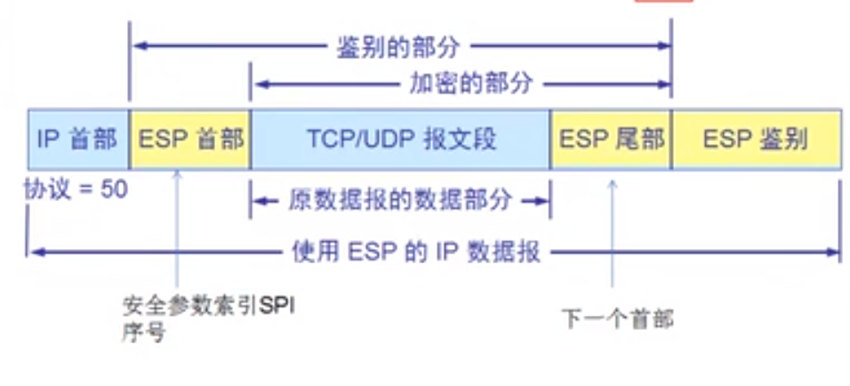

# 计算机网络

网络：许多计算机的连接

互联网：许多网络的互连

因特网：最大的互联网

多层次ISP结构——互联网服务提供商

为了提供足够快的服务，最好是访问网站的时候访问的是本地ISP。因此游戏公司需要进行网络的分区。

## 因特网的组成

### 边缘部分

主机间的通信方式：

1. 客户服务器方式（C/S）：客户机向服务主机发送请求
2. 对等方式（P2P）：计算机即作为客户机，又作为服务器。例如百度最近的下载，迅雷的下载

### 核心

1. 电路交换：电话——建立连接（申请通信资源）、通话（占用资源）、取消连接（释放资源）：适用于数据量大的实时性通信，核心路由
2. 报文交换：报文和分组的差别在于，报文不会对数据进行分段
3. 分组交换：因特网使用的方式：将发送的数据切分为多个段，并附加首部信息，分开传输，最终在接受段进行处理得到完整的信息。优点：高效，缺点：时延

### 性能

- 速率：主机在数字信道上传输数据位数的速率
- 带宽：数字信道所能传输的最大数据率
- 吞吐量：单位时间内通过某个网络的数据量
- 时延：数据块长度（比特）/带宽（比特/秒）——4种
- 时延带宽积：代表数据链路上能够承载的数据量
- 往返时间
- 利用率

## 体系结构

### OSI参考模型

1. 物理层：电压接口标准等
2. 数据链路层：负责物理上的互连和传输，添加MAC地址
3. 网络层：将数据传输到目标地址，负责寻址
4. 传输层：可靠传输，不可靠传输，流量控制
5. 会话层：负责建立和断开通信连接，以及数据分割
6. 表示层：数据加密以及数据格式问题，HTML协议
7. 应用层：为应用程序提供服务并规定应用程序中通信的细节

#### 网络排错

从底层到高层

#### 网络安全和OSI参考模型

物理层安全：

数据链路层安全：ADSL 无线AP

网络层安全：网段限制

应用层安全：SQL注入漏洞  上传漏洞

### TCP/IP模型

应用层

传输层

网络层

网络接口层

### 开放信息交换的概念

- 实体：交换信息的硬件或者软件
- 协议：控制两个对等实体通信的规则
- 服务：下层向上层提供服务
- 服务访问点：

## 物理层

解决了如何在连接计算机的传输媒体上传输比特流的方式，定义了接口的特性

通信方式：

单工通信：只能有一个方向的通信

半双工通信：通信双方都可以发送，但不能同时发送

双工通信：双方可以同时收发信息（打电话）

信道复用技术

1. 时分复用：将时间划分为不同的时间段，用户在各自的时间段内进行数据传递。
2. 频分复用：不同的用户使用不同的频带通信
3. 码分复用（CDMA）：不同的用户使用不同的码片进行发送，但必须保证不同用户的码片正交积为0

中继器：处在物理层，作用将电缆中的光信号或者电信号进行放大

## 数据链路层

链路：指一条点到点的物理线路段

数据链路：利用通信协议来控制链路中数据的传递

传送方式：帧，会在数据的头尾都添加帧的开始标志和结束标志

基本问题:

1. 封装成帧
   - 数据的头尾添加首部和尾部
   - 如果只能收到头部或者尾部，就会抛弃收到的数据
2. 透明传输
   - 用字节填充法解决透明传输问题，数据的头部和尾部一般用不可打印的字符作为标识，如果传输的数据中有这些不可打印字符，就会添加转移符
3. 差错控制
   - 循环冗余检验——二进制除法，除数是任意取的（但要比补的0多一位），做的是异或运算，不进行纠错处理，出错就抛弃。下面这个例子原来是101001，后面补了3个0.把001加到原来的数后面，最后的求余结果为0

### PPP协议——用于点对点的协议

点到点的线路协议

1. 简单
2. 透明性
3. 差错控制
4. 压缩传输

#### PPP协议帧格式

| 开始 | 目标地址 |      |      |                |      |      |
| ---- | -------- | ---- | ---- | -------------- | ---- | ---- |
| 7E   | FF       | 03   | 协议 | 信息部分       | FCS  | 7E   |
| 1    | 1        | 1    | 2    | 不超过1500字节 | 2    | 1    |

如果信息字段中出现0x7E，就会转变为0x7D和0x5E，如果出现0x7D，就会变成（0x7D，0x5D），如果信息字段中出现小于0x20的字符，就会在前面加入一个0x7D，这里的协议指的是首部的下一个协议的类型。

解决办法：对于同步传输的情况，就是数据传输时不是以8个字节为单位传输，那么数据帧中如果连续出现5个1，就会立刻插入一个0，接受端在连续接受5个1之后，会除去后面一个0.

### 局域网

特点：网络为一个单位所拥有，且地理范围和数目有限，具有一些优点。广播，可靠等

#### 以太网的通信协议

CSMA/CD协议——用于广播的通信

多点接入:许多计算机以多点接入的方式连接在一根总线上，发送数据时会传送给所有的以太网内的电脑

载波监听：每一个要发送的计算机在发送数据前先检测下链路上是否有其他计算机在发送信息（检测的是电压幅值）

使用CSMA/CD协议的以太网不能进行全双工通信，只能进行半双工通信。因为存在碰撞冲突（碰撞事件最长为2t,t为单向传输的时延）。以太网的最短有效帧长度为64字节，因为64字节是它可以检测出碰撞的最小长度。对于不足64字节的数据，需要补0

发生碰撞措施：需要推迟一个随机时间，基本的争用期为2t。之后会用一个随机数来确定一个随机倍数的时延。如果传了16次都传不了就会抛弃数据帧

以太网提供的是不可靠的服务，但发生数据丢失时，由两端的计算机来要求重发。

帧不能太短，通信线路不能太长

#### MAC地址

MAC地址一共48位，厂商的前3个字节（24位）指定厂家。后面的由厂家来设置，但必须保证没有重复

适配器检查MAC地址——适配器每从网络上收到一个MAC帧，就用硬件检查MAC帧中MAC地址，如果是发往本站的帧就收下，其他的丢弃

MAC帧不需要结束标志，与他的编码方式有关。最前面的8位字节是前导码，固定的，注意最少需要46字节，64-14-4

### 物理层的扩展（B站045）

使用集线器（网桥）进行连接。——会造成更大的冲突可能（载波监听那里）

网桥处在数据链路层中，作用是暂时将数据帧存储在内存中，在重新生成信号作为全新的帧转发给另外的网段

网桥具有自学习功能，会记录发送数据的计算机属于哪个接口，减少冲突

现在很少有网桥了，一般使用交换机，交换机的一个接口可以对应一个计算机，这样就没有冲突了，且具有存储的功能，实现数据排队

### 生成树算法

为了避免互联的网桥造成彼此通信之后导致的环路问题，会在网络中找到一个子集，该子集之中没有环路。通过禁用网桥的某些端口来达到消除环路问题的目的

生成树的根节点：先看优先级，之后再比较MAC地址，MAC小的做根。krusal算法，线路权重为带宽大小

### 虚拟局域网

LAN局域网——利用集线器连接起来的网络

VLAN虚拟局域网——指用网段来限制LAN上的网络的连接，实现上需要使用路由，u后者具有路由功能的交换机

## 网络层

服务：

虚电路服务：没有地址，但是物理上的链路是固定的（需要建立好连接，并确定终点地址，按发送的顺序进行通信），一旦线路断开就会导致通信断了。

数据报服务：需要地址，由路由器选择数据流通的路径，

目的：如何将分组从源端沿着网络路径送达目的端

网络互联设备：物理层中继：转发器，数据链路层：网桥，网络层：路由器；网络以上：网关（实现两个不能通信的协议之间的翻译，例如手机与互联网的通信）

### 网络层协议IP

**包括地址解析协议ARP，逆地址解析协议RARP，**

**网络控制报文协议ICMP：报告网络故障**

**网际组管理协议IGMP：**

IP协议是面向无连接的

国际控制报文协议

#### IP层次结构

层次IP地址将32位的IP地址分为网络ID和主机ID

##### IP地址分类

A类地址：0-127（127端的地址都不用，标识自己的环回地址），网络部分8位

B类地址：128-191，网络部分16位

C类地址：192-223，网络部分24位

特殊地址：169.254.0.0 windows的地址 127.0.0.1 环回地址  保留的私网地址 10.0.0.1 172.16.0.0-172.32.0.0 192.168.0.0-192.168.255.0

子网掩码：标识主机部分,主机位不允许全1或者全0，全1，广播，全0，掩码

CIDR：解决网络地址不够用的问题，使用不同的子网掩码

超网：将两个网段的网络合并为同一个网络，也是使用子网掩码来实现

#### IP地址与MAC地址

发送数据的时候需要再数据报文中添加IP首部以及硬件首部及尾部等。

网络转发的流程图

IP地址决定了数据报文的终点，MAC地址决定了数据转发的下一个目标，在上面的图示中，MAC地址在每一次转发的过程中都发生了变化，但是IP的终点没有变

#### ARP协议——不安全

由ARP协议将IP地址解析为MAC地址，仅用于ipv4

工作机制：ARP请求和ARP响应。主机A与主机B处在同一链路上，两者互相不知道对方的MAC地址，此时A主机通过广播向链路中发送想要了解MAC地址的IP的数据报，如果广播的链路中ip与请求包中包含的ip相同，就会把MAC地址存入ARP响应包中发送给主机A。

为什么必须要同时使用MAC和IP

1. 避免数据包被多个路由器进行转发
2. 避免对全世界的互联网进行广播造成的网路拥塞

#### RARP协议

将MAC地址解析为IP地址，用在一些嵌入式的设备当中，类似于DHCP

#### 数据首部

IP包首部固定有20字节必要信息，之后还有一些可变信息

版本：iPV4还是ipv6（ipv4为4，ipv6为6）   首部长度：首部的长度（单位4字节）  区分服务：网络传输是否紧急   总长度：数据报的总长度（最大65535）  标识：数据包的序号，自增1

标志（3比特，包括1位禁止分片标志位，1位未使用，1位标记是否位最后一个分片）：标志数据包是否被拆分过   片偏移：表示被拆分之后的包在原来的包中的偏移（片偏移以8字节为偏移单位）在以太网中最长的包可能是1500字节，如果IP数据包太长，就会进行拆分  生存时间：标识数据包在网络上可经过的路由器的最大数量，每经过一次路由器就减一，到0该包被放弃

协议：标识数据部分使用的协议   首部校验和：校验数据发包过程中首部是否有出错

#### IPv6

特点：

1. 地址范围扩大，且能够与路由控制表相结合
2. 性能提升，包首部固定40字节
3. 即插即用，不需要DHCP
4. 采用认证加密

标记方法：IPv6地址长度128位，一般用连续的16位为一组，每组间用：隔开，连续的0用：：隔开，但只允许出现一次，IPv6的前64位为网络位，后64位为主机位

#### 数据路由

路由器在不同网段转发书包，网络通畅的条件——能去能回 沿途的路由器必须直到目标网络下一跳给哪个接口

路由中存在路由控制表，记录了IP下一步应当发给哪个路由

#### ICMP

ICMP报文的种类有两种，即ICMP差错报告报文和ICMP询问报文。ICMP报文的前4字节是统一格式，共有三个字段：类型，代码和校验和，接着的4个字节与ICMP的类型有关

1. 不可达消息
2. 重定向消息（较少使用）
3. 超时消息
4. 回送消息

会抛弃IP数据报中数据部分除了前8个字节以外的部分，并在前面添加ICMP的8字节。

### 因特网的路由选择协议

#### 路径MTU发现

因为以太网中能够发送的数据包大小有限制，因此在发送IP数据包时，可能会导致对IP数据包的切分，切分之后，如果数据包出现丢失，会导致整个IP数据包的重发，造成资源浪费等问题。因此需要在网络中找到发送数据包时，使用到的最小的MTU（因为数据包不能决定最后会走的路径）。使用这个MTU来作为IP数据包的最大长度，这样就不需要对数据包进行切分了。

工作原理：发送端发送IP数据报时，将其首部的分片禁止标记设为1，根据这个标记，沿途的路由器遇到一个大的包也不会对其进行切分，而是直接将包丢弃，最后通过ICMP的不可达消息，将数据链路上的MTU发送给主机。之后发送端以该MTU作为当前MTU，对数据包进行分片处理，重复发送数据包直到不在收到ICMP的消息为止。

#### 静态路由与动态路由

静态：手动设定路由信息，动态：由路由器自己管理路由表

动态路由的实现：路由器向相邻的路由器转发自己已知的网络连接信息，其他的路由器也会转发这部分数据。

#### RIP协议

动态路由协议 将路由控制信息周期性广播，如果连续5个30秒（180秒）没收到某一路由的广播信息，就认为该路由不正常退出了，选择的标准是跳数（经过的路由器的数量）

故障的解决方式（换路问题）：

接收端不再把收到的数据原路返回给发送端

发送一个网络不可达的消息

#### OSPF协议

选择的标准是带宽，触发式更新，通过发送hello包来确认链路是否连接，通过数据库描述包互相发送路由摘要信息，为了避免数据库变得庞大，对网络和主机进行了区域化的处理。

#### BGP协议

不同自治系统的路由交换系统之间的协议，路径向量协议

BGP中数据包送达目标网络时，会生成一个中途经过的所有AS的编号列表，这个表格也称之为AS路径信息访问列表。如果对同一目标地址出现多条路径，那么BGP会从AS路径中选择一个较短的路由。

### IP多播

多播用于将包发送给特定组内的所有主机（就是从一个网段发送到另一网段），直接使用IP协议，不存在可靠传输，依赖MLD实现，

多播使用的是D类地址

### IP任播

110 119等

### 网络地址准换NAT

将本地网络中的私有地址转换为全局IP地址

NAT服务器中维持一个地址转换的表，记录转换后的源地址和目的地址，通过接受到的响应包的目的地址来区分转换的IP，如果内网多个IP访问同一个地址，就会对发送端的端口也进行转换，最后的转换结果如下：

source:1.1.1.1:1000  dst: 202.202.202.202

source:1.1.1.1:1001 dst:202.202.202.202

## 传输层

应用层：http https ftp DNS SMTP

传输层：TCP UDP

网络层：IP ICMP IGMP ARP

协议的应用场景：

1. TCP 分段 编号 流量控制 建立会话 netstat -n 文件传输
2. UDP 一个数据报就能完成数据通信 不建立会话

TCP与UDP是两个对等的协议,TCP传送的协议数据单元是TCP**报文段**，UDP传送的协议数据单元是UDP**报文**

### 传输层和应用层的关系

http=TCP+80

https=TCP+446端口

ftp=TCP+21

SMTP=TCP+25

POP3=TCP+110

RDP=TCP+3389

SQL=TCP+1433

DNS=UDP+53

利用端口来区分服务，更改端口来增加服务器安全，

协议+端口号+ip地址

### UDP协议

特点：

1. 面向无连接的协议
2. 没有控制机制，不提供流量控制等功能
3. 丢包不重发，如果需要这些功能只能够由UDP应用程序来实现

### TCP协议

1. TCP面向连接的传输协议
2. 每一条TCP协议只能有两个端点，每条TCP连接只能是点对点
3. TCP提供可靠交付的服务
4. TCP提供全双工通信
5. 面向字节流
6. 面向拥塞控制

TCP把连接作为最基本的抽象，每一条连接具有两个端点，连接的端点称之为套接字socket（IP+端口）

#### TCP如何实现可靠传输

##### 停止等待协议——自动重传请求

[网络学习笔记（二）：TCP可靠传输原理](https://juejin.im/post/6844903799253909512)

- 主要关注nagle算法
  - nagle算法要求在一个TCP连接上最多只能有一个未被确认的小分组，在该分组的确认到达之前不能发送其他分组。值得注意的是：并不是在收到确认之后立刻发送其他分组，TCP连接上允许不存在数据分组。TCP在未收到确认时收集这些零散的数据，当确认到达的时候，可以以一个报文段发送出去。确认到达的越快，数据发送的也就越快。

每发一个报就会等待一定的时间（RTT时间，之前的延迟时间的两倍），等待确认信息，如果时间内没等到，就会重发

确认丢失的情况

发生确认丢失的情况下，会进行重发以及抛弃重复地包

优点：简单，缺点：信道利用率低

##### 流水线传输——连续ARQ协议

需要维持一个固定长度的窗口，窗口中的数据包可以被发送，当收到响应数据包的确认时，就可以对窗口进行滑动，发送下一个包

接收方通常使用累计确认方式

可靠传输的实现方式：

1. 以字节为单位的滑动窗口技术——使用了累计确认的方式，在收到连续的一段数据时，只会发送确认号最大的那一个确认包，如果出现缺失数据收到后面的一部分数据的情况，那么也会发送之前收到的连续数据的确认号（B站119），并且发送的确认包中有sACK，表示只要发送缺失的包
2. 超时重传的机制：没法送一个报文，就会设置一个计时器，只要计时器设置的时间到了，而没有收到确认包，就要重传这一部分报文。RTT时间的计算  newRTT=（1-a）\*oldRTT+a\*newRTT

#### TCP如何实现流量控制

报文的首部字段

固定部分——20字节

源端口，目标端口：各占两个字节 序号：给每个包标号，该序号指的是数据的第一个字节是整个数据包中的第几个字节（4字节）

确认号：指的是需要的下一个包的起始的序号  数据偏移：指整个TCP首部的长度（4位2进制，最大为15，1代表4个字节，也就是首部最长60字节）

保留：未被使用  URG：插队标记为位，代表发送该数据包时，直接插队，例如需要中断文件传输时，发送的数据包  ACK：确定确认号是否有效，1标识确认号有效   SYN：用于同步，建立连接时使用 PSH：接收端收到一个带有PSH的包，会将该包放到最前，最快地提交给应用程序（URG和PSH的差别：URG用在发送端，PSH用在接收端）   RST：TCP连接出错，必须重新连接  FIN：数据通信结束的标记，释放连接

窗口：表示缓存能存放的字节数，包括接收缓存和发送缓存  校验和：校验首部和数据两部分  紧急指针：指明数据中的一些紧急部分，当URG为1时有效

DOS攻击：频繁发送一些建立连接的数据包，但是这些数据包的首部目标端口根本不存在

##### 流量控制的实现

当缓存被占满的时候，接收端要发送一个数据包告知发送端

实现：在发送确认包的时候，会动态地调整窗口的大小，实现控制，但是为了保证发送的确认包出现丢失时也能够正常工作，发送端也会定时地进行发送窗口确认的数据包。确定窗口大小

#### TCP如何避免网络拥塞

慢开始算法

发送端维持一个拥塞窗口cwnd，当发送端口能正常收到确认包时，就会增大发送窗口，刚开始地时候是2倍增大的，当窗口达到16（慢开始门限）的时候，就改为加法增大，一次增加1。如果出现了拥堵，就会重新计算门限，并从1开始重新增大，一开始也是2倍增大，在将要达到门限时，会直接设置为门限值（b站120）

快重传算法

当接受端发现有数据包丢失时，就会立即发送三个同样的确认包，要求重发丢失的包。此时发送端会计算门限，并从门限开始进行恢复。与慢回复不同的时，慢回复从1开始

#### TCP连接传输连接管理

##### 连接建立

三次握手：

第一次握手：syn=1 ack=0，seq=x

第二次握手：syn=1，ack=1，seq=y，ack=x+1

第三次握手：ack=1，**seq=x+1**，ack=y+1

上面这些确认号全都要会，还有客户端，服务端的状态

为什么一定要三次，不能两次：

原因在于有一种场景是，当客户端发送了一个建立连接的请求，如果该连接经过了较长的一段时间才能到达服务端，那么A会由于超时再发送一次建立连接的请求，此时B响应A的第二次请求，发送响应报文，建立了连接。之后原先A发送的建立连接的请求又到达B，B也会响应该请求，发送确认建立连接的报文，但是A因为已经建立了连接了，于是没有在连接上进行数据的传输，造成B服务器忙等，浪费资源

##### 数据传送

##### 连接释放

第一次：**FIN=1，seq=u**

第二次：**ACK=1，seq=v，ack=u+1**

第三次：**FIN=1，ACK=1，seq=w，ack=u+1**

第四次：**ACK=1，seq=u+1，ack=w+1**

最后的等待2MSL是为了保证在最后一个ack包发出去之后，如果这个包丢失，导致服务器重发FIN数据包时，能够响应

为什么建立连接是三次握手，关闭连接确是四次挥手呢？

建立连接的时候， 服务器在LISTEN状态下，收到建立连接请求的SYN报文后，把ACK和SYN放在一个报文里发送给客户端。
而关闭连接时，服务器收到对方的FIN报文时，仅仅表示对方不再发送数据了但是还能接收数据，而自己也未必全部数据都发送给对方了，所以己方可以立即关闭，也可以发送一些数据给对方后，再发送FIN报文给对方来表示同意现在关闭连接，因此，己方ACK和FIN一般都会分开发送，从而导致多了一次。

#### TCP三次握手的第三次的 ack包丢失会怎样？

##### **Server 端**

  第三次的ACK在网络中丢失，那么Server 端该TCP连接的状态为SYN_RECV,并且会根据 TCP的超时重传机制，会等待3秒、6秒、12秒后重新发送SYN+ACK包，以便Client重新发送ACK包。

  而Server重发SYN+ACK包的次数，可以通过设置/proc/sys/net/ipv4/tcp_synack_retries修改，默认值为5.

  如果重发指定次数之后，仍然未收到 client 的ACK应答，那么一段时间后，Server自动关闭这个连接。

##### **Client 端**

  在linux c 中，client 一般是通过 connect() 函数来连接服务器的，而connect()是在 TCP的三次握手的第二次握手完成后就成功返回值。也就是说 client 在接收到 SYN+ACK包，它的TCP连接状态就为 established （已连接），表示该连接已经建立。那么如果 第三次握手中的ACK包丢失的情况下，Client 向 server端发送数据，Server端将以 RST包响应，方能感知到Server的错误。

#### time_wait过多

只有首先调用close()发起主动关闭的一方才会进入TIME_WAIT状态，而且是必须进入，进入TIME_WAIT状态的TCP连接需要经过2MSL才能回到初始状态，其中，MSL是指Max Segment Lifetime，即数据包在网络中的最大生存时间。当连接处于2MSL等待阶段时，任何迟到的报文段都将被丢弃。在 TIME_WAIT 状态时，两端的端口不能使用，要等到2MSL时间结束，才可继续使用。（IP 层）

 **TIME_WAIT状态存在的原因主要有两点：**

 1）为实现TCP这种全双工（full-duplex）连接的可靠释放

- 四次挥手的机制

 2）为使旧的数据包在网络因过期而消失

- 如果不存在time_wait机制，那么当一条新的连接建立的时候，可能会收到上一条相同的tcp连接发来的数据，由于tcp无法区分两个完全一样的连接，就可能会把这些过期的数据发到上层，导致问题

过多的原因：

主要出现在高并发环境下，使用大量短链接的情况，例如http里connection设置为close。这样的情况下会导致大量的连接处于time_wait状态

解决

1. 使用长连接
2. 缩短time_wait的时间
3. 回收time_wait的链接

## 应用层

### DNS服务

将域名解析为ip地址

根

顶级域名 com edu net cn org gov

二级域名  baidu（个人可申请）

三级域名 dba

配置自己的DNS服务器

1. 解析内网的域名资源
2. 降低域名解析流量
3. 域环境

#### DNS查询过程

主机向DNS服务器查询IP地址，如果DNS服务器本地有缓存就直接返回，如果没有就向根服务器发起查询请求，由根服务器在下面的服务器上进行ip查询。

静态IP地址

每一台主机都有固定的IP地址

动态IP地址

### DHCP协议

DHCP服务器从地址池中选择一个地址交给用户，用户之后确认选择收到的IP地址，未被选择的地址就被DHCP服务器回收。DHCP给出IP地址是有时间限制的，当达到时间限制的时候就会进行续约或者收回

跨网段的DHCP服务

工作流程：

1. 管理员配置DHCP的可分配IP地址，子网掩码以及默认路由
2. 发送要求设置IP地址和子网掩码的数据包，由DHCP服务器响应并发送可以使用的网络设置
3. 客户端发送确认包，最后DHCP服务器再次确认
4. 多个IP地址出现冲突时，可以让DHCP服务器在分配地址前，发送ICMP请求包，确保没有返回应答，客户端拿到IP地址后，发送ARP请求包，确保没有响应

### FTP协议

使用TCP协议的21端口来建立连接，建立会话之后，该链接作为控制连接，表示文件上传是作为上传，删除还是下载，复制这些命令。需要一个新的TCP的数据连接来进行真正的数据传输

主动模式：ftp客户端告知服务器使用的侦听端口，ftp服务器就与客户端的端口建立连接，源端口是20，主动模式需要防火墙打开21端口和20端口

被动模式：tfp服务器告知客户端打开的端口，客户端与被打开的端口建立连接

FTP的交互命令使用ascii码，包括控制命令以及状态响应码等

### TELNET远程终端协议

使用TCP协议的一条连接，通过该链接向主机发送文字命令并在主机上执行。

### ssh协议

与telnet类似，但是提供加密服务，确保安全，并且可以实现转发文件

### RDP协议

### HTTP协议

### WEB代理

1. 节省内网访问internet的带宽
2. 通过web代理绕过防火墙

### 电子邮件协议SMTP-TCP25端口

中间有一个中继，收发邮件都需要身份验证

早期的邮件传输要求两端计算机能够建立TCP连接，现在的邮件服务有一个专门的邮件服务器，该邮件服务器实现邮件转发功能，发送端和接收端通过该服务器实现邮件的收发功能。

#### MIME协议

早期的邮件仅能够传递文字，利用MIME协议可以实现画面，声音等的传递，MIME协议是表现层的协议

## 网络安全

### 威胁

1. 截获——从网络上窃听他人的通信内容
2. 中断——有意中断他人在网络上的通信
3. 篡改——故意篡改报文
4. 伪造——伪造信息在网络上传播

### 加密技术

#### 对称加密——加密密钥和解密密钥是同一个

优点：效率高，缺点：秘钥不适合在网上传播，维护困难

#### 非对称加密

加密秘钥和解密密钥是不同的，秘钥对 公钥和私钥

密钥加密私钥解密

私钥加密公钥解密

细节：因为非对称加密的加密效率比较低，因此在实际使用是，持有公钥的一方可以先采用对称加密的方式，产生一个秘钥来加密文件，之后用非对称加密的方式加密产生的秘钥，把加密过的密文和加密过的密码一起传给持有私钥的一方

### 数字签名

### 安全套接字——internet上的安全协议

SSL安全套接字——用在http协议上就是https，TCP使用的接口是443接口

### 网络层安全

ESP协议

AH协议

### 数据链路层的安全

在数据链路上进行加密

### 防火墙

## 互联网音频视频传输

音频视频占用的带宽高，要求网速恒定，延迟低

数据信息对带宽，网速是否恒定，延迟等的要求不高

延迟：对于非交互式的音频视频影响不大

带宽：互联网的带宽不稳定（拥塞控制导致的），通过播放器中实现一个缓存来解决

三种方式：

流式音频/视频——边下边播，流媒体服务器，具有加密功能，无法下载

流式实况音频/视频——边录制边发送，通过网络现场直播

交互式音频/视频——实现交互式通信

# 面试：

[计算机网络面试总结](https://www.cnblogs.com/zhxmdefj/p/12613065.html)

## TCP&UDP

TCP（Transmission Control Protocol，传输控制协议）是面向连接的协议，也就是说，**在收发数据前，必须和对方建立可靠的连接。** 一个TCP连接必须要经过三次“对话”才能建立起来。

1. 主机A向主机B发出连接请求数据包：“我想给你发数据，可以吗？”，这是第一次对话；
2. 主机B向主机A发送同意连接和要求同步 （同步就是两台主机一个在发送，一个在接收，协调工作）的数据包 ：“可以，你什么时候发？”，这是第二次对话；
3. 主机A再发出一个数据包确认主机B的要求同步：“我现在就发，你接着吧！”， 这是第三次对话。

三次“对话”的目的是使数据包的发送和接收同步， 经过三次“对话”之后，主机A才向主机B正式发送数据。

### 三次握手

1. 主机A通过向主机B发送一个**含有同步序列号（SYN）的标志位的数据段**，向B请求建立连接，通过这个数据段， A告诉B两件事：我想要和你通信；你可以用这个序列号作为起始数据段来回应我。
2. B收到A的请求后，用一个带有**确认应答（ACK）和同步序列号（SYN）标志位的数据段**响应A，也告诉A两件事：我已收到请求了，你可以传输数据了；你要用这个序列号作为起始数据段来回应我。
3. A收到这个数据段后，再发送一个**确认应答（ACK）**，确认已收到B的数据段：**已收到回复，现在要开始传输实际数据了**，这样3次握手就完成了，主机A和主机B就可以传输数据了。

**没有应用层的数据**，SYN这个标志位只有在TCP建立连接时才会被置1，握手完成后SYN标志位被置0。

### 四次挥手

1. 当**A**完成数据传输后，将控制位FIN置1，提出停止TCP连接的请求；
2. **B**收到FIN后对其作出响应，确认这一方向上的TCP连接将关闭，将ACK置1；
3. 由**B**端再提出反方向的关闭请求，将FIN置1；
4. **A**对**B**的请求进行确认，将ACK置1，双方向的关闭结束。

由TCP的三次握手和四次断开可以看出，TCP使用**面向连接的通信方式**， 大大提高了数据通信的可靠性，使发送数据端和接收端在数据正式传输前就有了交互， 为数据正式传输打下了可靠的基础。

1. ACK 是 TCP 报头的控制位之一，对数据进行确认。确认由目的端发出， 用它来**告诉发送端这个序列号之前的数据段都收到了**。只有当 ACK=1 时,确认号才有效，当ACK=0时，确认号无效，这时会要求重传数据，保证数据的完整性。
2. SYN 同步序列号，TCP 建立连接时将这个位置 1。
3. FIN 发送端完成发送任务位，当 TCP 完成数据传输需要断开时，**提出断开连接的一方将这位置1**。

### UDP 与 TCP 对比

1. **TCP 面向连接**，需要三次握手，四次挥手。**UDP 是无连接的**，即发送数据之前不需要建立连接，直接丢过去。
2. TCP 提供可靠的服务，通过 TCP 连接传送的数据，无差错、不丢失、不重复，且按序到达。UDP 尽最大努力交付，即不保证可靠交付。
3. TCP 面向字节流，实际上是 **TCP 把数据看成一连串无结构的字节流**。UDP 是面向报文的，**UDP 没有拥塞控制**，因此网络出现拥塞不会使源主机的发送速率降低（对实时应用很有用，如 IP 电话，实时视频会议等)。
4. 每一条 **TCP 连接只能是点到点的**，**UDP 支持一对一，一对多，多对一和多对多**的交互通信。
5. TCP 首部开销20字节，UDP 的首部开销小，只有8个字节。
6. TCP 的逻辑通信信道是**全双工**的可靠信道，UDP 则是不可靠信道。

### UDP 的应用场景

UDP 不属于连接型协议，因而具有**资源消耗小，处理速度快**的优点，所以通常**音频、视频和普通数据**在传送时使用UDP 较多，因为它们即使偶尔丢失一两个数据包，也不会对接收结果产生太大影响。比如我们聊天用的 QQ 就是使用的UDP 协议，直播中也可以用 UDP。

#### QQ

> QQ 并不是端对端的聊天软件，是得经过服务器转发消息的，通过 QQ 聊天，数据是 A 发到服务器，服务器再转发到 B。

每一个 QQ 客户端之间的交互，实际上都是和服务器交互，再由服务器转发给正在通信的用户。
如果每一个 QQ 用户从一上线到下线的这段时间全部采用 TCP 长连接，对服务器的负担很大；而如果采用 TCP 短连接，频繁的连接断开也会造成网络负担。而采用 UDP 则可以避开上述麻烦，减少服务器的负担。

登陆成功之后，QQ 都会有一个 TCP 连接来保持在线状态。QQ 采用的通信协议以 UDP 为主，辅以 TCP 协议。QQ 的服务器要同时容纳十几万的并发连接，因此服务器端只有采用 UDP 协议与客户端进行通讯才能保证这种超大规模的服务。

QQ 客户端之间的消息传送也采用了 UDP 模式，因为国内的网络环境非常复杂，而且很多用户采用的方式是通过代理服务器共享一条线路上网的方式，在这些复杂的情况下，客户端之间能彼此建立起来 TCP 连接的概率较小，严重影响传送信息的效率。而UDP 包能够穿透大部分的代理服务器，因此 QQ 选择了 UDP 作为客户之间的主要通信协议。**采用 UDP 协议，通过服务器中转方式。**因此，现在的 IP 侦探在你仅仅跟对方发送聊天消息的时候是无法获取到IP的。

大家都知道，UDP 协议是不可靠协议，它只管发送，不管对方是否收到的，但它的传输很高效。但是作为聊天软件，怎么可以采用这样的不可靠方式来传输消息呢？于是，腾讯采用了上层协议来保证可靠传输：**如果客户端使用 UDP 协议发出消息后，服务器收到该包，需要使用 UDP 协议发回一个应答包**，如此来保证消息可以无遗漏传输。之所以会发生在客户端明明看到"消息发送失败"但对方又收到了这个消息的情况，就是因为客户端发出的消息服务器已经收到并转发成功，但客户端由于网络原因没有收到服务器的应答包引起的。

### 如何实现UDP保证有序传输

- 发送：包的分片、包确认、包的重发
- 接收：包的调序、包的序号确认

建立缓冲区，由一个线程专门接受数据并且重排，但是这个是在UDP的基础上自己实现部分简单的TCP。即收到数据包检查无误后返回一个应答。如果发送端在一定时间内没有收到应答，就自动重发。

目前已有如下开源程序利用 UDP 实现了可靠的数据传输，分别为：RUDP、RTP、UDT

## 在浏览器中输入网址

- 查找域名对应的IP地址。这一步会依次查找浏览器缓存，系统缓存，路由器缓存，ISPDNS缓存，根域名服务器
- 浏览器向IP对应的web服务器发送一个HTTP请求
- 服务器响应请求，发回网页内容
- 浏览器解析网页内容

# 【腾讯Bugly干货分享】从0到1打造直播 App

https://zhuanlan.zhihu.com/p/23320475